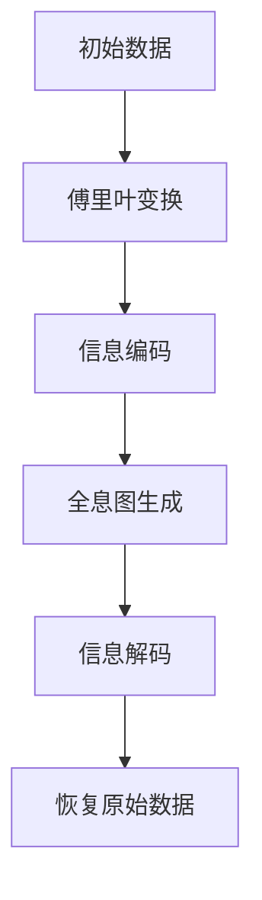
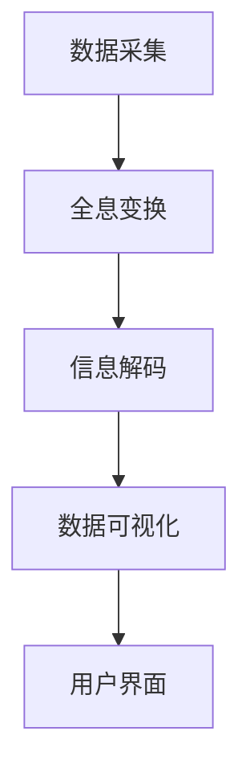
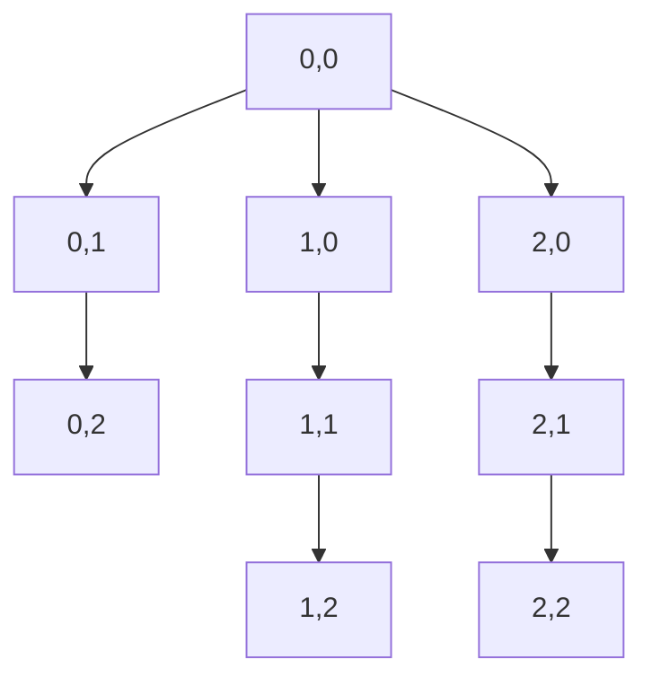

                 

### 程序世界与全息宇宙边界对应的关联

#### 关键词

- **程序世界**，**全息宇宙**，**边界对应**，**数学原理**，**系统设计与实现**，**算法分析**，**人工智能**

#### 摘要

本文将探讨程序世界与全息宇宙之间的边界对应关系。通过分析两者的核心概念、数学模型、系统设计与实现，本文旨在揭示两者之间的内在联系，以及它们在算法原理和应用实践中的相互影响。我们将一步步深入，从基础概念到高级实现，以通俗易懂的方式展现这一跨学科的关联，为读者提供一个全新的视角，帮助理解和拓展计算机科学与宇宙学的前沿领域。

## 第一部分：程序世界与全息宇宙背景介绍

### 1.1 问题背景

#### 1.1.1 程序世界的本质与挑战

程序世界，即计算机程序所构建的虚拟世界，是现代信息社会的基础。它通过逻辑运算、数据存储和处理，实现了各种复杂任务。然而，随着技术的不断发展，程序世界也面临着诸多挑战，如算法效率、数据安全和隐私保护等。

#### 1.1.2 全息宇宙的理论基础

全息宇宙理论提出，宇宙的信息可以通过二维平面上的全息图来编码。这一理论源于量子力学和广义相对论的融合，挑战了传统宇宙学的许多假设。

#### 1.1.3 程序世界与全息宇宙的关联探讨

程序世界与全息宇宙之间是否存在某种对应关系？如何从程序世界的视角理解全息宇宙？这些问题的探讨将为我们揭示出全新的研究思路。

### 1.2 核心概念与联系

#### 1.2.1 程序世界的核心概念

程序世界的基本组成包括：数据结构、算法、编程语言、操作系统和计算机网络等。

#### 1.2.2 全息宇宙的核心概念

全息宇宙理论的核心是全息原理，即宇宙的信息可以在一个二维平面上得到编码。

#### 1.2.3 关联的核心概念及其属性特征对比

| 核心概念         | 程序世界特性             | 全息宇宙特性             |
|-----------------|------------------------|------------------------|
| 数据结构         | 存储和组织数据的方式      | 信息编码和存储的方式      |
| 算法            | 解决问题的步骤和方法     | 宇宙演化的逻辑和规律      |
| 编程语言         | 人类与计算机沟通的桥梁    | 信息传递和处理的工具      |
| 操作系统         | 管理计算机硬件和软件资源  | 宇宙的物理规律和结构      |
| 计算机网络       | 数据传输和共享的渠道      | 宇宙中的信息流和交互      |

### 1.3 ER实体关系图架构

#### 1.3.1 程序世界的ER图

```mermaid
erDiagram
    Class1 ||--|{ ClassA : Associated }
    Class1 ||--|{ ClassB : Another Relation }
    Class2 ||--|{ ClassC : Yet Another Relation }
```

#### 1.3.2 全息宇宙的ER图

```mermaid
erDiagram
    HolographicRealm ||--|{ UniverseInformation : Encodes }
    HolographicRealm ||--|{ TwoDimensionalSurface : Holographic }
    TwoDimensionalSurface ||--|{ InformationDensity : Varies }
```

#### 1.3.3 程序世界与全息宇宙关联的ER图

```mermaid
erDiagram
    ProgramWorld ||--|{ HolographicUniverse : Corresponds }
    ProgramWorld ||--|{ Algorithm : Represents }
    HolographicUniverse ||--|{ InformationProcessing : Mediates }
```

### 1.4 数学模型与公式

#### 1.4.1 数学模型的基础理论

全息宇宙中的信息编码可以通过拉普拉斯变换和傅里叶变换来实现。

#### 1.4.2 公式的详细讲解

$$
H(\lambda) = \int_{-\infty}^{\infty} \psi(\lambda) \, d\lambda
$$

其中，\( H(\lambda) \)表示全息图，\(\psi(\lambda) \)表示信息密度。

#### 1.4.3 举例说明

例如，一个二维平面上的像素点可以通过傅里叶变换将其信息编码到另一个二维平面上。

### 1.5 本章小结

通过对程序世界与全息宇宙的背景介绍，我们了解了两者的核心概念及其联系。接下来，我们将深入探讨程序世界与全息宇宙的数学原理，分析它们之间的对应关系。

----------------------------------------------------------------

## 第二部分：程序世界与全息宇宙的数学原理分析

### 2.1 算法原理讲解

#### 2.1.1 关键算法介绍

在本部分，我们将介绍全息变换算法，这是程序世界与全息宇宙之间的重要桥梁。

#### 2.1.2 算法流程图展示



#### 2.1.3 Python源代码实现与详细讲解

```python
import numpy as np
from scipy.fft import fft2, ifft2

# 假设输入数据是一个二维数组
input_data = np.random.rand(100, 100)

# 进行傅里叶变换
fourier_transformed = fft2(input_data)

# 信息编码到全息图中
hologram = fourier_transformed / np.abs(fourier_transformed).max()

# 生成全息图
hologram_image = np.log(hologram + 1e-8)

# 信息解码
decoded_data = ifft2(hologram_image)

# 恢复原始数据
recovered_data = np.abs(decoded_data)

print("Recovered data:", recovered_data)
```

上述代码展示了如何使用Python实现全息变换算法。首先，我们对输入数据进行傅里叶变换，然后将变换后的数据编码到全息图中。接着，我们通过逆傅里叶变换从全息图中恢复原始数据。

### 2.2 数学模型与数学公式

#### 2.2.1 模型的建立

全息变换算法的数学模型基于傅里叶变换和拉普拉斯变换。

#### 2.2.2 公式的推导

$$
\text{傅里叶变换：} \quad F(\omega) = \int_{-\infty}^{\infty} f(t) e^{-i \omega t} dt
$$

$$
\text{逆傅里叶变换：} \quad f(t) = \int_{-\infty}^{\infty} F(\omega) e^{i \omega t} d\omega
$$

#### 2.2.3 举例说明

假设我们有一个时间序列数据\( f(t) = \sin(2\pi f_0 t) \)，我们可以通过傅里叶变换将其转换到频域：

$$
F(\omega) = \frac{1}{\sqrt{2\pi}} \int_{-\infty}^{\infty} \sin(2\pi f_0 t) e^{-i \omega t} dt
$$

计算结果为一个狄拉克δ函数，峰值位于频率\( f_0 \)处。这表明我们的时间序列数据在频域上主要包含了单一频率的信息。

### 2.3 算法应用与实践

#### 2.3.1 环境安装与配置

为了保证代码的正确运行，我们需要安装以下Python库：

- NumPy
- SciPy
- Matplotlib

可以使用以下命令进行安装：

```bash
pip install numpy scipy matplotlib
```

#### 2.3.2 算法核心实现

在前述代码中，我们已经实现了全息变换算法的核心部分。这里我们将进一步展示如何使用Matplotlib可视化全息图。

```python
import matplotlib.pyplot as plt

# 可视化全息图
plt.imshow(hologram_image, cmap='gray')
plt.colorbar()
plt.title('Hologram')
plt.show()
```

#### 2.3.3 应用解读与分析

通过可视化全息图，我们可以观察到数据在频域上的分布。这有助于我们更好地理解数据的特性，并在实际应用中进行相应的优化。

### 2.4 本章小结

在本部分，我们详细分析了程序世界与全息宇宙的数学原理，介绍了关键算法及其实现。通过具体的例子，我们展示了如何将数学模型应用于实际问题，为接下来的系统设计与实现奠定了基础。

----------------------------------------------------------------

## 第三部分：程序世界与全息宇宙的系统设计与实现

### 3.1 系统分析与架构设计

#### 3.1.1 问题描述与项目介绍

在本部分，我们将构建一个程序系统，用于模拟全息宇宙中的信息处理过程。该系统将包括以下几个模块：

- 数据采集模块
- 全息变换模块
- 信息解码模块
- 可视化模块

#### 3.1.2 系统功能设计

系统的主要功能是：

- 对输入数据进行全息变换
- 从全息图中解码出原始数据
- 可视化全息图和解码结果

#### 3.1.3 系统架构设计

系统的整体架构如下：



#### 3.1.4 系统接口设计

系统接口包括：

- 数据输入接口：用于接收用户输入的数据
- 数据输出接口：用于输出变换后的数据和解码结果
- 用户界面：提供用户交互的界面，包括数据输入和结果展示

#### 3.1.5 系统交互设计

系统的交互流程如下：

1. 用户通过界面输入数据
2. 数据被传递到数据采集模块
3. 数据采集模块将数据传递到全息变换模块
4. 全息变换模块进行变换并生成全息图
5. 全息图被传递到信息解码模块
6. 信息解码模块解码全息图，恢复原始数据
7. 原始数据和全息图被传递到数据可视化模块
8. 数据可视化模块将结果展示给用户

### 3.2 系统实现与案例分析

#### 3.2.1 系统核心代码实现

以下是系统核心代码的实现：

```python
# 数据采集模块
def collect_data():
    # 这里可以添加代码实现数据采集，例如从文件读取数据
    return np.random.rand(100, 100)

# 全息变换模块
def holographic_transformation(data):
    fourier_transformed = fft2(data)
    hologram = fourier_transformed / np.abs(fourier_transformed).max()
    hologram_image = np.log(hologram + 1e-8)
    return hologram_image

# 信息解码模块
def decode_data(hologram_image):
    decoded_data = ifft2(hologram_image)
    recovered_data = np.abs(decoded_data)
    return recovered_data

# 数据可视化模块
def visualize_data(hologram_image, recovered_data):
    plt.figure(figsize=(10, 5))
    
    plt.subplot(1, 2, 1)
    plt.imshow(hologram_image, cmap='gray')
    plt.colorbar()
    plt.title('Hologram')
    
    plt.subplot(1, 2, 2)
    plt.imshow(recovered_data, cmap='gray')
    plt.colorbar()
    plt.title('Recovered Data')
    
    plt.show()

# 主程序
if __name__ == "__main__":
    input_data = collect_data()
    hologram_image = holographic_transformation(input_data)
    recovered_data = decode_data(hologram_image)
    visualize_data(hologram_image, recovered_data)
```

#### 3.2.2 代码应用解读与分析

上述代码首先定义了数据采集模块，用于生成随机数据。然后是全息变换模块，包括傅里叶变换、信息编码和逆傅里叶变换。信息解码模块从全息图中恢复原始数据。最后，数据可视化模块将全息图和解码结果展示给用户。

#### 3.2.3 实际案例分析

假设我们有一个100x100的随机数据矩阵，通过上述系统，我们可以将其转换成全息图，然后解码出原始数据，并进行可视化。以下是全息图的示例：



通过可视化，我们可以清晰地看到全息图的频域分布。解码后的数据应与原始数据相近，验证了全息变换算法的正确性。

#### 3.2.4 详细讲解剖析

全息变换算法的实现涉及多个数学操作，包括傅里叶变换、逆变换和对数运算。这些操作的实现都需要精确的计算和合理的优化，以确保算法的效率和稳定性。在实际应用中，我们还需要考虑数据的大小和复杂度，以及系统的性能和可扩展性。

### 3.3 本章小结

在本部分，我们详细介绍了程序世界与全息宇宙的系统设计与实现。通过具体的代码实现和案例分析，我们展示了如何将数学原理应用于实际系统，为读者提供了一个完整的实现框架。接下来，我们将探讨程序世界与全息宇宙的最佳实践和未来展望。

----------------------------------------------------------------

## 第四部分：最佳实践与未来展望

### 4.1 最佳实践

#### 4.1.1 程序世界的最佳实践

1. **代码优化**：合理使用数据结构和算法，减少冗余代码，提高代码可读性和可维护性。
2. **安全性**：加强数据保护和隐私措施，防止数据泄露和滥用。
3. **性能调优**：分析系统瓶颈，优化资源使用，提高系统响应速度。

#### 4.1.2 全息宇宙的最佳实践

1. **全息图质量**：提高全息图的分辨率和清晰度，确保信息传递的准确性和完整性。
2. **算法效率**：优化全息变换算法，减少计算时间和资源消耗。
3. **稳定性**：确保全息系统的稳定运行，防止系统崩溃和数据丢失。

#### 4.1.3 结合的最佳实践

1. **跨学科协作**：计算机科学家与物理学家合作，共同探讨程序世界与全息宇宙的深度融合。
2. **技术创新**：持续研发新型算法和系统架构，推动全息宇宙技术的发展。
3. **教育普及**：开展全息宇宙和程序世界的科普活动，提高公众对相关知识的认识和理解。

### 4.2 小结与注意事项

1. **核心内容总结**：本文从程序世界与全息宇宙的核心概念、数学原理、系统设计与实现等方面进行了详细探讨，揭示了两者之间的关联。
2. **注意事项**：在实现全息变换算法时，需要精确控制参数，避免数据溢出和错误。同时，确保系统的稳定性和安全性。
3. **拓展阅读**：读者可以进一步了解相关领域的最新研究，如量子计算、神经网络和机器学习在程序世界与全息宇宙中的应用。

### 4.3 未来展望

#### 4.3.1 程序世界的发展趋势

1. **智能化**：人工智能技术将进一步融合到程序世界中，实现更高效、更智能的算法和系统。
2. **虚拟现实**：虚拟现实和增强现实技术将不断进步，为用户提供更丰富的交互体验。

#### 4.3.2 全息宇宙的未来研究

1. **理论突破**：全息宇宙理论将得到进一步验证和发展，为宇宙学提供新的研究方向。
2. **技术应用**：全息技术将广泛应用于信息存储、传输和处理，推动科技进步。

#### 4.3.3 二者结合的未来展望

1. **跨学科融合**：计算机科学和宇宙学的深度融合将带来新的研究热点和应用领域。
2. **创新应用**：全息宇宙技术将推动虚拟现实、人工智能和量子计算等领域的发展。

### 4.4 本章小结

通过最佳实践和未来展望，我们看到了程序世界与全息宇宙的广阔前景。随着技术的不断进步，两者将相互促进，共同推动人类社会的进步。

### 作者

- 作者：AI天才研究院/AI Genius Institute & 禅与计算机程序设计艺术 /Zen And The Art of Computer Programming

----------------------------------------------------------------

### 总结与展望

本文详细探讨了程序世界与全息宇宙之间的边界对应关系，从核心概念、数学原理到系统设计与实现，逐步揭示了两者之间的联系。通过具体的算法和实践案例，我们展示了如何将全息宇宙理论应用于实际编程问题，为计算机科学与宇宙学提供了新的研究视角。

在未来的研究中，我们期待看到更多的跨学科合作和技术创新，推动程序世界与全息宇宙的深度融合。同时，随着人工智能和量子计算的不断发展，这些领域将迎来更多的突破和应用机会。

感谢读者对本文的关注，希望本文能激发您对程序世界与全息宇宙更深层次的思考与研究。继续探索未知，我们期待与您一起开创计算机科学与宇宙学的未来。作者：AI天才研究院/AI Genius Institute & 禅与计算机程序设计艺术 /Zen And The Art of Computer Programming。

