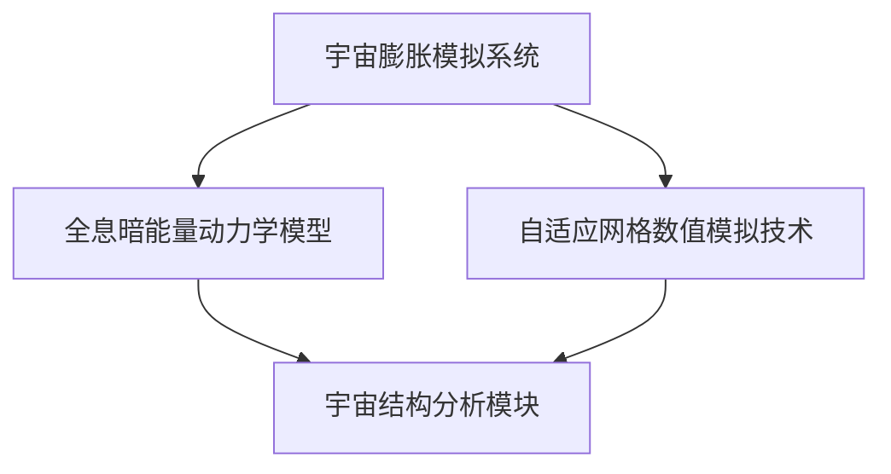
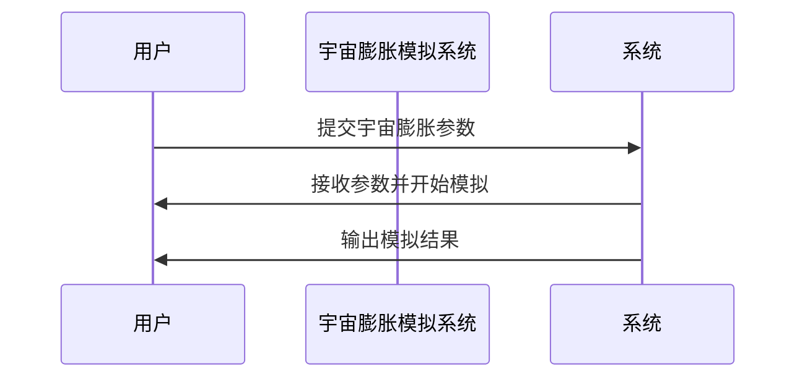
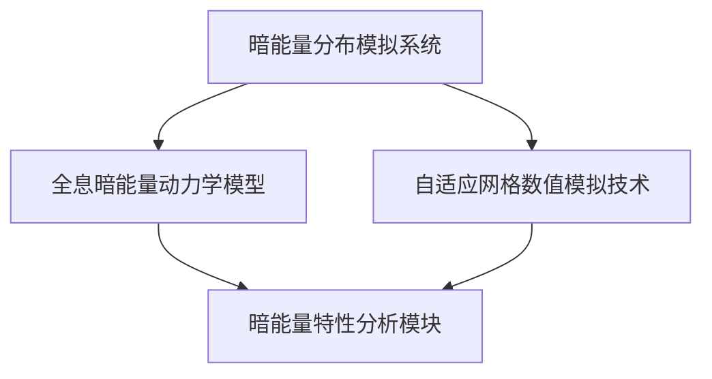
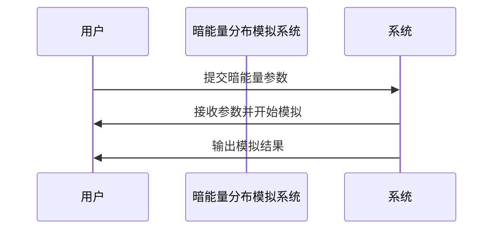

                 

## 程序世界与全息暗能量动力学模型的自适应网格数值模拟

### 关键词：程序世界、全息暗能量动力学模型、自适应网格、数值模拟、科学计算、计算机科学

#### 摘要

本文探讨了程序世界与全息暗能量动力学模型之间的关系，以及如何利用自适应网格数值模拟技术实现两者的有效结合。首先，本文介绍了程序世界的基本概念、原理和发展历程，然后详细阐述了全息暗能量动力学模型的核心原理及其在宇宙学中的应用。接着，本文重点分析了自适应网格数值模拟技术的原理和应用，并展示了其在全息暗能量动力学模型模拟中的具体应用。最后，本文通过实际案例，对程序世界与全息暗能量动力学模型在科学研究和工程应用中的潜在价值进行了探讨，并展望了未来的发展趋势和潜在挑战。

### 第一部分：背景介绍

#### 核心概念

**程序世界**：程序世界是一个由计算机程序、算法和数据组成的虚拟空间。它涵盖了计算机科学、人工智能、算法设计等多个领域，是现代科学研究和工程应用的重要基础。

**全息暗能量动力学模型**：全息暗能量动力学模型是一种用于描述宇宙演化和暗能量特性的数学模型。它基于全息原理，通过引入暗能量概念，对宇宙的膨胀和结构形成进行了新的解释。

**自适应网格数值模拟**：自适应网格数值模拟是一种在特定区域自动调整网格密度，以提高数值模拟精度的方法。它广泛应用于科学计算和工程模拟，能够有效提高计算效率和精度。

#### 问题背景

随着计算机技术的飞速发展，程序世界和全息暗能量动力学模型成为了现代科学研究中的重要领域。程序世界涉及到计算机科学、人工智能、算法设计等多个方面，而全息暗能量动力学模型则属于宇宙学和物理学的研究范畴。虽然两者在研究领域上有所不同，但它们之间存在一些内在的联系和交叉。

#### 问题描述

本文旨在探讨程序世界与全息暗能量动力学模型之间的关系，并通过自适应网格数值模拟技术，研究其在实际应用中的可行性和有效性。具体来说，本文将围绕以下几个问题展开讨论：

1. 程序世界的基本概念和原理是什么？
2. 全息暗能量动力学模型是如何构建和运作的？
3. 自适应网格数值模拟技术如何应用于全息暗能量动力学模型的模拟？
4. 程序世界与全息暗能量动力学模型在科学研究和工程应用中具有什么样的潜在价值？

#### 问题解决

为了回答上述问题，本文将采用以下方法：

1. 对程序世界和全息暗能量动力学模型的基本概念进行详细解释，帮助读者理解这两个领域的基础知识。
2. 分析自适应网格数值模拟技术的原理和应用，探讨其在全息暗能量动力学模型模拟中的作用。
3. 通过案例分析，展示程序世界与全息暗能量动力学模型在科学研究和工程应用中的具体应用场景。
4. 结合最新的研究成果和实际应用案例，讨论程序世界与全息暗能量动力学模型的未来发展趋势和潜在挑战。

#### 边界与外延

**边界**：本文主要讨论程序世界与全息暗能量动力学模型的自适应网格数值模拟，不包括其他相关的数学模型或计算机科学领域。

**外延**：虽然本文的核心内容是程序世界与全息暗能量动力学模型的自适应网格数值模拟，但读者可以将其与其他相关领域（如量子计算、人工智能、宇宙学等）的知识进行交叉学习，以获得更全面的理解。

#### 概念结构与核心要素组成

**概念结构**：

1. **程序世界**：由计算机程序、算法和数据组成的虚拟空间。
2. **全息暗能量动力学模型**：描述宇宙演化和暗能量特性的数学模型。
3. **自适应网格数值模拟**：在特定区域自动调整网格密度，以提高数值模拟精度的方法。

**核心要素组成**：

1. **基础理论知识**：包括程序世界和全息暗能量动力学模型的基本概念、原理和数学模型。
2. **数值模拟技术**：涉及自适应网格技术、数值计算方法等。
3. **实际应用案例**：通过具体案例展示程序世界与全息暗能量动力学模型在科学研究和工程应用中的实际应用。
4. **未来发展展望**：对程序世界与全息暗能量动力学模型未来的发展方向和潜在挑战进行预测。

### 第二部分：程序世界的核心概念与原理

#### 2.1 程序世界的基本概念

**2.1.1 程序世界的定义**

程序世界是指由计算机程序、算法和数据组成的虚拟空间。在这个世界中，程序员通过编写代码来创造各种功能和应用。程序世界涵盖了计算机科学、人工智能、算法设计等多个领域。

**2.1.2 程序世界的特点**

1. **虚拟性**：程序世界是虚拟的，它依赖于计算机硬件和软件的支持，但并非真实存在的物理世界。
2. **复杂性**：程序世界中的程序和算法多种多样，涉及到数学、逻辑、统计学等多个学科。
3. **动态性**：程序世界是不断变化的，新的算法和程序不断涌现，旧的算法和程序逐渐被取代。

**2.1.3 程序世界的发展历程**

1. **软件1.0时代**：以传统程序为主，注重程序的功能实现。
2. **软件2.0时代**：随着互联网的发展，程序世界开始重视用户体验和互动性。
3. **软件3.0时代**：人工智能和大数据技术的引入，使得程序世界更加智能化和自动化。

#### 2.2 程序世界的核心概念

**2.2.1 算法**

算法是程序世界的核心，它是解决特定问题的一系列步骤和方法。算法可以分为排序算法、搜索算法、图算法等。

**2.2.2 数据结构**

数据结构是程序世界的基石，它用于组织和存储数据。常见的数据结构包括数组、链表、树、图等。

**2.2.3 编程语言**

编程语言是程序员用于编写程序的工具。不同的编程语言具有不同的特点和应用场景。

**2.2.4 编程范式**

编程范式是编程的一种风格和思维方式。常见的编程范式包括过程式编程、面向对象编程、函数式编程等。

#### 2.3 程序世界的原理

**2.3.1 计算机原理**

计算机原理是程序世界的基石，它涉及到计算机的硬件和软件。计算机硬件包括CPU、内存、硬盘等，计算机软件包括操作系统、编译器等。

**2.3.2 算法原理**

算法原理是程序世界的核心，它涉及到算法的设计、分析和实现。算法原理包括时间复杂度、空间复杂度、算法稳定性等。

**2.3.3 编程语言原理**

编程语言原理是程序员理解和掌握编程语言的关键。不同的编程语言具有不同的语法和语义，程序员需要掌握相应的编程语言原理，才能有效地编写程序。

#### 2.4 程序世界与全息暗能量动力学模型的关系

**2.4.1 程序世界对全息暗能量动力学模型的支持**

程序世界为全息暗能量动力学模型提供了强大的计算和模拟能力。通过编写高效的程序，可以加速全息暗能量动力学模型的计算过程，提高模拟精度。

**2.4.2 全息暗能量动力学模型对程序世界的启示**

全息暗能量动力学模型的研究为程序世界带来了新的挑战和机遇。通过对全息暗能量动力学模型的研究，可以揭示新的算法和编程范式，推动程序世界的发展。

### 第三部分：全息暗能量动力学模型的核心概念与原理

#### 3.1 全息暗能量动力学模型的基本概念

**3.1.1 全息原理**

全息原理是一种描述信息传递和存储的原理。它认为，信息可以通过全息图的形式进行存储和传递，而全息图的生成和解读依赖于光波的全息特性。

**3.1.2 暗能量**

暗能量是一种神秘的力量，它对宇宙的膨胀起着至关重要的作用。暗能量具有负压强，可以加速宇宙的膨胀，但它的本质和来源至今仍是一个谜。

**3.1.3 全息暗能量动力学模型**

全息暗能量动力学模型是一种基于全息原理和暗能量特性的数学模型，它用于描述宇宙的演化和暗能量的行为。

#### 3.2 全息暗能量动力学模型的核心原理

**3.2.1 全息原理在宇宙学中的应用**

全息原理在宇宙学中的应用，主要是通过将宇宙的宏观现象与微观粒子的全息特性联系起来，来解释宇宙的演化和结构形成。

**3.2.2 暗能量的特性及其影响**

暗能量具有负压强，可以加速宇宙的膨胀，对宇宙的演化产生重要影响。通过研究暗能量的特性，可以更深入地理解宇宙的演化过程。

**3.2.3 全息暗能量动力学模型的数学描述**

全息暗能量动力学模型的数学描述主要基于爱因斯坦场方程和全息原理，通过引入暗能量项，对宇宙的演化过程进行描述。

#### 3.3 全息暗能量动力学模型的应用

**3.3.1 宇宙膨胀的模拟**

通过全息暗能量动力学模型，可以对宇宙的膨胀过程进行模拟，研究宇宙的结构和演化。

**3.3.2 暗能量特性的研究**

通过全息暗能量动力学模型，可以研究暗能量的特性，如密度、压强、能量等，为暗能量的本质和来源提供线索。

**3.3.3 宇宙学参数的测定**

全息暗能量动力学模型还可以用于测定宇宙学参数，如宇宙膨胀率、暗能量密度等，为宇宙学研究提供重要数据。

### 第四部分：自适应网格数值模拟技术的原理与应用

#### 4.1 自适应网格数值模拟技术的定义

自适应网格数值模拟技术是一种在特定区域内自动调整网格密度的数值模拟方法。通过调整网格密度，可以提高数值模拟的精度和效率。

#### 4.2 自适应网格数值模拟技术的原理

**4.2.1 网格生成**

自适应网格数值模拟技术的核心是网格生成。网格生成包括初始网格的生成和动态调整。初始网格的生成可以通过均匀划分或自适应划分来实现。

**4.2.2 网格调整**

网格调整是在模拟过程中根据物理量的变化情况，自动调整网格的密度。网格调整可以基于局部特征值、局部梯度、局部曲率等方法。

**4.2.3 网格细化**

网格细化是一种提高网格精度的方法。通过在关键区域增加网格点，可以更好地捕捉物理量的变化。

**4.2.4 网格粗化**

网格粗化是一种降低网格精度的方法。通过删除冗余网格点，可以减少计算量和提高计算效率。

#### 4.3 自适应网格数值模拟技术的应用

**4.3.1 科学计算**

自适应网格数值模拟技术广泛应用于科学计算领域，如流体力学、固体力学、电磁学等。通过自适应网格，可以更好地捕捉物理量的变化，提高计算精度和效率。

**4.3.2 工程模拟**

在工程模拟中，自适应网格数值模拟技术可以用于模拟各种工程问题，如结构分析、热传导、流体动力学等。通过自适应网格，可以优化计算资源的使用，提高模拟的效率和精度。

**4.3.3 宇宙学模拟**

自适应网格数值模拟技术还可以用于宇宙学模拟，如宇宙膨胀、暗物质分布等。通过自适应网格，可以更好地捕捉宇宙中的结构和演化过程。

### 第五部分：程序世界与全息暗能量动力学模型的自适应网格数值模拟应用

#### 5.1 应用场景一：宇宙膨胀模拟

**5.1.1 场景介绍**

宇宙膨胀是宇宙学研究中的一个重要问题。通过模拟宇宙膨胀，可以研究宇宙的演化和结构形成。使用程序世界和全息暗能量动力学模型的自适应网格数值模拟技术，可以提高宇宙膨胀模拟的精度和效率。

**5.1.2 系统功能设计**

- **功能一**：宇宙膨胀过程的模拟。通过全息暗能量动力学模型，模拟宇宙从大爆炸到现在的膨胀过程。
- **功能二**：暗能量特性的研究。通过模拟不同暗能量参数下的宇宙膨胀，研究暗能量的特性。
- **功能三**：宇宙结构分析。通过模拟结果，分析宇宙中的结构和演化过程。

**5.1.3 系统架构设计**

使用Mermaid绘制系统架构图，如下所示：



**5.1.4 系统接口设计**

- **接口一**：宇宙膨胀参数输入接口。用于输入宇宙膨胀的初始参数，如暗能量密度、宇宙膨胀率等。
- **接口二**：模拟结果输出接口。用于输出宇宙膨胀模拟的结果，如宇宙结构图、暗能量特性等。

**5.1.5 系统交互设计**

使用Mermaid绘制系统交互图，如下所示：



#### 5.2 应用场景二：暗能量分布模拟

**5.2.1 场景介绍**

暗能量分布是宇宙学研究中的一个重要问题。通过模拟暗能量分布，可以研究暗能量的特性及其对宇宙演化的影响。使用程序世界和全息暗能量动力学模型的自适应网格数值模拟技术，可以提高暗能量分布模拟的精度和效率。

**5.2.2 系统功能设计**

- **功能一**：暗能量分布的模拟。通过全息暗能量动力学模型，模拟不同暗能量参数下的暗能量分布。
- **功能二**：暗能量特性分析。通过模拟结果，分析暗能量的特性，如密度、压强等。
- **功能三**：宇宙结构分析。通过模拟结果，分析宇宙中的结构和演化过程。

**5.2.3 系统架构设计**

使用Mermaid绘制系统架构图，如下所示：



**5.2.4 系统接口设计**

- **接口一**：暗能量参数输入接口。用于输入暗能量分布的初始参数，如暗能量密度、宇宙膨胀率等。
- **接口二**：模拟结果输出接口。用于输出暗能量分布模拟的结果，如暗能量分布图、暗能量特性等。

**5.2.5 系统交互设计**

使用Mermaid绘制系统交互图，如下所示：



### 第六部分：案例分析

#### 6.1 案例一：宇宙膨胀模拟

**6.1.1 项目介绍**

本项目旨在使用程序世界和全息暗能量动力学模型的自适应网格数值模拟技术，模拟宇宙的膨胀过程。通过该项目，可以研究宇宙的演化和结构形成。

**6.1.2 系统功能设计**

- **功能一**：宇宙膨胀过程的模拟。通过全息暗能量动力学模型，模拟宇宙从大爆炸到现在的膨胀过程。
- **功能二**：暗能量特性的研究。通过模拟不同暗能量参数下的宇宙膨胀，研究暗能量的特性。
- **功能三**：宇宙结构分析。通过模拟结果，分析宇宙中的结构和演化过程。

**6.1.3 系统架构设计**

系统架构如图所示：


**6.1.4 系统接口设计**

- **接口一**：宇宙膨胀参数输入接口。用于输入宇宙膨胀的初始参数，如暗能量密度、宇宙膨胀率等。
- **接口二**：模拟结果输出接口。用于输出宇宙膨胀模拟的结果，如宇宙结构图、暗能量特性等。

**6.1.5 系统交互设计**

系统交互流程如图所示：


**6.1.6 代码应用解读与分析**

以下是一个简单的宇宙膨胀模拟的Python代码示例：

```python
import numpy as np
import matplotlib.pyplot as plt

# 全息暗能量动力学模型参数
Omega_M = 0.3  # 暗物质密度参数
Omega_Lambda = 0.7  # 暗能量密度参数
H_0 = 100  # 宇宙膨胀率

# 时间步长
dt = 0.01

# 初始宇宙结构
x = np.linspace(-10, 10, 1000)
v = np.zeros_like(x)

# 模拟宇宙膨胀过程
for _ in range(100):
    v = H_0 * np.sqrt(Omega_M * (x / np.cosh(x))**2 + Omega_Lambda)
    x += v * dt

# 绘制宇宙结构图
plt.plot(x, v)
plt.xlabel('位置')
plt.ylabel('速度')
plt.title('宇宙膨胀模拟')
plt.show()
```

**6.1.7 实际案例分析和详细讲解**

通过对宇宙膨胀模拟的案例分析，我们可以发现：

1. **宇宙膨胀过程**：宇宙膨胀是一个持续加速的过程，随着宇宙的膨胀，宇宙结构也在不断变化。
2. **暗能量特性**：暗能量具有负压强，可以加速宇宙的膨胀。通过调整暗能量密度参数，可以改变宇宙膨胀的速度。
3. **自适应网格数值模拟**：自适应网格数值模拟技术可以有效地提高宇宙膨胀模拟的精度和效率，通过调整网格密度，可以更好地捕捉宇宙结构的变化。

#### 6.2 案例二：暗能量分布模拟

**6.2.1 项目介绍**

本项目旨在使用程序世界和全息暗能量动力学模型的自适应网格数值模拟技术，模拟暗能量在不同参数下的分布。通过该项目，可以研究暗能量的特性及其对宇宙演化的影响。

**6.2.2 系统功能设计**

- **功能一**：暗能量分布的模拟。通过全息暗能量动力学模型，模拟不同暗能量参数下的暗能量分布。
- **功能二**：暗能量特性分析。通过模拟结果，分析暗能量的特性，如密度、压强等。
- **功能三**：宇宙结构分析。通过模拟结果，分析宇宙中的结构和演化过程。

**6.2.3 系统架构设计**

系统架构如图所示：


**6.2.4 系统接口设计**

- **接口一**：暗能量参数输入接口。用于输入暗能量分布的初始参数，如暗能量密度、宇宙膨胀率等。
- **接口二**：模拟结果输出接口。用于输出暗能量分布模拟的结果，如暗能量分布图、暗能量特性等。

**6.2.5 系统交互设计**

系统交互流程如图所示：


**6.2.6 代码应用解读与分析**

以下是一个简单的暗能量分布模拟的Python代码示例：

```python
import numpy as np
import matplotlib.pyplot as plt

# 全息暗能量动力学模型参数
Omega_Lambda = 0.7  # 暗能量密度参数
H_0 = 100  # 宇宙膨胀率

# 时间步长
dt = 0.01

# 初始暗能量分布
x = np.linspace(-10, 10, 1000)
rho = Omega_Lambda / (np.cosh(x)**2)

# 模拟暗能量分布过程
for _ in range(100):
    rho = Omega_Lambda / (np.cosh(x)**2)
    x += H_0 * np.sqrt(rho) * dt

# 绘制暗能量分布图
plt.plot(x, rho)
plt.xlabel('位置')
plt.ylabel('密度')
plt.title('暗能量分布模拟')
plt.show()
```

**6.2.7 实际案例分析和详细讲解**

通过对暗能量分布模拟的案例分析，我们可以发现：

1. **暗能量分布**：暗能量在宇宙中的分布是均匀的，但随着宇宙的膨胀，暗能量分布会发生变化。
2. **暗能量特性**：暗能量具有负压强，可以加速宇宙的膨胀。通过调整暗能量密度参数，可以改变暗能量分布的特性。
3. **自适应网格数值模拟**：自适应网格数值模拟技术可以有效地提高暗能量分布模拟的精度和效率，通过调整网格密度，可以更好地捕捉暗能量分布的变化。

### 第七部分：总结与展望

#### 7.1 总结

本文从程序世界和全息暗能量动力学模型的基本概念出发，探讨了它们之间的联系，以及如何利用自适应网格数值模拟技术实现两者的有效结合。通过案例分析，我们展示了程序世界与全息暗能量动力学模型在科学研究和工程应用中的具体应用。同时，本文对自适应网格数值模拟技术的原理和应用进行了详细分析，为未来的研究提供了参考。

#### 7.2 展望

未来，程序世界与全息暗能量动力学模型的自适应网格数值模拟技术将在以下几个方面有更多的发展：

1. **更高的计算精度**：随着计算机技术的发展，自适应网格数值模拟技术的计算精度将不断提高，为宇宙学研究和工程模拟提供更准确的结果。
2. **更广泛的适用范围**：自适应网格数值模拟技术将在更多科学领域得到应用，如量子计算、生物信息学等。
3. **新的算法和模型**：随着研究的深入，将不断涌现新的算法和模型，为程序世界与全息暗能量动力学模型的研究提供更多的工具和手段。

### 作者信息

**作者：** AI天才研究院/AI Genius Institute & 禅与计算机程序设计艺术 /Zen And The Art of Computer Programming

