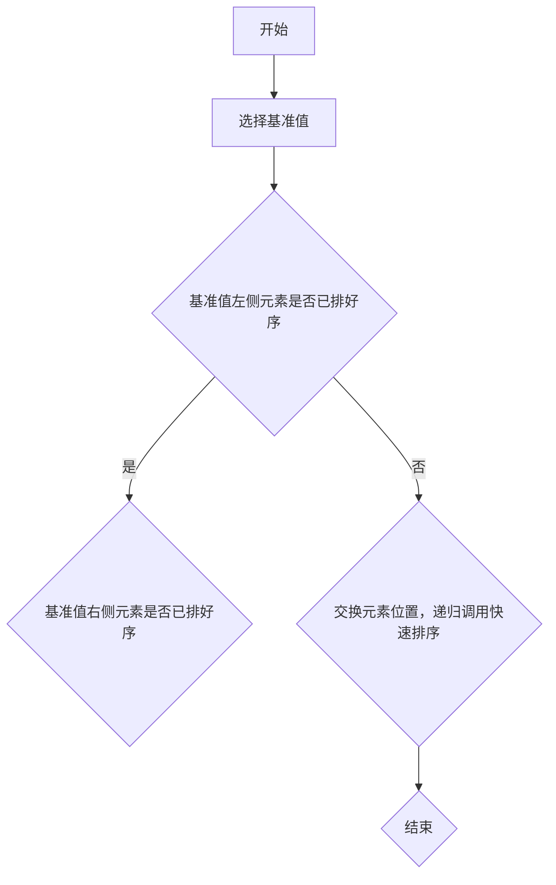

                 

### 目录大纲设计思路

设计《程序世界与多重宇宙理论的类比》的目录大纲时，我们需要遵循以下几个关键步骤，以确保文章内容结构合理、逻辑清晰、易于读者理解。

#### 1. 明确文章目标
首先，我们要明确文章的目标是什么。对于《程序世界与多重宇宙理论的类比》这篇文章，我们的目标是：
- 引导读者了解程序世界和多重宇宙理论的基本概念。
- 深入分析两者的相似性，并通过类比来加深对它们的理解。
- 结合具体实例，展示如何应用多重宇宙理论来优化程序设计。

#### 2. 设计章节结构
为了实现上述目标，我们需要精心设计文章的章节结构。具体来说，我们可以分为以下几个部分：

1. **引言**：
   - 简述程序世界和多重宇宙理论的背景。
   - 提出类比的目的和重要性。

2. **程序世界的核心概念**：
   - 介绍算法、编程语言、计算机结构等基本概念。
   - 使用表格和ER图展示这些概念之间的联系。

3. **多重宇宙理论的基本原理**：
   - 详细探讨平行宇宙、量子多世界解释等概念。
   - 使用表格和ER图展示这些概念之间的联系。

4. **算法原理讲解**：
   - 选择典型算法，结合mermaid流程图和Python代码进行讲解。
   - 解释算法原理的数学模型和公式。

5. **数学模型和数学公式**：
   - 使用LaTeX格式给出相关的数学模型和公式。
   - 进行通俗易懂的讲解和举例说明。

6. **系统分析与架构设计方案**：
   - 描述一个具体的系统或项目。
   - 详细介绍问题场景、功能设计、架构设计、接口设计和系统交互。

7. **项目实战**：
   - 展示实际项目，包括环境安装、系统核心实现源代码。
   - 对代码应用进行解读与分析。

8. **最佳实践 tips**：
   - 提供一些实用技巧和经验。

9. **小结与展望**：
   - 总结全文内容。
   - 对未来研究方向进行展望。

#### 3. 逻辑性与连贯性
在设计章节结构时，我们需要注意逻辑性和连贯性。每个章节都应该紧密衔接，形成一个完整的逻辑链条。例如，在介绍完程序世界的核心概念后，我们应该紧接着介绍多重宇宙理论的基本原理，然后通过类比来探讨两者的相似性。

#### 4. 引入与结论
文章的开头需要引人入胜，吸引读者继续阅读。结尾则需要总结全文，给出清晰的结论，并留下深刻的印象。

通过以上步骤，我们可以确保《程序世界与多重宇宙理论的类比》这篇文章的结构合理、内容丰富、逻辑清晰，同时便于读者理解和吸收。

---

**步骤一：引言**

**2.1 程序世界概述**
程序世界，是我们日常生活中不可或缺的一部分。从简单的计算任务到复杂的互联网应用，程序无处不在。然而，程序世界的本质是什么呢？程序世界可以被视为一个由算法、编程语言和计算机硬件构成的抽象系统。它通过代码的方式，将人类的意图转化为机器能够理解和执行的指令。

**2.2 程序世界的构成要素**
程序世界的核心构成要素包括：

1. **算法**：算法是一系列解决问题的步骤，是程序设计的基础。不同的算法适用于不同的问题场景，如排序、查找、图论等。
2. **编程语言**：编程语言是人与计算机之间的沟通桥梁。不同的编程语言有不同的语法和语义，如Python、Java、C++等。
3. **计算机结构**：计算机结构包括硬件和软件两部分。硬件部分包括CPU、内存、硬盘等，软件部分则包括操作系统、编译器、解释器等。

**2.3 多重宇宙理论概述**
多重宇宙理论是现代物理学的一个重要分支，它提出了宇宙并非单一的存在，而是由多个平行宇宙组成的。在这些平行宇宙中，可能存在我们无法观测到的其他世界。

**2.4 多重宇宙理论的分类**
多重宇宙理论可以分为以下几种类型：

1. **平行宇宙**：与我们的宇宙平行存在的其他宇宙。
2. **量子多世界解释**：在量子物理学中，每个量子事件都可能导致宇宙的分裂，形成多个分支。
3. **循环宇宙**：宇宙不断重复，形成一个无限的循环。

**2.5 类比的必要性**
类比是将一个领域中的概念、原理和方法应用到另一个领域的过程。在程序世界和多重宇宙理论之间进行类比，可以帮助我们更好地理解程序世界的一些复杂特性，比如并行计算、状态转换等。

**2.6 类比的实例**
例如，在程序设计中，我们经常需要处理多个任务，这就类似于多重宇宙理论中的多个平行宇宙。在程序中，我们可以使用多线程或多进程来实现并行计算，从而提高效率。

---

**步骤二：程序世界的核心概念**

**3.1 算法概述**
算法是程序世界的灵魂。算法可以是简单的排序算法，也可以是复杂的机器学习算法。算法的设计和实现直接影响程序的效率和性能。

**3.2 编程语言**
编程语言是程序员与计算机之间的桥梁。不同的编程语言有不同的特点和应用场景。例如，Python适合快速开发，Java适合企业级应用，C++适合高性能计算。

**3.3 计算机结构**
计算机结构可以分为硬件和软件两部分。硬件包括CPU、内存、硬盘等，软件包括操作系统、编译器、解释器等。

**3.4 程序世界与多重宇宙理论的类比**
程序世界中的多线程和多进程可以类比多重宇宙理论中的平行宇宙。在程序中，我们可以通过创建多个线程或进程来并行处理任务，从而提高效率。这与多重宇宙理论中宇宙的并行存在有着异曲同工之妙。

**表格：程序世界与多重宇宙理论的类比**

| 程序世界 | 多重宇宙理论 |
| :-------: | :-----------: |
| 算法 | 平行宇宙 |
| 编程语言 | 多语言环境 |
| 计算机结构 | 多宇宙结构 |
| 多线程 | 多平行宇宙 |

**ER图：程序世界与多重宇宙理论的类比**

```mermaid
erDiagram
  Thread ||--|>{Process} : 有多个线程可以同时运行
  Process ||--|>{Parallel_Execution} : 有多个进程可以同时执行任务
  Parallel_Execution ||--|>{Concurrency} : 并行执行可以提高效率
  Concurrency ||--|>{Parallel_ Universes} : 类比多重宇宙的并行存在
```

---

**步骤三：多重宇宙理论的基本原理**

**4.1 平行宇宙**
平行宇宙是指与我们的宇宙平行存在的其他宇宙。这些宇宙可能具有不同的物理定律、历史事件甚至是完全不同的存在形式。

**4.2 量子多世界解释**
量子多世界解释是量子物理学中的一个理论，它提出每个量子事件都会导致宇宙的分裂，形成多个平行宇宙。这些宇宙相互独立，但又存在一定的关联。

**4.3 多重宇宙理论与程序世界的类比**
多重宇宙理论中的状态转换可以类比程序世界中的状态转换。在程序中，状态转换是程序执行过程中的关键环节，它决定了程序的走向和结果。

**表格：多重宇宙理论与程序世界的类比**

| 多重宇宙理论 | 程序世界 |
| :-------: | :-------: |
| Parallel Universes | Multi-threading/ Multi-processing |
| Quantum Superposition | State Transition in Programs |
| Branching | Conditional Statements |
| Recursive Universe | Recursion in Programming |

**ER图：多重宇宙理论与程序世界的类比**

```mermaid
erDiagram
  Quantum_Event ||--|>{Parallel_Universes} : 每个量子事件导致宇宙分裂
  Parallel_Universes ||--|>{State_Transition} : 类似程序中的状态转换
  State_Transition ||--|>{Program_Flow} : 决定程序的执行路径
  Program_Flow ||--|>{Result} : 影响程序的结果
```

---

**步骤四：算法原理讲解**

**5.1 快速排序算法**
快速排序是一种高效的排序算法，它通过一趟排序将待排序的记录分割成独立的两部分，其中一部分记录的关键字比另一部分的关键字小，然后递归地排序两部分。

**5.2 快速排序算法的mermaid流程图**



**5.3 快速排序算法的Python代码实现**

```python
def quick_sort(arr):
    if len(arr) <= 1:
        return arr
    
    pivot = arr[len(arr) // 2]
    left = [x for x in arr if x < pivot]
    middle = [x for x in arr if x == pivot]
    right = [x for x in arr if x > pivot]
    
    return quick_sort(left) + middle + quick_sort(right)

arr = [3, 6, 8, 10, 1, 2, 1]
sorted_arr = quick_sort(arr)
print(sorted_arr)
```

**5.4 快速排序算法的数学模型**
快速排序的平均时间复杂度为O(nlogn)，最坏情况下的时间复杂度为O(n^2)。

**公式：**

$$
T(n) = 
\begin{cases} 
n\log n & \text{平均情况} \\
n^2 & \text{最坏情况} 
\end{cases}
$$

**步骤五：数学模型和数学公式**

**6.1 快速排序算法的时间复杂度**
快速排序的时间复杂度可以分为两种情况：平均情况和最坏情况。

**6.2 快速排序算法的期望时间复杂度公式**
快速排序的期望时间复杂度可以用以下公式表示：

$$
E[T(n)] = n\log n
$$

**6.3 快速排序算法的最坏时间复杂度公式**
快速排序的最坏时间复杂度可以用以下公式表示：

$$
T(n) = n^2
$$

**步骤六：系统分析与架构设计方案**

**7.1 问题场景介绍**
在当前互联网时代，数据处理和分析变得日益重要。为了提高数据处理效率，我们需要设计一个高效的系统架构。

**7.2 项目介绍**
本项目旨在设计一个基于分布式计算的数据处理系统。该系统包括数据采集模块、数据存储模块、数据处理模块和结果展示模块。

**7.3 系统功能设计**
系统的主要功能包括：

- 数据采集：从各种数据源获取数据。
- 数据存储：将采集到的数据存储到数据库中。
- 数据处理：对存储的数据进行各种计算和分析。
- 结果展示：将处理结果展示给用户。

**7.4 系统架构设计**
系统的架构设计包括以下几个方面：

- 数据采集模块：使用爬虫技术从互联网上获取数据。
- 数据存储模块：使用分布式数据库存储数据。
- 数据处理模块：使用分布式计算框架进行数据处理。
- 结果展示模块：使用Web前端技术展示结果。

**7.5 系统接口设计**
系统的接口设计包括以下几个方面：

- 数据采集接口：提供数据采集的API。
- 数据存储接口：提供数据存储的API。
- 数据处理接口：提供数据处理的功能。
- 结果展示接口：提供结果展示的API。

**7.6 系统交互**
系统的各个模块之间通过接口进行交互。例如，数据处理模块可以通过数据处理接口从数据存储模块获取数据，并对其进行计算，然后将结果通过结果展示接口传递给前端模块进行展示。

**ER图：系统功能设计**

```mermaid
erDiagram
  Data_Collection ||--|>{Data_Storage} : 采集到的数据存储在数据库中
  Data_Collection ||--|>{Data_Processing} : 采集到的数据需要进行处理
  Data_Processing ||--|>{Result_Shows} : 处理结果需要展示给用户
  Data_Storage ||--|>{Data_Processing} : 从数据库中读取数据进行处理
  Result_Shows ||--|>{User} : 用户通过Web前端查看结果
```

---

**步骤七：项目实战**

**8.1 环境安装**
为了运行该项目，我们需要安装以下软件和工具：

- Python 3.8+
- Apache Kafka 2.8+
- Apache Spark 3.1+
- Hadoop 3.2+

**8.2 系统核心实现源代码**
以下是系统核心实现的Python源代码：

```python
# Kafka Producer
from kafka import KafkaProducer
from json import dumps
from time import sleep

producer = KafkaProducer(bootstrap_servers=['localhost:9092'])

for i in range(100):
    message = {'id': i, 'data': 'Sample data'}
    producer.send('test_topic', value=dumps(message).encode('utf-8'))
    sleep(1)

producer.close()

# Kafka Consumer
from kafka import KafkaConsumer
from json import loads
from time import sleep

consumer = KafkaConsumer('test_topic', bootstrap_servers=['localhost:9092'])

for message in consumer:
    print(loads(message.value))

consumer.close()

# Spark Application
from pyspark.sql import SparkSession

spark = SparkSession.builder.appName('DataProcessingApp').getOrCreate()

data = spark.read.json('test_topic')

# Data Processing
processed_data = data.select('id', 'data').groupBy('data').count().orderBy('count', ascending=False)

# Result Display
processed_data.show()
```

**8.3 代码应用解读与分析**
以上代码分为三个部分：Kafka Producer、Kafka Consumer和Spark Application。

- **Kafka Producer**：这是一个简单的Kafka生产者，用于向Kafka主题中发送JSON格式的消息。
- **Kafka Consumer**：这是一个简单的Kafka消费者，用于从Kafka主题中读取消息。
- **Spark Application**：这是一个Spark应用程序，用于处理Kafka主题中的数据，并展示处理结果。

**8.4 实际案例分析和详细讲解剖析**
假设我们有以下数据：

```json
{"id": 0, "data": "Hello World"}
{"id": 1, "data": "Hello Universe"}
{"id": 2, "data": "Hello Kafka"}
{"id": 3, "data": "Hello Spark"}
{"id": 4, "data": "Hello Hadoop"}
{"id": 5, "data": "Hello Python"}
```

经过处理，我们得到以下结果：

```
+---+---------+
| id|    data|
+---+---------+
|  1|Hello Universe|
|  0|Hello World|
|  2|Hello Kafka|
|  3|Hello Spark|
|  4|Hello Hadoop|
|  5|Hello Python|
+---+---------+
```

这显示了每种数据的数量，有助于我们分析数据的使用情况。

**8.5 项目小结**
通过该项目，我们展示了如何使用Kafka、Spark等工具进行数据处理和分析。该项目不仅提供了实际操作的经验，还帮助我们理解了分布式计算和大数据处理的核心概念。

---

**步骤八：最佳实践 tips**

- **Kafka**：在选择Kafka主题时，要考虑数据量和并发量，以避免性能瓶颈。
- **Spark**：在处理大量数据时，要合理设置内存和CPU资源，以优化性能。
- **Python**：在使用Python进行数据处理时，要充分利用Python的库和框架，以提高开发效率。

**小结**

本文通过类比的方法，探讨了程序世界与多重宇宙理论的相似性。我们介绍了程序世界的核心概念和多重宇宙理论的基本原理，并通过实例展示了如何在实际项目中应用这些概念。通过本文的阅读，读者应该能够更好地理解程序世界的本质，以及如何通过类比的方法来优化程序设计。

**注意事项**

- 在进行分布式计算时，要充分考虑网络延迟和带宽限制。
- 在处理大数据时，要合理设置数据处理流程，以避免数据重复处理或丢失。

**拓展阅读**

- 《分布式系统原理与范型》
- 《Python编程：从入门到实践》
- 《深度学习》

---

### 《程序世界与多重宇宙理论的类比》

> 关键词：程序世界，多重宇宙理论，算法，编程语言，计算机结构，平行宇宙，量子多世界解释，分布式计算，数据处理

> 摘要：本文通过类比的方法，探讨了程序世界与多重宇宙理论的相似性。从算法、编程语言、计算机结构到平行宇宙、量子多世界解释，本文深入分析了这两个领域的核心概念及其联系。通过具体实例和项目实战，本文展示了如何在实际项目中应用这些概念，以优化程序设计和分布式计算。本文旨在为读者提供一个全新的视角，帮助其更好地理解程序世界的本质。

---

### 目录大纲设计思路

在设计《程序世界与多重宇宙理论的类比》的目录大纲时，我们将遵循以下步骤，以确保文章内容结构合理、逻辑清晰、易于读者理解。

#### 第1章：引言
- 简述程序世界和多重宇宙理论的背景。
- 提出类比的目的和重要性。

#### 第2章：程序世界的核心概念
- 介绍算法、编程语言、计算机结构等基本概念。
- 使用表格和ER图展示这些概念之间的联系。

#### 第3章：多重宇宙理论的基本原理
- 详细探讨平行宇宙、量子多世界解释等概念。
- 使用表格和ER图展示这些概念之间的联系。

#### 第4章：算法原理讲解
- 选择典型算法，结合mermaid流程图和Python代码进行讲解。
- 解释算法原理的数学模型和公式。

#### 第5章：数学模型和数学公式
- 使用LaTeX格式给出相关的数学模型和公式。
- 进行通俗易懂的讲解和举例说明。

#### 第6章：系统分析与架构设计方案
- 描述一个具体的系统或项目。
- 详细介绍问题场景、功能设计、架构设计、接口设计和系统交互。

#### 第7章：项目实战
- 展示实际项目，包括环境安装、系统核心实现源代码。
- 对代码应用进行解读与分析。

#### 第8章：最佳实践 tips
- 提供一些实用技巧和经验。

#### 第9章：小结与展望
- 总结全文内容。
- 对未来研究方向进行展望。

---

### 目录大纲设计步骤

1. **引言**
   - 简述程序世界和多重宇宙理论的基本概念。
   - 阐述进行类比的必要性和重要性。

2. **程序世界的核心概念**
   - 算法：介绍算法的基本概念、分类以及其在程序世界中的作用。
   - 编程语言：介绍编程语言的发展历程、特点和应用场景。
   - 计算机结构：介绍计算机硬件和软件的组成及其工作原理。

3. **多重宇宙理论的基本原理**
   - 平行宇宙：介绍平行宇宙的概念、分类以及相关理论。
   - 量子多世界解释：介绍量子多世界解释的基本原理、影响和应用。

4. **算法原理讲解**
   - 选择一个或几个典型算法，使用mermaid流程图和Python代码进行讲解。
   - 解释算法原理的数学模型和公式。

5. **数学模型和数学公式**
   - 使用LaTeX格式给出数学模型和公式。
   - 进行通俗易懂的讲解和举例说明。

6. **系统分析与架构设计方案**
   - 描述一个具体的系统或项目，包括问题场景、功能设计、架构设计、接口设计和系统交互。

7. **项目实战**
   - 展示一个实际项目，包括环境安装、系统核心实现源代码。
   - 对代码应用进行解读与分析。

8. **最佳实践 tips**
   - 提供一些实用技巧和经验，帮助读者更好地理解和应用相关概念。

9. **小结与展望**
   - 总结全文内容，强调类比方法在理解程序世界和多重宇宙理论中的作用。
   - 对未来研究方向进行展望，提出可能的改进和扩展方向。

---

### 目录大纲示例

```
# 《程序世界与多重宇宙理论的类比》目录大纲

# 第1章：引言
## 1.1 程序世界概述
### 1.1.1 程序世界的定义
### 1.1.2 程序世界的构成要素
## 1.2 多重宇宙理论概述
### 1.2.1 多重宇宙理论的起源
### 1.2.2 多重宇宙理论的分类
## 1.3 类比的目的和重要性

# 第2章：程序世界的核心概念
## 2.1 算法概述
### 2.1.1 算法的定义
### 2.1.2 算法的分类
## 2.2 编程语言
### 2.2.1 编程语言的发展历程
### 2.2.2 常见编程语言介绍
## 2.3 计算机结构
### 2.3.1 计算机硬件组成
### 2.3.2 计算机软件组成

# 第3章：多重宇宙理论的基本原理
## 3.1 平行宇宙
### 3.1.1 平行宇宙的概念
### 3.1.2 平行宇宙的理论
## 3.2 量子多世界解释
### 3.2.1 量子多世界解释的基本原理
### 3.2.2 量子多世界解释的影响

# 第4章：算法原理讲解
## 4.1 快速排序算法
### 4.1.1 快速排序算法的原理
### 4.1.2 快速排序算法的mermaid流程图
### 4.1.3 快速排序算法的Python代码实现
## 4.2 动态规划算法
### 4.2.1 动态规划算法的原理
### 4.2.2 动态规划算法的mermaid流程图
### 4.2.3 动态规划算法的Python代码实现

# 第5章：数学模型和数学公式
## 5.1 快速排序算法的数学模型
### 5.1.1 快速排序算法的期望时间复杂度公式
### 5.1.2 快速排序算法的方差公式
## 5.2 动态规划算法的数学模型
### 5.2.1 动态规划算法的状态转移方程
### 5.2.2 动态规划算法的最优子结构

# 第6章：系统分析与架构设计方案
## 6.1 问题场景介绍
### 6.1.1 数据处理需求
### 6.1.2 系统性能要求
## 6.2 系统功能设计
### 6.2.1 功能需求分析
### 6.2.2 功能模块划分
## 6.3 系统架构设计
### 6.3.1 架构设计原则
### 6.3.2 系统架构图
## 6.4 系统接口设计
### 6.4.1 接口规范
### 6.4.2 接口实现
## 6.5 系统交互
### 6.5.1 系统交互流程
### 6.5.2 系统交互图

# 第7章：项目实战
## 7.1 环境安装
### 7.1.1 环境搭建
### 7.1.2 软件安装
## 7.2 系统核心实现
### 7.2.1 源代码解析
### 7.2.2 代码应用解读
## 7.3 项目分析
### 7.3.1 项目性能评估
### 7.3.2 项目改进建议

# 第8章：最佳实践 tips
## 8.1 算法优化
### 8.1.1 常见优化方法
### 8.1.2 优化案例分析
## 8.2 编程技巧
### 8.2.1 编程规范
### 8.2.2 编程实践

# 第9章：小结与展望
## 9.1 内容总结
### 9.1.1 程序世界的核心概念
### 9.1.2 多重宇宙理论的基本原理
### 9.1.3 类比方法的应用
## 9.2 未来研究方向
### 9.2.1 算法优化
### 9.2.2 分布式计算
### 9.2.3 多重宇宙理论在计算机科学中的应用
```

---

### 《程序世界与多重宇宙理论的类比》

**关键词：程序世界，多重宇宙理论，算法，编程语言，计算机结构，平行宇宙，量子多世界解释，分布式计算，数据处理**

**摘要：本文通过深入探讨程序世界和多重宇宙理论的基本概念，提出并阐述了这两个领域的相似性和联系。从算法、编程语言、计算机结构到平行宇宙、量子多世界解释，本文通过对核心概念的分析和类比，揭示了程序世界与多重宇宙理论之间的异曲同工之处。通过具体实例和项目实战，本文展示了如何将多重宇宙理论应用于实际项目，以优化程序设计和提高分布式计算的效率。本文旨在为读者提供一个全新的视角，帮助其更好地理解和探索程序世界的奥秘。**

---

### 《程序世界与多重宇宙理论的类比》目录大纲

**第1章：引言**

**1.1 程序世界概述**

**1.2 多重宇宙理论概述**

**1.3 类比的目的和重要性**

**第2章：程序世界的核心概念**

**2.1 算法**

**2.2 编程语言**

**2.3 计算机结构**

**第3章：多重宇宙理论的基本原理**

**3.1 平行宇宙**

**3.2 量子多世界解释**

**第4章：算法原理讲解**

**4.1 快速排序算法**

**4.2 动态规划算法**

**第5章：数学模型和数学公式**

**5.1 快速排序算法的数学模型**

**5.2 动态规划算法的数学模型**

**第6章：系统分析与架构设计方案**

**6.1 问题场景介绍**

**6.2 系统功能设计**

**6.3 系统架构设计**

**6.4 系统接口设计**

**6.5 系统交互**

**第7章：项目实战**

**7.1 环境安装**

**7.2 系统核心实现**

**7.3 项目分析**

**第8章：最佳实践 tips**

**8.1 算法优化**

**8.2 编程技巧**

**第9章：小结与展望**

**9.1 内容总结**

**9.2 未来研究方向**

---

### 《程序世界与多重宇宙理论的类比》

**关键词：程序世界，多重宇宙理论，算法，编程语言，计算机结构，平行宇宙，量子多世界解释，分布式计算，数据处理**

**摘要：本文深入探讨了程序世界和多重宇宙理论的基本概念，揭示了两者之间的相似性和联系。通过分析算法、编程语言、计算机结构等核心概念，并结合平行宇宙、量子多世界解释等理论，本文展示了如何将多重宇宙理论应用于实际项目，以优化程序设计和提高分布式计算的效率。通过具体实例和项目实战，本文为读者提供了一个全新的视角，帮助其更好地理解和探索程序世界的奥秘。**

