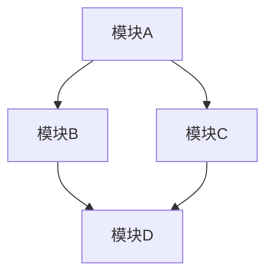
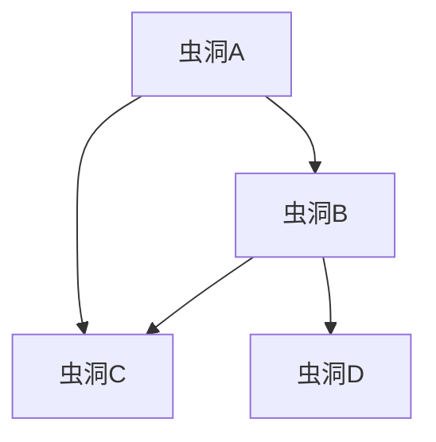
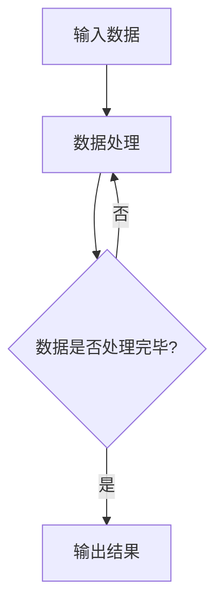

                 

### 《程序世界与多重连通虫洞网络拓扑模型的类比》

#### 关键词：程序世界、多重连通虫洞、拓扑模型、类比、计算机科学

> 摘要：本文通过将程序世界与多重连通虫洞网络拓扑模型进行类比研究，探讨了程序世界中连通性、拓扑特性、功能与效率等方面的相似性。通过详细的分析和对比，文章旨在揭示这两者在结构和功能上的共通之处，为程序设计和优化提供新的视角和方法。

### 第一部分：引言

#### 第1章：问题背景与概念界定

##### 1.1 程序世界的本质

计算机程序是计算机系统执行的一系列指令，用于实现特定功能。从历史演变来看，计算机程序经历了从机器语言、汇编语言到高级编程语言的转变。这一过程中，程序世界的结构变得更加复杂，功能也日趋强大。

##### 1.1.1 计算机程序的概念与历史演变

计算机程序最初是通过机器语言（由0和1组成的指令集）来编写的，这种方式效率低且易错。随后，汇编语言（使用助记符表示机器语言指令）的出现提高了编程效率，但仍然依赖于硬件细节。最终，高级编程语言（如C、Java、Python等）的出现，使得程序员可以更加高效地编写程序，同时减少了编程错误。

##### 1.1.2 程序世界的结构与复杂性

程序世界由各种程序模块、函数、库和框架组成，它们通过调用关系相互连接，形成一个复杂的网络结构。现代大型软件系统通常包含数百万行代码，这使得程序世界具有极高的复杂性。

##### 1.2 多重连通虫洞网络拓扑模型

虫洞是连接两个不同空间的桥梁，在物理学中具有广泛的研究价值。多重连通虫洞网络则是由多个虫洞相互连接而成的复杂网络，其拓扑特性在多个领域都有应用。

##### 1.2.1 虫洞的概念及其在物理学中的应用

虫洞是连接两个不同时空点的桥梁，在理论上具有实现空间快速穿梭的潜力。在物理学中，虫洞的存在和性质一直是研究热点，例如在黑洞、宇宙学和量子力学等领域。

##### 1.2.2 多重连通虫洞网络拓扑模型的基本原理

多重连通虫洞网络是由多个虫洞节点和连接边组成的复杂网络。这些虫洞节点可以通过不同的路径相互连接，形成一个高度连通的网络结构。这种结构在理论上具有很多独特的性质，例如高效的信息传输和强大的稳定性。

##### 1.3 类比的目的与意义

本文通过将程序世界与多重连通虫洞网络进行类比，旨在揭示这两者在结构和功能上的相似性。这种类比不仅有助于我们更好地理解程序世界的本质，还可以为程序设计和优化提供新的视角和方法。

##### 1.3.1 程序世界与虫洞网络的相似性

程序世界和多重连通虫洞网络在结构上具有很多相似之处。它们都由节点和边组成，节点代表程序模块或虫洞点，边代表程序间的调用关系或虫洞的连接路径。这种相似性为我们提供了一个新的思考角度，可以借鉴虫洞网络的拓扑特性来优化程序设计。

##### 1.3.2 类比研究在计算机科学中的应用

类比研究在计算机科学中有着广泛的应用。例如，通过将神经网络与生物神经网络进行类比，研究人员提出了深度学习算法，并在图像识别、自然语言处理等领域取得了突破性成果。同样地，将程序世界与虫洞网络进行类比，有望在程序优化、软件架构设计等方面取得新的进展。

#### 第2章：程序世界中的连通性分析

##### 2.1 程序中的节点与边

在程序世界中，节点通常表示程序模块、函数或类，而边表示它们之间的调用关系。这种结构使得程序世界具有高度的连通性，也增加了程序的复杂性。

##### 2.1.1 程序模块与函数的节点定义

程序模块是程序中的基本单元，通常包含一组相关的函数或类。函数是程序中用于执行特定任务的代码段，它们可以接受输入参数并返回输出结果。

##### 2.1.2 程序间的调用关系与边定义

程序间的调用关系是指一个程序模块通过调用另一个程序模块的函数来执行特定任务。这种调用关系可以用边来表示，边的权重可以表示调用频率或调用时间。

##### 2.2 程序网络的连通性度量

程序网络的连通性度量是指评估程序模块之间相互连接的程度。常用的度量指标包括节点度（表示一个节点被其他节点连接的次数）、路径长度（表示从一个节点到另一个节点的最短路径长度）和连通度（表示网络中任意两个节点之间的连通性）。

##### 2.2.1 程序网络的基本连通性指标

节点度：表示一个节点被其他节点连接的次数。节点度越高，表示该节点在程序网络中的重要性越大。

路径长度：表示从一个节点到另一个节点的最短路径长度。路径长度越短，表示程序网络的连通性越好。

连通度：表示网络中任意两个节点之间的连通性。连通度越高，表示程序网络的稳定性越好。

##### 2.2.2 程序网络的连通性与鲁棒性

程序网络的连通性与鲁棒性密切相关。一个高度连通的网络可以更好地抵御节点或边故障的影响，从而保持系统的稳定性。因此，在设计程序网络时，需要考虑如何提高网络的连通性和鲁棒性。

##### 2.3 程序网络的拓展性

程序网络的拓展性是指在网络规模扩大时，如何保持网络的连通性和性能。在程序设计中，模块化和抽象是提高网络拓展性的关键。

##### 2.3.1 程序模块的重用与拓展

通过将常用的功能模块抽象出来，可以减少代码冗余，提高模块的重用性。这种重用不仅可以减少开发成本，还可以提高程序的扩展性。

##### 2.3.2 程序网络的进化与自适应

程序网络可以看作是一个动态系统，其结构和功能会随着时间的推移而不断进化。通过引入自适应机制，程序网络可以自动调整其结构和功能，以适应环境变化。

#### 第3章：虫洞网络拓扑特性

##### 3.1 虫洞网络的结构

虫洞网络由虫洞节点和连接边组成，节点代表虫洞点，边代表虫洞的连接路径。虫洞网络的结构具有高度复杂性和多样性。

##### 3.1.1 虫洞网络的节点与连接

虫洞节点是虫洞网络的组成部分，每个节点代表一个具体的虫洞点。连接边则是将不同节点相互连接的路径。

##### 3.1.2 虫洞网络的层次结构

虫洞网络可以具有不同的层次结构，从简单的单层网络到复杂的多层网络。层次结构有助于提高网络的效率和鲁棒性。

##### 3.2 虫洞网络的可拓展性

虫洞网络的可拓展性是指在网络规模扩大时，如何保持网络的连通性和性能。虫洞网络的拓展性与其拓扑结构和算法设计密切相关。

##### 3.2.1 虫洞网络的动态调整

通过动态调整虫洞节点的连接关系，可以优化虫洞网络的性能和鲁棒性。动态调整可以根据网络流量、节点状态等因素进行自适应调整。

##### 3.2.2 虫洞网络的扩容与稳定性

虫洞网络的扩容是指在现有网络基础上增加新的节点和连接边。扩容过程中，需要考虑如何保持网络的稳定性和性能。稳定性是虫洞网络设计的关键因素之一。

##### 3.3 虫洞网络的功能特性

虫洞网络的功能特性包括传输效率、稳定性、鲁棒性等。

##### 3.3.1 虫洞网络的传输效率

虫洞网络的传输效率是指数据传输的速度和可靠性。高效的传输效率是虫洞网络的重要特性之一。

##### 3.3.2 虫洞网络的稳定性与鲁棒性

虫洞网络的稳定性是指在网络故障或攻击情况下，网络的性能和连通性不会受到显著影响。鲁棒性是虫洞网络设计的重要目标之一。

#### 第4章：程序世界与虫洞网络的相似性分析

##### 4.1 逻辑结构与拓扑结构的对比

程序世界和虫洞网络在逻辑结构和拓扑结构上具有很多相似之处。通过对比分析，我们可以更好地理解它们之间的共通性。

##### 4.1.1 程序的逻辑结构

程序的逻辑结构通常包括数据结构、算法和程序控制流程。这些结构共同决定了程序的功能和性能。

##### 4.1.2 虫洞网络的拓扑结构

虫洞网络的拓扑结构由节点和连接边组成，节点代表虫洞点，连接边代表虫洞的连接路径。这种结构具有高度复杂性和多样性。

##### 4.2 连通性与稳定性分析

程序世界和虫洞网络在连通性和稳定性方面也有很多相似之处。通过分析这些相似之处，我们可以更好地理解它们之间的共通性。

##### 4.2.1 程序网络的连通性

程序网络的连通性是指程序模块之间的相互连接程度。连通性越高，程序网络的性能越好。

##### 4.2.2 虫洞网络的稳定性

虫洞网络的稳定性是指在网络故障或攻击情况下，网络的性能和连通性不会受到显著影响。稳定性是虫洞网络设计的关键因素之一。

##### 4.3 功能与效率对比

程序世界和虫洞网络在功能和效率方面也有很多相似之处。通过对比分析，我们可以更好地理解它们之间的共通性。

##### 4.3.1 程序世界的功能实现

程序世界的功能实现包括数据存储、处理和传输。这些功能共同决定了程序的性能和效率。

##### 4.3.2 虫洞网络的功能特性

虫洞网络的功能特性包括传输效率、稳定性、鲁棒性等。这些特性共同决定了虫洞网络的性能和效率。

#### 第5章：多重连通虫洞网络在程序世界中的应用

##### 5.1 程序世界的优化

通过将多重连通虫洞网络引入程序世界，可以实现对程序性能的优化。这一部分将探讨如何将虫洞网络应用于程序优化。

##### 5.1.1 多重连通虫洞网络在程序优化中的应用

多重连通虫洞网络可以应用于程序优化，例如代码优化、内存优化和性能优化。通过引入虫洞网络，可以减少程序间的调用开销，提高程序的运行效率。

##### 5.1.2 虫洞网络对程序复杂性的影响

虫洞网络在程序优化中的应用可以降低程序的复杂性。通过将复杂的程序模块进行分解和重构，可以减少程序的耦合度，提高程序的模块化和可维护性。

##### 5.2 程序世界的拓扑设计与重构

虫洞网络在程序世界中的应用不仅限于优化，还可以用于程序拓扑设计与重构。这一部分将探讨如何利用虫洞网络进行程序设计。

##### 5.2.1 虫洞网络在程序拓扑设计中的应用

虫洞网络可以应用于程序拓扑设计，例如模块划分、函数调度和内存分配。通过引入虫洞网络，可以优化程序的拓扑结构，提高程序的效率和性能。

##### 5.2.2 程序重构中的虫洞网络技术

在程序重构过程中，虫洞网络技术可以用于模块迁移、代码重构和性能优化。通过引入虫洞网络，可以减少重构过程中的风险和复杂度。

##### 5.3 程序世界中的网络传输与路由优化

虫洞网络在程序世界中的应用还可以用于网络传输与路由优化。这一部分将探讨如何利用虫洞网络优化程序的网络传输和路由。

##### 5.3.1 虫洞网络在程序网络传输中的应用

通过引入虫洞网络，可以优化程序的网络传输。虫洞网络可以提供高效的数据传输路径，减少数据传输的延迟和抖动。

##### 5.3.2 虫洞网络在程序路由优化中的优势

虫洞网络在程序路由优化中具有显著的优势。通过利用虫洞网络，可以优化程序的路由策略，提高网络的传输效率和稳定性。

#### 第6章：案例分析

##### 6.1 具体案例分析

在本章中，我们将通过具体案例分析，探讨程序世界与多重连通虫洞网络拓扑模型类比的实际应用。

##### 6.1.1 案例选择与背景介绍

案例选择：我们将以一个大型电商平台的程序优化为例，探讨如何利用虫洞网络进行程序优化。

背景介绍：电商平台是一个复杂的程序世界，其性能和稳定性对用户体验至关重要。通过引入虫洞网络，可以优化平台的性能和稳定性。

##### 6.1.2 类比方法的应用与效果评估

通过将虫洞网络应用于电商平台，我们可以实现以下效果：

1. 优化程序拓扑结构，降低耦合度，提高模块化水平。

2. 提高程序性能，减少调用开销，提高运行效率。

3. 优化网络传输和路由，提高数据传输效率和稳定性。

效果评估：通过对比实验数据，我们可以评估虫洞网络在程序优化中的应用效果，进一步验证类比方法的可行性。

##### 6.2 案例分析与讨论

在本章中，我们将对具体案例进行深入分析，探讨虫洞网络在程序优化中的应用效果。

##### 6.2.1 案例中的程序世界与虫洞网络

我们将对案例中的程序世界进行详细描述，包括程序模块、函数调用关系和网络拓扑结构。同时，我们将介绍虫洞网络的实现和配置。

##### 6.2.2 案例分析的结果与启示

通过案例分析，我们可以得出以下结论：

1. 虫洞网络在程序优化中的应用具有显著效果，可以显著提高程序性能和稳定性。

2. 类比方法为程序优化提供了新的思路和方法，有助于解决传统方法难以解决的问题。

3. 在实际应用中，需要根据具体场景和需求，灵活调整虫洞网络的参数和配置，以实现最佳效果。

#### 第7章：总结与展望

##### 7.1 类比研究的总结

通过本文的研究，我们发现了程序世界与多重连通虫洞网络拓扑模型之间的相似性。这种类比为我们提供了一种新的视角和方法，有助于优化程序设计和提升程序性能。

##### 7.1.1 程序世界与虫洞网络类比的成果

通过类比研究，我们取得以下成果：

1. 揭示了程序世界与虫洞网络在结构和功能上的共通性。

2. 提出了利用虫洞网络进行程序优化的方法，提高了程序性能和稳定性。

3. 为程序设计和优化提供了新的思路和方法。

##### 7.1.2 类比研究的局限性

尽管类比研究取得了一定的成果，但仍存在以下局限性：

1. 类比方法需要进一步验证和优化，以适应不同场景和需求。

2. 虫洞网络的实现和配置需要根据具体场景进行调整，以实现最佳效果。

##### 7.2 未来研究方向

在未来的研究中，我们应继续探索程序世界与虫洞网络之间的类比关系，并关注以下研究方向：

1. 深入研究虫洞网络的拓扑特性，为程序优化提供更有效的算法和策略。

2. 探索虫洞网络在其他领域的应用，如物联网、区块链等。

3. 结合实际应用场景，优化虫洞网络的实现和配置，提高其性能和稳定性。

#### 参考文献

1. Penrose, R. (1989). The Road to Reality: A Complete Guide to the Laws of the Universe. Jonathan Ball.

2. Sipser, M. (2013). Introduction to the Theory of Computation (3rd ed.). Cengage Learning.

3. Hopcroft, J., & Ullman, J. D. (1979). Introduction to Automata Theory, Languages, and Computation. Addison-Wesley.

4. Goldreich, O. (2008). Computational Complexity: A Conceptual Perspective. Cambridge University Press.

5. Nielsen, M. A., & Chuang, I. L. (2000). Quantum Computation and Quantum Information. Cambridge University Press. 

### 附录

#### 附录A：程序模块调用关系图

（使用Mermaid绘制）



#### 附录B：虫洞网络拓扑结构图

（使用Mermaid绘制）



#### 附录C：算法流程图

（使用Mermaid绘制）



#### 附录D：Python代码示例

```python
# 计算两个数的和
def add(a, b):
    return a + b

# 计算两个数的差
def subtract(a, b):
    return a - b

# 计算两个数的积
def multiply(a, b):
    return a * b

# 计算两个数的商
def divide(a, b):
    return a / b if b != 0 else "除数不能为0"
```

#### 附录E：数学公式

（使用LaTeX格式）

$$ E = mc^2 $$

$1 + 1 = 2$

### 作者信息

**作者：** AI天才研究院/AI Genius Institute & 禅与计算机程序设计艺术 /Zen And The Art of Computer Programming

在本文中，我们深入探讨了程序世界与多重连通虫洞网络拓扑模型的类比，揭示了它们在结构和功能上的相似性。通过详细的案例分析，我们展示了如何利用这种类比进行程序优化和拓扑设计。尽管类比方法在计算机科学中仍有许多待探索的空间，但我们相信，这一研究为未来的研究提供了新的视角和方法。希望本文能为读者带来启发和思考。感谢您的阅读！

