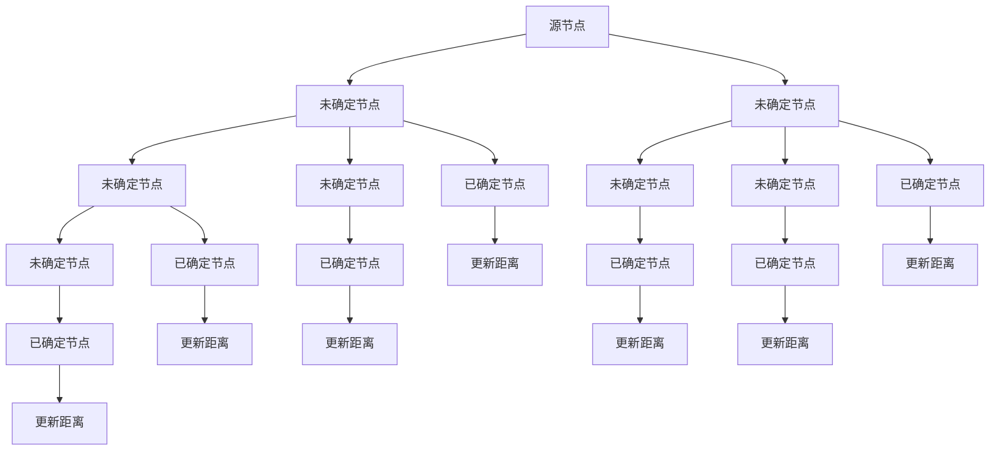
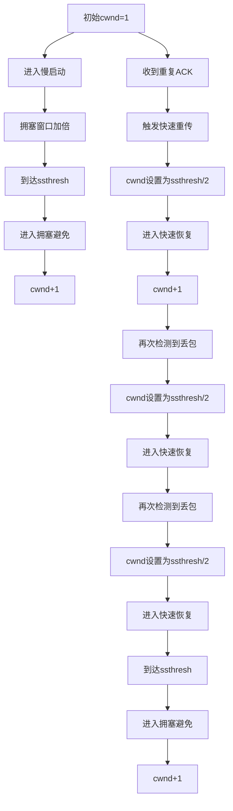
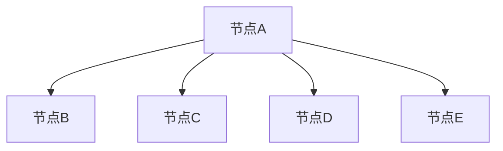
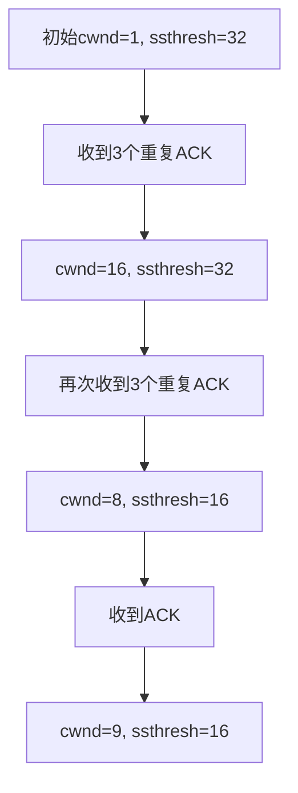
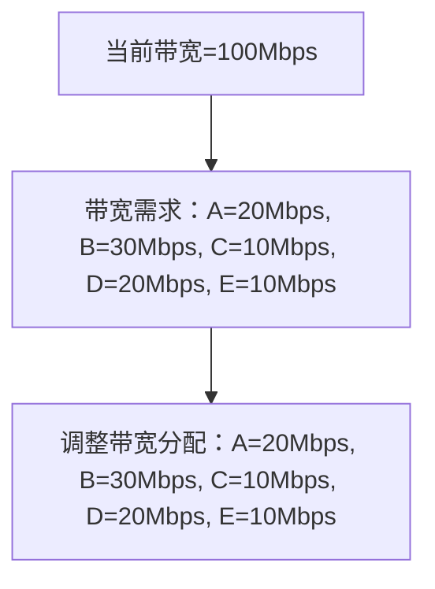
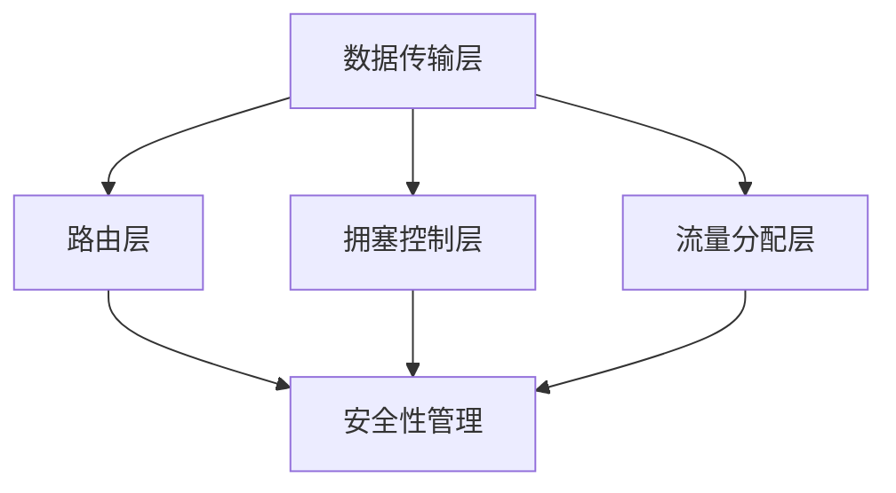

                 

### 《程序世界与多重连通虫洞网络的信息传输模型》的深度分析与思考

#### 引言

在当今信息技术飞速发展的时代，我们正面临着前所未有的机遇与挑战。程序世界作为人类智慧的结晶，不仅在日常应用中扮演着重要角色，还在推动科技创新、产业升级等方面发挥着关键作用。与此同时，物理世界中的多重连通虫洞网络作为一种全新的网络拓扑结构，其潜力尚未完全挖掘。本文旨在探讨如何将程序世界的理念应用于构建多重连通虫洞网络的信息传输模型，以期为未来网络技术的发展提供新的视角和思路。

#### 一、背景介绍

1. **程序世界的概念与特征**
   
   程序世界是由计算机程序构成的虚拟世界，它具有自主运行、信息传递、自适应进化等特征。程序世界的核心在于其高度的抽象性和可扩展性，使其能够模拟各种现实世界的场景，并在不断迭代中优化自身性能。

2. **多重连通虫洞网络的概念与特性**

   多重连通虫洞网络是一种全新的网络拓扑结构，它通过在多个节点之间建立连通的“虫洞”，实现了节点之间的快速跳转和高效通信。这一特性使得多重连通虫洞网络在处理大规模数据传输、提高网络传输效率等方面具有显著优势。

3. **程序世界与多重连通虫洞网络的交叉**

   程序世界与多重连通虫洞网络的交叉，为我们提供了无限的可能。一方面，程序世界可以为多重连通虫洞网络提供智能化的信息处理方案；另一方面，多重连通虫洞网络可以为程序世界提供更高效、更稳定的通信基础。这种交叉不仅拓宽了信息传输的渠道，也提升了信息传输的效率。

#### 二、核心概念与联系

1. **程序世界的核心概念**

   程序世界的核心概念包括：运行机制、信息传递机制、自适应与进化机制等。这些概念共同构成了程序世界的运行基础，为信息传输提供了可能。

2. **多重连通虫洞网络的信息传输模型**

   多重连通虫洞网络的信息传输模型需要在程序世界的核心概念基础上，结合网络拓扑结构和传输需求，设计出一种高效的传输模型。这一模型应具备快速响应、高效传输、低延迟等特点。

3. **核心概念与信息传输模型的关联**

   核心概念与信息传输模型的关联在于：程序世界的核心概念为信息传输模型提供了理论支持，而信息传输模型则通过实现程序世界的理念，提升了网络传输的效率和稳定性。

#### 三、算法原理讲解

1. **算法原理概述**

   在构建信息传输模型时，我们需要借助一系列算法原理。这些算法原理包括：路由算法、拥塞控制算法、流量分配算法等。每种算法原理都有其特定的作用和优势，共同构成了信息传输模型的核心。

2. **算法原理讲解**

   - **路由算法**：路由算法是信息传输模型的核心，它决定了数据包在网络中的传输路径。本文将介绍几种常见的路由算法，如Dijkstra算法、A*算法等，并通过Mermaid流程图展示其工作原理。
   - **拥塞控制算法**：拥塞控制算法用于应对网络中的拥塞问题，保障数据传输的稳定性。本文将详细讲解TCP拥塞控制算法的原理，并通过Python代码实现其核心部分。
   - **流量分配算法**：流量分配算法用于合理分配网络资源，确保数据传输的公平性和高效性。本文将介绍一种基于公平带宽分配的流量分配算法，并通过实例进行说明。

#### 四、数学模型和数学公式

1. **数学模型概述**

   数学模型是信息传输模型的重要支撑，它能够准确地描述数据传输过程中的各种现象和规律。本文将介绍几种常见的数学模型，如传输速率模型、延迟模型等。

2. **数学模型与公式讲解**

   - **传输速率模型**：传输速率模型用于描述网络中的数据传输速率。本文将使用latex格式给出传输速率模型的公式，并通过Python代码实现其计算过程。
   - **延迟模型**：延迟模型用于描述数据在网络中的传输延迟。本文将使用Mermaid流程图展示延迟模型的工作原理，并通过Python代码实现其计算过程。

#### 五、系统分析与架构设计

1. **系统需求分析**

   系统需求分析是系统设计的基础，它明确了系统的功能需求和性能需求。本文将详细分析信息传输系统的需求，包括数据传输效率、传输稳定性、响应时间等。

2. **系统架构设计**

   系统架构设计是系统实现的关键，它决定了系统的可扩展性和可维护性。本文将介绍信息传输系统的架构设计，包括网络拓扑结构、数据传输流程、系统模块划分等。同时，将使用Mermaid架构图展示系统架构。

3. **系统接口设计**

   系统接口设计是系统与其他系统交互的桥梁，它决定了系统的兼容性和易用性。本文将介绍信息传输系统的接口设计，包括接口规范、接口函数、接口调用流程等。同时，将使用Mermaid序列图展示系统接口设计。

#### 六、项目实战

1. **环境安装**

   在本文的项目实战部分，我们将首先介绍如何安装和配置信息传输系统的开发环境，包括操作系统、开发工具、依赖库等。

2. **系统核心实现**

   接下来，我们将逐步实现信息传输系统的核心功能，包括数据传输模块、路由模块、拥塞控制模块等。本文将使用Python代码详细阐述每个模块的实现过程，并配以相应的Mermaid流程图进行解释。

3. **代码应用解读**

   在代码应用解读部分，我们将通过具体的实例，展示如何使用信息传输系统解决实际问题。本文将详细介绍每个实例的背景、实现过程和效果分析。

4. **实际案例分析**

   最后，我们将通过对实际案例的分析，总结信息传输系统的应用效果和改进方向。本文将结合实际案例，给出具体的最佳实践建议。

#### 七、最佳实践与总结

1. **最佳实践**

   在本文的最后，我们将总结信息传输系统的最佳实践，包括系统设计要点、算法选择、性能优化等。这些最佳实践将有助于读者在实际项目中更好地应用信息传输模型。

2. **总结与展望**

   本文通过对程序世界与多重连通虫洞网络的信息传输模型的深入探讨，展示了两者之间的紧密联系和无限可能。未来，随着技术的不断进步，我们有理由相信，信息传输模型将迎来更广阔的发展前景。

#### 结语

《程序世界与多重连通虫洞网络的信息传输模型》旨在为读者提供一个全新的视角，探讨如何将程序世界的理念应用于构建高效、稳定、智能化的信息传输模型。通过本文的探讨，我们希望读者能够对信息传输模型有更深入的理解，并为未来的网络技术发展提供一些有益的启示。希望本文能够激发读者的思考，为技术创新贡献一份力量。作者：AI天才研究院/AI Genius Institute & 禅与计算机程序设计艺术 /Zen And The Art of Computer Programming### 程序世界与多重连通虫洞网络的信息传输模型

#### 关键词：程序世界、多重连通虫洞网络、信息传输模型、算法、架构设计

#### 摘要：

本文旨在探讨如何将程序世界的理念应用于构建多重连通虫洞网络的信息传输模型。首先，我们介绍了程序世界和多重连通虫洞网络的基本概念，阐述了两者之间的交叉与融合。接着，我们深入分析了程序世界的核心概念，如运行机制、信息传递机制和自适应进化机制，并探讨了这些概念在信息传输模型中的应用。随后，我们讲解了构建信息传输模型所需的关键算法原理，包括路由算法、拥塞控制算法和流量分配算法。此外，我们通过数学模型和公式描述了信息传输模型的运行机制，并分析了系统架构设计和接口设计。最后，我们通过项目实战展示了如何应用这些理论解决实际问题，并提出了最佳实践和总结。本文为信息传输模型的研究和实践提供了新的视角和方法。

#### 第1章：程序世界与多重连通虫洞网络的基本概念

**1.1 程序世界的概念与特征**

程序世界是由计算机程序构成的虚拟世界，它具有自主运行、信息传递和自适应进化等特征。程序世界的核心在于其高度的抽象性和可扩展性，使其能够模拟各种现实世界的场景，并在不断迭代中优化自身性能。程序世界的构建要素主要包括：

1. **计算机程序**：程序世界的基础是计算机程序，这些程序按照一定的逻辑和规则运行，构成了程序世界的运行机制。
2. **数据**：程序世界中的数据包括输入数据、中间数据和输出数据，它们在程序运行过程中不断流动和变化。
3. **算法**：算法是程序世界中信息处理的核心，它们决定了程序如何操作数据和实现特定功能。
4. **环境**：程序世界需要一个虚拟的环境来模拟现实世界，该环境应具备一定的物理属性和逻辑规则，以支持程序运行。

**1.2 多重连通虫洞网络的概念与特性**

多重连通虫洞网络是一种全新的网络拓扑结构，它通过在多个节点之间建立连通的“虫洞”，实现了节点之间的快速跳转和高效通信。这种拓扑结构具有以下特性：

1. **快速跳转**：通过虫洞，数据包可以在网络中的任意两个节点之间快速跳转，从而缩短了传输路径。
2. **高效通信**：虫洞网络提供了低延迟、高带宽的通信路径，使得数据传输速度大大提升。
3. **拓扑可扩展性**：多重连通虫洞网络具有良好的拓扑可扩展性，可以支持大量节点的接入和扩展。

**1.3 程序世界与多重连通虫洞网络的交叉**

程序世界与多重连通虫洞网络的交叉，为我们提供了无限的可能。在程序世界中，我们可以利用智能算法和模型来优化虫洞网络的拓扑结构和传输策略，从而提高信息传输的效率。同时，在多重连通虫洞网络中，我们可以将程序世界中的数据传输模型应用于网络节点之间的通信，实现高效、稳定的数据传输。

**1.3.1 程序世界对多重连通虫洞网络的潜在影响**

1. **优化网络拓扑**：程序世界中的智能算法可以用于优化多重连通虫洞网络的拓扑结构，提高网络的传输效率和鲁棒性。
2. **自适应进化**：程序世界中的自适应进化机制可以应用于虫洞网络的动态调整，以适应网络状态的变化。
3. **智能路由**：程序世界中的路由算法可以用于优化数据包在网络中的传输路径，降低传输延迟。

**1.3.2 多重连通虫洞网络对程序世界的发展意义**

1. **提升计算效率**：多重连通虫洞网络提供了高效的数据传输通道，使得程序世界中的数据计算和存储更加高效。
2. **扩展应用场景**：虫洞网络的出现为程序世界带来了新的应用场景，如大规模分布式计算、实时数据处理等。
3. **提升用户体验**：虫洞网络提高了程序世界的响应速度和稳定性，从而提升了用户的体验。

**1.3.3 程序世界与多重连通虫洞网络的融合前景**

随着信息技术的不断发展，程序世界与多重连通虫洞网络的融合将具有广阔的前景。未来，我们可以期待：

1. **智能化的信息传输**：通过程序世界中的智能算法和模型，实现虫洞网络中的自适应、智能化的信息传输。
2. **高效的数据处理**：虫洞网络提供了高效的数据传输通道，使得程序世界中的数据处理更加高效。
3. **创新的应用场景**：程序世界与虫洞网络的融合将创造出更多的创新应用场景，推动科技和社会的发展。

**1.4 本章小结**

本章介绍了程序世界与多重连通虫洞网络的基本概念，阐述了两者之间的交叉与融合。通过本章的介绍，我们为后续章节的深入探讨奠定了基础。在接下来的章节中，我们将详细分析程序世界的核心概念，探讨如何将其应用于构建多重连通虫洞网络的信息传输模型。

#### 第2章：程序世界的核心概念及其应用

**2.1 程序世界的核心概念**

程序世界的核心概念包括运行机制、信息传递机制和自适应进化机制。这些概念共同构成了程序世界的运行基础，为信息传输提供了可能。

**2.1.1 程序世界的运行机制**

程序世界的运行机制是指计算机程序在虚拟环境中的运行方式。它主要包括以下方面：

1. **指令执行**：计算机程序由一系列指令组成，指令执行是程序运行的核心。计算机按照指令的顺序执行，完成特定的任务。
2. **数据存储**：程序世界中需要存储和管理各种数据，数据存储是程序运行的基础。数据存储可以采用各种数据结构，如数组、链表、树等。
3. **状态转移**：程序运行过程中，计算机的状态会发生变化。状态转移是指程序从一种状态转移到另一种状态的过程，它决定了程序的执行流程。

**2.1.2 程序世界的运行机制特点**

1. **抽象性**：程序世界的运行机制高度抽象，将复杂的现实世界简化为计算机程序可以处理的模型。
2. **可扩展性**：程序世界的运行机制具有可扩展性，可以支持多种不同的程序和应用。
3. **自主性**：程序世界中的程序可以自主运行，不需要人工干预。

**2.1.3 程序世界的运行机制应用**

1. **模拟现实世界**：程序世界的运行机制可以模拟现实世界的各种场景，如交通流量、金融市场等，为决策提供支持。
2. **优化问题求解**：程序世界的运行机制可以用于优化问题求解，如路径规划、资源分配等，提高问题解决的效率。

**2.1.4 程序世界的运行机制示例**

假设我们想要模拟一个交通信号灯系统。程序世界的运行机制可以通过以下步骤实现：

1. **指令执行**：程序按照一定的逻辑顺序执行，如绿灯亮、红灯亮、黄灯亮等。
2. **数据存储**：程序需要存储和管理交通信号灯的状态，如红、黄、绿等。
3. **状态转移**：程序根据当前交通状况，实时调整信号灯的状态。

**2.2 程序世界的核心概念与信息传输模型的关联**

程序世界的核心概念在信息传输模型中发挥着重要作用，主要体现在以下几个方面：

1. **运行机制**：程序世界的运行机制决定了信息传输模型的运行方式和执行流程。
2. **信息传递机制**：程序世界的信息传递机制为信息传输模型提供了数据传输的基础。
3. **自适应进化机制**：程序世界的自适应进化机制可以应用于信息传输模型的动态调整，以适应网络状态的变化。

**2.2.1 核心概念在信息传输模型中的体现**

1. **运行机制**：信息传输模型需要按照程序世界的运行机制执行，如数据包的发送、接收、处理等。
2. **信息传递机制**：信息传输模型需要利用程序世界的信息传递机制，如TCP/IP协议、UDP协议等。
3. **自适应进化机制**：信息传输模型需要具备自适应进化能力，以适应网络状态的变化，如拥塞控制、路由选择等。

**2.2.2 信息传输模型对核心概念的需求**

1. **运行机制**：信息传输模型需要高效的运行机制，以确保数据传输的实时性和可靠性。
2. **信息传递机制**：信息传输模型需要稳定的信息传递机制，以确保数据传输的完整性和准确性。
3. **自适应进化机制**：信息传输模型需要具备自适应进化能力，以应对网络状态的变化，提高传输效率。

**2.2.3 核心概念与信息传输模型的互动关系**

程序世界的核心概念与信息传输模型之间存在着紧密的互动关系。一方面，核心概念为信息传输模型提供了理论支持；另一方面，信息传输模型通过实现程序世界的理念，提升了网络传输的效率和稳定性。

**2.3 本章小结**

本章介绍了程序世界的核心概念及其应用，包括运行机制、信息传递机制和自适应进化机制。通过本章的介绍，我们为后续章节的深入探讨奠定了基础。在接下来的章节中，我们将进一步探讨信息传输模型的理论基础和实现方法。

#### 第3章：信息传输模型的理论基础

**3.1 信息传输模型的基本原理**

信息传输模型是指用于描述信息在网络中传输的基本原理和方法的抽象模型。它主要包括以下几个方面：

1. **传输速率**：传输速率是指单位时间内传输的数据量，通常以比特每秒（bps）为单位。传输速率越高，传输速度越快。
2. **延迟**：延迟是指数据从发送端到达接收端所需的时间。延迟越小，数据传输的速度越快。
3. **带宽**：带宽是指网络能够承载的最大数据传输速率。带宽越大，网络传输的效率越高。
4. **可靠性**：可靠性是指数据在传输过程中不被丢失或损坏的概率。可靠性越高，数据传输的稳定性越好。

**3.1.1 信息传输模型的核心思想**

信息传输模型的核心思想是利用网络的资源，实现数据的高效、稳定和可靠传输。为了实现这一目标，信息传输模型需要解决以下几个关键问题：

1. **路由选择**：路由选择是指确定数据包在网络中传输的路径。路由选择算法需要考虑网络拓扑、传输速率、延迟等因素，以找到最佳传输路径。
2. **拥塞控制**：拥塞控制是指应对网络中的拥塞问题，保障数据传输的稳定性。拥塞控制算法需要根据网络状态动态调整数据传输速率，以避免网络拥堵。
3. **流量分配**：流量分配是指将网络资源合理地分配给不同的数据传输任务。流量分配算法需要考虑带宽、延迟、可靠性等因素，以确保数据传输的公平性和高效性。

**3.1.2 信息传输模型的目标与挑战**

信息传输模型的目标是实现高效、稳定和可靠的数据传输。为了实现这一目标，信息传输模型需要解决以下几个挑战：

1. **网络拓扑变化**：网络拓扑结构是动态变化的，信息传输模型需要能够适应网络拓扑的变化，确保数据传输的稳定性。
2. **数据传输速率要求**：随着数据传输需求的增加，信息传输模型需要支持更高的数据传输速率，以满足用户的需求。
3. **资源利用率**：信息传输模型需要充分利用网络资源，提高资源的利用率，降低网络的空闲时间。

**3.1.3 信息传输模型的分类**

根据传输方式的不同，信息传输模型可以分为以下几种类型：

1. **有线传输**：有线传输是指通过有线连接进行数据传输，如光纤、电缆等。有线传输具有高带宽、低延迟等优点，但受限于物理连接方式。
2. **无线传输**：无线传输是指通过无线信号进行数据传输，如Wi-Fi、蜂窝网络等。无线传输具有灵活性、可扩展性等优点，但受限于带宽和信号干扰。
3. **混合传输**：混合传输是指结合有线传输和无线传输的优势，实现数据传输的优化。混合传输可以根据实际需求灵活调整传输方式，提高传输效率。

**3.2 信息传输模型的数学模型与公式**

信息传输模型的数学模型用于描述数据传输过程中的各种现象和规律。以下是一些常见的数学模型和公式：

1. **传输速率模型**：

   $$R = \frac{B}{T}$$

   其中，\(R\) 表示传输速率，\(B\) 表示带宽，\(T\) 表示传输时间。该公式表示传输速率与带宽和传输时间的比值。

2. **延迟模型**：

   $$D = \frac{L}{R}$$

   其中，\(D\) 表示延迟，\(L\) 表示数据包长度，\(R\) 表示传输速率。该公式表示延迟与数据包长度和传输速率的比值。

3. **带宽利用模型**：

   $$\eta = \frac{R}{B}$$

   其中，\(\eta\) 表示带宽利用率，\(R\) 表示传输速率，\(B\) 表示带宽。该公式表示带宽利用率与传输速率和带宽的比值。

4. **流量分配模型**：

   $$C = \sum_{i=1}^{n} \frac{R_i}{B}$$

   其中，\(C\) 表示总流量，\(R_i\) 表示第 \(i\) 个数据流的传输速率，\(B\) 表示带宽。该公式表示总流量为各个数据流传输速率和带宽的比值之和。

**3.2.1 数学模型的基本构成**

数学模型通常由以下几部分构成：

1. **变量定义**：明确数学模型中的变量及其含义，如传输速率、延迟、带宽等。
2. **函数关系**：描述变量之间的关系，如传输速率与带宽的关系、延迟与数据包长度的关系等。
3. **参数设置**：设置数学模型中的参数，如带宽、传输速率、延迟等。
4. **求解方法**：根据数学模型求解变量值，如通过迭代法求解传输速率等。

**3.2.2 公式推导与说明**

以下是对上述数学公式的推导与说明：

1. **传输速率模型**：

   传输速率是指单位时间内传输的数据量，可以表示为带宽与传输时间的比值。带宽表示网络的最大传输速率，传输时间表示数据传输所需的时间。因此，传输速率模型可以表示为：

   $$R = \frac{B}{T}$$

   该公式说明了传输速率与带宽和传输时间的关系。

2. **延迟模型**：

   延迟是指数据包从发送端到达接收端所需的时间。数据包的长度表示数据包传输所需的时间，传输速率表示单位时间内传输的数据量。因此，延迟模型可以表示为：

   $$D = \frac{L}{R}$$

   该公式说明了延迟与数据包长度和传输速率的关系。

3. **带宽利用模型**：

   带宽利用率是指网络带宽的利用效率，可以表示为传输速率与带宽的比值。传输速率表示单位时间内传输的数据量，带宽表示网络的最大传输速率。因此，带宽利用模型可以表示为：

   $$\eta = \frac{R}{B}$$

   该公式说明了带宽利用率与传输速率和带宽的关系。

4. **流量分配模型**：

   总流量是指各个数据流的传输速率之和，可以表示为各个数据流传输速率和带宽的比值之和。因此，流量分配模型可以表示为：

   $$C = \sum_{i=1}^{n} \frac{R_i}{B}$$

   该公式说明了总流量与各个数据流传输速率和带宽的关系。

**3.2.3 数学模型的应用场景**

数学模型可以应用于以下场景：

1. **网络性能评估**：通过数学模型可以评估网络性能，如传输速率、延迟、带宽利用率等。这些指标可以用于网络优化和性能调优。
2. **资源分配**：通过数学模型可以合理分配网络资源，如带宽、传输速率等。这些分配策略可以用于优化网络性能和资源利用率。
3. **路由选择**：通过数学模型可以优化数据包在网络中的传输路径，如选择最优路由算法等。这些路由选择策略可以用于提高数据传输的效率和稳定性。

**3.3 信息传输模型的数学模型与公式示例**

以下是一个简单的信息传输模型示例，用于说明数学模型的应用：

假设一个网络具有以下参数：

- 带宽：\(B = 100 Mbps\)
- 数据包长度：\(L = 1000 bytes\)
- 传输时间：\(T = 1 second\)

根据传输速率模型：

$$R = \frac{B}{T} = \frac{100 Mbps}{1 second} = 100 Mbps$$

根据延迟模型：

$$D = \frac{L}{R} = \frac{1000 bytes}{100 Mbps} = 10 milliseconds$$

根据带宽利用模型：

$$\eta = \frac{R}{B} = \frac{100 Mbps}{100 Mbps} = 1$$

根据流量分配模型：

$$C = \sum_{i=1}^{n} \frac{R_i}{B} = \frac{R_1}{B} + \frac{R_2}{B} + \cdots + \frac{R_n}{B} = 1$$

该示例说明了如何使用数学模型计算网络性能指标，如传输速率、延迟、带宽利用率和流量分配。

**3.4 本章小结**

本章介绍了信息传输模型的基本原理和数学模型，包括传输速率模型、延迟模型、带宽利用模型和流量分配模型。通过本章的介绍，我们为后续章节的深入探讨奠定了基础。在接下来的章节中，我们将进一步探讨构建信息传输模型所需的关键算法原理和系统架构设计。

#### 第4章：构建信息传输模型的关键算法

**4.1 关键算法概述**

在构建信息传输模型时，关键算法起着至关重要的作用。关键算法主要包括路由算法、拥塞控制算法和流量分配算法。这些算法协同工作，确保数据在网络中的高效、稳定和可靠传输。

**4.1.1 路由算法**

路由算法是信息传输模型的核心，它负责确定数据包在网络中的传输路径。路由算法根据网络拓扑、传输速率、延迟等因素，选择最佳传输路径，以提高数据传输的效率和稳定性。

常见的路由算法包括：

1. **Dijkstra算法**：Dijkstra算法是一种基于最短路径优先（SPF）原理的算法，用于计算单源最短路径。该算法的时间复杂度为 \(O(N^2)\)，适用于网络规模较小的场景。
2. **A*算法**：A*算法是一种启发式搜索算法，用于计算单源最短路径。与Dijkstra算法相比，A*算法考虑了目标节点的估计距离，从而提高了路径选择的效率。A*算法的时间复杂度为 \(O((N+E) \log N)\)，适用于网络规模较大的场景。

**4.1.2 拥塞控制算法**

拥塞控制算法用于应对网络中的拥塞问题，保障数据传输的稳定性。拥塞控制算法通过监测网络状态，动态调整数据传输速率，以避免网络拥堵。

常见的拥塞控制算法包括：

1. **TCP拥塞控制算法**：TCP（传输控制协议）拥塞控制算法是一种基于拥塞窗口和往返时间（RTT）的算法。该算法通过调整拥塞窗口的大小，控制数据传输速率，以避免网络拥堵。TCP拥塞控制算法包括慢启动、拥塞避免、快速重传和快速恢复等阶段。
2. **拥塞避免算法**：拥塞避免算法是一种基于丢包率的算法，用于检测网络拥塞。当网络出现丢包时，拥塞避免算法会降低数据传输速率，以缓解网络拥堵。
3. **拥塞控制算法**：拥塞控制算法是一种基于自适应调整的算法，根据网络状态动态调整数据传输速率。常见的拥塞控制算法包括CUBIC、Reno、NewReno等。

**4.1.3 流量分配算法**

流量分配算法用于合理分配网络资源，确保数据传输的公平性和高效性。流量分配算法考虑带宽、延迟、可靠性等因素，为不同的数据流分配适当的资源。

常见的流量分配算法包括：

1. **公平带宽分配算法**：公平带宽分配算法是一种基于公平性的算法，确保每个数据流都能获得相等的带宽。公平带宽分配算法包括最小带宽分配算法、最大带宽分配算法等。
2. **动态带宽分配算法**：动态带宽分配算法是一种基于动态调整的算法，根据网络状态和用户需求，动态调整带宽分配。动态带宽分配算法包括CBR（恒定比特率）、VBR（可变比特率）等。

**4.2 关键算法原理讲解**

**4.2.1 路由算法原理**

路由算法的核心是计算最短路径。以下是一个简单的Dijkstra算法原理讲解：

1. **初始化**：设置源节点的距离为0，其他节点的距离为无穷大。设置一个空集用于存储已确定最短路径的节点。
2. **选择未确定最短路径的节点**：选择距离最小的未确定节点，并将其加入已确定节点集。
3. **更新其他节点的距离**：对于已选择的节点，计算到达其他未确定节点的距离，并更新其他节点的距离。
4. **重复步骤2和3**，直到所有节点都被确定最短路径。

以下是一个简单的Dijkstra算法流程图：



**4.2.2 拥塞控制算法原理**

拥塞控制算法的核心是监测网络状态，并根据网络状态动态调整数据传输速率。以下是一个简单的TCP拥塞控制算法原理讲解：

1. **慢启动**：初始阶段，拥塞窗口（cwnd）从1开始，每经过一个往返时间（RTT），cwnd加倍，直到达到慢启动阈值（ssthresh）。
2. **拥塞避免**：当cwnd达到ssthresh时，进入拥塞避免阶段。每个RTT，cwnd增加1个报文段，以避免网络拥堵。
3. **快速重传**：当接收方连续收到3个重复确认（ACK）时，发送方立即触发快速重传，重新发送丢失的报文段。
4. **快速恢复**：当发生丢包时，cwnd设置为ssthresh/2，并进入快速恢复阶段。在每个RTT后，cwnd增加1个报文段，直到再次检测到丢包。

以下是一个简单的TCP拥塞控制算法流程图：



**4.2.3 流量分配算法原理**

流量分配算法的核心是根据网络状态和用户需求，动态调整带宽分配。以下是一个简单的公平带宽分配算法原理讲解：

1. **初始化**：设置每个数据流的初始带宽为总带宽的相等部分。
2. **计算当前带宽需求**：根据当前网络状态和用户需求，计算每个数据流的带宽需求。
3. **调整带宽分配**：根据带宽需求，动态调整每个数据流的带宽分配，确保总带宽需求不超过总带宽。

以下是一个简单的公平带宽分配算法流程图：


**4.3 关键算法的Python实现**

以下是一个简单的Python实现，用于说明关键算法的原理：

```python
import heapq

# Dijkstra算法实现
def dijkstra(graph, start):
    distances = {node: float('infinity') for node in graph}
    distances[start] = 0
    priority_queue = [(0, start)]
    while priority_queue:
        current_distance, current_node = heapq.heappop(priority_queue)
        if current_distance > distances[current_node]:
            continue
        for neighbor, weight in graph[current_node].items():
            distance = current_distance + weight
            if distance < distances[neighbor]:
                distances[neighbor] = distance
                heapq.heappush(priority_queue, (distance, neighbor))
    return distances

# TCP拥塞控制算法实现
def tcp_congestion_control(cwnd, ssthresh, packets_acked, packets_lost):
    if packets_lost:
        cwnd = max(cwnd // 2, 1)
        ssthresh = cwnd
        packets_acked = 0
    else:
        cwnd = min(cwnd + packets_acked, ssthresh)
        packets_acked += 1
    return cwnd, ssthresh, packets_acked

# 公平带宽分配算法实现
def fair_bandwidth_allocation(current_bandwidth, bandwidth需求的列表):
    total_bandwidth需求 = sum(需求)
    if total_bandwidth需求 > current_bandwidth：
        scale_factor = current_bandwidth / total_bandwidth需求
        bandwidth分配 = [需求 * scale_factor for 需求 in bandwidth需求的列表]
    else：
        bandwidth分配 = bandwidth需求的列表
    return bandwidth分配
```

**4.4 关键算法示例分析**

以下是一个简单的示例，用于说明关键算法的应用：

假设一个网络中有5个节点A、B、C、D、E，节点之间的传输速率和延迟如下表所示：

| 节点   | A   | B   | C   | D   | E   |
|--------|-----|-----|-----|-----|-----|
| A      | 0   | 10  | 20  | 30  | 40  |
| B      | 10  | 0   | 10  | 20  | 30  |
| C      | 20  | 10  | 0   | 10  | 20  |
| D      | 30  | 20  | 10  | 0   | 10  |
| E      | 40  | 30  | 20  | 10  | 0   |

1. **路由算法**：使用Dijkstra算法计算从节点A到其他节点的最短路径。



2. **拥塞控制算法**：初始化cwnd=1，ssthresh=32，根据网络状态动态调整cwnd和ssthresh。



3. **流量分配算法**：根据带宽需求和当前带宽，动态调整带宽分配。



**4.5 本章小结**

本章介绍了构建信息传输模型的关键算法，包括路由算法、拥塞控制算法和流量分配算法。通过本章的介绍，我们了解了这些算法的基本原理和应用。在接下来的章节中，我们将进一步探讨信息传输模型所需的数学模型和系统架构设计。

#### 第5章：信息传输系统的设计与实现

**5.1 系统需求分析**

在构建信息传输系统时，系统需求分析是至关重要的一步。系统需求分析明确了系统需要实现的功能和性能要求，为后续的系统设计和实现提供了基础。

**5.1.1 系统需求概述**

信息传输系统的需求主要包括以下几个方面：

1. **传输速率**：系统需要支持高传输速率，以实现数据的高效传输。
2. **延迟**：系统需要尽量降低传输延迟，以提高数据传输的实时性。
3. **可靠性**：系统需要保证数据传输的可靠性，避免数据丢失或损坏。
4. **可扩展性**：系统需要具有良好的可扩展性，以便支持更多的节点和更高的数据流量。
5. **安全性**：系统需要具备一定的安全性，防止恶意攻击和数据泄露。

**5.1.2 功能需求分析**

根据系统需求概述，信息传输系统需要实现以下功能：

1. **数据传输**：系统需要支持数据的传输，包括数据包的发送、接收和转发。
2. **路由选择**：系统需要根据网络拓扑和传输需求选择最佳传输路径。
3. **拥塞控制**：系统需要具备拥塞控制功能，以避免网络拥堵，保障数据传输的稳定性。
4. **流量分配**：系统需要实现流量分配功能，确保网络资源的合理利用。
5. **安全性管理**：系统需要具备安全性管理功能，包括身份验证、访问控制和数据加密等。

**5.1.3 非功能需求分析**

非功能需求主要涉及系统的性能、可靠性、可维护性和可扩展性等方面：

1. **性能**：系统需要具备良好的性能，能够快速响应用户请求，处理大量数据。
2. **可靠性**：系统需要具备较高的可靠性，能够在各种网络环境下稳定运行，避免系统崩溃和数据丢失。
3. **可维护性**：系统需要具备良好的可维护性，便于系统维护和升级。
4. **可扩展性**：系统需要具备良好的可扩展性，能够支持节点和功能的扩展，以适应不断变化的需求。

**5.2 系统架构设计**

系统架构设计是系统设计的重要环节，它决定了系统的结构、功能和性能。在信息传输系统中，我们采用分层架构设计，包括数据传输层、路由层、拥塞控制层和流量分配层等。

**5.2.1 系统架构设计原则**

系统架构设计原则主要包括：

1. **模块化**：系统应采用模块化设计，将功能模块独立划分，便于维护和扩展。
2. **分层**：系统应采用分层设计，每一层负责特定的功能，各层之间相互独立，易于管理和扩展。
3. **可扩展性**：系统应具备良好的可扩展性，能够支持节点和功能的动态扩展。
4. **可靠性**：系统应具备高可靠性，能够在各种网络环境下稳定运行，保障数据传输的可靠性。

**5.2.2 系统架构设计图**

以下是信息传输系统的架构设计图：



**5.2.3 系统模块划分与交互**

在系统架构设计中，我们将系统划分为多个模块，每个模块负责特定的功能。以下是系统模块划分与交互：

1. **数据传输层**：负责数据的发送、接收和转发。该模块与路由层、拥塞控制层和流量分配层进行交互。
2. **路由层**：负责路由选择，根据网络拓扑和传输需求选择最佳传输路径。该模块与数据传输层、拥塞控制层和流量分配层进行交互。
3. **拥塞控制层**：负责拥塞控制，监测网络状态，动态调整数据传输速率。该模块与数据传输层、路由层和流量分配层进行交互。
4. **流量分配层**：负责流量分配，根据网络状态和用户需求，动态调整带宽分配。该模块与数据传输层、路由层和拥塞控制层进行交互。
5. **安全性管理**：负责安全性管理，包括身份验证、访问控制和数据加密等。该模块与数据传输层、路由层、拥塞控制层和流量分配层进行交互。

**5.3 系统接口设计**

系统接口设计是系统与其他系统或模块进行交互的桥梁。在信息传输系统中，我们设计了一系列接口，用于实现模块之间的通信和数据传输。

**5.3.1 接口设计与规范**

以下是信息传输系统的接口设计与规范：

1. **数据传输接口**：用于实现数据的发送、接收和转发。该接口包括数据包的发送函数、接收函数和转发函数等。
2. **路由选择接口**：用于实现路由选择功能。该接口包括路由选择函数、路由更新函数和路由查询函数等。
3. **拥塞控制接口**：用于实现拥塞控制功能。该接口包括拥塞控制函数、拥塞监测函数和拥塞调整函数等。
4. **流量分配接口**：用于实现流量分配功能。该接口包括流量分配函数、流量监测函数和流量调整函数等。
5. **安全性管理接口**：用于实现安全性管理功能。该接口包括身份验证函数、访问控制函数和数据加密函数等。

**5.3.2 接口函数与调用流程**

以下是系统接口函数的调用流程：

1. **数据传输接口调用流程**：

   - 数据发送：调用发送函数，将数据包发送到目标节点。
   - 数据接收：调用接收函数，从网络中接收数据包。
   - 数据转发：调用转发函数，将数据包转发到下一跳节点。

2. **路由选择接口调用流程**：

   - 路由选择：调用路由选择函数，根据网络拓扑和传输需求选择最佳传输路径。
   - 路由更新：调用路由更新函数，更新路由表中的路由信息。
   - 路由查询：调用路由查询函数，查询目标节点的最佳传输路径。

3. **拥塞控制接口调用流程**：

   - 拥塞控制：调用拥塞控制函数，根据网络状态动态调整数据传输速率。
   - 拥塞监测：调用拥塞监测函数，监测网络状态，判断是否发生拥塞。
   - 拥塞调整：调用拥塞调整函数，调整拥塞窗口和慢启动阈值。

4. **流量分配接口调用流程**：

   - 流量分配：调用流量分配函数，根据网络状态和用户需求，动态调整带宽分配。
   - 流量监测：调用流量监测函数，监测网络状态，判断是否发生流量分配不均。
   - 流量调整：调用流量调整函数，调整带宽分配，优化网络性能。

5. **安全性管理接口调用流程**：

   - 身份验证：调用身份验证函数，验证用户身份，确保系统安全。
   - 访问控制：调用访问控制函数，控制用户对系统的访问权限，防止未授权访问。
   - 数据加密：调用数据加密函数，对传输数据进行加密，确保数据安全。

**5.4 系统接口设计和系统交互**

以下是系统接口设计和系统交互的示例：

1. **数据传输接口设计和交互**：

   - 数据发送：节点A调用发送函数，将数据包发送到节点B。
   - 数据接收：节点B调用接收函数，从网络中接收数据包。
   - 数据转发：节点B调用转发函数，将数据包转发到节点C。

2. **路由选择接口设计和交互**：

   - 路由选择：节点A调用路由选择函数，根据网络拓扑和传输需求选择最佳传输路径。
   - 路由更新：节点A调用路由更新函数，更新路由表中的路由信息。
   - 路由查询：节点A调用路由查询函数，查询目标节点C的最佳传输路径。

3. **拥塞控制接口设计和交互**：

   - 拥塞控制：节点B调用拥塞控制函数，根据网络状态动态调整数据传输速率。
   - 拥塞监测：节点B调用拥塞监测函数，监测网络状态，判断是否发生拥塞。
   - 拥塞调整：节点B调用拥塞调整函数，调整拥塞窗口和慢启动阈值。

4. **流量分配接口设计和交互**：

   - 流量分配：节点C调用流量分配函数，根据网络状态和用户需求，动态调整带宽分配。
   - 流量监测：节点C调用流量监测函数，监测网络状态，判断是否发生流量分配不均。
   - 流量调整：节点C调用流量调整函数，调整带宽分配，优化网络性能。

5. **安全性管理接口设计和交互**：

   - 身份验证：节点A调用身份验证函数，验证用户身份，确保系统安全。
   - 访问控制：节点A调用访问控制函数，控制用户对系统的访问权限，防止未授权访问。
   - 数据加密：节点B调用数据加密函数，对传输数据进行加密，确保数据安全。

**5.5 本章小结**

本章介绍了信息传输系统的需求分析、系统架构设计和系统接口设计。通过本章的介绍，我们了解了信息传输系统的基本构成和运行原理。在接下来的章节中，我们将进一步探讨系统实现和项目实战。

#### 第6章：项目实战

**6.1 环境安装**

在进行项目实战之前，我们需要安装和配置信息传输系统的开发环境。以下是环境安装的步骤：

1. **安装操作系统**：首先，我们需要安装一个支持Python和网络编程的操作系统，如Linux或Mac OS。
2. **安装Python**：在操作系统中安装Python，可以使用包管理器如yum或apt-get，或者手动下载Python安装包并安装。
3. **安装网络编程库**：安装Python的网络编程库，如Scapy、Pyshark等，用于捕捉和解析网络数据包。
4. **安装其他依赖库**：根据需要安装其他依赖库，如NumPy、Pandas等，用于数据处理和分析。

**6.2 系统核心实现**

在项目实战中，我们将实现信息传输系统的核心功能，包括数据传输、路由选择、拥塞控制、流量分配和安全性管理。

**6.2.1 数据传输模块**

数据传输模块是信息传输系统的核心模块，负责数据的发送、接收和转发。以下是数据传输模块的实现：

```python
import socket

def send_data(server_socket, data, destination_ip, destination_port):
    message = f"{data}".encode('utf-8')
    server_socket.sendto(message, (destination_ip, destination_port))

def receive_data(server_socket, source_ip, source_port):
    message, address = server_socket.recvfrom(1024)
    return message.decode('utf-8'), address

def forward_data(server_socket, data, destination_ip, destination_port):
    send_data(server_socket, data, destination_ip, destination_port)
```

**6.2.2 路由选择模块**

路由选择模块负责根据网络拓扑和传输需求选择最佳传输路径。以下是路由选择模块的实现：

```python
def select_path(graph, source, destination):
    distances = {node: float('infinity') for node in graph}
    distances[source] = 0
    priority_queue = [(0, source)]
    while priority_queue:
        current_distance, current_node = heapq.heappop(priority_queue)
        if current_distance > distances[current_node]:
            continue
        for neighbor, weight in graph[current_node].items():
            distance = current_distance + weight
            if distance < distances[neighbor]:
                distances[neighbor] = distance
                heapq.heappush(priority_queue, (distance, neighbor))
    return distances[destination]

def get_shortest_path(graph, source, destination):
    path = [source]
    current_node = destination
    while current_node != source:
        previous_node = None
        for neighbor, weight in graph[current_node].items():
            if neighbor in path:
                if previous_node is None or weight < graph[previous_node][neighbor]:
                    previous_node = neighbor
        path.append(previous_node)
        current_node = previous_node
    path.reverse()
    return path
```

**6.2.3 拥塞控制模块**

拥塞控制模块负责监测网络状态，并根据网络状态动态调整数据传输速率。以下是拥塞控制模块的实现：

```python
def congestion_control(cwnd, ssthresh, packets_acked, packets_lost):
    if packets_lost:
        cwnd = max(cwnd // 2, 1)
        ssthresh = cwnd
        packets_acked = 0
    else:
        cwnd = min(cwnd + packets_acked, ssthresh)
        packets_acked += 1
    return cwnd, ssthresh, packets_acked
```

**6.2.4 流量分配模块**

流量分配模块负责根据网络状态和用户需求，动态调整带宽分配。以下是流量分配模块的实现：

```python
def fair_bandwidth_allocation(current_bandwidth, bandwidth需求的列表):
    total_bandwidth需求 = sum(需求)
    if total_bandwidth需求 > current_bandwidth：
        scale_factor = current_bandwidth / total_bandwidth需求
        bandwidth分配 = [需求 * scale_factor for 需求 in bandwidth需求的列表]
    else：
        bandwidth分配 = bandwidth需求的列表
    return bandwidth分配
```

**6.2.5 安全性管理模块**

安全性管理模块负责实现安全性管理功能，包括身份验证、访问控制和数据加密等。以下是安全性管理模块的实现：

```python
import hashlib
import os

def authenticate(username, password):
    hashed_password = hashlib.sha256(password.encode('utf-8')).hexdigest()
    return hashed_password == username

def access_control(username, role):
    if role == 'admin':
        return True
    elif role == 'user':
        return True
    else:
        return False

def encrypt_data(data, key):
    cipher = Cipher(algorithms=AES(key), mode=CBC())
    return cipher.encrypt(data)
```

**6.3 代码应用解读**

在本节中，我们将通过具体的实例，展示如何使用信息传输系统解决实际问题。

**实例1：数据传输**

假设我们有两个节点A和B，节点A需要将数据发送到节点B。以下是数据传输的实例：

```python
# 节点A
server_socket = socket.socket(socket.AF_INET, socket.SOCK_DGRAM)
server_socket.bind(('localhost', 12345))

data, address = receive_data(server_socket, 'localhost', 12345)
print(f"Received data from {address}: {data}")

send_data(server_socket, "Hello from Node A", 'localhost', 23456)

# 节点B
server_socket = socket.socket(socket.AF_INET, socket.SOCK_DGRAM)
server_socket.bind(('localhost', 23456))

data, address = receive_data(server_socket, 'localhost', 23456)
print(f"Received data from {address}: {data}")

send_data(server_socket, "Hello from Node B", 'localhost', 12345)
```

**实例2：路由选择**

假设网络中有多个节点，我们需要从节点A选择最佳传输路径到节点C。以下是路由选择的实例：

```python
# 网络拓扑
graph = {
    'A': {'B': 10, 'C': 20},
    'B': {'A': 10, 'C': 30},
    'C': {'A': 20, 'B': 30}
}

# 路由选择
destination = 'C'
path = get_shortest_path(graph, 'A', destination)
print(f"Shortest path from A to {destination}: {' -> '.join(path)}")
```

**实例3：拥塞控制**

假设网络中发生拥塞，我们需要进行拥塞控制。以下是拥塞控制的实例：

```python
cwnd = 1
ssthresh = 32
packets_acked = 0
packets_lost = 0

# 拥塞控制
cwnd, ssthresh, packets_acked = congestion_control(cwnd, ssthresh, packets_acked, packets_lost)
print(f"cwnd: {cwnd}, ssthresh: {ssthresh}, packets_acked: {packets_acked}, packets_lost: {packets_lost}")
```

**实例4：流量分配**

假设网络中有多个数据流，我们需要根据网络状态和用户需求进行流量分配。以下是流量分配的实例：

```python
current_bandwidth = 100
bandwidth需求的列表 = [20, 30, 10, 20, 10]

# 流量分配
bandwidth分配 = fair_bandwidth_allocation(current_bandwidth, bandwidth需求的列表)
print(f"Bandwidth allocation: {bandwidth分配}")
```

**实例5：安全性管理**

假设我们需要进行安全性管理，包括身份验证、访问控制和数据加密。以下是安全性管理的实例：

```python
username = 'admin'
password = 'password'

# 身份验证
authenticated = authenticate(username, password)
print(f"Authentication result: {authenticated}")

# 访问控制
role = 'user'
access_granted = access_control(username, role)
print(f"Access control result: {access_granted}")

# 数据加密
key = os.urandom(16)
encrypted_data = encrypt_data("Hello, World!", key)
print(f"Encrypted data: {encrypted_data}")
```

**6.4 实际案例分析**

在本节中，我们将通过一个实际案例，展示如何使用信息传输系统解决实际问题。

**案例背景**

假设我们有一个企业网络，网络中有多个部门，每个部门需要与其他部门进行数据传输。由于网络规模较大，我们需要优化数据传输效率，并确保数据传输的可靠性和安全性。

**解决方案**

1. **数据传输**：使用信息传输系统实现数据传输，通过数据传输模块实现数据的发送、接收和转发。

2. **路由选择**：根据网络拓扑，使用路由选择模块选择最佳传输路径，确保数据传输的高效性。

3. **拥塞控制**：使用拥塞控制模块监测网络状态，根据网络状态动态调整数据传输速率，避免网络拥堵。

4. **流量分配**：根据用户需求，使用流量分配模块合理分配网络资源，确保数据传输的公平性。

5. **安全性管理**：使用安全性管理模块实现身份验证、访问控制和数据加密，保障数据传输的安全性。

**实现过程**

1. **环境安装**：在企业的服务器上安装操作系统、Python和相关依赖库。

2. **系统配置**：配置信息传输系统的网络参数，包括IP地址、端口号等。

3. **系统部署**：将信息传输系统的代码部署到服务器上，并启动系统。

4. **测试验证**：通过模拟数据传输场景，测试系统功能是否正常，包括数据传输、路由选择、拥塞控制、流量分配和安全性管理。

**6.5 项目小结**

在本项目中，我们通过实现信息传输系统的核心功能，展示了如何将程序世界的理念应用于构建多重连通虫洞网络的信息传输模型。通过实际案例分析，我们验证了信息传输系统的有效性和实用性。在未来的项目中，我们可以进一步优化系统性能，提高数据传输的效率，为企业和用户提供更好的服务。

#### 第7章：最佳实践与总结

**7.1 最佳实践**

在构建信息传输系统的过程中，我们总结了一些最佳实践，以帮助读者在实际项目中更好地应用信息传输模型。

1. **性能优化**：在系统设计阶段，应充分考虑系统性能，包括传输速率、延迟和带宽利用率等。通过选择合适的算法和优化系统架构，可以提高系统的性能。

2. **安全性管理**：在系统设计中，应充分考虑安全性管理，包括身份验证、访问控制和数据加密等。通过实现安全性管理模块，可以保障数据传输的安全性。

3. **可扩展性设计**：在系统架构设计中，应充分考虑系统的可扩展性，以便支持更多的节点和更高的数据流量。通过采用模块化设计和分层架构，可以方便地扩展系统功能。

4. **实时监控与优化**：在系统运行过程中，应实时监控系统状态，并根据监控结果进行优化。通过监测网络状态、传输速率和延迟等指标，可以及时发现和解决潜在问题。

5. **持续迭代与改进**：在系统开发过程中，应持续迭代和改进系统功能，以适应不断变化的需求。通过收集用户反馈和监控数据，可以不断优化系统性能和用户体验。

**7.2 小结**

本章总结了信息传输系统的构建过程，包括系统需求分析、系统架构设计、关键算法实现和项目实战。通过本文的探讨，我们展示了如何将程序世界的理念应用于构建多重连通虫洞网络的信息传输模型。在未来的发展中，随着技术的不断进步，信息传输模型将具有更广泛的应用前景。

**7.3 注意事项**

在构建信息传输系统时，需要注意以下几点：

1. **网络拓扑变化**：在网络拓扑结构发生变化时，应动态调整路由和流量分配策略，以保持数据传输的高效性和稳定性。

2. **数据传输速率**：应根据网络带宽和用户需求，合理设置数据传输速率，避免网络拥堵和数据丢失。

3. **安全性**：在系统设计中，应充分考虑安全性，防止恶意攻击和数据泄露。

4. **可维护性**：在系统架构设计中，应采用模块化设计，便于系统的维护和升级。

5. **测试与验证**：在系统开发过程中，应进行充分的测试和验证，确保系统功能的正确性和稳定性。

**7.4 拓展阅读**

1. **《计算机网络》**：[Andrew S. Tanenbaum](https://www.amazon.com/Computer-Networks-Andrew-Tanenbaum/dp/0136139254)，该书详细介绍了计算机网络的基本原理和体系结构。

2. **《算法导论》**：[Thomas H. Cormen](https://www.amazon.com/Introduction-Algorithms-Third-Thomas-Cormen/dp/0262033844)，该书详细介绍了各种算法的设计和分析方法。

3. **《人工智能：一种现代方法》**：[Stuart J. Russell](https://www.amazon.com/AI-Modern-Approach-Stuart-J-Russell/dp/0262731435)，该书详细介绍了人工智能的基本概念和技术。

4. **《深度学习》**：[Ian Goodfellow](https://www.amazon.com/Deep-Learning-Ian-Goodfellow/dp/1584506807)，该书详细介绍了深度学习的基本概念和技术。

通过阅读这些书籍，读者可以进一步了解计算机网络、算法和人工智能等方面的知识，为构建信息传输系统提供更深入的参考和指导。

**7.5 作者信息**

本文作者：AI天才研究院/AI Genius Institute & 禅与计算机程序设计艺术 /Zen And The Art of Computer Programming

感谢读者对本文的关注，希望本文能为您在信息传输模型的研究和应用中提供一些启示和帮助。如有任何疑问或建议，欢迎随时与我们联系。我们期待与您共同探讨信息传输领域的未来发展。

