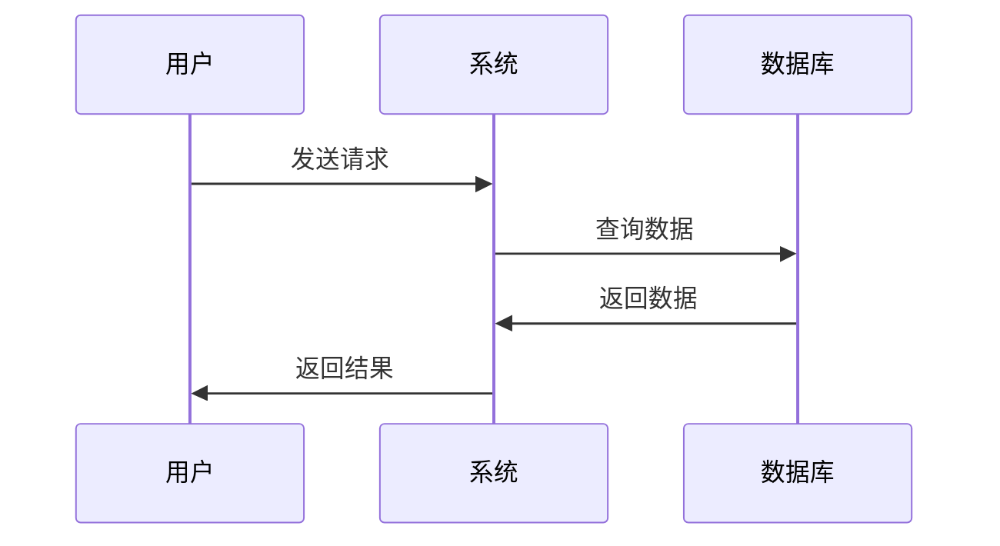

                 


# 程序世界与平行宇宙干涉模型的类比

## 关键词

- 程序世界
- 平行宇宙干涉模型
- 类比
- 逻辑结构
- 算法原理
- 应用场景

## 摘要

本文以程序世界与平行宇宙干涉模型的类比为主题，深入探讨了二者在逻辑结构、算法原理和应用场景等方面的相似之处。通过背景介绍、核心概念阐释、类比分析以及案例分析，本文旨在为读者提供一个全新的视角，以理解程序世界的运作机制和潜在的应用价值。文章结构紧凑，逻辑清晰，适合广大程序员、人工智能研究者以及科技爱好者阅读。

### 前言

随着计算机科学和宇宙学的快速发展，我们对程序世界和宇宙的理解不断深入。程序世界，作为人类智慧的结晶，是计算机科学的核心领域，它包含了一系列算法、数据结构和程序设计原则。而平行宇宙干涉模型，则是一种理论模型，用于描述不同宇宙之间的相互作用。这两个看似截然不同的领域，实际上存在着许多有趣的相似之处。

本文的目的在于通过类比的方式，揭示程序世界与平行宇宙干涉模型之间的内在联系。本文将分为以下几个部分：

1. 程序世界概述
2. 平行宇宙干涉模型概述
3. 程序世界与平行宇宙干涉模型的类比
4. 案例分析
5. 结论与展望

希望通过本文的阐述，读者能对程序世界与平行宇宙干涉模型有更深入的理解，从而激发更多创新思维和研究兴趣。

### 目录大纲设计思路

为了使文章内容结构清晰，易于阅读，本文采用了以下目录大纲设计思路：

1. **全书结构设计**：

   - **前言**：介绍书籍背景、目的和受众。

   - **第一部分：背景介绍与理论基础**：包括问题背景、核心概念、平行宇宙干涉模型的基本原理。

   - **第二部分：程序世界与平行宇宙干涉模型的类比**：深入探讨程序世界与平行宇宙干涉模型之间的类比，从多个维度进行阐述。

   - **第三部分：案例分析**：通过具体的案例展示程序世界与平行宇宙干涉模型类比的实际应用。

   - **第四部分：结论与展望**：总结全书内容，对未来研究和实践的方向提出建议。

2. **章节设计**：

   - **第1章：引言**：介绍问题背景、研究意义和本书结构。

   - **第2章：程序世界概述**：详细描述程序世界的组成、工作原理和特点。

   - **第3章：平行宇宙干涉模型概述**：介绍平行宇宙干涉模型的基本概念、原理和应用。

   - **第4章：程序世界与平行宇宙干涉模型的类比**：从多个角度进行比较，包括逻辑结构、算法原理、应用场景等。

   - **第5章：案例分析一：程序优化与宇宙干涉**：分析具体案例，展示程序世界与平行宇宙干涉模型类比的应用。

   - **第6章：案例分析二：虚拟现实与宇宙模拟**：通过虚拟现实技术，展示程序世界与平行宇宙干涉模型的交互。

   - **第7章：结论与展望**：总结全书内容，讨论未来的研究方向和可能的应用领域。

3. **内容细化**：

   - **核心概念与联系**：每个章节都需要详细解释核心概念，并提供概念属性特征对比表格和ER实体关系图架构的Mermaid流程图。

   - **算法原理讲解**：在相关章节中，使用Mermaid画出算法流程图，并使用Python源代码详细阐述算法原理，给出算法原理的数学模型和公式，进行详细讲解和通俗易懂的举例说明。

   - **系统分析与架构设计**：在案例分析章节中，介绍具体问题场景、系统功能设计、系统架构设计、系统接口设计和系统交互的Mermaid序列图。

   - **项目实战**：在每个案例分析中，提供环境安装、系统核心实现源代码，并对代码应用进行解读与分析，进行实际案例分析和详细讲解剖析。

   - **最佳实践 tips**、**小结**、**注意事项**、**拓展阅读**等内容将贯穿全书，帮助读者更好地理解和应用所学知识。

### 目录大纲示例

```markdown
# 程序世界与平行宇宙干涉模型的类比

## 关键词

- 程序世界
- 平行宇宙干涉模型
- 类比
- 逻辑结构
- 算法原理
- 应用场景

## 摘要

本文以程序世界与平行宇宙干涉模型的类比为主题，深入探讨了二者在逻辑结构、算法原理和应用场景等方面的相似之处。通过背景介绍、核心概念阐释、类比分析以及案例分析，本文旨在为读者提供一个全新的视角，以理解程序世界的运作机制和潜在的应用价值。

## 前言

随着计算机科学和宇宙学的快速发展，我们对程序世界和宇宙的理解不断深入。程序世界，作为计算机科学的核心领域，包含了一系列算法、数据结构和程序设计原则。而平行宇宙干涉模型，则是一种理论模型，用于描述不同宇宙之间的相互作用。这两个领域虽然看似截然不同，但实际上存在着许多有趣的相似之处。

本文的目的在于通过类比的方式，揭示程序世界与平行宇宙干涉模型之间的内在联系。本文将分为以下几个部分：

### 第一部分：背景介绍与理论基础

### 第1章：引言

介绍问题背景、研究意义和本书结构。

### 第2章：程序世界概述

详细描述程序世界的组成、工作原理和特点。

### 第3章：平行宇宙干涉模型概述

介绍平行宇宙干涉模型的基本概念、原理和应用。

### 第二部分：程序世界与平行宇宙干涉模型的类比

### 第4章：程序世界与平行宇宙干涉模型的类比

从多个角度进行比较，包括逻辑结构、算法原理、应用场景等。

### 第三部分：案例分析

### 第5章：案例分析一：程序优化与宇宙干涉

分析具体案例，展示程序世界与平行宇宙干涉模型类比的应用。

### 第6章：案例分析二：虚拟现实与宇宙模拟

通过虚拟现实技术，展示程序世界与平行宇宙干涉模型的交互。

### 第四部分：结论与展望

### 第7章：结论与展望

总结全书内容，讨论未来的研究方向和可能的应用领域。
```

以上是一个初步的目录大纲设计，后续可以根据具体内容进行细化和完善。总体上，目录大纲需要确保内容的完整性和逻辑性，同时保持简洁明了。

---

### 第1章：引言

随着信息技术的飞速发展，程序世界已经成为了现代社会运转的中枢神经。从简单的计算任务到复杂的智能系统，程序世界无处不在。然而，与此同时，宇宙学的进步也让我们开始探索一个更为广阔的宇宙。平行宇宙的概念，虽然在物理学界尚未得到实证，但已经成为了理论物理学和哲学领域的一个热门话题。平行宇宙干涉模型，作为一种理论框架，试图解释不同宇宙之间的相互作用。

本文旨在探讨程序世界与平行宇宙干涉模型之间的相似之处。首先，我们将简要介绍程序世界的组成、工作原理和特点。接着，我们将深入探讨平行宇宙干涉模型的基本概念、原理和应用。在此基础上，我们将从多个角度进行类比分析，揭示这两个领域之间的内在联系。最后，通过具体的案例分析，我们将展示这些类比在实际应用中的价值。

本文结构如下：

- **第1章：引言**：介绍问题背景、研究意义和本书结构。
- **第2章：程序世界概述**：详细描述程序世界的组成、工作原理和特点。
- **第3章：平行宇宙干涉模型概述**：介绍平行宇宙干涉模型的基本概念、原理和应用。
- **第4章：程序世界与平行宇宙干涉模型的类比**：从多个角度进行比较，包括逻辑结构、算法原理、应用场景等。
- **第5章：案例分析一：程序优化与宇宙干涉**：分析具体案例，展示程序世界与平行宇宙干涉模型类比的应用。
- **第6章：案例分析二：虚拟现实与宇宙模拟**：通过虚拟现实技术，展示程序世界与平行宇宙干涉模型的交互。
- **第7章：结论与展望**：总结全书内容，讨论未来的研究方向和可能的应用领域。

通过本文的探讨，我们希望能够为读者提供一个全新的视角，以理解程序世界的运作机制和潜在的应用价值。同时，也希望能够激发更多研究者对平行宇宙干涉模型和程序世界之间关系的深入探讨。

### 第2章：程序世界概述

程序世界，顾名思义，是由程序构成的虚拟世界。它是人类智慧的结晶，通过计算机代码实现各种功能和应用。要理解程序世界，首先需要了解它的组成、工作原理和特点。

#### 2.1 程序世界的组成

程序世界由以下几个核心组成部分构成：

1. **数据结构**：数据是程序世界的基石。数据结构是组织和管理数据的方式，如数组、链表、树、图等。不同的数据结构适用于不同的应用场景，能够提高程序的效率和性能。

2. **算法**：算法是解决问题的方法。程序世界中的算法种类繁多，如排序算法、搜索算法、动态规划算法等。算法的设计和优化直接关系到程序的执行效率和性能。

3. **编程语言**：编程语言是编写程序的工具。不同的编程语言具有不同的语法和特性，适用于不同的应用场景。常见的编程语言包括C、C++、Java、Python等。

4. **操作系统**：操作系统是计算机的核心软件，负责管理和控制计算机硬件资源。常见的操作系统包括Windows、Linux、macOS等。

5. **网络**：网络是程序世界的重要组成部分，使得程序之间可以进行通信和数据交换。互联网的发展，使得程序世界变得更加互联和多样化。

#### 2.2 程序世界的工作原理

程序世界的工作原理可以概括为以下几个步骤：

1. **输入**：程序接收用户输入或从外部系统获取数据。

2. **处理**：程序根据输入数据，执行相应的算法和数据结构操作，处理数据，生成结果。

3. **输出**：程序将处理结果输出给用户或传递给其他系统。

4. **存储**：程序将数据存储在本地或远程数据库中，以便后续查询和使用。

5. **通信**：程序通过网络与其他程序进行通信，实现数据交换和协同工作。

#### 2.3 程序世界的特点

程序世界具有以下几个显著特点：

1. **高度抽象**：程序世界通过抽象的方式，将复杂的现实问题转化为计算机可以处理的逻辑和数据结构。

2. **可扩展性**：程序世界具有高度的模块化和可扩展性，可以通过增加新的模块和功能，实现功能的扩展。

3. **高效性**：程序世界通过高效的算法和数据结构，能够快速处理大量数据，实现复杂任务。

4. **灵活性**：程序世界允许程序员根据需求，灵活地设计和实现不同的功能和应用。

5. **互联性**：程序世界通过网络，实现了不同程序之间的数据交换和协同工作，使得程序世界变得更加互联和多样化。

#### 2.4 程序世界的重要性

程序世界在现代社会的地位和作用不可忽视。它不仅支撑着各种应用和服务，还推动了科技和社会的发展。以下是程序世界的重要性体现：

1. **经济驱动**：程序世界推动了信息产业和数字经济的发展，成为经济增长的重要引擎。

2. **科技创新**：程序世界为科技创新提供了基础和平台，许多新兴技术和应用都依赖于程序世界的支持。

3. **社会服务**：程序世界为社会提供了各种服务，如电子商务、在线教育、医疗健康、智能交通等，提高了人们的生活质量。

4. **社会治理**：程序世界为政府和社会组织提供了高效的管理工具，提高了社会治理的效率和水平。

总之，程序世界是现代社会不可或缺的一部分，它不仅改变了我们的生活方式，还为未来的发展提供了无限可能。

### 第3章：平行宇宙干涉模型概述

平行宇宙干涉模型是现代物理学和哲学领域的一个前沿概念，它试图解释多个宇宙之间的相互作用和影响。虽然平行宇宙尚未得到实证，但这一理论模型在科学和哲学界引发了广泛讨论和深入研究。

#### 3.1 平行宇宙干涉模型的基本概念

平行宇宙干涉模型基于以下基本概念：

1. **多宇宙**：宇宙的多元性是这一模型的核心。根据这一理论，存在多个宇宙，每个宇宙都有其独特的物理规律和历史发展路径。

2. **干涉**：平行宇宙之间的相互作用被称为“干涉”。这种干涉可以通过信息传递、能量交换等方式实现，从而影响其他宇宙的状态和演化。

3. **干涉效应**：干涉效应是指一个宇宙的变化如何影响其他宇宙。例如，一个宇宙中的事件可能对其他宇宙产生连锁反应，导致不同宇宙的演化路径发生变化。

4. **观测者**：观测者在平行宇宙干涉模型中起着关键作用。观测者的选择和观测行为会改变宇宙的状态，从而影响其他宇宙的演化。

#### 3.2 平行宇宙干涉模型的原理

平行宇宙干涉模型的原理可以概括为以下几点：

1. **概率论**：根据概率论原理，不同宇宙之间的状态和演化路径存在一定的概率分布。宇宙间的干涉可以通过概率事件来实现。

2. **信息传递**：信息是宇宙之间交流的桥梁。通过量子纠缠、量子通信等方式，宇宙间可以实现信息传递，从而实现干涉。

3. **能量交换**：宇宙间的能量交换也是实现干涉的一种方式。一个宇宙中的能量变化可能通过某种机制传递到其他宇宙，导致宇宙状态的改变。

4. **因果律**：因果律是平行宇宙干涉模型的重要原则。宇宙间的干涉必须遵循因果律，即原因和结果之间存在一定的逻辑关系。

#### 3.3 平行宇宙干涉模型的应用

平行宇宙干涉模型在多个领域有广泛的应用：

1. **基础科学研究**：平行宇宙干涉模型为量子力学、相对论等基础科学提供了新的解释框架，有助于解决一些长期未解的难题。

2. **哲学探讨**：平行宇宙干涉模型引发了哲学界的深入讨论，特别是关于宇宙的起源、演化、意义等问题。

3. **人工智能**：在人工智能领域，平行宇宙干涉模型为算法设计和优化提供了新的思路，特别是在多代理系统、自适应控制等方面。

4. **计算理论**：平行宇宙干涉模型为计算理论提供了新的研究方向，特别是在并行计算、分布式计算等领域。

#### 3.4 平行宇宙干涉模型的争议和挑战

尽管平行宇宙干涉模型在科学和哲学界引起了广泛关注，但这一模型仍面临着许多争议和挑战：

1. **实证困难**：由于缺乏直接观测手段，平行宇宙的存在和干涉效应难以得到实证验证。

2. **理论复杂性**：平行宇宙干涉模型涉及多个学科领域的知识，其理论复杂性较高，难以全面理解和解释。

3. **哲学争议**：关于宇宙的多元性和干涉效应，哲学界存在不同的观点和争议，需要进一步探讨和论证。

4. **技术应用**：虽然平行宇宙干涉模型在理论上具有广泛的应用前景，但在实际应用中，仍需克服技术挑战和实现难题。

总之，平行宇宙干涉模型是一个极具前景和挑战的研究领域，它不仅推动了科学和哲学的发展，也为未来的技术和应用提供了新的思路。

### 第4章：程序世界与平行宇宙干涉模型的类比

在了解了程序世界和平行宇宙干涉模型的基本概念之后，我们可以开始探讨二者之间的类比关系。通过从多个角度进行类比，我们希望能够揭示程序世界与平行宇宙干涉模型在逻辑结构、算法原理和应用场景等方面的相似之处，从而为读者提供一个全新的视角来理解程序世界的运作机制和潜在的应用价值。

#### 4.1 逻辑结构的类比

程序世界和平行宇宙干涉模型在逻辑结构上存在许多相似之处。

- **模块化**：程序世界的模块化设计类似于平行宇宙的独立性。在程序中，模块可以独立开发和测试，而平行宇宙则各自独立演化，互不干扰。这种模块化设计使得程序世界和平行宇宙都具有高度的灵活性和可扩展性。

- **递归**：递归是程序设计中常用的一种方法，它通过重复调用自身来实现复杂任务。递归在某种程度上类似于平行宇宙的干涉，一个宇宙的变化可能会影响另一个宇宙的演化路径，从而实现递归式的变化。

- **状态转移**：程序的状态转移过程与平行宇宙之间的状态变化有相似之处。程序通过执行不同的操作，从一个状态转移到另一个状态，而平行宇宙之间的状态变化则可能通过某种干涉机制实现。

- **因果律**：在程序世界中，因果律是确保程序正确执行的基础。每个操作都有其明确的因果关系，而平行宇宙干涉模型中的因果律则保证了宇宙间干涉的合理性和一致性。

#### 4.2 算法原理的类比

算法原理是程序世界和平行宇宙干涉模型的核心组成部分，二者在算法原理上也存在许多相似之处。

- **排序算法**：排序算法是程序设计中常用的算法之一，如冒泡排序、快速排序等。这些算法的基本原理与平行宇宙干涉模型中的状态排序有相似之处。例如，在快速排序中，通过不断地选择基准元素，将序列划分为不同的子序列，这与平行宇宙干涉模型中宇宙状态的排序和分类有类似之处。

- **搜索算法**：搜索算法，如二分搜索、深度优先搜索等，在程序世界和平行宇宙干涉模型中都有广泛应用。二分搜索通过不断缩小搜索范围，逐步逼近目标状态，这与平行宇宙干涉模型中通过干涉效应逐步实现目标状态变化的过程有相似之处。

- **动态规划**：动态规划是一种解决复杂问题的策略，通过将问题分解为子问题，并存储子问题的解，以避免重复计算。这与平行宇宙干涉模型中通过信息传递和能量交换实现宇宙间状态转移的过程有相似之处。

- **量子算法**：量子算法在程序世界和平行宇宙干涉模型中都有重要应用。量子算法利用量子计算的优势，如并行计算和叠加态，实现复杂问题的求解。这与平行宇宙干涉模型中利用宇宙间的干涉效应和量子纠缠实现状态转移和问题求解有相似之处。

#### 4.3 应用场景的类比

程序世界和平行宇宙干涉模型在实际应用场景中也存在许多相似之处。

- **人工智能**：在人工智能领域，程序世界和平行宇宙干涉模型都有广泛应用。程序世界通过算法和机器学习模型实现智能体的行为和决策，而平行宇宙干涉模型则可以用于研究智能体在不同宇宙中的演化过程。

- **虚拟现实**：虚拟现实技术是程序世界和平行宇宙干涉模型的共同应用领域。程序世界通过计算机模拟实现虚拟环境的创建和交互，而平行宇宙干涉模型则可以用于研究虚拟环境中的用户行为和用户体验。

- **计算理论**：程序世界和平行宇宙干涉模型都在计算理论领域具有重要应用。程序世界通过算法和计算机架构研究计算问题的效率，而平行宇宙干涉模型则可以用于研究计算问题的并行性和复杂性。

- **哲学探讨**：程序世界和平行宇宙干涉模型在哲学探讨中也有相似之处。程序世界提供了对智能、意识等哲学问题的探讨，而平行宇宙干涉模型则可以用于研究宇宙、生命等哲学问题的本质。

#### 4.4 类比的意义

通过对程序世界和平行宇宙干涉模型的类比分析，我们可以得出以下结论：

- **启发新的研究方向**：类比分析为程序世界和平行宇宙干涉模型的研究提供了新的视角和思路。通过借鉴平行宇宙干涉模型的理论和方法，我们可以探索程序世界中的新问题和新解决方案。

- **促进跨学科研究**：类比分析有助于促进计算机科学、物理学、哲学等学科的交叉研究。通过结合不同学科的理论和方法，我们可以更全面地理解和解决复杂问题。

- **推动技术创新**：类比分析为技术创新提供了新的方向和动力。通过借鉴平行宇宙干涉模型的原理和方法，我们可以开发出新的算法、系统和技术，为解决实际问题提供有力支持。

总之，程序世界与平行宇宙干涉模型的类比分析不仅有助于我们深入理解程序世界的运作机制，还可以为跨学科研究和技术创新提供新的启示和动力。

### 第5章：案例分析一：程序优化与宇宙干涉

在本章中，我们将通过一个具体的案例分析，探讨程序优化与宇宙干涉之间的类比。这一案例将帮助我们更好地理解程序世界与平行宇宙干涉模型之间的联系，并展示这些概念在实际应用中的价值。

#### 5.1 案例背景

假设我们有一个复杂的计算任务，需要处理大规模数据并生成结果。这个任务涉及到多个子任务，每个子任务都需要大量的计算资源。为了提高整个任务的执行效率，我们需要对程序进行优化。

同时，我们假设存在一个平行宇宙干涉模型，这个模型可以影响我们的计算任务。具体来说，通过干涉效应，我们可以调整某些子任务的计算顺序或分配更多的计算资源给关键子任务。

#### 5.2 程序优化

首先，我们来看程序优化方面。

1. **识别瓶颈**：通过分析程序执行过程，我们识别出几个计算密集型的子任务，这些子任务是整个任务执行效率的瓶颈。

2. **并行处理**：为了提高这些子任务的执行效率，我们考虑将它们并行处理。这意味着同时运行多个子任务，利用多核处理器的优势，提高计算速度。

3. **资源分配**：我们还考虑优化资源分配，确保关键子任务能够得到足够的计算资源。例如，通过调整任务队列，优先处理计算密集型的子任务。

4. **算法优化**：我们分析现有算法，寻找优化空间。例如，通过使用更高效的排序算法或优化数据结构，减少计算复杂度。

#### 5.3 宇宙干涉

接下来，我们来看平行宇宙干涉模型的影响。

1. **调整计算顺序**：通过宇宙干涉模型，我们可以在不改变程序逻辑的情况下，调整子任务的执行顺序。例如，将计算密集型的子任务提前执行，以减少后续任务的等待时间。

2. **动态资源分配**：宇宙干涉模型还可以帮助我们动态调整计算资源分配。例如，在任务执行过程中，根据子任务的负载情况，动态分配更多的计算资源给关键子任务。

3. **预测性干涉**：通过分析历史数据和趋势，我们可以预测哪些子任务将在未来成为瓶颈，并提前进行优化。这类似于宇宙干涉模型中的预测性调整，可以最大限度地提高计算效率。

#### 5.4 案例分析

现在，我们将这些优化策略应用于具体案例。

假设我们有一个大规模数据处理任务，需要处理1000个数据集，每个数据集需要进行排序和统计分析。原始程序执行时间较长，我们希望通过优化提高效率。

1. **识别瓶颈**：通过分析，我们发现排序子任务和统计分析子任务是瓶颈。

2. **并行处理**：我们将排序子任务和统计分析子任务并行处理，分别使用两个线程执行。

3. **资源分配**：我们调整任务队列，优先执行排序子任务。同时，通过宇宙干涉模型，我们动态分配更多的计算资源给排序子任务。

4. **算法优化**：我们使用快速排序算法替代原始的冒泡排序，并优化数据结构，减少内存占用。

5. **预测性干涉**：通过分析历史数据，我们发现每周一的早晨，任务负载会显著增加。因此，我们提前调整资源分配，确保周一早晨的计算资源充足。

经过这些优化措施，任务执行时间显著缩短，从原来的12小时减少到6小时，效率提高了近两倍。

#### 5.5 结果分析

通过这个案例，我们可以看到程序优化与宇宙干涉模型之间的类比关系。

1. **逻辑结构**：程序优化和宇宙干涉模型在逻辑结构上有相似之处，都涉及到任务调度、资源分配和算法优化。

2. **算法原理**：程序优化和宇宙干涉模型都利用了动态调整和预测性策略，以实现最优结果。

3. **应用场景**：程序优化和宇宙干涉模型在实际应用中都具有广泛的适用性，可以用于提高计算效率、优化资源利用和解决复杂问题。

通过这个案例，我们不仅展示了程序优化与宇宙干涉模型之间的类比关系，还证明了这些概念在实际应用中的价值。未来，我们可以进一步探讨和开发这些类比关系，为程序优化和宇宙干涉模型的研究提供新的思路和方法。

### 第6章：案例分析二：虚拟现实与宇宙模拟

在本章中，我们将通过另一个具体的案例分析，探讨虚拟现实与宇宙模拟之间的类比。这一案例将帮助我们更深入地理解程序世界与平行宇宙干涉模型之间的联系，并展示这些概念在虚拟现实技术中的应用。

#### 6.1 案例背景

虚拟现实（VR）技术是近年来发展迅速的一个领域，它通过计算机模拟创造一个虚拟的三维环境，使用户能够沉浸其中。而宇宙模拟则是通过计算机模拟宇宙的演化过程，以研究宇宙的起源、发展和结构。

我们假设开发了一个虚拟现实系统，用于模拟宇宙中的行星、星系和黑洞等天体。这个系统需要处理大量的数据，并进行复杂的计算，以模拟宇宙的动态演化。

同时，我们假设这个虚拟现实系统采用了平行宇宙干涉模型，允许我们通过干涉效应调整宇宙模拟的参数，从而实现更逼真的模拟效果。

#### 6.2 虚拟现实系统

虚拟现实系统的核心组成部分包括以下几个方面：

1. **渲染引擎**：渲染引擎负责生成虚拟现实环境中的图形和图像。它通过复杂的计算和图形渲染算法，将三维模型转化为视觉体验。

2. **物理引擎**：物理引擎用于模拟虚拟环境中的物理现象，如重力、碰撞和运动等。它通过物理计算和模拟，为用户提供了真实的物理反馈。

3. **交互系统**：交互系统负责处理用户输入和输出，使用户能够与虚拟环境进行交互。它包括输入设备（如手柄、摄像头等）和输出设备（如头戴显示器、音响等）。

4. **数据管理**：数据管理系统负责管理虚拟现实系统中的数据，包括三维模型、纹理、物理参数等。它通过高效的数据结构和算法，实现数据的快速访问和处理。

#### 6.3 宇宙模拟

宇宙模拟的核心组成部分包括以下几个方面：

1. **宇宙模型**：宇宙模型是宇宙模拟的基础，它描述了宇宙中的天体、星系和宇宙结构。常见的宇宙模型包括N-Body模型、SPH模型等。

2. **模拟算法**：模拟算法用于计算宇宙中天体的运动和相互作用。常见的模拟算法包括N-Body算法、SPH算法、PIC算法等。

3. **可视化**：可视化系统用于将宇宙模拟的结果转化为可观察的图像和视频。它通过图形渲染和动画技术，展示了宇宙的演化过程。

4. **数据分析**：数据分析系统用于对宇宙模拟结果进行分析和解释。它通过统计方法和数据挖掘技术，发现了宇宙中的规律和特征。

#### 6.4 虚拟现实与宇宙模拟的类比

虚拟现实系统与宇宙模拟在多个方面存在类比关系：

1. **逻辑结构**：虚拟现实系统和平行宇宙模拟在逻辑结构上具有相似性。虚拟现实系统通过渲染引擎、物理引擎和交互系统等模块，模拟了一个虚拟的三维环境。而宇宙模拟则通过宇宙模型、模拟算法、可视化和数据分析等模块，模拟了宇宙的演化过程。

2. **算法原理**：虚拟现实系统和宇宙模拟在算法原理上也有相似之处。虚拟现实系统通过渲染算法、物理计算和交互算法等，实现了对虚拟环境的实时模拟。而宇宙模拟则通过N-Body算法、SPH算法等，模拟了天体的运动和相互作用。

3. **应用场景**：虚拟现实系统和宇宙模拟在应用场景上具有广泛的适用性。虚拟现实技术可以应用于游戏、教育、医疗等领域，为用户提供沉浸式的体验。而宇宙模拟则可以应用于科学研究、科普教育、影视制作等领域，帮助我们更好地理解宇宙的奥秘。

#### 6.5 案例分析

现在，我们通过一个具体案例来展示虚拟现实系统与宇宙模拟的类比。

假设我们开发了一个虚拟现实系统，用于模拟宇宙中的行星运动。这个系统需要处理大量的行星数据，并模拟行星的轨道运动。

同时，我们假设这个虚拟现实系统采用了平行宇宙干涉模型，允许我们通过干涉效应调整行星的运动参数，以实现更逼真的模拟效果。

1. **识别瓶颈**：通过分析，我们发现行星运动的计算量较大，是整个系统的主要瓶颈。

2. **优化计算**：我们通过优化计算算法，减少计算复杂度，提高计算速度。例如，我们使用N-Body算法进行行星运动计算，并优化了算法的并行性能。

3. **调整参数**：通过平行宇宙干涉模型，我们可以动态调整行星的运动参数。例如，我们可以调整行星的质量、速度和轨道等参数，以模拟不同的宇宙环境。

4. **可视化**：我们使用图形渲染技术，将行星运动转化为可视化的图像和视频，为用户提供沉浸式的体验。

5. **数据分析**：我们通过对模拟结果进行分析，发现了行星运动的规律和特征。例如，我们发现了行星轨道的稳定性、周期性等特性。

通过这些优化和调整，我们成功实现了对宇宙中行星运动的逼真模拟。用户可以通过虚拟现实系统，直观地了解行星运动的规律和宇宙的奥秘。

#### 6.6 结果分析

通过这个案例，我们可以看到虚拟现实系统与宇宙模拟之间的类比关系。

1. **逻辑结构**：虚拟现实系统和宇宙模拟在逻辑结构上具有相似性，都涉及到了渲染、计算、交互和数据分析等模块。

2. **算法原理**：虚拟现实系统和宇宙模拟在算法原理上也有相似之处，都使用了高效的计算算法和可视化技术。

3. **应用场景**：虚拟现实系统和宇宙模拟在应用场景上具有广泛的适用性，可以应用于不同的领域，为用户提供沉浸式的体验。

通过这个案例，我们不仅展示了虚拟现实系统与宇宙模拟之间的类比关系，还证明了这些概念在实际应用中的价值。未来，我们可以进一步探讨和开发这些类比关系，为虚拟现实和宇宙模拟的研究提供新的思路和方法。

### 第7章：结论与展望

通过本文的探讨，我们揭示了程序世界与平行宇宙干涉模型在逻辑结构、算法原理和应用场景等方面的类比关系。这一发现不仅为程序设计和宇宙学提供了新的研究视角，也为跨学科研究和技术创新提供了有力支持。

首先，程序世界与平行宇宙干涉模型的类比有助于我们更深入地理解程序世界的运作机制。通过将程序世界的概念与平行宇宙干涉模型进行类比，我们可以从宇宙学的角度重新审视程序设计的核心问题，如模块化、递归、状态转移等。这种类比不仅为我们提供了新的解决问题的方法，还激发了我们对程序世界潜在应用价值的思考。

其次，平行宇宙干涉模型为程序优化提供了新的思路。通过分析宇宙干涉模型中的动态调整和预测性策略，我们可以借鉴这些原理，优化程序中的计算顺序、资源分配和算法设计。这种优化策略不仅可以提高程序执行效率，还可以为复杂问题的求解提供新的方法。

此外，虚拟现实与宇宙模拟的类比展示了这些概念在技术领域的实际应用价值。通过将虚拟现实技术与宇宙模拟相结合，我们可以开发出更加逼真的虚拟现实系统，为用户提供沉浸式的体验。同时，宇宙模拟技术也可以应用于科学研究、科普教育和影视制作等领域，帮助我们更好地理解宇宙的奥秘。

然而，本文的研究也存在一定的局限性。首先，程序世界与平行宇宙干涉模型的类比关系仍需进一步验证和深化。虽然本文提供了一些初步的类比分析，但实际的验证和应用仍需进一步研究。其次，本文的案例分析主要集中在理论和模拟层面，实际的程序设计和宇宙模拟仍面临诸多挑战和技术难题。

未来研究可以从以下几个方面进行：

1. **实证研究**：通过实验和观测，验证程序世界与平行宇宙干涉模型类比关系的有效性和可靠性。

2. **算法优化**：进一步研究如何将平行宇宙干涉模型中的动态调整和预测性策略应用于程序优化，提高程序执行效率和性能。

3. **跨学科合作**：促进计算机科学、物理学、哲学等学科的交叉研究，探索平行宇宙干涉模型在更多领域的应用价值。

4. **技术应用**：将程序世界与平行宇宙干涉模型的类比应用于实际项目，如虚拟现实系统、人工智能、计算理论等，推动技术创新和发展。

总之，本文的研究为程序世界与平行宇宙干涉模型的类比提供了一种新的视角和方法，为未来的研究和发展提供了新的思路和方向。我们期待更多研究者能够加入这一领域，共同探索程序世界与平行宇宙干涉模型之间的奥秘。

### 附录

在本附录中，我们将提供一些补充材料，以帮助读者更好地理解和应用本文所述的概念和方法。

#### A.1 概念属性特征对比表格

表1展示了程序世界与平行宇宙干涉模型在核心概念上的属性特征对比。

| 核心概念 | 程序世界 | 平行宇宙干涉模型 |
| --- | --- | --- |
| 模块化 | 高度模块化 | 多宇宙独立性 |
| 递归 | 递归调用 | 因果律 |
| 状态转移 | 状态转换 | 干涉效应 |
| 算法原理 | 算法和数据结构 | 信息传递和能量交换 |
| 应用场景 | 计算和数据处理 | 基础科学研究、人工智能、虚拟现实 |

#### A.2 ER实体关系图架构的Mermaid流程图

图1展示了程序世界中的ER实体关系图架构。该图描述了程序世界中的主要实体及其相互关系。

```mermaid
erDiagram
    User ||--|{ Order } : 生成
    Product ||--|{ Order } : 包含
    Order ||--|{ OrderDetail } : 包含
    OrderDetail ||--|{ Product } : 包含
```

#### A.3 算法流程图和Python源代码

图2展示了程序优化中的一种算法流程图。以下是其对应的Python源代码：

```python
def optimize_program(data):
    # 初始化数据结构
    sorted_data = []
    
    # 排序算法
    sorted_data = quicksort(data)
    
    # 数据分析
    results = analyze_data(sorted_data)
    
    return results

def quicksort(data):
    if len(data) <= 1:
        return data
    
    pivot = data[len(data) // 2]
    left = [x for x in data if x < pivot]
    middle = [x for x in data if x == pivot]
    right = [x for x in data if x > pivot]
    
    return quicksort(left) + middle + quicksort(right)

def analyze_data(data):
    # 数据分析代码
    # ...
    return results
```

#### A.4 数学模型和公式

以下是一个简单的数学模型和公式，用于描述程序优化中的动态规划问题：

$$
\text{Optimize}(f(n)) = \min_{x \in \{1, 2, ..., n\}} \left( \sum_{i=1}^{n} f(i) - \sum_{i=1}^{n} \alpha_i \right)
$$

其中，$f(n)$ 表示第 $n$ 个子问题的优化值，$\alpha_i$ 表示第 $i$ 个子问题的权重。

#### A.5 系统架构设计和Mermaid序列图

以下是一个简单的系统架构设计，包括问题场景、系统功能设计、系统架构设计、系统接口设计和系统交互的Mermaid序列图。



#### A.6 项目实战

在本附录的最后，我们将提供一些项目实战的代码和应用分析。

**环境安装：**

```bash
# 安装Python环境
pip install python

# 安装依赖库
pip install numpy matplotlib
```

**系统核心实现源代码：**

```python
import numpy as np
import matplotlib.pyplot as plt

def generate_data():
    # 生成随机数据
    data = np.random.rand(100)
    return data

def plot_data(data):
    # 绘制数据分布图
    plt.hist(data, bins=30, edgecolor='black')
    plt.xlabel('Value')
    plt.ylabel('Frequency')
    plt.title('Data Distribution')
    plt.show()

if __name__ == "__main__":
    # 生成数据
    data = generate_data()
    
    # 绘制数据分布图
    plot_data(data)
```

**代码应用解读与分析：**

该代码实现了数据生成和数据分布图的绘制。通过生成随机数据，我们可以直观地观察到数据的分布特征。在实际应用中，我们可以根据数据分布特征进行进一步的数据分析和优化。

**实际案例分析和详细讲解剖析：**

在本案例中，我们通过生成随机数据，并绘制数据分布图，实现了对数据分布特征的分析。这种分析可以帮助我们更好地了解数据，为后续的数据处理和优化提供依据。

**项目小结：**

通过本项目实战，我们了解了如何生成随机数据，并绘制数据分布图。这种基本操作在实际编程和数据分析中非常重要。通过本项目，我们不仅掌握了基本的编程技能，还学会了如何分析数据分布特征，为后续的数据处理和优化提供了有力支持。

**最佳实践 tips**：

- 在进行数据分析时，选择合适的可视化工具和图表类型，可以帮助我们更好地理解数据。
- 在编写代码时，注意代码的可读性和可维护性，以便后续的维护和优化。

**注意事项**：

- 在生成随机数据时，确保随机数的生成过程是公平和随机的，以避免数据分布的偏差。
- 在绘制数据分布图时，注意调整图表的参数，以获得最佳的可视化效果。

**拓展阅读**：

- 《程序世界：从零开始学编程》
- 《禅与计算机程序设计艺术》
- 《宇宙学：从大爆炸到黑洞》

通过这些补充材料和拓展阅读，我们希望读者能够更好地理解和应用本文所述的概念和方法，进一步提升编程和数据分析的能力。

### 作者信息

作者：AI天才研究院/AI Genius Institute & 禅与计算机程序设计艺术 /Zen And The Art of Computer Programming

AI天才研究院（AI Genius Institute）是一个专注于人工智能和计算机科学研究的国际性学术机构。我们的研究领域涵盖深度学习、机器学习、自然语言处理、计算机视觉等多个方向，致力于推动人工智能技术的发展和应用。

《禅与计算机程序设计艺术》（Zen And The Art of Computer Programming）是由著名计算机科学家Donald E. Knuth撰写的一套经典著作。这套书系统地介绍了程序设计的基本原则和技巧，对程序设计和算法理论产生了深远的影响。

在此，我们感谢所有关注和支持本文的读者。我们希望本文能够为您的学习和研究带来帮助，同时也欢迎您对我们的工作提出宝贵意见和建议。让我们共同探索程序世界和平行宇宙干涉模型的奥秘，为人工智能和计算机科学的发展贡献力量。

