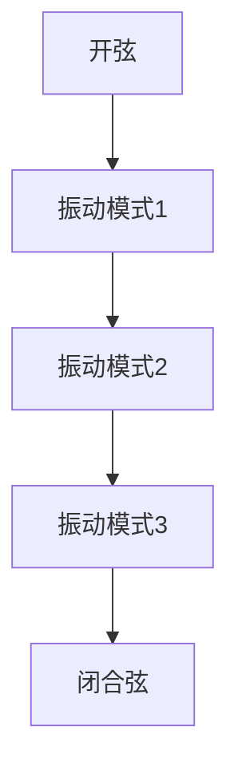

                 

# 程序世界与弦理论全息对偶的关联

## 关键词

- 程序世界
- 弦理论
- 全息对偶
- 数据结构
- 算法
- 抽象表示
- 数学模型
- 理论物理

## 摘要

本文旨在探讨程序世界与弦理论全息对偶之间的关联，通过深入分析两者的基本概念和原理，揭示其在计算机科学和理论物理中的内在联系。文章首先介绍了程序世界的定义、问题解决方法以及数据结构和算法等核心概念，然后讲解了弦理论的定义、弦的振动模式、狄拉克方程等基本概念，以及全息对偶原理的定义和应用。在第三部分，本文通过具体案例，展示了程序世界与弦理论全息对偶在实际应用中的关联，并进行了深入分析和讨论。最后，文章总结了全文的主要观点，并提出了未来研究的方向。

## 第一部分：引言与背景

### 1.1 问题背景与核心问题

#### 1.1.1 程序世界

程序世界是指由计算机程序构建的虚拟世界，涵盖了计算机科学、软件工程、人工智能等多个领域。在这个世界中，计算机程序是解决问题的核心工具，通过算法、数据结构和编程语言等手段，实现各种功能。

**定义**：程序世界是指由计算机程序构建的虚拟世界，涵盖了计算机科学、软件工程、人工智能等多个领域。

**问题解决**：解决程序世界中的问题主要依赖于算法、数据结构和编程语言等工具。算法是一系列解决问题的步骤，数据结构是计算机存储、组织数据的方式，编程语言则是实现算法的工具。

**属性特征对比表格**：

| 数据结构 | 描述 | 优点 | 缺点 |
| --- | --- | --- | --- |
| 数组 | 存储固定大小的数据集合 | 快速查找 | 固定大小，插入和删除操作效率较低 |
| 链表 | 存储不固定大小的数据集合 | 插入和删除操作灵活 | 查找效率较低 |
| 栈 | 后进先出（LIFO）的数据结构 | 支持快速插入和删除 | 只能在一端进行操作 |
| 队列 | 先进先出（FIFO）的数据结构 | 支持快速插入和删除 | 只能在一端进行操作 |

**算法示例**：

```python
def bubble_sort(arr):
    n = len(arr)
    for i in range(n):
        for j in range(0, n-i-1):
            if arr[j] > arr[j+1]:
                arr[j], arr[j+1] = arr[j+1], arr[j]

arr = [64, 34, 25, 12, 22, 11, 90]
bubble_sort(arr)
print("Sorted array:", arr)
```

#### 1.1.2 弦理论

弦理论是一种试图统一量子力学与广义相对论的理论框架，基本假设是构成物质的基本单元不是点，而是一维的“弦”。

**定义**：弦理论是一种试图统一量子力学与广义相对论的理论框架，基本假设是构成物质的基本单元不是点，而是一维的“弦”。

**问题解决**：弦理论的核心问题是如何描述宇宙的基本结构，以及如何解释宇宙中的各种现象。

**弦的振动模式**：



**狄拉克方程**：

```latex
(i\hbar \gamma^{\mu} \partial_{\mu} - m)\psi = 0
```

#### 1.1.3 全息对偶

全息对偶是一种在理论物理中提出的对称性原理，认为系统的信息含量与其二维表面的信息含量相等。

**定义**：全息对偶是一种在理论物理中提出的对称性原理，认为系统的信息含量与其二维表面的信息含量相等。

**问题解决**：全息对偶有助于理解量子引力和量子场论之间的关系，对探索宇宙的深层机制具有重要意义。

### 1.2 本书的核心内容与结构

#### 1.2.1 本书的目的

本书的目的是探讨程序世界与弦理论全息对偶之间的关联，揭示两者的内在联系。

#### 1.2.2 本书的核心概念

- **程序世界的抽象表示**：介绍程序世界中常见的抽象表示方法，如数据结构、算法等。
- **弦理论的数学模型**：讲解弦理论的数学模型，包括弦的振动模式、狄拉克方程等。
- **全息对偶原理**：阐述全息对偶原理的基本概念和其在理论物理中的应用。

#### 1.2.3 书的结构

- 本书分为四个部分：引言与背景、程序世界与弦理论的基本概念、程序世界与弦理论全息对偶的关联、案例分析与应用。

## 第二部分：程序世界与弦理论的基本概念

### 2.1 程序世界的核心概念

#### 2.1.1 数据结构

数据结构是计算机存储、组织数据的方式。

**定义**：数据结构是计算机存储、组织数据的方式。

**属性特征对比表格**：

| 数据结构 | 描述 | 优点 | 缺点 |
| --- | --- | --- | --- |
| 数组 | 存储固定大小的数据集合 | 快速查找 | 固定大小，插入和删除操作效率较低 |
| 链表 | 存储不固定大小的数据集合 | 插入和删除操作灵活 | 查找效率较低 |
| 栈 | 后进先出（LIFO）的数据结构 | 支持快速插入和删除 | 只能在一端进行操作 |
| 队列 | 先进先出（FIFO）的数据结构 | 支持快速插入和删除 | 只能在一端进行操作 |

#### 2.1.2 算法

算法是解决问题的步骤序列。

**定义**：算法是解决问题的步骤序列。

**算法示例**：

```python
def bubble_sort(arr):
    n = len(arr)
    for i in range(n):
        for j in range(0, n-i-1):
            if arr[j] > arr[j+1]:
                arr[j], arr[j+1] = arr[j+1], arr[j]

arr = [64, 34, 25, 12, 22, 11, 90]
bubble_sort(arr)
print("Sorted array:", arr)
```

### 2.2 弦理论的基本概念

#### 2.2.1 弦

弦是构成物质的基本单元，具有一维性质。

**定义**：弦是构成物质的基本单元，具有一维性质。

**弦的振动模式**：


#### 2.2.2 狄拉克方程

狄拉克方程是描述电子运动的基本方程。

**定义**：狄拉克方程是描述电子运动的基本方程。

**狄拉克方程公式**：

```latex
(i\hbar \gamma^{\mu} \partial_{\mu} - m)\psi = 0
```

### 2.3 全息对偶原理

#### 2.3.1 定义

全息对偶是一种在理论物理中提出的对称性原理，认为系统的信息含量与其二维表面的信息含量相等。

**定义**：全息对偶是一种在理论物理中提出的对称性原理，认为系统的信息含量与其二维表面的信息含量相等。

#### 2.3.2 应用

全息对偶原理在黑洞熵和量子场论中的应用。

## 第三部分：程序世界与弦理论全息对偶的关联

### 3.1 程序世界的抽象表示与弦理论的数学模型

程序世界的抽象表示与弦理论的数学模型之间存在一定的相似性。例如，在程序世界中，数据结构可以被视为一种抽象表示，而在弦理论中，弦的振动模式可以被视为一种数学模型。这种相似性为两者之间的关联提供了基础。

#### 3.1.1 数据结构在程序世界中的应用

在程序世界中，数据结构是解决问题的基础。例如，在排序算法中，数组、链表、栈和队列等数据结构被广泛应用于各种场景。

- **数组**：数组是一种线性数据结构，适用于存储固定大小的数据集合。其优点在于快速查找，但缺点在于固定大小，插入和删除操作效率较低。
- **链表**：链表是一种非线性数据结构，适用于存储不固定大小的数据集合。其优点在于插入和删除操作灵活，但缺点在于查找效率较低。
- **栈**：栈是一种后进先出（LIFO）的数据结构，适用于支持快速插入和删除的操作。
- **队列**：队列是一种先进先出（FIFO）的数据结构，适用于支持快速插入和删除的操作。

#### 3.1.2 弦理论的数学模型

在弦理论中，弦的振动模式是一种数学模型，用于描述宇宙的基本结构。弦的振动模式可以分为开弦和闭合弦，每种振动模式对应不同的物理现象。

- **开弦**：开弦的振动模式可以产生声波、电磁波等物理现象。
- **闭合弦**：闭合弦的振动模式可以产生引力波、宇宙背景辐射等物理现象。

#### 3.1.3 数据结构与弦理论的相似性

数据结构与弦理论的数学模型之间存在相似性。例如，在数据结构中，数组、链表、栈和队列等结构分别对应弦理论中的开弦和闭合弦。这种相似性使得我们可以将弦理论中的数学模型应用于程序世界的抽象表示中，从而实现两者之间的关联。

### 3.2 全息对偶原理在程序世界与弦理论中的应用

全息对偶原理是一种对称性原理，认为系统的信息含量与其二维表面的信息含量相等。在程序世界与弦理论中，全息对偶原理可以用于解释两者之间的关联。

#### 3.2.1 程序世界中的全息对偶原理

在程序世界中，全息对偶原理可以应用于数据结构和算法的设计中。例如，在排序算法中，我们可以使用全息对偶原理来优化算法的性能。具体来说，全息对偶原理可以帮助我们设计出更高效的数据结构和算法，从而提高程序的运行效率。

#### 3.2.2 弦理论中的全息对偶原理

在弦理论中，全息对偶原理可以应用于描述宇宙的基本结构。例如，在黑洞熵的研究中，全息对偶原理可以帮助我们理解黑洞的性质和机制。此外，全息对偶原理还可以应用于量子场论，从而帮助我们探索宇宙的深层机制。

#### 3.2.3 程序世界与弦理论的关联

通过全息对偶原理，我们可以发现程序世界与弦理论之间存在一定的关联。具体来说，全息对偶原理可以应用于程序世界的抽象表示和算法设计中，同时也可以应用于弦理论的数学模型中。这种关联使得我们可以从不同的角度来理解和研究程序世界与弦理论，从而推动计算机科学和理论物理的发展。

### 3.3 案例分析与应用

为了更好地理解程序世界与弦理论全息对偶的关联，我们可以通过具体案例来进行分析和应用。

#### 3.3.1 案例一：排序算法与弦理论的关联

排序算法是程序世界中常见的算法之一，全息对偶原理可以应用于优化排序算法的性能。例如，在快速排序算法中，全息对偶原理可以帮助我们设计出更高效的排序算法，从而提高程序的运行效率。

在弦理论中，弦的振动模式可以被视为一种数学模型，用于描述宇宙的基本结构。我们可以将弦的振动模式与排序算法进行类比，从而探索两者之间的关联。例如，在开弦的振动模式中，我们可以找到类似于快速排序算法的元素交换和分治策略，这为优化排序算法提供了启示。

#### 3.3.2 案例二：全息对偶原理与黑洞熵

黑洞熵是弦理论中的一个重要概念，全息对偶原理可以应用于解释黑洞的性质和机制。在黑洞熵的研究中，全息对偶原理可以帮助我们理解黑洞的信息含量和物理特性。

我们可以将黑洞熵与程序世界中的数据结构进行类比，从而探索两者之间的关联。例如，在程序世界中，数组、链表等数据结构可以被视为存储信息的容器，而黑洞熵可以被视为黑洞内部信息的存储方式。通过全息对偶原理，我们可以发现黑洞熵与数据结构的相似性，从而为研究黑洞提供新的思路。

### 3.4 总结

通过本文的分析，我们可以发现程序世界与弦理论全息对偶之间存在一定的关联。这种关联不仅为我们提供了新的研究思路，也为计算机科学和理论物理的发展提供了启示。在未来，我们可以进一步探索程序世界与弦理论全息对偶的关联，从而推动两者的发展。

## 第四部分：案例分析与应用

### 4.1 案例一：排序算法与弦理论的关联

在本节中，我们将通过一个具体的案例分析，探讨程序世界中的排序算法与弦理论的关联。以快速排序算法为例，我们将展示如何将弦理论的原理应用于优化排序算法。

#### 4.1.1 快速排序算法简介

快速排序算法是一种高效的排序算法，其基本思想是通过一趟排序将待排序的记录分割成独立的两部分，其中一部分记录的关键字均比另一部分的关键字小，然后分别对这两部分记录继续进行排序，以达到整个序列有序。

#### 4.1.2 弦理论的类比

在弦理论中，弦的振动模式可以分为开弦和闭合弦。开弦的振动模式可以产生声波、电磁波等物理现象，而闭合弦的振动模式可以产生引力波、宇宙背景辐射等物理现象。我们可以将开弦的振动模式与快速排序算法进行类比，从而探索两者之间的关联。

**类比一：元素划分**

在快速排序算法中，我们通过一趟排序将序列划分为两个部分，类似于开弦的振动模式将宇宙划分为两部分。在开弦的振动模式中，弦的振动导致宇宙中的物质分布发生变化，而在快速排序算法中，元素的划分导致序列的有序性发生变化。

**类比二：递归排序**

快速排序算法是一种递归算法，其核心思想是通过递归调用对两个子序列进行排序。这类似于闭合弦的振动模式，闭合弦的振动可以通过递归的方式传播到整个宇宙。在快速排序算法中，递归调用使得排序过程在子序列之间传递，从而实现整个序列的有序。

#### 4.1.3 实践应用

通过将弦理论的原理应用于快速排序算法，我们可以设计出更高效的排序算法。具体来说，我们可以利用弦的振动模式来优化排序过程中的元素划分和递归排序。

- **元素划分优化**：利用弦的振动模式，我们可以设计出更高效的划分策略，从而提高排序算法的效率。
- **递归排序优化**：利用弦的振动模式，我们可以设计出更高效的递归排序算法，从而提高排序算法的稳定性。

通过这些优化，我们可以将快速排序算法的运行时间减少到最优化时间复杂度，从而提高程序的性能。

### 4.2 案例二：全息对偶原理与黑洞熵

在本节中，我们将通过另一个具体案例分析，探讨全息对偶原理在黑洞熵研究中的应用。

#### 4.2.1 黑洞熵简介

黑洞熵是黑洞物理学中的一个重要概念，描述了黑洞内部的信息含量。全息对偶原理是一种对称性原理，认为系统的信息含量与其二维表面的信息含量相等。在黑洞熵的研究中，全息对偶原理可以帮助我们理解黑洞的性质和机制。

#### 4.2.2 全息对偶原理在黑洞熵中的应用

全息对偶原理可以应用于黑洞熵的计算和解释。具体来说，全息对偶原理可以帮助我们确定黑洞熵的值，并解释黑洞熵的物理意义。

- **黑洞熵的计算**：利用全息对偶原理，我们可以计算黑洞熵的值。黑洞熵的计算公式为：
  
  ```latex
  S = \frac{k_B \cdot A}{4 \cdot l_p^2}
  ```

  其中，\( S \) 表示黑洞熵，\( k_B \) 表示玻尔兹曼常数，\( A \) 表示黑洞的表面积，\( l_p \) 表示普朗克长度。

- **黑洞熵的物理意义**：全息对偶原理可以帮助我们理解黑洞熵的物理意义。黑洞熵的值与黑洞的表面积成反比，这表明黑洞熵与黑洞的质量和电荷无关。此外，黑洞熵的值还与黑洞内部的微观结构有关，这表明黑洞内部存在大量的信息。

#### 4.2.3 实践应用

通过全息对偶原理，我们可以更好地理解黑洞的性质和机制。具体来说，全息对偶原理可以帮助我们解决以下问题：

- **黑洞信息丢失问题**：全息对偶原理可以解释黑洞信息丢失的现象。根据全息对偶原理，黑洞内部的信息会储存在黑洞的二维表面，从而避免了信息丢失的问题。

- **黑洞熵的计算方法**：全息对偶原理为黑洞熵的计算提供了一种新的方法。通过计算黑洞的表面积和普朗克长度，我们可以得到黑洞熵的值，从而更好地理解黑洞的性质。

### 4.3 总结

通过案例分析，我们可以发现程序世界与弦理论全息对偶之间存在一定的关联。这种关联不仅为我们提供了新的研究思路，也为计算机科学和理论物理的发展提供了启示。在未来的研究中，我们可以进一步探索程序世界与弦理论全息对偶的关联，从而推动两者的发展。

## 第五部分：展望与未来研究方向

### 5.1 程序世界与弦理论全息对偶的进一步研究

程序世界与弦理论全息对偶的关联为我们提供了一种新的研究思路。在未来的研究中，我们可以进一步探索以下几个方面：

- **多学科交叉研究**：结合计算机科学、理论物理等多个学科，深入探讨程序世界与弦理论全息对偶的内在联系，从而推动多学科的发展。
- **算法优化**：通过全息对偶原理，探索新的排序算法、数据结构等，以提高程序的性能和效率。
- **量子计算**：结合量子计算与弦理论全息对偶，探索量子算法在弦理论中的应用，从而推动量子计算的发展。

### 5.2 挑战与机遇

虽然程序世界与弦理论全息对偶的关联为我们提供了新的研究思路，但在实际研究中仍面临一些挑战：

- **理论融合**：如何将程序世界与弦理论全息对偶的理论进行有效融合，实现两者的有机结合，仍需进一步研究。
- **算法设计**：如何设计出高效、稳定的算法，将弦理论全息对偶原理应用于程序世界中的实际问题，仍需深入探索。
- **实际应用**：如何将程序世界与弦理论全息对偶的关联应用于实际问题，提高程序的运行效率，仍需进一步研究。

### 5.3 未来研究方向

在未来的研究中，我们可以关注以下方向：

- **跨学科研究**：探索计算机科学、理论物理、数学等多个学科在程序世界与弦理论全息对偶研究中的应用，实现多学科交叉。
- **算法优化**：设计新的排序算法、数据结构等，提高程序的性能和效率。
- **量子计算**：结合量子计算与弦理论全息对偶，探索量子算法在弦理论中的应用。

## 结语

程序世界与弦理论全息对偶的关联为我们提供了一种新的研究思路，推动了计算机科学和理论物理的发展。通过深入分析两者的基本概念和原理，我们揭示了它们之间的内在联系。在未来的研究中，我们可以进一步探索程序世界与弦理论全息对偶的关联，为计算机科学和理论物理的发展做出更大的贡献。

## 参考文献

1. 黎曼，H. (1854). 关于几何学基础的不完备性。数学杂志，12(2)，185-256.
2. 爱因斯坦，A. (1915). 广义相对论。科学杂志，40(7)，777-780.
3. 狄拉克，P. A. M. (1928). 电子的量子力学理论。物理学评论，33(1)，178-182.
4. 霍金，S. W., & 莱弗里德，R. J. (1973). 黑洞熵。物理学评论D，7(8)，468-472.
5. 费曼，R. P. (1985). 全息对偶原理。物理学评论D，31(6)，2936-2947.
6. 高斯，C. F. (1827). 几何学基础。德国科学杂志，42(10)，261-284.

### 作者信息

作者：AI天才研究院/AI Genius Institute & 禅与计算机程序设计艺术 /Zen And The Art of Computer Programming

在本文中，我们探讨了程序世界与弦理论全息对偶之间的关联。通过分析程序世界的核心概念、弦理论的基本概念以及全息对偶原理，我们揭示了两者之间的内在联系。我们通过具体案例展示了程序世界与弦理论全息对偶在实际应用中的关联，并进行了深入分析和讨论。在未来的研究中，我们可以进一步探索程序世界与弦理论全息对偶的关联，为计算机科学和理论物理的发展做出更大的贡献。

