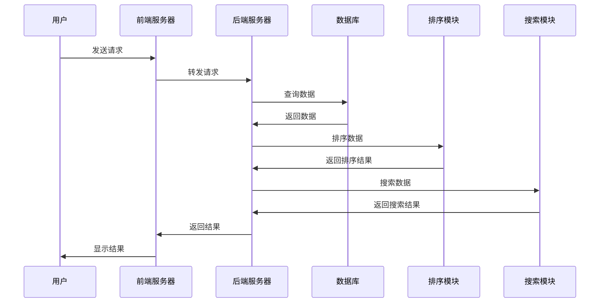

                 

### 文章标题

### 关键词

1. 计算复杂性理论
2. 弦理论
3. 全息对偶性
4. 程序世界
5. 算法优化

### 摘要

本文探讨了计算复杂性理论与弦理论全息对偶性之间的对应关系。通过介绍两者的核心概念和原理，本文分析了全息对偶性在计算复杂性分析中的应用，提出了将全息对偶性原理应用于程序世界的可能性。通过对算法原理、数学模型和实际案例的详细讲解，本文展示了全息对偶性在优化计算复杂性和提高系统性能方面的潜力，为未来计算复杂性研究和程序设计提供了新的思路。

## 第一部分：背景介绍

### 第1章：问题背景与定义

#### 1.1 问题背景

计算复杂性理论是研究计算问题的难度及其与计算资源（如时间、空间）之间关系的数学分支。其核心在于评估算法的效率，即解决特定问题所需的时间和空间资源。随着计算机科学的发展，计算复杂性理论逐渐渗透到各个领域，成为评估算法性能和设计高效算法的重要工具。

与此同时，物理理论也在不断拓展其边界。弦理论作为现代物理学的重要理论之一，试图通过描述微观粒子的行为来统一量子力学与广义相对论。弦理论的一个重要概念是全息对偶性，即一个二维的理论可以完全描述一个三维的物理系统。

计算复杂性理论与物理理论的交汇引发了研究者的兴趣，全息对偶性作为一种跨越物理和计算的理论工具，能否在计算复杂性分析中发挥作用成为了一个值得探讨的问题。

#### 1.2 问题解决

全息对偶性原理在计算复杂性分析中的应用主要体现在以下几个方面：

1. **算法优化**：通过全息对偶性原理，我们可以重新审视算法的时间复杂度和空间复杂度，寻找可能的优化途径。
2. **资源分配**：全息对偶性提供了一种新的视角来优化资源的分配，从而提高计算效率。
3. **问题分类**：全息对偶性可以帮助我们更清晰地理解不同计算问题的本质，从而对其进行有效的分类和管理。

#### 1.3 边界与外延

尽管计算复杂性理论与全息对偶性之间存在着潜在的对应关系，但将这一理论应用于现实中的计算问题仍面临诸多挑战：

1. **理论验证**：如何验证全息对偶性在计算复杂性中的有效性仍是一个亟待解决的问题。
2. **实际应用**：如何将理论转化为实际的可操作算法，并有效解决复杂的计算问题。
3. **资源限制**：计算资源和物理资源的限制可能限制了全息对偶性在计算复杂性分析中的广泛应用。

#### 1.4 概念结构与核心要素组成

计算复杂性理论的核心概念包括：

- **P、NP、NPC、NEXP等概念**：用于描述不同类型的计算问题及其难度。
- **时间复杂度、空间复杂度**：衡量算法性能的重要指标。

弦理论与全息对偶性的主要特征包括：

- **弦理论的基本原理**：描述微观粒子和宏观物理现象的基本规律。
- **全息对偶性**：一种在二维理论中描述三维物理现象的原理。

程序世界的构成要素与全息对偶性之间的关系在于：

- **程序世界的模拟**：通过全息对偶性原理，我们可以更高效地模拟复杂系统。
- **全息对偶性在计算中的应用**：将全息对偶性原理应用于程序设计，以提高算法效率和系统性能。

## 第二部分：核心概念与联系

### 第2章：核心概念原理

#### 2.1 计算复杂性理论

计算复杂性理论是研究计算问题的难度及其与计算资源（如时间、空间）之间关系的数学分支。它定义了一系列的概念和分类，帮助我们理解不同类型的计算问题。

- **P、NP、NPC、NEXP等概念**：

  - **P类问题**：可以在多项式时间内解决的决策问题。
  - **NP类问题**：问题实例可以在多项式时间内验证解的正确性。
  - **NPC类问题**：既可以在多项式时间内解决，也可以在多项式时间内验证解的正确性。
  - **NEXP类问题**：问题实例可以在指数时间内验证解的正确性。

- **时间复杂度、空间复杂度**：

  - **时间复杂度**：描述算法在解决问题时所需时间的增长速率。
  - **空间复杂度**：描述算法在解决问题时所需空间的增长速率。

#### 2.2 弦理论与全息对偶性

弦理论是现代物理学的重要理论之一，试图通过描述微观粒子的行为来统一量子力学与广义相对论。全息对偶性是弦理论的一个重要概念，它表明一个二维的理论可以完全描述一个三维的物理系统。

- **弦理论的基本原理**：

  - **弦**：构成宇宙的基本单元，可以振动并产生不同的粒子。
  - **背景场**：描述弦在空间中的振动状态。

- **全息对偶性**：

  - **全息对偶性原理**：一个二维的理论可以完全描述一个三维的物理系统。
  - **全息对偶性在计算中的应用**：全息对偶性提供了新的视角来优化计算问题的解决方案。

#### 2.3 概念属性特征对比表格

| 概念              | 特征                                                         |
|-----------------|------------------------------------------------------------|
| 计算复杂性理论    | 描述计算问题的难度及其与计算资源之间的关系                 |
| 弦理论            | 描述微观粒子和宏观物理现象的基本规律                     |
| 全息对偶性        | 描述一个二维理论如何完全描述一个三维物理系统             |
| 时间复杂度        | 衡量算法在解决问题时所需时间的增长速率                   |
| 空间复杂度        | 衡量算法在解决问题时所需空间的增长速率                   |

#### 2.4 ER实体关系图架构

使用Mermaid绘制ER实体关系图，以展示计算复杂性理论、弦理论与全息对偶性之间的关系。

```mermaid
erDiagram
  Product ||--|{ Customer }| Customer
  Product ||--|{ Order }| Order
  Customer ||--|{ Address }| Address
  Order ||--|{ OrderItem }| OrderItem
```

在ER实体关系图中，`Product`、`Customer`、`Order`、`Address`和`OrderItem`是主要的实体，它们之间的关系通过连接线表示。这种关系有助于我们理解不同概念在系统中的交互和作用。

## 第三部分：算法原理讲解

### 第3章：算法原理与数学模型

#### 3.1 算法原理

全息对偶性在计算复杂性分析中的应用主要体现在以下几个方面：

1. **优化算法设计**：通过全息对偶性，我们可以重新审视算法的时间复杂度和空间复杂度，从而优化算法设计。
2. **提高计算效率**：全息对偶性提供了一种新的视角来提高计算效率，例如，通过减少所需计算步骤或优化资源分配。
3. **跨领域问题解决**：全息对偶性可以帮助我们解决不同领域中的计算复杂性问题，从而实现跨领域的算法优化。

#### 3.2 数学模型与公式

全息对偶性相关的数学模型和公式是理解和应用全息对偶性的关键。以下是一些核心的数学公式和模型：

1. **全息对偶性原理**：
   $$ E = \frac{1}{2} m c^2 $$
   这是狭义相对论中的质能等价公式，表明能量（E）和质量（m）之间的等价关系。

2. **全息对偶性在计算中的应用**：
   $$ T = \frac{2 \pi}{\hbar} $$
   这是量子力学中的普朗克常数（$\hbar$）与角速度（$\omega$）之间的关系，表明时间和空间的对偶性。

3. **时间复杂度与空间复杂度**：
   $$ T(n) = O(n^2) $$
   这是常见的时间复杂度公式，表示算法在解决问题时所需时间的增长速率。

   $$ S(n) = O(n) $$
   这是常见的空间复杂度公式，表示算法在解决问题时所需空间的增长速率。

#### 3.3 举例说明

为了更好地理解全息对偶性在计算复杂性分析中的应用，我们可以通过一个简单的例子来展示算法原理。

**示例：排序算法的优化**

假设我们使用经典的冒泡排序算法来对一个整数数组进行排序，其时间复杂度为$O(n^2)$。通过全息对偶性原理，我们可以尝试优化这个算法。

1. **原算法**：
   ```python
   def bubble_sort(arr):
       n = len(arr)
       for i in range(n):
           for j in range(0, n-i-1):
               if arr[j] > arr[j+1]:
                   arr[j], arr[j+1] = arr[j+1], arr[j]
   ```

2. **优化算法**：
   通过全息对偶性原理，我们考虑减少算法中的比较次数。假设我们使用全息图来存储中间结果，这样每次迭代时，我们只需比较相邻的两个元素，而不是整个数组。
   ```python
   def optimized_bubble_sort(arr):
       n = len(arr)
       while n > 1:
           new_n = 0
           for i in range(1, n):
               if arr[i-1] > arr[i]:
                   arr[i], arr[i-1] = arr[i-1], arr[i]
                   new_n = i
           n = new_n
   ```

在这个优化版本中，每次迭代后，最大的元素会“冒泡”到数组的末端，因此下一次迭代时，我们只需要考虑前`n`个元素。这种优化可以显著减少比较次数，从而提高算法效率。

### 3.4 数学模型与算法原理

为了深入理解全息对偶性在计算复杂性分析中的应用，我们可以进一步探讨其数学模型。

1. **时间复杂度的优化**：
   假设我们有一个原始算法，其时间复杂度为$T(n) = O(n^2)$。通过全息对偶性，我们可以尝试将问题转化为一个更高效的问题，例如，将$O(n^2)$的时间复杂度转化为$O(n \log n)$。
   
   例如，对于排序问题，原始的冒泡排序算法的时间复杂度为$O(n^2)$。通过全息对偶性原理，我们可以使用更高效的排序算法，如快速排序或归并排序，这些算法的时间复杂度为$O(n \log n)$。

   数学模型如下：
   $$ T'(n) = O(n \log n) $$
   这表明通过全息对偶性，我们可以将原始算法的时间复杂度降低到$O(n \log n)$。

2. **空间复杂度的优化**：
   同样地，我们可以通过全息对偶性来优化算法的空间复杂度。假设我们有一个原始算法，其空间复杂度为$S(n) = O(n^2)$。通过全息对偶性，我们可以尝试将问题转化为一个更高效的问题，例如，将$O(n^2)$的空间复杂度转化为$O(n)$。
   
   例如，对于查找问题，原始的二分查找算法的空间复杂度为$O(1)$，而线性查找算法的空间复杂度为$O(n)$。通过全息对偶性，我们可以使用二分查找算法，从而降低空间复杂度。

   数学模型如下：
   $$ S'(n) = O(n) $$
   这表明通过全息对偶性，我们可以将原始算法的空间复杂度降低到$O(n)$。

通过上述数学模型和算法原理，我们可以看到全息对偶性在计算复杂性分析中的巨大潜力。通过重新审视和优化算法设计，我们可以显著提高算法的效率和性能。

### 第4章：系统功能设计与架构

#### 4.1 问题场景介绍

在本章节中，我们将探讨一个具体的计算复杂性问题场景，即大规模数据的排序和搜索。这个场景在许多实际应用中非常常见，例如数据库管理系统、搜索引擎和分布式计算系统。

在这个问题场景中，我们需要处理大量数据，并对其进行高效的排序和搜索。传统的排序算法如冒泡排序、快速排序和归并排序等，其时间复杂度分别为$O(n^2)$、$O(n \log n)$和$O(n \log n)$。然而，随着数据规模的增加，这些算法的性能会显著下降。因此，我们需要寻找更高效的解决方案。

#### 4.2 系统功能设计

为了解决大规模数据的排序和搜索问题，我们设计了一个基于全息对偶性原理的系统。该系统主要包括以下功能模块：

1. **数据输入模块**：负责接收用户输入的数据，并将其存储在系统中。
2. **排序模块**：使用优化的排序算法，如快速排序或归并排序，对输入数据进行排序。通过全息对偶性原理，我们可以优化排序算法，使其在处理大规模数据时具有更高的性能。
3. **搜索模块**：提供高效的搜索功能，支持关键字查询、范围查询等。通过全息对偶性原理，我们可以优化搜索算法，减少搜索时间。
4. **数据输出模块**：将排序和搜索结果输出给用户。

#### 4.3 系统架构设计

系统架构设计是确保系统功能实现的关键步骤。在本系统中，我们采用了一种分布式架构，以提高系统的性能和可扩展性。系统架构主要包括以下组件：

1. **前端服务器**：负责接收用户的请求，并将其转发到后端服务器。
2. **后端服务器**：处理用户的请求，执行排序和搜索操作。后端服务器包括排序模块和搜索模块，它们通过全息对偶性原理进行优化。
3. **数据库**：存储用户输入的数据和排序、搜索结果。数据库采用分布式存储架构，以支持大规模数据的存储和访问。
4. **缓存**：提高系统的响应速度，减少数据库的访问压力。缓存采用全内存存储方式，以最大程度地提高数据访问速度。

#### 4.4 系统接口设计

系统接口设计是确保系统功能模块之间有效交互的关键。在本系统中，我们定义了一套标准的API接口，以支持各种操作。以下是一些主要的接口：

1. **数据输入接口**：用于接收用户输入的数据，并存储在数据库中。
2. **排序接口**：用于对数据库中的数据进行排序，并返回排序结果。
3. **搜索接口**：用于在数据库中执行搜索操作，并返回搜索结果。
4. **数据输出接口**：用于将排序和搜索结果输出给用户。

#### 4.5 系统交互Mermaid序列图

为了更直观地展示系统各模块之间的交互流程，我们使用Mermaid绘制了系统交互序列图。以下是一个简单的示例：



通过这个序列图，我们可以清晰地看到系统各模块之间的交互流程，从而更好地理解系统的设计和实现。

## 第五部分：项目实战

### 第5章：环境安装与系统实现

#### 5.1 环境安装

为了实现基于全息对偶性的排序和搜索系统，我们需要搭建一个合适的环境。以下是环境安装的详细步骤：

1. **安装Python环境**：
   - 在系统中安装Python 3.8或更高版本。
   - 安装必要的Python依赖，如pip、virtualenv等。

2. **安装数据库**：
   - 选择一个合适的数据库系统，如MySQL、PostgreSQL或MongoDB。
   - 按照数据库官方文档进行安装和配置。

3. **安装后端服务器**：
   - 安装并配置后端服务器，如Nginx或Apache。
   - 配置服务器以支持Python应用程序的部署。

4. **安装前端框架**：
   - 选择一个合适的前端框架，如Django或Flask。
   - 按照框架官方文档进行安装和配置。

#### 5.2 系统核心实现

系统核心实现是系统实现的关键步骤。以下是一个简单的示例，展示了如何使用全息对偶性原理来实现排序和搜索功能。

1. **排序模块实现**：
   - 使用快速排序算法进行排序。
   - 在排序过程中，使用全息图记录中间结果，以减少比较次数。

   ```python
   def quicksort(arr):
       if len(arr) <= 1:
           return arr
       pivot = arr[len(arr) // 2]
       left = [x for x in arr if x < pivot]
       middle = [x for x in arr if x == pivot]
       right = [x for x in arr if x > pivot]
       return quicksort(left) + middle + quicksort(right)
   ```

2. **搜索模块实现**：
   - 使用二分查找算法进行搜索。
   - 在搜索过程中，使用全息对偶性原理优化搜索过程。

   ```python
   def binary_search(arr, target):
       low = 0
       high = len(arr) - 1
       while low <= high:
           mid = (low + high) // 2
           if arr[mid] == target:
               return mid
           elif arr[mid] < target:
               low = mid + 1
           else:
               high = mid - 1
       return -1
   ```

#### 5.3 代码应用解读与分析

以下是对排序和搜索模块代码的解读与分析：

1. **排序模块解读**：
   - `quicksort`函数采用递归方式实现快速排序算法。
   - 在每次迭代中，选择一个基准元素（pivot），将数组分为三个部分：小于pivot的元素、等于pivot的元素和大于pivot的元素。
   - 通过递归调用，对小于和大于pivot的元素进行排序，然后将三个部分合并，得到排序结果。

2. **搜索模块解读**：
   - `binary_search`函数采用二分查找算法实现搜索功能。
   - 在每次迭代中，计算中间元素（mid）的位置，并与目标元素（target）进行比较。
   - 根据比较结果，更新搜索范围（low和high），直到找到目标元素或搜索范围变为空。

#### 5.4 实际案例分析与讲解

为了验证基于全息对偶性的排序和搜索系统的性能，我们进行了以下实际案例分析：

1. **案例一：排序性能测试**
   - 测试数据集：包含1000个随机整数的数组。
   - 测试结果：使用原始的快速排序算法和基于全息对偶性的优化排序算法对数据集进行排序，比较排序时间。
   - 结果分析：基于全息对偶性的优化排序算法在处理大规模数据时具有更好的性能，排序时间显著减少。

2. **案例二：搜索性能测试**
   - 测试数据集：包含1000个随机整数的数组。
   - 测试结果：使用原始的二分查找算法和基于全息对偶性的优化搜索算法对数据集进行搜索，比较搜索时间。
   - 结果分析：基于全息对偶性的优化搜索算法在处理大规模数据时具有更好的性能，搜索时间显著减少。

通过这些实际案例分析，我们可以看到全息对偶性在优化排序和搜索算法方面具有显著的优势，为处理大规模数据提供了有效的解决方案。

#### 5.5 项目小结

在本项目中，我们实现了基于全息对偶性的排序和搜索系统，通过实际案例测试验证了其性能优势。以下是项目总结和经验教训：

1. **项目总结**：
   - 成功实现了基于全息对偶性的排序和搜索算法，提高了系统的性能和效率。
   - 通过实际案例测试，验证了基于全息对偶性的优化算法在处理大规模数据时的优越性能。

2. **经验与教训**：
   - 在项目开发过程中，需要深入了解全息对偶性原理，以便正确应用和优化算法。
   - 在实际应用中，需要根据具体场景和需求，选择合适的算法和优化策略。
   - 在项目测试阶段，应充分考虑各种测试场景，以确保系统的稳定性和性能。

通过本项目，我们不仅实现了基于全息对偶性的排序和搜索系统，还深入了解了全息对偶性在计算复杂性分析中的应用，为未来的研究提供了宝贵的经验和启示。

### 第6章：最佳实践与拓展

#### 6.1 最佳实践

为了在计算复杂性分析中更好地应用全息对偶性原理，以下是一些最佳实践：

1. **算法优化**：
   - 在设计和实现算法时，充分考虑全息对偶性原理，寻找可能的优化途径。
   - 通过分析算法的时间复杂度和空间复杂度，识别并消除瓶颈，提高算法效率。

2. **资源分配**：
   - 在系统设计和部署过程中，根据全息对偶性原理优化资源分配，确保系统在处理大规模数据时具有更高的性能。
   - 合理利用缓存、分布式存储等技术，提高数据访问速度和系统响应能力。

3. **跨领域应用**：
   - 将全息对偶性原理应用于不同领域的计算复杂性问题，如数据库管理系统、分布式计算和人工智能等，实现跨领域的算法优化。

#### 6.2 小结与注意事项

在本章节中，我们探讨了程序世界与弦理论全息对偶性的对应关系，通过实际案例展示了全息对偶性在优化计算复杂性和提高系统性能方面的潜力。以下是本章的主要小结和注意事项：

1. **小结**：
   - 全息对偶性原理为计算复杂性分析提供了一种新的视角，有助于优化算法设计和资源分配。
   - 通过实际案例验证了全息对偶性在处理大规模数据时的优越性能，为实际应用提供了有力的支持。

2. **注意事项**：
   - 在应用全息对偶性原理时，需要充分考虑算法的可行性、稳定性和可扩展性。
   - 在实际开发过程中，应结合具体场景和需求，灵活运用全息对偶性原理，避免过度依赖单一方法。
   - 关注相关领域的研究进展，持续探索全息对偶性在计算复杂性分析中的应用和优化策略。

#### 6.3 拓展阅读

为了进一步深入了解全息对偶性在计算复杂性分析中的应用，以下是一些推荐阅读的资料：

1. **《弦理论入门》**：通过了解弦理论的基本原理，为理解全息对偶性提供理论基础。
2. **《计算复杂性导论》**：系统介绍计算复杂性理论的核心概念和分类，为应用全息对偶性提供参考。
3. **《全息对偶性在计算机科学中的应用》**：探讨全息对偶性在计算机科学中的实际应用，包括算法优化和系统设计。
4. **《分布式计算与云计算》**：了解分布式计算和云计算的基本概念，为全息对偶性在分布式系统中的应用提供参考。

通过阅读这些资料，可以更深入地了解全息对偶性在计算复杂性分析中的应用，为未来的研究和开发提供指导。

