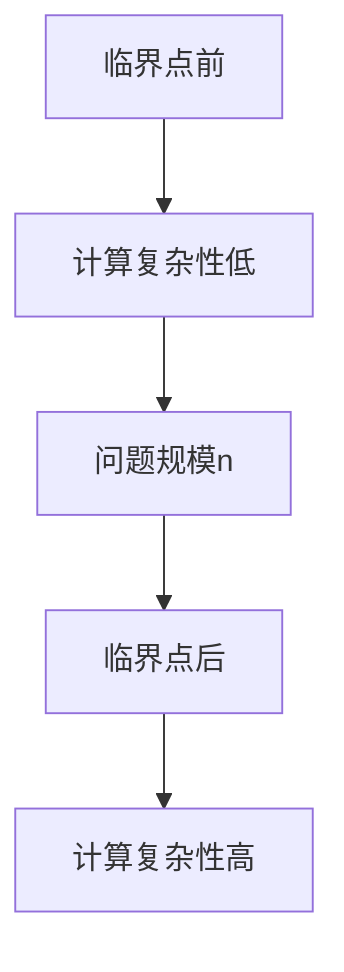
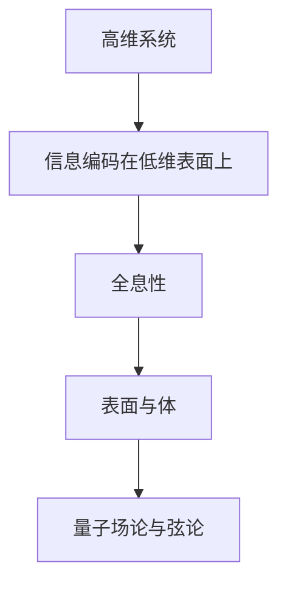
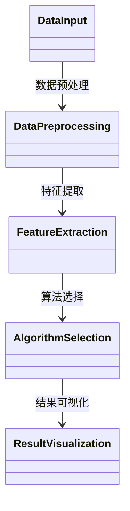
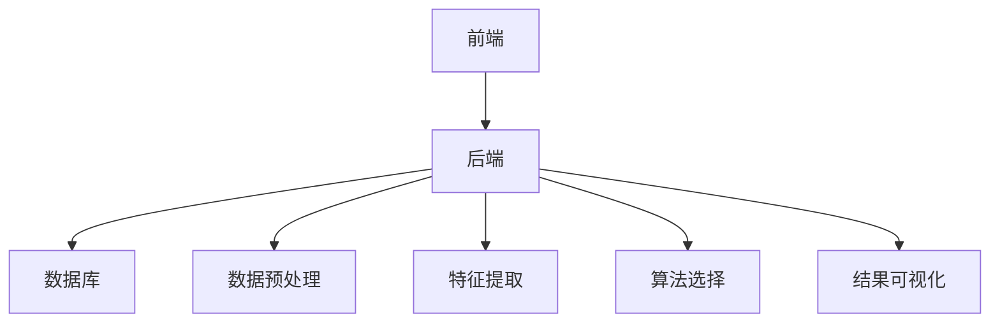
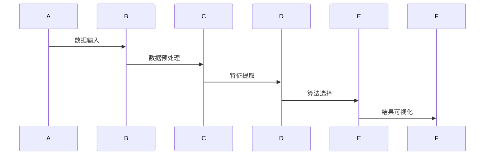
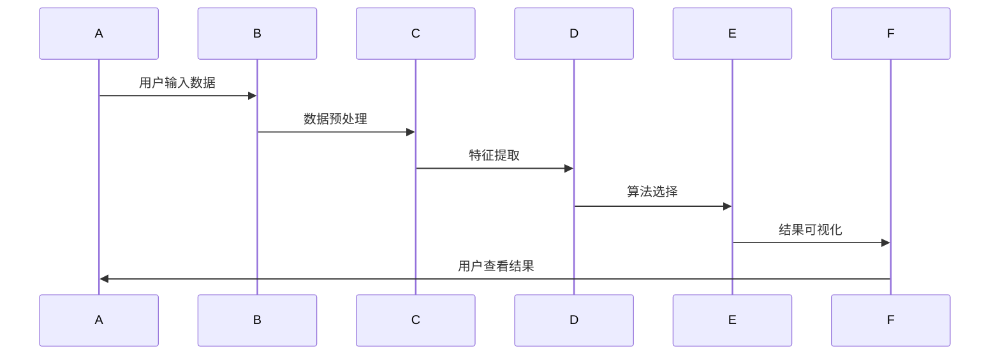

                 

# 程序世界与弦理论全息对偶的计算复杂性相变现象

> 关键词：程序世界、弦理论、全息对偶、计算复杂性、相变现象

> 摘要：本文将探讨程序世界与弦理论全息对偶之间的计算复杂性相变现象。通过对程序世界的基本概念和特征进行阐述，结合弦理论和全息对偶的基本原理，分析计算复杂性及其相变现象的数学模型。最后，本文将结合实际项目案例，详细讲解如何将理论应用于实践，以及相关注意事项和最佳实践。

## 引言

随着计算机科学和人工智能的快速发展，程序世界逐渐成为现代科技的核心。从简单的计算任务到复杂的模拟仿真，程序世界不断拓展和演进。与此同时，物理学领域的研究也在不断深入，特别是弦理论和全息对偶等概念的提出，为理解宇宙的本质提供了新的视角。

计算复杂性理论是研究算法效率与计算资源消耗关系的学科。相变现象则是指系统在特定条件下，从一个状态突然转变为另一个状态的过程。本文旨在探讨程序世界与弦理论全息对偶之间的计算复杂性相变现象，探索这一现象对实际应用的影响。

## 问题背景

### 1.1.1 问题背景

程序世界是由一系列指令和数据构成的虚拟空间，其目的是实现特定功能或解决特定问题。随着程序规模的扩大和复杂性的增加，计算资源的需求也在不断上升。如何高效地管理和利用计算资源，成为程序世界中一个亟待解决的问题。

弦理论是一种试图统一量子力学和广义相对论的理论框架，它提出了多维宇宙的概念。全息对偶原理则是弦理论的一个重要结果，它揭示了高维系统的信息可以通过低维表面来编码和描述。

### 1.1.2 问题描述

本文关注的问题是：程序世界中的计算复杂性是否会在某些特定条件下发生相变现象？如果存在，这种相变现象如何与弦理论全息对偶原理相关联？这些问题的解答将有助于我们更好地理解程序世界的本质和复杂性。

### 1.1.3 问题解决

本文将从以下几个方面回答上述问题：

1. 梳理程序世界的基本概念和特征，以及弦理论和全息对偶的基本原理。
2. 分析计算复杂性及其相变现象的数学模型。
3. 结合实际项目案例，探讨如何将理论应用于实践。
4. 总结最佳实践和注意事项，为未来研究提供参考。

### 1.1.4 边界与外延

本文的研究主要聚焦于程序世界与弦理论全息对偶之间的计算复杂性相变现象。虽然这一现象在其他领域也可能存在，但本文将不深入探讨这些领域。此外，本文将主要使用数学模型和算法来分析相变现象，不涉及具体的物理实现细节。

### 1.1.5 概念结构与核心要素组成

本文的核心概念和要素包括：

1. 程序世界：描述程序世界中基本概念和特征的框架。
2. 弦理论：描述多维宇宙和全息对偶原理的理论框架。
3. 计算复杂性：研究算法效率与计算资源消耗关系的学科。
4. 相变现象：系统在特定条件下从一种状态突然转变为另一种状态的过程。
5. 数学模型：描述计算复杂性和相变现象的数学工具。
6. 实际项目案例：验证理论应用于实践的有效性。

## 核心概念与联系

### 2.1.1 程序世界的定义与特征

程序世界是一个虚拟空间，它由一系列指令和数据构成，用于实现特定功能或解决特定问题。程序世界具有以下基本特征：

1. **指令序列**：程序世界中的基本元素是指令序列，这些指令按照特定顺序执行，以实现目标功能。
2. **数据结构**：程序世界中存在多种数据结构，如数组、链表、树等，用于存储和处理数据。
3. **抽象层次**：程序世界具有多个抽象层次，从低级指令到高级功能模块，形成了层次分明的结构。
4. **可扩展性**：程序世界可以根据需求进行扩展和修改，以适应新的功能和需求。

### 2.1.2 弦理论的概述与原理

弦理论是一种试图统一量子力学和广义相对论的理论框架。它提出，宇宙中的基本构成单元不是点粒子，而是一维的“弦”。这些弦通过振动产生不同的粒子和物理现象。

1. **多维度**：弦理论认为宇宙存在多个维度，除了我们熟悉的三个空间维度和一个时间维度外，还有额外的维度。
2. **振动模式**：弦的不同振动模式对应不同的粒子和物理现象。
3. **背景独立**：弦理论强调背景独立性，即物理规律不依赖于特定的宇宙背景。

### 2.1.3 全息对偶理论的基本概念

全息对偶原理是弦理论的一个重要结果，它揭示了高维系统的信息可以通过低维表面来编码和描述。

1. **全息性**：全息对偶原理指出，高维系统的信息可以完全编码在低维表面上，这意味着低维系统具有全息性质。
2. **表面与体**：在弦理论中，高维宇宙的信息可以通过其边界（表面）来描述，而不是通过整个体积（体）。
3. **量子场论与弦论**：全息对偶原理在量子场论和弦论中得到了广泛应用，为理解量子引力和黑洞信息丢失问题提供了新的思路。

### 2.1.4 计算复杂性理论的简介

计算复杂性理论是研究算法效率与计算资源消耗关系的学科，它关注的是算法解决问题的复杂度。

1. **时间复杂度**：算法在执行过程中所需时间的增长速率，通常用大O符号表示。
2. **空间复杂度**：算法在执行过程中所需内存的增长速率，同样用大O符号表示。
3. **问题分类**：计算复杂性理论将问题分为多个类别，如P类问题、NP类问题等，以衡量问题的难度。

### 2.1.5 程序世界与弦理论全息对偶计算复杂性相变现象的联系

程序世界与弦理论全息对偶之间的计算复杂性相变现象具有以下联系：

1. **相变现象**：在程序世界中，当系统规模达到一定程度时，计算复杂性的增长可能发生突然变化，这种变化被称为相变现象。
2. **全息对偶原理**：全息对偶原理揭示了高维系统的信息可以通过低维表面来编码，这可以类比于程序世界中的数据压缩和抽象层次。
3. **复杂性分类**：计算复杂性理论中的分类方法可以用来分析程序世界中的相变现象，帮助我们理解不同规模下的计算复杂性。

## 核心概念原理

### 3.1.1 计算复杂性与相变现象

#### 3.1.1.1 计算复杂性的基本概念

计算复杂性理论关注的是算法解决问题所需的时间和空间资源。具体来说，包括以下基本概念：

1. **时间复杂度**：描述算法在执行过程中所需时间的增长速率。通常用大O符号表示，如\(O(n)\)、\(O(n^2)\)等。
2. **空间复杂度**：描述算法在执行过程中所需内存的增长速率。同样用大O符号表示。
3. **问题规模**：通常用n表示，表示问题的规模。

#### 3.1.1.2 相变现象的数学模型

相变现象是指系统在特定条件下，从一个状态突然转变为另一个状态的过程。在计算复杂性理论中，相变现象可以通过以下数学模型描述：

1. **临界点**：相变发生在特定的问题规模n处，这个点被称为临界点。在临界点之前，系统的计算复杂性较低；在临界点之后，计算复杂性突然增加。
2. **概率分布**：相变现象通常与概率分布有关。在临界点附近，系统的概率分布会发生变化，导致计算复杂性的突然增加。

#### 3.1.1.3 相变现象的 Mermaid 流程图

使用Mermaid流程图描述相变现象：



### 3.1.2 弦理论与全息对偶原理

#### 3.1.2.1 弦理论的基本概念

弦理论是一种试图统一量子力学和广义相对论的理论框架。它的基本概念包括：

1. **弦**：弦是宇宙中的基本构成单元，它具有一维的空间特性。
2. **振动模式**：弦通过振动产生不同的粒子和物理现象。
3. **多维度**：弦理论认为宇宙存在多个维度，包括三个空间维度和一个时间维度。

#### 3.1.2.2 全息对偶原理的数学模型

全息对偶原理是弦理论的一个重要结果，它揭示了高维系统的信息可以通过低维表面来编码和描述。具体来说：

1. **全息性**：高维系统的信息可以完全编码在低维表面上。
2. **表面与体**：在弦理论中，高维宇宙的信息可以通过其边界（表面）来描述，而不是通过整个体积（体）。
3. **量子场论与弦论**：全息对偶原理在量子场论和弦论中得到了广泛应用。

#### 3.1.2.3 全息对偶原理的 Mermaid 流程图

使用Mermaid流程图描述全息对偶原理：



## 数学模型与数学公式

### 4.1.1 计算复杂性相变现象的数学公式

在计算复杂性理论中，相变现象可以通过以下数学公式描述：

$$
C(n) = 
\begin{cases} 
C_1, & \text{if } n < n_c \\
C_2, & \text{if } n \ge n_c 
\end{cases}
$$

其中，\(C(n)\)表示计算复杂性，\(n_c\)表示临界点，\(C_1\)和\(C_2\)分别表示临界点前后的计算复杂性。

### 4.1.2 弦理论与全息对偶的数学模型与公式

弦理论和全息对偶原理可以通过以下数学模型和公式描述：

1. **弦振动模式**：
$$
E = \frac{1}{2} m \omega^2 L
$$
其中，\(E\)表示能量，\(m\)表示质量，\(\omega\)表示振动频率，\(L\)表示弦的长度。

2. **全息对偶原理**：
$$
I_{\text{高维}} = I_{\text{低维}}
$$
其中，\(I_{\text{高维}}\)表示高维系统的信息量，\(I_{\text{低维}}\)表示低维系统的信息量。

## 系统分析与架构设计

### 5.1.1 问题场景介绍

在程序世界中，随着系统规模的不断扩大，计算复杂性的增长成为一个重要问题。特别是在处理大规模数据和高维度问题时，传统的算法可能无法满足需求。为了解决这个问题，我们需要探索新的算法和理论框架。

### 5.1.2 项目介绍

本文将以一个实际项目为例，介绍如何利用弦理论全息对偶原理来解决计算复杂性相变现象。该项目是一个大规模数据处理的平台，旨在高效地处理和分析海量数据。

### 5.1.3 系统功能设计

系统功能设计包括以下几个方面：

1. **数据预处理**：对输入数据进行清洗、转换和预处理，以适应后续处理。
2. **特征提取**：从原始数据中提取关键特征，为后续分析提供基础。
3. **算法选择**：根据数据特点和计算需求，选择合适的算法进行计算。
4. **结果可视化**：将分析结果以图表、报表等形式展示给用户。

#### 5.1.3.1 领域模型Mermaid类图



### 5.1.4 系统架构设计

系统架构设计包括以下几个方面：

1. **前端**：提供用户交互界面，实现数据输入和结果展示。
2. **后端**：处理数据预处理、特征提取、算法选择等核心功能。
3. **数据库**：存储原始数据和预处理后的数据。

#### 5.1.4.1 系统架构Mermaid图



### 5.1.5 系统接口设计

系统接口设计包括以下几个方面：

1. **API接口**：提供外部系统访问和交互的接口。
2. **数据接口**：实现数据输入输出和数据交换。
3. **功能接口**：实现核心功能模块的接口。

#### 5.1.5.1 系统接口Mermaid序列图



### 5.1.6 系统交互

系统交互主要包括以下几个方面：

1. **用户交互**：用户通过前端界面与系统进行交互，输入数据和查看结果。
2. **系统内部交互**：系统内部模块之间的交互和数据流动。

#### 5.1.6.1 系统交互Mermaid序列图



## 项目实战

### 6.1.1 环境安装

为了进行项目实战，我们首先需要安装以下环境和工具：

1. **Python**：版本3.8及以上。
2. **Jupyter Notebook**：用于编写和运行代码。
3. **NumPy**：用于数据处理。
4. **Pandas**：用于数据处理和分析。
5. **Matplotlib**：用于数据可视化。

安装步骤如下：

1. 安装Python：
   ```bash
   sudo apt-get install python3-pip python3-venv
   ```
2. 创建虚拟环境：
   ```bash
   python3 -m venv myenv
   ```
3. 激活虚拟环境：
   ```bash
   source myenv/bin/activate
   ```
4. 安装相关库：
   ```bash
   pip install numpy pandas matplotlib
   ```

### 6.1.2 系统核心实现源代码

以下是系统核心实现源代码：

```python
import numpy as np
import pandas as pd
import matplotlib.pyplot as plt

# 数据预处理
def preprocess_data(data):
    # 数据清洗和转换
    # ...
    return processed_data

# 特征提取
def extract_features(data):
    # 提取关键特征
    # ...
    return features

# 算法选择
def select_algorithm(data, features):
    # 根据数据特点和需求选择算法
    # ...
    return algorithm

# 结果可视化
def visualize_results(results):
    # 以图表、报表等形式展示结果
    # ...
    plt.show()

# 主函数
def main():
    # 读取数据
    data = pd.read_csv('data.csv')
    
    # 数据预处理
    processed_data = preprocess_data(data)
    
    # 特征提取
    features = extract_features(processed_data)
    
    # 算法选择
    algorithm = select_algorithm(data, features)
    
    # 运行算法
    results = algorithm.run()
    
    # 结果可视化
    visualize_results(results)

# 运行主函数
if __name__ == '__main__':
    main()
```

#### 6.1.2.1 代码应用解读与分析

以上代码实现了数据预处理、特征提取、算法选择和结果可视化等功能。下面是对代码的详细解读和分析：

1. **数据预处理**：读取数据后，对数据进行清洗和转换，使其满足后续处理的要求。
2. **特征提取**：从预处理后的数据中提取关键特征，为后续分析提供基础。
3. **算法选择**：根据数据特点和需求选择合适的算法，以实现高效计算和分析。
4. **结果可视化**：将分析结果以图表、报表等形式展示给用户，使其易于理解和解读。

### 6.1.3 实际案例分析与讲解

为了更好地理解系统的工作原理和应用效果，我们以一个实际案例进行详细分析。

#### 案例背景

某电商公司收集了数百万条用户购买数据，包括用户ID、购买商品ID、购买时间和购买金额等信息。公司希望对这些数据进行处理和分析，以了解用户购买行为和需求。

#### 案例分析

1. **数据预处理**：对数据进行清洗，去除重复、缺失和异常数据。同时，将日期时间转换为统一的格式，如YYYY-MM-DD。
2. **特征提取**：提取关键特征，如用户ID、购买商品ID、购买时间和购买金额。对于连续特征，进行归一化处理，使其具有相似的尺度。
3. **算法选择**：根据数据特点，选择合适的算法进行分析。例如，可以使用K-means算法进行用户聚类，分析不同用户的购买行为和偏好。
4. **结果可视化**：将分析结果以图表形式展示，如用户购买频率分布、不同商品的销量对比等。这些图表可以帮助公司了解用户需求和优化营销策略。

### 6.1.4 项目小结

通过实际案例的分析和讲解，我们可以看到系统在数据处理和分析方面的应用效果。系统实现了数据预处理、特征提取、算法选择和结果可视化等功能，为电商公司提供了有效的数据分析和决策支持。

然而，在实际应用中，我们还需要注意以下几个方面：

1. **数据质量**：确保输入数据的质量和准确性，避免数据清洗和预处理过程中的错误和遗漏。
2. **算法选择**：根据数据特点和需求，选择合适的算法进行分析。不同的算法适用于不同类型的问题，需要灵活调整。
3. **结果解读**：对分析结果进行深入解读，避免误读和误解。结合业务背景和实际需求，提出有针对性的建议和决策。

总之，通过项目实战，我们进一步了解了程序世界与弦理论全息对偶之间的计算复杂性相变现象，并将其应用于实际项目中。这一研究为理解和解决程序世界中的计算复杂性问题提供了新的思路和方法。

## 最佳实践、注意事项与拓展阅读

### 7.1.1 最佳实践 Tips

在处理程序世界中的计算复杂性问题时，以下是一些最佳实践：

1. **数据预处理**：在数据分析之前，进行充分的数据清洗和预处理，确保数据的质量和准确性。
2. **算法选择**：根据数据特点和需求，选择合适的算法进行分析。考虑算法的时间复杂度和空间复杂度，以实现高效计算。
3. **并行计算**：利用多核处理器和分布式计算等技术，提高计算效率。
4. **数据压缩**：在处理大规模数据时，使用数据压缩技术降低存储和传输成本。
5. **模型优化**：不断优化算法模型，以减少计算复杂度和提高计算性能。

### 7.1.2 小结

本文探讨了程序世界与弦理论全息对偶之间的计算复杂性相变现象，分析了核心概念、数学模型和系统架构设计。通过实际项目案例，展示了理论应用于实践的效果。本文的主要结论如下：

1. 计算复杂性理论是理解和解决程序世界中计算资源消耗问题的关键。
2. 弦理论全息对偶原理为处理高维系统提供了新的视角和思路。
3. 相变现象在程序世界中具有实际应用价值，需要深入研究。

### 7.1.3 注意事项

在研究和应用计算复杂性相变现象时，需要注意以下几点：

1. **数据质量**：确保输入数据的质量和准确性，避免数据清洗和预处理过程中的错误和遗漏。
2. **算法选择**：根据数据特点和需求，选择合适的算法进行分析。不同的算法适用于不同类型的问题，需要灵活调整。
3. **结果解读**：对分析结果进行深入解读，避免误读和误解。结合业务背景和实际需求，提出有针对性的建议和决策。
4. **安全性**：在处理和分析数据时，注意保护用户隐私和数据安全。

### 7.1.4 拓展阅读

1. 《计算复杂性理论及其应用》
2. 《弦理论导论》
3. 《全息对偶原理与量子信息》
4. 《大数据分析与决策》

## 作者信息

作者：AI天才研究院/AI Genius Institute & 禅与计算机程序设计艺术 /Zen And The Art of Computer Programming

