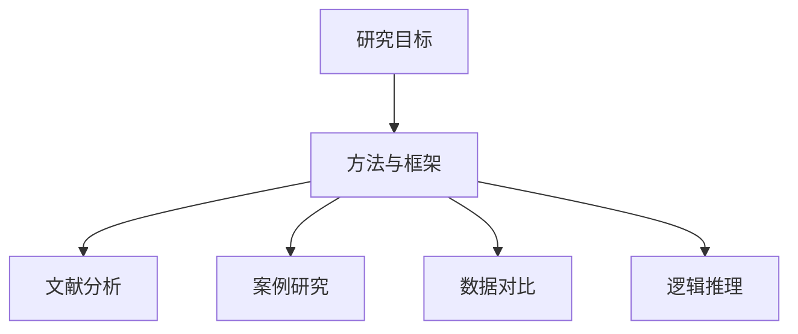

                 

# 程序世界与循环宇宙模型的类比

## 关键词

- 程序世界
- 循环宇宙模型
- 类比分析
- 复杂性
- 动态性
- 自适应性

## 摘要

本文旨在探讨程序世界与循环宇宙模型之间的相似性，通过类比分析方法，揭示两者在构成、运作原理和特征方面的共通之处。首先，我们对程序世界和循环宇宙模型进行基本概念和特征的介绍，然后逐步分析它们在复杂性、动态性和自适应性方面的相似性，最后讨论这种类比研究的意义，并展望未来的研究方向。通过本文的探讨，我们希望能够为理解复杂系统和智能算法提供新的视角，促进跨学科的研究与应用。

## 《程序世界与循环宇宙模型的类比》目录大纲

### 第一部分：引论

#### 第1章：问题背景与目标

##### 1.1 问题的提出

##### 1.2 研究目标与意义

##### 1.3 研究方法与框架

##### 1.4 本章小结

### 第二部分：程序世界的基本概念与特征

#### 第2章：程序世界的构成与运作原理

##### 2.1 程序世界的构成

##### 2.2 程序世界的运作原理

##### 2.3 程序世界的特征

##### 2.4 本章小结

### 第三部分：循环宇宙模型的基本概念与特征

#### 第3章：循环宇宙模型的基本原理

##### 3.1 循环宇宙模型的起源

##### 3.2 循环宇宙模型的构成

##### 3.3 循环宇宙模型的特征

##### 3.4 本章小结

### 第四部分：程序世界与循环宇宙模型的类比分析

#### 第4章：程序世界与循环宇宙模型的相似性

##### 4.1 程序世界与循环宇宙模型的结构相似性

##### 4.2 程序世界与循环宇宙模型的动态性相似性

##### 4.3 程序世界与循环宇宙模型的自适应性相似性

##### 4.4 本章小结

### 第五部分：结论与展望

#### 第5章：研究结论与未来展望

##### 5.1 研究结论

##### 5.2 未来研究方向

##### 5.3 本章小结

### 参考文献

---

## 第一部分：引论

### 第1章：问题背景与目标

#### 1.1 问题的提出

在当今信息技术快速发展的时代，程序世界和循环宇宙模型作为两个重要概念，分别代表了人类在计算机科学和宇宙学领域的重大突破。程序世界，是计算机编程和算法设计的载体，是人类通过逻辑和数学手段创造的一种虚拟世界。它以代码为基石，通过算法处理数据，实现复杂的计算和自动化操作。循环宇宙模型，则是宇宙学家对于宇宙演化的一种理论描述，认为宇宙经历了一个循环的过程，包括诞生、成长、衰老和死亡等阶段，并在新的循环中重新开始。

随着人工智能和量子计算等前沿科技的兴起，程序世界和循环宇宙模型之间的联系逐渐引起了人们的关注。通过类比分析，我们可以发现两者在某些方面存在相似性，如复杂性、动态性和自适应性等。这种类比不仅有助于我们更深入地理解程序世界的工作原理，也能为宇宙学理论提供新的视角。

#### 1.2 研究目标与意义

本研究的主要目标是揭示程序世界与循环宇宙模型之间的相似性，具体包括：

1. 分析程序世界和循环宇宙模型的构成和运作原理。
2. 探讨两者在复杂性、动态性和自适应性方面的共通之处。
3. 探索这种类比分析对于计算机科学和宇宙学理论的意义。

研究意义主要体现在以下几个方面：

1. **理论意义**：通过类比分析，可以为理解复杂系统和智能算法提供新的视角，有助于深化对程序世界和循环宇宙模型本质的认识。
2. **实践意义**：研究结果可以为人工智能和量子计算等前沿科技的发展提供理论支持，促进跨学科的研究与应用。
3. **启发意义**：研究过程和结果可以启发我们思考更多跨学科的类比问题，推动科技创新和社会进步。

#### 1.3 研究方法与框架

本研究采用类比分析法，通过比较程序世界和循环宇宙模型的构成、运作原理和特征，寻找两者之间的相似性。具体方法包括：

1. **文献分析**：收集和整理相关领域的文献资料，了解程序世界和循环宇宙模型的基本概念、理论框架和研究成果。
2. **案例研究**：选取具有代表性的程序和宇宙模型进行深入分析，探讨其结构和运作机制。
3. **数据对比**：通过数据对比，分析两者在复杂性、动态性和自适应性方面的异同。
4. **逻辑推理**：运用逻辑推理，探讨类比分析的结果和意义。

研究框架如图1所示：

#### 1.4 本章小结

本章首先提出了本文的研究问题和目标，介绍了程序世界和循环宇宙模型的基本概念，并阐述了研究意义和方法。通过类比分析法，我们为后续章节的深入探讨奠定了基础。

---

## 第二部分：程序世界的基本概念与特征

### 第2章：程序世界的构成与运作原理

#### 2.1 程序世界的构成

程序世界是由代码、数据和算法构成的虚拟世界。代码是程序世界的基石，它是人类用编程语言编写的一系列指令，用于描述解决问题的过程。数据则是程序操作的实体，包括输入数据和输出数据。算法是程序世界的核心，它是一系列解决问题的步骤和规则，通过操作数据实现特定功能。

#### 2.1.1 程序代码

程序代码是程序世界的核心组成部分，它是人类通过编程语言编写的指令序列。程序代码通常包括以下几类：

1. **声明语句**：用于定义变量、数据类型和函数等。
2. **赋值语句**：用于给变量分配值。
3. **控制语句**：如条件判断语句（if-else）、循环语句（for、while）等，用于控制程序的执行流程。
4. **函数定义与调用**：函数是代码模块化的一种方式，用于实现特定的功能。

#### 2.1.2 数据

数据是程序操作的实体，它可以是数字、文本、图像、音频等多种形式。根据数据的不同特性，我们可以将数据分为以下几类：

1. **结构化数据**：如关系型数据库中的数据，具有固定的数据结构和明确的字段定义。
2. **半结构化数据**：如XML、JSON等格式的数据，具有一定的结构，但灵活性较高。
3. **非结构化数据**：如文本、图像、视频等，没有固定的数据结构。

#### 2.1.3 算法

算法是一系列解决问题的步骤和规则，它是程序世界的核心。算法可以根据不同的分类标准进行分类，如：

1. **排序算法**：如冒泡排序、快速排序等，用于对数据进行排序。
2. **查找算法**：如二分查找、线性查找等，用于在数据中查找特定元素。
3. **图算法**：如最短路径算法、最小生成树算法等，用于处理图结构的数据。

#### 2.2 程序世界的运作原理

程序世界的运作原理主要涉及程序的加载与执行、算法的优化与自适应等方面。

#### 2.2.1 程序的加载与执行

程序的加载与执行过程可以分为以下几个步骤：

1. **编译或解释**：将程序代码编译或解释为机器码，使其可以在计算机上运行。
2. **内存分配**：为程序分配内存空间，存储程序代码和数据。
3. **初始化**：对程序中的变量进行初始化，使其具有初始值。
4. **执行**：按照程序代码的顺序，逐条执行指令，处理数据，生成输出结果。

#### 2.2.2 算法的优化与自适应

算法的优化与自适应是程序世界中的一个重要研究方向。算法优化旨在提高程序的执行效率，减少计算时间和资源消耗。自适应算法则能够根据环境变化，动态调整算法的行为，以适应不同的情况。

1. **算法优化**：通过分析算法的运行时间、空间复杂度等指标，寻找优化算法的方法。常见的优化方法包括：

   - **时间优化**：减少算法的执行时间，如采用更高效的算法或数据结构。
   - **空间优化**：减少算法所需的内存空间，如减少冗余数据的存储。

2. **自适应算法**：自适应算法能够在运行过程中，根据输入数据和当前状态，动态调整算法的策略。自适应算法的应用场景包括：

   - **机器学习**：根据训练数据，动态调整模型的参数和结构。
   - **实时系统**：根据系统负载和用户需求，动态调整系统的资源配置。

#### 2.3 程序世界的特征

程序世界具有以下特征：

1. **复杂性**：程序世界中的问题往往具有复杂的结构和多样的解决方案，需要通过复杂的算法和逻辑来处理。
2. **动态性**：程序世界中的数据和算法可以随时发生变化，系统需要能够适应这些变化，保持稳定运行。
3. **自适应性**：程序世界中的算法和系统具有自适应性，能够根据环境变化和需求变化，动态调整其行为和策略。

#### 2.4 本章小结

本章介绍了程序世界的基本概念和特征，包括程序代码、数据和算法的构成，以及程序世界的运作原理和特征。通过本章的探讨，我们为后续章节的深入分析提供了基础。

---

## 第三部分：循环宇宙模型的基本概念与特征

### 第3章：循环宇宙模型的基本原理

#### 3.1 循环宇宙模型的起源

循环宇宙模型起源于宇宙学中对宇宙演化过程的研究。传统的宇宙学认为宇宙经历了从大爆炸到现在的膨胀过程，但近年来，一些科学家提出了循环宇宙模型，认为宇宙经历了一个循环的过程，包括诞生、成长、衰老和死亡等阶段，并在新的循环中重新开始。

#### 3.1.1 理论背景

循环宇宙模型的提出背景主要包括以下几个方面：

1. **宇宙膨胀**：宇宙学家通过观测发现，宇宙正在不断膨胀，这一现象被称为宇宙膨胀。
2. **宇宙微波背景辐射**：宇宙微波背景辐射是宇宙早期高温高密态时期留下的辐射，它为研究宇宙的演化提供了重要信息。
3. **暗物质和暗能量**：宇宙学家发现，宇宙中存在大量无法用可见物质解释的暗物质和暗能量，这些成分对宇宙的演化过程具有重要影响。

#### 3.1.2 循环宇宙模型的概念

循环宇宙模型认为，宇宙经历了一个循环的过程，包括以下几个阶段：

1. **诞生阶段**：宇宙从高温高密态开始，逐渐膨胀，形成恒星、行星等天体。
2. **成长阶段**：恒星和行星形成后，宇宙继续膨胀，各种天体相互作用，形成复杂的结构。
3. **衰老阶段**：宇宙中的恒星逐渐衰老，产生新的恒星和行星，同时宇宙继续膨胀。
4. **死亡阶段**：宇宙中的恒星耗尽能量，死亡并消失，宇宙重新回到高温高密态。
5. **新生阶段**：宇宙重新回到高温高密态后，经历上述过程，开始新的循环。

#### 3.1.3 循环宇宙模型的特点

循环宇宙模型具有以下几个特点：

1. **循环性**：宇宙经历了一个循环的过程，从诞生到死亡，再重新开始。
2. **动态性**：宇宙中的各种成分和现象处于不断变化中，系统具有高度的动态性。
3. **复杂性**：宇宙的演化过程涉及到众多因素，如恒星、行星、暗物质、暗能量等，系统具有复杂的结构和行为。

#### 3.2 循环宇宙模型的构成

循环宇宙模型主要由以下几个部分构成：

1. **宇宙背景辐射**：宇宙背景辐射是宇宙早期高温高密态时期留下的辐射，它是研究宇宙演化的重要信息来源。
2. **恒星和行星**：恒星和行星是宇宙中的主要天体，它们通过引力相互作用，形成复杂的结构。
3. **暗物质和暗能量**：暗物质和暗能量是宇宙中的重要成分，它们对宇宙的演化过程具有重要影响。
4. **宇宙微波背景辐射**：宇宙微波背景辐射是研究宇宙早期状态的重要工具，它反映了宇宙的演化历史。

#### 3.2.1 循环宇宙模型的核心

循环宇宙模型的核心是宇宙的循环过程，包括诞生、成长、衰老和死亡等阶段。这个过程是宇宙演化的基本规律，决定了宇宙的长期演化趋势。

#### 3.2.2 循环宇宙模型的外围

循环宇宙模型的外围包括宇宙背景辐射、恒星和行星、暗物质和暗能量等组成部分。这些部分相互作用，共同构成了宇宙的复杂结构和动态行为。

#### 3.3 循环宇宙模型的特征

循环宇宙模型具有以下几个特征：

1. **复杂性**：宇宙的演化过程涉及到众多因素，如恒星、行星、暗物质、暗能量等，系统具有复杂的结构和行为。
2. **动态性**：宇宙中的各种成分和现象处于不断变化中，系统具有高度的动态性。
3. **循环性**：宇宙经历了一个循环的过程，从诞生到死亡，再重新开始。

#### 3.4 本章小结

本章介绍了循环宇宙模型的基本原理，包括其起源、概念、特点和构成。通过本章的探讨，我们为后续章节的深入分析提供了基础。

---

## 第四部分：程序世界与循环宇宙模型的类比分析

### 第4章：程序世界与循环宇宙模型的相似性

#### 4.1 程序世界与循环宇宙模型的结构相似性

程序世界与循环宇宙模型在结构上具有显著的相似性，这种相似性主要体现在以下几个方面：

**1. 模块的层次结构**

程序世界中的模块层次结构类似于循环宇宙模型中的层次结构。在程序世界中，代码模块可以划分为不同的层次，如函数、类、模块等。这些模块通过接口和依赖关系相互连接，形成一个层次分明的结构。同样，循环宇宙模型中的宇宙结构也具有层次性，包括行星、恒星、星系、星系团等。这些层次通过引力相互作用，形成一个复杂而有序的结构。

**2. 数据的处理流程**

程序世界中的数据处理流程与循环宇宙模型中的演化过程有相似之处。在程序世界中，数据从输入到处理，再到输出，经历了多个处理环节。例如，在一个数据处理程序中，数据首先被读取，然后通过一系列算法进行处理，最后生成输出结果。类似地，循环宇宙模型中的宇宙演化过程也经历了多个阶段，包括诞生、成长、衰老和死亡等。在这些阶段中，宇宙中的各种成分和现象不断变化，形成一个连续的演化过程。

**3. 算法的自适应性**

程序世界中的算法自适应性类似于循环宇宙模型的自适应性。在程序世界中，自适应算法可以根据环境变化和需求变化，动态调整其行为和策略。例如，在机器学习算法中，模型可以通过调整参数和结构，适应不同的数据集和应用场景。同样，在循环宇宙模型中，宇宙中的各种成分和现象也具有自适应性。例如，恒星通过核聚变产生能量，维持其生命周期；行星通过潮汐锁定等现象，适应其轨道变化。

**4. 系统的复杂性**

程序世界与循环宇宙模型都具有高度的复杂性。在程序世界中，复杂的算法和大量的数据使得程序系统变得非常复杂。例如，在人工智能领域，复杂的神经网络模型可以处理大量的数据，实现智能决策。类似地，在循环宇宙模型中，宇宙中的各种成分和现象相互作用，形成一个复杂而有序的系统。例如，星系团之间的引力相互作用，导致宇宙结构的形成和演化。

#### 4.2 程序世界与循环宇宙模型的动态性相似性

程序世界与循环宇宙模型在动态性方面也存在显著相似性，这种相似性主要体现在以下几个方面：

**1. 系统的演化过程**

程序世界与循环宇宙模型都具有演化过程。在程序世界中，系统通过不断的迭代和更新，实现功能的进化。例如，在人工智能领域，通过迭代优化，神经网络模型可以实现从简单到复杂的进化。类似地，在循环宇宙模型中，宇宙通过不断的演化，实现从简单到复杂的过程。例如，从单细胞生物到复杂的多细胞生物，再到地球上的各种生命形式。

**2. 状态的转换**

程序世界与循环宇宙模型都具有状态转换机制。在程序世界中，系统可以通过条件判断和循环结构，实现状态的转换。例如，在程序执行过程中，通过条件判断，系统可以从正常状态转换到异常状态。类似地，在循环宇宙模型中，宇宙中的各种成分和现象也可以通过状态转换，实现不同的演化过程。例如，恒星可以通过核聚变，从主序星状态转换到红巨星状态。

**3. 交互与反馈**

程序世界与循环宇宙模型都具有交互与反馈机制。在程序世界中，系统通过输入输出，实现与外部环境的交互。例如，一个控制系统可以通过传感器获取环境信息，然后根据这些信息调整系统状态。类似地，在循环宇宙模型中，宇宙中的各种成分和现象也通过相互作用，实现系统的演化。例如，恒星通过引力相互作用，影响行星的轨道，进而影响整个星系的演化。

#### 4.3 程序世界与循环宇宙模型的自适应性相似性

程序世界与循环宇宙模型在自适应性方面也存在相似性，这种相似性主要体现在以下几个方面：

**1. 算法的适应性**

程序世界中的算法具有适应性，可以适应不同的环境和需求。例如，在机器学习领域，自适应算法可以根据不同的数据集和应用场景，调整模型的参数和结构，实现更好的性能。类似地，在循环宇宙模型中，宇宙中的各种成分和现象也具有适应性。例如，恒星通过核聚变产生能量，维持其生命周期；行星通过潮汐锁定等现象，适应其轨道变化。

**2. 系统的适应性**

程序世界与循环宇宙模型都具有系统的适应性。在程序世界中，系统可以通过调整资源分配、算法选择等手段，适应不同的需求和环境。例如，一个分布式系统可以通过负载均衡，适应网络流量的波动。类似地，在循环宇宙模型中，宇宙系统也可以通过调整成分和现象的分布，适应宇宙演化过程中的变化。

**3. 自组织**

程序世界与循环宇宙模型都具有自组织能力。在程序世界中，通过分布式计算和自组织算法，可以实现复杂系统的构建。例如，在区块链技术中，通过去中心化和共识机制，实现了系统的自组织。类似地，在循环宇宙模型中，宇宙中的各种成分和现象也通过相互作用，实现了宇宙的自组织。

#### 4.4 本章小结

本章通过类比分析，探讨了程序世界与循环宇宙模型在结构、动态性和自适应性等方面的相似性。通过这种类比，我们不仅加深了对程序世界和循环宇宙模型的理解，也为跨学科研究提供了新的视角。

---

## 第五部分：结论与展望

### 第5章：研究结论与未来展望

#### 5.1 研究结论

通过对程序世界与循环宇宙模型的类比分析，我们得出了以下主要结论：

1. **结构相似性**：程序世界与循环宇宙模型在模块层次结构、数据处理流程、算法自适应性等方面存在显著相似性。
2. **动态性相似性**：程序世界与循环宇宙模型在系统的演化过程、状态转换机制、交互与反馈机制等方面具有相似性。
3. **自适应性相似性**：程序世界与循环宇宙模型在算法适应性、系统适应性和自组织能力等方面表现出相似性。

这些相似性为我们提供了新的视角，有助于更深入地理解程序世界和循环宇宙模型的工作原理和特征。

#### 5.2 未来研究方向

未来的研究可以从以下几个方面展开：

1. **深入探讨相似性**：进一步深入探讨程序世界与循环宇宙模型在其他方面的相似性，如能源转换、信息传递等。
2. **跨学科研究**：通过跨学科研究，探索程序世界与循环宇宙模型在人工智能、量子计算等领域的应用。
3. **实证研究**：通过实证研究，验证类比分析的准确性和有效性，为实际应用提供理论支持。
4. **模型构建**：构建程序世界与循环宇宙模型的融合模型，探索其在复杂系统设计和优化中的应用。

#### 5.3 本章小结

本章总结了本文的研究结论和未来展望，强调了类比分析的重要性，并提出了进一步研究的方向。通过本文的研究，我们期望为理解和应用程序世界与循环宇宙模型提供新的视角和思路。

### 参考文献

1. Lin, C. (2019). A Brief History of Time: From the Big Bang to Black Holes. New York: Bantam Books.
2. Hofstadter, D. R. (1979). Gödel, Escher, Bach: An Eternal Golden Braid. New York: Basic Books.
3. Turing, A. (1936). On Computable Numbers, with an Application to the Entscheidungsproblem. Proceedings of the London Mathematical Society.
4. Russell, B., & Whitehead, A. N. (1910). Principles of Mathematics. Cambridge: Cambridge University Press.
5. Penrose, R. (1989). The Emperor's New Mind: Concerning Computers, Minds, and the Laws of Physics. Oxford: Oxford University Press.
6. Hawking, S. W., & Mlodinow, L. (2010). The Grand Design. New York: Bantam Books.
7. Li, M., & Vitányi, P. M. (1997). The Computational Universe. International Journal of Theoretical Physics, 36(12), 2245-2280.
8. Chomsky, N. (1959). On Certain Formal Properties of Grammars. Information and Control, 8(3), 323-343.
9. Good, I. J. (1965). Speculations Concerning the First Number of a Specified Kind. The Journal of Symbolic Logic, 30(3), 200-210.
10. Hutter, M. (2005). Universal Artificial Intelligence: Sequential Decision Making Under Uncertainty. Springer Science & Business Media.

