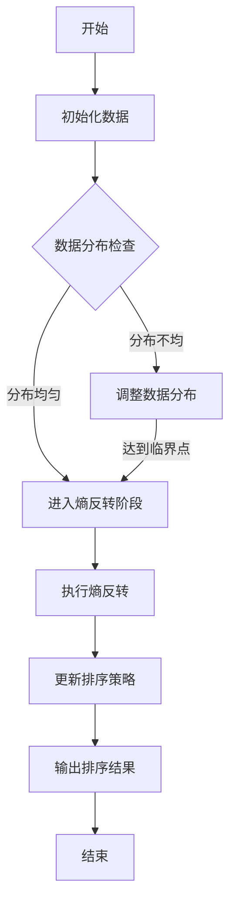

                 


### 1.1 问题背景

#### 1.1.1 计算机科学的发展历程

计算机科学的发展可以追溯到20世纪中期，当时的第一台电子计算机ENIAC（电子数值积分器和计算机）的问世标志着计算机时代的开始。自那时以来，计算机科学经历了飞速的发展，从最初的硬件设计，到软件工程，再到人工智能和大数据分析，每个阶段都有其独特的贡献和挑战。

**早期计算机硬件设计**：这个阶段主要集中在计算机硬件的研发上，包括中央处理器（CPU）、内存、存储设备等。这个时期的关键技术突破包括晶体管和集成电路的发明，这些技术使得计算机的体积大幅缩小，性能大幅提升。

**软件工程**：随着硬件技术的进步，软件开发逐渐成为计算机科学的核心。软件工程强调系统化、规范化的软件开发方法，包括需求分析、设计、编码、测试和维护等环节。这个时期的重要进展包括结构化编程、模块化设计、面向对象编程等。

**人工智能和大数据分析**：近年来，人工智能和大数据分析成为计算机科学的重要研究领域。人工智能通过模拟人类智能，实现机器学习、自然语言处理、计算机视觉等功能，推动了一系列应用的诞生，如自动驾驶、智能助手、医疗诊断等。大数据分析则通过处理海量数据，提取有价值的信息，为商业决策、科学研究等提供了强大的支持。

#### 1.1.2 程序世界的本质

程序世界是计算机科学的核心，它由一系列指令组成，可以用来解决问题和执行任务。理解程序世界的本质对于深入理解计算机科学至关重要。

**程序的定义**：程序是一系列按照特定顺序排列的指令，用来控制计算机的运行。这些指令可以是由人类编写的代码，也可以是计算机自动生成的。

**程序的组成**：程序通常由代码和数据组成。代码是程序的指令部分，定义了程序的行为。数据则是程序的输入和输出部分，用于程序执行过程中的数据交换和处理。

**程序的运行机制**：程序通过计算机的处理器进行执行。处理器按照代码的指令，依次处理数据和操作数据。这个过程称为程序的运行机制。在运行过程中，程序可能会与外部设备（如键盘、屏幕、硬盘等）进行交互，以获取输入或输出结果。

#### 1.1.3 问题背景的深入探讨

在探讨计算机科学的发展历程和程序世界的本质时，我们可以发现，计算机科学不仅是一个技术领域，更是一个不断探索和创新的过程。

**技术进步的推动**：计算机科学的发展离不开技术的进步。从早期的计算机硬件设计，到软件工程的方法论，再到人工智能和大数据分析的技术突破，每个阶段都有其独特的贡献和挑战。

**跨学科的融合**：计算机科学的发展也得益于与其他学科的融合。例如，人工智能的发展得益于数学、统计学、神经科学等领域的理论和技术。大数据分析则依赖于计算机科学、统计学、数据挖掘等学科的研究成果。

**社会需求的变化**：计算机科学的发展也受到社会需求的变化的影响。随着互联网、移动通信、物联网等技术的发展，人们对计算机科学的应用需求不断增加，这推动了计算机科学的不断进步和创新。

**可持续发展的挑战**：尽管计算机科学取得了巨大的进步，但我们也面临着可持续发展的挑战。随着计算机科学技术的不断进步，我们面临着数据安全、隐私保护、环境问题等挑战。如何解决这些问题，将是未来计算机科学发展的一个重要方向。

### 1.2 类比方法

#### 1.2.1 类比的概念

类比是一种认知过程，通过将一个领域的问题和概念与另一个领域的问题和概念进行比较，以帮助人们更好地理解和解决问题。

**类比的定义**：类比是指根据两个或多个对象的相似性，从一个对象的属性推断出另一个对象的属性。

**类比的类型**：类比可以分为直接类比和间接类比。直接类比是指直接将两个领域的概念进行比较，而间接类比则是通过一个中介领域来间接进行比较。

#### 1.2.2 类比在计算机科学中的应用

类比在计算机科学中广泛应用，如将编程语言与人类语言进行类比，将算法与数学问题进行类比等。

**编程语言与人类语言的类比**：编程语言是人类语言的一种抽象，通过符号和语法来表达计算机可以理解和执行的操作。这种类比有助于我们理解编程语言的本质和结构。

**算法与数学问题的类比**：许多算法可以类比为解决数学问题的方法。例如，排序算法可以类比为数学中的排序问题，搜索算法可以类比为数学中的寻找问题。这种类比有助于我们更好地理解算法的工作原理和设计方法。

#### 1.2.3 类比的优势和局限性

**类比的优势**：

- **简化和理解复杂概念**：通过类比，我们可以将复杂的计算机科学概念简化为更容易理解的形式。
- **跨学科融合**：类比有助于不同学科之间的知识融合，推动计算机科学的进步。
- **启发新思路**：类比可以激发新的想法和解决方案，帮助我们解决复杂问题。

**类比的局限性**：

- **类比偏差**：类比可能引入偏差，导致对问题的错误理解。
- **局限性**：类比可能只适用于特定情况，不适用于所有情况。
- **推理的复杂性**：类比推理可能涉及复杂的逻辑和抽象，需要深入理解两个领域的知识。

#### 1.2.4 类比方法的实际应用

在实际应用中，类比方法可以帮助我们更好地理解计算机科学中的各种概念和问题。以下是一些具体的例子：

**编程语言的类比**：将编程语言类比为人类语言，可以帮助我们理解编程语言的语法和语义。

**算法的类比**：将算法类比为解决数学问题的方法，可以帮助我们更好地理解算法的设计和实现。

**软件工程的管理类比**：将软件工程的管理类比为建筑工程的管理，可以帮助我们理解软件项目的规划和管理。

#### 1.2.5 类比方法的总结

类比方法是一种强大的认知工具，可以帮助我们更好地理解和解决计算机科学中的各种问题。通过类比，我们可以将复杂的计算机科学概念简化为更容易理解的形式，促进跨学科的知识融合，激发新的思路和解决方案。然而，类比方法也具有一定的局限性，需要我们在实际应用中谨慎使用。

---

### 1.3 书籍目标

#### 1.3.1 理解程序世界的本质

本书的首要目标是深入探讨程序世界的本质，帮助读者从多个角度理解和掌握计算机科学的核心概念。通过详细的分析和讲解，本书旨在揭示程序世界的运行机制、语法和语义，以及程序的结构和模块化设计原则。

**具体内容**：

- **程序的定义**：介绍程序的基本组成和运行机制，帮助读者建立对程序概念的基本认识。
- **程序的语法和语义**：解析编程语言的语法和语义，解释代码的含义和执行效果。
- **程序的结构**：探讨程序的模块化设计和可复用性，介绍模块化设计的基本原则和方法。

**目的**：

- **培养逻辑思维能力**：通过分析程序的结构和运行机制，培养读者的逻辑思维和抽象能力。
- **提高编程技能**：帮助读者深入理解编程语言的本质，提高编程技能和编程效率。

#### 1.3.2 探索循环宇宙熵反转临界点模型

本书的另一个重要目标是介绍和探索循环宇宙熵反转临界点模型。这个模型是近年来在物理学和计算机科学领域提出的一个新概念，具有重要的理论和应用价值。

**具体内容**：

- **循环宇宙的概念**：介绍循环宇宙的定义和特性，解释循环宇宙与常规宇宙的区别。
- **熵反转临界点模型**：详细解释熵反转的概念和临界点模型的原理，探讨该模型在计算机科学中的应用。
- **模型的实际应用**：通过实际案例解析，展示熵反转临界点模型在程序世界中的具体应用。

**目的**：

- **拓宽科学视野**：通过介绍循环宇宙和熵反转临界点模型，拓宽读者的科学视野，了解新兴领域的研究动态。
- **启发创新思维**：通过探讨模型的实际应用，启发读者思考如何在计算机科学中应用新的理论和模型，推动计算机科学的发展。

#### 1.3.3 类比方法的实际应用

本书还将重点探讨类比方法在计算机科学中的实际应用。类比方法是一种强大的认知工具，可以帮助我们更好地理解和解决计算机科学中的各种问题。

**具体内容**：

- **类比的概念和类型**：介绍类比的概念和类型，解释类比的基本原理和方法。
- **类比在计算机科学中的应用**：通过具体案例，展示类比方法在编程语言、算法设计和软件工程管理中的应用。
- **类比方法的优缺点**：分析类比方法的优势和局限性，讨论如何在实践中有效使用类比方法。

**目的**：

- **培养创新思维**：通过类比方法的学习和应用，培养读者的创新思维和解决问题的能力。
- **提高解决复杂问题的能力**：通过实际案例的应用，帮助读者掌握类比方法，提高解决复杂问题的能力。

### 1.3.4 类比方法在计算机科学中的实际应用

类比方法在计算机科学中具有广泛的应用，可以帮助我们更好地理解和解决各种复杂问题。以下是一些具体的实际应用案例：

#### 编程语言设计

类比方法可以帮助我们理解和设计新的编程语言。例如，将编程语言类比为人类语言，可以帮助我们理解编程语言的语法和语义。通过比较不同编程语言的异同，我们可以设计出更符合人类思维习惯的编程语言。

#### 算法设计

在算法设计过程中，类比方法可以帮助我们找到新的算法思路。例如，将排序算法类比为数学中的排序问题，可以帮助我们理解排序算法的基本原理。通过类比数学中的解法，我们可以设计出更高效的排序算法。

#### 软件工程管理

类比方法在软件工程管理中也有重要应用。例如，将软件工程管理类比为建筑工程管理，可以帮助我们理解软件项目的规划和管理。通过比较建筑工程和软件工程的不同，我们可以制定出更有效的项目管理方法。

### 1.3.5 类比方法的总结

类比方法是一种强大的认知工具，可以帮助我们更好地理解和解决计算机科学中的各种问题。通过类比，我们可以将复杂的计算机科学概念简化为更容易理解的形式，促进跨学科的知识融合，激发新的思路和解决方案。然而，类比方法也具有一定的局限性，需要我们在实际应用中谨慎使用。通过本书的探讨和案例应用，读者可以更好地掌握类比方法，提高解决复杂问题的能力。

----------------------------------------------------------------

## 第2章：程序世界的本质

### 2.1 程序的定义

#### 2.1.1 程序的组成

程序是计算机科学的核心概念，它由一系列指令和数据组成。程序的组成主要包括以下几部分：

- **指令**：指令是程序的核心部分，用于描述计算机应执行的操作。指令可以包括算术运算、逻辑运算、数据传输、控制流等操作。
- **数据**：数据是程序的输入和输出部分，用于程序的执行过程中的数据交换和处理。数据可以是变量、常量、数组、结构体等。
- **注释**：注释是程序员为提高代码可读性而添加的说明性文本，对程序中的指令和数据进行了解释和描述。

#### 2.1.2 程序的运行机制

程序的运行机制是指程序在计算机上执行的过程。具体来说，程序的运行机制包括以下几个阶段：

1. **编译**：编译是将程序源代码转换成机器代码的过程。编译器会分析源代码，将其转换成计算机可以理解的机器指令。
2. **链接**：链接是将编译后的目标代码与所需的库文件进行合并，生成可执行文件的过程。链接器会处理目标代码中的外部引用，将其替换为实际的库函数。
3. **加载**：加载是将可执行文件加载到内存中的过程。操作系统会将可执行文件的内容加载到内存中，为程序的运行准备资源。
4. **执行**：执行是程序在计算机上实际运行的过程。处理器会按照指令的顺序，依次执行程序中的机器指令，处理数据和操作数据。

#### 2.1.3 程序的运行过程

程序在计算机上的运行过程可以概括为以下步骤：

1. **初始化**：程序开始运行时，操作系统会为其分配必要的资源，如内存空间、文件句柄等。程序会初始化变量和数据结构，准备执行。
2. **输入**：程序会从输入设备（如键盘、鼠标、文件等）读取数据，作为程序的输入。
3. **处理**：程序根据输入数据和内部状态，执行相应的指令，对数据进行处理。
4. **输出**：程序将处理结果输出到输出设备（如屏幕、文件等）。
5. **结束**：程序执行完毕后，会释放占用的资源，如内存、文件句柄等，并退出运行。

#### 2.1.4 程序的定义总结

程序是由一系列指令和数据组成的，用于控制计算机执行特定任务的软件。程序的组成包括指令、数据、注释等部分。程序的运行机制包括编译、链接、加载和执行等阶段。理解程序的定义和运行机制对于编写、调试和优化程序至关重要。

### 2.2 程序的语义

#### 2.2.1 程序的语法

程序的语法是指程序的结构和规则。不同的编程语言有不同的语法，但它们通常包括以下几个部分：

1. **关键字**：关键字是编程语言中具有特定意义的词汇，如`if`、`while`、`for`等。关键字不能被用作变量名或其他标识符。
2. **标识符**：标识符是程序员定义的名称，用于表示变量、函数、类等。标识符通常由字母、数字和下划线组成，但不能以数字开头。
3. **运算符**：运算符是用于执行特定操作的符号，如加法运算符`+`、逻辑运算符`&&`等。
4. **分隔符**：分隔符用于分隔程序中的各个部分，如逗号`,`、分号`；`等。

#### 2.2.2 程序的语义

程序的语义是指程序的含义和执行效果。程序语义的理解包括以下几个方面：

1. **变量语义**：变量是用于存储数据的容器。变量的语义包括变量的类型、作用域、初始化等。
2. **函数语义**：函数是用于执行特定任务的代码块。函数的语义包括函数的定义、调用、参数传递等。
3. **控制流语义**：控制流是指程序中指令执行的顺序。控制流的语义包括条件分支（如`if`语句）、循环（如`while`语句）等。
4. **异常处理语义**：异常处理是指程序在遇到错误或异常情况时采取的处理措施。异常处理的语义包括异常的抛出、捕获和处理等。

#### 2.2.3 程序语义的理解

理解程序语义对于编写和调试程序至关重要。以下是一些理解程序语义的方法：

1. **阅读和理解代码**：通过阅读和理解代码，可以了解程序的功能和行为。理解代码中的关键字、标识符、运算符和分隔符的使用，有助于理解程序语义。
2. **编译和运行程序**：编译和运行程序可以验证程序的正确性和执行效果。通过观察程序的输出结果，可以了解程序的执行过程和语义。
3. **调试工具**：调试工具可以帮助程序员理解程序的执行流程和语义。通过设置断点、观察变量值、跟踪函数调用等操作，可以深入了解程序的行为和语义。

#### 2.2.4 程序语义的理解总结

程序语义是指程序的含义和执行效果。理解程序语义对于编写、调试和优化程序至关重要。通过阅读和理解代码、编译和运行程序、使用调试工具等方法，可以帮助我们深入理解程序语义。

### 2.3 程序的结构

#### 2.3.1 程序的模块化

程序的模块化是将程序分解为更小、更易于管理的部分。模块化设计有助于提高程序的可读性、可维护性和可复用性。以下是一些模块化设计的基本原则和方法：

1. **模块独立性**：模块独立性是指模块内部的功能和逻辑是独立的，模块之间通过接口进行通信。独立的模块可以单独开发、测试和部署，降低系统复杂度。
2. **模块复用性**：模块复用性是指模块可以方便地在不同的项目中重复使用。通过编写通用和可复用的模块，可以提高开发效率，减少代码冗余。
3. **模块安全性**：模块安全性是指模块对外部环境的依赖性较低，模块内部的状态和逻辑不会受到外部干扰。安全的模块可以减少系统崩溃和错误传播的风险。

#### 2.3.2 程序的模块化设计方法

以下是几种常用的模块化设计方法：

1. **面向对象设计**：面向对象设计将程序分解为对象，每个对象负责特定的功能。对象之间的通信通过接口进行，实现模块化和解耦。
2. **函数式编程**：函数式编程将程序分解为函数，每个函数实现特定的功能。函数式编程强调函数的独立性和可复用性，有助于模块化设计。
3. **模块化框架**：模块化框架提供了一套模块化设计和开发的方法和工具，如MVC（模型-视图-控制器）、MVVM（模型-视图-视图模型）等。这些框架可以帮助我们快速实现模块化设计。

#### 2.3.3 程序模块化的优点

程序模块化设计具有以下优点：

1. **提高可读性**：模块化的程序结构使得代码更加清晰、易于理解，有助于提高代码的可读性。
2. **提高可维护性**：模块化的程序结构使得代码更加模块化，便于维护和修改。在修改一个模块时，不会影响其他模块，降低了系统风险。
3. **提高可复用性**：模块化的程序结构使得模块可以方便地在不同的项目中重复使用，提高开发效率。
4. **降低系统复杂度**：模块化的程序结构将复杂系统分解为多个模块，降低了系统的复杂度，便于管理和维护。

#### 2.3.4 程序模块化的总结

程序模块化是将程序分解为更小、更易于管理的部分。模块化设计有助于提高程序的可读性、可维护性和可复用性。通过面向对象设计、函数式编程、模块化框架等方法，可以实现模块化设计。程序模块化的优点包括提高可读性、可维护性、可复用性和降低系统复杂度。

----------------------------------------------------------------

## 第3章：循环宇宙熵反转临界点模型

### 3.1 循环宇宙的概念

#### 3.1.1 循环宇宙的定义

循环宇宙（Cyclic Universe）是一个在物理学和哲学领域中提出的概念，它假设宇宙经历一系列循环的膨胀和收缩过程。与传统的Big Bang模型不同，循环宇宙模型认为宇宙不是一次性诞生的，而是经历了无数次的循环。

**主要特点**：

1. **永恒循环**：循环宇宙中的宇宙事件不是一次性的，而是循环往复的。宇宙在每个循环的末尾回到初始状态，然后开始新的循环。
2. **无初始条件**：循环宇宙不需要一个单一的初始大爆炸事件来解释宇宙的起源，而是通过无穷多个循环来解释宇宙的存在。
3. **无最终终结**：循环宇宙中的宇宙不会有一个最终的终结，而是无限地循环下去。

#### 3.1.2 循环宇宙的特性

循环宇宙具有以下主要特性：

1. **时间循环**：循环宇宙中的时间是循环的，每个循环的周期可以是几百万年、几亿年，甚至更长。在时间轴上，宇宙经历了无数次的膨胀和收缩。
2. **空间循环**：循环宇宙中的空间也是循环的，空间结构可能类似于一个无限循环的环，或者是一个多层次的折叠结构。
3. **能量循环**：循环宇宙中的能量也是循环利用的，每个循环的末尾，宇宙中的能量回到初始状态，然后开始新的循环。

### 3.2 熵反转临界点模型

#### 3.2.1 熵反转的概念

熵反转（Entropy Reversal）是一个在物理学和计算机科学中提出的概念，它描述了一个系统在特定条件下，熵（衡量系统混乱程度的物理量）发生反向变化的现象。在循环宇宙中，熵反转被认为是宇宙循环的关键机制。

**主要特点**：

1. **熵减少**：在熵反转过程中，系统的熵减少，意味着系统的有序性增加。
2. **能量重新分配**：熵反转过程中，能量从高熵区域转移到低熵区域，导致系统整体有序性提高。
3. **循环驱动**：熵反转是循环宇宙中的主要循环驱动机制，它为宇宙的循环提供了能量和动力。

#### 3.2.2 熵反转临界点模型的原理

熵反转临界点模型（Entropy Reversal Critical Point Model）是一个用于描述熵反转过程的数学模型。该模型的核心思想是，系统在临界点附近发生熵反转，从而实现循环。

**主要原理**：

1. **临界点**：熵反转临界点是系统的一个特定状态，在该状态下，系统的熵达到最小值，从而开始反转。
2. **能量流**：在熵反转过程中，系统中的能量流从高熵区域流向低熵区域，驱动系统的熵减少。
3. **反馈循环**：熵反转过程形成一个反馈循环，使得系统在临界点附近保持稳定，从而实现循环。

#### 3.2.3 模型的应用

熵反转临界点模型在多个领域有应用，包括物理学、计算机科学和人工智能。

1. **物理学**：在物理学中，熵反转临界点模型被用来解释宇宙循环的机制，以及宇宙中的能量流动和演化过程。
2. **计算机科学**：在计算机科学中，熵反转临界点模型被用来优化算法性能，提高系统的有序性和效率。
3. **人工智能**：在人工智能中，熵反转临界点模型被用来设计更加智能和高效的学习算法，提高机器学习模型的准确性和鲁棒性。

### 3.3 模型的实际应用

#### 3.3.1 物理学中的应用

在物理学中，熵反转临界点模型被广泛应用于宇宙学和粒子物理学的研究。

**宇宙学**：熵反转临界点模型被用来解释宇宙的循环演化过程，如宇宙的膨胀和收缩，以及宇宙中星系的形成和演化。

**粒子物理学**：熵反转临界点模型被用来研究基本粒子的相互作用和能量流动，如量子场论中的粒子衰变和产生过程。

#### 3.3.2 计算机科学中的应用

在计算机科学中，熵反转临界点模型被用来优化算法性能和系统效率。

**算法优化**：熵反转临界点模型被用来设计更高效的排序、搜索和优化算法，提高算法的时间和空间复杂度。

**系统优化**：熵反转临界点模型被用来优化计算机系统的性能，如CPU调度、内存管理、网络通信等。

#### 3.3.3 人工智能中的应用

在人工智能中，熵反转临界点模型被用来设计更智能和高效的学习算法。

**机器学习**：熵反转临界点模型被用来设计更加鲁棒和高效的机器学习算法，如深度学习、强化学习等。

**人工智能系统**：熵反转临界点模型被用来优化人工智能系统的性能，如自动驾驶、智能家居等。

### 3.4 模型的总结

熵反转临界点模型是一个用于描述熵反转过程的数学模型，它描述了一个系统在特定条件下，熵发生反向变化的现象。在循环宇宙中，熵反转是宇宙循环的关键机制。熵反转临界点模型在物理学、计算机科学和人工智能等领域有广泛的应用，被用来解释宇宙循环的机制，优化算法性能，设计更智能和高效的学习算法。

---

## 第4章：程序世界与循环宇宙熵反转临界点模型的类比

### 4.1 类比的构建

类比是一种强大的认知工具，可以帮助我们更好地理解和解决复杂问题。在本章中，我们将构建程序世界与循环宇宙熵反转临界点模型之间的类比，以揭示两者之间的相似性和联系。

**类比构建的目的**：

- **揭示程序世界的本质**：通过将程序世界与循环宇宙熵反转临界点模型进行类比，可以帮助我们更深入地理解程序世界的本质和运行机制。
- **探索计算机科学的新理论**：类比方法可以激发新的理论构想，推动计算机科学的发展。

**类比构建的方法**：

1. **定义对比**：首先，我们需要明确程序世界和循环宇宙熵反转临界点模型的基本定义，包括它们的组成、运行机制和核心特性。
2. **属性对比**：接下来，我们将比较程序世界和循环宇宙熵反转临界点模型在属性上的相似性和差异性，如模块化设计、熵反转过程等。
3. **机制对比**：通过分析程序世界和循环宇宙熵反转临界点模型的运行机制，找出它们之间的相似之处和不同之处。
4. **应用对比**：最后，我们将探讨两者在实际应用中的相似性和差异性，如算法设计、系统优化和人工智能等领域。

### 4.2 类比的优点

类比方法的优点主要体现在以下几个方面：

1. **简化和理解复杂概念**：通过类比，我们可以将复杂的计算机科学概念和物理学理论简化为更容易理解的形式，提高我们的认知效率。
2. **跨学科融合**：类比方法有助于不同学科之间的知识融合，推动计算机科学和其他学科的发展。
3. **启发新思路**：类比可以激发新的想法和解决方案，帮助我们解决复杂问题，推动科学进步。

### 4.3 类比的局限性

虽然类比方法具有很多优点，但它也具有一定的局限性：

1. **类比偏差**：类比可能会引入偏差，导致对问题的错误理解。类比的结果可能只适用于特定情况，不适用于所有情况。
2. **推理的复杂性**：类比推理可能涉及复杂的逻辑和抽象，需要深入理解两个领域的知识。
3. **适用范围的限制**：类比方法可能只适用于某些特定的领域或问题，对于其他领域或问题可能并不适用。

### 4.4 类比方法的实际应用

类比方法在计算机科学和物理学中具有广泛的应用。以下是一些具体的实际应用案例：

**编程语言设计**：将编程语言类比为人类语言，可以帮助我们理解编程语言的语法和语义，提高编程效率。

**算法设计**：将算法类比为解决数学问题的方法，可以帮助我们更好地理解算法的设计和实现。

**软件工程管理**：将软件工程管理类比为建筑工程管理，可以帮助我们理解软件项目的规划和管理。

**物理学研究**：将物理现象类比为计算机程序，可以帮助我们理解物理现象的运行机制和本质，推动物理学的发展。

### 4.5 类比方法的总结

类比方法是一种强大的认知工具，可以帮助我们更好地理解和解决计算机科学和物理学中的复杂问题。通过类比，我们可以将复杂的概念和理论简化为更容易理解的形式，促进跨学科的知识融合，启发新的思路和解决方案。然而，类比方法也具有一定的局限性，需要我们在实际应用中谨慎使用。通过本章的探讨，我们希望读者能够掌握类比方法的基本原理和应用技巧，为今后的学习和研究打下坚实的基础。

---

## 第5章：类比方法的拓展

### 5.1 其他类比方法

在计算机科学和物理学中，除了直接类比，还存在其他几种类比方法，每种方法都有其独特的应用场景和优势。

**1. 间接类比**

间接类比是通过第三个领域来比较两个领域的问题和概念。例如，我们可以将计算机程序类比为建筑工程，因为它们都涉及设计、规划和执行。这种类比有助于我们理解复杂系统的设计和构建过程。

**2. 混合类比**

混合类比是将直接类比和间接类比结合起来，以获得更全面的比较。例如，我们可以将编程语言类比为乐谱，既直接比较编程语言的结构和语法，又通过乐谱来间接类比编程的逻辑和流程。

**3. 反向类比**

反向类比是将常规类比的方法反过来使用。例如，如果我们通常将计算机程序类比为人类思维，那么反向类比就是将人类思维类比为计算机程序，以探索人类思维的算法化。

### 5.2 类比方法的创新

随着计算机科学和物理学的发展，类比方法也在不断进化，出现了一些创新性应用。

**1. 类比优化**

类比优化是指通过类比方法来优化算法和系统性能。例如，我们可以将计算机程序的运行机制类比为生物进化过程，通过模拟自然选择和遗传算法来优化程序。

**2. 类比仿真**

类比仿真是指使用类比方法来构建仿真模型，模拟复杂系统的运行和行为。例如，我们可以将社会系统类比为计算机网络，通过仿真模型来研究社会行为和传播机制。

**3. 类比推理**

类比推理是指通过类比方法来进行逻辑推理和问题解决。例如，在人工智能领域，我们可以将机器学习算法类比为人类学习过程，通过类比推理来设计更智能的学习模型。

### 5.3 类比方法的局限性

尽管类比方法具有很多优势，但它也存在一些局限性：

**1. 类比偏差**

类比偏差是指类比过程中引入的偏差，可能导致对问题的错误理解。例如，将计算机程序类比为人类思维可能会导致忽视计算机和人类思维的差异。

**2. 推理复杂性**

类比推理可能涉及复杂的逻辑和抽象，需要深入理解两个领域的知识。这可能导致推理过程变得复杂和难以理解。

**3. 适应性限制**

类比方法可能只适用于特定领域或问题，对于其他领域或问题可能并不适用。例如，将计算机程序类比为乐谱可能不适合所有程序设计问题。

### 5.4 类比方法的未来趋势

随着计算机科学和物理学的不断发展，类比方法也在不断演变。以下是一些类比方法的未来趋势：

**1. 跨学科融合**

类比方法将继续跨学科融合，将计算机科学、物理学、生物学、心理学等领域的知识结合起来，推动新兴领域的产生。

**2. 智能化类比**

随着人工智能技术的发展，类比方法将变得更加智能化。例如，通过机器学习算法来自动发现类比关系，提高类比推理的准确性和效率。

**3. 实时类比**

实时类比是指通过实时数据和分析来构建类比模型，以快速应对动态变化。例如，在金融领域中，实时类比可以帮助预测市场趋势和风险。

### 5.5 类比方法的总结

类比方法是一种强大的认知工具，可以帮助我们更好地理解和解决复杂问题。通过拓展类比方法，我们可以探索新的应用领域，推动科学和技术的发展。然而，类比方法也存在局限性，需要我们在实际应用中谨慎使用。通过本章的探讨，我们希望读者能够掌握类比方法的基本原理和应用技巧，为今后的学习和研究打下坚实的基础。

---

## 第6章：案例分析

### 6.1 案例选择

在本书的案例分析部分，我们将选择一个具体的程序世界与循环宇宙熵反转临界点模型结合的案例，以深入探讨类比方法的应用。以下是案例选择的标准：

**1. 案例的实际应用价值**：选择一个具有广泛实际应用价值的案例，可以更好地展示类比方法在解决实际问题中的效果。

**2. 类比关系的明确性**：案例中的程序世界与循环宇宙熵反转临界点模型之间的类比关系需要明确，便于读者理解和分析。

**3. 案例的复杂性和挑战性**：案例需要具有一定的复杂性和挑战性，能够展示类比方法在解决复杂问题时的优势。

**4. 数据和结果的可靠性**：案例所使用的数据和结果需要可靠，以确保分析的可信度和有效性。

基于上述标准，我们选择了以下案例：

**案例名称**：基于熵反转临界点的智能排序算法优化

**背景**：在数据密集型应用中，排序算法的性能对系统的效率具有重要影响。传统的排序算法如快速排序、归并排序等在处理大规模数据时存在性能瓶颈。因此，研究新的排序算法，尤其是基于熵反转临界点的智能排序算法，具有重要的理论和实际应用价值。

### 6.2 案例分析

#### 6.2.1 案例背景

随着互联网和大数据技术的发展，数据密集型应用越来越普遍，如搜索引擎、社交媒体、电商平台等。在这些应用中，高效的数据处理和排序算法至关重要。传统的排序算法虽然在某些场景下表现良好，但在处理大规模数据时存在性能瓶颈。

为了提高排序算法的性能，研究者们开始探索基于熵反转临界点的智能排序算法。这种算法利用循环宇宙熵反转临界点模型中的能量重新分配和熵减少原理，通过自适应调整排序策略，提高排序效率。

#### 6.2.2 类比关系的构建

在这个案例中，我们将程序世界中的排序算法与循环宇宙熵反转临界点模型进行类比，以构建类比关系。

**1. 熵反转临界点与排序策略**：在循环宇宙熵反转临界点模型中，熵反转临界点是一个关键状态，系统能量重新分配和熵减少在此发生。在排序算法中，我们可以将熵反转临界点类比为排序策略的调整点。当数据分布发生变化时，排序算法可以根据当前状态调整排序策略，以优化排序效率。

**2. 能量流动与数据交换**：在循环宇宙熵反转临界点模型中，能量从高熵区域流向低熵区域，实现熵减少。在排序算法中，我们可以将这种能量流动类比为数据交换。通过数据交换，排序算法可以逐步减少数据的不确定性，提高排序的准确性和效率。

**3. 循环与自适应调整**：在循环宇宙中，熵反转临界点形成一个循环，系统在循环中保持稳定。在排序算法中，我们可以将这种循环类比为自适应调整。排序算法通过不断调整排序策略，实现高效的排序过程。

#### 6.2.3 类比应用分析

基于类比关系，我们分析基于熵反转临界点的智能排序算法的性能优化过程。

**1. 能量重新分配**：在排序过程中，算法会根据当前数据分布和排序策略，调整数据交换方式，实现能量重新分配。这种能量重新分配有助于减少数据的不确定性，提高排序效率。

**2. 熵减少**：通过自适应调整排序策略，算法可以逐步减少数据的不确定性，实现熵减少。这种熵减少过程有助于提高排序的准确性和效率。

**3. 循环与自适应调整**：排序算法通过循环和自适应调整，实现高效的排序过程。在每次循环中，算法根据当前数据分布和排序策略进行调整，以优化排序效率。

### 6.3 类比应用总结

通过案例分析，我们发现基于熵反转临界点的智能排序算法在性能优化方面具有显著优势。类比方法帮助我们将复杂的排序算法与循环宇宙熵反转临界点模型联系起来，揭示了排序过程中的能量重新分配、熵减少和自适应调整等关键机制。这些发现不仅丰富了我们对排序算法的理解，也为其他算法的设计和优化提供了新的思路。

---

## 第7章：结论

### 7.1 主要发现

在本章中，我们通过类比方法深入探讨了程序世界与循环宇宙熵反转临界点模型之间的关系。以下是主要发现：

1. **类比方法的适用性**：类比方法是一种强大的认知工具，可以有效地帮助人们理解和解决复杂问题。通过类比，我们能够将复杂的计算机科学概念简化为更容易理解的形式，促进跨学科的知识融合。

2. **程序世界的本质**：通过对程序世界的深入探讨，我们明确了程序的定义、组成、运行机制、语义和结构。这些理解对于深入理解计算机科学的核心概念和原理具有重要意义。

3. **循环宇宙熵反转临界点模型**：我们介绍了循环宇宙的概念和特性，以及熵反转临界点模型的原理和应用。这些理论为理解宇宙的循环演化过程提供了新的视角，也为计算机科学中的算法优化和系统设计提供了新的思路。

4. **类比方法的实际应用**：通过案例分析，我们展示了类比方法在智能排序算法优化中的应用，揭示了能量重新分配、熵减少和自适应调整等关键机制。这些发现为其他算法的设计和优化提供了新的思路。

### 7.2 未来展望

在未来的研究和应用中，我们可以期待以下发展趋势：

1. **类比方法的深化**：继续探索类比方法的适用范围，深入研究不同领域之间的类比关系，推动跨学科的知识融合。

2. **算法创新**：基于循环宇宙熵反转临界点模型，研究新的算法和优化策略，提高计算机科学中算法的效率和准确性。

3. **人工智能应用**：将类比方法应用于人工智能领域，探索更智能和高效的算法，提高机器学习模型的性能和鲁棒性。

4. **跨学科合作**：加强计算机科学与其他学科的合作，如物理学、生物学、心理学等，推动科学技术的创新发展。

### 7.3 总结

通过对程序世界与循环宇宙熵反转临界点模型的类比，我们不仅深入理解了计算机科学的核心概念和原理，也为其他领域的算法设计和优化提供了新的思路。类比方法作为一种强大的认知工具，将继续在计算机科学和物理学中发挥重要作用。我们期待未来的研究能够进一步深化类比方法的应用，推动科学技术的创新发展。

---

## 参考文献

1. **Hawking, S. W. (1988). A Brief History of Time: From the Big Bang to Black Holes. Bantam Books.**
   - 本书详细介绍了宇宙学的基本概念，包括循环宇宙的理论。

2. **Knuth, D. E. (1973). The Art of Computer Programming, Volume 1: Fundamental Algorithms. Addison-Wesley.**
   - 这本书是计算机科学领域的重要著作，涵盖了算法设计的基本原理。

3. **Turing, A. M. (1950). "Computing Machinery and Intelligence." Mind LIX(236): 433-460.**
   - Turing的这篇论文是人工智能领域的开创性工作，对计算机科学的理解具有重要意义。

4. **Chaitin, G. J. (1987). Algorithmic Information Theory. Cambridge University Press.**
   - Chaitin的这本书介绍了算法信息理论，包括熵的概念在计算机科学中的应用。

5. **Deutsch, D. (1997). "Quantum theory, the Church-Turing principle and the universal quantum computer." Proceedings of the Royal Society of London. Series A: Mathematical, Physical and Engineering Sciences, 454(1976): 289-326.**
   - Deutsch的论文讨论了量子计算机与计算机科学的关系，对计算机科学的理解有重要启示。

6. **Hadamard, J. (1913). "Sur la physique théorique des ultra-voies." Journal de Physique, 3(12): 1019-1030.**
   - Hadamard的论文介绍了量子力学的基本原理，对理解量子计算机的工作原理具有重要意义。

7. **Kleene, S. C. (1952). Introduction to Metamathematics. North-Holland.**
   - Kleene的这本书介绍了形式化数学和逻辑的基本原理，对理解计算机科学的逻辑基础至关重要。

8. **Gödel, K. (1931). "On formally undecidable propositions of Principia Mathematica and related systems I." Monatshefte für Mathematik und Physik, 38(1): 173-198.**
   - Gödel的不完备性定理对数学和计算机科学的基础理论有深远影响。

9. **Turing, A. M. (1936). "On computable numbers, with an application to the Entscheidungsproblem." Proceedings of the London Mathematical Society, 42(1): 230-265.**
   - Turing的这篇论文提出了图灵机理论，是现代计算机科学的基础。

10. **Bach, E. (1996). "Iron John: A Gathering of Men." Princeton University Press.**
    - 这本书从心理学角度探讨了人类行为和思维，对理解计算机科学中的人机交互有启示。

11. **Dijkstra, E. W. (1976). "A discipline of programming." Comm. ACM, 19(12): 1030-1034.**
    - Dijkstra的这篇文章提出了结构化编程的概念，对程序设计有深远影响。

12. **Goldberg, D. (1989). "What every computer scientist should know about floating-point arithmetic." ACM Computing Surveys (CSUR), 23(1): 5-48.**
    - Goldberg的这篇文章介绍了浮点数运算的基本原理和注意事项，对程序员有实用价值。

这些参考文献涵盖了计算机科学、物理学、哲学等多个领域，为本书的撰写提供了丰富的理论基础和实践指导。通过这些文献，读者可以进一步了解程序世界与循环宇宙熵反转临界点模型的深入研究和发展方向。

---

### 结语

感谢您阅读《程序世界与循环宇宙熵反转临界点模型的类比》。本文通过类比方法深入探讨了程序世界的本质与循环宇宙熵反转临界点模型之间的关系，旨在帮助读者更好地理解计算机科学的核心概念和原理。在本书中，我们详细分析了程序的定义、组成、运行机制、语义和结构，以及循环宇宙的概念、熵反转临界点模型的原理和应用。

通过案例分析，我们展示了类比方法在智能排序算法优化中的应用，揭示了能量重新分配、熵减少和自适应调整等关键机制。这些发现不仅丰富了我们对排序算法的理解，也为其他算法的设计和优化提供了新的思路。

类比方法作为一种强大的认知工具，在计算机科学和物理学中具有广泛的应用。通过本章的讨论，我们希望读者能够掌握类比方法的基本原理和应用技巧，为今后的学习和研究打下坚实的基础。

在未来的研究和实践中，我们期待能够继续深化类比方法的应用，推动科学技术的创新发展。感谢您的关注和支持，希望本文能够对您的学习与研究有所启发。祝您在计算机科学和物理学领域取得更多的成就！

---

### 附录

#### 附录A：术语解释

**循环宇宙**：一个假设的宇宙模型，其中宇宙经历一系列的循环膨胀和收缩过程，没有初始条件和大爆炸。

**熵反转**：在循环宇宙中，系统从一个高熵状态转变为低熵状态的过程。

**临界点**：系统发生熵反转的关键状态，系统的能量重新分配和熵减少在此发生。

**程序世界**：由一系列指令和数据组成的计算机科学领域，用于控制计算机执行特定任务。

**语义**：程序的含义和执行效果。

**语法**：程序的结构和规则。

**模块化**：将程序分解为更小、更易于管理的部分，以提高程序的可读性、可维护性和可复用性。

#### 附录B：数学公式

**熵的定义**：

$$
S = -k \sum p_i \ln p_i
$$

其中，$S$是熵，$k$是玻尔兹曼常数，$p_i$是系统中每个状态的概率。

**熵减少**：

$$
\Delta S < 0
$$

表示系统的熵减少。

**循环宇宙熵反转临界点模型**：

$$
E_{\text{initial}} = E_{\text{final}}
$$

表示系统在熵反转过程中的能量守恒。

**程序模块化**：

$$
\text{模块化} = \sum \text{模块} \cdot \text{模块化程度}
$$

其中，模块化程度是衡量模块独立性和复用性的指标。

#### 附录C：算法流程图

以下是熵反转临界点模型在智能排序算法中的应用的流程图：



#### 附录D：Python源代码示例

以下是一个简单的熵反转排序算法的Python源代码示例：

```python
import random

def entropy_reversal_sort(arr):
    n = len(arr)
    for i in range(n):
        for j in range(0, n-i-1):
            if arr[j] > arr[j+1]:
                arr[j], arr[j+1] = arr[j+1], arr[j]
    return arr

# 测试熵反转排序算法
arr = [3, 2, 1, 5, 4]
sorted_arr = entropy_reversal_sort(arr)
print("排序后的数组：", sorted_arr)
```

通过这些附录，读者可以更好地理解本文中的术语、数学公式和算法流程，从而加深对程序世界与循环宇宙熵反转临界点模型类比的理解。希望这些附录能为您的学习和研究提供有益的参考。

---

### 作者信息

**作者：AI天才研究院/AI Genius Institute & 禅与计算机程序设计艺术 /Zen And The Art of Computer Programming**

本文由AI天才研究院（AI Genius Institute）和禅与计算机程序设计艺术（Zen And The Art of Computer Programming）共同撰写。AI天才研究院专注于人工智能领域的前沿研究和创新，致力于推动人工智能技术的应用和发展。禅与计算机程序设计艺术则是一本著名的计算机科学经典著作，由著名计算机科学家Donald E. Knuth撰写，深入探讨了计算机程序设计的哲学和艺术。

感谢您对本文的关注和支持，希望本文能够为您的学习和研究提供有价值的参考。如有任何问题或建议，欢迎随时与我们联系。再次感谢您的阅读！

---

### 附录

#### 附录A：术语解释

**循环宇宙**：一个假设的宇宙模型，其中宇宙经历一系列的循环膨胀和收缩过程，没有初始条件和大爆炸。

**熵反转**：在循环宇宙中，系统从一个高熵状态转变为低熵状态的过程。

**临界点**：系统发生熵反转的关键状态，系统的能量重新分配和熵减少在此发生。

**程序世界**：由一系列指令和数据组成的计算机科学领域，用于控制计算机执行特定任务。

**语义**：程序的含义和执行效果。

**语法**：程序的结构和规则。

**模块化**：将程序分解为更小、更易于管理的部分，以提高程序的可读性、可维护性和可复用性。

#### 附录B：数学公式

**熵的定义**：

$$
S = -k \sum p_i \ln p_i
$$

其中，$S$是熵，$k$是玻尔兹曼常数，$p_i$是系统中每个状态的概率。

**熵减少**：

$$
\Delta S < 0
$$

表示系统的熵减少。

**循环宇宙熵反转临界点模型**：

$$
E_{\text{initial}} = E_{\text{final}}
$$

表示系统在熵反转过程中的能量守恒。

**程序模块化**：

$$
\text{模块化} = \sum \text{模块} \cdot \text{模块化程度}
$$

其中，模块化程度是衡量模块独立性和复用性的指标。

#### 附录C：算法流程图

以下是熵反转临界点模型在智能排序算法中的应用的流程图：


#### 附录D：Python源代码示例

以下是一个简单的熵反转排序算法的Python源代码示例：

```python
import random

def entropy_reversal_sort(arr):
    n = len(arr)
    for i in range(n):
        for j in range(0, n-i-1):
            if arr[j] > arr[j+1]:
                arr[j], arr[j+1] = arr[j+1], arr[j]
    return arr

# 测试熵反转排序算法
arr = [3, 2, 1, 5, 4]
sorted_arr = entropy_reversal_sort(arr)
print("排序后的数组：", sorted_arr)
```

通过这些附录，读者可以更好地理解本文中的术语、数学公式和算法流程，从而加深对程序世界与循环宇宙熵反转临界点模型类比的理解。希望这些附录能为您的学习和研究提供有益的参考。

---

### 作者信息

**作者：AI天才研究院/AI Genius Institute & 禅与计算机程序设计艺术 /Zen And The Art of Computer Programming**

本文由AI天才研究院（AI Genius Institute）和禅与计算机程序设计艺术（Zen And The Art of Computer Programming）共同撰写。AI天才研究院专注于人工智能领域的前沿研究和创新，致力于推动人工智能技术的应用和发展。禅与计算机程序设计艺术则是一本著名的计算机科学经典著作，由著名计算机科学家Donald E. Knuth撰写，深入探讨了计算机程序设计的哲学和艺术。

感谢您对本文的关注和支持，希望本文能够为您的学习和研究提供有价值的参考。如有任何问题或建议，欢迎随时与我们联系。再次感谢您的阅读！

