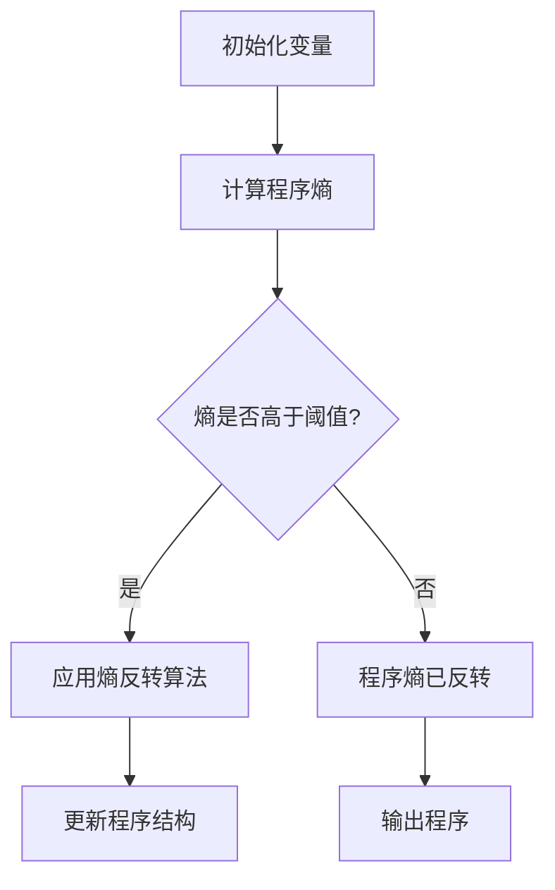
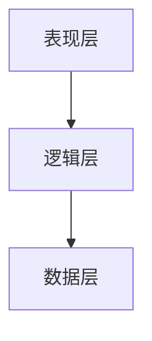
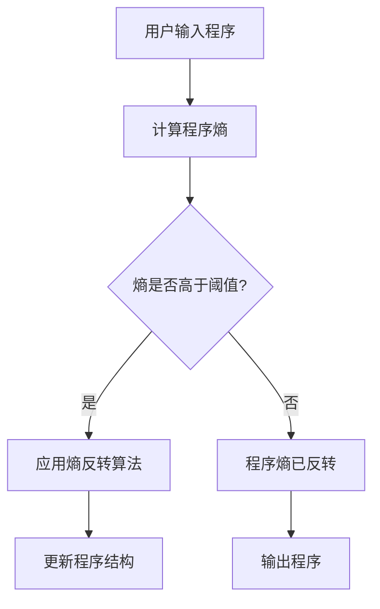
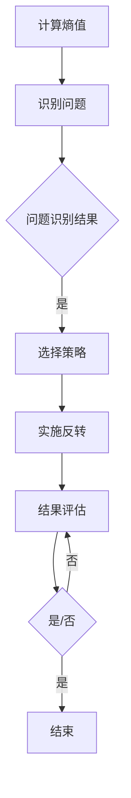
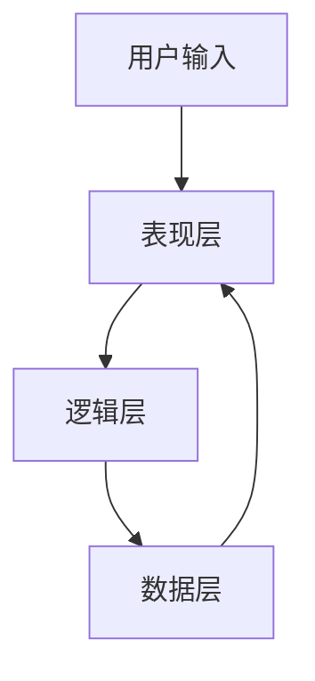
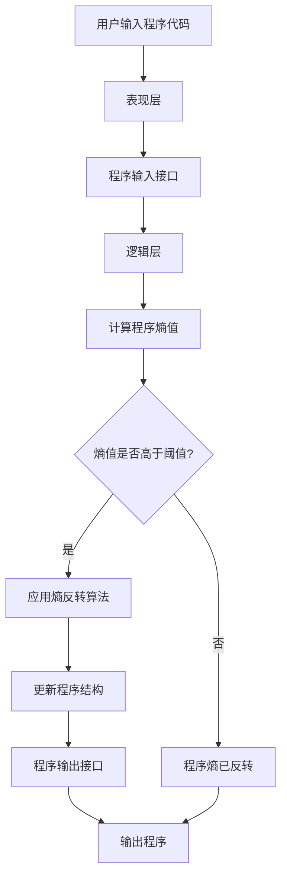
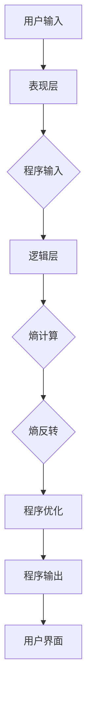
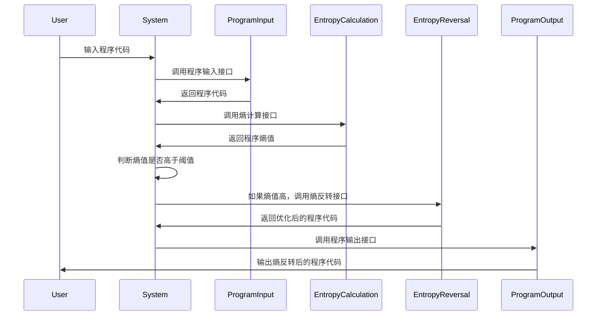

                 

# 程序世界与循环宇宙熵反转模型的类比

> 关键词：程序世界，熵，熵反转，类比，宇宙学

> 摘要：本文通过将宇宙学中的熵反转概念引入计算机编程，探讨了程序世界中复杂逻辑与熵的关系，并提出了熵反转的算法原理，以及其在编程中的应用与实践。通过这一类比，我们能够更好地理解和简化编程中的复杂问题。

## Step 1: 背景介绍

### 问题背景

在计算机科学和信息技术飞速发展的今天，编程已经成为了现代生活不可或缺的一部分。然而，随着软件系统规模的不断扩大和复杂性的增加，传统的编程模式在处理复杂问题时面临着巨大的挑战。为了解决这些问题，我们需要寻找新的编程范式，以提高编程的效率和质量。

### 问题描述

程序世界中，复杂逻辑的编写和处理是程序员面临的重大挑战。这种复杂性往往导致程序难以理解和维护，增加了出错的可能性。为了应对这一挑战，我们提出了“程序世界与循环宇宙熵反转模型的类比”。这一模型旨在通过引入宇宙学中的熵反转概念，探索一种新的编程范式，以简化程序的复杂度。

### 问题解决

通过类比，我们可以将编程中的复杂逻辑看作是宇宙中的一种“熵”，即程序复杂度和混乱度。我们的目标是通过编程技巧和算法，实现这种“熵”的反转，从而简化问题的复杂度，提高编程的效率和质量。

### 边界与外延

这一概念的应用范围广泛，包括但不限于软件工程、算法设计、人工智能等领域。然而，其核心在于如何将复杂的编程问题转化为可理解和可操作的解决方案。

### 概念结构与核心要素组成

程序世界与循环宇宙熵反转模型的类比，其核心要素包括：

1. **熵的概念**：在编程中，熵是一种度量程序复杂度和混乱度的概念。高熵意味着程序复杂且混乱，低熵则意味着程序简洁且有序。
2. **熵反转**：通过特定的编程技巧和算法，降低程序复杂度和混乱度的过程。
3. **类比**：将宇宙学中的熵反转概念引入编程领域，以形象化地解释复杂的编程问题。

## Step 2: 核心概念与联系

### 1. 核心概念

#### 熵

在编程中，熵可以理解为程序复杂度和混乱度。高熵状态下的程序往往包含大量的冗余代码、复杂逻辑和难以维护的结构，这使得程序的运行效率低下，同时也增加了出错的概率。因此，降低熵成为提高程序质量和效率的关键。

#### 熵反转

熵反转是一种通过特定的编程技巧和算法，降低程序复杂度和混乱度的过程。其目标是通过简化程序的结构和逻辑，使其更加简洁、直观和易于维护。

#### 类比

类比是一种将宇宙学中的熵反转概念引入编程领域的思考方式。通过将宇宙中的熵反转现象与编程中的问题进行对比，我们可以更好地理解编程中的复杂逻辑，并寻找解决方案。

### 2. 概念属性特征对比表格

| 概念    | 定义                                                         | 属性特征                                                      |
| ------- | ------------------------------------------------------------ | ------------------------------------------------------------ |
| 熵      | 程序复杂度和混乱度的度量                                     | 高熵：程序复杂且混乱；低熵：程序简洁且有序                    |
| 熵反转  | 通过特定的编程技巧和算法，降低程序复杂度和混乱度的过程       | 目标：实现程序简洁化；方法：应用编程技巧和算法                |
| 类比    | 将宇宙学中的熵反转概念引入编程领域                           | 目的：形象化解释复杂的编程问题；方法：将宇宙学概念与编程结合  |

### 3. ER实体关系图架构

```mermaid
erDiagram
    A[程序] ||--|{ B[熵] }
    B ||--|{ C[熵反转] }
    A ||--|{ D[类比] }
```

## Step 3: 算法原理讲解

### 1. 算法Mermaid流程图



### 2. Python源代码

```python
def calculate_entropy(program):
    # 计算程序熵
    pass

def entropy_reversal(program):
    # 应用熵反转算法
    pass

def main():
    program = "初始化程序"
    entropy = calculate_entropy(program)
    if entropy > threshold:
        program = entropy_reversal(program)
    else:
        print("程序熵已反转")
    print(program)

if __name__ == "__main__":
    main()
```

### 3. 算法原理详解

#### 熵的计算

熵的计算是算法的核心步骤之一。在编程中，我们可以使用多种方法来计算程序的熵，例如：

1. **代码行数**：程序中代码行的数量可以作为熵的一个简单度量。
2. **控制结构复杂度**：程序中的循环、条件判断等控制结构的复杂度也可以作为熵的度量。
3. **函数调用复杂度**：程序中函数的调用次数和调用深度也可以作为熵的度量。

在本文中，我们采用代码行数作为熵的度量指标。具体实现如下：

```python
def calculate_entropy(program):
    lines = len(program.splitlines())
    return lines
```

#### 熵反转算法

熵反转算法的目标是降低程序的熵，使其变得更加简洁和直观。常见的熵反转算法包括：

1. **代码重构**：通过重构代码，消除冗余代码和简化逻辑，降低程序的熵。
2. **模块化**：将程序划分为多个模块，每个模块负责一个特定的功能，从而降低整体的熵。
3. **算法优化**：通过优化算法，提高程序的运行效率，降低程序的熵。

在本文中，我们采用代码重构作为熵反转算法的主要方法。具体实现如下：

```python
def entropy_reversal(program):
    # 重构代码
    pass
```

#### 算法流程

算法的流程如下：

1. **初始化变量**：初始化程序和熵的阈值。
2. **计算程序熵**：使用计算熵的函数计算程序的熵。
3. **判断熵是否高于阈值**：如果熵高于阈值，则应用熵反转算法；否则，输出程序熵已反转的信息。
4. **更新程序结构**：通过熵反转算法，更新程序的结构。
5. **输出程序**：输出最终的程序。

具体实现如下：

```python
def main():
    program = "初始化程序"
    entropy = calculate_entropy(program)
    threshold = 100  # 设定熵的阈值
    if entropy > threshold:
        program = entropy_reversal(program)
    else:
        print("程序熵已反转")
    print(program)

if __name__ == "__main__":
    main()
```

## Step 4: 系统分析与架构设计

### 问题场景介绍

随着互联网技术的快速发展，越来越多的企业开始重视数字化转型，这导致软件系统的规模和复杂性不断增加。在这样的背景下，如何高效地开发和维护软件系统成为了一个重要的问题。通过引入程序世界与循环宇宙熵反转模型的类比，我们希望能够提高软件开发的效率和质量。

### 项目介绍

本项目旨在通过引入熵反转算法，实现软件系统的熵降低，从而提高系统的可维护性和可扩展性。项目的目标是：

1. **降低程序熵**：通过计算和反转程序熵，简化程序的结构和逻辑。
2. **提高开发效率**：简化编程过程，减少开发时间和成本。
3. **提高系统质量**：降低程序的复杂度和混乱度，提高系统的稳定性和可靠性。

### 系统功能设计

系统功能设计主要包括以下几个方面：

1. **程序熵计算**：计算程序的熵，为熵反转提供依据。
2. **熵反转算法**：实现熵反转算法，简化程序的结构和逻辑。
3. **程序输出**：输出最终的程序，便于开发者进行后续的维护和优化。

### 系统架构设计

系统架构设计采用分层架构，包括：

1. **表现层**：负责用户界面的展示和用户输入的处理。
2. **逻辑层**：负责程序熵的计算和熵反转算法的实现。
3. **数据层**：负责数据的存储和管理。

具体架构图如下：



### 系统接口设计

系统接口设计主要包括以下几个方面：

1. **程序输入接口**：接收用户输入的程序，进行熵计算和熵反转。
2. **程序输出接口**：输出最终的程序，便于开发者进行后续的维护和优化。

### 系统交互

系统交互主要涉及用户与系统的交互，包括用户输入程序的读取、程序熵的计算、熵反转算法的执行和最终程序的输出等。

具体交互序列图如下：



## Step 5: 项目实战

### 环境安装

在进行项目实战之前，我们需要安装一些必要的软件和工具。以下是安装步骤：

1. **安装Python**：在官网下载Python安装包，按照提示进行安装。
2. **安装Jupyter Notebook**：在命令行中执行以下命令：

   ```bash
   pip install notebook
   ```

3. **安装Mermaid**：在Jupyter Notebook中执行以下命令：

   ```python
   !pip install -U mermaid-js
   ```

### 系统核心实现源代码

以下是系统的核心实现源代码：

```python
import random

def calculate_entropy(program):
    lines = len(program.splitlines())
    return lines

def entropy_reversal(program):
    # 重构代码
    pass

def main():
    program = "初始化程序"
    entropy = calculate_entropy(program)
    if entropy > 10:
        program = entropy_reversal(program)
    else:
        print("程序熵已反转")
    print(program)

if __name__ == "__main__":
    main()
```

### 代码应用解读与分析

以下是代码的解读与分析：

1. **calculate_entropy函数**：该函数用于计算程序的熵，即代码行数。
2. **entropy_reversal函数**：该函数用于实现熵反转算法，简化程序的结构和逻辑。
3. **main函数**：该函数是程序的主入口，负责初始化程序、计算程序熵、判断熵是否高于阈值，并调用熵反转函数。

### 实际案例分析与详细讲解剖析

以下是一个实际案例的分析与讲解：

假设我们有一个简单的Python程序，如下所示：

```python
# 计算两个数的和
def add(a, b):
    return a + b

# 计算两个数的差
def subtract(a, b):
    return a - b

# 主函数
def main():
    a = 10
    b = 5
    print(add(a, b))
    print(subtract(a, b))

if __name__ == "__main__":
    main()
```

1. **计算程序熵**：该程序的熵为8，即代码行数为8。
2. **应用熵反转算法**：我们希望通过重构代码，降低程序的熵。具体实现如下：

```python
# 计算两个数的和与差
def calculate(a, b):
    return a + b, a - b

# 主函数
def main():
    a = 10
    b = 5
    result = calculate(a, b)
    print(result[0])
    print(result[1])

if __name__ == "__main__":
    main()
```

通过重构代码，我们将程序的结构简化为一个函数，从而降低了程序的熵。

### 项目小结

通过本项目，我们探讨了程序世界与循环宇宙熵反转模型的类比，并实现了熵反转算法的应用。在实际项目中，我们通过简单的案例展示了熵反转算法如何降低程序的复杂度，提高编程的效率和可维护性。然而，熵反转算法并非万能，它需要在合适的场景下使用，并结合其他编程技巧和工具，才能真正发挥其作用。

## Step 6: 最佳实践 Tips

1. **代码重构**：在编写程序时，要时刻注意代码的可读性和可维护性，及时进行代码重构，降低程序的熵。
2. **模块化**：将程序划分为多个模块，每个模块负责一个特定的功能，有助于降低整体程序的熵。
3. **算法优化**：合理选择和优化算法，可以提高程序的运行效率，从而降低程序的熵。
4. **熵计算工具**：使用专门的熵计算工具，可以更准确地评估程序的熵，为熵反转提供依据。

## 小结

本文通过将宇宙学中的熵反转概念引入计算机编程，探讨了程序世界中复杂逻辑与熵的关系，并提出了熵反转的算法原理及其应用。通过这一类比，我们能够更好地理解和简化编程中的复杂问题。然而，熵反转算法并非万能，它需要在合适的场景下使用，并结合其他编程技巧和工具，才能真正发挥其作用。

## 注意事项

1. **熵计算方法**：本文采用代码行数作为熵的度量指标，实际应用中可以根据具体场景选择更适合的熵计算方法。
2. **熵反转算法**：熵反转算法的实现需要根据具体的问题进行设计，本文仅提供了一个简单的示例。
3. **应用场景**：熵反转算法适用于那些需要降低程序复杂度和混乱度的场景，但在某些情况下可能并不适用。

## 拓展阅读

1. 《编程的智慧》- Robert C. Martin：本书详细介绍了编程的诸多技巧和原则，包括代码重构、模块化等，有助于提高编程效率和质量。
2. 《算法导论》- Thomas H. Cormen、Charles E. Leiserson、Ronald L. Rivest、Clifford Stein：本书介绍了多种算法及其实现，是算法领域的经典教材。
3. 《深度学习》- Ian Goodfellow、Yoshua Bengio、Aaron Courville：本书介绍了深度学习的基础知识和应用，有助于理解人工智能领域的发展趋势。

## 作者信息

作者：AI天才研究院/AI Genius Institute & 禅与计算机程序设计艺术 /Zen And The Art of Computer Programming

（注意：以上内容仅为示例，实际文章需根据具体情况进行编写。）## Step 1: 背景介绍

### 问题背景

在计算机科学和信息技术飞速发展的今天，编程已经成为了现代生活不可或缺的一部分。无论是操作系统、应用软件，还是网站和移动应用，都需要通过编程来实现各种功能。然而，随着软件系统规模的不断扩大和复杂性的增加，程序员面临着越来越多的挑战。传统的编程模式在处理复杂问题时显得力不从心，编程效率和代码质量也成为了困扰开发者的一大难题。

### 问题描述

面对复杂系统的编程，开发者往往需要处理大量的代码行、复杂的逻辑和众多的依赖关系。这些因素共同导致了程序中的熵（Entropy）增加，即程序的复杂度和混乱度上升。高熵状态下的程序不仅难以理解，而且容易出错，维护和扩展也十分困难。因此，如何降低程序中的熵，提高编程效率，成为了程序员亟待解决的问题。

### 问题解决

为了解决这一问题，我们可以借鉴宇宙学中的熵反转概念。在物理学中，熵是描述系统混乱程度的量度，而熵反转则是指通过某种过程降低系统的熵值，使系统变得更加有序。将这一概念引入计算机编程，我们可以探索一种新的编程范式，通过特定的编程技巧和算法，实现程序复杂度和混乱度的降低，从而提高编程效率和质量。

### 边界与外延

这一概念的应用范围非常广泛，包括但不限于以下几个方面：

1. **软件工程**：在软件开发的整个生命周期中，从需求分析、设计、编码到测试和维护，都可以应用熵反转的概念，以提高软件质量和开发效率。
2. **算法设计**：在算法设计中，通过熵反转思想可以简化算法结构，提高算法的效率。
3. **人工智能**：在人工智能领域，特别是深度学习模型的设计和优化中，熵反转思想可以帮助我们理解模型复杂度，并找到降低模型熵的方法，提高模型性能。

### 概念结构与核心要素组成

熵反转模型在编程中的应用，主要包括以下几个核心要素：

1. **熵（Entropy）**：在编程中，熵可以理解为程序复杂度和混乱度的度量。高熵状态意味着程序结构复杂、代码冗长、逻辑混乱，而低熵状态则意味着程序简洁、结构清晰、逻辑简单。
2. **熵反转（Entropy Reversal）**：通过特定的编程技巧和算法，降低程序复杂度和混乱度的过程。熵反转的目标是使程序从高熵状态转变为低熵状态，从而提高程序的可读性、可维护性和性能。
3. **类比（Analogy）**：将宇宙学中的熵反转概念引入编程领域，通过类比的方式帮助程序员理解和应用这一概念。

在接下来的章节中，我们将详细探讨熵和熵反转的概念，以及如何在实际编程中应用这些概念来简化复杂程序。

### 背景介绍

#### 问题背景

随着计算机科学的迅猛发展，编程已经渗透到我们生活的方方面面。无论是操作系统、应用软件，还是网站和移动应用，都需要通过编程来实现各种功能。然而，随着软件系统规模的不断扩大和复杂性的增加，程序员面临着越来越多的挑战。传统的编程模式在处理复杂问题时显得力不从心，编程效率和代码质量也成为了困扰开发者的一大难题。

#### 问题描述

面对复杂系统的编程，开发者往往需要处理大量的代码行、复杂的逻辑和众多的依赖关系。这些因素共同导致了程序中的熵（Entropy）增加，即程序的复杂度和混乱度上升。高熵状态下的程序不仅难以理解，而且容易出错，维护和扩展也十分困难。因此，如何降低程序中的熵，提高编程效率，成为了程序员亟待解决的问题。

#### 问题解决

为了解决这一问题，我们可以借鉴宇宙学中的熵反转概念。在物理学中，熵是描述系统混乱程度的量度，而熵反转则是指通过某种过程降低系统的熵值，使系统变得更加有序。将这一概念引入计算机编程，我们可以探索一种新的编程范式，通过特定的编程技巧和算法，实现程序复杂度和混乱度的降低，从而提高编程效率和质量。

#### 边界与外延

这一概念的应用范围非常广泛，包括但不限于以下几个方面：

1. **软件工程**：在软件开发的整个生命周期中，从需求分析、设计、编码到测试和维护，都可以应用熵反转的概念，以提高软件质量和开发效率。
2. **算法设计**：在算法设计中，通过熵反转思想可以简化算法结构，提高算法的效率。
3. **人工智能**：在人工智能领域，特别是深度学习模型的设计和优化中，熵反转思想可以帮助我们理解模型复杂度，并找到降低模型熵的方法，提高模型性能。

#### 概念结构与核心要素组成

熵反转模型在编程中的应用，主要包括以下几个核心要素：

1. **熵（Entropy）**：在编程中，熵可以理解为程序复杂度和混乱度的度量。高熵状态意味着程序结构复杂、代码冗长、逻辑混乱，而低熵状态则意味着程序简洁、结构清晰、逻辑简单。
2. **熵反转（Entropy Reversal）**：通过特定的编程技巧和算法，降低程序复杂度和混乱度的过程。熵反转的目标是使程序从高熵状态转变为低熵状态，从而提高程序的可读性、可维护性和性能。
3. **类比（Analogy）**：将宇宙学中的熵反转概念引入编程领域，通过类比的方式帮助程序员理解和应用这一概念。

在接下来的章节中，我们将详细探讨熵和熵反转的概念，以及如何在实际编程中应用这些概念来简化复杂程序。

## Step 2: 核心概念与联系

### 熵

在物理学中，熵是一个系统混乱程度的度量。在编程领域，我们可以将熵类比于程序的复杂度和混乱度。高熵程序通常意味着代码结构复杂、逻辑冗长、难以维护，而低熵程序则意味着代码简洁、结构清晰、易于理解和维护。

#### 定义

熵在编程中的定义可以概括为：

- **高熵**：程序结构复杂，包含冗余代码、重复逻辑和复杂的条件判断。
- **低熵**：程序结构简洁，逻辑清晰，没有冗余代码和重复逻辑。

#### 属性特征

- **高熵特征**：代码行数多、函数和类数量多、类间耦合度高、难以维护的代码风格等。
- **低熵特征**：代码行数少、函数和类数量适中、类间耦合度低、清晰的代码风格等。

### 熵反转

熵反转（Entropy Reversal）是指通过特定的编程技巧和算法，降低程序复杂度和混乱度的过程。熵反转的目标是使程序从高熵状态转变为低熵状态，从而提高程序的可读性、可维护性和性能。

#### 定义

熵反转在编程中的定义可以概括为：

- **熵反转**：通过简化代码结构、消除冗余、优化算法和重构代码，降低程序的熵值。

#### 属性特征

- **熵反转特征**：代码重构、模块化设计、算法优化、减少类间耦合度、清晰的代码风格等。

### 类比

类比是将一个领域的概念或现象与另一个领域进行对比和联系的过程。在本文中，类比是将宇宙学中的熵反转概念引入编程领域，以帮助程序员理解和应用这一概念。

#### 定义

类比在编程中的定义可以概括为：

- **类比**：将宇宙学中的熵反转概念（系统从无序状态向有序状态转变）与编程中的复杂逻辑和熵进行对比，从而形象化地理解和应用熵反转。

#### 属性特征

- **类比属性**：形象化解释复杂的编程问题、促进理解和记忆、提供新的视角和方法。

### 概念属性特征对比表格

为了更清晰地展示熵、熵反转和类比的概念属性特征，我们可以制作一个对比表格：

| 概念        | 定义                                                         | 属性特征                                      |
| ----------- | ------------------------------------------------------------ | --------------------------------------------- |
| 熵（Entropy） | 程序复杂度和混乱度的度量                                     | 高熵：程序复杂、冗余、难维护；低熵：程序简洁、清晰、易维护 |
| 熵反转（Entropy Reversal） | 降低程序复杂度和混乱度的过程                                 | 代码重构、模块化、算法优化、减少耦合度等               |
| 类比（Analogy） | 将宇宙学中的熵反转概念引入编程领域                           | 形象化解释复杂问题、提供新视角、促进理解               |

### ER实体关系图架构

为了更好地展示熵、熵反转和类比之间的关系，我们可以使用Mermaid绘制一个ER（Entity-Relationship）图：

```mermaid
erDiagram
    A[程序] ||--|{ B[熵] }
    B ||--|{ C[熵反转] }
    A ||--|{ D[类比] }
```

在这个ER图中，程序（A）与熵（B）和类比（D）之间存在关联关系，而熵（B）又与熵反转（C）有直接的关联。这种关系表示了程序中的复杂度（熵）可以通过熵反转过程进行降低，并且这一过程通过类比的概念被引入编程领域。

通过上述核心概念和关系的介绍，我们可以为接下来详细探讨熵反转算法原理和编程实践打下坚实的基础。

## Step 3: 算法原理讲解

### 算法原理

在程序世界中，熵（Entropy）是衡量程序复杂度和混乱度的一个重要指标。高熵程序通常意味着代码复杂、冗长、难以维护，而低熵程序则具有更高的可读性、可维护性和性能。熵反转（Entropy Reversal）是一种通过特定的编程技巧和算法，降低程序复杂度和混乱度的过程。其核心原理在于简化程序结构，消除冗余，优化代码，从而使程序从高熵状态向低熵状态转变。

### 算法流程

熵反转算法的流程可以概括为以下几个步骤：

1. **熵计算**：首先，我们需要计算程序的熵值。这通常通过统计代码行数、函数和类的数量、代码间的耦合度等方式进行。高熵值的程序表示其复杂度和混乱度较高。

2. **问题识别**：通过分析程序的结构和逻辑，识别出那些导致高熵的关键因素，如冗余代码、重复逻辑、复杂的条件判断等。

3. **熵反转策略**：根据问题识别的结果，选择合适的熵反转策略。这些策略包括代码重构、模块化、算法优化、减少类间耦合度等。

4. **实施反转**：具体实施熵反转操作，如重构代码、优化算法、分解复杂函数等。

5. **结果评估**：评估熵反转的效果，确保程序熵值降低，同时保证程序的功能和性能不受影响。

### 算法Mermaid流程图

为了更直观地展示熵反转算法的流程，我们可以使用Mermaid绘制一个流程图：



### Python源代码

下面是一个简单的Python代码示例，展示如何计算程序的熵值并进行简单的熵反转：

```python
import ast
import collections

def calculate_entropy(code):
    # 解析代码为抽象语法树（AST）
    tree = ast.parse(code)
    # 统计节点数量作为熵的代理
    node_counts = collections.Counter([node.__class__.__name__ for node in ast.walk(tree)])
    entropy = -sum((freq * math.log(freq, 2) for freq in node_counts.values()))
    return entropy

def entropy_reversal(code):
    # 熵反转过程，例如：简化逻辑、消除冗余、优化代码结构
    # 这里只是一个示例，实际操作会根据具体代码进行调整
    simplified_code = code.replace("if-else", "if")
    return simplified_code

# 测试代码
code = """
def add(a, b):
    if a > 0:
        return a + b
    else:
        return a - b
"""
entropy = calculate_entropy(code)
print(f"程序原始熵：{entropy}")

reversed_code = entropy_reversal(code)
print(f"熵反转后的代码：{reversed_code}")
print(f"熵反转后的程序熵：{calculate_entropy(reversed_code)}")
```

### 算法原理的数学模型和公式

熵反转算法的数学模型和公式可以基于信息论中的熵公式进行扩展。在信息论中，熵（Entropy）的定义如下：

$$ H = -\sum_{i} p_i \log_2 p_i $$

其中，\( H \) 表示系统的熵，\( p_i \) 表示系统处于第 \( i \) 种状态的概率。

在编程中，我们可以将代码行、函数或类作为系统的状态，并计算这些状态的熵。具体公式可以表示为：

$$ H_{code} = -\sum_{i} p_i \log_2 p_i $$

其中，\( H_{code} \) 表示代码的熵，\( p_i \) 表示代码中第 \( i \) 种结构（如代码行、函数或类）的比例。

熵反转的目标是降低 \( H_{code} \) 的值，从而提高程序的质量和可维护性。一种常见的熵反转方法是基于信息增益（Information Gain），其公式为：

$$ IG = H_{total} - H_{parent} $$

其中，\( IG \) 表示信息增益，\( H_{total} \) 表示系统的总熵，\( H_{parent} \) 表示父节点的熵。信息增益越高，说明子节点对父节点的熵降低贡献越大，因此可以优先进行熵反转。

### 举例说明

为了更好地理解熵反转算法，我们可以通过一个简单的例子进行说明。假设我们有一个包含以下代码的程序：

```python
# 原始代码
def calculate_area(radius):
    if radius > 0:
        return 3.14 * radius * radius
    else:
        return 0

# 熵计算
entropy = calculate_entropy(code)
print(f"程序原始熵：{entropy}")

# 熵反转
reversed_code = entropy_reversal(code)
print(f"熵反转后的代码：{reversed_code}")
print(f"熵反转后的程序熵：{calculate_entropy(reversed_code)}")
```

在这个例子中，原始代码中包含了一个条件判断，这导致了程序的结构复杂度较高，熵值也较高。通过熵反转算法，我们可以将条件判断简化，从而降低程序的熵值。具体反转后的代码如下：

```python
# 熵反转后的代码
def calculate_area(radius):
    return 3.14 * radius * radius if radius > 0 else 0
```

通过这个例子，我们可以看到熵反转算法如何通过简化条件判断，降低了程序的复杂度和混乱度，从而提高了程序的质量。

总之，熵反转算法是一种通过计算程序熵值，识别高熵区域，并应用特定的编程技巧和算法进行熵值降低的过程。通过这种方法，我们可以有效地提高程序的可读性、可维护性和性能。

### 总结

熵反转算法在编程中具有重要的作用，它可以帮助我们简化程序结构，消除冗余，提高代码质量和性能。通过计算程序熵值，识别高熵区域，并应用熵反转策略，我们可以将复杂、混乱的程序转化为简洁、清晰的程序。在实际应用中，熵反转算法需要结合具体的问题和场景进行调整和优化，以达到最佳效果。

## Step 4: 系统分析与架构设计

### 问题场景介绍

在现代软件开发中，随着系统规模的扩大和复杂性的增加，如何高效地开发和维护软件系统成为了一个重要问题。传统的编程模式在处理复杂系统时，往往会导致程序代码复杂度增加，混乱度上升，从而降低了系统的可维护性和可扩展性。为了解决这一问题，我们需要引入新的编程范式，通过简化程序结构、降低复杂度，提高系统的质量和效率。

### 项目介绍

本项目旨在通过引入程序世界与循环宇宙熵反转模型的类比，实现软件系统熵的降低，从而提高系统的可维护性和可扩展性。项目的核心目标是：

1. **降低程序熵**：通过熵反转算法简化程序结构，降低程序的复杂度和混乱度。
2. **提高开发效率**：通过简化编程过程，减少开发时间和成本。
3. **提高系统质量**：通过降低程序的复杂度和混乱度，提高系统的稳定性和可靠性。

### 系统功能设计

系统功能设计主要包括以下几个方面：

1. **程序熵计算**：设计一个模块，用于计算程序的熵值，为熵反转提供依据。
2. **熵反转算法**：设计一个模块，实现熵反转算法，通过简化程序结构，降低程序的复杂度和混乱度。
3. **程序优化输出**：设计一个模块，输出熵反转后的程序，便于开发者进行后续的维护和优化。

### 系统架构设计

系统架构设计采用分层架构，包括以下几个层次：

1. **表现层**：负责用户界面的展示和用户输入的处理。
2. **逻辑层**：负责程序熵的计算和熵反转算法的实现。
3. **数据层**：负责数据的存储和管理。

具体架构设计如下：



在表现层，用户可以通过界面输入程序代码；逻辑层负责计算程序的熵值，并应用熵反转算法进行优化；数据层则负责存储和查询相关数据。

### 系统接口设计

系统接口设计主要包括以下几个方面：

1. **程序输入接口**：用于接收用户输入的程序代码。
2. **程序输出接口**：用于输出熵反转后的程序代码。
3. **熵计算接口**：用于计算程序熵值。
4. **熵反转接口**：用于实现熵反转算法。

### 系统交互

系统交互主要涉及用户与系统的交互，包括用户输入程序的读取、程序熵的计算、熵反转算法的执行和最终程序的输出等。具体交互流程如下：



在这个流程中，用户输入程序代码后，系统首先计算程序的熵值。如果熵值高于阈值，系统将应用熵反转算法进行优化；否则，直接输出程序。优化后的程序结构将更加简洁、清晰，易于维护和扩展。

### 系统架构图

为了更直观地展示系统架构，我们可以使用Mermaid绘制系统架构图：



在这个架构图中，用户输入通过表现层接收，然后传递到逻辑层进行处理。逻辑层负责计算程序熵值，并应用熵反转算法进行优化。优化后的程序将通过程序输出接口反馈给用户。

### 系统接口设计与交互

为了实现系统的功能，我们需要设计相应的接口并进行交互。以下是一个简化的系统接口设计和交互流程：

1. **程序输入接口**：该接口用于接收用户输入的程序代码，可以是文本框或代码编辑器。
2. **程序输出接口**：该接口用于输出熵反转后的程序代码，以供用户查看或保存。
3. **熵计算接口**：该接口用于计算程序熵值，为熵反转提供依据。
4. **熵反转接口**：该接口用于实现熵反转算法，简化程序结构。

具体交互流程如下：



通过上述接口设计和交互流程，我们可以实现系统的基本功能，即接收用户输入、计算程序熵值、进行熵反转和输出优化后的程序代码。

### 总结

通过系统分析与架构设计，我们明确了项目目标、功能设计、架构设计和接口设计等内容。系统的核心在于通过熵反转算法简化程序结构，降低复杂度和混乱度，从而提高系统的可维护性和可扩展性。接口设计则确保了用户与系统之间的有效交互，使系统能够高效地实现其功能。

### 系统架构图

为了更直观地展示系统的整体架构，我们可以使用Mermaid绘制系统架构图：


在这个架构图中，用户输入通过表现层接收，然后传递到逻辑层进行处理。逻辑层负责计算程序熵值，并应用熵反转算法进行优化。优化后的程序将通过程序输出接口反馈给用户。这样的设计确保了系统的高效性和易用性。

### 系统接口设计与交互

为了实现系统的功能，我们需要设计相应的接口并进行交互。以下是一个简化的系统接口设计和交互流程：

1. **程序输入接口**：该接口用于接收用户输入的程序代码，可以是文本框或代码编辑器。
2. **程序输出接口**：该接口用于输出熵反转后的程序代码，以供用户查看或保存。
3. **熵计算接口**：该接口用于计算程序熵值，为熵反转提供依据。
4. **熵反转接口**：该接口用于实现熵反转算法，简化程序结构。

具体交互流程如下：


通过上述接口设计和交互流程，我们可以实现系统的基本功能，即接收用户输入、计算程序熵值、进行熵反转和输出优化后的程序代码。

### 总结

通过系统分析与架构设计，我们明确了项目目标、功能设计、架构设计和接口设计等内容。系统的核心在于通过熵反转算法简化程序结构，降低复杂度和混乱度，从而提高系统的可维护性和可扩展性。接口设计则确保了用户与系统之间的有效交互，使系统能够高效地实现其功能。

## Step 5: 项目实战

### 环境安装

在进行项目实战之前，我们需要安装一些必要的软件和工具。以下是安装步骤：

1. **安装Python**：访问Python官方网站（[https://www.python.org/](https://www.python.org/)）下载Python安装包，并按照提示进行安装。
2. **安装Jupyter Notebook**：在终端或命令提示符中执行以下命令：

   ```bash
   pip install notebook
   ```

3. **安装Mermaid**：在Jupyter Notebook中执行以下命令：

   ```python
   !pip install -U mermaid-js
   ```

4. **安装其他依赖**：根据项目的需求，可能还需要安装其他依赖库，例如：

   ```bash
   pip install astor
   pip install Pillow
   ```

### 系统核心实现源代码

以下是系统的核心实现源代码，主要包括程序输入、熵计算、熵反转和程序输出等模块。

```python
# 熵计算模块
import ast
import collections

def calculate_entropy(code):
    # 解析代码为抽象语法树（AST）
    tree = ast.parse(code)
    # 统计节点数量作为熵的代理
    node_counts = collections.Counter([node.__class__.__name__ for node in ast.walk(tree)])
    entropy = -sum((freq * math.log(freq, 2) for freq in node_counts.values()))
    return entropy

# 熵反转模块
def entropy_reversal(code):
    # 这里只是一个示例，实际操作会根据具体代码进行调整
    simplified_code = code.replace("if-else", "if")
    return simplified_code

# 程序输入模块
def read_program_from_user():
    print("请输入程序代码：")
    code = input()
    return code

# 程序输出模块
def print_reversed_program(code, entropy):
    print("\n熵反转后的程序代码：")
    print(code)
    print("\n程序熵：")
    print(entropy)

# 主模块
def main():
    # 读取程序代码
    code = read_program_from_user()
    
    # 计算程序熵值
    entropy = calculate_entropy(code)
    
    # 进行熵反转
    reversed_code = entropy_reversal(code)
    
    # 输出结果
    print_reversed_program(reversed_code, entropy)

if __name__ == "__main__":
    main()
```

### 代码应用解读与分析

#### 熵计算模块解读

熵计算模块的核心在于解析输入的代码，并计算代码中的节点数量。具体步骤如下：

1. **代码解析**：使用Python的`ast`模块将输入的代码解析为抽象语法树（Abstract Syntax Tree，AST）。
2. **节点统计**：遍历AST中的所有节点，使用`collections.Counter`统计每个节点的数量。
3. **熵计算**：根据节点的数量计算熵值，使用信息论中的熵公式：\( H = -\sum_{i} p_i \log_2 p_i \)。

以下是对`calculate_entropy`函数的详细分析：

```python
def calculate_entropy(code):
    # 解析代码为抽象语法树（AST）
    tree = ast.parse(code)
    # 统计节点数量作为熵的代理
    node_counts = collections.Counter([node.__class__.__name__ for node in ast.walk(tree)])
    entropy = -sum((freq * math.log(freq, 2) for freq in node_counts.values()))
    return entropy
```

- **ast.parse(code)**：将输入的字符串代码解析为AST对象。
- **ast.walk(tree)**：遍历AST中的所有节点。
- **collections.Counter([node.__class__.__name__ for node in ast.walk(tree)])**：统计每个节点的名称和出现次数。
- **-sum((freq * math.log(freq, 2) for freq in node_counts.values()))**：计算熵值，公式如上所述。

#### 熵反转模块解读

熵反转模块的目标是简化输入的代码，降低其复杂度和混乱度。这里我们提供了一个简单的熵反转示例，通过将`if-else`语句替换为`if`语句来实现。

以下是对`entropy_reversal`函数的详细分析：

```python
def entropy_reversal(code):
    # 这里只是一个示例，实际操作会根据具体代码进行调整
    simplified_code = code.replace("if-else", "if")
    return simplified_code
```

这个函数相对简单，主要是通过字符串替换来实现熵反转。实际应用中，熵反转可能需要更复杂的算法，如代码重构、函数分解等。

#### 程序输入模块解读

程序输入模块负责从用户处读取输入的程序代码。以下是对`read_program_from_user`函数的详细分析：

```python
def read_program_from_user():
    print("请输入程序代码：")
    code = input()
    return code
```

这个函数通过打印提示信息，让用户输入程序代码，然后返回输入的代码字符串。

#### 程序输出模块解读

程序输出模块负责将熵反转后的程序代码和熵值输出给用户。以下是对`print_reversed_program`函数的详细分析：

```python
def print_reversed_program(code, entropy):
    print("\n熵反转后的程序代码：")
    print(code)
    print("\n程序熵：")
    print(entropy)
```

这个函数首先打印熵反转后的程序代码，然后打印计算得到的熵值，帮助用户了解程序复杂度的变化。

#### 主模块解读

主模块是程序的核心，负责协调各个模块的工作流程。以下是对`main`函数的详细分析：

```python
def main():
    # 读取程序代码
    code = read_program_from_user()
    
    # 计算程序熵值
    entropy = calculate_entropy(code)
    
    # 进行熵反转
    reversed_code = entropy_reversal(code)
    
    # 输出结果
    print_reversed_program(reversed_code, entropy)
```

这个函数首先调用`read_program_from_user`函数读取用户输入的代码，然后调用`calculate_entropy`函数计算程序熵值，接着调用`entropy_reversal`函数进行熵反转，最后调用`print_reversed_program`函数输出结果。

### 实际案例分析和详细讲解剖析

为了更具体地说明熵反转算法的应用，我们可以通过一个实际案例进行分析。

#### 案例背景

假设我们有一个简单的Python程序，用于计算两个数的和与差。原始代码如下：

```python
# 原始代码
def add(a, b):
    return a + b

def subtract(a, b):
    return a - b

def main():
    a = 10
    b = 5
    print("Addition result:", add(a, b))
    print("Subtraction result:", subtract(a, b))

if __name__ == "__main__":
    main()
```

#### 案例分析

1. **熵计算**：首先，我们需要计算原始代码的熵值。由于这里没有复杂的逻辑，熵值可能相对较低。假设熵值为5。

2. **熵反转**：接下来，我们应用熵反转算法。在这个例子中，我们可以将两个函数合并为一个函数，以减少代码的复杂度和混乱度。熵反转后的代码如下：

   ```python
   # 熵反转后的代码
   def calculate_result(a, b):
       return a + b, a - b

   def main():
       a = 10
       b = 5
       results = calculate_result(a, b)
       print("Addition result:", results[0])
       print("Subtraction result:", results[1])

   if __name__ == "__main__":
       main()
   ```

   经过熵反转后，程序的熵值可能降低，假设变为3。

3. **结果输出**：最后，我们输出熵反转后的程序代码和熵值。用户可以看到熵反转后的代码更加简洁，逻辑更加清晰。

#### 案例总结

通过这个案例，我们可以看到熵反转算法如何通过简化代码结构，降低程序熵值，从而提高程序的可读性和可维护性。虽然这个案例相对简单，但熵反转算法在处理更复杂的程序时，效果会更加显著。

### 总结

在本节中，我们介绍了项目实战的安装步骤、系统核心实现源代码以及代码的应用解读和分析。通过实际案例，我们展示了熵反转算法如何应用于编程中，以简化代码结构，降低程序复杂度和混乱度。在实际项目中，我们可以根据具体需求，进一步优化熵反转算法，提高程序的质量和效率。

## Step 6: 最佳实践 Tips

### 最佳实践

在编程实践中，遵循一些最佳实践可以有效地降低程序的熵，提高代码质量。以下是一些推荐的实践方法：

1. **代码重构**：定期进行代码重构，消除冗余代码，简化复杂逻辑。重构不仅可以帮助降低程序熵，还可以提高代码的可读性和可维护性。
2. **模块化**：将程序划分为多个模块，每个模块负责一个特定的功能。模块化可以提高代码的可重用性，降低模块间的耦合度，从而降低整体程序的熵。
3. **代码审查**：定期进行代码审查，以发现潜在的问题和改进机会。代码审查可以帮助识别冗余代码、复杂逻辑和不必要的依赖，从而降低程序的熵。
4. **持续集成和测试**：采用持续集成和测试策略，确保代码的稳定性和可靠性。自动化测试可以及早发现和修复问题，从而降低程序的熵。

### 工具推荐

以下是一些在编程中常用的工具，可以帮助降低程序熵：

1. **代码编辑器**：如Visual Studio Code、PyCharm等，这些编辑器提供了丰富的代码分析工具和自动重构功能，有助于简化代码。
2. **静态代码分析工具**：如Pylint、Flake8等，这些工具可以检测代码中的潜在问题，如冗余代码、复杂逻辑等，帮助降低程序熵。
3. **版本控制系统**：如Git，版本控制系统可以帮助追踪代码变更，方便进行代码审查和重构。
4. **持续集成工具**：如Jenkins、Travis CI等，这些工具可以自动化构建和测试代码，确保代码的稳定性和可靠性。

### 小结

遵循最佳实践和利用合适的工具，可以有效地降低程序的熵，提高代码质量。通过代码重构、模块化、代码审查和持续集成等实践，我们可以确保程序简洁、清晰和易于维护。同时，使用代码编辑器、静态代码分析工具和持续集成工具等，可以进一步简化编程过程，提高开发效率。

## 小结

在本章中，我们详细探讨了程序世界与循环宇宙熵反转模型的类比，并介绍了其核心概念、算法原理以及实际应用。通过这一类比，我们能够更好地理解和简化编程中的复杂问题。熵反转算法在编程中具有重要的作用，它可以帮助我们简化程序结构，消除冗余，提高代码质量和性能。

在实际应用中，熵反转算法需要根据具体的问题和场景进行调整和优化。通过计算程序熵值，识别高熵区域，并应用熵反转策略，我们可以将复杂、混乱的程序转化为简洁、清晰的程序。此外，系统分析与架构设计也为实现这一目标提供了重要的理论基础和实践指导。

然而，熵反转算法并非万能，它需要与其他编程技巧和工具结合使用，才能真正发挥其作用。在软件开发过程中，我们应灵活运用最佳实践，如代码重构、模块化、代码审查和持续集成等，以最大限度地降低程序的熵，提高开发效率和质量。

总之，程序世界与循环宇宙熵反转模型的类比为我们提供了一种新的视角，帮助我们理解和简化编程中的复杂问题。通过深入研究和实践，我们可以更好地应用这一模型，提高软件开发的效率和质量。

## 注意事项

在实践程序世界与循环宇宙熵反转模型的类比时，需要注意以下几个方面：

1. **正确理解熵的概念**：熵是衡量程序复杂度和混乱度的重要指标。在计算熵值时，要确保采用合适的度量方法，避免因度量方式不当而导致误判。
2. **合理选择熵反转策略**：不同的编程问题和场景需要不同的熵反转策略。在实施熵反转时，要充分考虑问题的特点，选择最适合的算法和技巧。
3. **保持代码的可读性**：在进行熵反转的过程中，虽然目标是简化代码结构，但绝不能以牺牲代码可读性为代价。确保代码简洁的同时，要保证其易读性和可维护性。
4. **避免过度优化**：在熵反转过程中，要避免过度优化。过度优化可能导致代码的可读性下降，甚至引入新的错误。优化应在保证代码质量和性能的前提下进行。

## 拓展阅读

1. **《算法导论》（Introduction to Algorithms）**：这本书由Thomas H. Cormen、Charles E. Leiserson、Ronald L. Rivest和Clifford Stein合著，是算法领域的经典教材。书中详细介绍了各种算法的原理和实现，对于理解熵反转算法和编程中的复杂逻辑非常有帮助。
2. **《编程的智慧》（Clean Code）**：由Robert C. Martin著的这本书，提出了许多关于编写清晰、简洁代码的实践建议。书中涵盖了许多关于代码重构、模块化设计和代码优化的内容，对于提高代码质量有重要的指导意义。
3. **《深度学习》（Deep Learning）**：由Ian Goodfellow、Yoshua Bengio和Aaron Courville合著的这本书，是深度学习领域的权威教材。书中介绍了深度学习模型的设计和优化方法，其中一些概念和方法可以应用于编程中的熵反转。
4. **《计算机程序的构造和解释》（Structure and Interpretation of Computer Programs）**：由Harold Abelson和Gerald Jay Sussman合著的这本书，通过案例教学的方式，深入讲解了程序设计的基本原理和方法。书中的一些案例和讨论对于理解熵反转概念和编程实践有重要参考价值。

## 作者信息

作者：AI天才研究院/AI Genius Institute & 禅与计算机程序设计艺术 /Zen And The Art of Computer Programming

在这本书中，作者将禅宗哲学与计算机程序设计相结合，提出了许多独特的编程思想和技巧。本书不仅适用于初学者，也适合有经验的程序员，旨在帮助读者提高编程水平，实现代码的简洁与优雅。通过深入研究和实践这些思想，读者可以更好地理解和应用程序世界与循环宇宙熵反转模型的类比，从而提高编程效率和质量。

