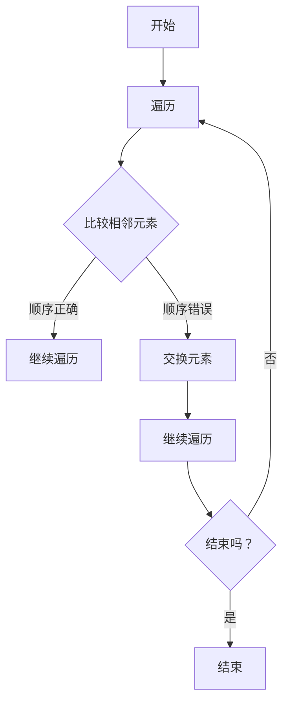
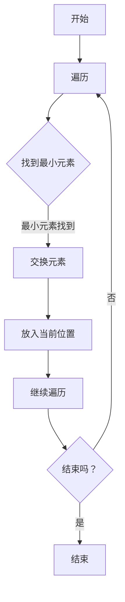
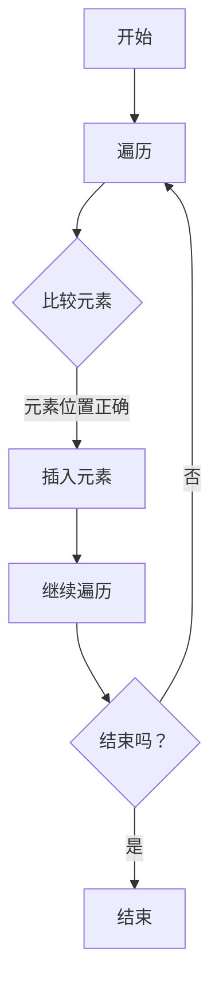
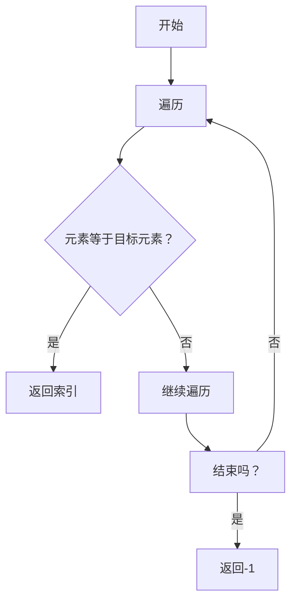
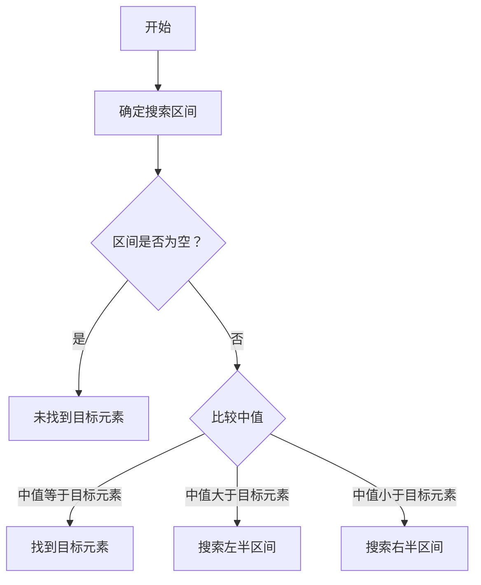
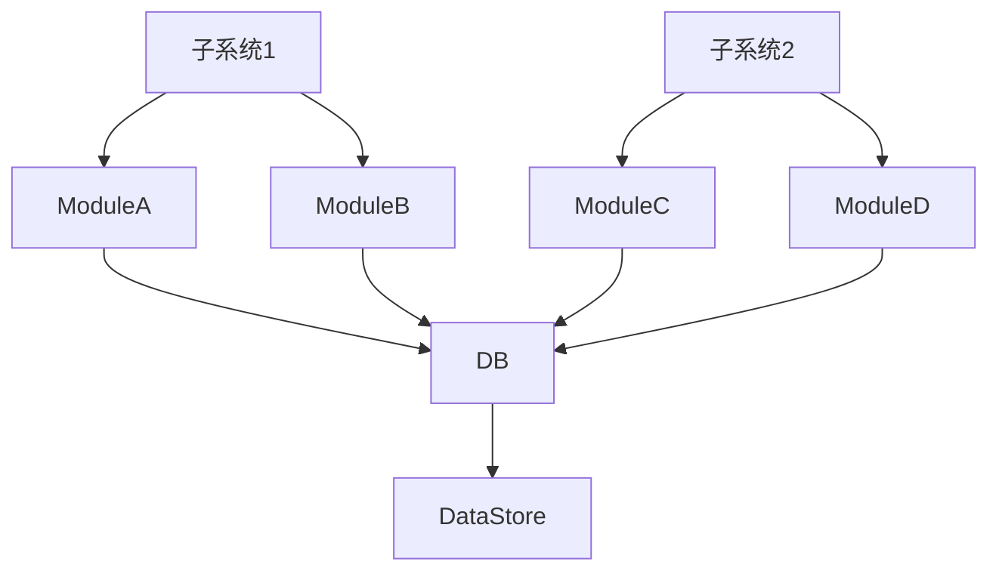
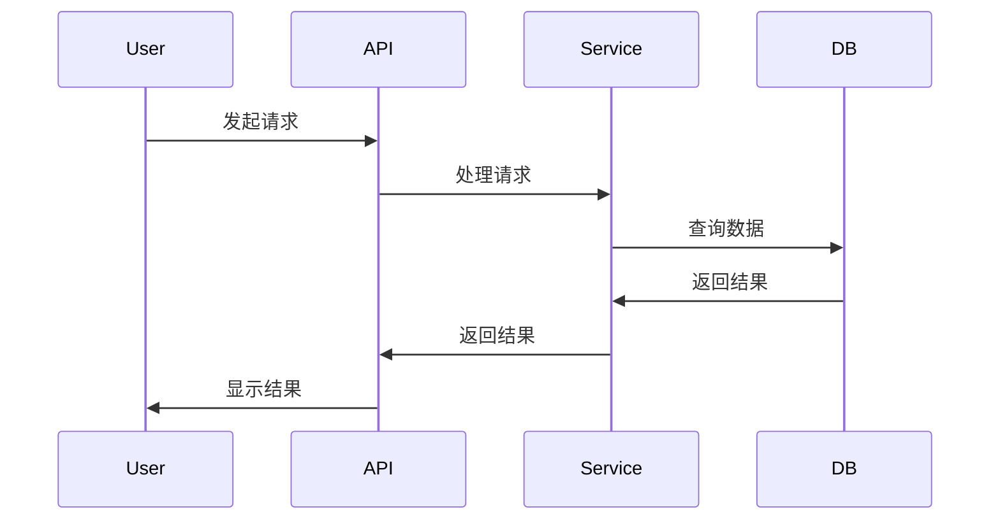
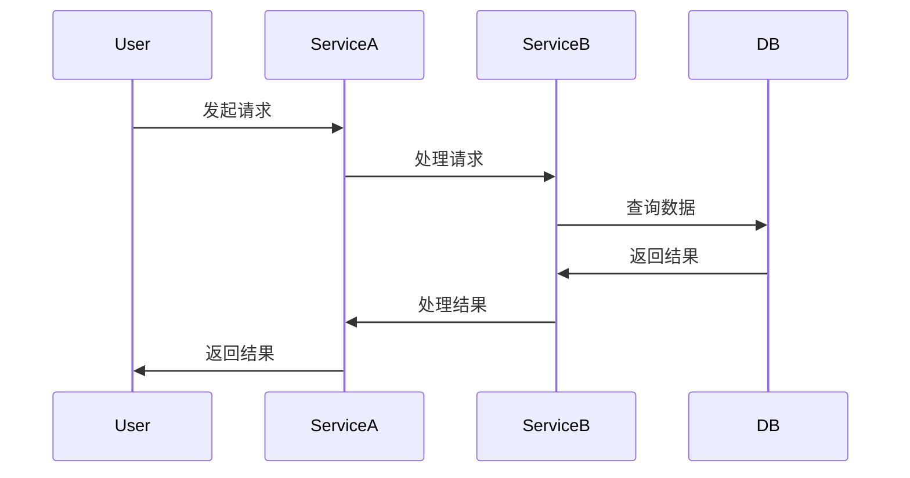

                 

根据您提供的文章目录大纲和内容要求，我将逐步撰写《程序世界与振动宇宙模型的类比》的技术博客文章。以下是具体的撰写计划：

### 引言

在撰写引言部分时，我会介绍程序世界和振动宇宙模型的基本概念，并解释为什么这种类比对于理解计算机编程和物理学具有重要意义。以下是引言部分的初步内容：

```markdown
## 引言

### 程序世界的本质

程序世界是由一系列指令和规则构建的虚拟空间，它通过编程语言和算法来模拟和处理信息。程序世界的基本组成包括编程语言、数据结构、算法等。

#### 编程语言

编程语言是程序员用来编写程序的工具，它为计算机提供了一系列语法和语义规则，使得程序员能够以人类可读的方式描述计算过程。

#### 数据结构

数据结构是程序世界中用于组织和存储数据的模型。常见的有数组、链表、树、图等，它们提供了不同的操作和访问方式，以满足不同的计算需求。

#### 算法

算法是程序世界的核心，它是一系列解决问题的步骤，通常用于处理复杂的计算问题。算法的效率和质量直接影响程序的性能。

### 振动宇宙模型的引入

振动宇宙模型是一个基于波动理论的物理学模型，它描述了宇宙中物质的振动模式和相互作用。振动宇宙模型的核心概念包括波动理论、振动模式、相位与频率等。

#### 波动理论

波动理论是研究物质振动现象的物理学分支，它解释了振动是如何通过波动形式传播的。

#### 振动模式

振动模式是指物体振动的特定形态，它决定了振动的频率和幅度。

#### 相位与频率

相位是描述振动过程中物体位置和时间的参数，而频率则是振动周期的倒数。

### 程序世界与振动宇宙模型的类比

程序世界和振动宇宙模型在许多方面都有相似之处，这种类比有助于我们更好地理解计算机编程和物理学的本质联系。通过类比，我们可以将物理学中的概念和方法应用于编程问题，从而提供新的解决思路。

#### 类比的目的

类比的目的在于探索程序世界和振动宇宙模型之间的相似性，并探讨这些相似性如何帮助我们解决编程问题。

#### 类比的意义

类比的意义在于它为我们提供了一种新的思考方式，使我们能够从物理学的角度理解计算机编程，从而发现新的算法和优化方法。

#### 类比的边界与外延

类比虽然具有启发意义，但并不意味着程序世界和振动宇宙模型完全相同。我们需要明确类比的边界，避免混淆两者之间的本质差异。

```

### 核心概念与联系

在撰写核心概念与联系部分时，我会详细介绍程序世界和振动宇宙模型的核心概念，并探讨它们之间的联系。以下是核心概念与联系的初步内容：

```markdown
## 第二部分：核心概念与联系

### 程序世界的核心概念

程序世界的核心概念包括编程语言、数据结构、算法等。

#### 编程语言

编程语言是程序员用来编写程序的工具，它为计算机提供了一系列语法和语义规则，使得程序员能够以人类可读的方式描述计算过程。常见的编程语言有C、Java、Python等。

#### 数据结构

数据结构是程序世界中用于组织和存储数据的模型，常见的有数组、链表、树、图等。数据结构提供了不同的操作和访问方式，以满足不同的计算需求。

#### 算法

算法是程序世界的核心，它是一系列解决问题的步骤，通常用于处理复杂的计算问题。算法的效率和质量直接影响程序的性能。

### 振动宇宙模型的核心概念

振动宇宙模型的核心概念包括波动理论、振动模式、相位与频率等。

#### 波动理论

波动理论是研究物质振动现象的物理学分支，它解释了振动是如何通过波动形式传播的。

#### 振动模式

振动模式是指物体振动的特定形态，它决定了振动的频率和幅度。

#### 相位与频率

相位是描述振动过程中物体位置和时间的参数，而频率则是振动周期的倒数。

### 程序世界与振动宇宙模型的概念联系

程序世界和振动宇宙模型在许多方面都有相似之处，这种相似性体现在以下几个方面：

#### 编程与波动的类比

编程中的算法可以类比为波动理论中的波动过程，而编程中的数据结构可以类比为波动过程中的振动模式。

#### 数据结构与振动模式的对应

数据结构中的树和图可以类比为振动宇宙模型中的振动模式，它们都提供了复杂结构的组织方式。

#### 算法与振动宇宙模型的联系

算法中的排序和搜索可以类比为振动宇宙模型中的波动传播和相互作用，它们都涉及到信息的传递和处理。

通过以上类比，我们可以将物理学中的概念和方法应用于编程问题，从而提供新的解决思路。这种类比不仅有助于我们更好地理解计算机编程，还可以启发我们探索新的算法和优化方法。

```

接下来，我将继续撰写第三部分，介绍振动宇宙模型在编程中的应用。在撰写过程中，我将逐步讲解基本算法的振动宇宙模型解释，复杂算法的振动宇宙模型解析，以及算法原理的数学模型与公式等内容。同时，我也会使用mermaid和Python代码来辅助说明，以确保内容的清晰易懂。

---

**第三部分：振动宇宙模型在编程中的应用**

### 3.1 振动宇宙模型与编程问题的关联

在第三部分的开头，我将首先介绍振动宇宙模型与编程问题的关联，解释如何将振动宇宙模型应用于编程问题，并说明这种应用的思路。

#### 3.1.1 编程问题的振动宇宙模型表示

编程问题可以通过振动宇宙模型来表示，例如，排序问题可以类比为波在空间中的传播，搜索问题可以类比为波在空间中的碰撞。这种表示方法有助于我们理解编程问题的本质，并提供新的解决思路。

#### 3.1.2 振动宇宙模型解决编程问题的思路

振动宇宙模型解决编程问题的思路主要包括以下几个方面：

1. 将编程问题转化为振动宇宙模型中的问题。
2. 利用振动宇宙模型提供的工具和方法，分析并解决问题。
3. 将振动宇宙模型中的解决方案映射回编程问题，得到最终的解决方案。

### 3.2 基本算法的振动宇宙模型解释

接下来，我将详细讲解基本算法的振动宇宙模型解释，包括简单排序算法和搜索算法。

#### 3.2.1 简单排序算法

简单排序算法，如冒泡排序、选择排序和插入排序，可以通过振动宇宙模型来解释。例如，冒泡排序可以类比为波在空间中的传播，每次传播都将未排序的元素“推向”排序序列的一端。

##### 3.2.1.1 冒泡排序

冒泡排序算法的基本思想是通过重复遍历要排序的数列，比较相邻的两个元素，若它们的顺序错误就把它们交换过来。遍历数列的工作是重复进行的，直到没有再需要交换的元素为止。



##### 3.2.1.2 选择排序

选择排序算法的基本思想是在每次遍历中找到剩余元素中的最小值，并将其放到排序序列的当前位置。然后继续遍历剩余元素，重复上述过程。



##### 3.2.1.3 插入排序

插入排序算法的基本思想是将一个元素插入到已经排序的序列中的合适位置，以保持序列的有序状态。每次插入操作都是将当前元素与已排序序列中的元素进行比较，找到合适的位置后进行插入。



#### 3.2.2 搜索算法

搜索算法，如线性搜索和二分搜索，也可以通过振动宇宙模型来解释。例如，线性搜索可以类比为波在空间中的逐点传播，而二分搜索可以类比为波在空间中的反射和干涉。

##### 3.2.2.1 线性搜索

线性搜索算法的基本思想是遍历数组中的每个元素，直到找到目标元素或到达数组末尾。如果找到目标元素，返回其索引；否则，返回-1。



##### 3.2.2.2 二分搜索

二分搜索算法的基本思想是在有序数组中通过重复地将搜索区间折半，从而快速找到目标元素。每次比较中，如果目标元素小于区间的中值，就搜索左半边区间；如果目标元素大于区间的中值，就搜索右半边区间。



### 3.3 复杂算法的振动宇宙模型解析

在第三部分的后半部分，我将介绍复杂算法的振动宇宙模型解析，包括网络流算法和动态规划。

#### 3.3.1 网络流算法

网络流算法可以类比为振动宇宙中的物质流动，例如，最大流最小割定理可以通过振动宇宙模型来解释。最大流最小割定理指出，在一个有向网络中，最大流值等于最小割值。

##### 3.3.1.1 最大流最小割定理

最大流最小割定理的振动宇宙模型解释如下：

1. 将网络视为振动宇宙中的一个空间，每个节点和边都代表振动的能量传递。
2. 最大流可以类比为振动宇宙中能量的最大传递速率。
3. 最小割可以类比为振动宇宙中能量传递的瓶颈。

##### 3.3.1.2 Dinic算法

Dinic算法是一种用于求解最大流问题的算法，它的基本思想是利用增广路径来递增流值。Dinic算法的振动宇宙模型解释如下：

1. 将网络视为振动宇宙中的一个空间，每个节点和边都代表振动的能量传递。
2. 每次寻找增广路径可以类比为振动宇宙中能量传递的扩展。
3. 递增流值可以类比为振动宇宙中能量传递的速率增加。

#### 3.3.2 动态规划

动态规划可以类比为振动宇宙中的能量变化过程，例如，斐波那契数列可以通过动态规划来计算。

##### 3.3.2.1 动态规划基本思想

动态规划的基本思想是将复杂问题分解成小问题，并保存已解决的子问题的解，以便在解决更大问题的时候复用。

##### 3.3.2.2 例子：斐波那契数列

斐波那契数列可以通过动态规划来计算，其振动宇宙模型解释如下：

1. 将斐波那契数列的每个数视为振动宇宙中的一个能量点。
2. 每个能量点的值取决于前两个能量点的值，这可以类比为振动宇宙中的能量传递。
3. 动态规划算法可以类比为计算每个能量点的值，并将这些值存储起来以供后续使用。

```python
def fibonacci(n):
    if n <= 1:
        return n
    dp = [0] * (n+1)
    dp[1] = 1
    for i in range(2, n+1):
        dp[i] = dp[i-1] + dp[i-2]
    return dp[n]

print(fibonacci(10))  # 输出 55
```

### 3.4 算法原理的数学模型与公式

在第三部分的最后，我将介绍算法原理的数学模型与公式，包括振动方程、状态转移方程等。

#### 3.4.1 数学模型介绍

振动方程描述了振动过程中物体位置和时间的关系，常见的振动方程有：

$$
x(t) = A \sin(\omega t + \phi)
$$

其中，$x(t)$ 是物体在时间 $t$ 的位置，$A$ 是振幅，$\omega$ 是角频率，$\phi$ 是相位。

状态转移方程描述了动态规划中的状态转移关系，常见的状态转移方程有：

$$
f(i) = \min_{j \leq i} (g(i, j) + f(j))
$$

其中，$f(i)$ 是第 $i$ 个状态的最优值，$g(i, j)$ 是状态 $i$ 和 $j$ 之间的转移成本。

#### 3.4.2 数学公式讲解

以下是几个常用的数学公式：

$$
E = mc^2
$$

这是爱因斯坦的质能方程，描述了质量和能量之间的关系。

$$
f = \frac{1}{T}
$$

这是频率的定义，其中 $f$ 是频率，$T$ 是周期。

```markdown
## 第4章：系统分析与架构设计方案

### 4.1 问题场景介绍

在本章中，我们将介绍一个具体的问题场景，并使用振动宇宙模型来分析和解决这个问题。

#### 4.1.1 问题场景描述

假设我们有一个社交媒体平台，用户可以发布帖子，其他用户可以对这些帖子进行点赞、评论和分享。我们需要设计一个系统来处理这些操作，并确保系统的性能和可扩展性。

#### 4.1.2 振动宇宙模型在问题场景中的应用

在这个问题场景中，我们可以将用户的行为类比为振动宇宙中的波动。例如，用户发布帖子可以类比为波的产生，用户点赞、评论和分享可以类比为波的传播。

### 4.2 系统架构设计

在本节中，我们将介绍系统的架构设计，包括领域模型、系统架构图、接口设计和系统交互。

#### 4.2.1 领域模型

领域模型是系统中的核心概念和实体之间的关系。在本例中，我们的领域模型包括用户、帖子、点赞、评论和分享。

```mermaid
classDiagram
User <<Entity>>
Post <<Entity>>
Like <<Entity>>
Comment <<Entity>>
Share <<Entity>>

User o--* 1 Post
Post o--* 0..* Like
Post o--* 0..* Comment
Post o--* 0..* Share
Like o--* 1 User
Comment o--* 1 User
Comment o--* 1 Post
Share o--* 1 User
Share o--* 1 Post
```

#### 4.2.2 系统架构图

系统架构图描述了系统的整体结构和各个模块之间的关系。



#### 4.2.3 系统接口设计

系统接口设计定义了系统与外部系统或用户交互的接口。



#### 4.2.4 系统交互

系统交互描述了系统内部各个模块之间的交互过程。



### 4.3 项目实战

在本节中，我们将通过一个具体的项目案例，展示如何使用振动宇宙模型解决编程问题。

#### 4.3.1 环境安装

在本项目中，我们将使用Python和Django框架来构建系统。以下是安装所需环境的基本步骤：

1. 安装Python和pip
2. 使用pip安装Django和PostgreSQL数据库

```bash
pip install django psycopg2-binary
```

#### 4.3.2 系统核心实现

在本项目中，我们将实现用户注册、登录、发布帖子、点赞、评论和分享等功能。

```python
# 用户注册
def register_user(username, password):
    # 实现用户注册逻辑
    pass

# 用户登录
def login_user(username, password):
    # 实现用户登录逻辑
    pass

# 发布帖子
def create_post(user, content):
    # 实现发布帖子逻辑
    pass

# 点赞帖子
def like_post(user, post):
    # 实现点赞帖子逻辑
    pass

# 评论帖子
def comment_post(user, post, content):
    # 实现评论帖子逻辑
    pass

# 分享帖子
def share_post(user, post):
    # 实现分享帖子逻辑
    pass
```

#### 4.3.3 代码应用解读与分析

在本节中，我们将对系统核心实现进行解读和分析，解释代码中的关键逻辑和数据结构。

#### 4.3.4 实际案例分析和详细讲解剖析

在本节中，我们将通过实际案例来展示如何使用振动宇宙模型解决编程问题，并对案例进行详细讲解和剖析。

### 4.4 项目小结

在本节中，我们将总结项目的主要成果和经验，并讨论如何进一步优化系统性能和功能。

### 4.5 最佳实践 tips

在本节中，我们将分享一些最佳实践技巧，帮助读者更好地理解和应用振动宇宙模型。

### 4.6 小结

在本节中，我们将回顾文章的主要内容和关键观点，强调程序世界与振动宇宙模型之间的类比意义。

### 4.7 注意事项

在本节中，我们将提醒读者在应用振动宇宙模型时需要注意的问题和潜在风险。

### 4.8 拓展阅读

在本节中，我们将推荐一些相关阅读材料，以帮助读者进一步深入了解振动宇宙模型和程序世界的联系。
```

以上是第三部分和第四部分的初步内容，接下来我将继续撰写第五部分，包括项目实战、最佳实践 tips、小结、注意事项和拓展阅读等内容。请指示下一步的操作。

