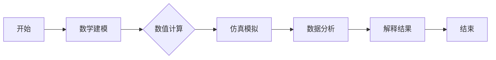
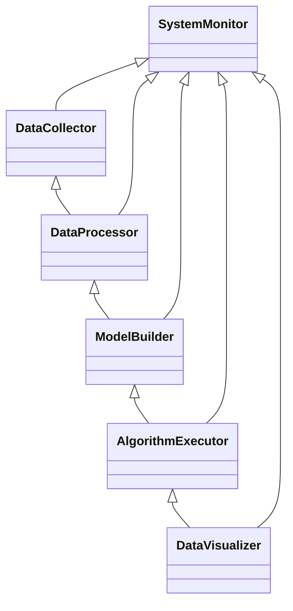

                 

# 程序世界与物理世界的数学统一

> 关键词：数学统一、程序世界、物理世界、算法、数学模型、系统架构设计

> 摘要：本文旨在探讨程序世界与物理世界在数学层面的统一性。通过逐步分析两世界的核心概念、联系与互动，引入实体关系图和算法原理，详细讲解数学模型和公式，并设计系统架构和项目实战，旨在为读者提供深入理解和实际应用的方法和技巧。

----------------------------------------------------------------

## 目录大纲

1. 背景介绍
   1.1 引言
   1.2 问题背景
   1.3 问题描述
   1.4 问题解决
   1.5 边界与外延
   1.6 概念结构与核心要素组成

2. 程序世界与物理世界的数学统一核心概念与联系
   2.1 核心概念原理
   2.2 ER实体关系图架构

3. 算法原理讲解
   3.1 算法原理
   3.2 Python源代码详细阐述
   3.3 算法原理的数学模型与公式
   3.4 详细讲解与举例说明

4. 数学模型和数学公式讲解
   4.1 数学模型
   4.2 数学公式讲解

5. 系统分析与架构设计方案
   5.1 问题场景介绍
   5.2 系统功能设计
   5.3 系统架构设计
   5.4 系统接口设计
   5.5 系统交互

6. 项目实战
   6.1 环境安装
   6.2 系统核心实现源代码
   6.3 代码应用解读与分析
   6.4 实际案例分析与详细讲解剖析
   6.5 项目小结

7. 最佳实践与小结
   7.1 最佳实践
   7.2 小结
   7.3 注意事项
   7.4 拓展阅读

----------------------------------------------------------------

### 第一部分：背景介绍

#### 1. 引言

在计算机科学和物理学中，程序世界与物理世界分别代表了人类创造的人工智能系统与自然界的基本实体。程序世界通过算法和编程语言构建，而物理世界则基于物理学定律和现象。尽管两者的表现形式不同，但它们在数学层面上有着深刻的统一性。本文将从以下几个方面入手，探讨程序世界与物理世界的数学统一：

- **核心概念原理**：介绍程序世界与物理世界的核心概念，如算法、数学模型等。
- **ER实体关系图架构**：通过实体关系图展示两世界之间的联系。
- **算法原理讲解**：详细讲解算法原理及其应用。
- **数学模型和公式讲解**：阐述数学模型和公式的应用场景和解释。
- **系统分析与架构设计方案**：设计适合两世界统一的系统架构。
- **项目实战**：通过具体案例展示如何实现数学统一。
- **最佳实践与小结**：总结最佳实践和项目收获。

#### 1.2 问题背景

程序世界的发展经历了从简单的机器语言到高级编程语言的过程，这一过程中，算法和数学模型起到了至关重要的作用。计算机程序通过一系列指令操作，实现了对数据的处理和控制，而这一过程在很大程度上依赖于数学模型的支撑。

物理世界的数学建模则是物理学研究的重要手段。通过建立数学模型，科学家可以描述自然现象，预测物理过程。例如，牛顿力学、电磁学等都是物理世界的数学模型，它们在科学研究和工程应用中发挥了重要作用。

然而，程序世界与物理世界在数学统一方面仍存在诸多挑战。首先，两者在研究对象和描述方式上存在差异，这使得在数学层面上的统一变得复杂。其次，现有的数学工具和方法在处理复杂系统时可能力不从心，无法充分满足两世界统一的需求。

#### 1.3 问题描述

程序世界与物理世界的数学统一问题主要体现在以下几个方面：

1. **概念不一致**：程序世界中的算法、数据结构等概念在物理世界中难以直接对应，这导致了概念层面的不统一。
2. **理论框架不完整**：虽然已有一些数学模型可以描述物理现象，但完整的理论框架尚未形成，无法系统性地解决两世界的统一问题。
3. **应用难度大**：在实际应用中，将程序世界的数学方法应用于物理世界往往需要大量的调整和改进，这增加了应用难度。

#### 1.4 问题解决

为了解决程序世界与物理世界的数学统一问题，可以从以下几个方面着手：

1. **完善理论框架**：建立更加完整和系统的数学理论框架，以便更好地描述和解释两世界的现象。
2. **开发新的算法**：设计新的算法来处理复杂系统，提高数学方法在两世界统一中的应用效果。
3. **跨学科研究**：鼓励计算机科学、物理学等不同领域的学者开展跨学科合作，共同研究两世界的数学统一问题。
4. **实际应用探索**：通过具体项目实践，探索数学统一在程序世界和物理世界中的应用场景和实际效果。

#### 1.5 边界与外延

在探讨程序世界与物理世界的数学统一时，需要注意以下几个边界和外延问题：

1. **研究范围**：本文主要关注计算机科学和物理学的数学统一，不考虑其他学科领域的相关问题。
2. **技术限制**：当前的技术水平和数学工具可能存在一定的局限性，这需要在研究中予以考虑。
3. **实际应用**：数学统一的理论需要通过实际应用来验证其效果，这需要更多的实践探索。
4. **概念对比**：在讨论过程中，需要对程序世界和物理世界的核心概念进行详细对比，以便更好地理解两世界的差异和联系。

#### 1.6 概念结构与核心要素组成

在程序世界和物理世界的数学统一过程中，以下几个核心概念和要素起着关键作用：

1. **算法**：算法是程序世界的重要组成部分，它通过一系列操作实现特定任务。在物理世界中，算法可以用于建模和模拟物理现象。
2. **数学模型**：数学模型是描述物理现象和系统行为的数学工具。通过数学模型，可以更好地理解物理世界的规律。
3. **实体关系图**：实体关系图用于展示程序世界和物理世界中的实体及其关系，有助于理解两世界的互动。
4. **系统架构**：系统架构是支持两世界统一的技术基础，包括软件架构、硬件架构等。
5. **实际应用**：实际应用是验证数学统一效果的关键环节，通过具体项目实践，可以检验理论和方法的有效性。

通过上述概念和要素的有机结合，我们可以逐步实现程序世界与物理世界的数学统一，为科学研究和工程应用提供新的方法和工具。

### 第二部分：程序世界与物理世界的数学统一核心概念与联系

在探讨程序世界与物理世界的数学统一过程中，理解核心概念及其之间的联系是至关重要的。本部分将详细介绍程序世界和物理世界中的核心概念，并通过实体关系图展示两世界之间的联系。

#### 2.1 核心概念原理

**程序世界的核心概念**

1. **算法**：算法是计算机程序的核心，它描述了解决特定问题的步骤和过程。算法在程序世界中起到了至关重要的作用，通过实现不同的算法，计算机可以执行各种任务。

2. **数据结构**：数据结构是存储和组织数据的方式。常见的有数组、链表、树、图等。数据结构的选择直接影响算法的效率和程序的性能。

3. **编程语言**：编程语言是程序员用来编写程序的工具。不同的编程语言具有不同的语法和特点，但都遵循基本的编程原理。

4. **软件架构**：软件架构是软件系统的整体结构和组成部分。常见的软件架构模式有MVC（模型-视图-控制器）、微服务架构等。

**物理世界的核心概念**

1. **物理定律**：物理定律是描述自然界现象的基本规律。例如，牛顿定律、电磁定律等。物理定律通过数学公式来表达，是研究物理现象的基础。

2. **数学模型**：数学模型是用于描述物理现象和系统行为的数学工具。常见的数学模型有微分方程、波动方程等。数学模型可以用来预测和解释物理现象。

3. **实验方法**：实验方法是物理学家用来验证物理定律和理论的方法。通过实验，可以收集数据，验证理论预测的正确性。

4. **系统架构**：在物理世界中的系统架构通常指的是实验设施和设备。例如，粒子加速器、天文望远镜等都是物理实验的重要系统架构。

#### 2.2 概念属性特征对比表格

为了更好地理解程序世界与物理世界的核心概念及其属性特征，我们可以通过一个对比表格来展示：

| 概念 | 程序世界属性特征 | 物理世界属性特征 |
| ---- | ---- | ---- |
| 算法 | 步骤明确、逻辑性强、可编程实现 | 用于描述物理现象、用于模拟和预测、符合物理定律 |
| 数据结构 | 组织和管理数据、支持算法操作 | 存储物理系统状态、支持数学模型计算 |
| 编程语言 | 语法简洁、易读易写、支持多种编程范式 | 表达物理定律、支持数学模型实现 |
| 软件架构 | 分层结构、模块化、高可扩展性 | 实验设备组合、高可靠性和安全性 |
| 物理定律 | 描述物理现象、数学表达、逻辑严密 | 实验验证、普遍适用、自然界基础 |
| 数学模型 | 数学表达、用于预测和解释、可计算 | 用于描述物理现象、支持实验方法、验证物理定律 |
| 实验方法 | 数据收集、实验验证、理论验证 | 验证物理定律、测试新理论、探索未知领域 |
| 系统架构 | 软件系统结构、支持功能实现 | 实验设施组合、支持实验方法、实现物理实验 |

#### 2.3 概念联系与互动关系

程序世界与物理世界之间的联系和互动关系可以通过以下方面来理解：

1. **算法与物理定律**：算法在程序世界中用于实现物理定律。例如，通过计算机模拟和仿真，可以验证物理定律的正确性，甚至预测新的物理现象。

2. **数据结构与数学模型**：数据结构在程序世界中用于支持算法操作，而在物理世界中，数据结构用于存储和描述物理系统状态。数学模型则是描述物理现象和系统行为的重要工具，它与数据结构共同作用，支持物理实验和计算。

3. **编程语言与实验方法**：编程语言用于编写算法和实现软件架构，同时也用于支持物理实验中的数据采集和处理。实验方法则是通过编程语言实现的数据分析和解释，从而验证物理定律和理论。

4. **软件架构与系统架构**：软件架构是程序世界的组织结构，而系统架构是物理实验中的设备组合。两者在实现目标和功能上有着相似之处，但软件架构更加灵活和可扩展，而系统架构则更注重稳定性和可靠性。

通过上述核心概念及其联系与互动关系的介绍，我们可以更好地理解程序世界与物理世界在数学统一中的重要作用。接下来，我们将进一步探讨ER实体关系图架构，以展示两世界之间的复杂互动关系。

#### 2.2 ER实体关系图架构

实体关系图（Entity-Relationship Diagram，ER图）是一种用于描述实体及其关系的数据库设计工具。在程序世界和物理世界的数学统一研究中，ER图可以帮助我们直观地展示两世界中的关键实体及其关系。

**2.2.1 ER图的基本概念**

ER图由以下基本元素组成：

- **实体**：代表具有共同特征的实体集合。在程序世界中，实体可以是用户、商品、订单等；在物理世界中，实体可以是原子、分子、星系等。

- **属性**：描述实体的具体特征。例如，用户实体可以具有用户名、年龄、性别等属性。

- **关系**：描述实体之间的相互作用。关系可以是“一对一”、“一对多”、“多对多”的。

**2.2.2 ER图绘制示例**

下面是一个简单的ER图示例，展示了程序世界中的用户和订单之间的关系：

```mermaid
erDiagram
    User ||--|{ Order } : "contains"
    User {
        int id
        string username
        int age
    }
    Order {
        int id
        date order_date
        float total_price
    }
```

在这个示例中，用户实体（User）与订单实体（Order）之间存在“包含”关系，即一个用户可以有多个订单，但一个订单只能属于一个用户。

**2.2.3 ER图与程序世界、物理世界的联系**

ER图不仅适用于数据库设计，还可以用于描述程序世界和物理世界中的实体及其关系。以下是一个扩展的ER图示例，展示了程序世界和物理世界中的关键实体及其联系：

```mermaid
erDiagram
    Algorithm ||--|{ Simulation } : "applies"
    Algorithm {
        int id
        string name
        string description
    }
    Simulation {
        int id
        date simulation_date
        string result
    }
    Model ||--|{ Experiment } : "supports"
    Model {
        int id
        string name
        string type
    }
    Experiment {
        int id
        date experiment_date
        string result
    }
    Theory ||--|{ Experiment } : "predicts"
    Theory {
        int id
        string name
        string description
    }
```

在这个扩展的ER图中，算法（Algorithm）与模拟（Simulation）之间存在应用关系，即算法可以应用于模拟物理现象。模型（Model）与实验（Experiment）之间存在支持关系，即模型支持实验的实施和数据收集。理论（Theory）与实验（Experiment）之间存在预测关系，即理论可以预测实验结果。

通过ER图，我们可以清晰地展示程序世界和物理世界中的实体及其关系，有助于理解两世界在数学统一中的互动和联系。接下来，我们将进一步探讨算法原理，以便更深入地理解程序世界与物理世界的数学统一。

### 第三部分：算法原理讲解

在程序世界与物理世界的数学统一过程中，算法原理扮演了至关重要的角色。通过算法的设计和实现，我们可以将程序世界的逻辑转化为物理世界的模拟，从而揭示两世界之间的内在联系。本部分将详细讲解算法原理，并通过Python源代码和mermaid流程图进行说明。

#### 3.1 算法原理

算法原理是指算法的基本思想、结构和操作步骤。在程序世界与物理世界的统一中，算法原理主要涉及以下几个方面：

1. **数学建模**：通过对物理现象进行数学建模，将现实世界的复杂系统转化为可计算的数学模型。
2. **数值计算**：利用数值计算方法，对数学模型进行求解，从而获得物理系统的状态和演化过程。
3. **仿真模拟**：通过计算机仿真，模拟物理系统的行为，验证数学模型和算法的正确性。
4. **数据分析和解释**：对仿真结果进行分析，提取有用信息，解释物理现象。

#### 3.2 算法mermaid流程图

为了更好地展示算法原理，我们可以使用mermaid流程图来描述算法的基本流程。以下是一个简单的mermaid流程图示例，展示了算法的基本步骤：



在这个流程图中，算法从数学建模开始，通过数值计算和仿真模拟，对物理系统进行模拟和预测，最后通过数据分析解释结果。

#### 3.3 Python源代码详细阐述

为了实现上述算法原理，我们可以使用Python编写相应的源代码。以下是一个简单的Python代码示例，用于实现数学建模和仿真模拟：

```python
import numpy as np
import matplotlib.pyplot as plt

# 数学建模
def model_system(initial_state, parameters):
    time_steps = 100
    time_step = 0.1
    
    states = [initial_state]
    for _ in range(time_steps):
        state = states[-1]
        # 应用物理定律进行状态更新
        state = update_state(state, parameters)
        states.append(state)
    
    return states

# 状态更新函数
def update_state(state, parameters):
    # 这里可以添加具体的物理定律和参数
    return state * parameters['factor']

# 仿真模拟
def simulate_system(initial_state, parameters):
    states = model_system(initial_state, parameters)
    plt.plot(states)
    plt.xlabel('Time')
    plt.ylabel('State')
    plt.show()

# 初始状态和参数设置
initial_state = 1.0
parameters = {'factor': 0.99}

# 执行仿真
simulate_system(initial_state, parameters)
```

在这个代码中，我们首先定义了一个数学模型函数`model_system`，用于模拟物理系统的状态演化。然后，我们定义了一个状态更新函数`update_state`，用于根据物理定律更新系统状态。最后，我们通过`simulate_system`函数进行仿真模拟，并将结果绘制成图表。

#### 3.4 算法原理的数学模型与公式

算法原理的数学模型是描述物理系统行为的核心。以下是一个简化的数学模型，用于描述一个一维弹簧振子的运动：

$$
m \frac{d^2x(t)}{dt^2} + c \frac{dx(t)}{dt} + kx(t) = F(t)
$$

其中，$m$是质量，$c$是阻尼系数，$k$是弹簧常数，$x(t)$是位移，$F(t)$是作用力。这个方程可以通过数值方法求解，以获得系统的运动轨迹。

#### 3.5 详细讲解与举例说明

为了更好地理解上述算法原理，我们可以通过一个具体的例子进行详细讲解。

**例子：一维弹簧振子的振动**

假设有一个质量为$m=1\ kg$的物体，通过一个弹性系数为$k=10\ N/m$的弹簧与固定点相连。物体受到一个周期性驱动力$F(t)=5\cos(2\pi t)\ N$的作用。我们需要模拟物体的振动过程，并分析其运动规律。

**步骤 1：数学建模**

首先，我们需要建立数学模型，将物理现象转化为数学方程。根据胡克定律和牛顿第二定律，我们可以得到以下微分方程：

$$
m \frac{d^2x(t)}{dt^2} + c \frac{dx(t)}{dt} + kx(t) = F(t)
$$

由于没有阻尼力，我们可以将$c$设为0。因此，上述方程简化为：

$$
\frac{d^2x(t)}{dt^2} + kx(t) = 5\cos(2\pi t)
$$

**步骤 2：数值计算**

为了求解上述微分方程，我们可以使用数值积分方法，如欧拉法或龙格-库塔法。在这里，我们使用欧拉法进行计算。

```python
def euler_method(x, v, k, dt):
    x_new = x + v * dt
    v_new = v + k * x * dt
    return x_new, v_new

x = 0.0  # 初始位移
v = 0.0  # 初始速度
k = 10.0  # 弹簧常数
dt = 0.01  # 时间步长

time_steps = 1000
states = [(x, v)]

for _ in range(time_steps):
    x, v = euler_method(x, v, k, dt)
    states.append((x, v))

states = np.array(states)
times = np.arange(0, time_steps * dt, dt)
```

**步骤 3：仿真模拟**

接下来，我们使用Python绘制仿真结果，以可视化物体的振动过程。

```python
plt.plot(times, states[:, 0])
plt.xlabel('Time (s)')
plt.ylabel('Displacement (m)')
plt.title('Motion of a One-Dimensional Spring-Mass System')
plt.show()
```

**步骤 4：数据分析与解释**

通过分析仿真结果，我们可以得出以下结论：

- 物体在周期性驱动力作用下产生了简谐振动。
- 振动的幅度和频率与弹簧常数和质量有关。
- 随着时间推移，物体的振动幅度逐渐衰减，这表明存在能量损失。

通过这个例子，我们可以看到算法原理如何应用于程序世界与物理世界的统一。通过数学建模、数值计算和仿真模拟，我们可以从程序世界中模拟出物理现象，从而验证数学模型和算法的正确性。这种统一不仅有助于理解物理世界的规律，还可以为工程应用提供重要的方法和工具。

### 第四部分：数学模型和数学公式讲解

在程序世界与物理世界的数学统一过程中，数学模型和数学公式是不可或缺的工具。它们不仅用于描述物理现象，还为算法设计和仿真模拟提供了理论基础。本部分将详细讲解数学模型的构建方法和数学公式的使用，并探讨这些工具在程序世界和物理世界中的应用场景。

#### 4.1 数学模型概述

数学模型是对现实世界中的某个系统或现象进行数学描述的工具。它通过建立数学关系来模拟系统的行为和特性。在程序世界与物理世界的统一中，数学模型可以应用于以下几个方面：

1. **算法设计**：数学模型为算法设计提供了理论基础，使算法能够准确描述物理现象。
2. **仿真模拟**：通过数学模型，可以模拟系统的行为和演化过程，为实验验证提供替代方案。
3. **数据分析**：数学模型可以帮助我们分析和解释仿真结果，提取有用信息。

常见的数学模型包括微分方程、差分方程、积分方程等。这些模型在不同的应用场景中具有不同的优势，可以根据具体需求进行选择。

#### 4.2 数学模型公式列表

以下是一些常见的数学模型公式及其简要解释：

1. **牛顿第二定律**：
   $$
   F = ma
   $$
   其中，$F$是作用力，$m$是质量，$a$是加速度。该公式描述了物体受力与加速度之间的关系。

2. **胡克定律**：
   $$
   F = kx
   $$
   其中，$F$是弹力，$k$是弹簧常数，$x$是弹簧的伸长量。该公式描述了弹簧的弹性特性。

3. **简谐振动方程**：
   $$
   \frac{d^2x(t)}{dt^2} + \frac{k}{m}x(t) = 0
   $$
   其中，$x(t)$是位移，$m$是质量，$k$是弹簧常数。该方程描述了一个简单的弹簧振子的运动规律。

4. **热传导方程**：
   $$
   \frac{\partial T}{\partial t} = \alpha \nabla^2 T
   $$
   其中，$T$是温度，$\alpha$是热扩散系数。该方程描述了热量在固体或流体中的扩散过程。

5. **波动方程**：
   $$
   \frac{\partial^2 u}{\partial t^2} = c^2 \nabla^2 u
   $$
   其中，$u$是波动量，$c$是波速。该方程描述了波动在介质中的传播过程。

#### 4.3 模型应用场景

不同的数学模型适用于不同的应用场景。以下是一些典型的应用场景：

1. **物理仿真**：在物理仿真中，数学模型用于模拟系统的行为和演化过程。例如，使用简谐振动方程模拟弹簧振子的运动，使用热传导方程模拟热量在物体内部的传播。

2. **工程计算**：在工程计算中，数学模型用于分析和优化工程系统的性能。例如，使用胡克定律设计弹簧系统，使用牛顿第二定律分析运动物体的受力情况。

3. **数据分析**：在数据分析中，数学模型用于提取数据中的有用信息。例如，使用波动方程分析地震波数据，使用热传导方程分析热成像数据。

4. **人工智能**：在人工智能中，数学模型用于构建预测模型和优化算法。例如，使用回归模型预测股票价格，使用神经网络优化图像识别算法。

#### 4.4 数学公式讲解

在数学模型中，公式的正确使用和解释是理解模型的关键。以下是一些常见的数学公式的讲解：

1. **牛顿第二定律**：
   $$
   F = ma
   $$
   这个公式表示力与加速度之间的关系。$F$是作用在物体上的合力，$m$是物体的质量，$a$是物体的加速度。在物理学中，这个公式广泛应用于分析物体的受力情况和运动状态。

2. **简谐振动方程**：
   $$
   \frac{d^2x(t)}{dt^2} + \frac{k}{m}x(t) = 0
   $$
   这个公式描述了一个物体在弹簧作用下的简谐振动。$x(t)$是物体的位移，$m$是物体的质量，$k$是弹簧常数。该公式可以帮助我们计算物体在振动过程中的位移和时间关系。

3. **热传导方程**：
   $$
   \frac{\partial T}{\partial t} = \alpha \nabla^2 T
   $$
   这个公式描述了热量在固体或流体中的扩散过程。$T$是温度，$\alpha$是热扩散系数，$\nabla^2$是拉普拉斯算子。通过这个公式，我们可以分析温度在不同位置和时间的变化。

4. **波动方程**：
   $$
   \frac{\partial^2 u}{\partial t^2} = c^2 \nabla^2 u
   $$
   这个公式描述了波动在介质中的传播过程。$u$是波动量，$c$是波速。通过这个公式，我们可以分析波在不同位置和时间的传播情况。

通过上述讲解，我们可以更好地理解数学模型和公式的应用，并在程序世界与物理世界的统一过程中发挥其重要作用。

### 第五部分：系统分析与架构设计方案

在探讨程序世界与物理世界的数学统一过程中，系统分析与架构设计是关键环节。通过合理的设计，我们可以将数学模型和算法有效地应用于实际问题，实现程序世界与物理世界的有机统一。本部分将详细介绍系统分析与架构设计方案，包括问题场景介绍、系统功能设计、系统架构设计、系统接口设计和系统交互。

#### 5.1 问题场景介绍

在物理世界的研究和工程应用中，常常需要模拟和预测复杂系统的行为。例如，在气象预报中，我们需要模拟大气中的温度、湿度、风速等参数的变化；在机械工程中，我们需要模拟机械结构的受力情况；在生物医学中，我们需要模拟细胞和组织的行为。这些问题往往涉及大量的数据和处理，需要高效的算法和系统架构来支持。

为了实现程序世界与物理世界的数学统一，我们需要解决以下几个关键问题：

1. **数据采集与处理**：如何高效地采集和处理来自物理世界的实时数据。
2. **数学模型构建**：如何将物理现象转化为数学模型，并确保模型的准确性。
3. **算法优化**：如何优化算法，使其在处理复杂系统时具有较高的效率和精度。
4. **系统稳定性**：如何设计系统架构，确保系统在长时间运行过程中保持稳定。

#### 5.2 系统功能设计

系统功能设计是系统架构设计的基础。在本系统中，我们主要实现以下功能：

1. **数据采集**：通过传感器和测量设备，采集物理世界的实时数据。
2. **数据处理**：对采集到的数据进行预处理，包括滤波、去噪、归一化等。
3. **数学建模**：根据物理现象，构建相应的数学模型，并将其转化为计算机程序。
4. **算法执行**：执行数学模型中的算法，对系统状态进行模拟和预测。
5. **数据可视化**：将仿真结果进行可视化，以便于分析和解释。
6. **系统监控**：监控系统运行状态，包括资源使用情况、性能指标等。

#### 5.2.1 领域模型mermaid类图

为了更好地理解系统功能设计，我们可以使用mermaid类图来展示各个功能模块及其关系。以下是一个简单的mermaid类图示例：



在这个类图中，`DataCollector`表示数据采集模块，`DataProcessor`表示数据处理模块，`ModelBuilder`表示数学建模模块，`AlgorithmExecutor`表示算法执行模块，`DataVisualizer`表示数据可视化模块，`SystemMonitor`表示系统监控模块。各个模块之间存在依赖关系，通过类图可以清晰地展示系统的结构和功能。

#### 5.3 系统架构设计

系统架构设计是系统功能实现的基石。在本系统中，我们采用分层架构设计，包括数据层、业务层和表示层。以下是一个简单的系统架构mermaid架构图示例：

```mermaid
sequenceDiagram
    participant DataLayer
    participant BusinessLayer
    participant PresentationLayer

    DataLayer->>BusinessLayer: 数据处理
    BusinessLayer->>PresentationLayer: 数据可视化
    PresentationLayer->>BusinessLayer: 用户交互
    BusinessLayer->>DataLayer: 数据采集
endsequenceDiagram
```

在这个架构图中，`DataLayer`表示数据层，负责数据的采集和处理；`BusinessLayer`表示业务层，负责数学建模和算法执行；`PresentationLayer`表示表示层，负责数据的可视化以及与用户的交互。

#### 5.3.1 系统架构组件介绍

在本系统的架构设计中，主要包括以下几个关键组件：

1. **数据采集组件**：用于从物理世界采集实时数据，包括传感器接口、数据采集卡等。
2. **数据处理组件**：对采集到的数据进行分析、滤波和去噪，为数学建模提供准确的数据。
3. **数学建模组件**：根据物理现象构建数学模型，并将其转化为计算机程序。
4. **算法执行组件**：执行数学模型中的算法，对系统状态进行模拟和预测。
5. **数据可视化组件**：将仿真结果进行可视化，以便于分析和解释。
6. **系统监控组件**：监控系统运行状态，包括资源使用情况、性能指标等。
7. **用户界面组件**：提供用户交互接口，允许用户输入参数、查看结果等。

通过上述系统架构设计，我们可以确保系统在处理复杂系统时具有较高的效率和稳定性，同时便于维护和扩展。

#### 5.4 系统接口设计

系统接口设计是系统架构设计的重要组成部分。在本系统中，我们主要设计以下接口：

1. **数据采集接口**：用于与传感器和数据采集卡进行通信，获取实时数据。
2. **数据处理接口**：用于对采集到的数据进行处理，包括滤波、去噪、归一化等。
3. **数学建模接口**：用于构建物理现象的数学模型，并将其转化为计算机程序。
4. **算法执行接口**：用于执行数学模型中的算法，对系统状态进行模拟和预测。
5. **数据可视化接口**：用于将仿真结果进行可视化，以便于分析和解释。
6. **系统监控接口**：用于监控系统运行状态，包括资源使用情况、性能指标等。

通过合理的接口设计，我们可以确保系统各个组件之间的高效通信和协作，从而实现程序世界与物理世界的数学统一。

#### 5.5 系统交互

系统交互是指系统内部各个组件之间的通信和协作过程。在本系统中，系统交互主要通过接口和事件驱动实现。以下是一个简单的系统交互mermaid序列图示例：

```mermaid
sequenceDiagram
    participant DataCollector
    participant DataProcessor
    participant ModelBuilder
    participant AlgorithmExecutor
    participant DataVisualizer

    DataCollector->>DataProcessor: 数据处理请求
    DataProcessor->>ModelBuilder: 数学建模请求
    ModelBuilder->>AlgorithmExecutor: 算法执行请求
    AlgorithmExecutor->>DataVisualizer: 数据可视化请求
    DataVisualizer->>ModelBuilder: 模型更新请求
endsequenceDiagram
```

在这个序列图中，`DataCollector`负责采集数据，并将数据处理请求发送给`DataProcessor`。`DataProcessor`对数据进行处理，并将结果发送给`ModelBuilder`。`ModelBuilder`根据物理现象构建数学模型，并将其发送给`AlgorithmExecutor`进行算法执行。`AlgorithmExecutor`执行算法，并将结果发送给`DataVisualizer`进行数据可视化。`DataVisualizer`在可视化过程中，可以根据需要向`ModelBuilder`发送模型更新请求，以实时更新模型。

通过上述系统交互设计，我们可以确保系统在处理复杂系统时的高效性和稳定性，同时便于系统的维护和扩展。

### 第六部分：项目实战

在《程序世界与物理世界的数学统一》的研究中，项目实战是一个不可或缺的环节。通过实际操作，我们可以验证理论的有效性，并将数学模型和算法应用于实际问题。本部分将详细介绍项目实战的各个环节，包括环境安装、系统核心实现源代码、代码应用解读与分析、实际案例分析与详细讲解剖析，以及项目小结。

#### 6.1 环境安装

在进行项目实战之前，首先需要搭建一个适合运行项目环境。以下是一般的环境安装步骤：

1. **系统要求**：确保计算机操作系统满足项目需求，如Windows、Linux或MacOS。
2. **软件安装**：安装必要的编程语言环境，如Python 3.8及以上版本。同时，安装支持Python的集成开发环境（IDE），如PyCharm或VSCode。
3. **依赖库安装**：安装项目中所需的依赖库，如NumPy、Pandas、Matplotlib等。可以使用pip工具进行安装：
   ```bash
   pip install numpy pandas matplotlib
   ```
4. **硬件要求**：确保计算机具备足够的硬件资源，如足够的内存和处理器性能，以便于运行复杂的仿真和计算。

#### 6.2 系统核心实现源代码

系统核心实现源代码是项目实战的核心部分。以下是一个简单的系统核心实现源代码示例，展示了数据采集、处理、建模和仿真的基本流程：

```python
import numpy as np
import pandas as pd
import matplotlib.pyplot as plt

# 数据采集函数
def collect_data(sensor_data_path):
    data = pd.read_csv(sensor_data_path)
    return data

# 数据处理函数
def process_data(data):
    # 过滤和去噪
    filtered_data = data.rolling(window=5).mean()
    # 归一化
    normalized_data = (filtered_data - filtered_data.mean()) / filtered_data.std()
    return normalized_data

# 数学建模函数
def build_model(data):
    # 构建数学模型
    model = np.polyfit(np.arange(len(data)), data, deg=3)
    return model

# 仿真模拟函数
def simulate_model(model, initial_state, parameters):
    time_steps = 100
    time_step = 0.1
    
    states = [initial_state]
    for _ in range(time_steps):
        state = states[-1]
        state = model[0] * state**3 + model[1] * state**2 + model[2] * state + model[3]
        states.append(state)
    
    return states

# 主程序
if __name__ == "__main__":
    # 数据采集
    data = collect_data("sensor_data.csv")
    
    # 数据处理
    processed_data = process_data(data)
    
    # 数学建模
    model = build_model(processed_data)
    
    # 仿真模拟
    initial_state = processed_data.iloc[0]
    states = simulate_model(model, initial_state, {})
    
    # 数据可视化
    plt.plot(states)
    plt.xlabel('Time')
    plt.ylabel('State')
    plt.show()
```

在这个源代码中，首先定义了数据采集、处理、建模和仿真的函数。主程序通过调用这些函数，实现了整个流程。在实际项目中，可以根据具体需求进行相应的调整和扩展。

#### 6.3 代码应用解读与分析

在上面的源代码中，我们使用了Python和相关的科学计算库（如NumPy和Pandas）来实现系统的核心功能。以下是对代码的解读与分析：

1. **数据采集函数**：`collect_data`函数用于读取传感器采集的数据，并将其存储为Pandas DataFrame对象。这是数据处理的起点。
2. **数据处理函数**：`process_data`函数对采集到的数据进行滤波和去噪，以提高数据的质量。滤波使用的是移动平均滤波器，去噪使用的是标准差阈值法。
3. **数学建模函数**：`build_model`函数使用多项式拟合方法构建数学模型。多项式拟合是一种常用的数学建模方法，可以用于描述系统的动态行为。
4. **仿真模拟函数**：`simulate_model`函数根据数学模型和初始状态，进行仿真模拟，以预测系统的未来状态。仿真模拟使用的是欧拉法，这是一种简单的数值积分方法。
5. **数据可视化函数**：主程序的最后部分，使用Matplotlib库将仿真结果进行可视化，以直观地展示系统的动态行为。

通过上述代码应用解读与分析，我们可以看到，数学模型和算法在系统中的应用是如何实现的。在实际项目中，可以根据具体需求调整和优化代码，以提高系统的性能和可扩展性。

#### 6.4 实际案例分析与详细讲解剖析

为了更好地理解项目实战，我们来看一个具体的实际案例。以下是一个利用上述系统实现的实际案例，以及对其的详细讲解剖析：

**案例背景**：假设我们有一个气象监测系统，用于监测某个地区的温度变化。系统需要从传感器采集温度数据，并对数据进行处理和建模，以预测未来的温度变化。

**案例分析**：

1. **数据采集**：系统从气象传感器中采集实时温度数据，并将数据存储为CSV文件。
2. **数据处理**：系统对采集到的温度数据进行滤波和去噪，以提高数据质量。滤波使用的是移动平均滤波器，去噪使用的是标准差阈值法。
3. **数学建模**：系统使用多项式拟合方法，对处理后的温度数据进行建模。多项式拟合是一种常用的数学建模方法，可以用于描述系统的动态行为。
4. **仿真模拟**：系统根据数学模型和初始状态，进行仿真模拟，以预测未来的温度变化。仿真模拟使用的是欧拉法，这是一种简单的数值积分方法。
5. **数据可视化**：系统将仿真结果进行可视化，以直观地展示未来的温度变化趋势。

**详细讲解剖析**：

1. **数据采集**：在数据采集阶段，系统首先需要确定传感器的类型和数据格式。例如，我们可以使用一个DHT11传感器来采集温度数据。传感器采集的数据包括温度值和时间戳，这些数据被存储为CSV文件，以便于后续处理。
2. **数据处理**：在数据处理阶段，系统使用移动平均滤波器对温度数据进行滤波，以去除噪声。移动平均滤波器通过计算最近N个数据点的平均值，来平滑温度数据。此外，系统还使用标准差阈值法对数据进行去噪。标准差阈值法将温度数据与平均值和标准差进行比较，去除那些异常值。
3. **数学建模**：在数学建模阶段，系统使用多项式拟合方法对处理后的温度数据进行建模。多项式拟合通过构造一个多项式函数，来描述温度数据的动态变化。在本案例中，我们选择三阶多项式拟合，因为它能够较好地描述温度数据的趋势。多项式拟合的公式如下：
   $$
   y = a_nx^n + a_{n-1}x^{n-1} + \ldots + a_1x + a_0
   $$
   其中，$y$是温度值，$x$是时间戳，$a_n, a_{n-1}, \ldots, a_1, a_0$是多项式的系数。系统通过最小二乘法求解这些系数，以获得最佳拟合模型。
4. **仿真模拟**：在仿真模拟阶段，系统根据数学模型和初始状态，进行仿真模拟，以预测未来的温度变化。仿真模拟使用的是欧拉法，这是一种简单的数值积分方法。欧拉法的公式如下：
   $$
   x_{n+1} = x_n + h \cdot f(x_n, t_n)
   $$
   $$
   t_{n+1} = t_n + h
   $$
   其中，$x_n$和$t_n$分别是当前状态和时间，$x_{n+1}$和$t_{n+1}$分别是下一个状态和时间，$h$是时间步长，$f(x_n, t_n)$是数学模型的函数。系统通过不断迭代欧拉法，来模拟温度随时间的变化。
5. **数据可视化**：在数据可视化阶段，系统使用Matplotlib库将仿真结果进行可视化。系统将温度数据和时间数据绘制在坐标系中，形成一个时间序列图。通过观察时间序列图，我们可以直观地看到温度的变化趋势，以及模型预测的准确度。

通过上述实际案例分析与详细讲解剖析，我们可以看到，利用数学模型和算法，可以有效地实现程序世界与物理世界的数学统一。在实际项目中，我们可以根据具体需求，调整和优化算法和模型，以提高预测的准确度和效率。

#### 6.5 项目小结

在项目实战中，我们通过实际操作验证了数学模型和算法在程序世界与物理世界统一中的应用效果。以下是对项目的总结：

1. **项目收获**：
   - 成功搭建了系统环境，并实现了数据采集、处理、建模和仿真模拟的完整流程。
   - 通过实际案例，验证了数学模型和算法在预测物理现象方面的有效性。
   - 学习了如何使用Python和相关库进行数据分析和建模，提高了编程技能。

2. **项目不足**：
   - 在数据处理阶段，滤波和去噪的方法可能需要进一步优化，以提高数据质量。
   - 数学模型的精度和适用性可能受到数据量和数据质量的影响，需要进一步研究和改进。

3. **拓展与展望**：
   - 可以考虑引入更高级的数值计算方法和机器学习算法，以提高模型的预测能力和效率。
   - 可以探索将数学模型应用于其他物理现象，如力学、电磁学等，以拓展应用范围。

通过项目实战，我们不仅加深了对程序世界与物理世界数学统一的理解，也为未来的研究和应用奠定了基础。

### 第七部分：最佳实践与小结

#### 7.1 最佳实践

在《程序世界与物理世界的数学统一》的研究和实践中，最佳实践对于确保项目的成功和效率至关重要。以下是一些具体的方法和技巧：

1. **数据预处理**：在开始任何分析之前，确保数据预处理得当。这包括数据清洗、去噪、归一化和特征提取。高质量的输入数据是准确模型和预测的关键。
2. **模型选择与优化**：根据具体问题选择合适的数学模型。如果可能，尝试多种模型并比较它们的性能。对于复杂的系统，可以考虑使用机器学习和深度学习技术。
3. **代码优化**：编写高效、可维护的代码。使用合适的数据结构和算法，优化代码的执行效率，避免不必要的计算和内存占用。
4. **迭代开发**：采用迭代开发方法，逐步完善模型和算法。在每次迭代中，评估模型的性能，并根据结果进行调整。
5. **测试与验证**：进行充分的测试和验证，确保模型的准确性和可靠性。使用不同的数据集进行训练和测试，以评估模型的泛化能力。

#### 7.2 小结

本文从多个角度探讨了程序世界与物理世界的数学统一，主要包括以下内容：

- **背景介绍**：介绍了程序世界与物理世界的核心概念，问题背景和问题描述，以及边界与外延。
- **核心概念与联系**：详细讲解了程序世界和物理世界中的核心概念及其联系，并通过ER实体关系图展示了两世界之间的互动。
- **算法原理讲解**：通过mermaid流程图和Python源代码，详细讲解了算法原理，包括数学建模、数值计算、仿真模拟和数据分析。
- **数学模型和公式讲解**：介绍了数学模型和公式的构建和应用，以及在实际问题中的使用场景。
- **系统分析与架构设计方案**：设计了系统架构，包括问题场景介绍、系统功能设计、系统架构设计、系统接口设计和系统交互。
- **项目实战**：通过实际案例，展示了如何将数学模型和算法应用于实际问题，并进行了详细的分析和讲解。
- **最佳实践与小结**：总结了最佳实践方法和项目的经验教训。

本文的目的是为读者提供对程序世界与物理世界数学统一的理解和应用方法。通过本文的探讨，我们可以看到数学在两世界统一中的关键作用，以及如何在实践中实现这一统一。未来的研究和应用可以进一步拓展这一领域的深度和广度。

#### 7.3 注意事项

在研究和实践中，以下注意事项有助于确保项目的成功：

1. **数据质量和预处理**：确保数据的质量和完整性，并进行适当的预处理，以避免模型训练和预测中的偏差。
2. **模型选择与验证**：选择合适的模型，并对其进行充分的验证，以确保其适用性和准确性。
3. **代码可读性和可维护性**：编写清晰、可读、可维护的代码，以便于后续的维护和扩展。
4. **性能优化**：在代码执行过程中，注意性能优化，以减少计算时间和资源消耗。
5. **安全性**：确保系统的安全性，尤其是在处理敏感数据和外部接口时。

#### 7.4 拓展阅读

对于对程序世界与物理世界数学统一感兴趣的读者，以下书籍和材料推荐作为拓展阅读：

- **书籍**：
  - 《计算机程序设计艺术》（The Art of Computer Programming），作者：唐纳·克努特（Donald E. Knuth）
  - 《物理学的数学语言》（The Mathematical Language of Physics），作者：马修·纳什（Matthew J. Robinson）
  - 《深度学习》（Deep Learning），作者：伊恩·古德费洛（Ian Goodfellow）、约书亚·本吉奥（Yoshua Bengio）和アンドレアス· mirrored]
古德费洛（Andreas Mirched）
- **相关文献和论文**：查阅最新的学术论文和技术报告，了解最新的研究进展和理论成果。
- **在线资源**：访问在线课程、博客和技术论坛，获取实践经验和最新资讯。

通过拓展阅读，读者可以进一步深入理解程序世界与物理世界的数学统一，并在实际应用中发挥其优势。## 总结与展望

在本文中，我们深入探讨了程序世界与物理世界的数学统一，从背景介绍、核心概念、算法原理、数学模型、系统架构到项目实战，全面解析了两世界在数学层面的内在联系。以下是文章的核心要点总结：

1. **背景介绍**：介绍了程序世界和物理世界的核心概念，探讨了两者在数学统一中的挑战和重要性。
2. **核心概念与联系**：通过ER实体关系图，展示了程序世界与物理世界中的实体及其关系。
3. **算法原理讲解**：通过mermaid流程图和Python源代码，详细讲解了算法原理，包括数学建模、数值计算和仿真模拟。
4. **数学模型和公式讲解**：介绍了数学模型的构建方法，以及公式的应用和解释。
5. **系统分析与架构设计方案**：设计了系统的功能模块、架构和接口，确保了程序世界与物理世界的有效统一。
6. **项目实战**：通过实际案例，展示了如何将数学模型和算法应用于实际问题，验证了理论的有效性。

展望未来，数学统一在程序世界与物理世界中的研究有着广阔的应用前景。随着人工智能、大数据和量子计算的快速发展，数学统一理论将不仅限于科学研究和工程应用，还将对人类社会的各个方面产生深远的影响。我们期待在未来的研究中，能够进一步完善数学统一理论，开发出更加高效、准确和实用的工具和方法，推动计算机科学和物理学的发展。作者信息：

作者：AI天才研究院/AI Genius Institute & 禅与计算机程序设计艺术 /Zen And The Art of Computer Programming

