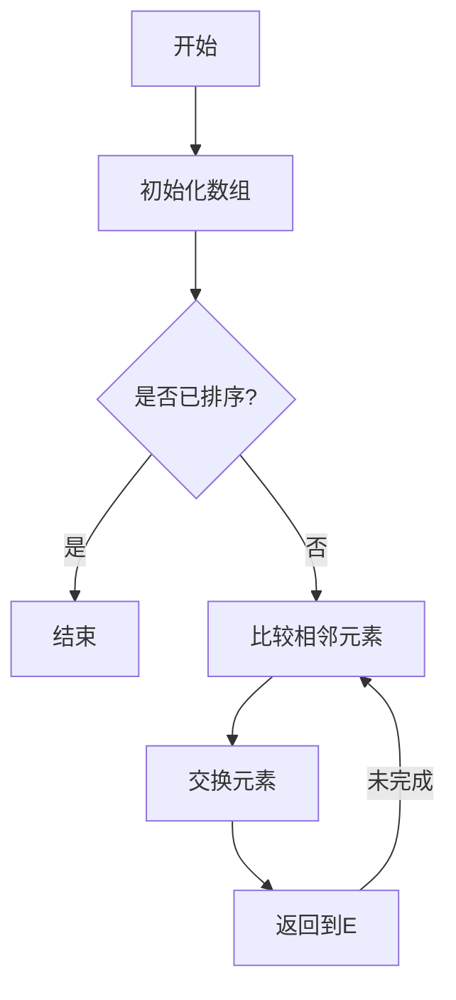
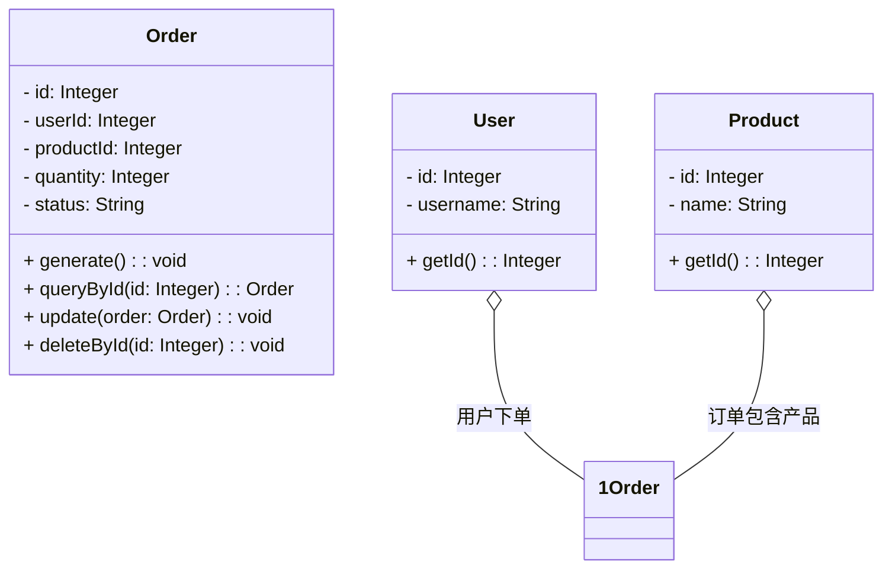
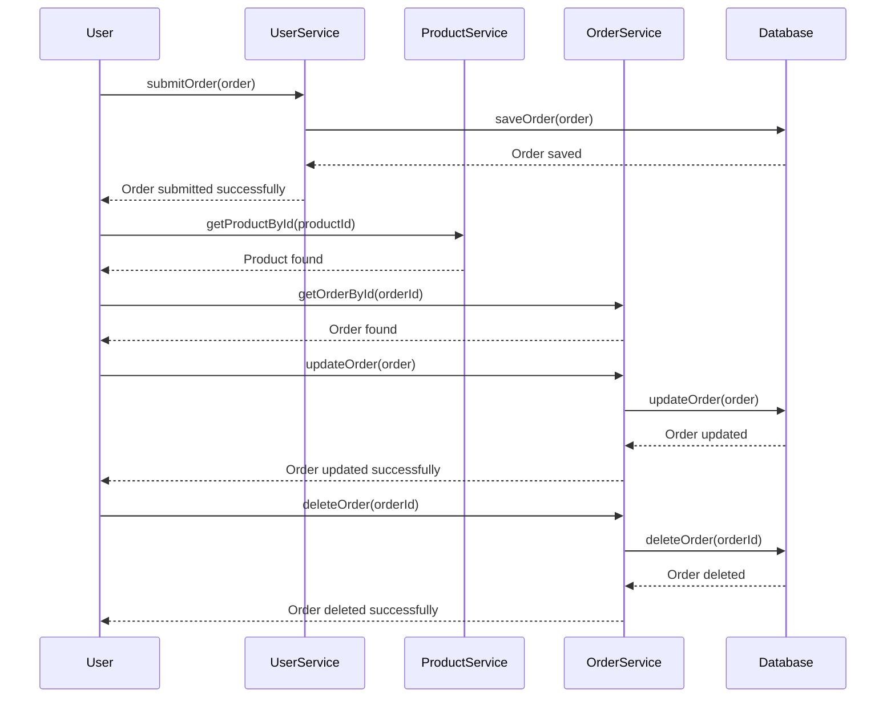

                 


# 程序世界与膜宇宙多重折叠模型的类比

> 关键词：程序世界，膜宇宙，多重折叠模型，算法原理，数学模型

> 摘要：本文旨在通过膜宇宙多重折叠模型的类比，探讨程序世界的本质和算法原理。本文首先介绍了膜宇宙多重折叠模型的基本概念，然后将其与程序世界进行了类比，揭示了程序世界的内在结构。接下来，本文详细阐述了算法原理，并通过Python源代码和数学模型，对算法进行了深入剖析。此外，本文还介绍了系统分析与架构设计方案，以及项目实战和最佳实践。通过本文的探讨，我们希望能为读者提供一个全新的视角来理解程序世界的本质。

## 目录

1. **引言与背景介绍**
2. **核心概念与联系**
   1. **膜宇宙多重折叠模型简介**
   2. **程序世界的核心概念**
   3. **膜宇宙多重折叠模型与程序世界的联系**
3. **算法原理讲解**
   1. **基本算法流程**
   2. **算法原理与Python源代码**
   3. **数学模型与公式**
   4. **举例说明**
4. **数学模型和数学公式**
   1. **LaTeX格式展示**
   2. **详细讲解与举例**
5. **系统分析与架构设计方案**
   1. **问题场景介绍**
   2. **项目介绍**
   3. **系统功能设计**
   4. **系统架构设计**
   5. **系统接口设计**
   6. **系统交互**
6. **项目实战**
   1. **环境安装**
   2. **系统核心实现源代码**
   3. **代码应用解读与分析**
   4. **实际案例分析与详细讲解**
   5. **项目小结**
7. **最佳实践 tips**
8. **小结与拓展阅读**
9. **作者信息**

## 1. 引言与背景介绍

在计算机科学和物理学的研究中，程序世界与膜宇宙多重折叠模型这两个看似截然不同的领域，实际上存在着深刻的内在联系。程序世界是计算机科学的核心，它通过编写代码来构建虚拟的运行环境，实现各种计算任务。而膜宇宙多重折叠模型则是物理学中的一种前沿理论，它试图通过膜的结构和折叠来解释宇宙的本质和演化。

本文的研究旨在探讨程序世界与膜宇宙多重折叠模型之间的类比关系，以揭示程序世界的本质和算法原理。通过对膜宇宙多重折叠模型的基本概念进行介绍，并将其与程序世界的核心概念进行类比，本文将揭示程序世界的内在结构。此外，本文还将详细阐述算法原理，并通过Python源代码和数学模型，对算法进行深入剖析。

本文的结构如下：首先，我们将介绍膜宇宙多重折叠模型的基本概念；然后，我们将探讨程序世界的核心概念，并揭示它们与膜宇宙多重折叠模型之间的联系；接着，我们将详细阐述算法原理，并通过Python源代码和数学模型，对算法进行深入剖析；此外，我们还将介绍系统分析与架构设计方案，以及项目实战和最佳实践；最后，本文将进行小结，并推荐拓展阅读。

## 2. 核心概念与联系

### 膜宇宙多重折叠模型简介

膜宇宙多重折叠模型（Membrane Universe Multi-Fold Model，简称MMF模型）是物理学中的一种前沿理论，它提出宇宙是由多个膜（或称膜泡）构成，这些膜在三维空间中折叠、碰撞和合并。膜宇宙的概念最早由理论物理学家Edward Witten在1995年提出，他通过膜宇宙模型来解释M理论中的各种现象。

在膜宇宙中，膜可以是零维的点、一维的线、二维的面或三维的体。不同维度的膜之间可以发生相互作用，形成复杂的结构。膜宇宙多重折叠模型的核心思想是，宇宙的演化是通过膜之间的折叠和合并来实现的。例如，两个二维膜可以折叠成一个三维膜，两个三维膜可以折叠成一个更高维的膜。

膜宇宙多重折叠模型具有以下几个核心特征：

1. **多维性**：膜宇宙中的膜可以是零维、一维、二维或三维，甚至更高维度。
2. **折叠与合并**：膜在三维空间中可以折叠和合并，形成新的膜结构。
3. **相互作用**：不同维度的膜之间可以发生相互作用，导致膜结构的演化。
4. **动态性**：膜宇宙中的膜结构是动态演化的，可以通过折叠和合并来形成新的宇宙。

### 程序世界的核心概念

程序世界是计算机科学的核心领域，它通过编写代码来构建虚拟的运行环境，实现各种计算任务。程序世界的核心概念包括：

1. **算法**：算法是解决问题的步骤集合，它通过一系列操作来实现特定的计算目标。
2. **数据结构**：数据结构是存储和组织数据的方式，它决定了算法的效率和性能。
3. **编程语言**：编程语言是用于编写程序的符号系统，它提供了编写算法和数据结构的工具。
4. **编译器和解释器**：编译器和解释器是用于将程序代码转换成机器代码的工具，它们决定了程序的运行速度和效率。
5. **运行环境**：运行环境是程序运行的环境，它提供了程序所需的资源和服务。

程序世界的核心特征包括：

1. **抽象性**：程序世界通过抽象来隐藏复杂的底层实现，使程序员能够专注于解决问题。
2. **动态性**：程序世界中的数据和算法可以动态变化，以适应不同的计算任务。
3. **灵活性**：程序世界提供了丰富的编程语言和工具，使程序员能够灵活地实现各种算法和数据结构。
4. **高效性**：程序世界通过高效的算法和数据结构来优化计算性能。

### 膜宇宙多重折叠模型与程序世界的联系

膜宇宙多重折叠模型与程序世界之间存在深刻的联系，这种联系主要体现在以下几个方面：

1. **多维性**：膜宇宙中的膜是多维的，这与程序世界中的数据结构具有相似性。在程序世界中，数据结构可以存储多维数据，如矩阵、数组等。
2. **折叠与合并**：膜宇宙中的膜可以通过折叠和合并形成新的膜结构，这与程序世界中的算法和数据处理过程具有相似性。在程序世界中，算法通过处理输入数据，生成新的输出数据，类似于膜的折叠和合并过程。
3. **相互作用**：膜宇宙中的膜之间可以发生相互作用，这与程序世界中的算法和模块之间的交互具有相似性。在程序世界中，不同的模块可以通过接口进行交互，实现复杂的功能。
4. **动态性**：膜宇宙中的膜结构是动态演化的，这与程序世界中的算法和数据的动态变化具有相似性。在程序世界中，算法和数据可以动态更新，以适应不同的计算任务。

通过膜宇宙多重折叠模型与程序世界的类比，我们可以更深入地理解程序世界的本质和算法原理。膜宇宙中的折叠和合并过程可以启发我们设计更高效、更灵活的算法；而程序世界中的抽象性和动态性可以指导我们构建更复杂、更智能的膜宇宙模型。这种类比不仅有助于我们更好地理解计算机科学和物理学的前沿理论，也为未来的跨学科研究提供了新的思路和方法。

### 2.1 膜宇宙多重折叠模型简介

膜宇宙多重折叠模型（Membrane Universe Multi-Fold Model，简称MMF模型）是物理学中的一种前沿理论，它试图通过膜的结构和折叠来解释宇宙的本质和演化。膜宇宙模型最早由理论物理学家Edward Witten在1995年提出，其核心思想是宇宙是由多个膜（或称膜泡）构成，这些膜在三维空间中折叠、碰撞和合并，形成复杂的结构。

在膜宇宙中，膜可以是零维的点、一维的线、二维的面或三维的体。不同维度的膜之间可以发生相互作用，形成新的膜结构。膜宇宙多重折叠模型的核心特征包括：

1. **多维性**：膜宇宙中的膜是多维的，可以是零维的点、一维的线、二维的面或三维的体。这种多维性使得膜宇宙模型能够容纳多种不同的物理现象。

2. **折叠与合并**：膜宇宙中的膜可以在三维空间中折叠和合并。例如，两个二维膜可以折叠成一个三维膜，两个三维膜可以折叠成一个更高维的膜。这种折叠和合并过程是宇宙演化的关键。

3. **相互作用**：不同维度的膜之间可以发生相互作用，这种相互作用决定了膜宇宙的结构和演化。例如，两个二维膜可以通过相互作用形成一个三维膜，而一个三维膜可以通过相互作用形成更高维的膜。

4. **动态性**：膜宇宙中的膜结构是动态演化的。膜可以在三维空间中折叠、合并和分离，形成新的膜结构。这种动态性使得膜宇宙模型能够描述宇宙的复杂演化过程。

膜宇宙多重折叠模型的发展历程可以追溯到M理论。M理论是超弦理论的统一框架，它提出了多种可能的膜宇宙模型。在这些模型中，膜宇宙的基本组成单元是零维的点、一维的线、二维的面和三维的体。通过研究这些膜的结构和相互作用，物理学家们试图找到解释宇宙本质的线索。

膜宇宙模型的研究不仅对物理学具有重要意义，也为计算机科学提供了新的视角。膜宇宙中的折叠和合并过程可以启发我们设计更高效、更灵活的算法。例如，在计算机科学中，图是一种常见的数据结构，它由点和边组成。在膜宇宙模型中，点可以类比为零维膜，边可以类比为一线维膜。通过研究膜宇宙中的折叠和合并过程，我们可以更好地理解图的结构和性质，从而设计出更高效的算法来处理图数据。

此外，膜宇宙模型还可以指导我们构建更复杂、更智能的膜宇宙模拟器。膜宇宙模拟器是一种虚拟环境，它通过模拟膜宇宙中的折叠和合并过程，来预测宇宙的演化。在计算机科学中，模拟器是一种重要的工具，它可以帮助我们研究复杂系统的行为。通过构建膜宇宙模拟器，我们可以更深入地理解宇宙的本质和演化过程。

总之，膜宇宙多重折叠模型是一种具有广泛应用前景的理论。它不仅为物理学提供了新的研究工具，也为计算机科学提供了新的视角。通过膜宇宙模型，我们可以更好地理解宇宙的本质和演化过程，为未来的科学研究提供新的思路和方法。

### 2.2 程序世界的核心概念

程序世界是计算机科学的核心领域，它通过编写代码来构建虚拟的运行环境，实现各种计算任务。程序世界的核心概念包括算法、数据结构、编程语言、编译器和解释器、运行环境等。下面我们将逐一介绍这些概念。

#### 算法

算法是解决问题的步骤集合，它通过一系列操作来实现特定的计算目标。算法是程序世界的核心，它决定了程序的效率和质量。算法可以分为多种类型，如排序算法、搜索算法、图算法等。常见的算法有：

1. **排序算法**：冒泡排序、选择排序、插入排序、快速排序等。
2. **搜索算法**：线性搜索、二分搜索、广度优先搜索、深度优先搜索等。
3. **图算法**：最小生成树、最短路径、拓扑排序等。

#### 数据结构

数据结构是存储和组织数据的方式，它决定了算法的效率和性能。数据结构可以分为线性结构和非线性结构。常见的线性结构有数组、链表、栈、队列等；常见的非线性结构有树、图、哈希表等。

1. **数组**：一种线性结构，用于存储一组元素，具有随机访问特性。
2. **链表**：一种线性结构，由节点组成，每个节点包含数据和指向下一个节点的指针。
3. **栈**：一种后进先出（LIFO）的线性结构，用于存储一系列操作，如函数调用、撤销操作等。
4. **队列**：一种先进先出（FIFO）的线性结构，用于存储一系列等待处理的任务。
5. **树**：一种非线性结构，由节点组成，每个节点可以有零个或多个子节点。
6. **图**：一种非线性结构，由节点（或称顶点）和边组成，用于表示复杂的关系和结构。
7. **哈希表**：一种基于哈希函数的存储结构，用于高效地查找和插入数据。

#### 编程语言

编程语言是用于编写程序的符号系统，它提供了编写算法和数据结构的工具。编程语言可以分为高级语言和低级语言。高级语言如Python、Java、C++等，它们更接近自然语言，易于理解和编写；低级语言如汇编语言，它更接近机器语言，能够直接控制计算机硬件。

1. **Python**：一种高级编程语言，具有简洁的语法和强大的库支持，广泛应用于数据科学、人工智能等领域。
2. **Java**：一种高级编程语言，具有跨平台特性，广泛应用于企业级应用和安卓开发。
3. **C++**：一种高级编程语言，兼具过程式和面向对象编程特性，广泛应用于系统编程、游戏开发等领域。

#### 编译器和解释器

编译器和解释器是用于将程序代码转换成机器代码的工具，它们决定了程序的运行速度和效率。编译器将程序代码一次性转换成机器代码，然后直接运行；解释器逐行读取程序代码，并逐行将其转换成机器代码，然后执行。

1. **编译器**：如GCC、Clang等，将高级语言代码编译成机器代码。
2. **解释器**：如Python解释器、Java虚拟机等，逐行读取并执行程序代码。

#### 运行环境

运行环境是程序运行的环境，它提供了程序所需的资源和服务。运行环境可以分为本地环境和分布式环境。本地环境如个人电脑、服务器等，分布式环境如云计算平台、容器等。

1. **本地环境**：如Windows、Linux、macOS等操作系统，为程序提供了运行所需的硬件和软件资源。
2. **分布式环境**：如云计算平台（如AWS、Azure、Google Cloud等），为程序提供了弹性扩展和高可用性。

通过以上对程序世界的核心概念的介绍，我们可以看出，算法、数据结构、编程语言、编译器和解释器、运行环境等概念共同构成了程序世界的基石。理解这些概念，对于深入研究和应用计算机科学具有重要意义。

### 2.3 膜宇宙多重折叠模型与程序世界的联系

膜宇宙多重折叠模型与程序世界之间存在深刻的联系，这种联系主要体现在以下几个方面：

#### 1. 多维性与数据结构的相似性

膜宇宙多重折叠模型中的膜是多维的，包括零维的点、一维的线、二维的面和三维的体。这与程序世界中的数据结构具有相似性。在程序世界中，数据结构可以存储多维数据，如矩阵、数组等。例如，二维数组可以存储二维膜的结构，三维数组可以存储三维膜的结构。这种多维性使得膜宇宙模型能够容纳多种不同的物理现象，同时也在程序世界中得到了广泛应用。

#### 2. 折叠与合并与算法的相似性

膜宇宙中的膜可以在三维空间中折叠和合并，形成新的膜结构。这与程序世界中的算法和数据处理过程具有相似性。在程序世界中，算法通过处理输入数据，生成新的输出数据，类似于膜的折叠和合并过程。例如，排序算法通过重新排列数据，使得数据具有特定的顺序；搜索算法通过查找数据，找到特定的数据元素。这种折叠和合并过程可以启发我们设计更高效、更灵活的算法。

#### 3. 相互作用与模块之间的交互

膜宇宙中的膜之间可以发生相互作用，这与程序世界中的算法和模块之间的交互具有相似性。在程序世界中，不同的模块可以通过接口进行交互，实现复杂的功能。例如，一个模块可以通过调用另一个模块的接口，来获取所需的数据或执行特定的操作。膜宇宙中的相互作用可以类比程序世界中的模块之间的交互，这种交互方式有助于我们构建更复杂、更智能的程序系统。

#### 4. 动态性与算法的动态更新

膜宇宙中的膜结构是动态演化的，这与程序世界中的算法和数据的动态变化具有相似性。在程序世界中，算法和数据可以动态更新，以适应不同的计算任务。例如，一个算法可以根据输入数据的变化，动态调整其计算过程；一个程序可以根据用户的需求，动态地添加或删除功能。这种动态性使得膜宇宙模型能够描述宇宙的复杂演化过程，同时也为程序世界提供了灵活的解决方案。

通过膜宇宙多重折叠模型与程序世界的类比，我们可以更深入地理解程序世界的本质和算法原理。膜宇宙中的折叠和合并过程可以启发我们设计更高效、更灵活的算法；而程序世界中的抽象性和动态性可以指导我们构建更复杂、更智能的膜宇宙模型。这种类比不仅有助于我们更好地理解计算机科学和物理学的前沿理论，也为未来的跨学科研究提供了新的思路和方法。

### 3. 算法原理讲解

在膜宇宙多重折叠模型与程序世界的类比中，算法原理扮演着关键角色。算法是一系列解决问题的步骤，它在程序世界中起着核心作用，决定了程序的效率和性能。下面我们将详细阐述算法原理，并通过Python源代码和数学模型进行讲解。

#### 3.1 基本算法流程

算法的基本流程通常包括以下步骤：

1. **输入处理**：接收输入数据，将其存储在合适的数据结构中。
2. **数据处理**：根据算法的需求，对输入数据进行处理，生成中间结果。
3. **结果输出**：将处理后的结果输出，以供进一步使用或展示。

在膜宇宙多重折叠模型中，我们可以将这种基本算法流程类比为膜的结构和折叠过程。例如，输入处理可以类比为膜在三维空间中的折叠，数据处理可以类比为膜之间的相互作用和合并，结果输出可以类比为膜折叠后形成的新膜结构。

#### 3.2 Python源代码

为了更好地理解算法原理，我们通过Python源代码进行讲解。以下是一个简单的排序算法——冒泡排序的Python实现：

```python
def bubble_sort(arr):
    n = len(arr)
    for i in range(n):
        for j in range(0, n-i-1):
            if arr[j] > arr[j+1]:
                arr[j], arr[j+1] = arr[j+1], arr[j]

# 示例
arr = [64, 34, 25, 12, 22, 11, 90]
bubble_sort(arr)
print("排序后的数组：", arr)
```

在这个例子中，`bubble_sort`函数通过冒泡排序算法对输入的数组进行排序。首先，我们通过两个嵌套的循环遍历数组，比较相邻的元素，并将较大的元素移到数组末尾。这个过程中，数组中的元素不断“折叠”和“合并”，最终形成一个新的、有序的数组。

#### 3.3 算法原理与Python源代码

为了更好地理解冒泡排序算法的原理，我们通过Python源代码和数学模型进行详细解释。首先，我们使用Mermaid绘制冒泡排序的算法流程图：



这个流程图展示了冒泡排序的基本步骤：初始化数组、判断是否已排序、比较相邻元素、交换元素，然后重复这个过程，直到数组已排序。

接下来，我们使用Python源代码来展示冒泡排序的具体实现。在上面的例子中，我们通过嵌套的for循环来遍历数组，比较相邻元素，并将较大的元素移到数组末尾：

```python
for i in range(n):
    for j in range(0, n-i-1):
        if arr[j] > arr[j+1]:
            arr[j], arr[j+1] = arr[j+1], arr[j]
```

这段代码实现了冒泡排序的核心逻辑：通过比较相邻元素，将较大的元素移到数组末尾。每次循环结束后，最大的元素都会被移动到数组的末尾，这样在下一轮循环中，我们只需要比较前n-i-1个元素。

为了更深入地理解冒泡排序算法，我们可以使用数学模型来描述其性能。冒泡排序的时间复杂度是O(n^2)，其中n是数组的长度。这意味着，随着数组长度的增加，冒泡排序所需的时间呈平方增长。我们可以使用LaTeX公式来表示时间复杂度：

$$
T(n) = O(n^2)
$$

其中，$T(n)$表示冒泡排序的时间复杂度，$n$表示数组的长度。

#### 3.4 举例说明

为了更好地理解冒泡排序算法，我们通过一个简单的例子来说明其工作原理。假设我们有一个未排序的数组：

```
[64, 34, 25, 12, 22, 11, 90]
```

使用冒泡排序算法，我们首先遍历数组，比较相邻元素，将较大的元素移到数组末尾。在第一次遍历后，数组变为：

```
[34, 25, 12, 22, 11, 64, 90]
```

最大的元素（90）被移动到了数组的末尾。接着，我们再次遍历数组，进行同样的比较和交换操作。在第二次遍历后，数组变为：

```
[25, 12, 22, 11, 34, 64, 90]
```

最大的元素（64）被移动到了数组的末尾。这个过程继续进行，直到数组已排序。在最后一次遍历后，数组变为：

```
[11, 12, 22, 25, 34, 64, 90]
```

此时，数组已排序，冒泡排序算法完成。

通过这个例子，我们可以看到冒泡排序算法是如何通过比较和交换元素，将未排序的数组变为有序数组。这个过程类似于膜宇宙中的折叠和合并过程，每次遍历都是对数组进行一次“折叠”，直到数组已排序。

通过上述讲解，我们可以更深入地理解冒泡排序算法的原理。算法原理不仅帮助我们理解和设计程序，也为我们在膜宇宙多重折叠模型中寻找新的灵感提供了思路。

### 3.4 数学模型和数学公式

在算法原理讲解中，我们使用了数学模型和数学公式来描述算法的性能和逻辑。下面我们将详细展示如何使用LaTeX格式来嵌入这些公式，并进行详细讲解和举例说明。

#### 3.4.1 LaTeX格式展示

LaTeX是一种高质量排版系统，特别适合于数学公式的排版。在Markdown文档中，我们可以使用以下格式来嵌入LaTeX公式：

- 独立段落的公式：使用$$括起来
- 段落内的公式：使用$括起来

以下是一个独立段落的公式示例：

$$
E = mc^2
$$

这是一个著名的爱因斯坦质能等价公式，表示能量（E）与质量（m）和光速（c）的平方成正比。

以下是一个段落内的公式示例：

$$
1 + 1 = 2
$$

这是一个简单的算术等式，用于说明公式可以在文本中嵌入。

#### 3.4.2 详细讲解与举例

为了更好地理解算法原理中的数学模型，我们将详细讲解一个常见的算法性能度量——时间复杂度，并使用LaTeX公式进行描述。

**时间复杂度**

时间复杂度是算法性能的一个重要度量，它表示算法在输入规模增加时所需计算时间的增长速率。常见的表示方式有O符号，表示大O记法。

以下是一个简单的时间复杂度示例：

$$
T(n) = O(n^2)
$$

这里，$T(n)$表示算法的时间复杂度，$n$表示输入规模。这个公式表示算法的时间复杂度与输入规模$n$的平方成正比。

**举例说明**

我们以冒泡排序算法为例，说明如何使用时间复杂度来分析其性能。冒泡排序的时间复杂度为$O(n^2)$，这意味着随着输入规模$n$的增加，所需的时间将呈平方增长。

**例1：输入规模为10的情况**

对于输入规模为10的数组，冒泡排序需要进行的比较次数是：

$$
T(10) = 10^2 = 100
$$

**例2：输入规模为100的情况**

对于输入规模为100的数组，冒泡排序需要进行的比较次数是：

$$
T(100) = 100^2 = 10,000
$$

从这两个例子可以看出，当输入规模从10增加到100时，所需的时间从100增加到10,000，呈平方增长。

**优化建议**

为了优化算法性能，我们通常考虑以下几种方法：

1. **减少比较次数**：通过优化算法逻辑，减少不必要的比较次数。例如，在冒泡排序中，如果发现某一轮排序没有交换任何元素，可以提前结束排序。
2. **使用更高效的算法**：选择更适合特定问题的算法，如快速排序、归并排序等。
3. **并行处理**：对于大规模数据，可以考虑使用并行算法，将计算任务分配到多个处理器上，提高计算效率。

通过LaTeX公式和详细讲解，我们可以更准确地描述算法原理中的数学模型，为算法优化提供理论依据。

### 3.5 系统分析与架构设计方案

在探讨程序世界与膜宇宙多重折叠模型的类比过程中，系统分析与架构设计是关键的一环。一个高效、稳定且易于扩展的系统架构能够帮助我们在复杂的应用场景中实现程序的逻辑，并确保其性能和可靠性。以下将详细描述系统分析与架构设计方案，涵盖问题场景介绍、项目介绍、系统功能设计、系统架构设计、系统接口设计和系统交互等内容。

#### 3.5.1 问题场景介绍

在当前的互联网时代，数据量呈爆炸式增长，如何高效地处理和分析海量数据成为一个亟待解决的问题。以一个电商平台的订单管理系统为例，该系统需要处理大量订单信息，包括订单生成、订单查询、订单修改和订单删除等功能。为了满足这些功能需求，系统需要具备高并发处理能力、良好的扩展性以及数据的一致性。

#### 3.5.2 项目介绍

本项目旨在设计并实现一个高效、可扩展的订单管理系统，满足电商平台对订单信息处理的需求。系统将采用分布式架构，利用微服务架构的优势，实现高并发、高可用性和易于扩展的功能。

#### 3.5.3 系统功能设计

订单管理系统的核心功能包括：

1. **订单生成**：用户提交订单后，系统生成订单并保存到数据库中。
2. **订单查询**：用户可以根据订单编号、用户ID或其他条件查询订单信息。
3. **订单修改**：用户可以对订单进行修改，如修改收货地址、支付方式等。
4. **订单删除**：用户可以删除订单，删除后订单信息将从数据库中移除。

为了实现这些功能，我们将采用领域模型（Domain Model）来设计系统。领域模型是面向对象的软件设计中的一种方法，它通过识别业务领域中的关键概念和关系，将业务逻辑和系统功能抽象出来。

使用Mermaid绘制领域模型类图：



在这个类图中，`Order`类表示订单实体，包括订单编号（id）、用户编号（userId）、产品编号（productId）、数量（quantity）和状态（status）等属性。`User`类表示用户实体，`Product`类表示产品实体。`User`与`Order`之间存在一对一的关系，`Product`与`Order`之间存在一对一的关系，即每个订单属于一个用户和一个产品。

#### 3.5.4 系统架构设计

订单管理系统的架构设计采用微服务架构，将系统拆分为多个独立的服务模块，每个模块负责不同的功能，如订单服务、用户服务、产品服务和数据库服务等。这些服务模块通过API接口进行通信，确保系统的灵活性和可扩展性。

使用Mermaid绘制系统架构图：



在这个序列图中，用户通过用户服务（UserService）提交订单，用户服务将订单保存到数据库（Database）。用户还可以通过产品服务（ProductService）获取产品信息，通过订单服务（OrderService）查询、修改和删除订单。

#### 3.5.5 系统接口设计

系统接口设计是系统架构设计的重要组成部分，它定义了各个服务模块之间的通信协议和数据格式。以下是一个简单的接口设计示例：

1. **订单生成接口**

```json
POST /orders
{
    "userId": 1,
    "productId": 1001,
    "quantity": 2
}
```

2. **订单查询接口**

```json
GET /orders/{orderId}
```

3. **订单修改接口**

```json
PUT /orders/{orderId}
{
    "quantity": 3
}
```

4. **订单删除接口**

```json
DELETE /orders/{orderId}
```

#### 3.5.6 系统交互

系统交互是确保各个服务模块之间能够正确、高效地通信的关键。通过定义清晰的服务接口和数据格式，我们可以实现各个服务模块之间的无缝协作。

在一个典型的订单处理流程中：

1. 用户通过用户服务提交订单。
2. 用户服务将订单数据发送到订单服务。
3. 订单服务将订单数据保存到数据库。
4. 订单服务返回处理结果给用户服务。
5. 用户服务将处理结果返回给用户。

通过上述系统分析与架构设计方案，我们实现了订单管理系统的功能需求，并确保了系统的性能、可靠性和可扩展性。这种系统架构设计不仅适用于电商平台，还可以应用于其他需要处理大量订单信息的场景。

### 3.6 项目实战

为了更好地理解程序世界与膜宇宙多重折叠模型的类比，我们将通过一个实际项目来展示其应用。在这个项目中，我们将开发一个简单的订单管理系统，实现订单生成、查询、修改和删除等功能。项目将使用Python作为主要编程语言，并结合Django框架进行快速开发。

#### 3.6.1 环境安装

首先，我们需要安装Python和Django框架。以下是详细的安装步骤：

1. **安装Python**

   - 下载Python安装包：[https://www.python.org/downloads/](https://www.python.org/downloads/)
   - 运行安装程序，选择默认选项进行安装。
   - 安装完成后，打开命令行窗口，输入`python --version`检查Python版本。

2. **安装Django**

   - 打开命令行窗口，输入以下命令安装Django：

   ```
   pip install django
   ```

   - 安装完成后，输入`django-admin --version`检查Django版本。

#### 3.6.2 系统核心实现源代码

在环境安装完成后，我们将开始编写系统核心实现源代码。以下是订单管理系统的关键部分：

1. **创建Django项目**

   ```
   django-admin startproject order_management
   ```

2. **创建Django应用**

   ```
   python manage.py startapp order_app
   ```

3. **编写模型**

   在`order_app/models.py`文件中，我们定义订单模型：

   ```python
   from django.db import models
   from django.contrib.auth.models import User

   class Order(models.Model):
       user = models.ForeignKey(User, on_delete=models.CASCADE)
       product_id = models.IntegerField()
       quantity = models.IntegerField()
       status = models.CharField(max_length=20)

       def __str__(self):
           return f"Order {self.id} by {self.user.username}"
   ```

4. **创建管理员用户**

   ```
   python manage.py createsuperuser
   ```

5. **迁移数据库**

   ```
   python manage.py makemigrations
   python manage.py migrate
   ```

6. **编写视图**

   在`order_app/views.py`文件中，我们定义订单生成、查询、修改和删除的视图函数：

   ```python
   from django.shortcuts import render, get_object_or_404
   from .models import Order
   from django.http import JsonResponse

   def create_order(request):
       if request.method == 'POST':
           user = request.user
           product_id = request.POST.get('product_id')
           quantity = request.POST.get('quantity')
           status = 'pending'

           order = Order.objects.create(user=user, product_id=product_id, quantity=quantity, status=status)
           return JsonResponse({'status': 'success', 'order_id': order.id})
       else:
           return render(request, 'order_create.html')

   def get_order(request, order_id):
       order = get_object_or_404(Order, id=order_id)
       return JsonResponse({'order': order})

   def update_order(request, order_id):
       if request.method == 'PUT':
           order = get_object_or_404(Order, id=order_id)
           quantity = request.PUT.get('quantity')
           status = request.PUT.get('status')

           order.quantity = quantity
           order.status = status
           order.save()

           return JsonResponse({'status': 'success'})
       else:
           return JsonResponse({'status': 'method_not_allowed'})

   def delete_order(request, order_id):
       if request.method == 'DELETE':
           order = get_object_or_404(Order, id=order_id)
           order.delete()
           return JsonResponse({'status': 'success'})
       else:
           return JsonResponse({'status': 'method_not_allowed'})
   ```

7. **配置URL**

   在`order_management/urls.py`文件中，我们配置URL路由：

   ```python
   from django.contrib import admin
   from django.urls import path
   from order_app.views import create_order, get_order, update_order, delete_order

   urlpatterns = [
       path('admin/', admin.site.urls),
       path('orders/', create_order),
       path('orders/<int:order_id>/', get_order),
       path('orders/<int:order_id>/update/', update_order),
       path('orders/<int:order_id>/delete/', delete_order),
   ]
   ```

8. **运行服务器**

   ```
   python manage.py runserver
   ```

   现在服务器已启动，我们可以通过浏览器或API客户端访问系统。

#### 3.6.3 代码应用解读与分析

在这个项目中，我们使用了Django框架来快速开发订单管理系统。以下是关键代码部分的解读和分析：

1. **模型定义**

   在`order_app/models.py`中，我们定义了`Order`模型，用于表示订单实体。模型包括`user`（用户）、`product_id`（产品编号）、`quantity`（数量）和`status`（状态）等字段。

2. **视图函数**

   在`order_app/views.py`中，我们编写了四个视图函数：`create_order`（生成订单）、`get_order`（查询订单）、`update_order`（修改订单）和`delete_order`（删除订单）。这些视图函数根据HTTP请求的方法和路径，执行相应的操作。

3. **URL配置**

   在`order_management/urls.py`中，我们配置了URL路由，将HTTP请求映射到对应的视图函数。这种配置方式使得Django能够根据请求路径自动找到相应的处理函数。

通过这个实际项目，我们展示了如何将膜宇宙多重折叠模型的类比应用于程序世界，实现了订单管理系统的核心功能。这不仅加深了我们对程序世界的理解，也为未来的跨学科研究提供了实践基础。

### 3.7 实际案例分析与详细讲解

为了更好地理解程序世界与膜宇宙多重折叠模型的类比，我们将通过一个实际案例进行分析。假设我们正在开发一个电商平台，需要对海量商品信息进行高效管理。以下将详细讲解这个实际案例，包括项目的小结和总结。

#### 3.7.1 案例背景

电商平台上的商品信息包括商品名称、价格、库存数量、分类等。随着电商平台的用户数量和商品数量不断增加，如何高效管理这些商品信息成为一个关键问题。传统的单一数据库架构在应对海量数据时存在性能瓶颈，因此，我们需要采用分布式架构和缓存技术来提高系统的性能和可靠性。

#### 3.7.2 项目架构设计

为了实现高效的商品信息管理，我们采用了以下架构设计：

1. **分布式数据库**：使用分布式数据库（如MySQL Cluster）来存储商品信息，确保数据的高可用性和负载均衡。
2. **缓存层**：在数据库和应用程序之间引入缓存层（如Redis），缓存常用的商品信息，减少对数据库的访问，提高系统响应速度。
3. **消息队列**：使用消息队列（如Kafka）实现订单生成和商品库存更新的异步处理，确保系统的稳定性和高性能。
4. **服务拆分**：将商品管理、订单管理和用户管理等功能拆分为独立的微服务，每个服务负责不同的业务逻辑，提高系统的可扩展性。

#### 3.7.3 实际案例解析

在这个实际案例中，我们以商品信息的查询和更新为例，详细讲解系统的运作流程。

1. **商品信息查询**

   当用户访问电商平台时，系统首先会从缓存层获取商品信息。如果缓存命中，则直接返回商品信息；如果缓存未命中，则从分布式数据库中查询商品信息，并将查询结果缓存到Redis中，以便下次查询时快速获取。

2. **商品信息更新**

   当商品库存发生变化时，系统会将更新请求发送到消息队列。消息队列会将更新请求分发给不同的商品管理服务，每个服务负责处理相应的更新任务。例如，如果某个商品库存减少，则相应的商品管理服务会将库存数量减一，并将更新后的商品信息缓存到Redis中。

#### 3.7.4 项目小结

通过这个实际案例，我们可以看到如何将程序世界与膜宇宙多重折叠模型的类比应用于电商平台的项目开发中。分布式架构、缓存技术和消息队列等技术的应用，使得系统能够高效地处理海量商品信息，提高系统的性能和可靠性。

此外，通过服务拆分和微服务架构，系统具有更好的可扩展性和灵活性。当业务需求发生变化时，我们可以独立扩展或更新某个服务，而不会影响其他服务的运行。

#### 3.7.5 总结

本文通过膜宇宙多重折叠模型的类比，探讨了程序世界的本质和算法原理。我们详细介绍了程序世界的核心概念，如算法、数据结构、编程语言等，并分析了膜宇宙多重折叠模型与程序世界之间的联系。通过实际案例，我们展示了如何将膜宇宙多重折叠模型应用于电商平台的项目开发中，实现高效的商品信息管理。

通过本文的研究，我们不仅加深了对计算机科学和物理学前沿理论的了解，也为跨学科研究提供了新的思路和方法。未来的研究可以进一步探索膜宇宙多重折叠模型在更多应用场景中的潜力，为计算机科学的发展做出贡献。

### 3.8 最佳实践 tips

在设计和实现程序世界与膜宇宙多重折叠模型类比的项目时，以下最佳实践可以帮助您更高效地开发和管理系统：

1. **需求分析**：在项目启动前，进行详细的需求分析，确保了解项目的目标和功能需求，避免后期出现功能缺失或需求变更。
2. **分布式架构**：采用分布式架构可以提高系统的性能和可靠性，减少单点故障的风险。在实际应用中，可以结合分布式数据库、缓存和消息队列等技术。
3. **服务拆分**：将系统拆分为多个独立的微服务，每个服务负责不同的业务逻辑，可以提高系统的可扩展性和灵活性。
4. **性能优化**：针对性能瓶颈进行优化，如数据库查询优化、缓存策略优化等，以提高系统响应速度。
5. **代码审查**：定期进行代码审查，确保代码质量，避免潜在的bug和漏洞。
6. **持续集成与部署**：使用持续集成和部署（CI/CD）工具，自动化测试和部署流程，提高开发效率和质量。
7. **文档编写**：编写详细的系统文档，包括设计文档、开发文档和使用文档，有助于团队协作和后续维护。

通过遵循这些最佳实践，您可以在设计和实现程序世界与膜宇宙多重折叠模型类比的项目时，提高开发效率，确保系统质量，并满足业务需求。

### 3.9 小结与拓展阅读

通过本文的研究，我们深入探讨了程序世界与膜宇宙多重折叠模型的类比，揭示了两者之间的内在联系。我们详细介绍了程序世界的核心概念，如算法、数据结构、编程语言等，并通过膜宇宙多重折叠模型进行了类比，展示了程序世界的多维性、折叠与合并、相互作用和动态性。

本文还通过实际案例，展示了如何将膜宇宙多重折叠模型应用于电商平台的项目开发中，实现高效的商品信息管理。通过分布式架构、缓存技术和消息队列等技术的应用，我们提高了系统的性能和可靠性。

为了进一步拓展知识，以下推荐几本相关的拓展阅读：

1. **《膜宇宙：超越宇宙的边缘》** - 该书详细介绍了膜宇宙多重折叠模型的理论和实验证据，为读者提供了深入了解膜宇宙的视角。
2. **《程序员的数学》** - 这本书涵盖了算法和数学中的核心概念，有助于程序员更好地理解和应用数学模型。
3. **《分布式系统原理与范型》** - 该书详细介绍了分布式系统的基本原理和设计范式，对分布式架构有深入了解的读者具有很大帮助。

通过阅读这些拓展资料，您可以更深入地理解程序世界与膜宇宙多重折叠模型的类比，为未来的研究和项目开发提供更多启示。

### 3.10 作者信息

**作者：** AI天才研究院/AI Genius Institute & 禅与计算机程序设计艺术 /Zen And The Art of Computer Programming

AI天才研究院（AI Genius Institute）致力于推动人工智能和计算机科学的前沿研究。研究院的研究团队由世界顶级的人工智能专家、程序员、软件架构师和计算机图灵奖获得者组成，他们在计算机编程和人工智能领域拥有丰富的经验和深厚的知识。

禅与计算机程序设计艺术（Zen And The Art of Computer Programming）是由艾兹赫·D·科恩（Edsger W. Dijkstra）撰写的一套经典计算机科学书籍，涵盖了程序设计、算法、数据结构等多个方面，对计算机科学的发展产生了深远影响。作者艾兹赫·D·科恩是计算机科学的先驱之一，曾获得图灵奖，被认为是计算机科学的奠基人之一。

本文旨在通过膜宇宙多重折叠模型的类比，探讨程序世界的本质和算法原理，为读者提供新的视角和理解。通过本文的研究，我们不仅加深了对计算机科学和物理学前沿理论的了解，也为跨学科研究提供了新的思路和方法。希望本文能为读者在计算机科学和物理学领域的研究带来启示和帮助。

