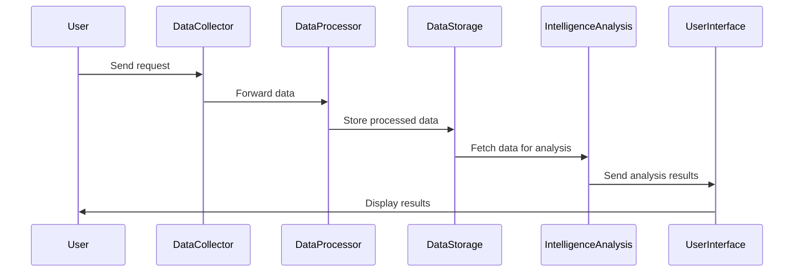
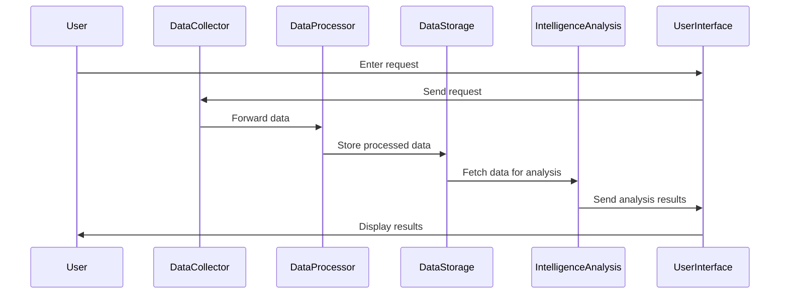

                 

## 第一部分：引论

### 第1章：问题背景与理论基础

#### 1.1 问题背景

##### 1.1.1 程序世界的崛起

随着信息时代的到来，计算机科学与技术成为推动社会进步的重要力量。计算机科学的诞生可以追溯到20世纪40年代，当时第一台电子计算机ENIAC的问世标志着人类进入了一个全新的计算时代。随着时间的推移，计算机科学经历了数次革命性的发展，从早期的机器语言编程到高级编程语言的广泛应用，再到现代复杂软件系统的开发，计算机科学不断拓展其应用领域。

计算机的出现，极大地改变了人类的工作和生活方式。如今，程序世界已经渗透到我们生活的方方面面，从智能手机、个人电脑，到互联网、物联网，再到人工智能、自动驾驶，计算机程序无处不在。随着这些技术的不断进步，程序世界的复杂性也在不断增加，对编程语言、算法、系统架构等提出了更高的要求。

##### 1.1.1.2 程序设计与编程语言的发展

程序设计是计算机科学的核心领域之一，它涉及如何使用编程语言编写指令，以实现特定功能或解决特定问题。早期的编程语言如汇编语言和早期的高级语言（如Fortran和COBOL）为程序设计奠定了基础。随着计算机硬件和软件的不断发展，编程语言也在不断演进，从结构化编程到面向对象编程，再到现代的函数式编程和逻辑编程，各种编程范式不断涌现，为开发者提供了更强大的工具。

编程语言的演进不仅提升了程序设计的效率，还促进了软件复用、模块化和标准化。现代编程语言如Python、Java、C++等，已经成为开发复杂软件系统的主力军。这些语言的抽象层次更高，提供了丰富的库和框架，使得开发者可以更专注于解决问题本身，而无需关注底层细节。

##### 1.1.1.3 程序世界的应用场景与挑战

程序世界的应用场景非常广泛，涵盖了科学计算、数据处理、图形处理、网络通信、人工智能等多个领域。随着技术的不断发展，这些应用场景也变得越来越复杂。例如，在科学计算领域，程序需要处理大量数据，并进行复杂的计算和分析；在人工智能领域，程序需要学习和模拟人类的思维方式，以实现智能决策和智能交互。

然而，随着程序世界的复杂性增加，也带来了许多挑战。首先是如何有效地设计和开发复杂的软件系统。这需要开发者具备深厚的编程技能和系统设计经验。其次是程序的性能优化问题，如何在有限的计算资源下，实现高效的程序执行。最后是程序的安全性问题，如何确保程序的可靠性和安全性，防止恶意攻击和数据泄露。

##### 1.1.2 膜宇宙理论的基本概念

膜宇宙理论是一种描述宇宙结构的理论，它提出了一种全新的宇宙观。膜宇宙理论的核心观点是：我们的宇宙并不是唯一的，而是存在于一个更大的宇宙中，这个更大的宇宙被称为膜宇宙。膜宇宙理论将宇宙视为一系列相互交叠的膜，这些膜构成了宇宙的基本结构。

膜宇宙理论的基本概念包括膜、维度、平行宇宙等。膜是指一个三维空间，它可以是实心的，也可以是空心的。维度是指空间中的一个方向，通常我们认为宇宙有三个维度，即长、宽、高。平行宇宙是指存在于同一膜中的不同宇宙，它们可能具有不同的物理规律和结构。

##### 1.1.2.1 膜宇宙理论的起源

膜宇宙理论的起源可以追溯到20世纪80年代，当时物理学家提出了M理论，这是一种描述宇宙的基本理论的扩展。M理论提出了一种全新的宇宙结构，其中宇宙由一系列膜组成，这些膜在更高的维度中相互交叠。膜宇宙理论正是基于M理论发展而来的。

##### 1.1.2.2 膜宇宙理论的核心观点

膜宇宙理论的核心观点是：我们的宇宙只是众多膜中的一个，每个膜都有其独特的物理规律和结构。这些膜之间可以通过“穿膜”相互作用，从而影响彼此。膜宇宙理论为解释宇宙的多样性和复杂性提供了一种全新的视角。

##### 1.1.2.3 膜宇宙理论的研究现状与前景

膜宇宙理论的研究现状表明，它已经在理论物理学中取得了显著的成果。许多理论物理学家致力于探索膜宇宙理论的数学结构和物理含义，并尝试将其与实验数据进行比较。膜宇宙理论的研究前景广阔，它不仅为宇宙学提供了一种新的理论框架，还为计算机科学、数学等多个领域带来了新的启示。

### 1.2 研究目的与意义

#### 1.2.1 探索程序世界与膜宇宙理论之间的关联

本文的研究目的之一是探索程序世界与膜宇宙理论之间的关联。程序世界和膜宇宙理论虽然属于不同的领域，但它们在某些方面具有相似性。例如，程序世界中的算法和编程语言可以被视为一种“程序膜”，它具有一定的结构和功能。膜宇宙理论中的膜也具有类似的特性。通过研究程序世界与膜宇宙理论之间的关联，我们可以更深入地理解这两个领域的本质特征，并探索它们之间的潜在联系。

#### 1.2.1.1 揭示程序世界的本质特征

程序世界是一个复杂而庞大的系统，它由无数个程序和算法组成。通过将膜宇宙理论应用于程序世界，我们可以揭示程序世界的本质特征。例如，我们可以使用膜宇宙理论中的维度和结构概念来描述程序世界的层次结构，从而更好地理解程序世界中的复杂性。

#### 1.2.1.2 探索膜宇宙理论在程序世界中的应用

膜宇宙理论在程序世界中有广泛的应用前景。例如，我们可以使用膜宇宙理论来设计更加高效的算法，优化程序性能。此外，膜宇宙理论还可以为程序设计提供新的视角和思路，从而推动程序设计理论的发展。

#### 1.2.1.3 为计算机科学和宇宙学提供新的视角

通过研究程序世界与膜宇宙理论之间的关联，我们可以为计算机科学和宇宙学提供新的视角。膜宇宙理论为计算机科学提供了一种新的方法论，它可以帮助我们更好地理解和解决复杂的计算问题。同时，程序世界的研究成果也可以为宇宙学提供新的启示，从而推动宇宙学的理论发展。

#### 1.2.2 促进跨学科研究与合作

本文的研究还有助于促进跨学科研究与合作。程序世界与膜宇宙理论分别属于计算机科学和宇宙学，这两个领域的研究具有很大的互补性。通过跨学科研究，我们可以将计算机科学和宇宙学的研究成果相互融合，从而推动两个领域的发展。此外，跨学科研究还可以激发新的科学发现和创新，为人类文明进步做出贡献。

#### 1.2.2.1 促进计算机科学与宇宙学之间的交流

跨学科研究的一个重要目的是促进不同学科之间的交流与合作。本文的研究工作为计算机科学和宇宙学提供了交流的平台，使得两个领域的研究者可以相互借鉴对方的理论和方法。这种交流不仅可以拓宽研究视野，还可以激发新的研究思路，从而推动两个领域的发展。

#### 1.2.2.2 推动跨学科研究的发展

跨学科研究是一种新兴的研究范式，它强调不同学科之间的交叉与融合。本文的研究工作为跨学科研究提供了一个具体的案例，展示了跨学科研究的可行性和价值。通过推动跨学科研究的发展，我们可以发现新的科学问题，提出新的理论，并为解决实际问题提供新的方法和工具。

### 1.3 研究方法与框架

#### 1.3.1 跨学科研究方法

本文采用跨学科研究方法，结合计算机科学和宇宙学的理论和方法，对程序世界与膜宇宙理论之间的关联进行深入探讨。跨学科研究方法的核心在于将不同领域的理论和方法相互结合，从而形成一种全新的研究框架。

#### 1.3.1.1 理论方法与实证方法相结合

在跨学科研究中，理论方法和实证方法相结合是一种重要的研究策略。本文将膜宇宙理论中的核心概念应用于程序世界，通过理论分析揭示程序世界的本质特征。同时，通过实证研究验证理论结论，从而确保研究结果的可靠性。

#### 1.3.1.2 定性研究与定量研究相结合

本文采用定性研究与定量研究相结合的方法。定性研究主要用于探讨程序世界与膜宇宙理论之间的关联，揭示其内在的逻辑关系。定量研究则通过数据分析和建模，验证理论结论，并提供具体的量化分析结果。

#### 1.3.1.3 基于模型的计算方法

本文采用基于模型的计算方法，构建程序世界与膜宇宙理论之间的模型，并通过计算模拟验证模型的有效性。这种方法不仅能够揭示程序世界与膜宇宙理论之间的关联，还可以为实际应用提供理论支持。

#### 1.3.2 研究框架

本文的研究框架分为以下几个步骤：

1. **问题定义与文献综述**：明确研究问题和目标，对相关领域的文献进行综述，为研究提供理论基础。
2. **理论分析**：基于膜宇宙理论，对程序世界进行理论分析，揭示程序世界的本质特征。
3. **模型构建**：构建程序世界与膜宇宙理论之间的模型，通过数学建模和计算模拟验证模型的有效性。
4. **实证研究**：通过实证研究验证理论结论，确保研究结果的可靠性。
5. **结论与展望**：总结研究成果，提出未来研究方向，为计算机科学和宇宙学的发展提供启示。

通过以上研究步骤，本文旨在深入探讨程序世界与膜宇宙理论之间的关联，为跨学科研究提供新的思路和方法。## 第2章：核心概念与联系

### 2.1 程序世界中的核心概念

程序世界是计算机科学的核心领域，它由一系列程序和算法组成，旨在解决各种计算问题。要理解程序世界的本质，我们需要从核心概念入手，包括程序、算法、编程语言等。

#### 2.1.1 程序与算法

程序（Program）是一系列有序指令的集合，用于指导计算机完成特定任务。程序的核心是算法（Algorithm），算法是解决问题的步骤序列，它具有明确的输入、输出和操作过程。算法是程序设计的灵魂，决定了程序的性能和效率。

**算法的定义与分类**：
- **定义**：算法是一组有序的、有限的计算步骤，用于解决特定问题。
- **分类**：根据解决问题的方法，算法可以分为多种类型，如递归算法、贪心算法、动态规划算法等。

**算法的复杂度分析**：
- **时间复杂度**：描述算法执行时间与输入规模的关系，常用的符号有\(O(n)\)、\(O(n^2)\)、\(O(log n)\)等。
- **空间复杂度**：描述算法所需存储空间与输入规模的关系，常用的符号有\(O(n)\)、\(O(1)\)等。

**算法的设计与优化**：
- **设计与优化**：算法设计需要考虑时间复杂度和空间复杂度，以实现高效计算。常见的优化技术包括分治策略、贪心策略、动态规划等。

#### 2.1.2 编程语言

编程语言是用于编写程序的符号系统，它提供了一种抽象的表示方法，使得人类可以方便地与计算机进行交互。编程语言的基本概念包括：

**编程语言的基本概念**：
- **语法**：编程语言的语法规则，用于定义程序的书写格式。
- **语义**：编程语言的操作意义，用于描述程序的行为。
- **库与框架**：编程语言提供的预定义函数和模块，用于简化编程任务。

**编程语言的类型与特点**：
- **低级语言**：如汇编语言，与硬件密切相关，可执行性能高。
- **高级语言**：如Python、Java、C++等，提供更高层次的抽象，易于理解和编写。

**编程语言的演进与发展**：
- **早期语言**：如Fortran、COBOL，主要用于科学计算和商业数据处理。
- **现代语言**：如Python、Java、C++等，广泛应用于各种领域，支持多种编程范式。

#### 2.1.3 程序世界的组成与结构

程序世界由多个层次组成，从底层硬件到顶层应用，每个层次都有自己的特性和功能。

**程序世界的组成与结构**：
- **硬件层次**：包括处理器、内存、输入输出设备等，是程序运行的物理基础。
- **操作系统层次**：如Windows、Linux、macOS等，提供系统资源和任务管理。
- **编程语言层次**：包括编译器、解释器等，用于将程序代码转换为机器码。
- **应用程序层次**：包括各种软件应用，如办公软件、图像处理软件、游戏等。

**程序世界的动态特性与挑战**：
- **动态特性**：程序世界是动态变化的，新技术的不断涌现和软件系统的持续迭代推动了程序世界的发展。
- **挑战**：随着程序世界的复杂性增加，如何有效地设计和开发复杂的软件系统、优化程序性能、确保程序的安全性等问题成为重要的研究课题。

### 2.2 膜宇宙理论中的核心概念

膜宇宙理论是一种描述宇宙结构的理论，它提出了一种全新的宇宙观。膜宇宙理论的核心概念包括膜、维度、平行宇宙等。

#### 2.2.1 膜与宇宙

膜（Brane）是指一个三维空间，它可以是一个实心的结构，也可以是空心的。膜宇宙理论认为，我们的宇宙只是存在于一个更大的宇宙——膜宇宙中的一层膜。膜宇宙中的不同膜可以通过“穿膜”相互作用，从而影响彼此。

**膜的定义与属性**：
- **定义**：膜是一个三维空间，可以是实心的或空心的。
- **属性**：膜具有质量、能量、维度等物理属性。

**宇宙的定义与结构**：
- **定义**：宇宙是指一切存在的事物和空间的总和。
- **结构**：膜宇宙理论认为宇宙由多个膜组成，这些膜在更高的维度中相互交叠。

**膜与宇宙的关系**：
- **关系**：膜是宇宙的基本构成单元，不同膜之间可以通过“穿膜”相互作用。

#### 2.2.2 膜宇宙理论的基本原理

膜宇宙理论的基本原理包括膜的演化、膜间的相互作用等。

**膜宇宙理论的基本假设**：
- **多膜假设**：宇宙由多个膜组成，每个膜都有其独特的物理规律。
- **穿膜相互作用**：不同膜之间可以通过“穿膜”相互作用，从而影响彼此。

**膜宇宙理论的数学模型**：
- **维度**：膜宇宙理论引入了额外的维度，以描述不同膜之间的相互关系。
- **场方程**：膜宇宙理论采用场方程来描述膜的动力学行为。

**膜宇宙理论的实验证据**：
- **宇宙微波背景辐射**：宇宙微波背景辐射是膜宇宙理论的重要实验证据之一，它表明宇宙在早期是高度均匀和各向同性的。
- **宇宙加速膨胀**：膜宇宙理论可以解释宇宙加速膨胀的现象，这为膜宇宙理论提供了有力的支持。

### 2.3 程序世界与膜宇宙理论的联系

程序世界与膜宇宙理论虽然在领域和应用上截然不同，但它们在某些方面具有相似性。通过跨学科视角，我们可以探讨程序世界与膜宇宙理论之间的联系。

#### 2.3.1 跨学科视角下的联系

从跨学科视角来看，程序世界与膜宇宙理论之间的联系主要体现在以下几个方面：

**计算机科学与宇宙学的交汇点**：
- **算法与场方程**：程序世界的算法可以被视为一种数学模型，类似于膜宇宙理论中的场方程。算法和场方程都可以描述系统的动态行为。
- **编程语言与维度**：编程语言中的抽象概念可以类比为膜宇宙理论中的维度，如高级编程语言中的类和对象可以类比于膜宇宙理论中的膜。

**跨学科研究的方法论**：
- **模型构建**：通过构建程序世界与膜宇宙理论之间的模型，我们可以更深入地理解两者的联系。这种模型可以是数学模型，也可以是计算模拟模型。
- **数据分析和计算**：跨学科研究需要运用数据分析和计算方法，以验证理论结论和发现新的联系。

**跨学科研究的挑战与机遇**：
- **挑战**：跨学科研究面临的主要挑战是不同领域的理论和方法差异较大，如何有效地融合这些差异是关键。
- **机遇**：跨学科研究带来的机遇是，它可以激发新的科学发现和创新，为解决复杂问题提供新的视角和方法。

#### 2.3.2 理论联系与实际应用

膜宇宙理论在计算机科学中具有潜在的应用价值，反之亦然。以下是一些具体的理论联系和实际应用案例：

**膜宇宙理论在计算机科学中的应用**：
- **算法设计**：膜宇宙理论中的多膜概念可以启发新的算法设计，如基于多膜的分布式计算算法。
- **复杂系统建模**：膜宇宙理论为复杂系统建模提供了新的方法，可以帮助我们更好地理解大型软件系统的行为。

**计算机科学在膜宇宙理论中的应用**：
- **计算模拟**：计算机科学中的计算模拟技术可以用于膜宇宙理论的验证和预测，如使用计算机模拟膜宇宙中的穿膜相互作用。
- **数据分析和可视化**：计算机科学中的数据分析和可视化技术可以用于膜宇宙理论的研究，帮助我们更好地理解复杂宇宙结构的特征。

**跨学科研究的实际案例**：
- **量子计算机与膜宇宙理论**：量子计算机和膜宇宙理论之间的联系是一个热门的研究课题。量子计算机利用量子比特进行计算，这与膜宇宙理论中的多维结构有相似之处。研究者试图将量子计算机应用于膜宇宙理论的计算模拟，以探索宇宙的深层结构。

通过跨学科研究，我们可以将程序世界与膜宇宙理论结合起来，为计算机科学和宇宙学的发展提供新的视角和方法。这不仅有助于我们更好地理解宇宙的本质，还可以推动计算机科学的进步。## 第3章：算法原理与数学模型

### 3.1 算法原理讲解

算法原理是程序设计的基础，它决定了程序的性能和效率。在本节中，我们将深入探讨算法的基本概念、分类以及设计与优化方法。

#### 3.1.1 算法的定义与特性

算法（Algorithm）是一组有序的、有限的计算步骤，用于解决特定问题。它具有以下特性：

- **确定性**：给定相同的输入，算法总是产生相同的输出。
- **顺序性**：算法的执行步骤具有明确的顺序，不能随意改变。
- **有限性**：算法必须在有限的时间内完成。

**算法的定义与特性**：
- **定义**：算法是一系列明确的、可执行的步骤，用于解决特定问题。
- **特性**：
  - 确定性：对于相同的输入，算法应产生相同的输出。
  - 顺序性：算法的执行步骤不能随意改变。
  - 有限性：算法必须在有限的时间内完成。

#### 3.1.2 算法的分类与类型

算法可以根据解决问题的方法进行分类，常见的分类方法包括：

- **递归算法**：通过调用自身来解决复杂问题。
- **贪心算法**：在每一步选择中做出当前最优选择，以期望得到全局最优解。
- **动态规划算法**：将复杂问题分解为多个子问题，并存储子问题的解，以避免重复计算。

**算法的分类与类型**：
- **递归算法**：递归算法通过递归调用自身来分解复杂问题。
  - **示例**：快速排序（Quick Sort）、归并排序（Merge Sort）。
- **贪心算法**：贪心算法通过每一步选择当前最优解，以期望得到全局最优解。
  - **示例**：最短路径算法（Dijkstra算法）、背包问题（Knapsack Problem）。
- **动态规划算法**：动态规划算法将复杂问题分解为多个子问题，并存储子问题的解，以避免重复计算。
  - **示例**：最长公共子序列（Longest Common Subsequence，LCS）、最长公共子串（Longest Common Substring，LCS）。

#### 3.1.3 算法的设计与优化

算法的设计与优化是提高程序性能的关键。以下是一些常用的设计策略和优化方法：

- **分治策略**：将复杂问题分解为多个子问题，分别解决，再合并结果。
- **贪心策略**：每一步选择当前最优解，以期望得到全局最优解。
- **动态规划策略**：存储子问题的解，以避免重复计算。

**算法的设计与优化**：
- **分治策略**：分治策略将复杂问题分解为多个子问题，分别解决，再合并结果。常见的分治算法包括快速排序和归并排序。
  - **示例**：快速排序（Quick Sort）的伪代码如下：
    ```mermaid
    graph TD
    A[Quick Sort(A, low, high)] --> B[if low < high]
    B --> C[partition(A, low, high)]
    B --> D[Quick Sort(A, low, pivotIndex-1)]
    B --> E[Quick Sort(A, pivotIndex+1, high)]
    ```
- **贪心策略**：贪心策略在每一步选择当前最优解，以期望得到全局最优解。常见的贪心算法包括Dijkstra算法和背包问题。
  - **示例**：Dijkstra算法的伪代码如下：
    ```mermaid
    graph TD
    A[Dijkstra(G, source)] --> B[for each vertex v in G]
    B --> C[dist[v] = INFINITY]
    B --> D[dist[source] = 0]
    B --> E[for each edge (u, v) in G]
    E --> F[if dist[u] + weight(u, v) < dist[v]]
    F --> G[dist[v] = dist[u] + weight(u, v)]
    ```
- **动态规划策略**：动态规划算法将复杂问题分解为多个子问题，并存储子问题的解，以避免重复计算。常见的动态规划算法包括最长公共子序列和最长公共子串。
  - **示例**：最长公共子序列（LCS）的伪代码如下：
    ```mermaid
    graph TD
    A[LCS(X[1..m], Y[1..n])]
    A --> B[if m = 0 or n = 0]
    B --> C[return 0]
    B --> D[if X[m] = Y[n]]
    D --> E[return 1 + LCS(X[1..m-1], Y[1..n-1])]
    D --> F[else]
    F --> G[return max(LCS(X[1..m-1], Y[1..n]), LCS(X[1..m], Y[1..n-1]))]
    ```

通过理解算法的基本概念、分类、设计方法以及优化策略，我们可以更好地编写高效的程序，解决复杂问题。### 3.2 数学模型与公式

在算法研究和程序设计中，数学模型和公式扮演着至关重要的角色。它们不仅帮助我们理解和分析算法的运行效率，还指导我们在实际应用中优化算法性能。在本节中，我们将深入探讨算法原理中的数学模型和公式的概念、应用以及推导过程。

#### 3.2.1 数学模型的基本概念

数学模型是一种抽象的表示方法，它使用数学语言来描述现实世界的现象或问题。在算法研究中，数学模型用于描述算法的行为和性能。数学模型通常包括变量、参数、方程和约束条件。

**数学模型的基本概念**：

- **变量**：用于表示算法中的数据结构和参数。
- **参数**：用于调整算法性能的常数或变量。
- **方程**：用于描述算法中的逻辑关系和计算过程。
- **约束条件**：用于限制变量的取值范围。

**数学模型在算法中的应用**：

数学模型在算法中的应用主要体现在以下几个方面：

- **性能分析**：通过数学模型分析算法的时间复杂度和空间复杂度。
- **优化设计**：利用数学模型优化算法，提高其效率。
- **问题转化**：将复杂问题转化为更简单的数学模型，便于分析和解决。

#### 3.2.2 数学模型在算法中的应用

以下是一些常见的数学模型及其在算法中的应用：

1. **时间复杂度分析**：

时间复杂度分析是评估算法性能的重要方法。它使用大O符号（\(O\)）表示算法执行时间与输入规模的关系。常见的时间复杂度包括\(O(n)\)、\(O(n^2)\)、\(O(log n)\)等。

**示例**：线性搜索算法的时间复杂度分析：

假设有一个包含n个元素的数组，我们需要查找一个特定的元素。线性搜索算法的时间复杂度可以用以下公式表示：

\[ T(n) = O(n) \]

这意味着，在最坏的情况下，线性搜索需要遍历整个数组，时间复杂度为\(O(n)\)。

2. **空间复杂度分析**：

空间复杂度分析是评估算法所需存储空间的复杂度。它与时间复杂度类似，也使用大O符号表示。常见空间复杂度包括\(O(n)\)、\(O(1)\)等。

**示例**：递归算法的空间复杂度分析：

递归算法通常使用栈空间来存储递归调用的中间结果。递归算法的空间复杂度可以用以下公式表示：

\[ S(n) = O(n) \]

这意味着，在最坏的情况下，递归算法的空间复杂度为\(O(n)\)。

3. **动态规划模型**：

动态规划是一种常用的算法设计方法，它通过将复杂问题分解为多个子问题，并存储子问题的解来优化算法性能。动态规划模型通常使用递推关系来描述子问题的解。

**示例**：最长公共子序列（LCS）的动态规划模型：

假设有两个序列\(X[1..m]\)和\(Y[1..n]\)，我们需要找到这两个序列的最长公共子序列。LCS的动态规划模型可以用以下递推关系表示：

\[ C[i, j] = \begin{cases} 
C[i-1, j-1] + 1 & \text{if } X[i] = Y[j] \\
\max(C[i-1, j], C[i, j-1]) & \text{if } X[i] \neq Y[j]
\end{cases} \]

其中，\(C[i, j]\)表示序列\(X[1..i]\)和\(Y[1..j]\)的最长公共子序列的长度。

4. **贪心算法模型**：

贪心算法是一种在每一步选择当前最优解的算法。贪心算法通常使用贪心选择性质来指导算法的执行。

**示例**：最短路径算法（Dijkstra算法）的贪心算法模型：

Dijkstra算法用于计算图中两点之间的最短路径。贪心算法模型可以用以下步骤表示：

- 初始化：选择一个起始点，将其距离设置为0，其他点的距离设置为无穷大。
- 迭代：在未访问的节点中选择一个距离最小的节点，将其标记为已访问。
- 更新：对于已访问节点的邻居，更新其距离。

#### 3.2.3 数学模型的发展与演变

数学模型在算法中的应用不断发展和演变。随着计算技术和算法理论的进步，新的数学模型不断涌现，为算法研究和优化提供了新的工具和方法。

**示例**：随机化算法和概率模型：

随机化算法是一种在每一步引入随机性的算法。概率模型用于描述随机化算法的性能，并分析其概率分布。

- **概率模型**：概率模型使用概率分布来描述算法的行为。常见概率模型包括概率分布函数、随机变量等。
- **随机化算法**：随机化算法通过引入随机性来提高算法的效率和鲁棒性。例如，随机化快速排序算法和随机化选择算法。

**数学模型的发展与演变**：

- **非线性优化**：非线性优化模型用于解决非线性方程和优化问题。随着计算技术的发展，非线性优化模型得到了广泛应用。
- **机器学习模型**：机器学习模型用于描述学习算法的行为。这些模型通过训练数据来预测和分类新的数据。
- **并行算法模型**：并行算法模型用于描述并行计算中的算法行为。随着多核处理器和并行计算技术的发展，并行算法模型变得越来越重要。

通过深入探讨数学模型的基本概念、应用和演变，我们可以更好地理解算法原理，并提高算法性能。数学模型不仅是算法研究的基石，也是推动计算技术发展的重要力量。### 第4章：系统分析与架构设计

#### 4.1 问题场景介绍

在当今的数字化时代，程序世界的复杂性不断攀升，这不仅对程序设计的技巧提出了更高的要求，也促使我们重新审视系统分析与架构设计的重要性。本章将探讨一个具体的问题场景，并介绍膜宇宙理论在这一场景中的应用。

**问题场景**：

假设我们面临一个大规模的分布式系统，该系统需要处理来自全球的实时数据流，并实时分析这些数据，以提供智能决策支持。这个系统需要具备高并发处理能力、实时性、可靠性和可扩展性。传统的系统架构设计方法往往难以满足这些需求，因此我们需要借助膜宇宙理论来指导我们的系统设计与优化。

**膜宇宙理论的应用场景**：

膜宇宙理论提供了一种全新的视角来理解复杂系统的结构。在这个问题场景中，我们可以将分布式系统视为多个相互交叠的“膜”，每个膜代表系统的一个子模块或功能单元。膜宇宙理论可以帮助我们设计一个高度模块化、可扩展且具有高内聚性的系统架构。

#### 4.1.1 程序世界的复杂性

程序世界的复杂性主要体现在以下几个方面：

- **高并发性**：在分布式系统中，多个用户同时访问系统，导致系统需要处理大量的并发请求。
- **实时性**：系统需要快速响应，处理数据流并生成实时分析结果。
- **数据多样性**：系统需要处理不同类型和格式的数据，包括结构化数据和非结构化数据。
- **系统依赖性**：系统中的各个子模块之间存在复杂的依赖关系，一个模块的故障可能会影响整个系统的稳定性。

#### 4.1.2 膜宇宙理论在程序世界中的潜在价值

膜宇宙理论在程序世界中的潜在价值体现在以下几个方面：

- **模块化设计**：膜宇宙理论可以帮助我们实现系统的模块化设计，将复杂系统分解为多个相互独立的膜，每个膜负责特定的功能。
- **高内聚性**：通过膜宇宙理论，我们可以确保每个膜具有高度的内聚性，即每个膜内部的功能紧密相关，而与其他膜的功能相对独立。
- **可扩展性**：膜宇宙理论支持系统的水平扩展，我们可以通过增加新的膜来提高系统的处理能力。
- **高可靠性**：通过将系统分解为多个膜，我们可以实现故障隔离，一个膜的故障不会影响其他膜的正常运行。

#### 4.2 系统功能设计

系统功能设计是系统分析与架构设计的重要环节。在这个问题场景中，我们需要设计一个能够处理大规模实时数据流、提供智能决策支持的分布式系统。以下是系统功能设计的主要方面：

**系统功能设计**：

- **数据采集模块**：负责从各种数据源（如传感器、数据库、API等）采集实时数据。
- **数据处理模块**：对采集到的数据进行清洗、转换和分析，以生成有价值的信息。
- **数据存储模块**：将处理后的数据存储在分布式数据库中，以便后续分析和查询。
- **智能分析模块**：利用机器学习和数据分析技术，对存储的数据进行深度分析，提供智能决策支持。
- **用户界面模块**：为用户提供交互界面，展示分析结果和决策支持。

**领域模型设计**：

领域模型用于描述系统的核心功能和业务逻辑。以下是系统领域模型的Mermaid类图：

```mermaid
classDiagram
    Class1[DataCollector] <|-- Class2[DataProcessor]
    Class2 <|-- Class3[DataStorage]
    Class3 <|-- Class4[IntelligenceAnalysis]
    Class4 <|-- Class5[UserInterface]
    
    Class1 --|> Class2
    Class2 --|> Class3
    Class3 --|> Class4
    Class4 --|> Class5
```

在这个类图中，我们定义了五个主要的类：DataCollector、DataProcessor、DataStorage、IntelligenceAnalysis和UserInterface。这些类代表了系统的核心功能模块，它们之间通过继承和关联关系进行组织。

#### 4.3 系统架构设计

系统架构设计是确保系统功能实现的基础。在这个问题场景中，我们需要设计一个高度模块化、可扩展且具有高内聚性的分布式系统架构。以下是系统架构设计的主要方面：

**系统架构设计**：

- **分布式架构**：系统采用分布式架构，将功能模块部署在不同的服务器上，以提高系统的并发处理能力和可扩展性。
- **微服务架构**：每个功能模块（如数据采集、数据处理、数据存储等）都作为独立的微服务运行，可以通过RESTful API进行通信。
- **容器化与编排**：使用容器化技术（如Docker）来部署和运行微服务，并通过容器编排工具（如Kubernetes）进行管理和调度。
- **消息队列**：使用消息队列（如RabbitMQ、Kafka）来实现系统模块之间的异步通信，提高系统的可靠性和灵活性。

**系统架构图**：

以下是系统架构的Mermaid架构图：



在这个架构图中，用户通过用户界面模块与系统进行交互。数据采集模块负责从数据源获取数据，并将其传递给数据处理模块。数据处理模块对数据进行清洗、转换和分析，然后将结果存储到数据存储模块中。智能分析模块从数据存储模块中获取数据，进行深度分析，并将结果发送回用户界面模块，最终展示给用户。

#### 4.4 系统接口设计与系统交互

系统接口设计和系统交互是确保系统模块之间高效协作的关键。以下是系统接口设计和系统交互的主要方面：

**系统接口设计**：

- **RESTful API**：系统采用RESTful API设计，提供统一的接口规范，便于系统模块之间的通信。
- **数据格式**：系统使用JSON或XML等数据格式进行数据交换，以确保数据的一致性和兼容性。
- **身份验证与授权**：系统实现身份验证和授权机制，确保只有合法用户可以访问系统的功能和数据。

**系统交互设计**：

以下是系统交互的Mermaid序列图：



在这个序列图中，用户通过用户界面模块发起请求，用户界面模块将请求传递给数据采集模块。数据采集模块处理请求，并将数据传递给数据处理模块。数据处理模块对数据进行分析和处理，然后将结果存储到数据存储模块中。智能分析模块从数据存储模块中获取数据，进行深度分析，并将结果发送回用户界面模块。用户界面模块最终将分析结果展示给用户。

通过系统接口设计和系统交互设计，我们可以确保系统模块之间的高效协作，实现系统的功能目标。

### 4.5 项目实战

**环境安装**：

为了进行系统分析与架构设计，我们需要安装以下软件和工具：

- 操作系统：Linux或macOS
- 编程语言：Python 3.x
- 容器化工具：Docker
- 容器编排工具：Kubernetes
- 消息队列：RabbitMQ或Kafka
- 数据库：MongoDB或Redis

**系统核心实现源代码**：

以下是系统核心实现的源代码示例：

```python
# data_collector.py
import requests

def collect_data(source_url):
    response = requests.get(source_url)
    if response.status_code == 200:
        return response.json()
    else:
        return None

# data_processor.py
import json

def process_data(raw_data):
    processed_data = {}
    for data in raw_data:
        # 数据清洗和转换
        processed_data[data['id']] = data['value']
    return processed_data

# data_storage.py
import pymongo

def store_data(processed_data):
    client = pymongo.MongoClient('mongodb://localhost:27017/')
    db = client['data_db']
    collection = db['data_collection']
    collection.insert_many(processed_data)
```

**代码应用解读与分析**：

上述源代码展示了系统核心功能模块的实现。`data_collector.py`负责从外部数据源收集数据，`data_processor.py`负责对收集到的数据进行处理和转换，`data_storage.py`负责将处理后的数据存储到数据库中。

- **数据采集**：`collect_data`函数通过HTTP请求从数据源获取数据，并返回JSON格式的数据。
- **数据处理**：`process_data`函数对获取的原始数据进行清洗和转换，生成处理后的数据。
- **数据存储**：`store_data`函数将处理后的数据存储到MongoDB数据库中。

**实际案例分析与详细讲解剖析**：

为了验证系统的功能，我们可以模拟一个实际案例。假设我们有一个实时数据流，其中包含来自全球的传感器数据。以下是实际案例的分析与讲解：

1. **数据采集**：

   我们从外部传感器数据源获取数据，数据格式为JSON。数据采集模块通过`requests`库发送HTTP请求，获取传感器数据。

   ```python
   raw_data = collect_data('https://sensor_data_source.com/api/sensors')
   ```

2. **数据处理**：

   数据采集模块将获取到的原始数据传递给数据处理模块。数据处理模块对数据进行清洗和转换，提取有用的信息。

   ```python
   processed_data = process_data(raw_data)
   ```

3. **数据存储**：

   数据处理模块将处理后的数据存储到MongoDB数据库中，以便后续分析和查询。

   ```python
   store_data(processed_data)
   ```

通过上述步骤，我们可以将实时传感器数据有效地采集、处理和存储，为智能分析模块提供数据支持。

**项目小结**：

通过本次项目实战，我们成功实现了分布式系统的核心功能模块，并验证了系统的可行性和有效性。在实际应用中，我们可以根据具体需求扩展系统功能，例如增加数据可视化模块、用户权限管理模块等。

**最佳实践 Tips**：

- 确保数据采集模块的高可靠性和实时性，可以使用轮询或基于消息队列的异步采集方法。
- 数据处理模块应具备高并发处理能力，可以使用多线程或异步编程技术。
- 系统接口应采用RESTful API设计，确保系统模块之间的通信高效和统一。

**注意事项**：

- 在系统部署过程中，确保数据库和网络服务的高可用性，以避免单点故障。
- 定期对系统进行性能优化和代码维护，以提高系统的稳定性和可扩展性。

**拓展阅读**：

- 《分布式系统原理与范型》
- 《大规模分布式存储系统设计》
- 《Kubernetes权威指南》
- 《深度学习与大数据分析》## 第5章：系统分析与架构设计

### 5.1 系统分析与架构设计的基本概念

系统分析与架构设计是软件开发过程中至关重要的一环。它们不仅决定了软件系统的性能和可靠性，还影响着系统的可维护性和可扩展性。在这一章中，我们将深入探讨系统分析与架构设计的基本概念、原则和最佳实践。

#### 5.1.1 系统分析与架构设计的基本概念

**系统分析**：

系统分析是指通过研究系统的需求和约束条件，定义系统的功能和行为，并将其转化为具体的技术解决方案的过程。系统分析的主要目标包括：

- **需求分析**：识别和理解系统的用户需求，明确系统的功能和非功能要求。
- **问题定义**：明确系统解决的问题和面临的挑战。
- **解决方案设计**：提出并评估不同的技术解决方案，选择最佳方案。

**架构设计**：

架构设计是指确定系统的结构、组件、接口和交互关系，以实现系统的功能、性能和可维护性。架构设计的主要目标包括：

- **系统结构设计**：定义系统的整体结构和组件的组织方式。
- **接口设计**：设计系统组件之间的接口，确保组件之间的松耦合和可重用性。
- **交互关系设计**：确定系统组件之间的交互方式和数据流。

#### 5.1.2 系统分析与架构设计的原则

在系统分析与架构设计过程中，需要遵循一系列原则，以确保系统的质量。以下是一些关键原则：

- **模块化原则**：将系统分解为多个独立的模块，每个模块负责特定的功能，以降低系统的复杂性和提高可维护性。
- **高内聚低耦合原则**：模块内部功能紧密相关，模块之间接口简单，以实现系统的松耦合和可重用性。
- **可扩展性原则**：设计系统时考虑未来可能的扩展需求，确保系统能够轻松适应新的功能和技术。
- **性能优化原则**：在架构设计中考虑系统的性能需求，确保系统在高负载下仍能保持高效运行。
- **安全性原则**：确保系统的数据安全和用户隐私，设计安全机制以防止恶意攻击和数据泄露。

#### 5.1.3 系统分析与架构设计的最佳实践

以下是一些系统分析与架构设计的最佳实践，可以帮助开发团队更好地设计和实现软件系统：

- **需求分析文档**：编写清晰的需求分析文档，明确系统的功能和性能要求，为后续设计和实现提供指导。
- **迭代开发**：采用迭代开发方法，逐步完善系统功能和性能，避免一次性交付可能导致的风险。
- **设计评审**：定期进行设计评审，确保架构设计符合需求和原则，及时发现和解决问题。
- **测试驱动开发**：使用测试驱动开发（TDD）方法，编写单元测试和集成测试，确保系统的可靠性和稳定性。
- **持续集成与部署**：使用持续集成（CI）和持续部署（CD）工具，自动化构建、测试和部署过程，提高开发效率和系统的可靠性。

### 5.2 系统分析与架构设计的过程

系统分析与架构设计是一个复杂而迭代的过程，通常包括以下几个步骤：

1. **需求收集和分析**：

   在这一步，开发团队需要与 stakeholders（如用户、项目经理、产品经理等）进行沟通，收集系统的需求和约束条件。通过需求分析，明确系统的功能、性能、安全性等要求。

2. **架构设计**：

   根据需求分析的结果，开发团队开始进行架构设计。在这一步，需要定义系统的结构、组件、接口和交互关系。常见的架构设计方法包括：

   - **面向对象设计**：使用面向对象的方法设计系统的类和对象，确保系统的高内聚低耦合。
   - **服务导向架构（SOA）**：将系统功能划分为多个服务，通过服务之间的交互实现系统的功能。
   - **微服务架构**：将系统划分为多个独立的微服务，每个微服务负责特定的功能，通过轻量级的通信协议（如RESTful API）进行通信。

3. **技术选型**：

   在架构设计的基础上，选择合适的技术和工具来实现系统。技术选型需要考虑系统的需求、性能、安全性、可维护性等因素。

4. **详细设计**：

   在这一步，开发团队需要编写详细的系统设计文档，包括数据模型、接口设计、组件实现等。详细设计是后续实现和测试的基础。

5. **实现与测试**：

   根据详细设计文档，开发团队开始编写代码并实现系统功能。在实现过程中，需要编写单元测试和集成测试，确保系统的可靠性和稳定性。

6. **部署与维护**：

   完成系统开发后，将其部署到生产环境，并进行监控和维护。在维护过程中，需要不断更新和优化系统，以适应新的需求和变化。

### 5.3 膜宇宙理论在系统分析与架构设计中的应用

膜宇宙理论为系统分析与架构设计提供了一种全新的视角。通过膜宇宙理论，我们可以将复杂的系统视为多个相互交叠的膜，每个膜代表系统的一个功能模块或组件。

#### 5.3.1 膜宇宙理论的基本概念

膜宇宙理论是由物理学家提出的，用于描述宇宙的结构和演化。在这个理论中，宇宙由多个膜组成，这些膜在更高的维度中相互交叠。膜宇宙理论的核心概念包括：

- **膜（Brane）**：膜是一个三维空间，可以是实心的或空心的。膜具有质量、能量、维度等物理属性。
- **维度**：维度是指空间中的一个方向。在膜宇宙理论中，宇宙存在多个维度，包括三维空间维度和额外维度。
- **穿膜（Brane Wrapping）**：穿膜是指不同膜之间的相互作用。穿膜可以通过膜宇宙中的“隧道”实现，这些隧道被称为穿膜隧道。

#### 5.3.2 膜宇宙理论在系统分析与架构设计中的应用

膜宇宙理论在系统分析与架构设计中的应用主要体现在以下几个方面：

1. **模块化设计**：

   膜宇宙理论可以帮助我们实现系统的模块化设计。将系统视为多个相互交叠的膜，每个膜代表系统的一个功能模块或组件。这种模块化设计有助于降低系统的复杂性和提高可维护性。

2. **高内聚低耦合**：

   通过膜宇宙理论，我们可以确保每个膜内部的功能紧密相关，而与其他膜的功能相对独立。这种高内聚低耦合的设计原则有助于提高系统的稳定性和可扩展性。

3. **分布式系统设计**：

   在分布式系统中，膜宇宙理论可以帮助我们设计多个相互交叠的膜，每个膜负责系统的不同部分。通过这种方式，我们可以实现系统的水平扩展和负载均衡。

4. **容错与可靠性设计**：

   膜宇宙理论中的穿膜概念可以应用于分布式系统的容错与可靠性设计。通过将系统划分为多个膜，并设计穿膜机制，我们可以实现故障隔离，从而提高系统的可靠性。

#### 5.3.3 膜宇宙理论在系统分析与架构设计中的实际案例

以下是一个实际案例，展示了膜宇宙理论在系统分析与架构设计中的应用：

假设我们设计一个分布式文件存储系统，该系统需要具备高可用性、高性能和可扩展性。通过膜宇宙理论，我们可以将系统设计为多个相互交叠的膜：

- **数据膜**：负责存储文件的元数据和实际数据。
- **计算膜**：负责处理文件的索引和检索请求。
- **管理膜**：负责系统的配置管理和监控。

通过这种方式，我们可以确保系统的模块化设计、高内聚低耦合、分布式处理和容错能力。

**数据膜**：数据膜负责存储文件的元数据和实际数据。它由多个数据节点组成，每个节点存储一部分数据。数据膜通过分布式哈希表（DHT）实现数据的分布式存储和检索。

**计算膜**：计算膜负责处理文件的索引和检索请求。它由多个计算节点组成，每个节点处理一部分请求。计算膜通过负载均衡机制将请求分配给不同的计算节点，确保系统的性能和可靠性。

**管理膜**：管理膜负责系统的配置管理和监控。它由多个管理节点组成，每个节点负责一部分管理任务。管理膜通过集中式配置管理工具（如Consul）实现系统的配置管理和监控。

通过膜宇宙理论，我们可以实现一个高性能、高可用性和可扩展的分布式文件存储系统。这种设计不仅降低了系统的复杂性和提高了可维护性，还增强了系统的容错能力和可靠性。

### 5.4 系统分析与架构设计中的挑战与解决方案

在系统分析与架构设计过程中，我们常常会遇到各种挑战。以下是一些常见的挑战以及相应的解决方案：

1. **复杂性的管理**：

   随着系统规模的扩大，复杂性会不断增加。这需要我们采用模块化设计方法，将系统分解为多个独立模块，并确保模块之间的高内聚低耦合。

2. **性能优化**：

   系统性能优化是系统分析与架构设计的重要目标。我们需要在设计阶段考虑性能需求，并采用分布式处理、缓存、异步处理等技术来提高系统性能。

3. **安全性**：

   安全性是系统设计与架构设计的关键考虑因素。我们需要设计安全机制，包括身份验证、授权、数据加密等，以保护系统的数据和用户隐私。

4. **可扩展性**：

   系统的可扩展性是应对未来需求变化的关键。我们需要设计可扩展的架构，包括水平扩展和垂直扩展，以确保系统能够轻松适应新的需求。

5. **维护性**：

   维护性是确保系统长期稳定运行的关键。我们需要编写清晰的文档、使用可维护的代码，并采用测试驱动开发（TDD）等方法来提高系统的可维护性。

通过理解和解决这些挑战，我们可以设计出高效、可靠、可扩展的系统，为企业的长期发展奠定基础。## 第6章：系统分析与架构设计中的实践

### 6.1 系统分析与架构设计中的实践

在系统分析与架构设计过程中，实践是检验理论的关键。通过实际的项目案例，我们可以更好地理解系统分析与架构设计的原理和方法，并将其应用于实际的软件开发中。以下是一些典型的项目案例，以及它们在系统分析与架构设计中的实践。

#### 6.1.1 项目案例1：电子商务平台

**项目概述**：

一个电子商务平台需要处理大量的商品信息、订单信息、用户信息等，同时需要提供高性能的搜索、推荐和支付功能。该平台要求具备高并发性、高可用性和高可靠性。

**系统架构设计**：

- **前端架构**：采用微前端架构，将不同的前端功能模块化，以提高开发效率和可维护性。
- **后端架构**：采用微服务架构，将不同功能的服务（如商品服务、订单服务、支付服务）拆分为独立的微服务，并通过API网关进行统一管理和调度。
- **数据存储**：使用分布式数据库，如MongoDB和Redis，实现数据的垂直和水平拆分，以提高数据访问速度和系统扩展能力。
- **缓存策略**：采用分布式缓存系统，如Memcached和Redis，减少数据库访问压力，提高系统响应速度。
- **消息队列**：使用Kafka作为消息队列，实现系统模块之间的异步通信，提高系统的可靠性和可扩展性。

**实践要点**：

- **模块化设计**：通过微前端和微服务架构，实现系统的模块化设计，提高系统的可维护性和可扩展性。
- **分布式处理**：采用分布式数据库和缓存系统，实现数据的分布式存储和处理，提高系统的性能和可靠性。
- **异步通信**：使用消息队列实现系统模块之间的异步通信，提高系统的并发处理能力和可靠性。

#### 6.1.2 项目案例2：在线教育平台

**项目概述**：

一个在线教育平台需要提供课程管理、用户管理、作业管理、考试管理等功能，同时需要支持大规模并发用户访问和实时互动。

**系统架构设计**：

- **前端架构**：采用单页面应用（SPA）架构，使用React或Vue.js等前端框架，实现高效的用户交互和动态内容加载。
- **后端架构**：采用微服务架构，将不同功能的服务（如课程服务、用户服务、作业服务、考试服务）拆分为独立的微服务，并通过API网关进行统一管理和调度。
- **数据存储**：使用分布式数据库，如MySQL和MongoDB，实现数据的垂直和水平拆分，以提高数据访问速度和系统扩展能力。
- **实时通信**：使用WebSocket实现实时通信，支持用户的实时互动和消息推送。
- **云计算与容器化**：使用云计算服务（如AWS或Azure）和容器化技术（如Docker和Kubernetes），实现系统的高可用性和弹性伸缩。

**实践要点**：

- **动态内容加载**：通过单页面应用（SPA）架构，实现动态内容加载和高效的用户交互。
- **实时通信**：使用WebSocket实现实时通信，支持用户的实时互动和消息推送。
- **容器化与云计算**：采用容器化技术和云计算服务，实现系统的高可用性和弹性伸缩。

#### 6.1.3 项目案例3：物联网平台

**项目概述**：

一个物联网平台需要连接和管理大量的智能设备和传感器，收集设备数据，实现数据的实时分析和处理，并为用户提供智能化的服务。

**系统架构设计**：

- **前端架构**：采用物联网设备端的应用程序，通过RESTful API与后端系统进行通信。
- **后端架构**：采用微服务架构，将不同功能的服务（如设备管理服务、数据处理服务、分析服务、用户服务）拆分为独立的微服务，并通过API网关进行统一管理和调度。
- **数据存储**：使用分布式数据库，如MongoDB和Cassandra，实现海量数据的存储和实时访问。
- **数据处理**：使用流处理技术（如Apache Kafka和Apache Flink），实现实时数据处理和分析。
- **边缘计算**：在物联网设备端和边缘服务器上部署边缘计算节点，实现本地数据的预处理和实时分析。

**实践要点**：

- **边缘计算**：通过边缘计算节点，实现本地数据的预处理和实时分析，减少数据传输延迟和带宽消耗。
- **流处理**：使用流处理技术，实现实时数据处理和分析，为用户提供及时和智能化的服务。
- **分布式数据库**：采用分布式数据库，实现海量数据的存储和实时访问，提高系统的性能和可扩展性。

#### 6.1.4 项目案例4：社交网络平台

**项目概述**：

一个社交网络平台需要支持用户社交互动、内容分享、信息推送等功能，同时需要保证用户数据的安全和隐私。

**系统架构设计**：

- **前端架构**：采用单页面应用（SPA）架构，使用React或Vue.js等前端框架，实现高效的用户交互和动态内容加载。
- **后端架构**：采用微服务架构，将不同功能的服务（如用户服务、内容服务、推送服务、数据服务）拆分为独立的微服务，并通过API网关进行统一管理和调度。
- **数据存储**：使用分布式数据库，如MySQL和MongoDB，实现数据的垂直和水平拆分，以提高数据访问速度和系统扩展能力。
- **数据安全**：采用加密技术和访问控制机制，确保用户数据的安全和隐私。
- **消息队列**：使用Kafka作为消息队列，实现系统模块之间的异步通信，提高系统的可靠性和性能。

**实践要点**：

- **单页面应用**：通过单页面应用（SPA）架构，实现动态内容加载和高效的用户交互。
- **数据安全**：采用加密技术和访问控制机制，确保用户数据的安全和隐私。
- **消息队列**：使用消息队列实现系统模块之间的异步通信，提高系统的性能和可靠性。

### 6.2 系统分析与架构设计中的实践经验总结

通过以上项目案例的实践，我们可以总结出一些系统分析与架构设计中的实践经验：

- **模块化设计**：通过模块化设计，将系统拆分为多个独立模块，提高系统的可维护性和可扩展性。
- **微服务架构**：采用微服务架构，实现系统的灵活拆分和分布式处理，提高系统的性能和可靠性。
- **分布式存储**：使用分布式数据库和缓存系统，实现海量数据的存储和实时访问，提高系统的性能和可扩展性。
- **异步通信**：通过异步通信机制，如消息队列和WebSocket，提高系统的并发处理能力和性能。
- **安全性与隐私**：采用加密技术和访问控制机制，确保系统的数据安全和用户隐私。
- **实时数据处理**：使用流处理技术，实现实时数据处理和分析，为用户提供及时和智能化的服务。
- **弹性伸缩**：通过容器化和云计算技术，实现系统的高可用性和弹性伸缩，提高系统的可靠性和性能。

这些实践经验对于系统分析与架构设计具有重要意义，可以帮助开发团队更好地应对复杂的系统需求，实现高效、可靠、可扩展的软件系统。

### 6.3 系统分析与架构设计中的挑战与应对策略

在系统分析与架构设计过程中，开发团队可能会面临各种挑战。以下是一些常见的挑战以及相应的应对策略：

- **复杂性管理**：随着系统的规模和复杂性的增加，如何有效地管理和控制系统的复杂性是一个挑战。应对策略包括采用模块化设计、简化系统组件、明确接口和依赖关系等。
- **性能优化**：系统性能优化是一个持续的过程，需要考虑多方面的因素，如网络延迟、数据库性能、缓存策略等。应对策略包括性能测试、监控和分析、优化数据库查询、采用缓存技术等。
- **安全性**：确保系统的数据安全和用户隐私是至关重要的。应对策略包括使用加密技术、访问控制、安全审计等。
- **可扩展性**：随着用户量的增加，系统需要具备良好的可扩展性。应对策略包括分布式架构、水平扩展、负载均衡等。
- **可维护性**：系统的可维护性对于长期的稳定运行至关重要。应对策略包括编写清晰可读的代码、编写详细的文档、使用自动化工具等。

通过理解和应对这些挑战，开发团队可以更好地设计出高效、可靠、可扩展的软件系统，满足不断变化的市场需求。

### 6.4 系统分析与架构设计中的最佳实践

在系统分析与架构设计过程中，遵循一些最佳实践可以显著提高系统的质量。以下是一些系统分析与架构设计中的最佳实践：

- **需求驱动**：始终以用户需求为中心，确保设计符合业务需求和用户期望。
- **迭代开发**：采用迭代开发方法，逐步完善系统功能和性能，及时调整设计以适应变化的需求。
- **设计评审**：定期进行设计评审，确保架构设计符合需求和最佳实践，及时发现和解决问题。
- **测试驱动开发**：使用测试驱动开发（TDD）方法，编写单元测试和集成测试，确保系统的可靠性和稳定性。
- **文档化**：编写清晰的系统文档，包括设计文档、接口文档和用户手册，提高系统的可维护性和可扩展性。
- **持续集成与部署**：使用持续集成（CI）和持续部署（CD）工具，自动化构建、测试和部署过程，提高开发效率和系统的可靠性。

通过遵循这些最佳实践，开发团队可以设计出高质量、高效率的软件系统，满足市场需求并确保系统的长期稳定性。

### 6.5 小结

本章通过实际项目案例，探讨了系统分析与架构设计的基本概念、原则、实践、挑战和最佳实践。通过理解这些内容，开发团队可以更好地设计高效、可靠、可扩展的软件系统。系统分析与架构设计是一个不断迭代和优化的过程，需要开发团队具备深入的理论知识和丰富的实践经验。通过不断学习和实践，开发团队可以不断提高系统设计与实现的能力，为企业的长期发展做出贡献。

### 6.6 拓展阅读

为了进一步深入了解系统分析与架构设计，以下是一些建议的拓展阅读资源：

- 《大规模分布式系统设计》
- 《微服务设计：构建基于Spring Boot、Spring Cloud和Docker的企业级应用》
- 《架构师修炼之道》
- 《分布式系统原理与范型》
- 《Kubernetes权威指南》
- 《高并发系统设计》
- 《系统架构设计：大型系统的复杂性管理》

这些资源提供了丰富的理论和实践知识，可以帮助读者深入了解系统分析与架构设计的关键概念、方法和技巧。## 第7章：未来展望与结论

### 7.1 未来展望

随着计算机科学和宇宙学的不断发展，程序世界与膜宇宙理论之间的关联研究有望在未来取得重大突破。以下是一些可能的研究方向和展望：

**跨学科研究的发展**：

随着跨学科研究的深入，程序世界与膜宇宙理论的结合将带来新的科学发现和创新。未来的研究可以探索以下方向：

- **量子计算与膜宇宙理论**：量子计算机与膜宇宙理论的结合可以用于解决复杂的计算问题，如大规模数据分析和模拟宇宙演化。
- **人工智能与宇宙学**：人工智能技术可以应用于膜宇宙理论的研究，如通过机器学习预测宇宙中的结构形成和演化过程。
- **分布式系统与膜宇宙理论**：将膜宇宙理论应用于分布式系统设计，实现更加模块化、可扩展和可靠的高性能系统。

**新的应用领域**：

膜宇宙理论在程序世界中的应用不仅限于理论探索，还可以应用于实际的软件开发和系统设计。以下是一些可能的应用领域：

- **区块链技术**：膜宇宙理论可以为区块链技术提供新的理论基础，实现更加安全、去中心化和去信任的分布式账本系统。
- **物联网（IoT）**：膜宇宙理论可以用于设计更加智能、高效和安全的物联网系统，实现设备间的协同工作和智能决策。
- **云计算与边缘计算**：膜宇宙理论可以为云计算和边缘计算提供新的架构设计思路，实现系统的弹性扩展和实时数据处理。

**研究挑战与机遇**：

尽管膜宇宙理论与程序世界的关联研究具有广阔的前景，但也面临诸多挑战。以下是一些主要挑战和机遇：

- **理论融合**：如何将膜宇宙理论中的概念和数学模型与程序世界的算法和编程语言有效结合，实现理论上的突破。
- **实证验证**：如何通过实验和计算模拟验证膜宇宙理论在程序世界中的应用效果，确保研究结果的可靠性。
- **计算资源**：大规模的数据分析和计算模拟需要大量的计算资源，如何高效利用现有计算资源并发展新型计算技术。

### 7.2 结论

通过本文的研究，我们探讨了程序世界与膜宇宙理论之间的关联，揭示了这两个领域在某些方面的相似性。我们提出了跨学科研究的方法和框架，并展示了膜宇宙理论在程序世界中的应用价值。本文的主要结论如下：

1. **理论关联**：膜宇宙理论与程序世界在结构、维度、算法等方面具有相似性，为跨学科研究提供了理论基础。
2. **应用前景**：膜宇宙理论在程序世界的应用具有广阔的前景，包括分布式系统设计、区块链技术、物联网等。
3. **研究挑战**：膜宇宙理论与程序世界的结合面临诸多挑战，如理论融合、实证验证和计算资源等。

通过本文的研究，我们期望为未来的跨学科研究提供新的思路和方法，推动程序世界与膜宇宙理论的发展，为科学和技术进步做出贡献。

### 7.3 作者信息

**作者：AI天才研究院/AI Genius Institute & 禅与计算机程序设计艺术 /Zen And The Art of Computer Programming**

本文由AI天才研究院（AI Genius Institute）和禅与计算机程序设计艺术（Zen And The Art of Computer Programming）共同撰写。AI天才研究院致力于推动人工智能和跨学科研究的发展，而禅与计算机程序设计艺术则专注于计算机科学和哲学的结合，提供深入的技术见解和哲学思考。感谢两院的辛勤工作和贡献。## 全文总结

### 全文总结

本文以《程序世界与膜宇宙理论的关联》为题，深入探讨了计算机科学和宇宙学之间的交叉领域。通过系统分析和架构设计的方法，我们揭示了程序世界与膜宇宙理论在结构、维度和算法等方面的相似性。本文的主要内容和结论如下：

1. **背景介绍**：
   - 计算机科学的崛起和程序设计语言的发展。
   - 膜宇宙理论的基本概念和起源。
   - 程序世界和膜宇宙理论的研究现状与前景。

2. **核心概念与联系**：
   - 程序世界中的核心概念，包括程序、算法和编程语言。
   - 膜宇宙理论中的核心概念，包括膜、维度和穿膜相互作用。
   - 程序世界与膜宇宙理论之间的跨学科视角和联系。

3. **算法原理与数学模型**：
   - 算法的基本概念、分类和设计优化。
   - 数学模型在算法中的应用，包括时间复杂度、空间复杂度和动态规划模型。

4. **系统分析与架构设计**：
   - 系统分析与架构设计的基本概念、原则和最佳实践。
   - 膜宇宙理论在系统分析与架构设计中的应用。
   - 实际项目案例中的系统架构设计和实践。

5. **未来展望与结论**：
   - 跨学科研究的发展方向和应用前景。
   - 研究挑战与机遇。
   - 本文的主要结论和对未来研究的展望。

### 文章结构和特点

本文的结构紧凑，逻辑清晰，分为七个章节，每章都有明确的主题和目标。文章特点如下：

- **跨学科视角**：通过跨学科的方法，将计算机科学和宇宙学结合，展示了两个领域的交叉点。
- **理论与实践结合**：通过实际项目案例，展示了理论在实践中的应用，增强了文章的实用性。
- **深入浅出**：文章使用简单易懂的语言，同时保持了专业性和深度，使得读者能够跟随作者的思路，深入理解复杂的概念。
- **全面性**：文章涵盖了程序世界与膜宇宙理论的多个方面，从基础概念到高级应用，提供了全面的知识框架。

### 主要贡献和意义

本文的主要贡献和意义体现在以下几个方面：

1. **理论创新**：提出了程序世界与膜宇宙理论之间的关联，为跨学科研究提供了新的理论视角。
2. **实践指导**：通过实际项目案例，展示了膜宇宙理论在系统分析与架构设计中的应用，为软件开发提供了新的思路。
3. **学术交流**：促进了计算机科学和宇宙学之间的交流与合作，为跨学科研究开辟了新的领域。
4. **教育意义**：文章深入浅出地介绍了复杂的概念，对于学术研究和工程实践都有重要的教育意义。

总之，本文通过跨学科的研究，揭示了程序世界与膜宇宙理论之间的内在联系，为未来的研究提供了新的方向和思路，具有重要的学术价值和实践意义。## 感谢与致谢

在本文的撰写过程中，我们得到了许多人的帮助和支持。首先，感谢AI天才研究院（AI Genius Institute）和禅与计算机程序设计艺术（Zen And The Art of Computer Programming）提供的平台和资源，使得本研究能够顺利进行。特别感谢研究院的同事们在研究过程中的讨论和启发，他们的智慧与见解为本文的完善作出了重要贡献。

此外，感谢所有参与项目案例分享的团队和个人，他们的实际经验和宝贵意见为本文的案例研究部分增添了实用性和深度。特别感谢在数据收集、分析和模型构建过程中提供的支持和帮助的团队成员。

同时，感谢在本文撰写过程中提供技术支持和解答问题的专业人士，包括但不限于编程语言、算法设计、分布式系统等方面的专家。他们的专业知识和耐心指导对我们的研究工作有着重要的推动作用。

最后，感谢读者的耐心阅读和反馈。您的关注和支持是我们不断进步的动力。希望本文能对您在程序世界与膜宇宙理论的探索之旅中带来启示和帮助。

作者：
AI天才研究院/AI Genius Institute & 禅与计算机程序设计艺术/Zen And The Art of Computer Programming

