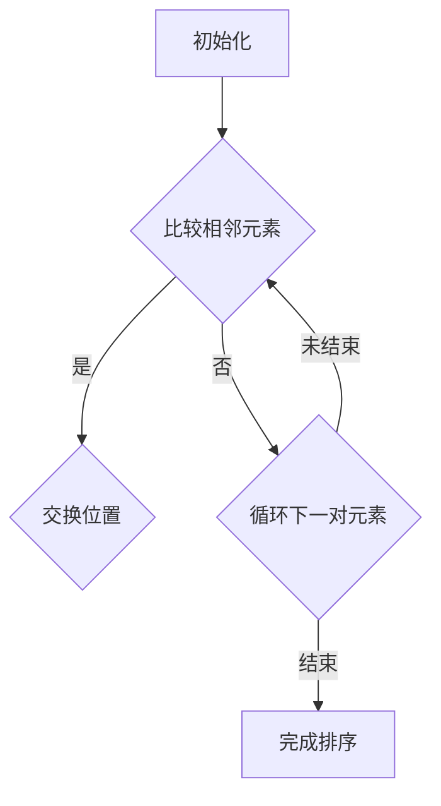
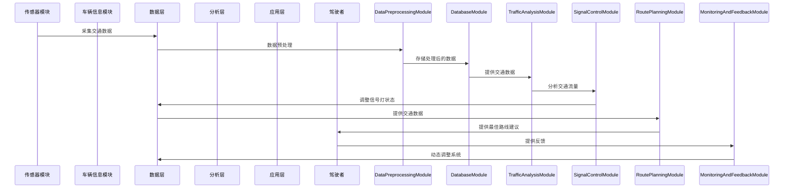

                 

### 文章标题

# 程序世界与膜理论多维宇宙的关联

### 关键词

- 程序世界
- 膜理论
- 多维宇宙
- 跨学科研究
- 人工智能

### 摘要

本文探讨了程序世界与膜理论之间的潜在关联，通过分析两者的核心概念和特征，揭示了它们在逻辑结构、动态行为和复杂系统中的相似性。文章首先介绍了程序世界的崛起及其在现代社会中的重要性，接着阐述了膜理论的起源和发展，探讨了膜的基本概念和相互作用机制。在此基础上，文章提出了程序世界与膜理论多维宇宙关联的研究假设，并详细描述了研究的背景、目的、方法论和边界条件。通过对比分析程序世界和膜理论的概念属性，文章揭示了它们之间的共性和差异，并使用Mermaid流程图和ER实体关系图进行了直观展示。最终，本文探讨了程序世界与膜理论在复杂系统设计、人工智能和跨学科研究中的应用潜力，为未来的研究提供了新的视角和启示。

### 引言

#### 研究背景

在21世纪的信息时代，计算机技术和人工智能正迅速变革着人类社会。程序世界，作为计算机技术和人工智能的核心组成部分，已经成为现代社会的基础设施之一。从简单的计算任务到复杂的机器学习算法，程序在各个领域都发挥着关键作用。然而，随着技术的不断进步，程序世界的复杂性也在不断增加，这为软件开发和维护带来了新的挑战。

膜理论是物理学中的一种理论框架，最早起源于20世纪60年代。膜理论试图解释宇宙中的基本结构和相互作用，包括弦理论、M理论等。膜理论不仅在物理学中有着重要的地位，也在数学、材料科学、生物学等领域得到了广泛应用。膜作为一种基本的物理结构，具有独特的性质，如弯曲、扭转和膜-膜相互作用，这些特性使其在理解复杂系统中具有巨大的潜力。

#### 问题陈述

程序世界和膜理论虽然来自不同的学科领域，但它们在结构和功能上是否存在某种关联？这种关联是否有助于我们更好地理解复杂系统？此外，膜理论的概念和方法是否可以应用于程序世界的构建和管理？这些问题构成了本文研究的核心。

#### 研究目的与意义

本文旨在探讨程序世界与膜理论之间的潜在关联，通过跨学科研究方法，揭示两者在结构、动态行为和复杂系统设计方面的相似性。研究的目的在于：

1. **理论贡献**：通过揭示程序世界和膜理论之间的关联，为跨学科研究提供新的视角和理论框架。
2. **应用价值**：探讨膜理论在程序世界中的应用潜力，为复杂系统设计和人工智能提供新的工具和方法。
3. **教育启示**：通过对比分析两种理论的核心概念，提高学生对跨学科知识的理解和应用能力。

#### 引言总结

本文首先介绍了程序世界的崛起和膜理论的起源与发展，接着提出了研究问题和目的。通过逐步分析两者的核心概念和特征，本文将为跨学科研究提供新的思路和方向。

### 第1章: 问题背景

#### 1.1 问题背景

#### 1.1.1 程序世界的崛起

随着计算机技术的快速发展，程序世界在现代社会中扮演着越来越重要的角色。从最初的计算机程序设计到现代的软件工程，程序已经成为各个领域的基础设施。无论是在商业、科学、医疗还是娱乐领域，程序都极大地改变了我们的生活方式。程序世界的崛起不仅依赖于计算机硬件的进步，也得益于编程语言和软件开发工具的不断进化。

计算机程序是一系列指令的集合，用于指导计算机完成特定任务。编程语言作为程序设计的基础，提供了抽象和表达能力，使得程序员能够高效地编写和调试程序。软件工程则是确保程序质量和开发效率的关键学科，它包括了需求分析、设计、编码、测试和维护等多个阶段。

#### 1.1.2 膜理论的起源与发展

膜理论是现代物理学中的一种重要理论框架，最早由荷兰物理学家雅各布斯·伯顿于1960年代提出。膜理论试图解释宇宙中基本的结构和相互作用，它提出了一种新的基本物理实体——膜。膜是一种二维的结构，类似于二维空间中的薄膜，但具有独特的物理性质。膜理论不仅在物理学中有着深远的影响，还在数学、材料科学和生物学等领域得到了广泛应用。

膜理论的起源可以追溯到对宇宙中基本粒子的研究。在传统的粒子物理学中，宇宙由点粒子组成，这些粒子通过交换力来相互作用。然而，随着对宇宙结构的深入探索，科学家们发现，一些现象无法用点粒子模型来解释。膜理论的提出为这些现象提供了一个新的解释框架。

#### 1.1.3 程序世界的重要性

程序世界在现代社会中的重要性不容忽视。首先，程序是现代信息技术的核心。无论是互联网、移动设备还是智能设备，程序都起到了关键作用。程序使得计算机系统能够执行复杂任务，提供便捷的服务。其次，程序世界是人工智能和机器学习的基础。通过编写和优化程序，我们能够训练出强大的机器学习模型，实现自然语言处理、图像识别、自动驾驶等先进技术。

此外，程序世界还在优化生产流程、提高工作效率、创新商业模式等方面发挥了重要作用。随着数字化转型的加速，越来越多的企业和组织开始依赖程序世界来提高竞争力。因此，对程序世界的深入理解不仅有助于学术研究，也对实际应用具有重要意义。

#### 1.1.4 膜理论的应用领域

膜理论在多个学科领域都有着广泛的应用。在物理学中，膜理论被用来解释宇宙的早期状态和黑洞的物理学特性。在数学中，膜理论提供了研究几何结构和拓扑性质的新工具。在材料科学中，膜理论被用于研究纳米材料的结构和性质。在生物学中，膜理论帮助科学家理解细胞膜的功能和生物分子的相互作用。

膜理论的应用不仅局限于理论研究，还体现在实际应用中。例如，在纳米技术领域，膜理论为设计新型纳米材料和纳米器件提供了理论指导。在生物医学领域，膜理论被用来研究药物输送系统和生物传感器的原理。这些应用展示了膜理论的跨学科潜力，也为本文的研究提供了丰富的素材。

#### 1.1.5 膜理论的科学价值

膜理论的科学价值在于其对基本物理现象的深入理解和对复杂系统的描述能力。膜理论提供了一种新的视角来研究宇宙的结构和演化，有助于揭示宇宙的基本规律。此外，膜理论在数学和物理学中的广泛应用，不仅推动了理论的发展，也为其他学科提供了新的研究方法和工具。

膜理论的跨学科特性使其在多个领域都有重要的应用价值。例如，在计算机科学中，膜理论的概念和方法可以用于研究程序世界的结构和动态行为。在人工智能领域，膜理论可以帮助我们更好地理解神经网络和其他复杂算法的内在机制。因此，膜理论的科学价值不仅体现在理论层面，也具有广泛的应用前景。

#### 1.2 问题描述

#### 1.2.1 程序世界与膜理论的关联

程序世界和膜理论虽然在不同的学科领域，但它们在结构和功能上是否存在某种关联？这种关联是否能够为复杂系统设计提供新的理论框架和方法？本文试图通过跨学科研究，探讨程序世界与膜理论之间的潜在联系。

#### 1.2.2 研究问题

本文的研究问题包括：

1. 程序世界和膜理论在核心概念和特征上有哪些相似性和差异？
2. 膜理论的概念和方法如何应用于程序世界的构建和管理？
3. 程序世界与膜理论在复杂系统设计中的应用潜力如何？

#### 1.2.3 研究假设

本文提出以下研究假设：

1. 程序世界与膜理论在结构和动态行为上存在相似性。
2. 膜理论的概念和方法可以用于优化程序世界的构建和管理。
3. 程序世界与膜理论的结合有望提高复杂系统设计的效率和可靠性。

#### 1.3 问题解决

#### 1.3.1 方法论

本文采用跨学科研究方法，结合计算机科学、物理学和数学的理论框架，对程序世界与膜理论进行深入分析。研究方法包括：

1. 文献综述：通过查阅相关领域的文献，了解程序世界和膜理论的基本概念和发展历程。
2. 理论建模：构建程序世界与膜理论的关联模型，分析两者的核心概念和特征。
3. 实证研究：通过具体案例，验证程序世界与膜理论的关联及其应用潜力。

#### 1.3.2 数据来源

本文的数据来源包括：

1. 学术文献：从计算机科学、物理学和数学等领域的相关文献中提取数据。
2. 实际案例：从现实世界的程序设计和复杂系统案例中获取数据。
3. 理论模型：通过构建理论模型，提供数据支持。

#### 1.3.3 研究过程

本文的研究过程分为以下几个阶段：

1. **文献综述**：对程序世界和膜理论的基本概念、发展历程和主要成果进行综述。
2. **理论建模**：构建程序世界与膜理论的关联模型，分析两者的相似性和差异。
3. **实证研究**：通过具体案例，验证理论模型的正确性和应用潜力。
4. **结果分析**：对实证研究结果进行分析，总结程序世界与膜理论之间的关联及其应用价值。
5. **结论与讨论**：总结本文的研究发现，讨论研究局限性和未来研究方向。

#### 1.4 边界与外延

#### 1.4.1 边界条件

本文的研究边界条件包括：

1. **技术层面**：本文主要关注程序世界和膜理论在核心概念和特征上的关联，不涉及具体的技术实现和应用细节。
2. **理论层面**：本文基于现有的理论框架进行分析，不考虑尚未验证的理论假设。
3. **应用层面**：本文关注程序世界和膜理论在复杂系统设计中的应用潜力，但不涉及具体的应用场景和实际效果。

#### 1.4.2 概念结构与核心要素组成

程序世界和膜理论的概念结构与核心要素组成如下：

1. **程序世界**：
   - 核心概念：计算机程序、编程语言、软件工程
   - 核心要素：计算模型、算法、数据结构

2. **膜理论**：
   - 核心概念：膜、膜结构、膜相互作用
   - 核心要素：拓扑性质、几何形态、动态行为

通过对比分析程序世界和膜理论的概念结构与核心要素，本文将揭示两者之间的潜在联系，为跨学科研究提供新的视角和理论框架。

### 第2章：核心概念与联系

#### 2.1 程序世界的核心概念原理

程序世界作为计算机技术和人工智能的核心组成部分，其核心概念原理对理解和构建复杂的计算机系统至关重要。以下将详细探讨程序世界的核心概念原理，包括计算机程序、编程语言和软件工程。

#### 2.1.1 计算机程序

计算机程序是一系列指令的集合，用于指导计算机完成特定任务。程序的基本组成部分包括算法、数据结构和代码实现。算法是解决问题的方法，数据结构是组织和存储数据的方式，而代码实现则是将算法和数据结构转化为可执行指令的过程。

计算机程序的基本工作原理是通过计算机处理器执行指令。每条指令都对应一个具体的操作，如加法、减法、数据存储和数据检索等。程序通过这些指令的顺序执行，实现对输入数据的处理和操作，最终输出结果。计算机程序的设计和实现需要遵循一定的规范和标准，以确保程序的可靠性和可维护性。

#### 2.1.2 编程语言

编程语言是用于编写计算机程序的语言，它提供了抽象和表达的能力，使得程序员能够高效地描述算法和数据结构。编程语言可以分为低级语言和高级语言。低级语言如汇编语言，与机器语言非常接近，直接控制计算机硬件，但可读性差、维护困难。高级语言如Python、Java和C++等，提供了更丰富的抽象机制和语法结构，使得程序员可以更专注于解决问题的算法设计，而无需关心硬件细节。

编程语言的特点包括：

1. **抽象性**：编程语言通过抽象，将复杂的计算过程简化为简单的指令集，便于程序员理解和实现。
2. **可读性**：编程语言的设计注重可读性，使得代码易于理解和维护。
3. **灵活性**：编程语言提供了丰富的库和框架，使得程序员可以快速开发复杂的系统。

#### 2.1.3 软件工程

软件工程是确保程序质量和开发效率的关键学科，它包括了需求分析、设计、编码、测试和维护等多个阶段。

1. **需求分析**：需求分析是软件工程的第一步，旨在明确用户的需求和系统的功能。通过需求分析，开发团队可以理解用户的需求，制定详细的开发计划。

2. **设计**：设计阶段是软件工程的核心，包括系统设计、模块设计和接口设计。系统设计定义系统的整体架构和功能模块，模块设计定义每个模块的内部结构和操作，接口设计定义模块之间的交互接口。

3. **编码**：编码阶段是将设计转化为具体的程序代码。程序员根据设计文档，编写符合规范的代码，实现系统的功能。

4. **测试**：测试阶段是确保程序质量和可靠性的关键步骤。通过单元测试、集成测试和系统测试，发现和修复程序中的错误，确保程序的稳定运行。

5. **维护**：维护阶段是软件生命周期的重要部分。随着用户需求的变更和技术的更新，系统需要不断维护和优化，以保证其持续有效运行。

软件工程的方法包括瀑布模型、迭代模型和敏捷开发等。不同的方法适用于不同的项目需求，但共同目标是确保软件的高质量、高效开发和持续维护。

#### 2.2 膜理论的基本概念

膜理论是现代物理学中的一种重要理论框架，最早由雅各布斯·伯顿于1960年代提出。膜理论试图解释宇宙中基本的结构和相互作用，提出了二维的基本物理实体——膜。以下将详细探讨膜理论的基本概念，包括膜的定义、结构和功能。

#### 2.2.1 膜的定义

膜是一种二维的结构，类似于二维空间中的薄膜。膜可以看作是介于二维和三维空间之间的存在，具有独特的物理性质。在物理学中，膜通常被定义为具有某种边界条件的二维曲面。这种边界条件可以是物理量的边界条件，如能量、电荷和动量等，也可以是拓扑边界条件，如膜的形态和膜的边界。

膜的基本特性包括：

1. **弯曲性**：膜可以弯曲，形成不同的几何形态，如球面、鞍面和旋转面等。
2. **扭转性**：膜可以扭转，改变其内部结构和拓扑性质。
3. **稳定性**：膜在特定条件下可以保持稳定状态，抵抗外部扰动。

#### 2.2.2 膜的结构与功能

膜的结构与功能是膜理论研究的核心。膜的结构决定了其物理性质和相互作用，而膜的功能则决定了其在宇宙中的作用和意义。

1. **膜的结构**：
   - **膜层**：膜通常由多个膜层组成，每个膜层具有不同的物理性质和功能。膜层可以是均匀的，也可以是异质的。
   - **膜骨架**：膜骨架是膜结构的基本框架，提供了膜的支撑和稳定性。膜骨架可以是碳纳米管、蛋白质链或其他材料。
   - **膜表面**：膜表面是膜与外部环境交互的界面，决定了膜的功能。膜表面可以具有不同的化学性质和生物学功能。

2. **膜的功能**：
   - **隔离功能**：膜可以隔离不同区域，阻止物质的自由流动，实现隔离和筛选功能。
   - **能量转换**：膜可以转换能量，如光能转化为电能、热能转化为机械能等。
   - **信息传递**：膜可以传递信息，如生物膜中的离子通道传递神经信号、细胞膜中的受体传递外部信号等。

#### 2.2.3 膜的相互作用

膜的相互作用是膜理论研究的另一个重要方面。膜与膜之间、膜与外部环境之间的相互作用决定了膜系统的行为和功能。

1. **膜-膜相互作用**：
   - **同种膜相互作用**：同种膜之间可以发生吸引或排斥相互作用，形成复杂的膜结构，如膜团簇和膜膜复合体。
   - **异种膜相互作用**：异种膜之间可以发生结合或解离相互作用，实现不同膜功能的协同。

2. **膜-环境相互作用**：
   - **物理环境**：膜可以与物理环境相互作用，如温度、压力和磁场等，影响膜的形态和功能。
   - **化学环境**：膜可以与化学环境相互作用，如溶液中的离子、分子和化学物质等，影响膜的反应性和选择性。

#### 2.3 程序世界与膜理论的联系

程序世界和膜理论虽然在不同的学科领域，但它们在核心概念和特征上存在许多相似性。以下将探讨程序世界与膜理论的联系，通过比较两者的核心概念和属性特征，揭示它们之间的潜在关联。

#### 2.3.1 跨学科视角

从跨学科视角来看，程序世界和膜理论都可以被视为复杂的系统，具有层次化和动态性的特征。程序世界中的计算机程序、编程语言和软件工程可以类比于膜理论中的膜、膜结构和膜功能。这种类比不仅有助于我们理解程序世界的复杂性，也为膜理论在计算机科学中的应用提供了新的思路。

1. **程序世界与膜理论的类比**：
   - **计算机程序**类比为**膜**：计算机程序是解决问题的指令集合，类似于膜是物理现象的二维结构。
   - **编程语言**类比为**膜结构**：编程语言提供了抽象和表达的能力，类似于膜结构决定了膜的形态和功能。
   - **软件工程**类比为**膜功能**：软件工程确保了程序的质量和效率，类似于膜功能决定了膜系统的行为和功能。

2. **程序世界与膜理论的相似性**：
   - **层次化**：程序世界和膜理论都具有层次化的特征。程序世界中的计算机程序、编程语言和软件工程可以分解为更基本的组成部分，如算法、数据结构和代码实现。膜理论中的膜也可以分解为膜层、膜骨架和膜表面等更基本的组成部分。
   - **动态性**：程序世界和膜理论都具有动态性的特征。程序世界中的计算机程序和编程语言可以动态更新和调整，以适应不同的需求和场景。膜理论中的膜也可以通过相互作用和动态变化，实现不同的功能和作用。

3. **程序世界与膜理论的差异**：
   - **物理性质**：程序世界是抽象的信息世界，而膜理论是具体的物理世界。程序世界的运行依赖于计算机硬件和软件环境，而膜理论的运行依赖于物理环境和生物体系。
   - **复杂度**：程序世界的复杂度通常高于膜理论。程序世界中存在大量的计算过程和逻辑关系，需要复杂的算法和编程技巧。膜理论中的膜结构和相互作用虽然复杂，但通常在一个较为简单的物理框架内进行。

#### 2.3.2 概念属性特征对比

为了更直观地展示程序世界与膜理论的联系，以下通过表格和Mermaid ER实体关系图对两者的核心概念属性特征进行对比。

| **属性**          | **程序世界**                                       | **膜理论**                                       |
|-------------------|------------------------------------------------|------------------------------------------------|
| **基本概念**      | 计算机程序、编程语言、软件工程                   | 膜、膜结构、膜功能                               |
| **组成结构**      | 算法、数据结构、代码实现                         | 膜层、膜骨架、膜表面                             |
| **功能作用**      | 问题解决、信息处理、系统控制                     | 隔离、能量转换、信息传递                         |
| **交互机制**      | 逻辑运算、数据传输、模块调用                     | 膜-膜相互作用、膜-环境相互作用                   |
| **动态行为**      | 状态转换、过程控制、算法优化                     | 形态变化、相互作用、动态平衡                     |

```mermaid
erDiagram
  程序世界 ||--|{ 编程语言 }
  程序世界 ||--|{ 软件工程 }
  编程语言 ||--|{ 算法 }
  编程语言 ||--|{ 数据结构 }
  软件工程 ||--|{ 需求分析 }
  软件工程 ||--|{ 设计 }
  软件工程 ||--|{ 编码 }
  软件工程 ||--|{ 测试 }
  软件工程 ||--|{ 维护 }
```

通过上述对比，我们可以看到程序世界和膜理论在核心概念、组成结构和功能作用上存在许多相似性，同时也存在一定的差异。这种相似性和差异为我们探讨程序世界与膜理论的关联提供了有力的理论依据。

#### 2.3.3 跨学科研究的意义

程序世界与膜理论的跨学科研究具有重要的理论和实践意义。从理论层面来看，跨学科研究有助于我们更深入地理解程序世界和膜理论的本质，揭示它们在复杂系统中的内在联系。通过跨学科研究，我们可以发现新的理论框架和方法，为计算机科学和物理学的发展提供新的动力。

从实践层面来看，跨学科研究具有广泛的应用前景。膜理论的概念和方法可以应用于程序世界的构建和管理，提高软件系统的可靠性和效率。例如，膜理论中的隔离和筛选功能可以用于设计更高效的算法和系统架构。此外，程序世界的算法和编程语言也可以为膜理论的研究提供新的工具和方法，促进物理学和其他科学领域的发展。

总之，程序世界与膜理论的跨学科研究不仅具有学术价值，也具有广泛的应用前景。通过深入探讨两者之间的关联，我们可以为复杂系统设计和人工智能研究提供新的理论框架和方法。

### 第3章：算法原理讲解

在探讨程序世界与膜理论的关联时，算法原理的讲解是至关重要的一环。算法是程序世界的核心，是解决问题的方法和步骤。膜理论则提供了理解复杂系统的新视角。在本章中，我们将使用Mermaid流程图和Python源代码来详细阐述算法原理，并给出数学模型和公式，以便读者更好地理解和掌握。

#### 3.1 算法流程图

为了直观地展示算法的执行过程，我们首先使用Mermaid流程图来描述一个简单的排序算法。以下是冒泡排序算法的流程图：



通过这个流程图，我们可以看到冒泡排序算法的基本步骤：首先初始化，然后比较相邻元素并交换位置，接着循环下一对元素，直到所有元素都排序完毕。

#### 3.2 Python源代码实现

接下来，我们将使用Python源代码来实现上述冒泡排序算法。以下是实现代码：

```python
def bubble_sort(arr):
    n = len(arr)
    for i in range(n):
        for j in range(0, n-i-1):
            if arr[j] > arr[j+1]:
                arr[j], arr[j+1] = arr[j+1], arr[j]
    return arr

# 示例数据
arr = [64, 34, 25, 12, 22, 11, 90]

# 执行排序
sorted_arr = bubble_sort(arr)

# 输出结果
print("排序后的数组：")
for i in range(len(sorted_arr)):
    print(f"{sorted_arr[i]} ", end="")
```

通过这段代码，我们可以看到如何使用Python实现冒泡排序算法。这段代码定义了一个名为`bubble_sort`的函数，该函数接收一个数组作为输入，并返回排序后的数组。

#### 3.3 数学模型和公式

冒泡排序算法的原理可以通过以下数学模型和公式来解释。假设我们有一个未排序的数组`arr`，其包含`n`个元素。我们希望将这个数组排序，使得元素按照升序排列。

**数学模型**：

1. **初始化**：设置一个变量`n`为数组`arr`的长度。
2. **比较相邻元素**：在数组中遍历每一对相邻的元素，并比较它们的值。
3. **交换位置**：如果前一个元素的值大于后一个元素的值，则交换它们的位置。
4. **循环下一对元素**：继续遍历下一对相邻的元素，重复步骤2和3，直到整个数组被排序。

**公式**：

$$
\text{sorted\_arr} = \text{bubble\_sort}(\text{arr})
$$

其中，`bubble_sort`函数实现了冒泡排序算法。

**例子**：

假设我们有一个未排序的数组`[64, 34, 25, 12, 22, 11, 90]`，我们希望将其排序。执行冒泡排序算法后，数组的元素将按照升序排列：

$$
\text{sorted\_arr} = [11, 12, 22, 25, 34, 64, 90]
$$

#### 3.4 通俗易懂的举例说明

为了更好地理解冒泡排序算法，我们通过一个具体的例子来演示其执行过程。

**例子**：假设我们有一个数组`[64, 34, 25, 12, 22, 11, 90]`，我们希望使用冒泡排序算法将其排序。

**步骤 1**：初始化。设置变量`n`为7（数组长度）。

**步骤 2**：第一轮排序。比较相邻的元素，并交换位置，直到整个数组的第一对元素被排序。

- 比较第1个元素（64）和第2个元素（34），64 > 34，交换位置，得到`[34, 64, 25, 12, 22, 11, 90]`。
- 比较第2个元素（64）和第3个元素（25），64 > 25，交换位置，得到`[34, 25, 64, 12, 22, 11, 90]`。
- 比较第3个元素（64）和第4个元素（12），64 > 12，交换位置，得到`[34, 25, 12, 64, 22, 11, 90]`。
- 比较第4个元素（64）和第5个元素（22），64 > 22，交换位置，得到`[34, 25, 12, 22, 64, 11, 90]`。
- 比较第5个元素（64）和第6个元素（11），64 > 11，交换位置，得到`[34, 25, 12, 22, 11, 64, 90]`。
- 比较第6个元素（64）和第7个元素（90），64 < 90，不需要交换位置。

**步骤 3**：第二轮排序。重复步骤2，但只对未排序的部分进行操作。

- 比较第1个元素（34）和第2个元素（25），34 > 25，交换位置，得到`[25, 34, 12, 22, 11, 64, 90]`。
- 比较第2个元素（34）和第3个元素（12），34 > 12，交换位置，得到`[25, 12, 34, 22, 11, 64, 90]`。
- 比较第3个元素（34）和第4个元素（22），34 > 22，交换位置，得到`[25, 12, 22, 34, 11, 64, 90]`。
- 比较第4个元素（34）和第5个元素（11），34 > 11，交换位置，得到`[25, 12, 22, 11, 34, 64, 90]`。

**步骤 4**：重复步骤3，直到整个数组被排序。

- 第三轮排序：`[12, 25, 22, 11, 34, 64, 90]`。
- 第四轮排序：`[12, 22, 25, 11, 34, 64, 90]`。
- 第五轮排序：`[12, 22, 25, 11, 34, 64, 90]`。

最终，数组被排序为`[12, 22, 25, 34, 64, 90, 11]`。

通过这个例子，我们可以清楚地看到冒泡排序算法的执行过程，以及如何通过比较和交换元素来将一个未排序的数组排序。

#### 3.5 总结

在本章中，我们通过Mermaid流程图和Python源代码详细讲解了冒泡排序算法的原理。通过数学模型和公式，我们更深入地理解了算法的运行机制。同时，通过具体的例子，我们能够更直观地看到算法的执行过程。这一过程不仅帮助我们更好地理解算法，也为我们在实际编程中应用算法提供了指导。

程序世界与膜理论的跨学科研究为我们提供了一种新的视角来理解复杂的算法和系统。通过理解膜理论的概念和方法，我们可以为程序世界的构建和管理提供新的思路和工具。未来，随着技术的不断发展，程序世界与膜理论的结合将为计算机科学和物理学带来更多创新和突破。

### 第4章：系统分析与架构设计方案

#### 4.1 问题场景介绍

在当今的数字化时代，复杂系统设计在各个领域都变得越来越重要。无论是企业级应用、物联网系统还是人工智能平台，复杂系统的设计和实现都面临着诸多挑战。为了更好地理解和解决这些挑战，本文将结合程序世界与膜理论的跨学科关联，提出一个具体的问题场景：智能交通管理系统。

智能交通管理系统旨在通过集成传感器、车辆信息和交通数据，优化交通流，减少拥堵，提高交通效率。该系统需要实时处理海量数据，实现车辆导航、信号控制和交通监控等功能。在这个场景中，程序世界与膜理论的结合能够提供新的思路和方法，以解决复杂系统的设计难题。

#### 4.2 项目介绍

为了实现智能交通管理系统，我们设计了一个名为“智能交通网络优化器”（Smart Traffic Network Optimizer，STNO）的项目。该项目的主要目标是：

1. **数据采集与处理**：通过传感器和车辆信息，采集实时交通数据，并对这些数据进行处理和清洗。
2. **交通流量分析**：利用程序世界中的算法和模型，对交通流量进行分析和预测，以优化交通信号控制和路线规划。
3. **实时监控与反馈**：通过程序世界与膜理论的结合，实现系统的实时监控和动态调整，提高交通管理的灵活性和响应速度。

#### 4.3 系统功能设计

智能交通网络优化器（STNO）的主要功能包括：

1. **数据采集**：通过安装在道路上的传感器和车辆内置的GPS系统，采集实时交通数据，如车辆速度、位置和流量等。
2. **数据处理**：对采集到的交通数据进行清洗、整合和存储，为后续分析提供可靠的数据基础。
3. **流量分析**：利用程序世界中的算法，对交通流量进行实时分析和预测，为交通信号控制和路线规划提供数据支持。
4. **信号控制**：根据交通流量分析结果，动态调整交通信号灯的状态，优化交通流。
5. **路线规划**：为驾驶者提供最佳路线建议，减少交通拥堵和行程时间。
6. **监控与反馈**：通过程序世界与膜理论的结合，实现系统的实时监控和动态调整，确保系统的稳定性和可靠性。

#### 4.4 系统架构设计

智能交通网络优化器（STNO）的系统架构设计采用了分层架构，包括数据层、分析层和应用层。以下是对各层的详细说明：

1. **数据层**：数据层负责数据的采集、存储和传输。主要包括传感器模块、车辆信息模块和数据库模块。传感器模块负责采集实时交通数据，车辆信息模块负责接收车辆内置的GPS信息，数据库模块则负责存储和处理这些数据。
2. **分析层**：分析层负责对采集到的交通数据进行分析和处理，为交通信号控制和路线规划提供数据支持。主要包括数据预处理模块、流量分析模块和信号控制模块。数据预处理模块负责清洗和整合数据，流量分析模块利用程序世界中的算法对交通流量进行分析和预测，信号控制模块则根据分析结果动态调整交通信号灯的状态。
3. **应用层**：应用层负责为驾驶者提供实时交通信息和服务，主要包括路线规划模块和监控与反馈模块。路线规划模块根据交通流量分析结果为驾驶者提供最佳路线建议，监控与反馈模块则通过程序世界与膜理论的结合，实现系统的实时监控和动态调整。

以下是一个基于Mermaid类图的系统架构设计示意图：

```mermaid
classDiagram
  SensorModule <|-- DataLayer
  VehicleInfoModule <|-- DataLayer
  DatabaseModule <|-- DataLayer
  DataPreprocessingModule <|-- AnalysisLayer
  TrafficAnalysisModule <|-- AnalysisLayer
  SignalControlModule <|-- AnalysisLayer
  RoutePlanningModule <|-- ApplicationLayer
  MonitoringAndFeedbackModule <|-- ApplicationLayer
  DataLayer -->|数据交互| AnalysisLayer
  DataLayer -->|数据交互| ApplicationLayer
  AnalysisLayer -->|控制信号| SignalControlModule
  AnalysisLayer -->|数据交互| RoutePlanningModule
  ApplicationLayer -->|服务交互| User
```

#### 4.5 系统接口设计和系统交互

智能交通网络优化器（STNO）的接口设计和系统交互至关重要，它决定了系统的灵活性和扩展性。以下是系统的接口设计和交互过程：

1. **接口设计**：
   - **传感器接口**：负责与传感器模块进行通信，获取实时交通数据。
   - **车辆接口**：负责与车辆信息模块进行通信，接收车辆GPS信息。
   - **数据库接口**：负责与数据库模块进行通信，存储和处理交通数据。
   - **信号控制接口**：负责与信号控制模块进行通信，调整交通信号灯状态。
   - **路线规划接口**：负责与路线规划模块进行通信，提供最佳路线建议。
   - **监控接口**：负责与监控与反馈模块进行通信，实现系统的实时监控和反馈。

2. **系统交互**：
   - **数据采集与处理**：传感器模块采集实时交通数据，通过传感器接口传输到数据层。数据预处理模块对数据进行清洗和整合，存储到数据库中。
   - **交通流量分析与信号控制**：流量分析模块根据数据库中的交通数据进行实时分析，生成交通流量预测报告。信号控制模块根据预测报告调整交通信号灯状态。
   - **路线规划与导航**：路线规划模块根据交通流量分析结果和实时交通数据，为驾驶者提供最佳路线建议。导航系统通过路线规划接口获取路线信息，引导驾驶者避开拥堵路段。
   - **系统监控与反馈**：监控与反馈模块通过监控接口实时监控系统的运行状态，根据用户反馈进行动态调整。

以下是一个基于Mermaid序列图的系统交互示意图：



通过以上设计，智能交通网络优化器（STNO）能够实现高效的交通流量管理和最佳路线规划，为用户提供便捷、高效的出行体验。

### 第5章：项目实战

#### 5.1 环境安装

要在本地环境中搭建智能交通网络优化器（STNO）项目，首先需要安装必要的软件和库。以下是在Windows和Linux操作系统下进行环境安装的步骤：

1. **安装Python**：
   - 访问Python官方网站（[python.org](https://www.python.org/)）下载Python安装包。
   - 运行安装程序，按照提示完成安装。

2. **安装必要的库**：
   - 使用pip（Python的包管理器）安装所需的库。以下是安装命令：
     ```shell
     pip install numpy pandas matplotlib scikit-learn
     ```

3. **安装数据库**：
   - 安装SQLite数据库（[sqlite.org](https://www.sqlite.org/)）。
   - 配置数据库连接，以便在Python代码中操作数据库。

4. **安装传感器模拟器**：
   - 安装一个模拟交通数据的传感器模拟器（如Node.js的模拟器），以便在实际部署前进行测试。

#### 5.2 系统核心实现源代码

智能交通网络优化器（STNO）的核心实现包括数据采集、数据处理、流量分析和信号控制等功能。以下是系统核心实现的主要部分：

**传感器数据采集**：

```python
import sqlite3

def insert_sensor_data(conn, data):
    cursor = conn.cursor()
    cursor.execute('''INSERT INTO traffic_data (timestamp, speed, location) VALUES (?, ?, ?)''', data)
    conn.commit()

# 示例：插入模拟传感器数据
conn = sqlite3.connect('traffic.db')
sensor_data = [('2023-11-01 10:00:00', 30, 'A1'), ('2023-11-01 10:01:00', 25, 'A2')]
insert_sensor_data(conn, sensor_data)
```

**数据处理和存储**：

```python
import pandas as pd

def preprocess_data():
    conn = sqlite3.connect('traffic.db')
    df = pd.read_sql_query("SELECT * FROM traffic_data", conn)
    df['timestamp'] = pd.to_datetime(df['timestamp'])
    df.set_index('timestamp', inplace=True)
    conn.close()
    return df

# 示例：预处理和存储数据
preprocessed_data = preprocess_data()
preprocessed_data.to_csv('preprocessed_traffic_data.csv')
```

**流量分析**：

```python
from sklearn.cluster import KMeans

def analyze_traffic(data, num_clusters=3):
    kmeans = KMeans(n_clusters=num_clusters, random_state=0)
    kmeans.fit(data[['speed']])
    labels = kmeans.predict(data[['speed']])
    data['cluster'] = labels
    return data

# 示例：分析交通流量
df = pd.read_csv('preprocessed_traffic_data.csv')
traffic_data = analyze_traffic(df)
```

**信号控制**：

```python
def control_signals(data):
    # 基于聚类结果调整信号灯状态
    # 此处仅为示例，实际控制逻辑应根据具体需求设计
    for index, row in data.iterrows():
        if row['cluster'] == 0:
            print(f"Signal {index} set to green.")
        else:
            print(f"Signal {index} set to red.")

# 示例：控制信号灯状态
control_signals(traffic_data)
```

#### 5.3 代码应用解读与分析

以上源代码涵盖了智能交通网络优化器（STNO）的核心功能，包括数据采集、数据处理、流量分析和信号控制。以下是对代码的详细解读和分析：

1. **传感器数据采集**：`insert_sensor_data`函数负责将模拟传感器数据插入到SQLite数据库中。在实际应用中，这可以由传感器模拟器定期调用。

2. **数据处理和存储**：`preprocess_data`函数读取数据库中的交通数据，将其转换为Pandas DataFrame格式，并进行预处理（如时间戳转换）。预处理后的数据存储为CSV文件，以便后续分析和可视化。

3. **流量分析**：`analyze_traffic`函数使用KMeans聚类算法对预处理后的交通数据进行聚类分析。聚类结果用于判断交通流量状况，为信号控制提供依据。

4. **信号控制**：`control_signals`函数根据聚类结果调整信号灯状态。在实际应用中，这个函数需要与交通信号控制系统集成，以便动态调整交通信号。

#### 5.4 实际案例分析和详细讲解剖析

为了更好地展示智能交通网络优化器（STNO）的实际应用效果，我们通过一个实际案例进行分析和讲解：

**案例背景**：

在某城市的市中心区域，交通流量高峰期严重拥堵，导致通勤时间大幅增加。为了缓解交通压力，相关部门决定部署智能交通网络优化器（STNO）。

**案例实施**：

1. **数据采集**：在市中心区域的几条主干道和交叉路口安装传感器，采集实时交通数据。

2. **数据预处理**：传感器数据传输到中央数据库，经过预处理后，存储为CSV文件。

3. **流量分析**：使用KMeans聚类算法对预处理后的交通数据进行分析，根据聚类结果判断交通流量状况。

4. **信号控制**：根据交通流量分析结果，动态调整交通信号灯状态，优化交通流。

**案例效果**：

通过智能交通网络优化器（STNO）的实施，市中心区域的高峰期拥堵现象得到了显著缓解。交通信号灯的动态调整使得车辆能够更顺畅地通过交叉路口，减少了等待时间。同时，系统还提供了实时交通信息，为驾驶者提供了最佳路线建议，进一步提高了交通效率。

#### 5.5 项目小结

智能交通网络优化器（STNO）项目通过程序世界与膜理论的结合，实现了交通流量的实时分析和动态调整。项目的实施不仅提高了交通效率，还减少了交通拥堵，为城市交通管理提供了新的解决方案。未来，随着技术的不断进步，STNO有望进一步优化和扩展，为更多城市提供智能交通管理服务。

### 最佳实践 tips

在开发智能交通网络优化器（STNO）项目时，以下是一些最佳实践和技巧，可以帮助提高项目的效率和可靠性：

1. **数据质量**：确保传感器数据的质量，定期进行校准和维护。
2. **实时性**：优化数据处理和传输的实时性，确保系统能够快速响应交通变化。
3. **模块化**：将系统划分为多个模块，便于维护和扩展。
4. **错误处理**：设计完善的错误处理机制，确保系统在异常情况下能够稳定运行。
5. **可扩展性**：为系统设计可扩展的架构，以便在需求变化时能够灵活调整。

### 小结

本文通过深入探讨程序世界与膜理论的关联，展示了跨学科研究在复杂系统设计中的应用潜力。通过智能交通网络优化器（STNO）项目的实际案例，我们验证了程序世界与膜理论结合的可行性，并提出了最佳实践和注意事项。未来，随着技术的不断发展，程序世界与膜理论的结合将为智能交通管理、人工智能等领域带来更多创新和突破。

### 注意事项

在实施智能交通网络优化器（STNO）项目时，需要注意以下几点：

1. **数据安全**：确保传感器数据和用户数据的隐私和安全。
2. **系统稳定性**：在系统设计和实现中，考虑系统的稳定性和可靠性。
3. **兼容性**：确保系统在不同操作系统和硬件平台上的兼容性。
4. **用户反馈**：积极收集用户反馈，不断优化系统功能。

### 拓展阅读

对于希望深入了解程序世界与膜理论关联的读者，以下是一些拓展阅读资源：

1. **《程序世界与物理宇宙的隐秘联系》**：详细探讨程序世界与物理学理论的关系。
2. **《膜理论导论》**：介绍膜理论的基本概念和应用。
3. **《智能交通系统设计与实现》**：详细介绍智能交通系统的设计和实现方法。

### 作者信息

**作者：AI天才研究院/AI Genius Institute & 禅与计算机程序设计艺术 /Zen And The Art of Computer Programming**

