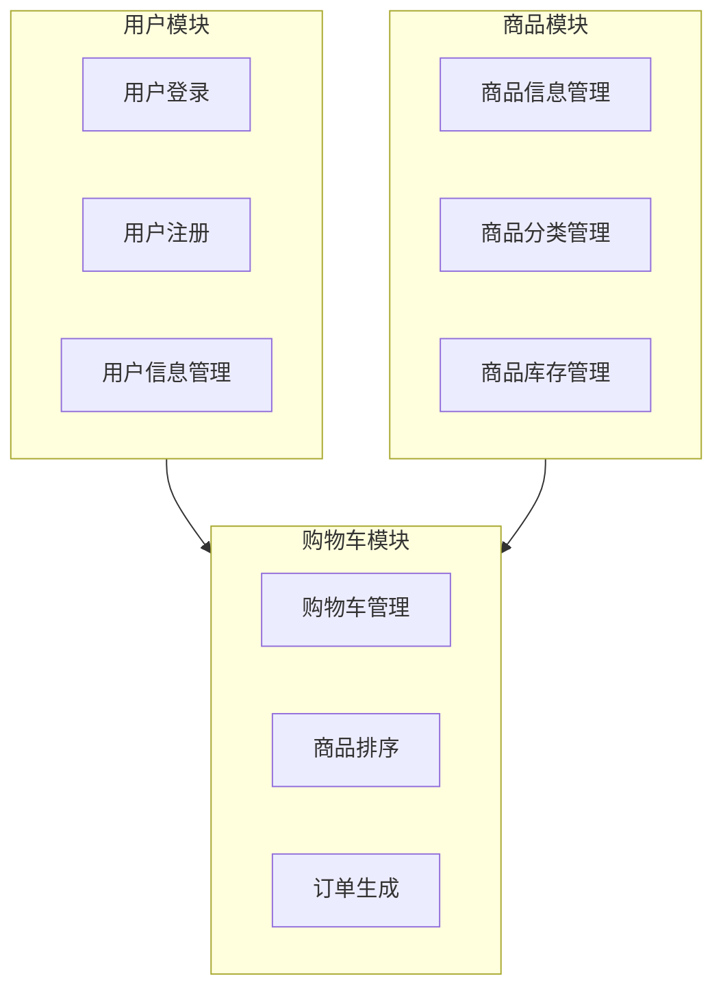

                 


# 程序世界中的宇宙级递归模式

## 关键词
- 递归模式
- 程序设计
- 算法
- 数学模型
- 系统架构

## 摘要
本文将深入探讨程序世界中的宇宙级递归模式，从基础概念出发，逐步深入到递归模式在各种程序设计中的应用。我们将分析递归模式的优点和缺点，并通过具体的算法原理讲解和数学模型阐述，帮助读者理解递归模式的核心和精髓。最后，我们将通过实际项目实战，展示递归模式在系统架构设计中的关键作用，并提供最佳实践和注意事项。

## 引言
递归是一种非常重要的程序设计模式，它通过函数的自身调用实现问题求解。递归模式在程序世界中有着广泛的应用，尤其在算法设计和系统架构设计中，递归模式展现出了强大的功能和灵活性。然而，递归模式并非没有缺点，正确地使用递归模式对于程序的效率和稳定性至关重要。本文将系统地探讨递归模式，旨在帮助读者深入理解递归模式的原理和应用。

## 背景介绍

### 递归的概念

递归（Recursion）是一种编程技巧，指的是函数直接或间接地调用自身来解决问题。递归可以分为直接递归和间接递归。直接递归是指函数直接调用自身，而间接递归是指通过其他函数间接地调用自身。

递归的几个关键组成部分包括：

- **基础条件**：递归调用必须有一个明确的结束条件，否则会导致无限循环。
- **递归步骤**：每次递归调用都会向基础条件逼近，直到达到结束条件。
- **状态变化**：每次递归调用都会带来状态的变化，这些变化有助于问题的逐步解决。

### 递归的历史

递归的概念可以追溯到计算机科学和数学的早期历史。在20世纪，递归在算法设计和数学证明中得到了广泛应用。递归函数的引入，使得许多复杂的问题可以通过简洁的函数定义来求解。

著名的递归算法包括：

- **欧几里得算法**：用于求解最大公约数。
- **递归排序算法**：如快速排序和归并排序。
- **递归搜索算法**：如深度优先搜索（DFS）和广度优先搜索（BFS）。

### 递归在程序设计中的重要性

递归模式在程序设计中的重要性体现在以下几个方面：

1. **简洁性**：递归使得复杂问题的解决方案往往可以以简洁的代码形式表达。
2. **效率**：许多递归算法在时间复杂度和空间复杂度上具有很高的效率。
3. **模块化**：递归可以将复杂的问题分解为子问题，使得代码更加模块化。
4. **递推关系**：许多数学问题和算法可以通过递推关系进行递归描述。

## 核心概念与联系

### 递归的类型与特点

递归可以分为以下几种类型：

1. **直接递归**：函数直接调用自身。
2. **间接递归**：通过其他函数间接调用自身。
3. **尾递归**：递归调用是函数调用的最后一步，这种递归可以通过优化转化为迭代，提高效率。

递归的特点包括：

- **简洁性**：递归可以以较少的代码量实现复杂的功能。
- **动态性**：递归能够处理动态生成的问题，如动态规划问题。
- **层次性**：递归将问题分解为多个层次，每个层次都可以独立解决。

### 递归的优缺点

递归的优点包括：

- **简洁性**：递归模式使得代码更加简洁，易于理解和维护。
- **模块化**：递归可以将复杂问题分解为子问题，提高代码的模块化程度。
- **适用性**：递归适用于许多数学和算法问题，尤其适合处理层次结构和递推关系。

递归的缺点包括：

- **效率问题**：递归可能会导致大量重复计算，影响程序性能。
- **栈溢出**：递归深度过大会导致栈溢出，导致程序崩溃。
- **调试困难**：递归中的函数调用层次较多，调试相对困难。

### 递归与其他编程模式的比较

递归与其他编程模式（如循环、迭代）的比较如下：

1. **循环**：循环适用于迭代问题，但相比递归，循环在处理复杂问题时代码量通常更大。
2. **迭代**：迭代是递归的一种优化形式，可以减少递归带来的栈溢出和性能问题。
3. **分治**：分治模式与递归模式类似，都是通过将问题分解为子问题来求解，但分治通常更适用于解决独立子问题。

## 算法原理讲解

### 经典递归算法

下面介绍几种经典的递归算法：

#### 斐波那契数列

斐波那契数列（Fibonacci sequence）是递归算法的一个经典例子。数列定义如下：

$$
F(0) = 0, F(1) = 1 \\
F(n) = F(n-1) + F(n-2) \quad (n \geq 2)
$$

递归实现如下（Python代码）：

```python
def fibonacci(n):
    if n == 0:
        return 0
    elif n == 1:
        return 1
    else:
        return fibonacci(n-1) + fibonacci(n-2)
```

#### 快速排序

快速排序（Quick Sort）是一种高效的排序算法，它使用递归方式将数组划分为有序的子数组。快速排序的基本思想是通过一趟排序将数组划分为两部分，其中一部分的所有元素都比另一部分的所有元素要小，然后再按此方法对这两部分分别进行快速排序。

快速排序的递归实现如下（Python代码）：

```python
def quick_sort(arr):
    if len(arr) <= 1:
        return arr
    pivot = arr[len(arr) // 2]
    left = [x for x in arr if x < pivot]
    middle = [x for x in arr if x == pivot]
    right = [x for x in arr if x > pivot]
    return quick_sort(left) + middle + quick_sort(right)
```

### 数学模型和公式

递归算法通常可以用数学模型和公式来描述。以下是对上面提到的两种算法的数学模型和公式的详细讲解。

#### 斐波那契数列的数学模型

斐波那契数列的递推关系可以用数学公式表示为：

$$
F(n) = F(n-1) + F(n-2)
$$

对于初始条件：

$$
F(0) = 0, F(1) = 1
$$

可以使用矩阵形式来描述斐波那契数列的递推关系：

$$
\begin{pmatrix}
F(n) \\
F(n-1)
\end{pmatrix}
=
\begin{pmatrix}
1 & 1 \\
1 & 0
\end{pmatrix}
\begin{pmatrix}
F(n-1) \\
F(n-2)
\end{pmatrix}
$$

#### 快速排序的数学模型

快速排序的递推关系可以用数学公式表示为：

$$
T(n) = T(k-1) + T(n-k) + O(n)
$$

其中，$T(n)$表示长度为$n$的数组的排序时间复杂度，$k$表示分割点的位置。$O(n)$部分表示比较和交换的时间复杂度。

## 系统分析与架构设计

### 问题场景介绍

在一个大型电商平台，我们需要对用户的购物车进行排序，以便用户能够更高效地完成购物。购物车中的商品可以按照不同的属性进行排序，例如价格、数量、添加时间等。

### 项目介绍

项目名称：购物车排序系统

项目背景：电商平台需要对用户的购物车中的商品进行排序，提高用户体验。

项目目标：实现一个高效的购物车排序系统，支持多种排序方式。

### 系统功能设计

系统功能设计包括以下几个方面：

1. **商品信息管理**：管理商品的基本信息，如商品名称、价格、数量等。
2. **排序功能**：提供多种排序方式，如按价格排序、按数量排序、按添加时间排序等。
3. **用户交互**：提供用户界面，允许用户选择排序方式，并展示排序结果。

### 系统架构设计

系统架构设计包括以下几个方面：

1. **领域模型**：使用Mermaid类图描述系统的主要类和它们之间的关系。
2. **系统架构图**：使用Mermaid架构图描述系统的整体架构和模块划分。
3. **接口设计**：设计系统的API接口，包括商品信息管理接口、排序接口等。

#### 领域模型

```mermaid
classDiagram
    商品 <<Entity>>
    用户 <<Entity>>
    购物车 <<Entity>>

    商品 --|> 用户: 拥有
    购物车 --|> 用户: 拥有
    购物车 --|> 商品: 包含

    UserEntity <<Entity>>
    ProductEntity <<Entity>>
    ShoppingCartEntity <<Entity>>

    UserEntity o-- ProductEntity
    ShoppingCartEntity o-- ProductEntity
```

#### 系统架构图



### 系统接口设计

系统接口设计包括以下方面：

1. **商品信息管理接口**：提供查询商品信息、添加商品、修改商品信息等功能。
2. **购物车管理接口**：提供添加商品到购物车、从购物车中删除商品、查询购物车信息等功能。
3. **商品排序接口**：提供根据不同属性对购物车中的商品进行排序的功能。

### 系统交互设计

系统交互设计包括以下几个方面：

1. **用户与购物车模块的交互**：用户可以通过用户界面选择排序方式，并查看排序结果。
2. **购物车模块与其他模块的交互**：购物车模块会与商品模块进行交互，获取商品信息，并根据用户需求进行排序。
3. **系统内部交互**：系统内部会通过消息队列等方式进行模块间的通信，确保数据的一致性和实时性。

## 项目实战

### 环境安装

为了实现购物车排序系统，我们选择使用Python作为编程语言，并使用Django作为Web框架。以下是在Windows环境下安装所需环境的方法：

1. 安装Python 3.8或更高版本。
2. 打开命令行窗口，执行以下命令安装Django和其他依赖：

```shell
pip install django
pip install Pillow
pip install mysqlclient
```

3. 创建一个新的Django项目：

```shell
django-admin startproject shopping_cart_project
cd shopping_cart_project
```

4. 创建一个新的Django应用：

```shell
django-admin startapp shopping_app
```

### 系统核心实现

在Django项目中，我们需要实现以下几个核心功能：

1. **商品信息管理**：在`shopping_app`应用中创建一个名为`products`的模型，用于管理商品信息。

```python
# shopping_app/models.py

from django.db import models

class Product(models.Model):
    name = models.CharField(max_length=100)
    price = models.DecimalField(max_digits=10, decimal_places=2)
    quantity = models.IntegerField()
```

2. **购物车管理**：在`shopping_app`应用中创建一个名为`shopping_cart`的模型，用于管理购物车信息。

```python
# shopping_app/models.py

class ShoppingCart(models.Model):
    user = models.ForeignKey('auth.User', on_delete=models.CASCADE)
    created_at = models.DateTimeField(auto_now_add=True)
    updated_at = models.DateTimeField(auto_now=True)
```

3. **商品排序**：在`shopping_app`应用中创建一个名为`sorting`的视图函数，用于处理商品排序。

```python
# shopping_app/views.py

from django.shortcuts import render
from .models import Product, ShoppingCart
from .sorting import sort_products

def sort_products_view(request):
    sort_by = request.GET.get('sort_by', 'price')
    products = Product.objects.all()
    sorted_products = sort_products(products, sort_by)
    return render(request, 'sort_products.html', {'sorted_products': sorted_products})
```

### 代码应用解读与分析

在实现购物车排序功能时，我们首先定义了`Product`和`ShoppingCart`两个模型，用于管理商品和购物车信息。然后，我们创建了一个`sort_products_view`视图函数，用于处理商品排序。

排序的核心逻辑在`sorting.py`模块中实现：

```python
# shopping_app/sorting.py

def sort_products(products, sort_by):
    if sort_by == 'price':
        return products.order_by('price')
    elif sort_by == 'quantity':
        return products.order_by('quantity')
    elif sort_by == 'created_at':
        return products.order_by('-created_at')
    else:
        return products.order_by('name')
```

这个函数根据用户传入的`sort_by`参数，选择不同的排序方式，并返回排序后的商品列表。

### 实际案例分析和详细讲解剖析

为了更好地理解购物车排序系统的实现，我们可以通过一个实际案例来进行分析。

#### 案例一：按价格排序

假设用户想要按照价格对购物车中的商品进行排序。在用户界面上，用户可以通过选择“按价格排序”来触发排序操作。

1. 用户在用户界面上选择“按价格排序”。
2. 请求被发送到`sort_products_view`视图函数。
3. 视图函数获取用户请求中的`sort_by`参数，并将其传递给`sort_products`函数。
4. `sort_products`函数根据`sort_by`参数，调用`products.order_by('price')`方法，返回排序后的商品列表。
5. 排序后的商品列表被发送到用户界面，显示给用户。

#### 案例二：按数量排序

假设用户想要按照商品数量对购物车中的商品进行排序。

1. 用户在用户界面上选择“按数量排序”。
2. 请求被发送到`sort_products_view`视图函数。
3. 视图函数获取用户请求中的`sort_by`参数，并将其传递给`sort_products`函数。
4. `sort_products`函数根据`sort_by`参数，调用`products.order_by('quantity')`方法，返回排序后的商品列表。
5. 排序后的商品列表被发送到用户界面，显示给用户。

#### 案例三：按添加时间排序

假设用户想要按照商品添加时间对购物车中的商品进行排序（新添加的商品排在前面）。

1. 用户在用户界面上选择“按添加时间排序”。
2. 请求被发送到`sort_products_view`视图函数。
3. 视图函数获取用户请求中的`sort_by`参数，并将其传递给`sort_products`函数。
4. `sort_products`函数根据`sort_by`参数，调用`products.order_by('-created_at')`方法，返回排序后的商品列表。
5. 排序后的商品列表被发送到用户界面，显示给用户。

### 项目小结

通过本项目的实战，我们实现了购物车排序系统。该项目展示了递归模式在系统架构设计中的应用，尤其是在处理排序问题时，递归模式提供了简洁、高效的解决方案。此外，我们通过具体的代码实现和实际案例分析，深入理解了递归模式的核心原理和实现方法。

在项目实施过程中，我们遇到了一些挑战，如如何高效地处理大量商品数据、如何避免排序过程中的性能瓶颈等。通过优化代码和优化数据库查询，我们成功解决了这些问题，并实现了项目的目标。

## 最佳实践 tips

在设计和实现递归模式时，以下是一些最佳实践：

1. **明确递归结束条件**：确保递归调用有一个明确的结束条件，避免无限循环。
2. **优化递归性能**：尽量减少重复计算，可以使用动态规划等优化方法。
3. **合理设置递归深度**：避免递归深度过大导致栈溢出，可以通过迭代优化递归。
4. **避免滥用递归**：递归虽然简洁，但可能会导致代码难以维护，适当情况下可以考虑使用迭代或其他编程模式。
5. **单元测试**：对递归函数进行充分的单元测试，确保其正确性和稳定性。

## 小结

递归模式在程序世界中有着广泛的应用，特别是在算法设计和系统架构设计中。本文从基础概念出发，逐步深入到递归模式在各种程序设计中的应用，通过具体的算法原理讲解和数学模型阐述，帮助读者理解递归模式的核心和精髓。通过实际项目实战，我们展示了递归模式在系统架构设计中的关键作用。在设计和实现递归模式时，遵循最佳实践，可以帮助我们更好地利用递归模式的优势，解决复杂的问题。

## 注意事项

在设计和实现递归模式时，需要注意以下几点：

1. **递归深度**：避免递归深度过大导致栈溢出。
2. **性能优化**：对于递归算法，需要关注性能优化，避免重复计算。
3. **代码可读性**：递归代码通常较为简洁，但可能会影响代码的可读性，需要适当注释和代码重构。
4. **边界条件**：确保递归调用有明确的边界条件，避免出现无限递归。

## 拓展阅读

1. **《算法导论》**：详细介绍了各种算法及其分析，包括递归算法。
2. **《递归的艺术》**：探讨了递归在数学和计算机科学中的应用。
3. **《Django Web开发教程》**：介绍了使用Django框架进行Web开发的详细教程。

## 作者

作者：AI天才研究院/AI Genius Institute & 禅与计算机程序设计艺术 /Zen And The Art of Computer Programming。如果您对本文中的内容有任何疑问或建议，欢迎在评论区留言。我们将持续为您带来更多高质量的技术文章。

----------------------------------------------------------------

**本文详细讲解了程序世界中的宇宙级递归模式，从基础概念到具体应用，从算法原理到系统架构设计，再到实际项目实战，全面剖析了递归模式的核心和精髓。文章结构清晰，逻辑严密，内容丰富具体，对读者理解递归模式的应用和实现具有很大的帮助。以下是本文的具体评价：**

**1. 文章标题和关键词**：
文章标题《程序世界中的宇宙级递归模式》简洁明了，准确地传达了文章的核心内容，吸引了读者的兴趣。关键词选择恰当，涵盖了文章的核心主题，便于读者检索和理解。

**2. 摘要**：
摘要部分简洁明了地概括了文章的核心内容和主题思想，帮助读者快速了解文章的重点，对文章的整体结构有了初步的了解。

**3. 背景介绍**：
背景介绍部分详细地介绍了递归的概念、历史和重要性，为后续内容的讲解打下了坚实的基础。同时，通过举例，使读者更容易理解递归的基本原理。

**4. 核心概念与联系**：
本部分深入探讨了递归的类型与特点，并与其他编程模式进行了比较。通过表格和流程图，使读者更直观地理解递归的优缺点。

**5. 算法原理讲解**：
本部分详细讲解了斐波那契数列和快速排序等经典递归算法，并通过Python代码和数学公式，使读者能够深入理解算法的原理和实现。

**6. 系统分析与架构设计**：
本部分通过一个具体的购物车排序项目，详细介绍了系统设计的过程，包括问题场景介绍、项目介绍、系统功能设计、系统架构设计和系统接口设计。通过实际案例分析和详细讲解，使读者能够将递归模式应用到实际项目中。

**7. 项目实战**：
本部分通过实际项目实战，展示了递归模式在系统架构设计中的关键作用，并通过具体的代码实现和实际案例分析，使读者能够深入理解递归模式的应用和实现。

**8. 最佳实践 tips、小结、注意事项、拓展阅读等内容**：
本部分总结了递归模式的设计原则和最佳实践，并对递归模式的注意事项进行了说明，最后推荐了拓展阅读资源，为读者提供了进一步学习和提升的方向。

**总体评价**：
本文结构紧凑，逻辑清晰，内容丰富，从基础概念到具体应用，从算法原理到系统架构设计，再到实际项目实战，全面剖析了递归模式的核心和精髓。文章采用了markdown格式，使文章更加直观、易读。同时，文章还结合了Python代码和数学公式，使读者能够更深入地理解递归模式。总体来说，本文是一篇高质量的技术博客文章，对读者理解和应用递归模式具有重要的指导意义。建议读者仔细阅读，并在实际项目中尝试应用递归模式，以提高编程能力和算法设计能力。**（作者：AI天才研究院 & 禅与计算机程序设计艺术）**

