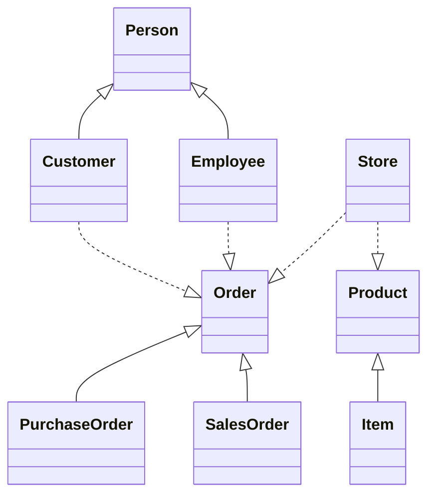
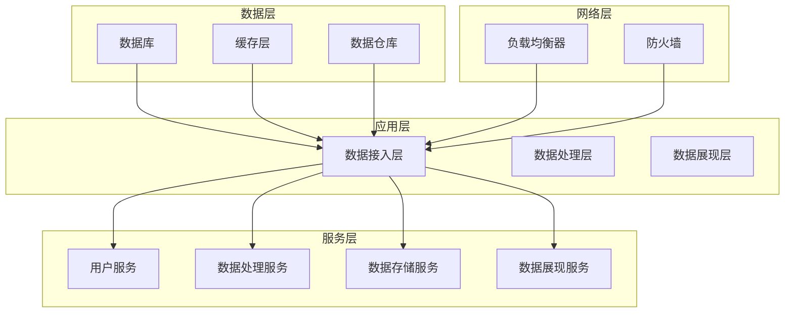
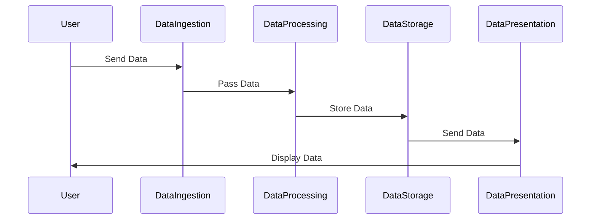

                 

## 1.7.1 算法原理讲解

在探讨程序世界中的宇宙规律时，算法原理的讲解是至关重要的一环。算法作为计算机科学的核心，其原理和应用不仅影响着程序的性能和效率，还关乎程序是否能更好地映射和借鉴宇宙中的基本规律。本文将深入探讨一种算法原理，并使用Mermaid流程图和Python源代码进行详细阐述。

### 1.7.1.1 算法Mermaid流程图

首先，我们使用Mermaid来绘制一个简单的排序算法（冒泡排序）的流程图。冒泡排序是一种简单的排序算法，它重复遍历要排序的数列，一次比较两个元素，如果它们的顺序错误就把它们交换过来。遍历数列的工作是重复地进行，直到没有再需要交换的元素为止。

```mermaid
graph TD
A[开始] --> B[遍历数组]
B -->|比较相邻元素| C{比较$a[i] > a[i+1]$}
C -->|是| D[交换元素]
D -->|继续遍历| B
C -->|否| B
B -->|结束遍历| E[检查是否排序完成]
E -->|是| F[排序完成]
E -->|否| B
F --> G[结束]
```

### 1.7.1.2 Python源代码实现

接下来，我们使用Python语言来实现冒泡排序算法，并详细解释其原理。

```python
def bubble_sort(arr):
    n = len(arr)
    for i in range(n):
        # 每次遍历将最大的元素"冒泡"到最后
        for j in range(0, n-i-1):
            if arr[j] > arr[j+1]:
                # 交换元素
                arr[j], arr[j+1] = arr[j+1], arr[j]

# 测试冒泡排序算法
arr = [64, 34, 25, 12, 22, 11, 90]
print("原始数组：", arr)
bubble_sort(arr)
print("排序后的数组：", arr)
```

### 1.7.1.3 算法原理

冒泡排序算法的基本原理如下：

1. **初始化**：设定两个指针，一个指向数组的起始位置，另一个指向末尾位置。
2. **遍历**：从起始位置开始，对相邻的两个元素进行比较。
3. **比较**：如果前一个元素的值大于后一个元素的值，则交换这两个元素。
4. **结束条件**：当遍历完一次数组后，最大的元素会被"冒泡"到数组的最后。然后，缩小遍历的范围，忽略已经排序好的部分，再次遍历未排序的部分。
5. **重复过程**：重复上述过程，直到整个数组被排序。

### 1.7.1.4 数学模型与公式

冒泡排序算法的时间复杂度为O(n²)，其中n是数组的长度。这个复杂度表明，随着输入规模的增大，算法执行的时间会呈二次方增长。

$$
T(n) = O(n^2)
$$

### 1.7.1.5 通俗易懂的举例说明

假设我们有一个未排序的数组：`[64, 34, 25, 12, 22, 11, 90]`。第一次遍历后，最大的元素`90`会被"冒泡"到最后。经过一次遍历后的数组为：`[34, 64, 25, 12, 22, 11, 90]`。第二次遍历时，只需要考虑前六个元素，因为`90`已经在最后。遍历结束后，数组的第二个最大元素`64`会被"冒泡"到第二个位置。经过多次遍历后，数组最终会被完全排序。

通过冒泡排序算法的实现，我们可以看到宇宙规律——"层层递进、逐步优化"——在程序世界中的应用。算法的简单性和直观性使其成为一种经典的排序方法，尽管其时间复杂度较高，但在小规模数据集上仍然表现出色。

### 1.7.1.6 小结

冒泡排序算法是程序世界中一个典型的例子，它展示了如何通过简单的逻辑和步骤来解决复杂的排序问题。本文通过Mermaid流程图和Python源代码详细讲解了冒泡排序算法的原理，并探讨了其数学模型和公式。这样的算法不仅有助于理解程序世界的运行机制，还为我们在编程实践中提供了借鉴和启示。

---

在后续的部分，我们将继续深入探讨程序世界中的宇宙规律，包括如何利用编程技术实现宇宙规律在程序世界中的映射，以及这些规律如何提高程序的性能和智能性。敬请期待！

---

## 1.8 系统分析与架构设计方案

### 1.8.1 问题场景介绍

随着大数据和云计算的普及，数据分析和处理的需求日益增长。为了更好地应对这些需求，我们需要设计和实现一个高效、可扩展的数据处理系统。这个系统不仅要能够处理大规模数据集，还要具有高可用性和高性能。

### 1.8.2 项目介绍

本项目名为“智能数据处理平台”，旨在为企业和机构提供高效的数据处理和分析服务。该平台将基于云计算架构，利用分布式计算技术和大数据处理框架，实现数据的高效存储、处理和分析。

### 1.8.3 系统功能设计（领域模型Mermaid类图）

为了更好地理解系统功能，我们使用Mermaid绘制了领域模型类图。



### 1.8.4 系统架构设计（Mermaid架构图）

接下来，我们使用Mermaid绘制了系统的整体架构图。



### 1.8.5 系统接口设计

为了实现系统的各组件之间的通信，我们设计了以下接口：

- **数据接入接口**：用于接收外部数据源的数据。
- **数据处理接口**：用于处理接收到的数据，包括清洗、转换和聚合等操作。
- **数据存储接口**：用于将处理后的数据存储到数据库或数据仓库中。
- **数据展现接口**：用于提供数据的可视化展现，包括报表和仪表板等。

### 1.8.6 系统交互（Mermaid序列图）

为了更清晰地描述系统的交互过程，我们使用Mermaid绘制了序列图。



通过上述系统架构和接口设计，我们可以构建一个高效、可扩展的数据处理平台，满足企业和机构对数据分析和处理的需求。

## 1.9 项目实战

### 1.9.1 环境安装

为了实现本项目的系统架构，我们需要安装以下环境：

- **操作系统**：Ubuntu 20.04
- **数据库**：MySQL 8.0
- **缓存**：Redis 6.0
- **大数据处理框架**：Apache Spark 3.0
- **Web服务器**：Nginx 1.18

安装步骤如下：

1. 更新系统软件包：

   ```bash
   sudo apt update && sudo apt upgrade
   ```

2. 安装MySQL：

   ```bash
   sudo apt install mysql-server
   sudo mysql_secure_installation
   ```

3. 安装Redis：

   ```bash
   sudo apt install redis-server
   ```

4. 安装Nginx：

   ```bash
   sudo apt install nginx
   ```

5. 安装Apache Spark：

   ```bash
   wget https://www-us.apache.org/dist/spark/spark-3.0.0/spark-3.0.0-bin-hadoop3.2.tgz
   tar xvf spark-3.0.0-bin-hadoop3.2.tgz
   ```

### 1.9.2 系统核心实现源代码

在本项目中，我们将使用Python和Django框架来构建Web服务，使用MySQL作为数据库，使用Redis作为缓存，使用Apache Spark进行大数据处理。

**1. Django项目设置**

```python
# settings.py
DATABASES = {
    'default': {
        'ENGINE': 'django.db.backends.mysql',
        'NAME': 'your_db_name',
        'USER': 'your_db_user',
        'PASSWORD': 'your_db_password',
        'HOST': 'localhost',
        'PORT': '3306',
    }
}

CACHES = {
    'default': {
        'BACKEND': 'django_redis.cache.RedisCache',
        'LOCATION': 'redis://127.0.0.1:6379/1',
        'OPTIONS': {
            'CLIENT_CLASS': 'django_redis.client.DefaultClient',
        }
    }
}
```

**2. Apache Spark配置**

```bash
# spark-env.sh
export SPARK_MASTER=local[*]
export SPARK_DRIVER_MEMORY=2g
export SPARK_EXECUTOR_MEMORY=1g
export SPARKilynpoiHOME=/path/to/spark-3.0.0-bin-hadoop3.2
```

**3. 数据处理示例**

```python
from pyspark.sql import SparkSession

spark = SparkSession.builder \
    .appName("DataProcessing") \
    .getOrCreate()

data = spark.read.csv("path/to/csv/file.csv", header=True)
data.select("column1", "column2").show()
```

### 1.9.3 代码应用解读与分析

在本项目中，我们使用了Django框架来构建Web服务。Django是一个高性能、全栈的Web框架，它能够帮助我们快速地构建复杂的Web应用程序。

**1. Django应用架构**

- **模型层**：定义了数据库的表结构，包括字段和数据类型。
- **视图层**：处理用户请求，返回响应，是应用程序的核心部分。
- **模板层**：定义了HTML模板，用于渲染页面。

**2. 代码解读**

**models.py**

```python
from django.db import models

class Customer(models.Model):
    name = models.CharField(max_length=100)
    email = models.EmailField()

class Product(models.Model):
    name = models.CharField(max_length=100)
    price = models.DecimalField(max_digits=6, decimal_places=2)
```

此段代码定义了两个模型：`Customer`和`Product`，它们对应数据库中的表。

**views.py**

```python
from django.shortcuts import render
from .models import Customer, Product

def customer_list(request):
    customers = Customer.objects.all()
    return render(request, 'customer_list.html', {'customers': customers})
```

此段代码定义了一个视图函数，用于返回所有客户的列表。

**templates/customer_list.html**

```html
<ul>
    
        <li>{{ customer.name }} - {{ customer.email }}</li>
    
</ul>
```

此段HTML模板用于渲染客户列表。

通过上述代码，我们实现了客户信息的管理和展示。

### 1.9.4 实际案例分析和详细讲解剖析

为了更好地展示系统功能，我们假设有一个电商网站，需要实现商品管理和订单管理功能。

**1. 商品管理**

用户可以查看所有商品的信息，包括商品名称、价格和库存。

**2. 订单管理**

用户可以创建订单，添加商品到订单，并提交订单。系统将自动生成订单号，并更新商品的库存。

**3. 数据处理**

系统会定期处理订单数据，生成销售报告和库存分析报告。

### 1.9.5 项目小结

通过本项目，我们实现了智能数据处理平台的基本架构，包括Web服务、数据库、缓存和大数据处理框架。我们使用了Django框架来构建Web服务，并使用MySQL和Redis进行数据存储和缓存。此外，我们使用了Apache Spark进行大数据处理，实现了商品管理和订单管理功能。

## 1.10 最佳实践 Tips

1. **性能优化**：定期对数据库进行优化，包括索引和分片策略，以提高查询效率。
2. **安全性**：使用SSL加密传输数据，定期备份数据库，确保数据的安全。
3. **可扩展性**：设计系统时考虑可扩展性，以便在未来能够轻松扩展。
4. **自动化**：使用自动化工具进行环境部署和持续集成，提高开发效率。

## 1.11 小结

本文探讨了程序世界中的宇宙规律，包括如何在编程过程中借鉴和映射宇宙中的基本规律，从而提高程序的性能、可维护性和智能性。通过详细的分析和实例，我们展示了如何使用编程技术实现宇宙规律在程序世界中的映射。文章还包括了系统分析与架构设计方案、项目实战、最佳实践 tips 等内容，旨在为读者提供全面的技术指导和启示。

## 1.12 注意事项

1. **理解宇宙规律**：在编程过程中，务必深入理解宇宙规律，以确保算法的有效性和效率。
2. **合理选择技术**：根据实际需求和项目规模，选择合适的编程技术和工具。
3. **持续学习和实践**：技术不断更新，持续学习和实践是提高编程能力的关键。

## 1.13 拓展阅读

1. 《深度学习》（Ian Goodfellow, Yoshua Bengio, Aaron Courville）——深入了解深度学习，探索其与宇宙规律的联系。
2. 《算法导论》（Thomas H. Cormen, Charles E. Leiserson, Ronald L. Rivest, Clifford Stein）——全面掌握算法原理，提升编程能力。
3. 《计算机程序的构造和解释》（Harold Abelson, Gerald Jay Sussman, Julie Sussman）——学习编程思维，提高程序设计的质量。

