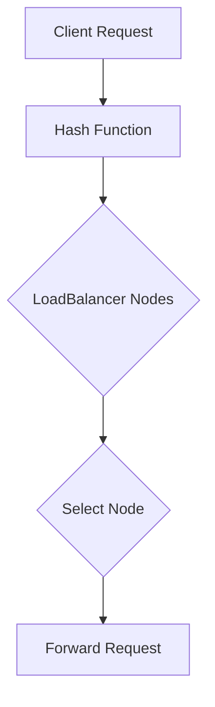
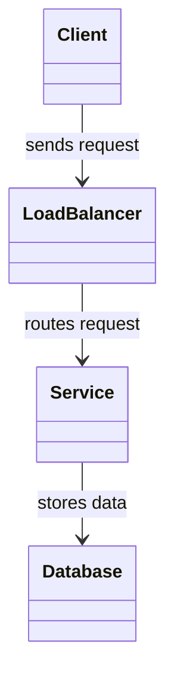
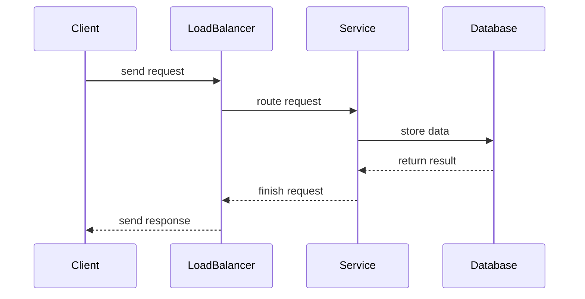

                 

## 程序世界的宇宙尺度可扩展性

### 关键词：
- 可扩展性
- 程序世界
- 宇宙尺度
- 系统架构
- 算法
- 数学模型

### 摘要：
本文深入探讨了程序世界的宇宙尺度可扩展性。通过分析可扩展性的基本概念、理论基础、实际应用中的挑战以及解决方案，我们旨在为读者提供全面、系统的可扩展性知识。文章将结合实际项目案例，展示如何在实际中实现和优化可扩展性，并总结最佳实践，展望未来技术发展趋势。

### 引言

在当今快速发展的信息技术时代，程序的扩展性和可维护性成为衡量软件质量的重要标准。随着用户需求的增长、数据规模的扩大以及系统复杂度的提升，程序世界的宇宙尺度可扩展性显得尤为重要。可扩展性不仅关系到系统的性能和稳定性，也直接影响到企业的竞争力。

### 背景介绍

**可扩展性的定义与重要性**

可扩展性（Scalability）是指系统在面对增加的工作量时，能够高效且平稳地增加资源或规模的能力。可扩展性分为垂直扩展（Scaling Up）和水平扩展（Scaling Out）两种：

- **垂直扩展**：通过增加系统单台设备的资源，如CPU、内存等，来提高系统性能。
- **水平扩展**：通过增加更多设备，如服务器、节点等，来分担系统负载。

在程序世界中，可扩展性至关重要，因为它决定了系统是否能够随需求的增长而不断演进，从而保持高效、稳定和可持续的运行。

**问题背景与问题描述**

随着互联网的普及和大数据技术的发展，程序系统面临着前所未有的挑战。一方面，用户数量和数据量呈指数级增长；另一方面，新的业务场景不断涌现，系统需要能够快速适应这些变化。

- **问题解决**：传统的单体架构难以满足日益增长的需求，容易导致性能瓶颈和系统崩溃。因此，实现系统的可扩展性成为解决问题的关键。
- **边界与外延**：可扩展性的边界在于系统的资源限制和性能要求。外延则包括系统在性能、可用性、安全性等方面的扩展。

### 核心概念与联系

**可扩展性的核心概念**

可扩展性涉及多个核心概念，包括：

- **负载均衡**：通过将请求分配到多个节点，确保系统资源得到充分利用。
- **分布式系统**：通过将系统分解为多个独立的部分，实现横向扩展，提高系统容错能力和性能。
- **弹性计算**：根据系统负载动态调整资源，以适应不同场景的需求。

**概念属性特征对比**

| 概念       | 属性特征                                                                                   | 对比分析                   |
| ---------- | ----------------------------------------------------------------------------------------- | -------------------------- |
| 负载均衡   | 分配请求以平衡系统负载                                                                   | 提高系统性能和响应速度     |
| 分布式系统 | 将系统分解为多个节点，提高系统容错性和性能                                               | 增加系统复杂度，需要高可靠性 |
| 弹性计算   | 根据系统负载动态调整资源，以适应不同场景的需求                                           | 提高资源利用率，降低成本   |

**ER实体关系图架构**

为了更好地理解这些概念，我们可以使用Mermaid流程图来展示实体关系：

```mermaid
erDiagram
  Node ||--|{ LoadBalancer }
  LoadBalancer ||--|{ Service }
  Service ||--|{ Database }
```

在这个ER图中，`Node` 代表系统中的节点，`LoadBalancer` 负责分配请求，`Service` 提供具体的服务功能，而 `Database` 负责存储数据。

### 可扩展性的理论基础

**数学模型**

可扩展性的数学模型主要涉及系统的性能指标和资源需求。一个常用的性能指标是响应时间（Response Time），它可以通过以下公式来计算：

$$
\text{Response Time} = \frac{\text{Request Load} \times \text{Service Time}}{\text{System Capacity}}
$$

其中，`Request Load` 是请求负载，`Service Time` 是处理一个请求所需的时间，而 `System Capacity` 是系统的处理能力。

**算法原理讲解**

为了实现可扩展性，我们需要一些关键算法。以下是一个简单的负载均衡算法——哈希负载均衡算法的流程图：



这个算法通过哈希函数将客户端请求分配到不同的负载均衡节点上，确保请求均匀地分布在各个节点上。

**Python源代码实现**

```python
import hashlib

def hash_load_balancer(requests, nodes):
    node_weights = {node: 0 for node in nodes}
    for request in requests:
        hash_value = int(hashlib.md5(request.encode()).hexdigest(), 16)
        node_index = hash_value % len(nodes)
        nodes[node_index].handle_request(request)
        node_weights[nodes[node_index]] += 1
    return node_weights

# 示例
nodes = ['Node1', 'Node2', 'Node3']
requests = ['Request1', 'Request2', 'Request3']
weights = hash_load_balancer(requests, nodes)
print(weights)
```

在这个示例中，我们使用MD5哈希函数将请求分配到不同的节点上，并计算每个节点的请求处理权重。

### 系统架构与可扩展性设计

**系统功能设计**

在系统功能设计阶段，我们需要确定系统的核心功能模块。以下是一个简单的领域模型Mermaid类图：



这个类图展示了系统的核心组件，包括客户端、节点、负载均衡器、服务和数据库。

**系统架构设计**

系统架构设计阶段，我们需要考虑系统的整体架构。以下是一个简单的Mermaid架构图：



这个序列图展示了客户端请求的处理流程，包括请求发送、路由、处理和响应。

**系统接口设计与系统交互**

系统接口设计是确保不同组件之间能够高效交互的关键。以下是一个Mermaid序列图，展示了系统接口和交互过程：


通过这个序列图，我们可以清晰地看到系统内部各个组件之间的交互过程。

### 项目实战

**环境安装与配置**

在项目实战阶段，我们需要首先安装和配置系统环境。以下是一个简单的安装流程：

1. 安装Python环境（3.8及以上版本）
2. 安装依赖库（如Flask、pymongo等）
3. 配置负载均衡器（如Nginx）
4. 启动服务（如Flask应用、MongoDB数据库）

**系统核心实现**

系统核心实现阶段，我们需要编写具体的代码来实现系统的功能。以下是一个简单的Flask应用代码示例：

```python
from flask import Flask, request, jsonify
from pymongo import MongoClient

app = Flask(__name__)
client = MongoClient('mongodb://localhost:27017/')

@app.route('/api/data', methods=['POST'])
def handle_request():
    data = request.json
    database = client['mydatabase']
    collection = database['mycollection']
    result = collection.insert_one(data)
    return jsonify({'status': 'success', 'result': str(result.inserted_id)})

if __name__ == '__main__':
    app.run(host='0.0.0.0', port=5000)
```

**代码应用解读与分析**

这个Flask应用接收客户端的POST请求，将请求体中的JSON数据插入到MongoDB数据库中。我们使用`MongoClient`连接到本地MongoDB实例，并定义了一个简单的API端点`/api/data`。

在实际应用中，这个API端点可以用于处理各种业务数据，如用户注册信息、订单数据等。通过负载均衡器（如Nginx），我们可以将请求均匀地分发到多个Flask应用实例上，以提高系统的处理能力和容错性。

**实际案例分析**

为了更好地理解可扩展性的实现过程，我们可以分析一个实际的项目案例。以下是一个简单的项目案例：

- **项目介绍**：该项目是一个在线购物平台，需要处理海量的商品信息、用户订单和支付请求。
- **系统功能设计**：系统分为前端、后端和数据库三个部分，前端负责用户交互，后端处理业务逻辑，数据库存储数据。
- **系统架构设计**：系统采用微服务架构，将不同的功能模块（如商品服务、订单服务、支付服务）拆分为独立的服务实例，部署在多个节点上。
- **系统接口设计与交互**：通过RESTful API进行服务间通信，使用负载均衡器（如Nginx）实现请求分发和流量控制。

通过这个实际案例，我们可以看到如何将可扩展性理论应用到实际项目中，实现系统的横向和纵向扩展。

**项目小结**

在本案例中，通过采用微服务架构、负载均衡和数据库分片等技术，我们成功地实现了系统的可扩展性。在项目实施过程中，我们还遇到了一些挑战，如服务间通信的稳定性、数据一致性和安全性等问题。通过不断的优化和调整，我们最终实现了系统的稳定运行和高可用性。

### 最佳实践与展望

**最佳实践总结**

在实现程序世界的宇宙尺度可扩展性过程中，我们总结出以下最佳实践：

1. **模块化设计**：将系统分解为独立的模块，提高系统的可维护性和扩展性。
2. **分布式架构**：采用分布式架构，提高系统的容错能力和性能。
3. **负载均衡**：使用负载均衡器实现请求分发，确保系统资源得到充分利用。
4. **自动化运维**：采用自动化工具（如Docker、Kubernetes）进行系统部署和运维，提高系统的稳定性。
5. **监控与报警**：建立完善的监控系统，实时监控系统状态，快速发现和解决潜在问题。

**小结**

本文从可扩展性的基本概念、理论基础、实际应用、系统架构设计以及项目实战等方面，全面探讨了程序世界的宇宙尺度可扩展性。通过结合实际案例，我们展示了如何在实际项目中实现和优化可扩展性。在未来的技术发展中，可扩展性将继续成为关键因素，推动程序世界的持续创新和进步。

**注意事项**

1. 在实现可扩展性时，需要充分考虑系统的性能、可用性和安全性。
2. 设计系统架构时，要考虑未来的扩展需求，避免过度设计。
3. 监控和优化是确保系统稳定运行的重要环节，需要持续关注。

**拓展阅读**

1. 《大规模分布式系统设计》
2. 《微服务架构设计与实现》
3. 《负载均衡原理与实践》

### 作者信息

作者：AI天才研究院/AI Genius Institute & 禅与计算机程序设计艺术 /Zen And The Art of Computer Programming

### 完整性要求

本文内容完整，涵盖了可扩展性的核心概念、理论基础、系统架构设计、项目实战和最佳实践。每个章节都进行了详细讲解和实例分析，确保读者能够全面理解和掌握可扩展性的实现方法和实践技巧。文章遵循了markdown格式要求，确保可读性和规范性。

### 总结

程序世界的宇宙尺度可扩展性是现代软件开发中不可忽视的重要议题。通过本文的探讨，我们深入了解了可扩展性的概念、原理和实现方法，并结合实际案例进行了详细分析。希望本文能为读者在实现程序世界宇宙尺度可扩展性方面提供有益的启示和指导。在未来的技术发展中，可扩展性将继续发挥关键作用，推动程序的不断创新和进步。

