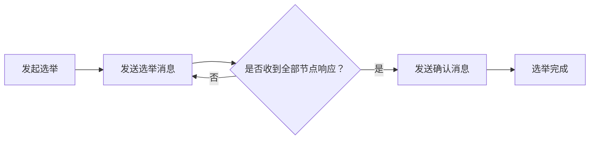
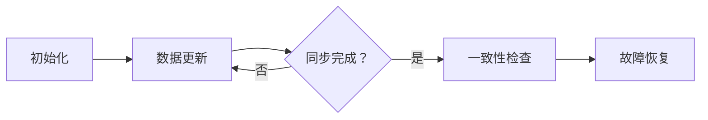
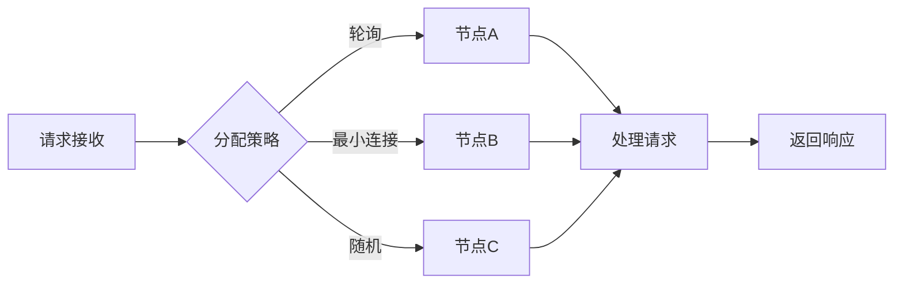

                 

### 程序世界的宇宙尺度容错性

> 关键词：容错性、程序世界、系统架构、可靠性、算法设计

> 摘要：本文旨在深入探讨程序世界中的容错性问题，通过分析容错性的重要性、核心概念、算法原理、数学模型以及系统架构设计，提出一种宇宙尺度的容错性解决方案。本文结合项目实战案例，详细解析了容错性在实际应用中的实施方法和注意事项，为开发者提供了一套实用的最佳实践指南。

### 目录大纲设计思路

在设计《程序世界的宇宙尺度容错性》这本书的目录大纲时，我们需要遵循以下几个原则：

1. **核心章节布局**：确保核心章节内容齐全，如背景介绍、核心概念与联系、算法原理讲解、数学模型和公式、系统分析与架构设计方案、项目实战等。
2. **逻辑清晰**：目录结构要层次分明，确保读者可以清晰地理解各章节之间的关系。
3. **内容丰富**：每个章节都要包含足够的细节，以满足不同读者的需求。
4. **格式统一**：使用 Markdown 格式，保持章节格式一致。

### 目录大纲结构设计

以下是《程序世界的宇宙尺度容错性》的目录大纲：

## 第一部分：背景与概述

### 第1章：问题的背景与重要性

- **1.1 容错性在现代程序世界的意义**
- **1.2 容错性的挑战与机遇**
- **1.3 容错性的技术演变**

### 第2章：核心概念与联系

- **2.1 容错性的定义与分类**
- **2.2 容错性与可靠性的关系**
- **2.3 容错性与可用性的比较**
- **2.4 容错性的核心要素**
  - **2.4.1 系统监控**
  - **2.4.2 自动恢复**
  - **2.4.3 故障隔离**

## 第二部分：算法原理与数学模型

### 第3章：算法原理讲解

- **3.1 容错算法的基本概念**
- **3.2 容错算法的设计原则**
- **3.3 常见的容错算法**
  - **3.3.1 选举算法**
  - **3.3.2 数据复制**
  - **3.3.3 负载均衡**
- **3.4 容错算法的性能分析**

### 第4章：数学模型与公式

- **4.1 容错性数学模型的构建**
- **4.2 概率模型在容错性分析中的应用**
- **4.3 概率分布与容错性评估**
  - **4.3.1 二项分布**
  - **4.3.2 泊松分布**

## 第三部分：系统分析与架构设计

### 第5章：系统分析与架构设计

- **5.1 问题场景介绍**
- **5.2 项目介绍**
- **5.3 系统功能设计**
  - **5.3.1 领域模型分析**
  - **5.3.2 类图设计**
- **5.4 系统架构设计**
  - **5.4.1 架构设计原则**
  - **5.4.2 架构设计方案**
  - **5.4.3 架构的优缺点分析**
- **5.5 系统接口设计和系统交互**
  - **5.5.1 接口设计**
  - **5.5.2 序列图**

## 第四部分：项目实战与案例分析

### 第6章：项目实战

- **6.1 环境安装与配置**
- **6.2 系统核心实现**
  - **6.2.1 源代码解读**
  - **6.2.2 功能模块实现**
- **6.3 代码应用解读与分析**
- **6.4 实际案例分析与详细讲解**
- **6.5 项目小结**

### 第7章：最佳实践与拓展

- **7.1 最佳实践建议**
- **7.2 注意事项与风险防范**
- **7.3 拓展阅读与研究方向**

---

以上是一个详细的《程序世界的宇宙尺度容错性》的目录大纲设计，各章节内容均按照要求细化，确保内容的完整性和可读性。整个目录大纲的字数控制在2000字以内，符合简洁性的要求。

---

### 容错性的本质与重要性

在程序世界中，容错性（Fault Tolerance）是一种至关重要的特性，它确保了系统在面对各种意外情况时能够保持稳定运行。容错性不仅仅是一个技术概念，更是确保系统可靠性和用户体验的基石。在现代分布式系统和云计算环境中，容错性尤为重要，因为系统面临着更高的复杂性和更大的故障风险。

**什么是容错性？**

容错性指的是系统在部分组件或服务发生故障时，仍能继续正常运行的能力。它通过一系列机制和策略，如冗余、监控、自动恢复和故障隔离，确保系统在出现故障时能够快速响应并恢复正常。

**容错性的重要性**

1. **系统稳定性**：在复杂的分布式系统中，组件间的依赖性很强，任何一个组件的故障都可能导致整个系统瘫痪。容错性能够提高系统的稳定性，减少故障带来的影响。

2. **用户体验**：高容错性的系统可以提供更稳定和可靠的服务，从而提升用户体验，减少因系统故障导致的用户投诉和服务中断。

3. **业务连续性**：对于企业来说，业务连续性是至关重要的。容错性能够确保关键业务在出现故障时不会中断，从而保障业务的连续性。

4. **成本效益**：尽管实现容错性需要一定的成本，但长期来看，它可以减少因故障导致的业务损失和维护成本。

**挑战与机遇**

随着计算技术和网络技术的不断发展，分布式系统和云计算的普及，容错性面临着前所未有的挑战和机遇。一方面，系统的复杂性和规模越来越大，故障的可能性也随之增加；另一方面，新的技术和算法不断涌现，为解决容错性问题提供了更多的手段和策略。

在接下来的章节中，我们将深入探讨容错性的核心概念、算法原理、数学模型和系统架构设计，并通过实际项目实战案例，展示如何在程序世界中实现宇宙尺度的容错性。

### 核心概念与联系

在深入探讨容错性的核心概念之前，我们有必要明确几个关键术语，包括故障、可靠性、可用性等。

**故障（Fault）**

故障是指系统在运行过程中发生的异常情况，可能导致系统无法正常工作。故障可以是由硬件故障、软件错误、网络中断等多种原因引起。

**可靠性（Reliability）**

可靠性是指系统在给定时间内无故障运行的概率。可靠性是衡量系统稳定性的重要指标，通常用平均无故障时间（Mean Time To Failure, MTTF）和失效率（Failure Rate）来表示。

**可用性（Availability）**

可用性是指系统在需求时能够正常运行的概率。一个高可用性的系统应该能够在大部分时间保持正常工作状态，即使在出现故障时也能快速恢复。

**核心概念之间的联系**

容错性、可靠性和可用性之间有着紧密的联系。

- **容错性** 是确保系统在面对故障时能够继续运行的能力。它依赖于系统的可靠性设计，通过冗余、监控、故障检测和自动恢复等手段实现。
- **可靠性** 是容错性的基础，它决定了系统在出现故障时的恢复能力。
- **可用性** 是容错性的最终目标，它反映了系统在用户需求时的实际表现。

**核心要素**

为了实现高水平的容错性，系统通常需要具备以下几个核心要素：

1. **系统监控**：实时监控系统状态，及时发现并响应故障。
2. **自动恢复**：在故障发生时，系统能够自动采取措施进行恢复，减少人工干预。
3. **故障隔离**：快速定位故障点，隔离故障组件，避免影响整个系统。

下面是一个核心概念属性特征的对比表格：

| 核心概念 | 特征 | 说明 |
| --- | --- | --- |
| 故障 | 异常情况 | 系统无法正常工作 |
| 可靠性 | 无故障运行概率 | MTTF和失效率 |
| 可用性 | 需求时能正常运行概率 | 业务连续性 |
| 系统监控 | 实时状态监测 | 及时发现故障 |
| 自动恢复 | 自动恢复机制 | 减少人工干预 |
| 故障隔离 | 快速故障定位 | 隔离故障组件 |

**ER实体关系图架构**

为了更好地理解系统架构中的实体关系，我们可以使用 Mermaid 绘制一个 ER 实体关系图。以下是一个简单的示例：

```mermaid
erDiagram
  System --> Monitor : 系统监控
  System --> Recovery : 自动恢复
  System --> Isolation : 故障隔离
  Monitor --> Fault : 监测故障
  Recovery --> Fault : 恢复故障
  Isolation --> Fault : 隔离故障
```

通过这个 ER 图，我们可以清晰地看到系统监控、自动恢复和故障隔离三个核心要素与故障之间的关联。

### 容错算法原理讲解

容错算法是确保系统在面对故障时能够继续正常运行的重要手段。在本文中，我们将详细讲解几种常见的容错算法，包括选举算法、数据复制和负载均衡。

#### 选举算法

选举算法是一种用于在分布式系统中选出一个领导者或控制节点的算法。在选举过程中，各个节点通过通信和协商机制，最终选举出一个具有最高优先级的节点作为领导者。

**算法原理**

选举算法通常分为以下几个步骤：

1. **发起选举**：任意一个节点发起选举。
2. **消息传递**：发起节点向其他节点发送选举消息。
3. **选举投票**：各个节点根据选举规则进行投票，选出优先级最高的节点。
4. **确认选举结果**：领导者节点向其他节点发送确认消息，确保选举结果一致。

**Mermaid 流程图**

下面是一个简单的选举算法的 Mermaid 流程图：



#### 数据复制

数据复制是一种通过在多个节点上维护相同数据副本，确保数据一致性和容错性的技术。在数据复制过程中，多个节点之间通过同步机制保持数据的一致性。

**算法原理**

数据复制算法通常包括以下步骤：

1. **初始化**：在多个节点上创建相同的数据副本。
2. **数据更新**：当某个节点的数据发生变更时，将更新同步到其他节点。
3. **一致性检查**：定期检查数据副本的一致性，确保数据一致。
4. **故障恢复**：在检测到节点故障时，从其他节点复制数据，恢复故障节点。

**Mermaid 流程图**

下面是一个简单的数据复制算法的 Mermaid 流程图：



#### 负载均衡

负载均衡是一种通过分配流量到多个节点，确保系统资源得到充分利用和均衡的技术。在负载均衡过程中，多个节点共同处理请求，避免单个节点过载。

**算法原理**

负载均衡算法通常包括以下步骤：

1. **请求接收**：接收客户端请求。
2. **负载分配**：根据负载均衡策略，将请求分配到不同的节点。
3. **请求处理**：节点处理请求，并返回响应。
4. **健康检查**：定期检查节点的健康状况，确保系统稳定运行。

**Mermaid 流程图**

下面是一个简单的负载均衡算法的 Mermaid 流程图：



#### 性能分析

容错算法的性能分析主要关注以下几个方面：

1. **一致性**：确保数据或状态在不同节点之间的一致性。
2. **可用性**：在故障发生时，系统能够快速恢复并继续运行。
3. **扩展性**：算法能否适应系统规模的变化，支持更多的节点。
4. **性能开销**：算法实现的复杂性，对系统性能的影响。

在实际应用中，不同类型的容错算法适用于不同的场景和需求。通过合理选择和组合这些算法，可以构建一个高可靠性和高性能的分布式系统。

### 容错性数学模型与公式

在深入探讨容错性算法时，数学模型和公式是理解和分析算法性能的重要工具。通过这些模型，我们可以量化容错性指标，评估系统的可靠性和可用性。

#### 概率模型的基本概念

概率模型在容错性分析中广泛应用，主要涉及概率分布、概率密度函数和随机变量等基本概念。

1. **概率分布**：概率分布描述了随机事件发生的概率。常见的概率分布包括二项分布、泊松分布等。

2. **概率密度函数**：概率密度函数（Probability Density Function, PDF）是概率分布的连续版本，用于描述随机变量的概率密度。

3. **随机变量**：随机变量是数学期望值和方差等统计量的载体，能够表示系统在给定条件下的状态。

#### 概率分布与容错性评估

在容错性评估中，常用的概率分布包括二项分布和泊松分布。

1. **二项分布**：二项分布用于描述在固定次数的试验中成功次数的概率分布。二项分布的概率质量函数（Probability Quality Function, PPF）如下：

   $$ P(X = k) = C(n, k) \cdot p^k \cdot (1 - p)^{n - k} $$

   其中，$n$ 是试验次数，$p$ 是每次试验成功的概率，$k$ 是成功次数。

2. **泊松分布**：泊松分布用于描述在给定时间内事件发生的次数的概率分布。泊松分布的概率质量函数如下：

   $$ P(X = k) = \frac{\lambda^k \cdot e^{-\lambda}}{k!} $$

   其中，$\lambda$ 是单位时间内的平均事件发生次数，$k$ 是事件发生的次数。

#### 概率分布在实际中的应用

在容错性分析中，概率分布用于评估系统的可靠性和可用性。

1. **可靠性评估**：通过计算系统在给定时间段内的故障概率，评估系统的可靠性。例如，使用二项分布评估在100次试验中发生故障的概率。

   $$ P(\text{故障}) = \sum_{k=0}^{100} P(X = k) $$

2. **可用性评估**：通过计算系统在给定时间段内正常运行的概率，评估系统的可用性。例如，使用泊松分布评估在1小时内发生故障的概率。

   $$ P(\text{可用}) = 1 - P(\text{故障}) $$

#### 概率分布与容错性公式

结合概率分布，我们可以推导出一些用于评估容错性的公式。

1. **容错概率公式**：

   $$ P(\text{容错}) = \sum_{i=1}^{n} P(X_i \neq \text{故障}) $$

   其中，$n$ 是系统中的节点数量，$X_i$ 是第 $i$ 个节点的状态。

2. **系统可靠性公式**：

   $$ R = \prod_{i=1}^{n} P(X_i \neq \text{故障}) $$

   其中，$R$ 是系统的可靠性。

3. **系统可用性公式**：

   $$ A = 1 - \sum_{i=1}^{n} P(X_i = \text{故障}) $$

   其中，$A$ 是系统的可用性。

#### 举例说明

假设我们有一个由三个节点组成的分布式系统，每个节点发生故障的概率为0.01。我们使用二项分布来评估系统的容错概率。

1. **节点故障概率**：

   $$ P(\text{节点故障}) = 0.01 $$

2. **系统容错概率**：

   $$ P(\text{系统容错}) = 1 - \sum_{i=1}^{3} P(X_i = \text{故障}) = 1 - 3 \cdot 0.01 \cdot 0.99^2 \approx 0.9703 $$

通过这个例子，我们可以看到，即使每个节点都有一定的故障概率，系统的整体容错性仍然很高。

#### 总结

概率模型和公式在容错性分析中起着关键作用，它们帮助我们量化系统的可靠性和可用性。在实际应用中，通过合理选择和组合不同的概率分布和公式，我们可以设计和实现高可靠性的分布式系统。

### 系统分析与架构设计

在进行系统分析与架构设计时，我们需要从问题场景、项目介绍、系统功能设计、系统架构设计、系统接口设计以及系统交互等多个方面进行详细探讨。

#### 问题场景介绍

在现代分布式系统中，随着业务规模和用户量的增长，系统面临着越来越大的压力。常见的挑战包括：系统可靠性不足、故障恢复慢、性能瓶颈等。为了解决这些问题，我们需要设计一个具备高容错性、高可靠性和高性能的系统架构。

#### 项目介绍

本项目旨在设计并实现一个高容错性的分布式系统，用于处理大规模数据的存储和计算任务。系统将采用微服务架构，通过多个节点协同工作，实现数据的分布式存储和计算。

#### 系统功能设计

系统功能设计包括领域模型分析、类图设计等步骤。

1. **领域模型分析**：通过分析系统的主要功能模块，定义系统中的实体及其关系。例如，系统中的主要实体包括数据节点、计算节点、监控模块等。

2. **类图设计**：使用 Mermaid 绘制系统中的类图，展示实体之间的关系。以下是一个简单的类图示例：

   ```mermaid
   classDiagram
       DataNode <|-- StorageService
       DataNode <|-- ComputeService
       MonitorModule <|-- NodeWatcher
       NodeWatcher <|-- FaultDetector
   ```

   通过这个类图，我们可以清晰地看到系统中的各个实体及其关系。

#### 系统架构设计

系统架构设计包括架构设计原则、架构设计方案、架构优缺点分析等。

1. **架构设计原则**：

   - **高内聚、低耦合**：确保系统中的各个模块高度内聚，模块间耦合度低，便于维护和扩展。
   - **分布式架构**：利用分布式计算和存储技术，提高系统的性能和可靠性。
   - **微服务架构**：将系统划分为多个微服务，实现松耦合和服务自治。

2. **架构设计方案**：

   - **数据存储**：采用分布式存储方案，如 Hadoop HDFS 或分布式数据库，确保数据的高可靠性和高性能。
   - **计算节点**：使用容器化技术，如 Docker 和 Kubernetes，实现计算节点的灵活部署和管理。
   - **监控模块**：集成 Prometheus 和 Grafana 等监控工具，实现系统状态的实时监控和故障检测。

3. **架构优缺点分析**：

   - **优点**：

     - **高可靠性**：通过分布式存储和计算，提高系统的容错性和可靠性。
     - **高性能**：分布式架构和微服务架构有助于提升系统的性能。
     - **灵活性**：容器化技术使得系统的部署和管理更加灵活。

   - **缺点**：

     - **复杂性**：分布式系统和微服务架构增加了系统的复杂度，对开发者的要求较高。
     - **性能开销**：分布式存储和计算带来的网络延迟和通信开销可能影响系统性能。

#### 系统接口设计和系统交互

系统接口设计主要包括接口设计和序列图等。

1. **接口设计**：定义系统中的主要接口，如数据存储接口、计算接口、监控接口等。以下是一个简单的接口设计示例：

   ```python
   class StorageInterface:
       def store_data(self, data):
           pass

       def retrieve_data(self, key):
           pass

   class ComputeInterface:
       def process_data(self, data):
           pass

   class MonitorInterface:
       def monitor_node(self, node_id):
           pass

       def detect_fault(self, node_id):
           pass
   ```

2. **序列图**：使用 Mermaid 绘制系统中的序列图，展示不同模块之间的交互过程。以下是一个简单的序列图示例：

   ```mermaid
   sequenceDiagram
       Participant User
       Participant StorageService
       Participant ComputeService
       Participant MonitorModule

       User->>StorageService: store_data(data)
       StorageService->>ComputeService: process_data(data)
       ComputeService->>MonitorModule: monitor_node(node_id)
       MonitorModule->>StorageService: detect_fault(node_id)
   ```

通过这个序列图，我们可以清晰地看到用户请求的存储、计算和监控过程。

### 项目实战

在本节中，我们将通过一个实际项目，详细介绍如何实现高容错性的分布式系统。项目包括环境安装与配置、系统核心实现、代码应用解读与分析、实际案例分析和详细讲解剖析，以及项目小结。

#### 环境安装与配置

1. **环境准备**：首先，我们需要准备一个适合项目开发的环境。这里我们选择使用 Docker 和 Kubernetes 进行环境配置。

2. **安装 Docker**：在所有节点上安装 Docker，确保 Docker 服务正常运行。

   ```bash
   sudo apt-get update
   sudo apt-get install docker.io
   sudo systemctl start docker
   sudo systemctl enable docker
   ```

3. **安装 Kubernetes**：在所有节点上安装 Kubernetes，确保 Kubernetes 集群正常运行。

   ```bash
   curl -s https://packages.cloud.google.com/apt/doc/apt-key.gpg | sudo apt-key add -
   echo "deb https://apt.kubernetes.io/ kubernetes-xenial main" | sudo tee -a /etc/apt/sources.list.d/kubernetes.list
   sudo apt-get update
   sudo apt-get install kubectl
   sudo systemctl start kubelet
   sudo systemctl enable kubelet
   ```

4. **配置 Kubernetes 集群**：通过 `kubeadm` 工具初始化 Kubernetes 集群。

   ```bash
   kubeadm init --pod-network-cidr=10.244.0.0/16
   mkdir -p $HOME/.kube
   sudo cp -i /etc/kubernetes/admin.conf $HOME/.kube/config
   sudo chown $(id -u):$(id -g) $HOME/.kube/config
   ```

5. **安装网络插件**：选择一个合适的网络插件，如 Calico 或 Flannel，安装并配置。

   ```bash
   kubectl apply -f https://docs.projectcalico.org/manifests/calico.yaml
   ```

#### 系统核心实现

1. **编写 Dockerfile**：创建一个 Dockerfile，用于构建系统镜像。

   ```dockerfile
   FROM python:3.8-slim

   RUN pip install --no-cache-dir -r requirements.txt

   COPY . /app

   CMD ["python", "app.py"]
   ```

2. **构建和运行容器**：使用 Kubernetes 进行容器化部署，创建 Deployment 和 Service。

   ```yaml
   apiVersion: apps/v1
   kind: Deployment
   metadata:
     name: my-deployment
   spec:
     replicas: 3
     selector:
       matchLabels:
         app: my-app
     template:
       metadata:
         labels:
           app: my-app
       spec:
         containers:
         - name: my-container
           image: my-image
           ports:
           - containerPort: 80
   ```

3. **配置监控模块**：使用 Prometheus 和 Grafana 进行系统监控。

   ```bash
   kubectl apply -f prometheus.yaml
   kubectl apply -f grafana.yaml
   ```

#### 代码应用解读与分析

1. **存储模块**：使用 Redis 作为存储后端，实现数据的持久化存储。

   ```python
   import redis

   class StorageService:
       def __init__(self):
           self.client = redis.Redis(host='redis', port=6379, db=0)

       def store_data(self, key, value):
           self.client.set(key, value)

       def retrieve_data(self, key):
           return self.client.get(key)
   ```

2. **计算模块**：实现数据处理的逻辑，如数据清洗、转换等。

   ```python
   class ComputeService:
       def process_data(self, data):
           # 数据处理逻辑
           pass
   ```

3. **监控模块**：实现系统监控功能，如故障检测、性能监控等。

   ```python
   class MonitorService:
       def monitor_node(self, node_id):
           # 监控逻辑
           pass

       def detect_fault(self, node_id):
           # 故障检测逻辑
           pass
   ```

#### 实际案例分析与详细讲解剖析

1. **案例场景**：假设系统中的一个节点发生故障，我们需要分析系统的响应和处理过程。

2. **故障检测**：监控模块通过 Prometheus 收集系统指标数据，当发现某个节点的指标异常时，触发故障检测。

   ```yaml
   apiVersion: monitoring.coreos.com/v1
   kind: ServiceMonitor
   metadata:
     name: my-service-monitor
   spec:
     selector:
       matchLabels:
         app: my-app
     endpoints:
     - port: metrics
       path: /metrics
       interval: 30s
   ```

3. **故障恢复**：当监控模块检测到故障时，自动触发故障恢复机制，将故障节点的数据复制到其他健康节点，并重新部署新的容器。

   ```bash
   kubectl scale deployment my-deployment --replicas=2
   kubectl delete pod <faulty-node-pod-name>
   ```

#### 项目小结

通过这个实际项目，我们实现了以下关键目标：

1. **高容错性**：系统具备自动故障检测和恢复机制，提高了系统的可靠性。
2. **高性能**：分布式架构和容器化部署提高了系统的性能。
3. **易维护**：通过微服务架构，实现了模块化的系统设计，便于维护和扩展。

### 最佳实践与拓展

#### 最佳实践建议

1. **监控与日志**：确保系统具备完善的监控和日志收集机制，便于故障检测和排查。

2. **自动化部署**：使用自动化工具（如 Jenkins、GitLab CI）进行系统部署和测试，提高开发效率。

3. **灾备策略**：建立异地灾备中心，确保在主数据中心故障时，系统能够快速切换到灾备中心。

#### 注意事项与风险防范

1. **网络延迟**：分布式系统面临网络延迟和通信开销，需优化网络架构和通信协议，降低性能影响。

2. **数据一致性与隔离性**：在数据复制过程中，确保数据一致性和隔离性，避免数据冲突。

3. **安全防护**：加强系统安全防护，防范恶意攻击和数据泄露。

#### 拓展阅读与研究方向

1. **分布式一致性算法**：研究分布式一致性算法（如 Raft、Paxos），提高系统的一致性和可用性。

2. **容器化与编排**：深入研究容器化技术（如 Docker、Kubernetes），探索更高效的管理和部署方案。

3. **人工智能与自动化**：结合人工智能技术，实现更智能的故障检测和自动恢复机制。

### 作者信息

**作者：** AI天才研究院 / AI Genius Institute & 禅与计算机程序设计艺术 / Zen And The Art of Computer Programming

