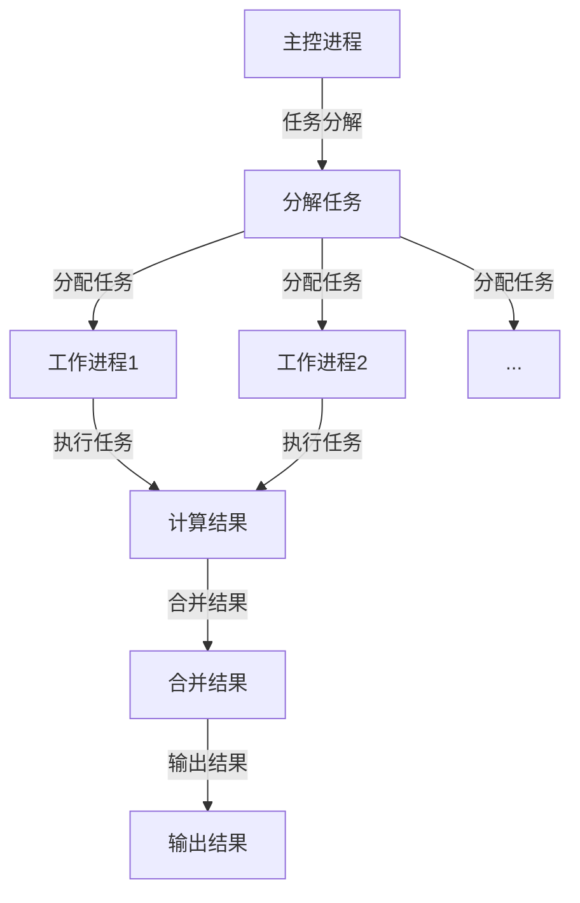
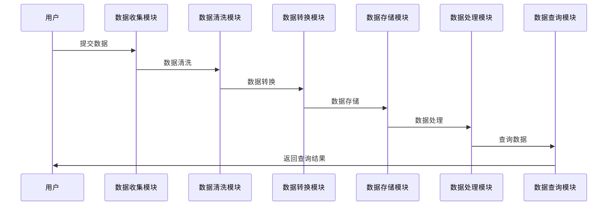

                 

### 第1章: 问题背景

#### 1.1.1 并行计算的历史与现状

**并行计算的历史演进：**

并行计算的概念可以追溯到早期的计算机体系结构，从最早的计算机开始，研究人员就意识到并行计算能够显著提高计算效率。然而，随着计算机技术的快速发展，并行计算的历史也经历了多次重要的变革：

1. **单核CPU时代：** 早期的计算机依赖于单核CPU进行计算，虽然单核性能不断提升，但单一处理器的计算能力逐渐成为瓶颈。

2. **多核CPU时代：** 为了解决单核CPU的性能瓶颈，现代计算机开始引入多核CPU。通过多个处理核心并行工作，大大提高了计算效率。

3. **GPU加速：** 图形处理单元（GPU）在并行计算领域得到了广泛应用。与传统的CPU相比，GPU具有更多的处理核心，并专门为并行计算进行了优化。

4. **分布式计算：** 随着互联网的发展，分布式计算也逐渐成为并行计算的重要形式。通过将计算任务分配到多个远程节点，可以充分利用网络资源，实现大规模并行计算。

**并行计算的需求：**

并行计算的需求主要来源于以下几个方面：

1. **大数据处理：** 随着数据量的爆炸性增长，大数据处理需要并行计算技术来提高数据处理速度和效率。

2. **高性能计算（HPC）：** 在科学研究和工程领域，许多复杂的问题需要高性能计算来解决。并行计算能够提供必要的计算能力。

3. **人工智能（AI）：** 人工智能的发展依赖于大量数据的训练和复杂的计算任务。并行计算在深度学习、机器学习等领域发挥了重要作用。

#### 1.1.2 并行计算的定义与核心概念

**定义并行计算：**

并行计算指的是在同一时间内执行多个任务或操作。它利用多个处理单元（如CPU核心、GPU等）同时工作，从而提高计算效率。

**核心概念：**

1. **任务分解：** 将一个大型任务分解成多个子任务，以便并行执行。
   
2. **并行算法：** 一种能够有效利用并行计算资源解决问题的算法。

3. **并行编程模型：** 提供并行编程的抽象，使得开发者能够更方便地编写并行程序。

4. **并行系统架构：** 描述并行计算系统的组成和结构，包括硬件和软件两个方面。

#### 1.1.3 并行计算的优势与应用领域

**并行计算的优势：**

1. **速度提升：** 通过并行计算，可以在更短的时间内完成计算任务。

2. **资源利用率提高：** 并行计算能够充分利用计算机资源，提高系统的性能。

3. **易于扩展：** 随着计算需求的增长，并行计算系统可以方便地进行扩展。

**并行计算的应用领域：**

1. **科学计算：** 如天体物理、气象预报、生物信息学等。

2. **工程模拟：** 如流体力学模拟、结构分析、电磁场模拟等。

3. **数据挖掘：** 如大规模数据分析和处理、机器学习等。

4. **人工智能：** 如深度学习、神经网络训练等。

### 总结

通过本章的介绍，我们了解了并行计算的历史与现状、核心概念、优势和应用领域。在接下来的章节中，我们将进一步深入探讨并行计算中的核心概念、算法原理、数学模型、系统架构和项目实战，以帮助读者更好地理解并行计算的技术和实践。

---

## 第2章: 并行计算中的核心概念与联系

#### 2.1.1 核心概念原理

**并行算法的原理：**

并行算法的核心原理是将一个大型任务分解成多个子任务，并在多个处理单元上并行执行这些子任务。具体来说，包括以下几个步骤：

1. **任务分解：** 根据任务的性质和并行计算资源的限制，将任务分解成多个子任务。

2. **任务调度：** 将子任务分配到不同的处理单元上，确保每个处理单元都有足够的任务可以执行。

3. **并行执行：** 多个处理单元同时执行各自的子任务。

4. **结果合并：** 将各子任务的执行结果合并，得到最终的输出结果。

**并行编程模型的原理：**

并行编程模型提供了一种抽象，使得开发者能够更方便地编写并行程序。常见的并行编程模型包括：

1. **并行线程模型：** 线程是一种轻量级的并发执行单元，多个线程可以同时执行不同的任务。线程模型的关键是线程之间的同步和通信。

2. **并行进程模型：** 进程是一种重量级的并发执行单元，每个进程都有独立的内存空间。进程模型的优势是并行性更高，但资源开销也更大。

3. **数据并行模型：** 数据并行模型将数据分成多个部分，每个部分由不同的处理单元处理，适合处理大规模数据。

4. **任务并行模型：** 任务并行模型将任务分解成多个子任务，每个子任务由不同的处理单元执行，适合处理复杂的计算任务。

**并行系统架构的原理：**

并行系统架构是指并行计算系统的组成和结构，包括硬件和软件两个方面。关键组成部分如下：

1. **并行处理器：** 包括CPU核心、GPU等，用于执行并行任务。

2. **通信网络：** 连接各个处理器，用于数据传输和同步。

3. **并行编程环境：** 提供并行编程的工具和库，如并行编程框架、并行编译器等。

4. **调度和管理系统：** 负责任务分配、资源管理和调度。

#### 2.1.2 概念属性特征对比表格

| 概念           | 属性特征                         | 对比关系                   |
| -------------- | -------------------------------- | -------------------------- |
| 并行算法       | 任务分解与任务调度               | 高效处理大规模数据         |
| 并行编程模型   | 并行线程、并行进程等             | 提供并行编程的抽象         |
| 并行系统架构   | 分布式系统、集群等               | 支持大规模并行计算         |

#### 2.1.3 ER实体关系图架构

**ER实体关系图：**

```mermaid
erDiagram
  Task --> Processor
  Task --> Synchronization
  Processor --> Result
  Synchronization --> Result

  Class Task {
    int id
    String description
  }

  Class Processor {
    int id
    String type
  }

  Class Synchronization {
    int id
    String type
  }

  Class Result {
    int id
    String description
  }
```

在这个ER实体关系图中，主要实体包括任务（Task）、处理器（Processor）、同步机制（Synchronization）和结果（Result）。任务与处理器之间具有多对多的关系，表示一个任务可以分配给多个处理器，多个处理器也可以同时执行同一个任务。同步机制用于任务之间的同步和协调，结果则表示任务执行后的输出。

### 总结

通过本章的介绍，我们深入了解了并行计算中的核心概念和原理，包括并行算法、并行编程模型和并行系统架构。这些核心概念和原理为并行计算的实际应用提供了理论基础和指导。在接下来的章节中，我们将继续探讨并行算法的原理、数学模型和系统架构设计，帮助读者更好地理解并行计算的技术和实践。

---

## 第二部分：并行算法原理讲解

### 第3章：并行算法基本原理

#### 3.1.1 任务分解与并行化策略

**任务分解的基本原理：**

任务分解是并行算法设计中的一个关键步骤。其基本原理是将一个大型任务划分成多个可并行执行的子任务。这有助于充分利用并行计算资源，提高计算效率。任务分解通常遵循以下原则：

1. **子任务规模合理：** 子任务的规模应适中，以便在多个处理单元上同时执行。过小的子任务可能导致并行度不足，而过大的子任务则可能增加通信开销。

2. **子任务独立：** 子任务应尽可能独立，以避免在执行过程中频繁的同步和通信。如果子任务之间存在依赖关系，则需要在分解时进行合理调度。

**并行化策略：**

并行化策略是指将一个串行程序转换为并行程序的方法。根据任务的性质和并行计算资源的特点，可以选择不同的并行化策略：

1. **静态分配与动态分配：**
   - **静态分配：** 在程序运行前将任务分配给处理单元，并在整个执行过程中保持不变。这种方法适用于任务量固定且负载均衡的场景。
   - **动态分配：** 在程序运行过程中根据任务的执行情况和处理单元的负载动态调整任务分配。这种方法适用于任务量变化较大或负载不均衡的场景。

2. **数据并行与任务并行：**
   - **数据并行：** 将数据分成多个部分，每个处理单元处理一部分数据。适用于处理大规模数据的场景。
   - **任务并行：** 将任务分解成多个子任务，每个处理单元执行不同的子任务。适用于处理复杂计算任务的场景。

3. **功能并行与时间并行：**
   - **功能并行：** 将程序中的不同功能模块并行执行。适用于多个功能模块可以独立运行的场景。
   - **时间并行：** 在同一时间点执行多个子任务。适用于任务的执行时间重叠的场景。

#### 3.1.2 并行算法的基本结构

**并行算法的基本结构包括以下几个部分：**

1. **主控进程：** 负责任务的分解和调度，协调各处理单元之间的同步和通信。

2. **工作进程：** 执行具体的计算任务，根据任务的性质和并行化策略进行数据并行或任务并行的处理。

3. **同步机制：** 确保各处理单元之间的任务执行顺序和结果一致性。常见的同步机制包括锁（Lock）、信号量（Semaphore）和条件变量（Condition Variable）等。

4. **通信机制：** 负责处理单元之间的数据传输和通信，确保任务能够顺利进行。

**并行算法的基本结构可以用以下流程图表示：**



#### 3.1.3 并行算法的性能分析

**并行算法的性能分析主要涉及以下两个方面：**

1. **时间复杂度：** 衡量并行算法在执行时间上的性能。通常用 $T(n)$ 表示，其中 $n$ 为输入规模。并行算法的时间复杂度通常表示为串行算法的时间复杂度与并行度（如处理单元数量）的关系。

2. **空间复杂度：** 衡量并行算法在空间使用上的性能。通常用 $S(n)$ 表示，其中 $n$ 为输入规模。并行算法的空间复杂度通常与并行度成正比。

**并行算法性能分析示例：**

假设有一个串行算法，其时间复杂度为 $O(n^2)$。如果将该算法并行化，并利用 $p$ 个处理单元，每个处理单元处理一部分数据，则并行算法的时间复杂度可以表示为：

$$
T(n) = O\left(\frac{n^2}{p}\right)
$$

当 $p$ 趋近于无穷大时，并行算法的时间复杂度趋近于 $O(n)$。

**性能分析公式：**

$$
\text{速度提升} = \frac{T_{\text{串行}}}{T_{\text{并行}}}
$$

$$
\text{效率} = \frac{T_{\text{串行}}}{T_{\text{并行}}} \times \text{并行度}
$$

通过以上公式，可以评估并行算法的性能提升和效率。

### 总结

本章详细介绍了并行算法的基本原理，包括任务分解与并行化策略、基本结构和性能分析。并行算法的设计和实现需要充分考虑任务的分解、并行化策略的选择以及并行度对性能的影响。在接下来的章节中，我们将进一步探讨并行算法的数学模型和实际应用，帮助读者深入理解并行计算的核心技术。

---

## 第4章: 数学模型基础

#### 4.1.1 数学模型的基本概念

**定义数学模型：**

数学模型是一种描述问题的数学表达形式，通过将实际问题转化为数学问题，使得问题更易于分析和求解。数学模型通常包括变量、方程、约束条件等组成部分。

**数学模型的应用：**

数学模型在各个领域都有广泛应用，以下是几个典型的应用场景：

1. **优化问题：** 通过建立数学模型，可以求解资源分配、生产调度、路径规划等优化问题。

2. **方程求解：** 数学模型可以用来求解线性方程组、非线性方程组、微分方程等。

3. **统计分析：** 数学模型在统计学中用于建立回归模型、时间序列模型等。

4. **物理学模拟：** 物理学中的许多现象可以通过数学模型来描述，如流体力学、电磁场等。

**数学模型的基本组成部分：**

1. **变量：** 数学模型中的变量表示问题的参数和状态，可以是连续的或离散的。

2. **方程：** 方程是数学模型的核心部分，用于描述变量之间的关系。

3. **约束条件：** 约束条件限制了变量的取值范围，确保模型的求解有意义。

4. **目标函数：** 在优化问题中，目标函数用于衡量问题的目标，如最大化或最小化某个指标。

#### 4.1.2 数学公式讲解

**简单的算术加法：**

$$
1 + 1 = 2
$$

这是一个最简单的数学公式，表示两个数相加的结果。

**圆的方程：**

$$
x^2 + y^2 = r^2
$$

这是一个描述圆的几何形状的数学公式。其中，$x$ 和 $y$ 是圆上任意一点的坐标，$r$ 是圆的半径。

#### 4.1.3 数学模型的举例说明

**描述一个简单的优化问题：** 假设我们想要找到一个点 $(x, y)$，使得它到原点 $(0, 0)$ 的距离最小。这个问题可以表示为一个优化问题：

$$
\min \sqrt{x^2 + y^2}
$$

**数学模型和求解过程：**

1. **目标函数：** 最小化目标函数 $f(x, y) = \sqrt{x^2 + y^2}$。

2. **约束条件：** 由于点 $(x, y)$ 必须位于第一象限，因此约束条件为 $x \geq 0$ 和 $y \geq 0$。

3. **求解过程：** 我们可以通过求解拉格朗日函数来求解这个问题：

$$
L(x, y, \lambda) = f(x, y) + \lambda (x + y)
$$

其中，$\lambda$ 是拉格朗日乘子。对 $L$ 关于 $x$、$y$ 和 $\lambda$ 求偏导数，并令其等于零：

$$
\frac{\partial L}{\partial x} = \frac{x}{\sqrt{x^2 + y^2}} + \lambda = 0
$$

$$
\frac{\partial L}{\partial y} = \frac{y}{\sqrt{x^2 + y^2}} + \lambda = 0
$$

$$
\frac{\partial L}{\partial \lambda} = x + y = 0
$$

从第一个和第二个方程中可以解出：

$$
x = -y
$$

将 $x = -y$ 代入第三个方程中，得到：

$$
x + y = 0
$$

因此，最优解为 $(x, y) = (0, 0)$，此时目标函数的值为零。

### 总结

本章介绍了数学模型的基本概念和应用，并讲解了简单的数学公式和一个优化问题的求解过程。数学模型是并行算法设计中的重要组成部分，通过本章的内容，读者可以更好地理解如何将实际问题转化为数学问题，为后续章节的学习打下基础。

---

## 第5章：系统分析与架构设计基础

### 5.1.1 问题场景介绍

为了更好地理解系统分析与架构设计的基础，我们首先需要介绍一个具体的问题场景。假设我们正在设计一个大数据处理系统，用于处理和分析来自多个数据源的大量数据。

**问题场景描述：**

1. **数据来源：** 数据源包括日志文件、数据库和实时数据流等。
2. **数据处理需求：** 需要对数据进行清洗、转换、存储和查询等操作。
3. **系统性能要求：** 系统需要具备高性能、高可用性和可扩展性。
4. **数据安全要求：** 系统需要保证数据的安全和隐私。

**问题场景分析：**

- 数据量大：系统需要处理的海量数据，对计算和存储资源提出了较高要求。
- 数据多样性：数据来源和数据类型多样化，需要灵活的架构来适应不同类型的数据。
- 实时性要求：部分数据需要实时处理，以保证系统的响应速度。

### 5.1.2 系统功能设计

在了解了问题场景后，接下来我们设计系统的功能模块。系统功能模块的设计需要满足数据处理的需求，包括数据收集、数据存储、数据处理和数据查询等。

**系统功能模块设计：**

1. **数据收集模块：** 负责从不同数据源收集数据，并进行初步处理。该模块需要支持多数据源接入，如日志文件、数据库和实时数据流等。

2. **数据清洗模块：** 负责对收集到的数据进行清洗，去除错误数据和冗余数据，确保数据的准确性和一致性。

3. **数据转换模块：** 负责将清洗后的数据转换为统一的格式，如JSON、CSV等，以便后续处理和存储。

4. **数据存储模块：** 负责将转换后的数据存储到数据库或其他存储介质中。该模块需要支持数据的持久化存储和快速查询。

5. **数据处理模块：** 负责对存储的数据进行各种计算和分析，如统计分析、机器学习等。

6. **数据查询模块：** 负责提供数据的查询接口，支持各种查询请求，如SQL查询、NoSQL查询等。

### 5.1.3 系统架构设计

在系统功能设计的基础上，我们需要设计系统的整体架构，以支持系统的性能、高可用性和可扩展性。

**系统架构设计：**

1. **分布式架构：** 采用分布式架构，将系统拆分成多个模块，每个模块部署在独立的节点上，以提高系统的性能和可扩展性。

2. **微服务架构：** 采用微服务架构，将系统功能拆分成多个微服务，每个微服务负责特定的功能，以提高系统的可维护性和灵活性。

3. **数据流处理：** 采用数据流处理框架，如Apache Kafka，将数据流处理模块和存储模块连接起来，实现数据的实时处理和存储。

4. **缓存机制：** 采用缓存机制，如Redis，将经常访问的数据存储在内存中，以提高系统的响应速度。

5. **负载均衡：** 采用负载均衡策略，如Nginx，将访问请求均衡分配到不同的服务节点上，以提高系统的性能和可用性。

6. **备份与恢复：** 采用备份与恢复机制，如定期备份和故障恢复，以确保数据的安全性和系统的可用性。

### 5.1.4 系统接口设计

系统接口设计是系统架构设计的重要组成部分，它定义了系统内部模块之间的通信和数据交换方式。

**系统接口设计：**

1. **API接口：** 设计系统提供的API接口，如RESTful API、GraphQL API等，供外部系统调用和访问。

2. **消息队列接口：** 设计消息队列接口，如Kafka Topic，用于处理数据流和异步消息传输。

3. **缓存接口：** 设计缓存接口，如Redis API，用于访问内存中的数据。

4. **数据库接口：** 设计数据库接口，如MySQL、MongoDB等，用于访问和操作数据库。

### 5.1.5 系统交互设计

系统交互设计描述了系统内部模块之间的交互流程和通信机制。

**系统交互设计：**

1. **数据流交互：** 设计数据流交互流程，如数据收集、清洗、转换、存储和查询等。

2. **控制流交互：** 设计控制流交互流程，如系统启动、停止、故障恢复等。

3. **消息交互：** 设计消息交互机制，如异步消息处理、事件驱动等。

**系统交互流程图：**



### 总结

本章介绍了系统分析与架构设计的基础，包括问题场景介绍、系统功能设计、系统架构设计、系统接口设计和系统交互设计。通过本章的内容，读者可以了解如何设计一个高性能、高可用性和可扩展的大数据处理系统，为后续章节的项目实战奠定基础。

---

## 第6章：项目实战——分布式并行计算系统

### 6.1.1 环境安装

在本节中，我们将详细介绍如何搭建一个分布式并行计算环境。为了实现这一目标，我们将使用Hadoop和Spark这两个开源框架。

**环境准备：**

1. **操作系统：** Ubuntu 18.04 或更高版本。
2. **Java环境：** Java 8 或更高版本。
3. **Hadoop：** Hadoop 3.2.1。
4. **Spark：** Spark 2.4.8。

**安装步骤：**

1. **安装Java环境：**

   ```bash
   sudo apt update
   sudo apt install openjdk-8-jdk
   ```

2. **安装Hadoop：**

   - 下载Hadoop安装包：[Hadoop下载地址](https://www-us.apache.org/dyn/closer.cgi/hadoop/common/hadoop-3.2.1/)
   - 解压安装包：

     ```bash
     tar -xzvf hadoop-3.2.1.tar.gz -C /opt
     ```

   - 配置环境变量：

     ```bash
     export HADOOP_HOME=/opt/hadoop-3.2.1
     export PATH=$PATH:$HADOOP_HOME/bin:$HADOOP_HOME/sbin
     ```

   - 格式化HDFS文件系统：

     ```bash
     $HADOOP_HOME/bin/hdfs namenode -format
     ```

   - 启动Hadoop服务：

     ```bash
     start-dfs.sh
     jps
     ```

     如果看到有NameNode和DataNode进程在运行，表示Hadoop已成功启动。

3. **安装Spark：**

   - 下载Spark安装包：[Spark下载地址](https://spark.apache.org/downloads/)
   - 解压安装包：

     ```bash
     tar -xzvf spark-2.4.8-bin-hadoop2.7.tgz -C /opt
     ```

   - 配置环境变量：

     ```bash
     export SPARK_HOME=/opt/spark-2.4.8-bin-hadoop2.7
     export PATH=$PATH:$SPARK_HOME/bin
     ```

   - 启动Spark服务：

     ```bash
     spark-shell
     ```

     如果成功进入Spark Shell，表示Spark已成功启动。

### 6.1.2 系统核心实现

在本节中，我们将实现一个简单的分布式并行计算系统，使用Spark来处理大数据。

**核心功能：**

- 数据处理：读取大量数据，进行转换和计算。
- 分布式计算：将计算任务分配到多个节点上并行执行。
- 结果汇总：将各节点的计算结果汇总，得到最终结果。

**实现步骤：**

1. **数据准备：**

   假设我们有一个数据文件 `data.txt`，其中包含大量的整数数据。

2. **读取数据：**

   使用Spark读取数据文件，并将其转换为RDD（弹性分布式数据集）：

   ```python
   from pyspark import SparkContext, SparkConf

   conf = SparkConf().setAppName("ParallelComputation")
   sc = SparkContext(conf=conf)

   data = sc.textFile("data.txt")
   ```

3. **数据转换：**

   将文本数据转换为整数列表，并计算平均值：

   ```python
   numbers = data.map(int)
   average = numbers.mean()
   ```

4. **并行计算：**

   将计算任务分配到多个节点上并行执行。这里我们使用Spark的`reduce`操作来实现并行计算：

   ```python
   result = numbers.reduce(lambda x, y: x + y)
   ```

5. **结果汇总：**

   将各节点的计算结果汇总，得到最终结果：

   ```python
   total = result.collect()
   print(total)
   ```

### 6.1.3 代码应用解读与分析

**代码解读：**

以上代码实现了分布式并行计算的基本步骤。首先，我们创建了一个SparkContext对象，用于连接Spark集群。然后，我们使用`textFile`方法读取数据文件，并将其转换为RDD。接着，我们使用`map`操作将文本数据转换为整数列表，并计算平均值。最后，我们使用`reduce`操作将计算任务分配到多个节点上并行执行，并将结果汇总。

**代码分析：**

- **数据读取：** 使用`textFile`方法可以方便地读取本地文件系统或HDFS中的数据。`map`操作将文本数据转换为整数列表，为后续计算做准备。
- **并行计算：** `reduce`操作将计算任务分配到多个节点上并行执行，并最终汇总结果。这种方式可以有效地利用集群资源，提高计算效率。
- **结果汇总：** 使用`collect`方法将结果从各个节点汇总到本地，便于进一步处理或输出。

### 实际案例分析和详细讲解剖析

为了更好地理解分布式并行计算的实际应用，我们来看一个实际案例：使用Spark处理大规模日志数据，提取用户访问信息。

**案例描述：**

假设我们有一个日志文件 `access.log`，记录了用户访问网站的各种信息，包括用户IP地址、访问时间、访问URL等。我们需要从日志中提取出每个用户的访问次数、访问时间总和和最大访问时间。

**实现步骤：**

1. **数据读取：**

   使用Spark读取日志文件，并将其转换为RDD：

   ```python
   logs = sc.textFile("access.log")
   ```

2. **数据清洗：**

   对日志数据进行清洗，提取有用的信息：

   ```python
   logs = logs.map(lambda line: line.split())
   logs = logs.map(lambda fields: (fields[0], int(fields[3])))
   ```

3. **用户访问统计：**

   计算每个用户的访问次数、访问时间总和和最大访问时间：

   ```python
   user_stats = logs.mapValues(lambda timestamp: (1, timestamp, timestamp)).reduceByKey(lambda x, y: (x[0] + y[0], x[1] + y[2], max(x[2], y[2])))
   ```

4. **结果输出：**

   将结果输出到控制台或存储到文件中：

   ```python
   user_stats.saveAsTextFile("user_stats.txt")
   ```

**案例分析：**

- **数据读取：** 使用`textFile`方法可以高效地读取大规模日志数据。`map`操作将日志数据转换为可处理的格式，为后续计算做准备。
- **数据清洗：** 清洗数据是数据处理的重要步骤，可以去除无效数据，提高数据质量。
- **用户访问统计：** 使用`reduceByKey`操作可以有效地将日志数据按用户分组，并计算每个用户的访问次数、访问时间总和和最大访问时间。这种方式可以充分利用并行计算的优势，提高处理速度。
- **结果输出：** 将结果输出到文本文件或存储到数据库中，便于进一步分析和处理。

### 项目小结

通过本节的实战案例，我们了解了如何搭建分布式并行计算环境，并使用Spark处理大规模日志数据。分布式并行计算可以显著提高数据处理速度和效率，为大数据分析和机器学习等领域提供了强有力的支持。在后续章节中，我们将继续探讨并行计算的其他应用场景和技术细节。

---

## 最佳实践 tips

在设计和实现分布式并行计算系统时，以下是一些最佳实践和注意事项：

1. **负载均衡：** 确保任务分配均匀，避免某些节点过载，影响整体系统性能。
2. **容错机制：** 设计容错机制，如任务重试和节点监控，确保系统稳定性和可靠性。
3. **数据压缩：** 对数据进行压缩，减少数据传输和存储的开销。
4. **内存管理：** 优化内存使用，避免内存泄漏和溢出。
5. **网络优化：** 确保网络带宽和延迟在合理范围内，以提高数据传输速度。

### 小结

本文详细介绍了并行计算的基本概念、算法原理、数学模型和系统架构设计，并通过实际案例展示了分布式并行计算系统的实现过程。通过这些内容，读者可以深入理解并行计算的核心技术，为实际项目中的应用提供指导。

### 注意事项

在并行计算系统中，需要注意以下几点：

1. **任务调度：** 合理调度任务，确保并行度最大化。
2. **数据通信：** 优化数据通信，减少通信开销。
3. **同步机制：** 合理使用同步机制，避免死锁和数据竞争。

### 拓展阅读

- 《并行计算：原理与实践》
- 《分布式系统原理与范型》
- 《高性能计算：算法与架构》

通过拓展阅读，读者可以进一步深入学习并行计算和相关领域的技术。

---

### 作者

作者：AI天才研究院/AI Genius Institute & 禅与计算机程序设计艺术 /Zen And The Art of Computer Programming

