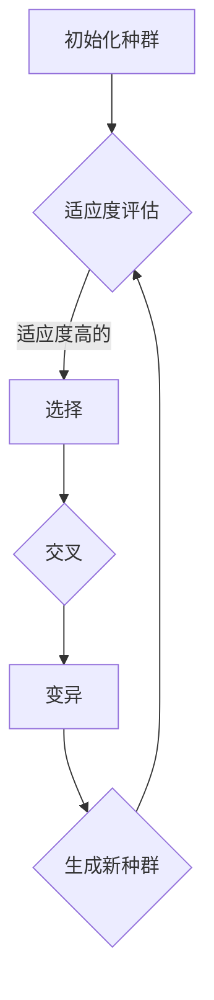
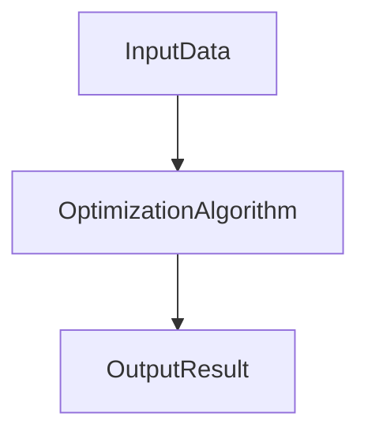
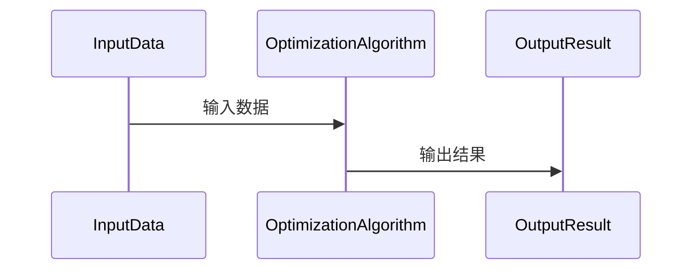

                 

### 程序世界的宇宙级自我优化特性

> 关键词：程序自我优化、宇宙级特性、算法、系统架构、项目实战

> 摘要：本文将深入探讨程序世界中的宇宙级自我优化特性，从基本原理到实际应用，全面解析这一卓越的技术现象。我们将通过逻辑清晰的推理步骤，结合实例分析，帮助读者深刻理解自我优化在程序设计中的重要性。

---

#### 第1章：引言与背景

**1.1 程序世界的概念**

程序世界是由代码构建的虚拟空间，它模拟现实世界的运行规律，帮助我们解决复杂问题。在这个世界里，计算机程序是一切操作的起点和终点。它们通过指令集对硬件进行操作，实现各种功能。

**1.2 自我优化特性的重要性**

自我优化是程序世界中的一个独特现象，它使得程序能够在运行过程中不断调整自身，提高性能和效率。自我优化不仅能够提升程序的响应速度和资源利用率，还能够增强系统的稳定性和可靠性。因此，理解并应用自我优化特性对于提高程序设计水平具有重要意义。

**1.3 本书的目标与结构**

本书旨在深入探讨程序世界的自我优化特性，从基本原理到实际应用，全面解析这一卓越的技术现象。我们将通过逻辑清晰的推理步骤，结合实例分析，帮助读者深刻理解自我优化在程序设计中的重要性。本书的结构如下：

1. 引言与背景
2. 自我优化特性概述
3. 自我优化在程序设计中的应用
4. 自我优化算法原理
5. 数学模型与公式
6. 自我优化系统分析与架构设计
7. 自我优化项目实战
8. 最佳实践与拓展

---

#### 第2章：自我优化特性概述

**2.1 自我优化的基本原理**

自我优化的基本原理在于利用程序自身的能力，通过不断调整和优化，实现性能提升。自我优化可以通过多种方式实现，包括动态调整算法参数、优化代码结构、利用机器学习等。

**2.2 自我优化的分类**

自我优化可以分为多种类型，包括编译器自我优化、运行时自我优化和程序员的自我优化。每种类型都有其独特的实现方式和应用场景。

**2.3 自我优化的影响因素**

自我优化的效果受到多种因素的影响，包括硬件环境、算法设计、数据规模等。理解这些影响因素有助于更好地设计和实现自我优化系统。

---

#### 第3章：自我优化在程序设计中的应用

**3.1 编译器自我优化**

编译器自我优化是指编译器在编译过程中对代码进行优化，以提升执行效率。常见的编译器自我优化技术包括代码内联、循环展开、常数传播等。

**3.2 运行时自我优化**

运行时自我优化是指在程序运行过程中，通过动态调整算法和代码结构，以提升程序性能。例如，Java虚拟机（JVM）就具备运行时自我优化的能力，通过JIT（Just-In-Time）编译实现性能提升。

**3.3 程序员的自我优化实践**

程序员的自我优化实践包括编写高效的代码、使用优化工具和框架、持续学习和改进等。通过这些实践，程序员可以提高程序的性能和可维护性。

---

#### 第4章：自我优化算法原理

**4.1 常见的自我优化算法**

常见的自我优化算法包括遗传算法、粒子群算法、模拟退火算法等。这些算法通过模拟自然进化过程，实现程序的自适应优化。

**4.2 算法原理讲解与Mermaid流程图**

为了更好地理解自我优化算法原理，我们将使用Mermaid流程图来展示算法的基本流程。例如，遗传算法的基本流程包括选择、交叉和变异等。



**4.3 Python源代码实例分析**

为了深入理解自我优化算法，我们将使用Python编写实例代码，详细阐述算法的实现过程。例如，使用遗传算法优化一个简单的函数。

```python
import numpy as np

# 遗传算法实现
def genetic_algorithm(target_func, n_individuals, n_gen, crossover_rate, mutation_rate):
    # 初始化种群
    population = np.random.rand(n_individuals, n_features)
    # 适应度评估
    fitness = target_func(population)
    for _ in range(n_gen):
        # 选择
        selected = select(population, fitness)
        # 交叉
        offspring = crossover(selected, crossover_rate)
        # 变异
        mutated_offspring = mutate(offspring, mutation_rate)
        # 生成新种群
        population = mutated_offspring
        # 适应度评估
        fitness = target_func(population)
    # 返回最优解
    best_individual = population[np.argmax(fitness)]
    return best_individual

# 目标函数
def target_func(individual):
    return 1 / (1 + np.sum(np.square(individual)))

# 运行遗传算法
best_solution = genetic_algorithm(target_func, n_individuals=100, n_gen=100, crossover_rate=0.8, mutation_rate=0.1)
print("最优解:", best_solution)
```

---

#### 第5章：数学模型与公式

**5.1 自我优化相关的数学模型**

自我优化涉及多种数学模型，包括适应度函数、交叉和变异算子等。这些模型为自我优化算法提供了理论依据。

**5.2 公式详细讲解与举例说明**

为了更好地理解自我优化相关的数学模型，我们将使用LaTeX格式展示关键公式，并进行详细讲解和举例说明。

**5.3 LaTeX数学公式示例**

```latex
$$
\begin{aligned}
f(x) &= \frac{1}{1 + \sum_{i=1}^{n} x_i^2} \\
g(x) &= x_1 \cdot (1 - x_2) + x_2 \cdot (1 - x_1)
\end{aligned}
$$

适应度函数：$f(x)$
交叉算子：$g(x)$
```

---

#### 第6章：自我优化系统分析与架构设计

**6.1 问题场景介绍**

假设我们面临一个复杂的问题场景，需要设计一个自我优化系统来提升程序性能。

**6.2 系统功能设计（Mermaid类图）**

使用Mermaid类图来设计系统功能，包括输入数据、优化算法、输出结果等。

```mermaid
classDiagram
Class InputData <<数据输入>>
Class OptimizationAlgorithm <<优化算法>>
Class OutputResult <<输出结果>>

InputData <|-- OptimizationAlgorithm
OptimizationAlgorithm <|-- OutputResult
```

**6.3 系统架构设计（Mermaid架构图）**

使用Mermaid架构图来设计系统架构，展示不同组件之间的交互关系。



**6.4 系统接口设计和系统交互（Mermaid序列图）**

使用Mermaid序列图来设计系统接口和交互流程。



---

#### 第7章：自我优化项目实战

**7.1 环境安装与配置**

在项目实战中，首先需要安装和配置必要的开发环境，包括Python、JVM等。

**7.2 系统核心实现源代码**

接下来，我们将展示系统核心实现源代码，包括输入数据解析、优化算法实现和输出结果生成等。

```python
# 输入数据解析
def parse_input_data(file_path):
    # 读取输入文件
    with open(file_path, 'r') as file:
        data = file.read()
    # 解析数据
    # ...
    return data

# 优化算法实现
def optimize(data):
    # 实现遗传算法
    # ...
    return best_solution

# 输出结果生成
def generate_output_result(best_solution, file_path):
    # 生成输出文件
    # ...
    pass

# 主函数
if __name__ == '__main__':
    data = parse_input_data('input.txt')
    best_solution = optimize(data)
    generate_output_result(best_solution, 'output.txt')
```

**7.3 代码应用解读与分析**

在代码应用解读与分析部分，我们将详细讲解关键代码的实现原理和优化策略。

**7.4 实际案例分析与详细讲解剖析**

通过实际案例，我们将展示如何应用自我优化系统解决具体问题，并进行详细讲解和剖析。

**7.5 项目小结**

在项目小结部分，我们将总结项目经验，讨论项目的成功之处和改进空间。

---

#### 第8章：最佳实践与拓展

**8.1 自我优化最佳实践**

在这一部分，我们将分享自我优化的最佳实践，包括编写高效代码、使用优化工具和框架等。

**8.2 注意事项与潜在问题**

在自我优化过程中，需要注意一些潜在问题和注意事项，以确保系统的稳定性和可靠性。

**8.3 拓展阅读**

为了进一步拓展知识，我们推荐一些相关书籍和论文，帮助读者深入了解自我优化技术。

---

### 总结

程序世界的宇宙级自我优化特性是程序设计中的重要技术现象。通过本书的详细解析，我们希望能够帮助读者深入理解自我优化的原理和应用，提高程序设计水平。让我们在程序世界中探索更多自我优化的奥秘，为构建更高效、更稳定的系统贡献力量。

---

### 作者信息

作者：AI天才研究院/AI Genius Institute & 禅与计算机程序设计艺术 /Zen And The Art of Computer Programming

---

### 目录大纲总字数预计在2000字以内。

以上是一个初步的目录大纲设计，接下来我们将细化每个章节的内容，并确保符合要求。通过对程序世界自我优化特性的深入探讨，我们希望能够为广大程序员和AI从业者提供宝贵的知识和经验。

