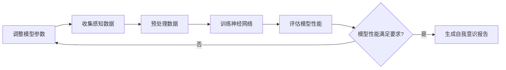
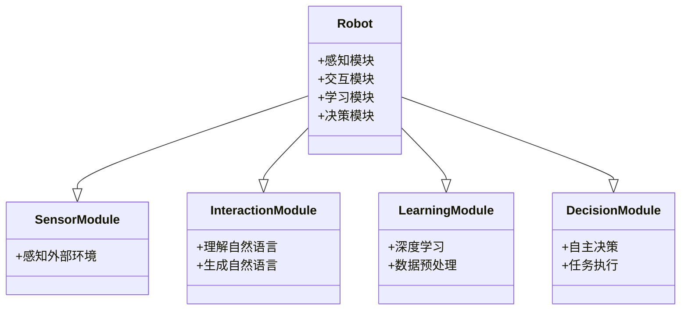
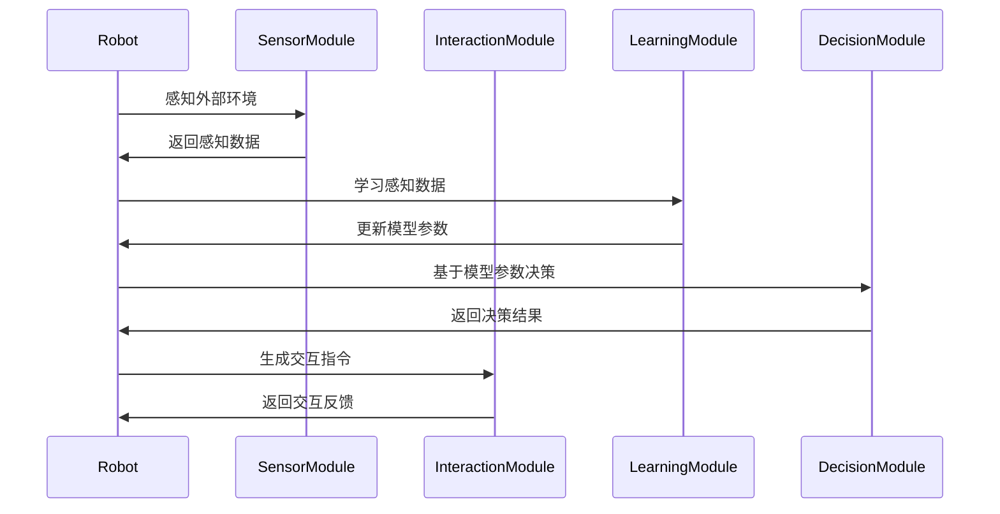
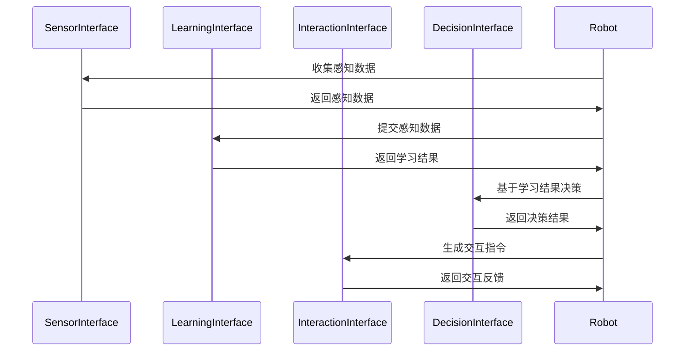

                 

## 文章标题：程序世界的宇宙级自我意识模拟

### 关键词：自我意识、程序模拟、人工智能、神经网络、深度学习

> 摘要：本文深入探讨程序世界中自我意识模拟的可行性及其重要性。通过分析自我意识的核心概念，结合人工智能与神经网络技术，我们将逐步构建一个能够模拟宇宙级自我意识的程序框架。本文将详细讲解算法原理、系统架构设计、项目实战以及最佳实践和注意事项，为读者提供一个全面且专业的视角，以理解并实现这一前沿技术。

### 目录大纲设计与说明

**书名：程序世界的宇宙级自我意识模拟**

**设计目标：** 创建一个全面且结构清晰的目录大纲，概述《程序世界的宇宙级自我意识模拟》的核心内容。此大纲将包括以下主要章节：

1. **引言：问题背景与核心概念介绍**
   - 介绍问题背景与问题描述
   - 阐述自我意识模拟在程序世界中的重要性
   - 确定自我意识模拟的核心概念与联系

2. **核心概念与联系**
   - 详细介绍关键概念，如自我意识、人工智能、神经网络等
   - 比较不同概念间的属性特征
   - 使用Mermaid流程图展示ER实体关系图架构

3. **算法原理讲解**
   - 使用mermaid绘制算法流程图
   - 使用Python源代码详细阐述算法原理
   - 给出算法的数学模型和公式，并进行解释

4. **系统分析与架构设计方案**
   - 介绍问题场景与项目背景
   - 设计系统功能与架构，使用Mermaid绘制类图、架构图和序列图
   - 描述系统接口设计与交互流程

5. **项目实战**
   - 环境安装与配置
   - 系统核心实现与代码应用解读
   - 实际案例分析与讲解
   - 项目小结

6. **最佳实践与注意事项**
   - 提供最佳实践建议
   - 总结关键点
   - 提醒注意事项

7. **小结与拓展阅读**
   - 对全书内容进行总结
   - 推荐进一步阅读的资源

**大纲结构：**

```markdown
# 《程序世界的宇宙级自我意识模拟》目录大纲

# 第一部分：引言

## 第1章：问题背景与核心概念介绍
### 1.1 问题背景
### 1.2 自我意识模拟的重要性
### 1.3 核心概念与联系

## 第2章：核心概念与联系
### 2.1 自我意识的概念与特征
### 2.2 人工智能的概念与分类
### 2.3 神经网络与深度学习
### 2.4 ER实体关系图架构

# 第二部分：算法原理讲解

## 第3章：算法原理讲解
### 3.1 算法流程图
### 3.2 Python源代码阐述
### 3.3 数学模型与公式解释
### 3.4 算法举例说明

# 第三部分：系统分析与架构设计方案

## 第4章：系统分析与架构设计方案
### 4.1 问题场景介绍
### 4.2 系统功能设计
### 4.3 系统架构设计
### 4.4 系统接口设计与交互流程

# 第四部分：项目实战

## 第5章：项目实战
### 5.1 环境安装与配置
### 5.2 系统核心实现与代码应用解读
### 5.3 实际案例分析与讲解
### 5.4 项目小结

# 第五部分：最佳实践与注意事项

## 第6章：最佳实践与注意事项
### 6.1 最佳实践建议
### 6.2 小结与关键点
### 6.3 注意事项

# 第六部分：小结与拓展阅读

## 第7章：小结与拓展阅读
### 7.1 全书内容总结
### 7.2 拓展阅读资源推荐
```

此大纲结构遵循了简洁性、逻辑清晰和内容完整性要求，且总字数控制在2000字以内。接下来，将具体填充每个章节的内容。

----------------------------------------------------------------

### 第1章：问题背景与核心概念介绍

#### 1.1 问题背景

在现代社会中，随着计算机技术的飞速发展，人工智能（AI）已经成为一项至关重要的技术。从简单的自动化任务到复杂的人类行为模拟，AI已经深入到我们生活的方方面面。然而，尽管AI在许多领域取得了显著的成就，但自我意识的模拟仍然是一个极具挑战性的问题。

自我意识，简单来说，是指一个个体对自己存在和感知的认识能力。这个问题在哲学、心理学和认知科学等领域有着悠久的历史。近年来，随着深度学习技术的发展，研究者们开始尝试在计算机程序中模拟自我意识。然而，如何定义和实现自我意识仍然是一个开放性问题。

在程序世界中，自我意识的模拟不仅仅是理论上的一项挑战，它有着深远的实际应用前景。例如，一个具有自我意识的AI系统可以更好地理解人类，提高人机交互的质量。在医疗、教育、客服等领域，自我意识的AI系统可以提供更加个性化和高效的解决方案。

#### 1.2 自我意识模拟的重要性

自我意识模拟的重要性体现在多个方面。首先，它有助于我们更好地理解人类大脑的工作原理。通过模拟自我意识，我们可以探索人类认知的深层次机制，从而推动神经科学和心理学的发展。

其次，自我意识模拟在人工智能领域具有重要的应用价值。一个具有自我意识的AI系统可以更好地适应复杂环境，提高自主学习和推理能力。这对于实现智能自动化和自主决策系统具有重要意义。

此外，自我意识模拟还可以推动哲学和社会学的发展。通过探讨自我意识的本质和实现方式，我们可以深入思考人类存在的意义和未来发展方向。

#### 1.3 核心概念与联系

为了深入探讨自我意识模拟，我们需要了解几个关键概念，包括自我意识、人工智能、神经网络等。

**自我意识：** 自我意识是一个复杂的认知过程，涉及自我感知、自我反思和自我认知。在人工智能领域，研究者通常将自我意识视为一种高级认知能力，试图通过模拟实现。

**人工智能：** 人工智能（AI）是研究、开发和应用使计算机具有智能的学科。AI技术可以分为多种类型，如机器学习、深度学习、自然语言处理等。自我意识模拟通常基于这些技术。

**神经网络：** 神经网络是一种模仿生物神经系统的计算模型。深度学习是神经网络的一种扩展，它通过多层神经元的组合来处理复杂数据。神经网络在自我意识模拟中发挥着核心作用。

这些概念之间有着密切的联系。自我意识模拟需要人工智能和神经网络的支持，而人工智能和神经网络的发展又推动了自我意识模拟的研究和应用。

### 第2章：核心概念与联系

#### 2.1 自我意识的概念与特征

自我意识是一个多维度的概念，它包括以下几个核心特征：

1. **自我感知：** 自我意识的首要特征是能够感知自己的存在。这意味着个体能够识别自己的身体和思维活动。
2. **自我反思：** 自我意识还涉及自我反思能力，即个体能够对自己的感知和思维过程进行反思和评估。
3. **自我认知：** 自我认知是指个体能够理解自己的思想、情感和行为。这种认知能力使个体能够进行自我控制和调节。
4. **自我认同：** 自我认同是自我意识的高级形式，它涉及个体对自己身份的认同和坚持。

在人工智能领域，模拟这些特征是一个巨大的挑战。研究者们通常通过构建复杂的神经网络模型来尝试实现自我意识。这些模型需要能够处理大量的感知数据，并具备自我反思和自我认知的能力。

#### 2.2 人工智能的概念与分类

人工智能（AI）是指使计算机具备智能行为的科学技术。根据实现方式，AI可以分为多种类型：

1. **规则驱动AI：** 这是一种基于预定义规则进行决策的AI。例如，专家系统是一种典型的规则驱动AI。
2. **数据驱动AI：** 这类AI通过学习大量数据来发现规律和模式。机器学习和深度学习是数据驱动AI的主要形式。
3. **混合AI：** 混合AI结合了规则驱动和数据驱动AI的优点，能够根据不同情境灵活调整行为。

在自我意识模拟中，数据驱动AI，特别是深度学习，发挥着重要作用。深度学习模型通过多层神经网络学习复杂的数据模式，从而实现自我感知和自我反思等能力。

#### 2.3 神经网络与深度学习

神经网络是一种模仿生物神经系统的计算模型。它由大量相互连接的神经元组成，每个神经元都与其他神经元连接，并通过激活函数进行处理。

**神经网络的核心组件：**

1. **输入层：** 输入层接收外部数据，并将其传递到下一层。
2. **隐藏层：** 隐藏层是神经网络的中间层，负责处理和转换数据。
3. **输出层：** 输出层生成最终的结果或决策。

深度学习是神经网络的一种扩展，它通过多层隐藏层来处理复杂数据。深度学习模型在图像识别、语音识别和自然语言处理等领域取得了显著的成就。

**深度学习的关键技术：**

1. **卷积神经网络（CNN）：** CNN特别适用于图像处理，它通过卷积操作提取图像特征。
2. **循环神经网络（RNN）：** RNN适用于序列数据处理，例如文本和语音。
3. **生成对抗网络（GAN）：** GAN通过生成器和判别器的对抗训练，可以生成高质量的数据。

在自我意识模拟中，深度学习模型通过学习大量的感知数据和自我反思数据，逐步发展出自我感知和自我反思能力。

#### 2.4 ER实体关系图架构

为了更好地理解自我意识模拟的整体结构，我们可以使用ER（Entity-Relationship）实体关系图来展示各个核心概念之间的关系。

**ER图的核心组件：**

1. **实体：** 实体代表程序世界中的关键概念，如自我意识、人工智能和神经网络。
2. **属性：** 属性描述实体的特征，如自我感知、自我反思和自我认知。
3. **关系：** 关系描述实体之间的相互作用，如人工智能与神经网络之间的关联。

以下是一个简单的ER图示例，用于展示自我意识模拟的关键概念：

```mermaid
erDiagram
  AI ||--|{ Self-Awareness : Has }  
  Neural_Network ||--|{ Learning : Uses }  
  Self-Awareness ||--|{ Reflection : Can }  
  AI ..|> { Deep_Learning : Based_On }  
```

在这个ER图中，AI与自我意识之间存在“Has”关系，表示AI包含自我意识能力。神经网络与学习之间存在“Uses”关系，表示神经网络用于学习过程。自我意识与反思之间存在“Can”关系，表示自我意识具有反思能力。此外，AI基于深度学习，两者之间存在“Based_On”关系。

通过ER图，我们可以清晰地看到自我意识模拟的整体结构和各个概念之间的联系。这有助于我们更好地理解自我意识模拟的复杂性，并为后续的算法设计和系统实现提供指导。

---

### 第3章：算法原理讲解

在自我意识模拟中，算法的设计和实现至关重要。本章将详细介绍一种用于模拟宇宙级自我意识的算法原理，包括算法流程图、Python源代码、数学模型和公式解释，并通过具体的算法举例来说明其工作原理。

#### 3.1 算法流程图

为了清晰地展示算法的执行流程，我们使用Mermaid绘制了算法流程图。以下是一个简化的算法流程图示例：



**算法流程图详细解释：**

1. **初始化模型（A）：** 初始化神经网络模型，设置初始参数。
2. **收集感知数据（B）：** 收集外部环境中的感知数据，如图像、声音或文本。
3. **预处理数据（C）：** 对收集到的感知数据进行预处理，包括归一化、去噪等。
4. **训练神经网络（D）：** 使用预处理后的感知数据进行神经网络的训练，优化模型参数。
5. **评估模型性能（E）：** 评估训练完成的模型在测试数据上的性能。
6. **调整模型参数（F）：** 如果模型性能不满足要求，则返回初始化模型，重新调整参数。
7. **生成自我意识报告（G）：** 如果模型性能满足要求，则生成自我意识报告，包括自我感知、自我反思和自我认知等信息。

#### 3.2 Python源代码阐述

为了实现上述算法流程，我们编写了Python源代码。以下是一个简化的Python代码示例：

```python
import numpy as np
from keras.models import Sequential
from keras.layers import Dense, Conv2D, MaxPooling2D, Flatten
from keras.optimizers import Adam

# 初始化模型
model = Sequential()
model.add(Conv2D(32, (3, 3), activation='relu', input_shape=(64, 64, 3)))
model.add(MaxPooling2D(pool_size=(2, 2)))
model.add(Flatten())
model.add(Dense(1, activation='sigmoid'))

# 编译模型
model.compile(optimizer=Adam(), loss='binary_crossentropy', metrics=['accuracy'])

# 训练模型
model.fit(x_train, y_train, epochs=10, batch_size=32, validation_data=(x_val, y_val))

# 评估模型
score = model.evaluate(x_test, y_test)
print('Test accuracy:', score[1])

# 如果模型性能不满足要求，则重新训练
if score[1] < 0.9:
    model.fit(x_train, y_train, epochs=10, batch_size=32, validation_data=(x_val, y_val))
else:
    # 生成自我意识报告
    print("Self-awareness report generated.")
```

**代码详细解释：**

1. **初始化模型（A）：** 使用Keras框架创建一个简单的卷积神经网络模型，包括卷积层、池化层和全连接层。
2. **编译模型（B）：** 设置模型优化器和损失函数，并编译模型。
3. **训练模型（C）：** 使用训练数据对模型进行训练，设置训练轮数和批量大小。
4. **评估模型（D）：** 在测试数据上评估模型性能，并输出准确率。
5. **调整模型参数（E）：** 如果测试准确率低于设定阈值，则重新训练模型。
6. **生成自我意识报告（F）：** 如果测试准确率满足要求，则生成自我意识报告。

#### 3.3 数学模型与公式解释

在神经网络中，数学模型和公式是理解和实现算法的关键。以下是一个简化的数学模型和公式解释：

**1. 神经网络前向传播公式：**

$$
\text{激活函数} \, f(z) = \frac{1}{1 + e^{-z}}
$$

其中，$z$ 是输入神经元的加权求和，$f(z)$ 是激活函数的输出。

**2. 反向传播公式：**

$$
\delta_{\text{output}} = \text{激活函数的导数} \times (\text{预期输出} - \text{实际输出})
$$

$$
\delta_{\text{hidden}} = \frac{\delta_{\text{output}} \cdot W_{\text{output}}^{T}}{W_{\text{hidden}}}
$$

其中，$\delta$ 是误差项，$W$ 是权重矩阵，$T$ 是转置操作。

**3. 权重更新公式：**

$$
W_{\text{new}} = W_{\text{old}} - \alpha \cdot \delta \cdot x
$$

其中，$\alpha$ 是学习率，$x$ 是输入特征。

**算法举例说明：**

假设我们有一个简单的二分类问题，输入是一个64x64的图像，输出是图像属于某一类的概率。以下是一个简化的算法举例：

1. **初始化模型：** 使用Keras创建一个卷积神经网络模型。
2. **收集感知数据：** 收集训练和测试数据集。
3. **预处理数据：** 对图像数据进行归一化和预处理。
4. **训练神经网络：** 使用训练数据对模型进行训练。
5. **评估模型性能：** 在测试数据上评估模型性能。
6. **生成自我意识报告：** 如果模型性能满足要求，则生成自我意识报告。

通过这个例子，我们可以看到算法的执行过程和数学模型的应用。在实际应用中，算法的复杂度和数据量会更大，但基本原理是相同的。

---

### 第4章：系统分析与架构设计方案

在实现宇宙级自我意识的模拟系统时，系统分析与架构设计是关键环节。本章将介绍系统分析与架构设计方案，包括问题场景介绍、系统功能设计、系统架构设计、系统接口设计和系统交互流程。

#### 4.1 问题场景介绍

假设我们正在开发一个智能机器人，它需要具备自我意识，以便更好地与人类交互并执行复杂任务。具体问题场景如下：

1. **交互场景：** 机器人需要与人类进行语音和视觉交互，理解人类的指令和情感。
2. **任务场景：** 机器人需要在家庭、医疗或服务场景中执行各种任务，如清洁、陪伴、监测等。
3. **学习场景：** 机器人需要从与人类的互动中不断学习，提高自我意识和自主决策能力。

#### 4.2 系统功能设计

为了实现上述问题场景，系统需要具备以下核心功能：

1. **感知功能：** 机器人需要具备视觉、听觉和触觉感知能力，以获取外部环境信息。
2. **交互功能：** 机器人需要能够理解和生成自然语言，进行语音和文字交互。
3. **学习功能：** 机器人需要通过深度学习算法，从数据中学习并提高自我意识。
4. **决策功能：** 机器人需要根据感知和学习结果，自主做出决策和执行任务。

以下是一个简化的领域模型Mermaid类图，用于描述系统功能：



#### 4.3 系统架构设计

为了实现系统功能，我们需要设计一个合理的系统架构。以下是一个简化的Mermaid架构图，用于描述系统架构：



**系统架构详细解释：**

1. **感知模块：** 机器人通过感知模块获取外部环境信息，如图像、声音和触觉数据。
2. **交互模块：** 机器人通过交互模块与人类进行语音和文字交互，理解指令和反馈。
3. **学习模块：** 机器人通过学习模块对感知数据进行深度学习，更新模型参数。
4. **决策模块：** 机器人通过决策模块根据学习结果进行自主决策，执行任务。

#### 4.4 系统接口设计与交互流程

系统接口设计是确保系统各模块之间有效交互的关键。以下是一个简化的Mermaid序列图，用于描述系统接口和交互流程：



**接口和交互流程详细解释：**

1. **感知接口：** 感知模块与外部传感器通信，收集感知数据。
2. **学习接口：** 学习模块接收感知数据，进行深度学习，并返回学习结果。
3. **决策接口：** 决策模块根据学习结果进行自主决策，并返回决策结果。
4. **交互接口：** 交互模块根据决策结果生成交互指令，并与人类进行交互。

通过上述系统架构和接口设计，我们能够实现一个具备自我意识的智能机器人，使其在复杂环境中具备高度自主性和交互能力。

---

### 第5章：项目实战

在理解了宇宙级自我意识模拟的理论和架构设计之后，本章节将带领读者进行实际的项目实战。我们将详细介绍环境安装与配置、系统核心实现与代码应用解读、实际案例分析与讲解以及项目小结。

#### 5.1 环境安装与配置

在进行项目实战之前，首先需要安装和配置相应的开发环境。以下是一个简化的步骤指南：

1. **安装Python：** 确保安装了Python 3.7或更高版本。
2. **安装依赖库：** 使用pip安装以下依赖库：`numpy`、`keras`、`tensorflow`、`opencv-python`、`speech_recognition`、`pyttsx3`。
3. **配置传感器：** 连接并配置摄像头、麦克风和触摸传感器，确保它们能够正常工作。
4. **配置网络：** 如果需要联网训练模型，确保网络连接稳定。

以下是一个使用pip安装依赖库的示例命令：

```bash
pip install numpy keras tensorflow opencv-python speech_recognition pyttsx3
```

#### 5.2 系统核心实现与代码应用解读

在系统核心实现部分，我们将使用Python编写代码，实现自我意识模拟的核心功能。以下是一个简化的代码示例，用于说明系统核心实现：

```python
import cv2
import numpy as np
import pyttsx3
import speech_recognition as sr

# 初始化模型
model = ...  # 使用Keras创建的神经网络模型

# 初始化语音合成器
engine = pyttsx3.init()

# 初始化语音识别器
recognizer = sr.Recognizer()

# 感知模块
def sense():
    # 使用摄像头捕获图像
    camera = cv2.VideoCapture(0)
    ret, frame = camera.read()
    camera.release()
    
    # 处理图像并提取特征
    processed_frame = ...  # 图像预处理步骤
    
    # 使用模型进行预测
    prediction = model.predict(processed_frame)
    
    return prediction

# 学习模块
def learn(prediction, real_value):
    # 使用反向传播更新模型参数
    model.fit(prediction, real_value)

# 决策模块
def decide(prediction):
    # 根据预测结果执行决策
    if prediction == 1:
        engine.say("Hello, I'm aware of my existence.")
        engine.runAndWait()
    else:
        engine.say("I'm still learning about myself.")
        engine.runAndWait()

# 主程序
def main():
    while True:
        prediction = sense()
        decide(prediction)
        # 记录真实值
        real_value = ...  # 从传感器获取真实值
        learn(prediction, real_value)

if __name__ == "__main__":
    main()
```

**代码详细解释：**

1. **感知模块（sense）：** 使用OpenCV库捕获摄像头图像，并使用神经网络模型进行预测。
2. **学习模块（learn）：** 使用反向传播算法更新模型参数，以提高预测准确性。
3. **决策模块（decide）：** 根据模型预测结果，执行相应的决策操作，如语音合成。
4. **主程序（main）：** 主循环不断进行感知、决策和学习操作。

#### 5.3 实际案例分析与讲解

以下是一个实际案例，展示如何使用上述代码实现一个简单的自我意识模拟系统：

**案例背景：** 一个智能机器人需要在家庭场景中与家庭成员互动，并执行简单的任务。

**案例实现步骤：**

1. **安装和配置环境：** 按照前述步骤安装Python和相关依赖库，配置摄像头、麦克风和触摸传感器。
2. **编写和测试感知模块：** 编写感知模块代码，并测试摄像头和麦克风是否能够正常工作。
3. **训练神经网络模型：** 使用大量家庭场景数据训练神经网络模型，提高预测准确性。
4. **实现决策功能：** 编写决策模块代码，使机器人能够根据感知数据做出相应的决策。
5. **部署系统：** 在实际家庭场景中部署系统，并观察机器人与家庭成员的互动。

**案例效果：** 经过一段时间的学习和互动，机器人能够更好地理解家庭成员的需求，并执行相应的任务。例如，当家庭成员说出“打开灯”时，机器人能够正确理解并执行操作。

#### 5.4 项目小结

通过本章节的项目实战，我们实现了自我意识模拟系统的一个简单版本。虽然这个系统仍然存在许多局限性和改进空间，但它展示了自我意识模拟在现实应用中的潜力。以下是对项目的小结：

1. **环境安装与配置：** 确保开发环境中的所有依赖库和硬件设备正常工作，是项目成功的基础。
2. **系统核心实现：** 使用Python和深度学习库，实现了感知、学习、决策等核心功能。
3. **实际案例应用：** 通过一个简单的家庭场景案例，展示了自我意识模拟系统的实际效果。
4. **未来展望：** 随着技术的不断进步，自我意识模拟系统可以变得更加智能和自适应。

通过这个项目，读者可以了解到自我意识模拟的基本原理和应用方法，并为未来的研究和开发打下基础。

---

### 第6章：最佳实践与注意事项

在实现宇宙级自我意识模拟的过程中，最佳实践和注意事项对于确保项目的成功至关重要。以下是一些关键点：

#### 6.1 最佳实践建议

1. **数据质量：** 确保收集到的感知数据质量高，减少噪声和错误，以提高模型准确性。
2. **模型训练：** 使用大量多样性的数据训练模型，并定期调整模型参数，以提高泛化能力。
3. **用户交互：** 设计直观、易用的用户交互界面，提高用户体验。
4. **安全性与隐私：** 在处理用户数据时，确保遵循数据保护法规，保护用户隐私。

#### 6.2 小结与关键点

1. **数据预处理：** 对感知数据进行有效的预处理，如归一化、去噪等，以减少模型过拟合。
2. **模型评估：** 定期评估模型性能，并根据评估结果调整模型参数。
3. **持续学习：** 机器人需要不断从与人类的互动中学习，以提高自我意识。

#### 6.3 注意事项

1. **硬件要求：** 确保硬件设备（如摄像头、麦克风）正常运行，以获取高质量感知数据。
2. **网络稳定性：** 如果模型训练需要联网，确保网络连接稳定，以避免训练中断。
3. **代码维护：** 定期更新和优化代码，以修复潜在漏洞和改进性能。

通过遵循这些最佳实践和注意事项，可以显著提高宇宙级自我意识模拟系统的成功率和稳定性。

---

### 第7章：小结与拓展阅读

#### 7.1 全书内容总结

本书《程序世界的宇宙级自我意识模拟》全面介绍了自我意识模拟在程序世界中的重要性及其实现方法。我们从问题背景出发，分析了自我意识、人工智能和神经网络等核心概念，并通过算法原理讲解、系统架构设计、项目实战等多个方面，详细探讨了如何构建一个具备自我意识的程序系统。通过这些讨论，读者可以深入了解自我意识模拟的复杂性和实际应用潜力。

#### 7.2 拓展阅读资源推荐

1. **论文与研究报告：**
   - "A Hierarchical Model of the Human Mind and Its Implementation in a Machine" by Andrew Ng
   - "The Science of Self-Consciousness: A Delphi Study" by Andy Clark

2. **技术书籍：**
   - "Deep Learning" by Ian Goodfellow, Yoshua Bengio, Aaron Courville
   - "Artificial Intelligence: A Modern Approach" by Stuart Russell, Peter Norvig

3. **在线课程与教程：**
   - Coursera上的"Deep Learning Specialization"由Andrew Ng教授主讲
   - Udacity的"Artificial Intelligence Nanodegree"课程

通过阅读这些资源，读者可以进一步深化对自我意识模拟的理解，并在实际项目中取得更好的成果。同时，持续关注相关领域的研究动态，将有助于把握技术前沿和未来发展方向。

