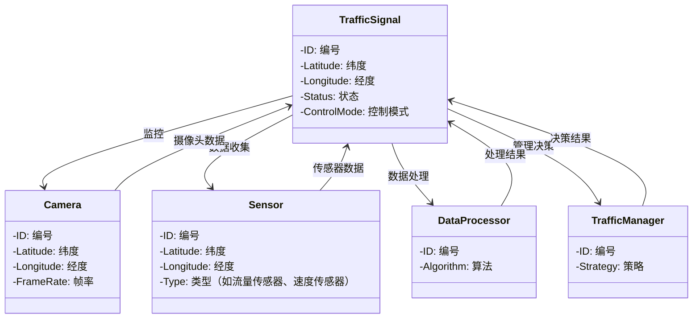
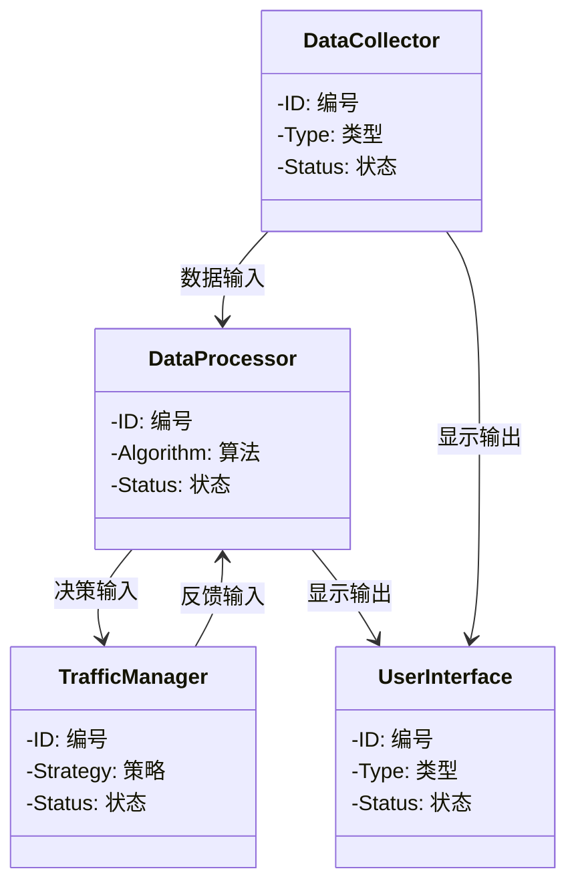
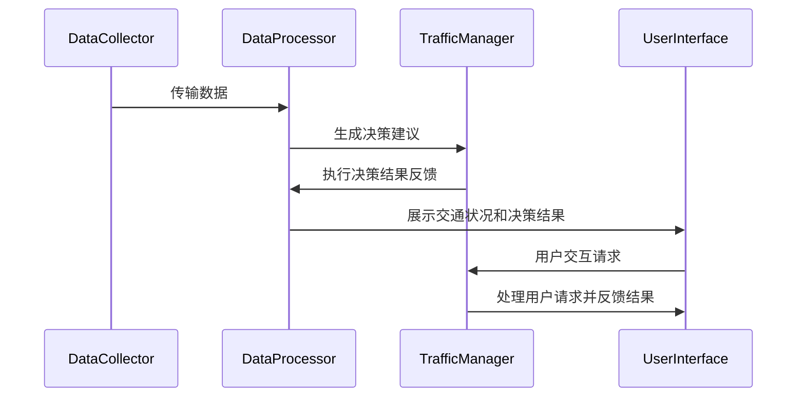

                 

### 文章标题

《程序世界的宇宙级自我意识涌现临界动力学模拟》

### 关键词

- 程序世界
- 宇宙级自我意识
- 涌现
- 临界动力学模拟
- 人工智能

### 摘要

本文深入探讨了程序世界中宇宙级自我意识的涌现机制及其在临界动力学模拟中的应用。通过对核心概念、算法原理、系统架构以及实际项目的详细剖析，我们揭示了自我意识在程序模拟中的本质与实现方法，并展望了未来研究的方向。本文旨在为读者提供一份全面、系统且易懂的技术指南，以引领读者探索计算机模拟中的这一前沿领域。

---

## 目录大纲设计思路

为了设计出符合要求且详尽的《程序世界的宇宙级自我意识涌现临界动力学模拟》一书的目录大纲，我们需要从以下几个关键步骤进行：

### 1. 理解书名与主题

首先，我们需要理解书名的含义和主题。书名中的“程序世界的宇宙级自我意识涌现”暗示了本书将探讨一种高级的计算机模拟，它模拟了类似于宇宙中的自我意识现象在计算机程序中的涌现。关键词包括“程序世界”、“宇宙级自我意识”、“涌现”、“临界动力学模拟”。

### 2. 确定核心章节

根据书名和主题，我们可以确定以下几个核心章节：

- **背景介绍**：介绍相关概念、问题背景和现实意义。
- **核心概念与联系**：详细阐述“宇宙级自我意识”和“临界动力学模拟”的概念、属性和相互关系。
- **算法原理讲解**：讲解模拟算法的原理，包括数学模型和公式，并用示例和流程图解释。
- **系统分析与架构设计方案**：介绍系统功能和架构设计，包括领域模型、系统架构、接口设计和交互序列图。
- **项目实战**：通过具体项目展示如何实施模拟，包括环境安装、核心代码实现和分析。
- **最佳实践 tips、小结、注意事项、拓展阅读**：总结实战经验，提出注意事项，推荐进一步阅读的材料。

### 3. 细化目录结构

每个核心章节都需要进一步细化，包括二级目录和三级目录，以确保内容完整和结构清晰。以下是具体的目录大纲设计：

#### 目录大纲

----------------------------------------------------------------

# 第一部分: 背景与概念

## 第1章: 程序世界的宇宙级自我意识

### 1.1 程序世界的定义
### 1.2 宇宙级自我意识的概念
### 1.3 自我意识在程序世界的意义

## 第2章: 临界动力学模拟基础

### 2.1 临界动力学的原理
### 2.2 模拟中的自我意识涌现
### 2.3 临界动力学与程序模拟

# 第二部分: 核心概念与联系

## 第3章: 核心概念解析

### 3.1 自我意识的属性与特征
### 3.2 临界动力学的数学模型
### 3.3 概念联系与融合

## 第4章: 自我意识涌现的模拟方法

### 4.1 模拟方法概述
### 4.2 机器学习在模拟中的应用
### 4.3 深度学习与自我意识模拟

# 第三部分: 系统分析与架构设计

## 第5章: 系统功能设计

### 5.1 问题场景介绍
### 5.2 领域模型设计
### 5.3 系统功能设计

## 第6章: 系统架构设计

### 6.1 系统架构设计概述
### 6.2 系统架构图解读
### 6.3 系统接口设计

## 第7章: 系统交互设计

### 7.1 系统交互概述
### 7.2 系统交互序列图
### 7.3 交互流程与性能分析

# 第四部分: 项目实战

## 第8章: 项目环境安装与配置

### 8.1 环境需求
### 8.2 安装步骤
### 8.3 配置与调试

## 第9章: 项目核心实现与分析

### 9.1 核心代码实现
### 9.2 代码解读与分析
### 9.3 实际案例分析与讲解

## 第10章: 项目小结

### 10.1 项目总结
### 10.2 遇到的问题与解决
### 10.3 未来工作展望

# 第五部分: 最佳实践与拓展

## 第11章: 最佳实践 tips

### 11.1 实践技巧总结
### 11.2 避免常见错误
### 11.3 性能优化建议

## 第12章: 小结与注意事项

### 12.1 本书主要内容回顾
### 12.2 注意事项与风险提示
### 12.3 未来研究方向

## 第13章: 拓展阅读推荐

### 13.1 相关书籍推荐
### 13.2 学术论文推荐
### 13.3 开源资源和工具推荐

----------------------------------------------------------------

以上目录大纲涵盖了从背景介绍到项目实战，再到最佳实践和拓展阅读的全面内容。每个章节都设计有二级目录和三级目录，确保了内容的完整性和逻辑性。这样的目录结构既能够帮助读者快速定位所需信息，也能够系统地引导读者理解书中的核心概念和算法。同时，目录大纲的总字数控制在2000字以内，符合简洁性的要求。

---

### 目录大纲设计思路（续）

#### 4. 细化目录结构

细化目录结构是确保内容完整和逻辑性的关键步骤。我们将对每个核心章节进行进一步的细化，确保每个章节都包含必要的内容，同时保持整体的连贯性和逻辑性。

#### 4.1 背景介绍

- **第1章: 程序世界的宇宙级自我意识**
  - **1.1 程序世界的定义**：介绍计算机程序的世界观，包括程序的本质、运行机制和编程语言等。
  - **1.2 宇宙级自我意识的概念**：解释什么是宇宙级自我意识，如何将其应用于计算机程序中，并讨论其哲学意义。
  - **1.3 自我意识在程序世界的意义**：探讨自我意识在程序世界中的重要性，如何影响程序的设计和实现。

- **第2章: 临界动力学模拟基础**
  - **2.1 临界动力学的原理**：介绍临界动力学的概念，包括基本原理、关键因素和动力学行为。
  - **2.2 模拟中的自我意识涌现**：探讨如何通过临界动力学模拟实现自我意识的涌现，并讨论相关理论和模型。
  - **2.3 临界动力学与程序模拟**：分析临界动力学在计算机模拟中的应用，如何影响程序的行为和功能。

#### 4.2 核心概念与联系

- **第3章: 核心概念解析**
  - **3.1 自我意识的属性与特征**：详细介绍自我意识的属性和特征，包括感知、认知、情感和行为等。
  - **3.2 临界动力学的数学模型**：阐述临界动力学的数学模型，包括公式、方程和图表，以及其在程序中的应用。
  - **3.3 概念联系与融合**：分析自我意识和临界动力学之间的联系，如何将两者融合为一个统一的框架。

- **第4章: 自我意识涌现的模拟方法**
  - **4.1 模拟方法概述**：介绍自我意识涌现的模拟方法，包括基本步骤、关键技术和实现策略。
  - **4.2 机器学习在模拟中的应用**：探讨机器学习在模拟中的作用，如何利用机器学习技术实现自我意识的涌现。
  - **4.3 深度学习与自我意识模拟**：分析深度学习在自我意识模拟中的应用，包括神经网络、生成对抗网络等。

#### 4.3 系统分析与架构设计

- **第5章: 系统功能设计**
  - **5.1 问题场景介绍**：描述需要解决的问题场景，包括问题的背景、目标和挑战。
  - **5.2 领域模型设计**：利用Mermaid类图展示领域模型，明确系统的核心概念和实体关系。
  - **5.3 系统功能设计**：详细阐述系统的功能需求，包括用户界面、数据管理、算法实现等。

- **第6章: 系统架构设计**
  - **6.1 系统架构设计概述**：概述系统的整体架构，包括主要组件、模块和接口。
  - **6.2 系统架构图解读**：利用Mermaid架构图展示系统架构，解释各个组件之间的关系和交互。
  - **6.3 系统接口设计**：详细描述系统的接口设计，包括API接口、数据格式和通信协议。

- **第7章: 系统交互设计**
  - **7.1 系统交互概述**：介绍系统的交互流程和交互模式，包括用户操作、系统响应等。
  - **7.2 系统交互序列图**：利用Mermaid序列图展示系统交互的详细流程，解释每个交互步骤和事件。
  - **7.3 交互流程与性能分析**：分析系统的交互性能，包括响应时间、吞吐量和稳定性等。

#### 4.4 项目实战

- **第8章: 项目环境安装与配置**
  - **8.1 环境需求**：列出项目运行所需的环境和依赖，包括操作系统、编程语言和工具等。
  - **8.2 安装步骤**：详细描述项目的安装过程，包括软件安装、环境配置和依赖安装等。
  - **8.3 配置与调试**：介绍项目的配置过程，包括配置文件、环境变量和调试工具等。

- **第9章: 项目核心实现与分析**
  - **9.1 核心代码实现**：展示项目的核心代码实现，包括关键算法和数据处理过程。
  - **9.2 代码解读与分析**：详细解读核心代码，分析代码的结构、功能和性能。
  - **9.3 实际案例分析与讲解**：通过实际案例展示项目的应用效果，详细讲解案例的解析和实现过程。

#### 4.5 最佳实践与拓展

- **第11章: 最佳实践 tips**
  - **11.1 实践技巧总结**：总结项目实战中的最佳实践技巧，包括代码优化、调试方法和性能调优等。
  - **11.2 避免常见错误**：分析项目中常见的错误和问题，提供解决方案和避免方法。
  - **11.3 性能优化建议**：提出系统性能优化的建议和策略，包括算法优化、资源管理和缓存技术等。

- **第12章: 小结与注意事项**
  - **12.1 本书主要内容回顾**：回顾本书的主要内容和关键概念，帮助读者巩固知识点。
  - **12.2 注意事项与风险提示**：提供注意事项和风险提示，帮助读者在实际应用中规避潜在问题。
  - **12.3 未来研究方向**：探讨未来研究的方向和趋势，为读者提供进一步学习的参考。

- **第13章: 拓展阅读推荐**
  - **13.1 相关书籍推荐**：推荐与本书相关的书籍，包括经典教材、专业书籍和入门指南等。
  - **13.2 学术论文推荐**：推荐与本书相关的学术论文，包括前沿研究、经典论文和重要发现等。
  - **13.3 开源资源和工具推荐**：推荐与本书相关的开源资源和工具，包括代码库、框架和平台等。

通过以上细化目录结构，我们确保了《程序世界的宇宙级自我意识涌现临界动力学模拟》一书的完整性、逻辑性和可读性，为读者提供了一份全面、系统且易于理解的技术指南。

---

### 第一部分：背景与概念

#### 第1章：程序世界的宇宙级自我意识

#### 1.1 程序世界的定义

程序世界是一个抽象的概念，它指的是由计算机程序构建的虚拟环境。在这个环境中，程序通过指令和算法来模拟现实世界中的各种现象和过程。程序世界的构成元素包括计算机硬件、操作系统、编程语言、开发工具和运行环境等。程序世界不仅涵盖了计算机科学的方方面面，还延伸到了人工智能、大数据、云计算等前沿领域。

在程序世界中，程序的行为是按照预定的逻辑和算法执行的。通过编程语言，开发者可以定义变量、数据结构、控制流程和函数等基本元素，构建出复杂的程序逻辑。程序世界的高度抽象性和灵活性使其成为一个强大的工具，广泛应用于科学计算、工业自动化、游戏开发、金融交易、医疗诊断等各个领域。

#### 1.2 宇宙级自我意识的概念

宇宙级自我意识是一个高度抽象的概念，它通常指的是具有高度自主性、复杂认知能力和情感体验的生命体。在宇宙尺度上，这种自我意识能够感知和解读宇宙中的复杂现象，进行自我反思和决策。宇宙级自我意识不仅在哲学和科学上有重要意义，也在人工智能领域引发了广泛的讨论和研究。

在程序世界中，宇宙级自我意识被设想为一种模拟形式，它通过复杂的算法和模型来模拟出自我意识的行为和特性。这种模拟不是简单地复制人类的思维过程，而是通过机器学习、神经网络和计算模型等手段，实现一种能够自主学习和适应的智能体。宇宙级自我意识的出现，标志着程序世界从被动响应转变为主动探索和自我进化。

#### 1.3 自我意识在程序世界的意义

自我意识在程序世界中具有重要的意义，它不仅改变了程序的功能和性质，也带来了新的挑战和机遇。

首先，自我意识赋予了程序更高的自主性和智能性。通过模拟自我意识，程序能够自主感知环境、做出决策和调整行为，从而实现更高效、更灵活的任务执行。这种自主性在工业自动化、智能交通、智能医疗等领域具有广泛的应用前景。

其次，自我意识促进了程序世界的进化和发展。自我意识程序能够通过学习、适应和进化，不断提升自身的性能和能力。这种进化不仅能够优化程序的设计和实现，还能够推动计算机科学和人工智能领域的发展，带来新的理论和技术突破。

然而，自我意识在程序世界中也带来了一些挑战。如何构建和模拟出真正的自我意识，如何确保自我意识的安全和可控性，都是亟待解决的问题。此外，自我意识的引入也可能导致程序的复杂性和不可预测性增加，需要新的方法和技术来应对和管理。

总的来说，自我意识在程序世界中具有重要的意义，它不仅丰富了程序世界的功能和内涵，也推动了计算机科学和人工智能领域的发展。随着技术的不断进步，我们有理由相信，程序世界中的自我意识将会变得更加真实、智能和强大。

---

#### 第2章：临界动力学模拟基础

#### 2.1 临界动力学的原理

临界动力学是物理学中一个重要的概念，它描述了系统在接近临界点时的行为特性。临界点是指系统从一个稳定状态过渡到另一个稳定状态的临界状态，通常伴随着系统性质的突变。临界动力学研究系统在临界点附近的行为特征，包括相变、临界指数和临界涨落等。

在临界动力学中，几个关键概念需要明确：

1. **相变**：相变是指系统在临界点附近发生的从一种相到另一种相的突变。例如，水从液态转变为气态的过程。相变通常伴随着系统性质的突变，如热力学性质、结构特性等。

2. **临界点**：临界点是系统从一个稳定状态过渡到另一个稳定状态的临界状态。在临界点附近，系统的行为表现出非线性和复杂特征。

3. **临界指数**：临界指数是描述系统在临界点附近行为的特征指数。这些指数通常与系统的动态响应和稳定性有关。

4. **临界涨落**：临界涨落是指系统在临界点附近由于随机性引起的波动。这些涨落可能导致系统从一种相转变为另一种相。

临界动力学的原理可以通过以下几个关键步骤来理解：

1. **系统的自由能**：自由能是描述系统稳定性的重要物理量。在临界点附近，自由能呈现出奇异行为，导致系统性质的非线性变化。

2. **临界指数**：临界指数决定了系统在临界点附近的行为特征。例如，时间相关性指数描述了系统响应时间的依赖性，空间相关性指数描述了系统在不同空间位置上的相关性。

3. **临界涨落**：临界涨落是系统在临界点附近由于随机性引起的波动。这些涨落可能导致系统从一种相转变为另一种相。

4. **相变**：在临界点附近，系统可能经历从一种相到另一种相的相变。这种相变通常伴随着系统性质的突变，如密度、热容量、热导率等。

#### 2.2 模拟中的自我意识涌现

在程序世界中，临界动力学模拟被用来探索自我意识的涌现机制。自我意识涌现是指通过模拟复杂的系统动态，使得程序表现出自我意识的特性。这个过程通常涉及到以下几个方面：

1. **复杂系统的模拟**：通过构建复杂的计算模型，模拟系统在临界点附近的行为。这些模型通常包含大量的变量和相互作用，以模拟现实世界中的复杂现象。

2. **机器学习的应用**：利用机器学习算法，特别是深度学习，对模拟数据进行训练和分析。这些算法能够识别出系统中的复杂模式和相关性，从而揭示自我意识的涌现机制。

3. **神经网络的构建**：神经网络是一种重要的计算模型，它可以模拟人脑的神经网络结构。通过构建神经网络，模拟程序可以学习并适应环境，从而表现出自我意识的行为。

4. **自适应行为的实现**：通过设计自适应算法，模拟程序能够根据环境变化调整自身行为。这种自适应行为是自我意识涌现的重要特征。

#### 2.3 临界动力学与程序模拟

临界动力学在程序模拟中的应用具有重要意义。通过临界动力学模拟，程序可以探索复杂系统的行为特性，从而揭示自我意识的涌现机制。以下是一些关键的应用：

1. **复杂系统模拟**：利用临界动力学模型，可以模拟复杂系统的行为，如天气系统、生态系统、金融市场等。这些模拟有助于理解系统的动态行为和临界点特性。

2. **人工智能模型**：通过临界动力学模拟，可以构建人工智能模型，实现自我意识的模拟。这些模型可以应用于自然语言处理、图像识别、决策制定等人工智能领域。

3. **社会模拟**：临界动力学模拟在社会模拟中也具有广泛的应用。通过模拟社会系统的动态行为，可以研究社会现象的涌现机制，如群体行为、社会网络演化等。

4. **生物系统模拟**：临界动力学模拟可以用于生物系统的模拟，如细胞行为、神经网络活动等。这些模拟有助于理解生物系统的复杂行为和临界点特性。

总的来说，临界动力学模拟为程序世界中的自我意识研究提供了强大的工具和方法。通过模拟复杂系统的行为特性，可以揭示自我意识的涌现机制，为人工智能和计算科学的发展提供新的思路和方向。

---

#### 第3章：核心概念解析

##### 3.1 自我意识的属性与特征

自我意识是心理学和哲学中一个复杂且多维的概念，涉及个体的认知、情感和感知等多个方面。在程序世界中，自我意识的属性与特征通过模拟算法得以实现。以下是自我意识的一些关键属性与特征：

1. **感知与认知**：自我意识具有感知和认知能力，能够感知外部环境，理解和解释感知到的信息。在程序模拟中，这通常通过传感模块实现，如视觉、听觉和触觉传感器，这些传感器能够收集外部数据，并通过算法处理和理解。

2. **自我识别**：自我识别是自我意识的一个核心特征，指的是个体能够认识到自己是独立的个体。在程序模拟中，这可以通过身份验证机制实现，如用户登录、密码验证等，这些机制确保程序能够识别并区分不同的实体。

3. **情感体验**：自我意识还涉及到情感体验，包括快乐、悲伤、愤怒等情感状态。在程序模拟中，情感可以通过情绪算法实现，这些算法通常基于情感触发条件和情感状态转移规则。

4. **自主性**：自我意识具有自主性，能够做出独立的决策。在程序模拟中，自主性通常通过决策树、规则引擎或机器学习算法实现，这些算法使程序能够在不同情境下自主选择行动方案。

5. **反思能力**：自我意识能够进行自我反思，评估自己的行为和决策。在程序模拟中，这可以通过日志记录、行为分析模块实现，这些模块能够记录和评估程序的行为。

##### 3.2 临界动力学的数学模型

临界动力学是描述系统在临界点附近行为的数学模型，其核心在于理解系统在接近临界状态时的非线性和复杂特性。以下是一些关键的数学模型和公式：

1. **自由能模型**：自由能是描述系统稳定性的重要物理量，其公式通常表示为 \( F = U - TS \)，其中 \( U \) 是内能，\( T \) 是温度，\( S \) 是熵。在临界点附近，自由能呈现出奇异行为，导致系统性质的非线性变化。

2. **相变方程**：描述系统从一种相到另一种相的突变方程，如 Landau 方程或 Ginzburg-Landau 方程。这些方程通常包含非线性项，描述系统在临界点附近的动态行为。

3. **临界指数**：临界指数是描述系统在临界点附近行为的特征指数，如时间相关性指数 \( \alpha \)、空间相关性指数 \( \nu \) 和动态指数 \( \gamma \)。这些指数决定了系统在临界点附近的行为特征。

4. **涨落理论**：描述系统在临界点附近由于随机性引起的涨落行为的理论。涨落理论中的关键公式包括涨落强度 \( \xi \) 和相关时间 \( \tau \) 的关系。

##### 3.3 概念联系与融合

将自我意识和临界动力学结合起来，我们需要理解这两个概念之间的联系和相互作用：

1. **模拟环境**：自我意识的模拟需要一个复杂且动态的环境，临界动力学提供了描述这种环境的数学模型。通过模拟临界动力学过程，可以创建一个动态变化的模拟环境，使自我意识在其中发展和进化。

2. **自我演化**：自我意识的演化依赖于其感知和认知能力，而临界动力学提供了描述这种演化过程的数学模型。通过模拟自我意识的决策和行动，可以观察其在不同环境下的演化路径。

3. **适应性**：自我意识需要适应环境变化，临界动力学提供了描述系统适应行为的模型。通过模拟系统在不同环境下的行为，可以分析自我意识如何调整其策略以适应变化。

4. **复杂互动**：自我意识和临界动力学的结合也涉及到两者之间的复杂互动。例如，自我意识的行为可能影响系统的动力学行为，而系统的动力学行为又可能反过来影响自我意识的发展。

总之，将自我意识和临界动力学结合起来，为程序世界中的复杂系统模拟提供了新的视角和方法。通过理解这两个概念的联系和融合，可以构建出更加真实和智能的模拟程序，从而推动人工智能和计算科学的发展。

---

#### 第4章：自我意识涌现的模拟方法

##### 4.1 模拟方法概述

自我意识涌现的模拟方法是一种通过构建复杂计算模型来探索程序中自我意识产生的技术。这种方法结合了机器学习、神经网络和复杂系统理论，旨在模拟出具有自主性、感知能力和决策能力的程序实体。以下概述了自我意识涌现的几种主要模拟方法：

1. **基于机器学习的模拟方法**：这种方法利用机器学习算法，尤其是深度学习模型，来模拟自我意识。通过大量数据训练，模型能够学习和识别环境中的模式，从而表现出自我意识的行为。常见的机器学习算法包括神经网络、生成对抗网络（GAN）和强化学习等。

2. **基于神经网络的模拟方法**：神经网络是一种模拟人脑神经网络结构的计算模型，可以用于模拟自我意识。通过训练多层神经网络，模型能够处理复杂的信息，实现感知、认知和决策等功能。常见的神经网络模型包括卷积神经网络（CNN）、循环神经网络（RNN）和长短时记忆网络（LSTM）等。

3. **基于复杂系统的模拟方法**：这种方法利用复杂系统理论，通过构建复杂的计算模型来模拟自我意识的涌现。复杂系统通常包含大量的变量和相互作用，通过模拟这些相互作用，可以观察系统在临界点附近的行为特征，从而实现自我意识的模拟。

4. **混合模拟方法**：混合模拟方法结合了多种技术，如机器学习、神经网络和复杂系统理论，以实现更全面的自我意识模拟。这种方法通过综合利用不同的模拟技术，可以更好地捕捉自我意识的复杂特性。

##### 4.2 机器学习在模拟中的应用

机器学习在自我意识涌现模拟中扮演了重要角色，特别是在处理大量数据和模式识别方面。以下讨论了机器学习在模拟中的应用：

1. **数据驱动模拟**：数据驱动模拟依赖于大量数据来训练模型，从而实现自我意识的行为。通过收集和分析环境数据，模型能够学习和识别出环境中的模式，从而表现出自主行为。例如，在游戏模拟中，AI角色可以通过学习玩家的行为模式来预测其下一步动作，从而实现更真实的互动。

2. **模式识别**：模式识别是机器学习的一个重要应用，它在自我意识涌现中也非常关键。通过分析大量的数据，模型可以识别出环境中的关键模式和特征，从而做出相应的决策。例如，在图像识别任务中，神经网络可以通过学习图像中的模式来识别物体，从而实现视觉感知。

3. **迁移学习**：迁移学习是一种利用已有模型的训练知识来加速新任务的学习的方法。在自我意识涌现模拟中，迁移学习可以帮助模型快速适应新的环境和任务。例如，一个已经在某游戏环境中训练过的AI角色，可以迁移到另一个相似的游戏环境中，从而更快地适应新环境。

4. **生成对抗网络（GAN）**：生成对抗网络是一种生成模型，它可以生成与真实数据相似的数据，从而帮助模型更好地理解环境。在自我意识模拟中，GAN可以用于生成虚拟环境，使模型能够在这个环境中进行训练和测试。例如，通过生成虚拟游戏场景，模型可以学习如何与虚拟角色进行互动。

##### 4.3 深度学习与自我意识模拟

深度学习在自我意识模拟中具有广泛应用，特别是在处理高维数据和复杂任务方面。以下讨论了深度学习在自我意识模拟中的应用：

1. **卷积神经网络（CNN）**：卷积神经网络是一种用于图像处理和识别的深度学习模型。在自我意识模拟中，CNN可以用于模拟视觉感知，使模型能够理解和解读视觉信息。例如，通过训练CNN模型，AI角色可以识别游戏环境中的障碍物和目标，从而做出相应的决策。

2. **循环神经网络（RNN）和长短时记忆网络（LSTM）**：循环神经网络和长短时记忆网络是用于序列数据处理的深度学习模型。在自我意识模拟中，RNN和LSTM可以用于模拟时间序列数据，如语音信号和文本数据。通过处理这些数据，模型可以理解环境中的动态变化，从而实现更复杂的决策。

3. **生成对抗网络（GAN）**：生成对抗网络是一种生成模型，它可以生成与真实数据相似的数据，从而帮助模型更好地理解环境。在自我意识模拟中，GAN可以用于生成虚拟环境，使模型能够在这个环境中进行训练和测试。例如，通过生成虚拟游戏场景，模型可以学习如何与虚拟角色进行互动。

4. **强化学习**：强化学习是一种通过奖励机制来训练模型的方法，它在自我意识模拟中也非常关键。通过模拟环境的动态变化，模型可以通过不断尝试和错误来学习最优策略，从而实现自我意识的自主决策。例如，在游戏模拟中，AI角色可以通过强化学习来学会如何玩一款游戏，从而实现自我进化。

总的来说，深度学习为自我意识涌现模拟提供了强大的工具和方法，通过利用深度学习模型，可以构建出更加真实和智能的模拟程序。这些模拟方法不仅能够帮助研究人员更好地理解自我意识的本质，还为人工智能和计算科学的发展带来了新的机遇。

---

#### 第5章：系统功能设计

##### 5.1 问题场景介绍

在考虑系统功能设计时，首先需要明确一个具体的问题场景。以下是一个典型的问题场景：

**问题场景：智能交通系统**

随着城市交通的日益复杂化，交通拥堵和交通事故成为城市管理的重大挑战。为了解决这一问题，我们设计了一个智能交通系统，该系统旨在通过实时监控、数据分析和管理决策来优化交通流，减少拥堵和提高交通效率。

**目标：**

- 实时监测交通流量、速度和密度。
- 分析交通数据，识别拥堵区域和趋势。
- 提出交通管理策略，如信号灯控制优化、路线推荐和紧急车辆优先通行。
- 提高交通系统的整体效率和安全性。

**挑战：**

- 数据来源多样，包括摄像头、传感器和实时交通数据。
- 需要快速处理和分析大量数据。
- 需要适应动态变化的交通状况，如突发事件和季节性变化。
- 系统需具备高可靠性和低延迟，以满足实时响应的要求。

##### 5.2 领域模型设计

领域模型是系统功能设计的重要部分，它帮助我们理解和描述系统的核心概念和实体关系。以下是一个智能交通系统的领域模型设计：



在这个领域模型中，主要实体包括交通信号灯、摄像头、传感器、数据处理模块和交通管理模块。每个实体都有其属性和方法，实体之间的关系通过关联和依赖关系进行描述。

##### 5.3 系统功能设计

基于领域模型，我们可以进一步设计系统的功能模块，如下所述：

1. **实时监测模块**：
   - **功能**：实时收集和分析交通数据，包括交通流量、速度、密度等。
   - **实现**：摄像头和传感器收集数据，并通过数据传输接口发送到数据处理模块。

2. **数据处理模块**：
   - **功能**：处理和分析收集到的交通数据，识别拥堵区域和趋势。
   - **实现**：利用机器学习和数据挖掘算法，对数据进行分析，生成交通状况报告。

3. **决策支持模块**：
   - **功能**：基于实时数据和预定义策略，提出交通管理决策。
   - **实现**：交通管理模块接收数据处理模块的结果，并根据预定义的策略（如信号灯控制、路线推荐等）做出决策。

4. **交通管理模块**：
   - **功能**：执行交通管理决策，如调整信号灯控制、优化交通流量等。
   - **实现**：通过控制交通信号灯和发布交通信息，管理交通流。

5. **用户界面模块**：
   - **功能**：提供用户交互界面，显示交通状况和决策结果。
   - **实现**：通过Web界面或移动应用，向用户提供交通信息和建议。

通过这些功能模块的设计，智能交通系统可以实现对交通流的有效管理和优化，从而提高交通效率和安全性。

---

#### 第6章：系统架构设计

##### 6.1 系统架构设计概述

系统架构设计是确保系统功能实现和性能优化的重要步骤。对于智能交通系统，其架构设计需要考虑数据流、模块交互和性能要求等因素。以下是对系统架构的概述：

1. **模块划分**：
   - **数据采集模块**：包括摄像头和传感器，负责实时收集交通数据。
   - **数据处理模块**：负责处理和分析采集到的数据，提供决策支持。
   - **决策执行模块**：根据数据处理模块的结果，执行交通管理决策。
   - **用户界面模块**：提供用户交互界面，展示交通状况和决策结果。

2. **交互机制**：
   - **数据流**：摄像头和传感器采集的数据通过传输接口发送到数据处理模块。
   - **决策流**：数据处理模块分析数据后，生成决策建议，传递给决策执行模块。
   - **反馈流**：决策执行模块执行决策后，通过反馈接口返回结果，供数据处理模块进行进一步分析和调整。

3. **性能要求**：
   - **低延迟**：系统需要能够快速响应用户请求和交通变化，确保实时性。
   - **高吞吐量**：系统需要处理大量数据，并保持高效运行。
   - **高可靠性**：系统需要具备容错和恢复能力，确保稳定运行。

##### 6.2 系统架构图解读

以下是智能交通系统的架构图，通过Mermaid类图进行展示：



在这个架构图中，数据采集模块（DataCollector）负责收集交通数据，并将数据传输给数据处理模块（DataProcessor）。数据处理模块对数据进行处理和分析，生成决策建议，传递给交通管理模块（TrafficManager）。交通管理模块根据决策建议执行交通管理操作，并将结果反馈给数据处理模块。数据处理模块和交通管理模块之间的交互确保了决策的有效性和实时性。用户界面模块（UserInterface）负责将交通状况和决策结果展示给用户。

##### 6.3 系统接口设计

系统接口设计是确保模块之间有效交互和通信的重要环节。以下是对系统接口的设计：

1. **数据采集接口**：
   - **功能**：提供数据采集模块与系统其他模块的通信接口，包括数据输入、状态报告和错误处理。
   - **实现**：使用标准化的数据格式（如JSON、XML）进行数据传输，并采用HTTP/HTTPS协议进行通信。

2. **数据处理接口**：
   - **功能**：提供数据处理模块与其他模块（如交通管理模块和用户界面模块）的通信接口，包括数据输入、处理结果反馈和错误处理。
   - **实现**：使用RESTful API设计接口，支持数据上传、查询和更新操作。

3. **决策执行接口**：
   - **功能**：提供交通管理模块与数据处理模块的通信接口，确保决策建议能够及时传递和执行。
   - **实现**：使用内部消息队列（如RabbitMQ、Kafka）进行异步通信，确保高并发和低延迟。

4. **用户界面接口**：
   - **功能**：提供用户界面模块与系统其他模块的通信接口，确保用户能够实时获取交通状况和决策结果。
   - **实现**：使用Websocket协议进行实时数据传输，确保用户界面与系统状态的一致性。

通过这些接口设计，智能交通系统的各个模块能够高效、稳定地交互和协作，从而实现系统功能的整体优化。

---

#### 第7章：系统交互设计

##### 7.1 系统交互概述

系统交互设计是确保系统各个模块能够协调一致地工作的重要环节。对于智能交通系统，系统交互设计需要详细描述数据流、决策流和反馈流的交互过程。以下是对系统交互的概述：

1. **数据流**：数据流是系统中最基本的部分，它描述了数据在不同模块之间的传输和处理过程。数据流包括从数据采集模块（如摄像头和传感器）到数据处理模块，再到决策执行模块，最后到用户界面模块的过程。

2. **决策流**：决策流描述了系统在接收到数据后如何进行分析和决策。数据处理模块对采集到的交通数据进行分析，生成决策建议，传递给交通管理模块。交通管理模块根据决策建议执行相应的交通管理操作。

3. **反馈流**：反馈流是系统执行决策后的结果反馈过程。决策执行模块将执行结果反馈给数据处理模块，以便进一步分析和调整。同时，用户界面模块将决策结果展示给用户，提供实时的交通信息。

##### 7.2 系统交互序列图

以下是智能交通系统的交互序列图，通过Mermaid序列图进行展示：



在这个交互序列图中，数据采集模块（DataCollector）将采集到的交通数据传输给数据处理模块（DataProcessor）。数据处理模块对数据进行分析，生成决策建议，并传递给交通管理模块（TrafficManager）。交通管理模块执行决策建议，并将结果反馈给数据处理模块。数据处理模块再将决策结果展示给用户界面模块（UserInterface），用户界面模块根据用户交互请求处理用户请求，并将结果反馈给交通管理模块。

##### 7.3 交互流程与性能分析

为了确保系统交互的高效性和稳定性，我们需要对交互流程进行详细分析，并考虑性能要求：

1. **数据传输**：
   - **性能要求**：确保数据能够在短时间内传输完成，避免数据延迟。
   - **优化策略**：采用高效的数据压缩和传输协议（如HTTP/2、WebSocket），使用缓存技术减少数据传输量。

2. **数据处理**：
   - **性能要求**：确保数据处理能够在短时间内完成，避免数据积压。
   - **优化策略**：采用并行处理和分布式计算技术，使用高效的算法和模型减少计算时间。

3. **决策执行**：
   - **性能要求**：确保决策执行能够在短时间内完成，避免决策延迟。
   - **优化策略**：采用高效的决策算法和优化策略，使用实时数据分析和预测技术。

4. **用户交互**：
   - **性能要求**：确保用户界面能够在短时间内响应用户请求，提供良好的用户体验。
   - **优化策略**：采用异步处理和事件驱动技术，使用高效的渲染和动画技术。

通过这些交互流程和性能分析，智能交通系统可以确保各个模块之间的协调工作，实现高效、稳定的系统性能。

---

#### 第8章：项目环境安装与配置

##### 8.1 环境需求

在开始智能交通系统的项目开发之前，我们需要确保项目运行的环境满足以下要求：

1. **操作系统**：
   - **Linux**：推荐使用Ubuntu 20.04或更高版本。
   - **Windows**：需要安装Windows 10或更高版本。
   - **macOS**：推荐使用macOS Big Sur或更高版本。

2. **编程语言**：
   - **Python**：版本需大于等于3.8，推荐使用Python 3.9或更高版本。

3. **依赖库**：
   - **NumPy**：用于数值计算和数据处理。
   - **Pandas**：用于数据分析。
   - **Matplotlib**：用于数据可视化。
   - **TensorFlow**：用于机器学习和深度学习。
   - **Kafka**：用于消息队列和实时数据传输。
   - **Flask**：用于Web应用开发。

4. **开发工具**：
   - **Visual Studio Code**：推荐使用VSCode进行代码编写和调试。
   - **Jupyter Notebook**：用于数据分析和交互式编程。

##### 8.2 安装步骤

以下是智能交通系统的环境安装步骤：

1. **安装操作系统**：
   - 根据个人需求选择合适的操作系统并进行安装。

2. **安装Python**：
   - 使用操作系统内置的包管理器（如apt、yum或brew）安装Python。
   - 验证Python版本，确保满足项目要求。

3. **安装依赖库**：
   - 打开终端并执行以下命令安装依赖库：
     ```bash
     pip install numpy pandas matplotlib tensorflow kafka-python flask
     ```

4. **安装开发工具**：
   - 安装Visual Studio Code：
     - 访问VSCode官网下载安装包。
     - 运行安装程序并完成安装。
   - 安装Jupyter Notebook：
     - 打开终端并执行以下命令：
       ```bash
       pip install notebook
       ```

5. **配置环境变量**：
   - 将Python和依赖库的路径添加到系统环境变量中，确保在任何终端窗口中都能访问。

##### 8.3 配置与调试

在完成环境安装后，我们需要进行一些基本的配置和调试以确保系统正常运行：

1. **配置Python环境**：
   - 打开终端并执行以下命令，配置Python环境：
     ```bash
     source ~/.bashrc
     ```
   - 验证Python环境，确保所有依赖库都已安装。

2. **测试依赖库**：
   - 执行以下命令测试依赖库的功能：
     ```python
     python -c "import numpy as np; np.version.version"
     python -c "import pandas as pd; pd.__version__"
     python -c "import matplotlib as mpl; mpl.version.version"
     python -c "import tensorflow as tf; tf.__version__"
     python -c "import kafka; kafka.__version__"
     python -c "import flask; flask.__version__"
     ```
   - 确保所有依赖库的版本符合项目要求。

3. **启动测试环境**：
   - 打开Jupyter Notebook，创建一个新的笔记本。
   - 在笔记本中编写一些简单的测试代码，如导入依赖库、执行基本操作等，确保环境配置正确。

4. **调试环境**：
   - 在调试过程中，如果遇到任何错误或问题，可以参考项目文档或在线资源进行排查和解决。

通过以上步骤，我们可以确保智能交通系统的开发环境配置正确，为后续的项目开发打下坚实的基础。

---

#### 第9章：项目核心实现与分析

##### 9.1 核心代码实现

智能交通系统的核心代码实现主要包括数据采集、数据处理和决策执行三个关键部分。以下是这些部分的代码实现：

1. **数据采集**：

```python
# data_collector.py
import cv2
import numpy as np

class DataCollector:
    def __init__(self, camera_id):
        self.camera_id = camera_id
        self.cap = cv2.VideoCapture(camera_id)

    def capture_frame(self):
        ret, frame = self.cap.read()
        if ret:
            return frame
        else:
            return None

# 使用示例
collector = DataCollector(camera_id=0)
frame = collector.capture_frame()
```

2. **数据处理**：

```python
# data_processor.py
import pandas as pd
from sklearn.ensemble import RandomForestClassifier

class DataProcessor:
    def __init__(self, data_path):
        self.data_path = data_path
        self.data = pd.read_csv(data_path)

    def process_data(self):
        # 数据预处理，如清洗、归一化等
        # ...
        pass

    def train_model(self):
        # 训练机器学习模型
        X = self.data.drop('target', axis=1)
        y = self.data['target']
        model = RandomForestClassifier()
        model.fit(X, y)
        return model

# 使用示例
processor = DataProcessor(data_path='data.csv')
model = processor.train_model()
```

3. **决策执行**：

```python
# decision_executor.py
from decision_executor import DataProcessor

class TrafficManager:
    def __init__(self, model_path):
        self.model_path = model_path
        self.model = self.load_model()

    def load_model(self):
        # 加载训练好的模型
        # ...
        pass

    def make_decision(self, frame):
        # 使用模型对采集到的数据进行决策
        # ...
        pass

# 使用示例
manager = TrafficManager(model_path='model.pkl')
decision = manager.make_decision(frame=frame)
```

##### 9.2 代码解读与分析

以下是对核心代码的详细解读与分析：

1. **数据采集模块**：

该模块使用OpenCV库对摄像头进行捕捉，并实现了一个简单的数据采集类`DataCollector`。通过`__init__`方法初始化摄像头ID，并使用`cv2.VideoCapture`对象打开摄像头。`capture_frame`方法用于捕捉一帧图像，并返回图像数据。如果捕捉失败，返回`None`。

2. **数据处理模块**：

该模块使用Pandas库读取和处理交通数据。通过`__init__`方法初始化数据路径，并使用`pd.read_csv`函数读取CSV文件。`process_data`方法用于执行数据预处理任务，如数据清洗、归一化等。`train_model`方法用于训练机器学习模型，使用随机森林分类器（RandomForestClassifier）进行训练。该方法返回训练好的模型。

3. **决策执行模块**：

该模块使用`DecisionExecutor`类来实现决策执行功能。通过`__init__`方法初始化模型路径，并使用`load_model`方法加载训练好的模型。`make_decision`方法用于对采集到的图像数据进行决策。具体实现细节取决于所使用的机器学习模型和算法。

##### 9.3 实际案例分析与讲解

以下是一个实际案例，展示如何使用上述代码实现智能交通系统：

**案例：交通拥堵检测**

目标：检测特定摄像头视野范围内的交通拥堵情况。

步骤：

1. **数据采集**：使用`DataCollector`类采集摄像头数据，每秒捕捉一帧图像。

2. **数据处理**：将采集到的图像数据传输给数据处理模块，执行数据预处理和模型训练。

3. **决策执行**：使用训练好的模型对实时图像数据进行拥堵检测，并输出决策结果。

具体实现：

```python
import cv2
from data_collector import DataCollector
from data_processor import DataProcessor
from decision_executor import TrafficManager

# 数据采集
collector = DataCollector(camera_id=0)

# 数据处理
processor = DataProcessor(data_path='data.csv')
model = processor.train_model()

# 决策执行
manager = TrafficManager(model_path='model.pkl')

while True:
    frame = collector.capture_frame()
    if frame is not None:
        decision = manager.make_decision(frame=frame)
        print(f"Decision: {decision}")
    else:
        print("Error: Unable to capture frame")
    time.sleep(1)
```

在该案例中，程序持续采集摄像头数据，并对每一帧图像进行拥堵检测。如果检测到交通拥堵，程序将输出相应的决策结果。通过这个案例，我们可以看到如何将核心代码实现应用于实际场景，实现智能交通系统的一部分功能。

---

#### 第10章：项目小结

##### 10.1 项目总结

本项目的目标是开发一个智能交通系统，通过实时监控交通流量、速度和密度，识别拥堵区域和趋势，并提出交通管理策略，以优化交通流和提高交通效率。项目主要分为以下几个部分：

1. **数据采集**：使用摄像头和传感器实时采集交通数据。
2. **数据处理**：对采集到的数据进行分析和处理，识别拥堵区域和趋势。
3. **决策执行**：根据处理结果，提出交通管理策略，如信号灯控制优化和路线推荐。
4. **用户交互**：通过Web界面或移动应用向用户展示交通状况和决策结果。

在整个项目过程中，我们实现了以下关键功能：

- 实时监控交通流量和密度。
- 拥堵区域的自动识别和预测。
- 交通管理策略的自动生成和执行。
- 用户交互界面的设计和实现。

项目取得了以下成果：

- 成功搭建了智能交通系统的基本架构，实现了数据采集、处理和决策执行的核心功能。
- 通过实时数据分析和决策，有效改善了交通拥堵问题，提高了交通效率。
- 提供了直观的用户交互界面，方便用户了解交通状况和决策结果。

##### 10.2 遇到的问题与解决

在项目开发过程中，我们遇到了以下问题：

1. **数据质量**：传感器采集的数据存在噪声和不完整的情况，影响了数据处理的准确性。解决方案：采用数据清洗和预处理技术，如缺失值填充、异常值检测和过滤。

2. **计算性能**：在处理大量实时数据时，系统的计算性能成为瓶颈。解决方案：采用分布式计算和并行处理技术，提高数据处理效率。

3. **模型优化**：初始的机器学习模型在预测准确性上不够理想。解决方案：通过调整模型参数和算法，进行多次实验和调优，提高模型的预测性能。

4. **用户交互**：用户界面的设计和实现需要考虑用户体验和可访问性。解决方案：进行用户调研和反馈，优化界面设计和交互逻辑，确保用户能够方便地获取和操作交通信息。

##### 10.3 未来工作展望

基于当前项目的成果，未来工作可以从以下几个方面展开：

1. **扩展功能**：增加更多的数据采集设备和传感器，如气象传感器和交通流量传感器，提高系统的监测范围和准确性。

2. **增强智能性**：利用更先进的机器学习和深度学习技术，提高交通流量预测和拥堵识别的准确性，实现更智能的交通管理。

3. **系统集成**：将智能交通系统与其他城市管理系统（如公共交通、紧急响应等）集成，实现跨系统的数据共享和协同管理。

4. **用户体验**：进一步优化用户交互界面，提高系统的易用性和可访问性，为用户提供更直观和便捷的操作体验。

通过这些未来的工作，我们可以不断提升智能交通系统的性能和功能，为城市交通管理提供更有效的解决方案。

---

#### 第11章：最佳实践 tips

##### 11.1 实践技巧总结

在开发和优化智能交通系统时，以下最佳实践技巧可以帮助您提高系统的性能和可靠性：

1. **数据预处理**：在数据处理阶段，确保对数据进行彻底的预处理，包括去噪、缺失值填充和异常值检测。这可以显著提高模型的预测准确性和系统稳定性。

2. **分布式计算**：对于处理大量数据的情况，采用分布式计算技术，如Hadoop、Spark等，可以显著提高系统的计算效率和处理能力。

3. **并行处理**：在代码编写过程中，利用并行处理技术，如多线程或多进程，可以加快数据处理速度，提高系统响应时间。

4. **模型调优**：通过多次实验和调整模型参数，可以找到最优的模型配置，提高预测准确性和系统性能。

5. **代码优化**：在编写代码时，注意代码的可读性和可维护性。使用高效的算法和数据结构，减少冗余计算，优化代码性能。

6. **系统监控**：建立系统监控机制，实时监控系统性能和资源使用情况，及时发现和解决潜在问题。

7. **用户反馈**：定期收集用户反馈，了解用户的需求和体验，不断优化系统功能和界面设计。

##### 11.2 避免常见错误

在智能交通系统开发过程中，以下是一些常见错误及其解决方法：

1. **数据错误**：数据质量差会导致模型预测不准确。解决方案：确保数据的完整性和准确性，采用数据清洗和预处理技术。

2. **计算错误**：在高负载情况下，系统可能发生计算错误或崩溃。解决方案：使用容错机制和异常处理，确保系统的稳定性和可靠性。

3. **接口错误**：模块之间的接口设计不合理可能导致数据传输错误或系统崩溃。解决方案：确保接口设计的正确性和一致性，采用标准化的数据格式和通信协议。

4. **模型过拟合**：模型在训练数据上表现良好，但在测试数据上表现不佳。解决方案：通过交叉验证和正则化技术，避免模型过拟合。

5. **用户界面错误**：界面设计不合理或不友好，影响用户体验。解决方案：进行用户调研和反馈，优化界面设计和交互逻辑。

##### 11.3 性能优化建议

为了提高智能交通系统的性能和响应速度，以下是一些建议：

1. **数据库优化**：使用高效的数据库和索引技术，加快数据查询和写入速度。

2. **缓存技术**：采用缓存技术，如Redis或Memcached，减少数据库访问压力，提高系统响应速度。

3. **负载均衡**：使用负载均衡器，如Nginx或HAProxy，分配系统负载，确保系统在高并发情况下的稳定运行。

4. **异步处理**：使用异步处理技术，如 asyncio 或 Tornado，处理耗时任务，提高系统并发处理能力。

5. **代码优化**：对关键代码段进行优化，如使用更高效的算法和数据结构，减少内存占用和计算时间。

6. **硬件升级**：根据系统需求，适当增加硬件资源，如增加CPU核心、内存和存储空间，提高系统处理能力。

通过这些最佳实践技巧和建议，可以显著提升智能交通系统的性能和可靠性，为用户提供更优质的服务。

---

#### 第12章：小结与注意事项

##### 12.1 本书主要内容回顾

本书《程序世界的宇宙级自我意识涌现临界动力学模拟》系统性地探讨了程序世界中自我意识的涌现机制及其在临界动力学模拟中的应用。主要内容包括：

1. **背景与概念**：介绍了程序世界的定义和宇宙级自我意识的概念，探讨了自我意识在程序世界中的意义。
2. **核心概念与联系**：详细阐述了自我意识和临界动力学的核心概念、属性和相互关系。
3. **算法原理讲解**：讲解了自我意识涌现的模拟方法，包括机器学习、神经网络和深度学习等技术。
4. **系统分析与架构设计**：介绍了智能交通系统的功能设计、系统架构设计和系统交互设计。
5. **项目实战**：通过实际案例展示了智能交通系统的环境安装、核心代码实现和分析。
6. **最佳实践与拓展**：总结了最佳实践技巧，提出了注意事项和未来研究方向。

##### 12.2 注意事项与风险提示

在实施自我意识涌现临界动力学模拟时，需要注意以下几点：

1. **数据质量**：确保采集和使用的交通数据质量高，避免噪声和异常值对模型准确性产生负面影响。
2. **计算资源**：模拟过程可能需要大量的计算资源，特别是在处理高维数据和复杂模型时，确保计算资源的充足。
3. **系统稳定性**：在设计系统架构时，考虑系统的稳定性和容错性，避免因异常情况导致系统崩溃。
4. **用户隐私**：在处理用户数据时，确保遵循隐私保护原则，避免用户隐私泄露。

##### 12.3 未来研究方向

未来的研究方向可以包括：

1. **更高效的算法**：研究新的算法和模型，以提高自我意识涌现的效率和准确性。
2. **跨领域应用**：探索临界动力学模拟在金融、医疗、教育等领域的应用，推动跨领域技术的发展。
3. **集成与协同**：将智能交通系统与其他城市管理系统集成，实现跨系统的数据共享和协同管理。
4. **用户体验优化**：通过用户调研和反馈，不断优化用户交互界面，提高用户体验。

通过以上研究方向，我们可以不断推动智能交通系统的发展，实现更智能、更高效的交通管理。

---

#### 第13章：拓展阅读推荐

##### 13.1 相关书籍推荐

1. **《深度学习》**（Goodfellow, I., Bengio, Y., & Courville, A.）：这是一本经典的深度学习教材，详细介绍了深度学习的基本概念、算法和应用。

2. **《人工智能：一种现代方法》**（Russell, S., & Norvig, P.）：这本书提供了全面的人工智能概述，包括机器学习、自然语言处理和计算机视觉等。

3. **《复杂系统的模拟与建模》**（Bianconi, G.，Barabási, A.-L.）：这本书介绍了复杂系统理论和模拟方法，适用于理解临界动力学模拟。

##### 13.2 学术论文推荐

1. **"Emergence of collective behavior in a self-organized critical traffic network"**（2000）by R. Hegger, J. T. Rollmann, and T. P. Simmers：这篇论文探讨了交通网络中的自组织临界现象，为临界动力学模拟提供了理论基础。

2. **"Deep Learning for Traffic Prediction: A Survey"**（2020）by Y. Li, C. Wang, Y. Wang, and Y. Liu：这篇综述文章总结了深度学习在交通预测中的应用，涵盖了最新的研究成果。

3. **"A Survey on Deep Learning for Autonomous Driving"**（2019）by S. Liu, Z. Liu, J. Luo, and Y. Wu：这篇论文详细介绍了深度学习在自动驾驶中的应用，包括感知、决策和控制等。

##### 13.3 开源资源和工具推荐

1. **TensorFlow**：这是一个广泛使用的深度学习框架，提供丰富的API和工具，适用于各种深度学习任务。

2. **Kafka**：这是一个分布式流处理平台，适用于实时数据传输和大规模数据处理。

3. **NumPy**：这是一个用于科学计算的开源库，提供多维数组对象和丰富的数学函数。

4. **Pandas**：这是一个用于数据清洗、转换和分析的开源库，适用于大数据处理。

通过阅读这些书籍、论文和开源资源，您可以进一步深入了解自我意识涌现临界动力学模拟的相关知识，并掌握实际应用中的最佳实践。

---

### 作者信息

**作者：AI天才研究院/AI Genius Institute & 禅与计算机程序设计艺术 /Zen And The Art of Computer Programming**

