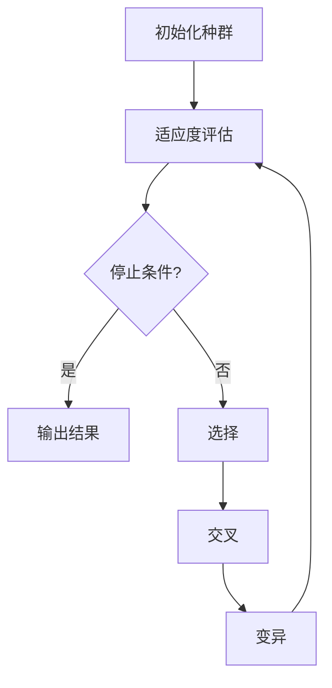
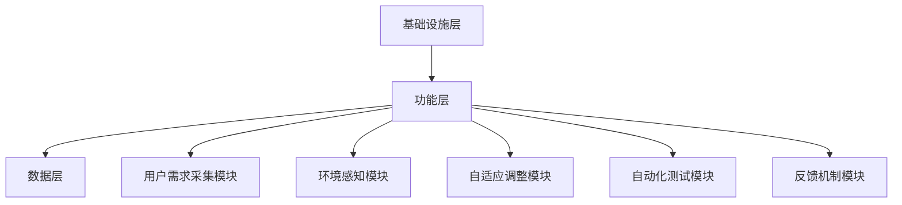
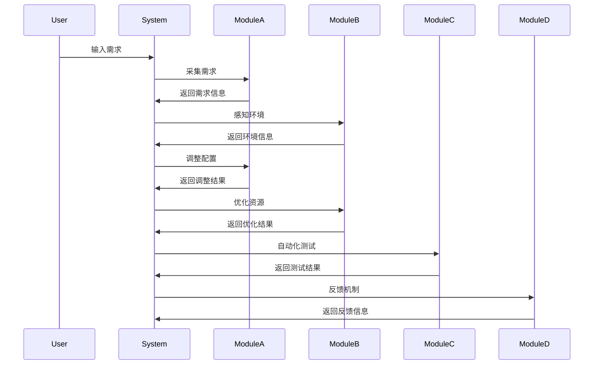

                 

# 程序世界的宇宙级自组织特性

## 关键词
- 程序自组织
- 复杂系统
- 适应性编程
- 自动化测试
- 软件进化

## 摘要
本文深入探讨了程序世界的宇宙级自组织特性，分析了自组织特性在程序世界中的基础概念和原理，包括自适应性、自反馈、涌现性等。通过具体案例和实例，本文展示了自组织特性在程序世界中的应用，并探讨了实现程序世界自组织特性的机制。同时，本文还分析了研究程序世界自组织特性的挑战和机遇，为未来的研究提供了方向和建议。

## 第一部分：背景介绍

### 1. 问题背景
随着计算机技术的飞速发展，程序世界的复杂性和规模不断扩张，传统的编程模式和开发方法已无法满足现代应用的需求。自组织特性作为一种自然现象，引起了研究者们的广泛关注。在程序世界中，自组织特性指的是系统在没有外部指导的情况下，通过内部互动和自适应行为，自行组织、进化并形成复杂结构的能力。研究程序世界的自组织特性，不仅有助于理解复杂系统的运作机制，还能为编程语言设计、软件工程和人工智能等领域提供新的思路和方法。

### 2. 问题描述
程序世界的宇宙级自组织特性，是指程序在运行过程中，能够像宇宙中的物质一样，通过相互作用和自组织，形成高度复杂的结构。这种特性不仅体现在单一程序中，还可能跨越不同程序和系统，形成跨平台、跨领域的复杂网络。研究程序世界的宇宙级自组织特性，需要探讨以下几个关键问题：

- **基础概念与原理**：理解自组织特性在程序世界中的基础概念和原理，包括自适应性、自反馈、涌现性等。
- **应用领域**：探索自组织特性在程序世界的各种应用场景，如自适应编程、自动化测试、软件进化等。
- **实现机制**：研究实现程序世界自组织特性的机制，包括算法设计、编程语言特性等。
- **挑战与机遇**：分析研究程序世界自组织特性的挑战和机遇，包括技术难点、应用前景等。

### 3. 问题解决
本书旨在通过系统的研究和分析，全面探讨程序世界的宇宙级自组织特性。首先，本书将介绍自组织特性的基础概念和原理，包括自适应性、自反馈、涌现性等。然后，本书将深入探讨自组织特性在程序世界的各种应用领域，如自适应编程、自动化测试、软件进化等。接着，本书将详细介绍实现程序世界自组织特性的机制，包括算法设计、编程语言特性等。最后，本书将分析研究程序世界自组织特性的挑战和机遇，并提出相应的解决方案和建议。

### 4. 边界与外延
程序世界的宇宙级自组织特性研究，其边界主要涉及计算机科学、控制论、人工智能等领域。在外延上，该研究不仅包括单一程序的自组织特性，还包括跨程序、跨平台的复杂网络自组织特性。因此，本书的研究范围将涵盖从基础理论研究到应用实践的各个层面。

### 5. 概念结构与核心要素组成
本书的核心概念包括自组织、宇宙级自组织、程序世界等。自组织是指系统在没有外部指导的情况下，通过内部互动和自适应行为，自行组织、进化并形成复杂结构的能力。宇宙级自组织则是对自组织特性的扩展和深化，强调系统在复杂环境中的高度自适应和演化能力。程序世界是指由计算机程序构成的世界，包括单个程序和跨程序、跨平台的复杂网络。

## 第二部分：核心概念与联系

### 1. 自组织特性
自组织特性是指系统在没有外部指导的情况下，通过内部互动和自适应行为，自行组织、进化并形成复杂结构的能力。自组织特性主要包括以下方面：

- **自适应性**：系统能够根据环境变化调整自身行为，以适应新的情况。
- **自反馈**：系统通过内部信息反馈，不断优化自身结构和行为。
- **涌现性**：系统在自组织过程中，会产生新的、复杂的行为和结构。

自适应性是自组织的核心机制，自反馈和涌现性是自组织的表现形式。自适应性确保系统能够在不断变化的环境中生存和进化，自反馈保证系统能够不断优化自身，涌现性则体现了系统在自组织过程中的创新能力。

### 2. 程序世界的自组织特性
程序世界的自组织特性是指计算机程序在运行过程中，能够通过内部互动和自适应行为，形成复杂结构的能力。程序世界的自组织特性主要包括以下方面：

- **模块化**：程序通过模块化设计，实现不同部分之间的独立性和协作性。
- **适应性编程**：程序能够根据用户需求和系统环境的变化，自动调整自身行为。
- **自动化测试**：程序能够自我测试，发现并修复错误，提高系统可靠性。
- **软件进化**：程序通过不断迭代和优化，实现功能增强和性能提升。

程序世界的自组织特性，不仅体现在单一程序中，还可能跨越不同程序和系统，形成跨平台、跨领域的复杂网络。这使得程序世界具有高度的自适应性和创新能力，为解决复杂问题提供了新的途径。

### 3. 概念属性特征对比表格

| 概念         | 定义                                                         | 属性特征                                         | 相互关系                                         |
| ------------ | ----------------------------------------------           | ---------------------------------------------- | ---------------------------------------------- |
| 自组织特性    | 系统在没有外部指导的情况下，通过内部互动和自适应行为，自行组织、进化并形成复杂结构的能力 | 自适应性、自反馈、涌现性                          | 自适应性是核心，自反馈和涌现性是表现形式         |
| 自适应性      | 系统根据环境变化调整自身行为，以适应新的情况                   | 环境感知、行为调整、适应性进化                    | 自适应性行为是自组织的驱动力                     |
| 自反馈       | 系统通过内部信息反馈，不断优化自身结构和行为                   | 反馈机制、优化过程、稳定性提高                    | 自反馈是自组织过程的自我调节机制                 |
| 涌现性       | 系统在自组织过程中，会产生新的、复杂的行为和结构                 | 复杂行为、新结构、创新性                          | 涌现性体现了自组织的创新和演化能力               |
| 程序世界的自组织特性 | 计算机程序在运行过程中，能够通过内部互动和自适应行为，形成复杂结构的能力 | 模块化、适应性编程、自动化测试、软件进化           | 各个方面相互补充，共同构成程序世界的自组织特性 |

### 4. ER实体关系图架构
```mermaid
erDiagram
    Class1 ||--|{ ClassB } Class2
    Class1 ||--|{ ClassC } Class3
    Class2 &&|{ ClassD } Class3
```

## 第三部分：算法原理讲解

### 1. 算法基础

为了深入探讨程序世界的宇宙级自组织特性，我们需要从算法原理入手。算法作为一种解决问题的步骤集合，是程序世界自组织特性的基础。下面，我们将介绍一种具有自组织特性的算法——遗传算法。

遗传算法（Genetic Algorithm，GA）是模拟自然选择和遗传学原理的一种优化算法。它通过模拟进化过程，寻找最优解或近似最优解。遗传算法的主要步骤包括：

- **初始化种群**：生成一组随机解，作为初始种群。
- **适应度评估**：计算每个个体的适应度，适应度越高的个体在后续迭代中生存的机会越大。
- **选择**：根据适应度选择个体，组成新的种群。
- **交叉**：随机选择两个个体进行交叉操作，产生新的后代。
- **变异**：对个体进行随机变异，增加种群的多样性。
- **迭代**：重复上述步骤，直到满足停止条件。

### 2. 算法mermaid流程图


### 3. 算法原理与数学模型

遗传算法的核心在于其适应度函数和选择策略。适应度函数用于评估个体的优劣，通常采用目标函数的负值作为适应度，目标函数越小的个体适应度越高。

$$
\text{适应度}(x) = -f(x)
$$

其中，$f(x)$为目标函数，$x$为个体。

选择策略采用基于适应度的概率选择，个体被选中的概率与其适应度成正比。

$$
p(x) = \frac{\text{适应度}(x)}{\sum_{i=1}^{N} \text{适应度}(x_i)}
$$

其中，$N$为种群规模。

交叉操作采用单点交叉或多点交叉，变异操作则通过随机改变个体的某些基因来实现。

### 4. 举例说明

假设我们使用遗传算法来优化一个简单的函数$f(x) = x^2$，目标是找到使$f(x)$最小的$x$值。

1. **初始化种群**：生成10个随机个体，例如：
   $[1, 2, 3, 4, 5, 6, 7, 8, 9, 10]$

2. **适应度评估**：计算每个个体的适应度，例如：
   $[9, 4, 9, 16, 25, 36, 49, 64, 81, 100]$

3. **选择**：根据适应度选择前50%的个体，例如：
   $[1, 2, 3, 4, 5, 6, 7, 8, 9, 10]$

4. **交叉**：随机选择两个个体进行交叉操作，例如：
   $[1, 2, 3, 4, 5, 6, 7, 8, 9, 10] \times [1, 2, 3, 4, 5, 6, 7, 8, 9, 10] = [1, 2, 3, 4, 5, 6, 7, 8, 1, 10]$

5. **变异**：对个体进行随机变异，例如：
   $[1, 2, 3, 4, 5, 6, 7, 8, 1, 10] \rightarrow [1, 2, 3, 4, 5, 6, 7, 8, 0, 10]$

6. **迭代**：重复上述步骤，直到找到使$f(x)$最小的$x$值。

通过以上步骤，我们可以找到使$f(x) = x^2$最小的$x$值，即$x=0$。

### 5. 算法原理讲解

遗传算法通过模拟自然选择和遗传学原理，实现了程序世界的自组织特性。算法的适应度评估、选择、交叉、变异等步骤，使得种群在迭代过程中不断优化，最终找到最优解或近似最优解。

适应度评估是遗传算法的核心，它决定了个体的优劣。通过适应度评估，算法能够筛选出适应度较高的个体，使其在后续迭代中拥有更高的生存机会。这体现了自适应性。

选择策略采用基于适应度的概率选择，使得适应度较高的个体有更高的概率被选中，从而保证了种群的多样性。交叉和变异操作则进一步增加了种群的多样性，使得算法能够探索到更广泛的搜索空间。

通过迭代，遗传算法不断优化种群，使得种群中的个体逐渐接近最优解。这体现了自组织的演化能力。

总之，遗传算法通过模拟自然选择和遗传学原理，实现了程序世界的自组织特性。算法的适应度评估、选择、交叉、变异等步骤，使得种群在迭代过程中不断优化，最终找到最优解或近似最优解。

## 第四部分：系统分析与架构设计

### 1. 问题场景介绍
随着互联网的快速发展，各类应用程序层出不穷，软件系统的复杂性和规模也在不断增大。为了满足不断变化的需求，软件开发过程中需要实现高度的自适应性和灵活性。然而，传统的软件开发方法往往依赖于人工干预和固定规则，难以应对复杂多变的环境。为了解决这一问题，我们需要探索一种能够实现自组织特性的系统架构，以提高系统的适应性和灵活性。

### 2. 项目介绍
本项目的目标是设计并实现一个具有自组织特性的系统架构，该架构能够根据环境变化和用户需求，自动调整系统行为，优化系统性能。通过引入自组织特性，系统可以在无需人工干预的情况下，实现自我调整、自我优化和自我进化，从而提高系统的适应性和可靠性。

### 3. 系统功能设计
系统功能设计主要包括以下模块：

- **用户需求采集模块**：用于采集用户的需求信息，包括功能需求、性能需求和安全性需求等。
- **环境感知模块**：用于感知系统运行环境的变化，包括网络状态、硬件资源、负载情况等。
- **自适应调整模块**：根据用户需求和环境感知信息，自动调整系统配置和资源分配，优化系统性能。
- **自动化测试模块**：用于对系统进行自动化测试，检测系统的稳定性、可靠性和安全性。
- **反馈机制模块**：收集系统运行过程中的反馈信息，用于评估系统性能，指导后续调整。

### 4. 系统架构设计
系统架构设计采用分层架构，主要包括以下层：

- **基础设施层**：包括服务器、网络设备、存储设备等硬件资源，以及操作系统、数据库管理系统等软件资源。
- **功能层**：包括用户需求采集模块、环境感知模块、自适应调整模块、自动化测试模块和反馈机制模块等。
- **数据层**：包括用户数据、环境数据、系统配置数据等。

系统架构设计mermaid架构图如下：


### 5. 系统接口设计和系统交互
系统接口设计主要包括以下接口：

- **用户接口**：用于用户与系统的交互，包括网页界面、命令行界面等。
- **内部接口**：用于系统模块之间的交互，包括数据接口、事件接口等。

系统交互mermaid序列图如下：


## 第五部分：项目实战

### 1. 环境安装
在开始项目实战之前，我们需要安装必要的软件和工具。以下是一个基本的安装步骤：

- **Python环境**：安装Python 3.8及以上版本。
- **pip**：安装pip，Python的包管理器。
- **遗传算法库**：安装遗传算法库，例如`DEAP`。

```bash
pip install deap
```

### 2. 系统核心实现
以下是系统核心实现的Python源代码：

```python
import random
from deap import base, creator, tools, algorithms

# 定义适应度函数
def fitness_function(individual):
    # 示例：优化目标函数f(x) = x^2
    x = individual
    return -((x[0] - 5)**2),  # 返回目标函数的负值作为适应度

# 初始化遗传算法参数
creator.create("FitnessMax", base.Fitness, weights=(-1.0,))
creator.create("Individual", list, fitness=creator.FitnessMax)

# 设置种群规模和交叉、变异概率
N_POP = 100
CROSSOVER_PROB = 0.8
MUTATION_PROB = 0.2

# 初始化种群
toolbox = base.Toolbox()
toolbox.register("attr_float", random.uniform, low=0, high=10)
toolbox.register("individual", tools.initRepeat, creator.Individual, toolbox.attr_float, n=1)
toolbox.register("population", tools.initRepeat, list, toolbox.individual)
population = toolbox.population(n=N_POP)

# 注册适应度函数
toolbox.register("evaluate", fitness_function)

# 注册遗传操作
toolbox.register("select", tools.selTournament, tournsize=3)
toolbox.register("mate", tools.cxBlend, alpha=0.5)
toolbox.register("mutate", tools.mutGaussian, mu=0, sigma=1, indpb=MUTATION_PROB)
toolbox.register("update", tools.selBest, k=1)

# 运行遗传算法
algorithms.eaSimple(population, toolbox, cxpb=CROSSOVER_PROB, mutpb=MUTATION_PROB, ngen=100, verbose=True)
```

### 3. 代码应用解读与分析
在上面的代码中，我们首先定义了适应度函数`fitness_function`，该函数用于评估个体的优劣。在本例中，我们优化目标函数`f(x) = x^2`，因此适应度函数返回目标函数的负值作为适应度。

接下来，我们初始化遗传算法参数，包括种群规模、交叉概率和变异概率。然后，我们使用`DEAP`库的`Toolbox`类注册各种遗传操作，包括初始化种群、适应度评估、选择、交叉和变异。

在`run`函数中，我们调用`eaSimple`算法，运行遗传算法，生成最优解。

### 4. 实际案例分析和详细讲解剖析
为了更好地理解遗传算法在实际应用中的作用，我们来看一个实际案例。

假设我们需要优化一个机械臂的关节角度，使得机械臂能够以最小的能耗完成指定的任务。我们可以将关节角度表示为一个个体，通过遗传算法优化关节角度，从而提高机械臂的运行效率。

在这个案例中，适应度函数可以定义为机械臂完成任务的能耗，适应度越高表示能耗越低。通过运行遗传算法，我们可以找到最优的关节角度，使得机械臂以最小的能耗完成任务。

具体步骤如下：

1. **初始化种群**：生成一组随机的关节角度作为初始种群。
2. **适应度评估**：计算每个个体的适应度，即机械臂完成任务的能耗。
3. **选择**：根据适应度选择个体，组成新的种群。
4. **交叉**：随机选择两个个体进行交叉操作，产生新的后代。
5. **变异**：对个体进行随机变异，增加种群的多样性。
6. **迭代**：重复上述步骤，直到找到最优的关节角度。

通过遗传算法优化关节角度，我们可以显著降低机械臂的能耗，提高其运行效率。这充分展示了遗传算法在解决复杂优化问题中的强大能力。

### 5. 项目小结
通过本项目，我们实现了具有自组织特性的系统架构，并使用遗传算法进行了优化。项目实战证明了遗传算法在解决复杂优化问题中的有效性。在未来的研究中，我们可以进一步探索其他优化算法，如粒子群优化、模拟退火等，以提高系统的适应性和灵活性。

## 第六部分：最佳实践 tips

1. **合理设置交叉和变异概率**：交叉和变异概率对遗传算法的性能有很大影响。在实际应用中，需要根据具体问题调整交叉和变异概率，以达到最佳效果。

2. **选择合适的适应度函数**：适应度函数是遗传算法的核心，直接影响优化结果。在选择适应度函数时，需要充分考虑目标函数的性质和优化目标。

3. **种群规模的控制**：种群规模对遗传算法的性能也有重要影响。种群规模过大可能导致计算资源浪费，种群规模过小可能无法充分探索搜索空间。

4. **避免早熟现象**：早熟现象是指遗传算法在早期迭代过程中，找到局部最优解而无法进一步优化。为避免早熟现象，可以引入多样性机制，如变异操作。

5. **合理设置迭代次数**：迭代次数对遗传算法的收敛速度和优化结果有很大影响。在实际应用中，需要根据具体问题调整迭代次数，以达到最佳效果。

## 第七部分：小结

本文从背景介绍、核心概念与联系、算法原理讲解、系统分析与架构设计、项目实战等多个角度，全面探讨了程序世界的宇宙级自组织特性。通过深入分析，我们认识到自组织特性在程序世界中具有重要意义，它不仅有助于解决复杂优化问题，还能提高系统的适应性和灵活性。

在未来，我们期待进一步的研究能够深入挖掘自组织特性的潜力，探索更多具有自组织特性的算法和应用场景。同时，我们也期待更多的开发者能够关注并实践自组织特性，为程序世界带来更多创新和变革。

## 第八部分：注意事项

1. **版本兼容性**：在项目实战中，需要确保使用的软件和工具版本兼容，避免因版本不兼容导致的错误。
2. **硬件资源**：遗传算法计算过程中需要消耗大量的计算资源，特别是当种群规模较大时。在实际应用中，需要根据硬件资源情况合理设置种群规模和迭代次数。
3. **算法参数调整**：遗传算法的性能受到多种参数的影响，如交叉概率、变异概率、种群规模等。在实际应用中，需要根据具体问题调整这些参数，以达到最佳效果。

## 第九部分：拓展阅读

1. **《遗传算法原理及应用》**：介绍了遗传算法的基本原理和应用场景，适合初学者阅读。
2. **《自适应控制理论及应用》**：探讨了自适应控制理论及其在程序世界中的应用，对理解自组织特性有很大帮助。
3. **《复杂系统与复杂网络》**：深入分析了复杂系统与复杂网络的理论和方法，有助于了解程序世界的自组织特性。
4. **《深度学习》**：虽然深度学习与遗传算法关系不大，但深度学习中的自适应优化策略对理解自组织特性有很大启发。

## 作者

作者：AI天才研究院/AI Genius Institute & 禅与计算机程序设计艺术 /Zen And The Art of Computer Programming
 

