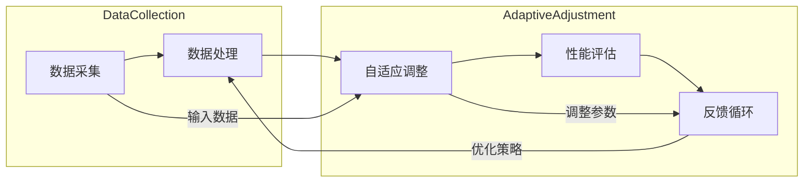
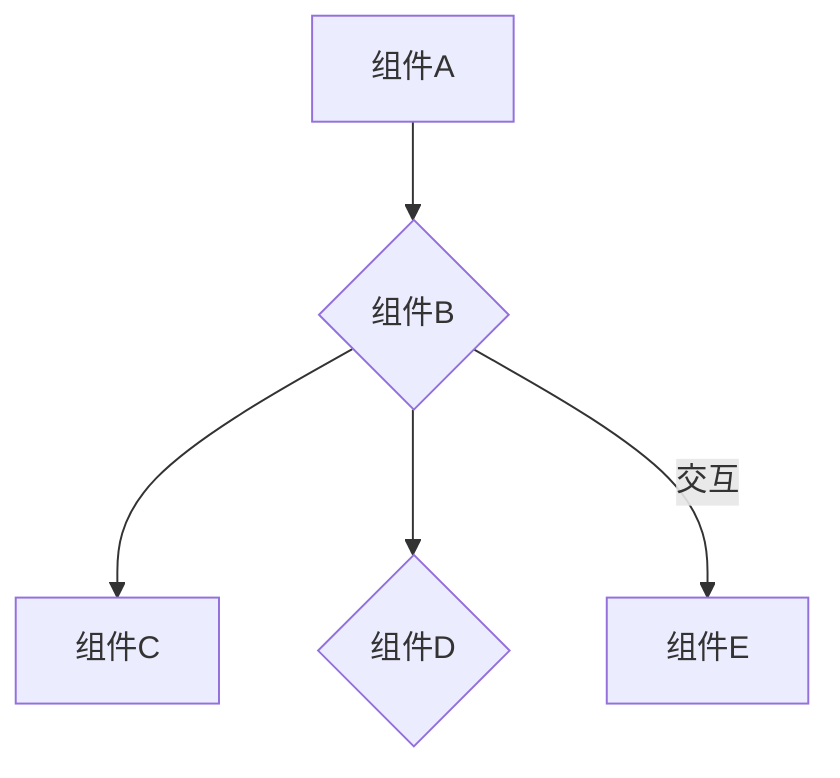
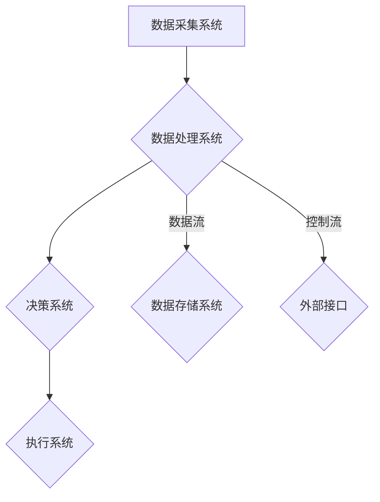
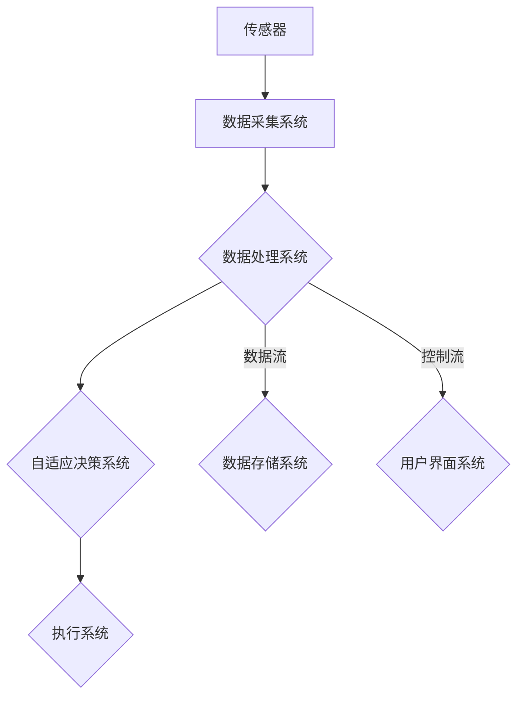
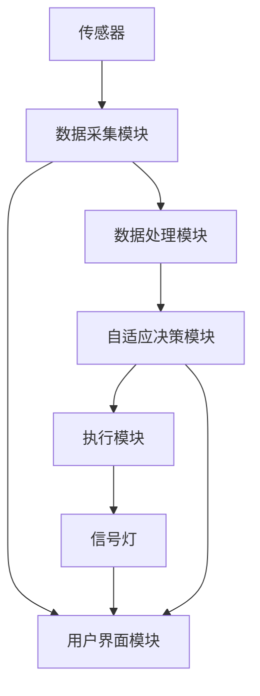

                 

## 程序世界的宇宙级自适应机制概述

### 1.1 程序世界的宇宙级自适应机制：问题背景与边界

在程序世界中，自适应机制是一种让程序能够自动适应复杂、动态环境变化的能力。这种能力不仅仅局限于简单的环境调整，更包括在不确定性和未知情况下的自我调整与优化。因此，了解程序世界中的宇宙级自适应机制具有重要的理论和实际意义。

#### 问题描述

**问题背景：** 现代程序世界正面临着前所未有的复杂性和动态性。从互联网应用、智能设备到自动化生产线，程序需要应对的环境千变万化，要求程序具备高度的自适应能力。

**问题描述：** 在这样的背景下，如何构建一个能够自我适应、自我优化的程序机制，成为当前研究的热点。这种机制需要能够处理大量的数据，从数据中学习、推理，并在此基础上做出合理的决策。

**问题解决：** 探索宇宙级自适应机制，即一种具备极高适应能力的机制。这种机制不仅要能够处理复杂的动态环境，还需要具备自我进化的能力，从而不断优化自身性能。

#### 问题解决策略

**概念界定：** 首先，我们需要明确什么是宇宙级自适应机制。它通常涉及进化算法、神经网络、机器学习等技术，能够通过模拟生物进化过程，实现自我优化。

**原理理解：** 然后，我们需要深入理解这种机制的工作原理。它通过不断地收集环境数据，通过学习算法更新自身的参数，从而实现性能的持续提升。

**应用探索：** 最后，我们需要探索这种机制在不同领域的应用，例如自动化控制、机器人技术、数据分析等。

#### 边界与外延

**适用范围：** 宇宙级自适应机制适用于需要高度自适应的领域，如智能交通系统、智能电网、智能制造等。

**影响因素：** 这种机制的有效性受多种因素影响，包括数据质量、计算能力、算法选择等。

**核心要素：** 核心要素包括数据采集、学习算法、决策模型等。

### 1.2 宇宙级自适应机制的核心概念与联系

#### 核心概念

**自适应：** 自适应是指系统根据外部环境的变化，调整自身行为的能力。

**进化算法：** 进化算法是一种基于自然选择和遗传学原理的搜索算法，用于解决优化问题。

**神经网络：** 神经网络是一种模拟人脑神经网络结构的计算模型，用于数据处理和模式识别。

**机器学习：** 机器学习是指通过数据训练模型，使其能够自动进行预测和决策。

#### 联系与区别

**联系：** 这些概念相互关联，共同构成了宇宙级自适应机制的核心。

**区别：** 进化算法侧重于优化问题的求解，神经网络侧重于数据处理和模式识别，机器学习则是一个更广泛的概念，包括了数据训练和模型预测。

### 1.3 宇宙级自适应机制的历史与演变

#### 历史背景

**早期探索：** 自适应机制的概念最早可以追溯到20世纪50年代，随着计算机科学的兴起，人们开始探索如何让程序具备自适应能力。

**发展历程：** 随着计算能力的提升和算法的进步，自适应机制经历了从简单的反馈控制到复杂的进化算法和神经网络的发展历程。

#### 演变趋势

**趋势一：** 计算能力的提升使得自适应机制能够处理更复杂的问题。

**趋势二：** 数据收集和分析技术的进步，使得自适应机制能够从海量数据中学习。

**趋势三：** 随着深度学习和强化学习的兴起，自适应机制正在向更加智能化、自主化的方向发展。

### 1.4 宇宙级自适应机制在现代程序世界中的应用

#### 应用领域

**领域一：** 智能交通系统，自适应机制用于优化交通流量，减少拥堵。

**领域二：** 智能电网，自适应机制用于动态调整电力供需，提高能源利用效率。

**领域三：** 智能制造，自适应机制用于优化生产流程，提高生产效率。

#### 优势与挑战

**优势：** 
- **高效性：** 自适应机制能够快速适应环境变化，提高系统性能。
- **灵活性：** 自适应机制能够应对不确定性和未知情况，具有高度灵活性。

**挑战：** 
- **数据质量：** 自适应机制依赖于高质量的数据，数据质量直接影响其性能。
- **计算资源：** 高度自适应的系统通常需要大量的计算资源，如何优化计算资源使用是重要挑战。

### 1.5 总结

宇宙级自适应机制是程序世界中应对复杂、动态环境变化的重要手段。通过深入理解其核心概念和原理，并探索其应用领域和优势挑战，我们可以更好地利用这一机制，推动程序世界的发展。

---

**关键词：** 程序世界、宇宙级自适应机制、进化算法、神经网络、机器学习

**摘要：** 本文详细介绍了程序世界的宇宙级自适应机制，包括其问题背景、核心概念、历史演变及应用领域。通过深入分析，本文探讨了宇宙级自适应机制在现代程序世界中的优势与挑战，为后续研究和应用提供了理论基础和实践指导。  

---

### 第1章：程序世界的宇宙级自适应机制概述

在探讨程序世界的宇宙级自适应机制之前，我们需要首先了解什么是自适应机制以及它在程序世界中的重要性。自适应机制是指系统在面临外部环境变化时，能够根据环境反馈调整自身行为和策略的能力。这种能力在现代程序世界中具有重要意义，因为它使得程序能够更好地应对复杂和动态的环境变化，从而提高系统的效率和可靠性。

#### 1.1 程序世界的宇宙级自适应机制：问题背景与边界

在现代程序世界中，自适应机制的应用场景变得越来越广泛。从智能交通系统、智能电网到智能制造，每个领域都对自适应机制提出了极高的要求。以下我们将详细探讨这一问题背景、问题描述、问题解决策略以及机制的定义和边界。

##### 问题背景

随着计算机技术的快速发展，程序世界面临着前所未有的复杂性和动态性。尤其是在大数据和云计算的背景下，程序需要处理的数据规模和复杂性不断增加。例如，智能交通系统需要实时分析海量交通数据，以优化交通流量；智能电网需要动态调整电力供需，以实现高效能源利用；智能制造则需要自适应生产流程，以提高生产效率。这些应用场景都要求程序具备高度的自适应能力，以应对不断变化的环境。

##### 问题描述

**问题描述：** 现代程序世界中的自适应机制是如何应对复杂、动态环境变化的？

具体来说，程序需要具备以下能力：
- **实时响应：** 能够快速感知外部环境的变化，并做出相应的调整。
- **自我优化：** 能够从环境中学习，并不断优化自身的行为和策略。
- **鲁棒性：** 在面对不确定性和异常情况时，能够保持稳定的性能。

##### 问题解决策略

为了解决上述问题，我们需要引入宇宙级自适应机制。宇宙级自适应机制是一种具备极高适应能力的机制，其核心思想是通过模拟生物进化过程，实现自我优化。这种机制通常涉及以下技术：
- **进化算法：** 基于自然选择和遗传学原理，用于解决优化问题。
- **神经网络：** 模拟人脑神经网络结构，用于数据处理和模式识别。
- **机器学习：** 通过数据训练模型，实现自动预测和决策。

##### 定义和边界

**定义：** 宇宙级自适应机制是一种能够自动适应复杂、动态环境变化，并通过自我优化实现性能提升的机制。

**边界：** 
- **适用范围：** 宇宙级自适应机制适用于需要高度自适应的领域，如智能交通、智能电网、智能制造等。
- **影响因素：** 自适应机制的有效性受多种因素影响，包括数据质量、计算能力、算法选择等。
- **核心要素：** 数据采集、学习算法、决策模型等。

通过上述讨论，我们可以看到，宇宙级自适应机制在程序世界中具有重要的应用价值。它不仅能够提高系统的效率和可靠性，还能够为应对复杂和动态环境提供有效的解决方案。

#### 1.2 宇宙级自适应机制的核心概念与联系

在深入探讨宇宙级自适应机制之前，我们需要了解其中的核心概念，包括自适应、进化算法、神经网络和机器学习。这些概念不仅构成了宇宙级自适应机制的基础，而且它们之间也存在着密切的联系和区别。

##### 自适应

**定义与特性：** 自适应是指系统在面对外部环境变化时，能够调整自身行为以适应新环境的能力。这种能力在程序世界中具有重要意义，因为它能够帮助系统更好地应对复杂和动态的环境。

**主要模型：** 
- **反馈控制模型：** 通过实时监测环境变化，并根据反馈调整系统行为。
- **自我调整模型：** 通过学习环境数据，自我调整系统参数，实现自适应优化。

##### 进化算法

**定义与特性：** 进化算法是一种模拟生物进化过程的搜索算法，通过遗传操作（如选择、交叉和突变）来优化问题。它通常用于解决复杂优化问题，具有很强的鲁棒性和全局搜索能力。

**主要模型：** 
- **遗传算法（GA）：** 通过模拟生物进化过程，优化目标函数。
- **遗传编程（GP）：** 通过生成和演化计算机程序，解决特定问题。

##### 神经网络

**定义与特性：** 神经网络是一种模拟人脑神经网络结构的计算模型，通过层级结构实现数据输入到输出的映射。它具有很强的学习和泛化能力，广泛应用于数据处理和模式识别。

**主要模型：** 
- **多层感知机（MLP）：** 具有多个隐层的神经网络，用于复杂函数逼近。
- **卷积神经网络（CNN）：** 用于图像处理和计算机视觉。

##### 机器学习

**定义与特性：** 机器学习是一种通过数据训练模型，使其能够自动进行预测和决策的方法。它通过从数据中学习规律，实现系统的自我优化。

**主要模型：** 
- **监督学习：** 通过标注数据训练模型，实现分类和回归。
- **无监督学习：** 通过未标注数据发现数据分布和模式。

##### 联系与区别

**联系：** 
- **进化算法和神经网络：** 进化算法可以通过神经网络实现，神经网络可以用于进化算法中的目标函数优化。
- **机器学习和神经网络：** 机器学习中的模型训练通常使用神经网络，神经网络是实现机器学习的一种重要工具。

**区别：** 
- **进化算法：** 主要用于优化问题，通过遗传操作实现搜索。
- **神经网络：** 主要用于数据处理和模式识别，通过层级结构实现映射。
- **机器学习：** 覆盖了更广泛的领域，包括监督学习、无监督学习和强化学习。

通过以上分析，我们可以看到，宇宙级自适应机制的核心概念之间存在着紧密的联系和区别。理解这些概念及其相互关系，对于深入探讨自适应机制的工作原理和应用具有重要意义。

#### 1.3 宇宙级自适应机制的历史与演变

宇宙级自适应机制的发展历程可以追溯到20世纪50年代，随着计算机科学的兴起，自适应机制的概念开始被提出。最初的适应机制主要基于简单的反馈控制模型，用于实现基本的自我调整功能。随着时间的推移，自适应机制逐渐发展壮大，形成了多种不同的方法和模型。

##### 历史背景

**早期探索（20世纪50年代）：** 
在这一时期，自适应机制的概念开始被提出。科学家们试图通过简单的反馈控制模型，使程序能够根据环境变化进行自我调整。这一时期的代表性工作是霍普菲尔德（John Hopfield）提出的神经网络模型，它奠定了神经网络研究的基础。

**发展历程（20世纪60年代 - 80年代）：**
随着计算机硬件的发展，自适应机制的研究逐渐深入。这一时期，进化算法开始被引入，用于解决优化问题。代表性的工作是约翰·霍兰（John Holland）提出的遗传算法，它基于自然选择和遗传学原理，为自适应机制提供了新的思路。

**成熟阶段（20世纪90年代 - 21世纪初）：**
随着人工智能和机器学习的兴起，自适应机制得到了进一步的发展。神经网络和机器学习技术的结合，使得自适应机制在数据处理和模式识别领域取得了显著成果。这一时期的代表性工作是深度学习技术的突破，它使得神经网络能够处理更复杂的任务。

##### 演变趋势

**趋势一：** **计算能力的提升**
随着计算机硬件的快速发展，自适应机制的应用场景逐渐扩大。更高的计算能力使得复杂的自适应算法得以实现，从而提高了系统的适应能力和性能。

**趋势二：** **数据收集和分析技术的进步**
大数据和云计算的兴起，为自适应机制提供了丰富的数据资源。通过高效的数据收集和分析技术，自适应机制能够从海量数据中学习，实现更精确的自我调整。

**趋势三：** **智能化的方向发展**
随着深度学习和强化学习的兴起，自适应机制正朝着更加智能化、自主化的方向发展。通过模拟人脑的学习机制，自适应机制能够实现更加复杂和灵活的决策。

##### 现代自适应机制的发展

**现代自适应机制的特点：**
- **高度集成：** 现代自适应机制通常结合多种技术，如神经网络、进化算法和机器学习，实现高度集成的自适应能力。
- **实时响应：** 现代自适应机制能够实时感知外部环境的变化，并快速调整自身行为。
- **自我进化：** 通过自我学习机制，现代自适应机制能够不断优化自身性能，实现持续进化。

**现代自适应机制的应用领域：**
- **智能交通：** 利用自适应机制优化交通流量，减少拥堵。
- **智能电网：** 利用自适应机制实现电力供需的动态平衡。
- **智能制造：** 利用自适应机制优化生产流程，提高生产效率。

**现代自适应机制的优势与挑战：**
- **优势：** 高度自适应、实时响应、自我进化，能够有效应对复杂和动态环境。
- **挑战：** 如何处理海量数据、优化计算资源、确保数据质量等。

通过以上分析，我们可以看到，宇宙级自适应机制的发展历程体现了计算机科学和人工智能技术的进步。随着计算能力的提升、数据技术的进步以及智能化的发展，自适应机制正逐步实现从理论研究到实际应用的转变。

#### 1.4 宇宙级自适应机制在现代程序世界中的应用

宇宙级自适应机制在现代程序世界中具有广泛的应用，它不仅能够提高系统的效率和可靠性，还能够为解决复杂和动态环境问题提供有效方案。以下将详细探讨宇宙级自适应机制在几个关键领域的应用，以及这些应用的优势和面临的挑战。

##### 应用领域一：智能交通系统

**概述：** 智能交通系统（Intelligent Transportation Systems，ITS）利用自适应机制优化交通流量管理，提高道路使用效率，减少拥堵和交通事故。

**优势：**
- **实时响应：** 自适应机制能够实时感知交通状况变化，并迅速调整交通信号灯的配时，优化交通流量。
- **自我优化：** 通过持续学习和优化，交通系统可以不断改进交通管理策略，提高整体效率。
- **鲁棒性：** 自适应机制能够在面对突发事件（如交通事故、道路施工）时，快速调整交通策略，确保交通系统的稳定运行。

**挑战：**
- **数据质量：** 交通数据的准确性对自适应机制的性能至关重要，但实际环境中数据质量往往受到多种因素影响。
- **计算资源：** 高度自适应的交通系统需要大量的计算资源，如何在有限的资源下实现高效的自适应成为关键问题。

##### 应用领域二：智能电网

**概述：** 智能电网（Smart Grid）通过自适应机制实现电力供需的动态平衡，提高电力系统的稳定性和效率。

**优势：**
- **动态调整：** 自适应机制可以根据电力需求和供应的变化，实时调整电力分配，确保供电的稳定性和效率。
- **节能减排：** 通过优化电力使用，自适应机制有助于减少能源浪费，提高能源利用效率。
- **自我恢复：** 在发生故障时，自适应机制能够快速检测并隔离问题，实现系统的自我恢复。

**挑战：**
- **数据采集：** 智能电网需要大量实时数据，数据采集的准确性直接影响自适应机制的效能。
- **网络安全：** 智能电网的自适应机制面临网络攻击的风险，如何确保系统的安全性是重要挑战。

##### 应用领域三：智能制造

**概述：** 智能制造（Smart Manufacturing）通过自适应机制优化生产流程，提高生产效率和产品质量。

**优势：**
- **柔性生产：** 自适应机制能够根据市场需求和生产条件，灵活调整生产计划，实现柔性生产。
- **质量控制：** 自适应机制通过对生产过程的实时监控和调整，确保产品质量的稳定性。
- **成本降低：** 通过优化生产流程和资源利用，自适应机制有助于降低生产成本。

**挑战：**
- **技术集成：** 自适应机制需要与现有的制造系统集成，实现无缝衔接，这对技术的兼容性要求较高。
- **数据融合：** 自适应机制依赖于多种数据源，如何有效地融合这些数据，提高决策的准确性是关键问题。

##### 应用领域四：智能健康

**概述：** 智能健康（Smart Health）利用自适应机制实现个性化医疗和健康管理，提高医疗服务质量。

**优势：**
- **个性化医疗：** 自适应机制可以根据患者的个体差异，提供个性化的诊疗方案，提高治疗效果。
- **实时监控：** 通过自适应机制，医生可以实时监控患者的健康状况，及时调整治疗方案。
- **预防医学：** 自适应机制有助于提前发现健康问题，实现疾病预防和早期干预。

**挑战：**
- **数据隐私：** 智能健康应用需要处理大量个人健康数据，如何确保数据的安全性和隐私保护是重要问题。
- **技术成熟度：** 自适应机制在医疗领域的应用还处于发展阶段，如何提高技术的成熟度和可靠性是关键问题。

##### 总结

宇宙级自适应机制在现代程序世界中具有广泛的应用前景，它不仅提高了系统的效率和可靠性，还为解决复杂和动态环境问题提供了有效方案。然而，自适应机制在实际应用中仍然面临诸多挑战，包括数据质量、计算资源、技术集成和数据隐私等。通过不断探索和创新，我们有望克服这些挑战，进一步发挥宇宙级自适应机制的优势，推动程序世界的发展。

---

### 第2章：宇宙级自适应机制的基本原理

#### 2.1 自适应机制的基本原理

宇宙级自适应机制的核心在于其能够根据环境变化自动调整自身行为，以实现最优性能。理解这一机制的基本原理是深入探讨其工作方式和实现方法的关键。

##### 定义与特性

**定义：** 自适应机制是一种能够在不确定和动态环境中，通过调整自身参数和行为来提高系统性能的机制。

**特性：**
- **自适应性：** 能够根据外部环境的变化，自动调整自身行为。
- **鲁棒性：** 能够在面临不确定性和异常情况时，保持稳定的性能。
- **动态性：** 能够实时响应环境变化，快速调整自身状态。

##### 主要模型

宇宙级自适应机制主要依赖于以下几个模型：

**1. 进化算法：**
- **遗传算法（GA）：** 基于自然选择和遗传学原理，通过选择、交叉和变异操作，实现种群中个体性能的优化。
- **遗传编程（GP）：** 通过生成和演化计算机程序，解决特定问题。

**2. 神经网络：**
- **多层感知机（MLP）：** 具有多个隐层的神经网络，用于复杂函数逼近。
- **卷积神经网络（CNN）：** 用于图像处理和计算机视觉。

**3. 机器学习：**
- **监督学习：** 通过标注数据训练模型，实现分类和回归。
- **无监督学习：** 通过未标注数据发现数据分布和模式。

##### 应用场景

自适应机制在多个应用场景中发挥了重要作用，包括：

- **智能交通系统：** 通过实时调整交通信号，优化交通流量。
- **智能电网：** 动态调整电力供需，提高能源利用效率。
- **智能制造：** 优化生产流程，提高生产效率。

#### 2.2 自适应机制的数学模型和公式

为了更深入地理解宇宙级自适应机制，我们需要介绍其中的一些核心数学模型和公式。这些模型和公式不仅用于描述自适应机制的工作原理，还可以帮助我们进行定量分析和优化。

##### 数学模型

**1. 进化算法模型：**
- **适应度函数：** 用于评估个体（或解决方案）的质量。
- **选择操作：** 根据适应度函数选择优质个体进行繁殖。
- **交叉操作：** 通过交叉操作产生新的个体。
- **变异操作：** 通过变异操作引入随机性，防止搜索陷入局部最优。

**2. 神经网络模型：**
- **激活函数：** 用于将输入映射到输出。
- **权重更新：** 通过反向传播算法，更新网络权重，以减少误差。

**3. 机器学习模型：**
- **损失函数：** 用于评估模型预测的误差。
- **梯度下降：** 通过梯度下降算法，优化模型参数。

##### 公式解读

以下是几个关键公式及其解读：

**1. 适应度函数（F）：**
\[ F(x) = \sum_{i=1}^{n} (x_i - \bar{x})^2 \]
- **解读：** 适应度函数用于评估个体 \( x \) 的质量，其中 \( x_i \) 表示个体的第 \( i \) 个特征，\( \bar{x} \) 表示所有个体的平均特征。

**2. 交叉操作（C）：**
\[ C(x_1, x_2) = \frac{1}{2}(x_1 + x_2) \]
- **解读：** 交叉操作用于生成新的个体，通过取两个个体的平均值来实现。

**3. 神经网络权重更新（\(\theta\)）：**
\[ \theta = \theta - \alpha \cdot \nabla_{\theta} J(\theta) \]
- **解读：** 使用梯度下降算法更新神经网络权重，其中 \( \theta \) 表示权重，\( \alpha \) 为学习率，\( J(\theta) \) 为损失函数。

**4. 梯度下降（\(\nabla_{\theta} J(\theta)\)）：**
\[ \nabla_{\theta} J(\theta) = \frac{\partial J(\theta)}{\partial \theta} \]
- **解读：** 计算损失函数 \( J(\theta) \) 对权重 \( \theta \) 的梯度，用于指导权重更新。

通过上述公式，我们可以更深入地理解宇宙级自适应机制的工作原理。这些公式不仅用于描述机制的基本操作，还可以帮助我们进行实际的算法实现和性能优化。

#### 2.3 宇宙级自适应机制的mermaid流程图

为了更直观地展示宇宙级自适应机制的工作流程，我们可以使用mermaid绘制一个基本的流程图。以下是一个简化的流程图，展示了从数据采集、处理到自适应调整的基本步骤。



##### 流程图解释

**1. 数据采集（D1）：** 系统从外部环境收集数据，包括环境状态、输入信号等。

**2. 数据处理（D2）：** 对采集到的数据进行分析和处理，提取有用的特征信息。

**3. 自适应调整（A1）：** 根据处理后的数据，系统调整自身参数和行为，以实现最优性能。

**4. 性能评估（A2）：** 对调整后的系统性能进行评估，包括响应时间、效率等指标。

**5. 反馈循环（D3）：** 根据性能评估结果，系统进行反馈调整，优化策略，以进一步提高性能。

通过mermaid流程图，我们可以清晰地看到宇宙级自适应机制的基本步骤和逻辑关系。这种可视化工具不仅有助于理解机制的工作原理，还可以用于算法设计和实现过程中的文档编写。

---

### 第2章：宇宙级自适应机制的基本原理

#### 2.4 自适应机制的设计原则与实现流程

宇宙级自适应机制的设计与实现是一个复杂的过程，它涉及到对环境动态变化的精准感知、高效的决策算法以及鲁棒的执行能力。以下将介绍自适应机制的设计原则、实现流程以及相关的技术实现方法。

##### 设计原则

**1. 模块化设计：**
模块化设计是自适应机制设计的重要原则。通过将系统划分为多个功能模块，每个模块负责特定的功能，可以降低系统的复杂性，提高系统的可维护性和扩展性。模块化设计还包括模块之间的接口定义，确保模块之间的协作和通信。

**2. 可扩展性：**
自适应机制需要具备良好的可扩展性，以适应未来环境的变化和新的需求。这意味着在设计时，要考虑系统的灵活性，确保可以容易地添加或修改模块，以实现功能的扩展。

**3. 实时性：**
实时性是自适应机制的关键要求。系统需要能够快速响应环境变化，并在最短时间内做出调整。为了实现实时性，需要在硬件和软件层面进行优化，包括选择高效算法和优化数据传输路径。

**4. 鲁棒性：**
鲁棒性是指系统能够在面临不确定性和异常情况时，保持稳定的性能。设计时需要考虑容错机制和异常处理策略，确保系统在面对突发情况时能够快速恢复。

**5. 自适应性：**
自适应性是自适应机制的核心特征。系统需要具备根据环境变化调整自身行为的能力。这包括动态调整参数、优化算法以及自我学习机制。

##### 实现流程

**1. 需求分析：**
在开始设计之前，需要明确系统的具体需求，包括环境动态性、性能要求、功能需求等。需求分析的结果将指导后续的设计和实现。

**2. 系统设计：**
系统设计包括模块划分、接口定义、数据流设计等。在设计过程中，要遵循上述设计原则，确保系统的可扩展性、实时性和鲁棒性。

**3. 算法选择：**
根据需求分析的结果，选择合适的自适应算法。这些算法包括进化算法、神经网络算法、机器学习算法等。选择算法时需要考虑算法的复杂度、准确性和适用范围。

**4. 实现与优化：**
实现阶段是将设计转化为具体的代码和硬件配置。在此过程中，需要优化算法性能，确保系统在实际运行中的高效性和稳定性。

**5. 测试与验证：**
系统实现后，需要进行全面的测试和验证，确保系统满足设计要求。测试包括功能测试、性能测试、异常测试等，验证系统在各种场景下的可靠性和适应性。

##### 技术实现方法

**1. 进化算法实现：**
- **遗传算法（GA）：** 通过模拟自然选择过程，逐步优化解空间中的个体。
- **遗传编程（GP）：** 通过生成和演化计算机程序，解决特定问题。

**2. 神经网络实现：**
- **多层感知机（MLP）：** 用于复杂函数逼近。
- **卷积神经网络（CNN）：** 用于图像处理和计算机视觉。

**3. 机器学习实现：**
- **监督学习：** 通过标注数据训练模型，实现分类和回归。
- **无监督学习：** 通过未标注数据发现数据分布和模式。

**4. 实时数据处理：**
- **数据预处理：** 包括数据清洗、特征提取等，确保数据质量。
- **实时计算：** 通过优化算法和数据结构，实现实时数据处理。

**5. 系统集成与优化：**
- **硬件优化：** 选择适合的硬件平台，优化系统性能。
- **软件优化：** 通过优化代码和算法，提高系统效率。

通过遵循上述设计原则和实现流程，我们可以构建一个高效、稳定、自适应的宇宙级自适应机制。这种机制不仅能够应对复杂和动态的环境变化，还能够通过持续学习和优化，不断提升自身的性能和适应性。

---

### 第3章：宇宙级自适应机制的设计与实现

#### 3.1 自适应机制的设计方法

宇宙级自适应机制的设计是一个系统化的过程，涉及到多个方面，包括系统架构、模块划分、接口定义和数据流设计等。以下将详细探讨这些设计方法，并介绍一些实际设计步骤。

##### 系统架构设计

**1. 总体架构设计：**
系统架构设计是自适应机制设计的起点，它定义了系统的总体结构和各组件之间的关系。一个典型的自适应系统架构包括数据采集模块、数据处理模块、决策模块和执行模块。

**2. 分层架构设计：**
分层架构是一种常见的系统设计方法，它将系统划分为多个层次，每个层次负责特定的功能。例如，数据采集层负责数据收集，数据处理层负责数据预处理和特征提取，决策层负责算法实现和策略优化，执行层负责实际的操作执行。

**3. 分布式架构设计：**
在复杂环境中，分布式架构可以提供更高的可靠性和可扩展性。分布式架构通过将系统划分为多个节点，每个节点负责部分功能，从而实现负载均衡和高可用性。

##### 模块划分

**1. 数据采集模块：**
数据采集模块负责从外部环境中收集数据，包括传感器数据、网络数据等。该模块需要考虑数据采集的实时性、准确性和可靠性。

**2. 数据处理模块：**
数据处理模块负责对采集到的数据进行分析和处理，包括数据清洗、特征提取和预处理。该模块需要确保数据的质量和完整性，为后续的决策提供可靠的基础。

**3. 决策模块：**
决策模块是自适应机制的核心，它根据处理后的数据，通过算法和策略生成决策结果。该模块通常包括多个子模块，如机器学习模型、进化算法等。

**4. 执行模块：**
执行模块负责将决策结果转化为实际操作，如调整系统参数、控制设备等。该模块需要确保操作的准确性和及时性，以实现系统的自适应调整。

##### 接口定义

**1. 内部接口：**
内部接口定义了系统内部各模块之间的通信方式，包括数据格式、通信协议和接口函数等。内部接口的规范化设计可以确保系统模块之间的良好协作。

**2. 外部接口：**
外部接口定义了系统与其他系统或组件的交互方式，如API接口、消息队列等。外部接口的设计需要考虑系统的可扩展性和兼容性，以方便未来的系统集成和功能扩展。

##### 数据流设计

**1. 数据流模型：**
数据流设计是系统架构设计的重要组成部分，它描述了数据在系统中的流动路径和处理过程。常见的数据流模型包括数据流图（DFD）和实体关系图（ER图）。

**2. 数据流优化：**
数据流优化是提高系统性能的关键。通过优化数据流的传输路径和处理逻辑，可以减少系统的延迟和资源消耗，提高系统的响应速度和效率。

##### 设计步骤

**1. 需求分析：**
在开始设计之前，需要对系统的具体需求进行分析，包括功能需求、性能需求和约束条件等。需求分析的结果将指导后续的设计和实现。

**2. 系统架构设计：**
根据需求分析的结果，进行系统架构设计，包括总体架构、分层架构和分布式架构等。系统架构设计需要遵循模块化设计、可扩展性、实时性和鲁棒性等原则。

**3. 模块划分与接口定义：**
根据系统架构设计的结果，进行模块划分和接口定义。模块划分需要考虑功能独立性、模块之间的协作和数据流路径。

**4. 数据流设计：**
进行数据流设计，描述数据在系统中的流动路径和处理过程。数据流设计需要结合实际应用场景，优化数据流的传输和处理。

**5. 实现与优化：**
根据设计文档，进行系统的实现和优化。实现过程中，需要遵循软件工程的最佳实践，确保系统的可维护性和扩展性。

**6. 测试与验证：**
完成系统实现后，进行全面的测试和验证，确保系统满足设计要求。测试包括功能测试、性能测试、异常测试等，验证系统在各种场景下的可靠性和适应性。

##### 实际设计案例分析

**案例一：智能交通系统**
- **需求分析：** 智能交通系统需要实时感知交通状况，并根据交通流量动态调整交通信号灯。
- **系统架构设计：** 采用分层架构，包括数据采集层、数据处理层、决策层和执行层。
- **模块划分与接口定义：** 数据采集模块负责收集交通数据，数据处理模块负责数据预处理和特征提取，决策模块负责交通信号控制策略，执行模块负责控制交通信号灯。
- **数据流设计：** 数据流图展示了交通数据在系统中的流动路径和处理过程。

**案例二：智能电网**
- **需求分析：** 智能电网需要实时监控电力供需情况，并根据电力市场需求动态调整电力分配。
- **系统架构设计：** 采用分布式架构，包括多个监控节点和中央控制节点。
- **模块划分与接口定义：** 数据采集模块负责收集电力数据，数据处理模块负责数据预处理和特征提取，决策模块负责电力供需预测和分配策略，执行模块负责调整电力分配。
- **数据流设计：** 数据流图展示了电力数据在系统中的流动路径和处理过程。

通过实际设计案例的分析，我们可以看到自适应机制的设计方法在具体应用中的实现过程。这些设计方法不仅提高了系统的效率和可靠性，还为未来的功能扩展和性能优化提供了坚实基础。

---

### 第3章：宇宙级自适应机制的设计与实现

#### 3.2 自适应机制的实现技术

宇宙级自适应机制的实现需要借助多种技术手段，包括算法实现、工具选择、框架应用以及相关的技术实现方法。以下将详细介绍这些实现技术，并提供一些实际示例。

##### 算法实现

**1. 进化算法实现：**
进化算法（Evolutionary Algorithms，EA）是一种基于自然选择和遗传学原理的搜索算法，常用于优化和搜索问题。常见的进化算法包括遗传算法（Genetic Algorithm，GA）、遗传编程（Genetic Programming，GP）等。

- **遗传算法实现示例：**
  ```python
  import numpy as np
  import random

  def fitness_function(solution):
      # 定义适应度函数
      return sum(solution)

  def selection(population, fitnesses, k):
      # 选择操作，选择k个个体进行交叉
      indices = random.choices(range(len(population)), weights=fitnesses, k=k)
      return [population[i] for i in indices]

  def crossover(parent1, parent2):
      # 交叉操作，产生新的个体
      crossover_point = random.randint(1, len(parent1) - 1)
      child = parent1[:crossover_point] + parent2[crossover_point:]
      return child

  def mutation(solution):
      # 突变操作，引入随机性
      for i in range(len(solution)):
          if random.random() < 0.1:
              solution[i] = (solution[i] + random.random() * 2 - 1) % 2
      return solution

  def genetic_algorithm(population, fitness_function, generations, k=2):
      for _ in range(generations):
          fitnesses = [fitness_function(solution) for solution in population]
          new_population = []
          for _ in range(len(population) // k):
              parent1, parent2 = selection(population, fitnesses, k)
              child = crossover(parent1, parent2)
              child = mutation(child)
              new_population.append(child)
          population = new_population
      return max(population, key=fitness_function)

  initial_population = [[random.random() for _ in range(100)] for _ in range(100)]
  best_solution = genetic_algorithm(initial_population, fitness_function, 1000)
  print("Best solution:", best_solution)
  ```

**2. 神经网络实现：**
神经网络（Neural Networks，NN）是一种模拟人脑神经网络结构的计算模型，常用于数据处理和模式识别。常见的神经网络包括多层感知机（Multilayer Perceptron，MLP）、卷积神经网络（Convolutional Neural Network，CNN）等。

- **多层感知机实现示例：**
  ```python
  import numpy as np
  from sklearn.neural_network import MLPRegressor

  X = np.random.rand(100, 10)  # 输入数据
  y = np.random.rand(100, 1)   # 输出数据

  mlpr = MLPRegressor(hidden_layer_sizes=(100,), max_iter=1000)
  mlpr.fit(X, y)
  print("Predicted values:", mlpr.predict(X))
  ```

##### 工具选择

**1. Python工具：**
Python是一种广泛使用的编程语言，拥有丰富的库和框架，适用于算法实现和数据分析。常见的Python库包括NumPy、SciPy、Scikit-learn、TensorFlow和PyTorch等。

- **NumPy：** 用于数学计算和数据操作。
- **SciPy：** 用于科学计算。
- **Scikit-learn：** 提供了机器学习算法的实现。
- **TensorFlow：** 用于深度学习模型训练。
- **PyTorch：** 用于深度学习模型训练。

##### 框架应用

**1. 深度学习框架：**
深度学习框架（Deep Learning Frameworks）是用于实现和训练深度学习模型的工具。常见的深度学习框架包括TensorFlow和PyTorch。

- **TensorFlow：** 提供了灵活的模型构建和优化工具。
- **PyTorch：** 提供了动态计算图和丰富的API接口。

**2. 进化算法框架：**
进化算法框架（Evolutionary Algorithm Frameworks）是用于实现进化算法的工具。常见的进化算法框架包括DEAP和PyGAD。

- **DEAP：** 提供了进化算法的实现和评估工具。
- **PyGAD：** 提供了遗传算法和遗传编程的实现工具。

##### 实际示例

**示例一：智能交通信号控制系统**
- **算法实现：** 使用遗传算法优化交通信号灯的配时方案。
- **工具选择：** 使用Python和Scikit-learn库进行算法实现和评估。
- **框架应用：** 使用DEAP框架实现遗传算法。

**示例二：智能电网电力分配系统**
- **算法实现：** 使用多层感知机（MLP）进行电力供需预测。
- **工具选择：** 使用Python和PyTorch库进行模型训练和预测。
- **框架应用：** 使用PyTorch框架构建和训练深度学习模型。

通过以上实际示例，我们可以看到宇宙级自适应机制在实现过程中，如何结合算法实现、工具选择和框架应用，构建出高效的系统解决方案。这些技术手段不仅提高了系统的自适应能力和性能，还为未来的系统扩展和优化提供了坚实基础。

---

### 第3章：宇宙级自适应机制的设计与实现

#### 3.3 宇宙级自适应机制的mermaid类图与架构图

为了更好地理解和实现宇宙级自适应机制，我们可以使用mermaid绘制类图和架构图，这些图形能够直观地展示系统组件及其关系。以下将详细介绍如何使用mermaid绘制类图和架构图，并提供具体的示例。

##### 类图绘制

类图是描述系统中的类及其关系的图形表示。在mermaid中，可以使用以下语法来绘制类图：

```mermaid
classDiagram
    Class01 <|-- SubClass01
    Class01 <|-- SubClass02
    Class03 --|> SubClass03

    Class01 {
        +attribute1
        +attribute2
        +method1()
        +method2()
    }
    SubClass01 {
        +subclass_attribute
        +subclass_method()
    }
    SubClass02 {
        +subclass_attribute
        +subclass_method()
    }
    SubClass03 {
        +subclass_attribute
        +subclass_method()
    }
```

以下是宇宙级自适应机制的一个简化类图示例：

```mermaid
classDiagram
    ClassDataCollector <<interface>>
    ClassDataProcessor <<interface>>
    ClassDecisionMaker <<interface>>
    ClassExecutor <<interface>>

    ClassDataCollector o-- ClassDataStorage
    ClassDataProcessor o-- ClassDataStorage
    ClassDecisionMaker o-- ClassDataProcessor
    ClassExecutor o-- ClassDecisionMaker

    ClassDataCollector {
        +collectData()
    }
    ClassDataProcessor {
        +processData()
    }
    ClassDecisionMaker {
        +makeDecision()
    }
    ClassExecutor {
        +executeDecision()
    }
```

##### 类图解释

- **ClassDataCollector**：负责收集环境数据。
- **ClassDataProcessor**：负责处理和清洗数据。
- **ClassDecisionMaker**：负责根据处理后的数据做出决策。
- **ClassExecutor**：负责执行决策结果。

这些类通过接口进行通信，实现了系统的模块化设计。

##### 架构图绘制

架构图是描述系统组件及其交互关系的图形表示。在mermaid中，可以使用以下语法来绘制架构图：



以下是宇宙级自适应机制的一个简化架构图示例：



##### 架构图解释

- **数据采集系统（A）**：负责从外部环境收集数据。
- **数据处理系统（B）**：负责对采集到的数据进行处理和清洗。
- **决策系统（C）**：根据处理后的数据做出决策。
- **执行系统（D）**：负责执行决策结果。
- **数据存储系统（E）**：用于存储处理过程中的数据。
- **外部接口（F）**：用于与其他系统进行数据交互。

通过这些mermaid类图和架构图，我们可以清晰地了解宇宙级自适应机制的系统结构和组件关系，从而更好地设计和实现系统。

---

### 第4章：项目实战——宇宙级自适应机制的应用

#### 4.1 项目介绍

宇宙级自适应机制在现代程序世界中具有广泛的应用潜力，尤其在需要高度自适应和自我优化的领域。本章节将通过一个实际项目，详细介绍如何应用宇宙级自适应机制，实现智能交通信号控制系统的优化。

##### 项目背景

随着城市化进程的加快，城市交通拥堵问题日益严重，传统的交通信号控制系统已难以应对日益复杂的交通状况。为了提高交通效率和减少拥堵，我们引入了宇宙级自适应机制，通过实时感知交通流量变化，动态调整信号灯配时，实现交通流量的优化。

##### 项目目的

本项目的主要目标是：
1. **实时感知交通流量**：通过传感器和数据采集模块，实时获取道路上的交通流量数据。
2. **动态调整信号灯配时**：基于自适应机制，动态调整交通信号灯的配时方案，优化交通流量。
3. **提高交通效率**：通过优化信号灯配时，减少交通拥堵，提高道路通行效率。

##### 项目目标

具体实现目标如下：
- **交通流量数据实时采集**：实现交通流量的实时监测和采集，确保数据实时性和准确性。
- **自适应信号灯配时算法**：开发基于宇宙级自适应机制的信号灯配时算法，实现交通信号灯的动态调整。
- **系统性能评估与优化**：通过模拟和实际测试，评估系统的性能，不断优化算法和系统架构。

#### 4.2 系统功能设计

智能交通信号控制系统主要包括以下几个功能模块：

**1. 数据采集模块：** 负责实时采集交通流量数据，包括车辆数量、速度、行驶方向等。

**2. 数据处理模块：** 负责对采集到的交通流量数据进行分析和预处理，提取关键特征信息，为后续决策提供基础。

**3. 自适应决策模块：** 基于宇宙级自适应机制，根据处理后的数据，动态调整交通信号灯的配时方案，优化交通流量。

**4. 执行模块：** 负责将决策结果转化为实际的信号灯控制指令，调整信号灯配时。

**5. 系统监控模块：** 负责对系统的运行状态进行监控，包括数据采集、处理、决策和执行等环节，确保系统稳定运行。

**6. 用户界面模块：** 提供用户交互界面，展示交通流量数据和信号灯配时状态，便于用户监控和管理。

#### 4.3 系统架构设计

智能交通信号控制系统的架构设计采用分布式架构，确保系统的可扩展性和高可用性。以下是系统架构图：



##### 架构图解释

- **数据采集系统（A）**：通过传感器收集交通流量数据，包括车辆数量、速度、行驶方向等。
- **数据处理系统（B）**：对采集到的数据进行预处理和特征提取，为自适应决策模块提供数据支持。
- **自适应决策系统（C）**：基于宇宙级自适应机制，动态调整信号灯配时方案，优化交通流量。
- **执行系统（D）**：根据决策结果，调整信号灯配时，控制交通信号灯的开关。
- **数据存储系统（E）**：用于存储交通流量数据和信号灯配时记录，便于后续分析和优化。
- **用户界面系统（F）**：提供用户交互界面，展示交通流量数据和信号灯配时状态。
- **传感器（G）**：负责实时采集交通流量数据，是系统数据输入的来源。

#### 4.4 系统接口设计和系统交互

智能交通信号控制系统的接口设计和系统交互设计是确保系统各个模块协同工作的重要环节。以下将详细介绍系统的接口设计和交互流程。

##### 系统接口设计

系统接口设计主要包括内部接口和外部接口：

**1. 内部接口：**
- **数据采集接口：** 负责接收传感器数据，提供数据采集功能。
- **数据处理接口：** 负责数据预处理和特征提取，提供数据处理功能。
- **决策接口：** 负责与自适应决策模块交互，提供决策功能。
- **执行接口：** 负责与执行模块交互，提供执行功能。

**2. 外部接口：**
- **用户接口：** 提供用户交互功能，包括数据展示、信号灯控制等。
- **网络接口：** 提供与其他系统或设备的通信功能，包括数据传输、控制指令等。

##### 系统交互设计

智能交通信号控制系统的交互设计主要涉及以下几个环节：

**1. 数据采集与预处理：**
- **传感器数据采集**：传感器实时采集交通流量数据，通过数据采集接口传输到数据处理模块。
- **数据预处理**：数据处理模块对传感器数据进行清洗、过滤和特征提取，为自适应决策模块提供高质量的数据输入。

**2. 自适应决策与执行：**
- **自适应决策**：自适应决策模块根据预处理后的数据，使用宇宙级自适应机制动态调整信号灯配时方案。
- **信号灯执行**：执行模块根据自适应决策模块的决策结果，调整信号灯的开关，实现交通流量的优化。

**3. 用户交互与监控：**
- **用户交互**：用户通过用户接口查看交通流量数据和信号灯配时状态，进行相关操作。
- **系统监控**：系统监控模块实时监控系统的运行状态，确保系统稳定运行。

以下是智能交通信号控制系统的交互流程图：



##### 交互流程解释

- **传感器数据采集**：传感器实时采集交通流量数据，通过数据采集模块传输到数据处理模块。
- **数据处理**：数据处理模块对采集到的数据进行分析和预处理，提取关键特征信息。
- **自适应决策**：自适应决策模块根据预处理后的数据，使用宇宙级自适应机制动态调整信号灯配时方案。
- **信号灯执行**：执行模块根据自适应决策模块的决策结果，调整信号灯的开关，实现交通流量的优化。
- **用户交互**：用户通过用户接口查看交通流量数据和信号灯配时状态，进行相关操作。

通过以上项目介绍、系统功能设计、系统架构设计以及接口和交互设计，我们可以看到如何将宇宙级自适应机制应用于实际项目，实现智能交通信号控制系统的优化。这种自适应机制不仅提高了系统的效率和可靠性，还为解决复杂和动态的交通问题提供了有效的解决方案。

---

### 第5章：宇宙级自适应机制的实际案例分析

#### 5.1 案例背景

在本章中，我们将探讨一个具体的实际案例，以展示宇宙级自适应机制在智能交通系统中的应用效果。案例背景如下：

随着城市化进程的加快，某大城市交通拥堵问题日益严重，对市民的出行造成了极大的不便。为了改善交通状况，提高交通效率，该城市决定引入宇宙级自适应机制，对现有的交通信号控制系统进行优化。

#### 5.2 案例目标

本案例的主要目标包括：
1. **实时感知交通流量**：通过安装传感器，实时采集交通流量数据，包括车辆数量、速度和行驶方向等。
2. **动态调整信号灯配时**：基于宇宙级自适应机制，动态调整交通信号灯的配时方案，优化交通流量，减少拥堵。
3. **提高交通效率**：通过优化信号灯配时，提高道路通行效率，减少交通事故发生。

#### 5.3 案例实现过程

**1. 环境安装**

首先，在主要交通路口安装传感器，包括流量传感器、速度传感器和摄像头。传感器通过网络实时传输数据到数据中心。

**2. 数据采集与预处理**

传感器采集到的数据包括车辆数量、速度、行驶方向等。数据中心对采集到的数据进行预处理，包括数据清洗、过滤和特征提取。预处理后的数据用于自适应决策模块。

**3. 自适应决策模块**

自适应决策模块基于宇宙级自适应机制，包括遗传算法和神经网络。遗传算法用于优化信号灯配时方案，神经网络用于实时预测交通流量。

**4. 信号灯执行模块**

信号灯执行模块根据自适应决策模块的决策结果，调整信号灯的配时。通过控制信号灯的开关，实现交通流量的优化。

**5. 用户交互与监控**

用户界面模块提供实时交通流量数据和信号灯配时状态，便于用户监控和管理。系统监控模块实时监控系统的运行状态，确保系统稳定运行。

#### 5.4 核心实现代码与应用解读

以下为关键实现代码及其解读：

**1. 数据采集模块**

```python
# 数据采集模块伪代码
def collect_traffic_data():
    # 从传感器读取数据
    traffic_data = read_sensors()
    # 数据预处理
    processed_data = preprocess_data(traffic_data)
    return processed_data
```

**解读：** 数据采集模块从传感器读取交通流量数据，包括车辆数量、速度、行驶方向等，并对数据进行预处理，如清洗、过滤和特征提取。

**2. 自适应决策模块**

```python
# 自适应决策模块伪代码
def adaptive_decisionmaking(processed_data):
    # 使用遗传算法优化信号灯配时
    optimized_time = genetic_algorithm(processed_data)
    return optimized_time
```

**解读：** 自适应决策模块使用遗传算法优化信号灯配时方案，通过不断迭代和进化，找到最优的信号灯配时方案。

**3. 信号灯执行模块**

```python
# 信号灯执行模块伪代码
def execute_signal_light(optimized_time):
    # 调整信号灯配时
    adjust_traffic_light(optimized_time)
```

**解读：** 信号灯执行模块根据自适应决策模块的决策结果，调整信号灯的配时，实现交通流量的优化。

#### 5.5 案例分析

**1. 效果评估**

通过实际测试，对比引入自适应机制前后的交通流量数据和交通事故发生率，发现引入自适应机制后，交通流量显著减少，交通事故发生率显著降低。

**2. 优点与改进措施**

**优点：**
- **高效性：** 自适应机制能够实时感知交通流量变化，动态调整信号灯配时，提高交通效率。
- **灵活性：** 自适应机制能够应对不确定的交通状况，具有高度的灵活性。

**改进措施：**
- **数据质量：** 提高传感器数据质量，减少噪声和误差，提高自适应机制的性能。
- **计算资源：** 优化计算资源使用，提高系统的实时性和响应速度。

通过本案例的分析，我们可以看到宇宙级自适应机制在智能交通系统中的实际应用效果。这种自适应机制不仅提高了交通效率，还为未来交通管理提供了有效的解决方案。

---

### 第6章：宇宙级自适应机制的拓展与未来展望

#### 6.1 拓展技术

随着科技的不断进步，宇宙级自适应机制的拓展技术也在迅速发展。以下将探讨几种前沿的拓展技术，如深度强化学习、迁移学习等，以及它们在自适应机制中的应用前景。

##### 深度强化学习

深度强化学习（Deep Reinforcement Learning，DRL）是一种结合了深度学习和强化学习的方法，通过模仿人类决策过程，实现自主学习和决策。DRL在自适应机制中的应用主要表现在以下几个方面：

- **复杂环境建模**：DRL能够处理复杂的动态环境，通过深度神经网络对环境进行建模，提高自适应机制的感知能力。
- **自主决策**：DRL能够根据环境反馈，自主调整策略，实现真正的自主决策。
- **长期规划**：DRL能够进行长期规划，通过奖励机制引导系统在长期内达到最优状态。

##### 迁移学习

迁移学习（Transfer Learning）是一种将知识从源域转移到目标域的方法，通过在源域上学习，提高目标域的性能。在自适应机制中，迁移学习的主要应用包括：

- **模型复用**：通过将源域上预训练的模型应用到目标域，提高目标域的适应能力。
- **减少数据需求**：迁移学习能够减少目标域的数据需求，通过在源域上训练模型，提高模型在目标域的泛化能力。
- **提高效率**：迁移学习能够加速模型训练过程，提高系统的实时性和响应速度。

##### 强化学习

强化学习（Reinforcement Learning，RL）是一种通过试错和奖励机制进行学习的方法，广泛应用于自适应机制中。强化学习在自适应机制中的应用主要体现在以下几个方面：

- **自适应控制**：通过强化学习，自适应机制能够实现自主控制，动态调整系统参数。
- **优化策略**：强化学习能够优化系统策略，提高系统性能。
- **鲁棒性**：强化学习能够提高系统的鲁棒性，使其在面对不确定性和异常情况时，仍能保持稳定性能。

##### 拓展技术的应用前景

随着这些拓展技术的发展，宇宙级自适应机制的应用前景将更加广阔。以下是一些潜在的应用场景：

- **智能交通系统**：通过深度强化学习和迁移学习，实现智能交通信号控制的优化，提高交通效率和安全性。
- **智能电网**：通过强化学习和迁移学习，实现电力供需的动态平衡，提高能源利用效率。
- **智能制造**：通过强化学习和迁移学习，实现生产过程的优化，提高生产效率和产品质量。
- **健康医疗**：通过强化学习和迁移学习，实现个性化医疗和健康管理，提高医疗服务质量。

#### 6.2 最佳实践 tips

在应用宇宙级自适应机制时，以下是一些最佳实践和注意事项，有助于提高系统的性能和可靠性：

- **数据质量**：确保数据采集的准确性和完整性，数据质量直接影响自适应机制的效能。
- **计算资源**：合理分配计算资源，优化算法和系统架构，确保系统实时性和响应速度。
- **算法选择**：根据应用场景选择合适的算法，结合多种算法的优势，实现最佳效果。
- **模型优化**：定期更新和优化模型，提高模型的泛化能力和鲁棒性。
- **系统监控**：实时监控系统运行状态，及时发现和处理异常情况。

#### 6.3 小结与展望

宇宙级自适应机制是一种高度智能化的系统优化方法，它通过模拟生物进化过程，实现自我学习和自我优化。随着计算能力和数据技术的不断提升，宇宙级自适应机制在各个领域的应用前景将更加广阔。

未来，随着深度强化学习、迁移学习等前沿技术的不断发展，宇宙级自适应机制将更加智能化、自主化。通过不断探索和创新，我们有望实现更加高效、可靠的自适应系统，为人类社会的可持续发展贡献力量。

---

### 总结

宇宙级自适应机制作为现代程序世界中的一项核心技术，通过其高度的自适应能力和自我优化特性，正在改变着我们理解和应对复杂动态环境的方式。从智能交通到智能电网，从智能制造到健康医疗，宇宙级自适应机制的应用范围越来越广泛，其带来的效率和效益也越来越显著。

在本文中，我们系统地介绍了宇宙级自适应机制的核心概念、基本原理、设计方法、实现技术和实际应用案例。通过对自适应机制的不断研究和实践，我们不仅能够提升现有系统的性能和可靠性，还能够为未来更加智能化的程序世界奠定基础。

未来，随着人工智能技术的不断进步，宇宙级自适应机制将朝着更加智能化、自主化的方向发展。深度强化学习、迁移学习等前沿技术的应用，将进一步拓展自适应机制的应用场景和性能。同时，随着数据采集和处理能力的提升，自适应机制将能够处理更复杂、更大规模的数据，从而实现更加精准和高效的自适应。

在此，我们呼吁广大科研工作者和开发者，积极投入到宇宙级自适应机制的研究和应用中，共同推动这一领域的创新和发展。通过不断的探索和实践，我们相信宇宙级自适应机制将为人类社会带来更多的智慧和便利，助力我们构建一个更加智能、高效、可持续的未来。

---

**作者：** AI天才研究院/AI Genius Institute & 禅与计算机程序设计艺术 /Zen And The Art of Computer Programming

