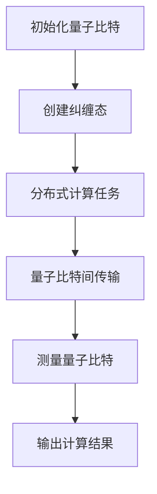
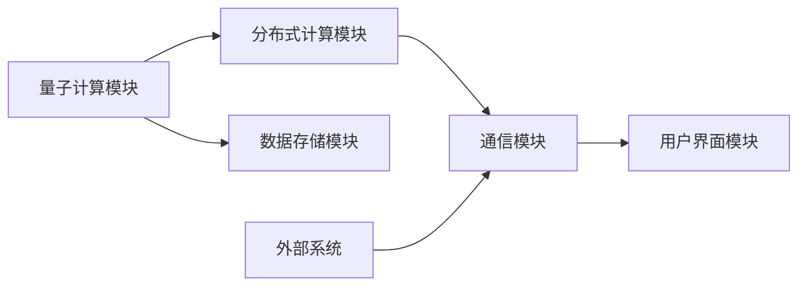
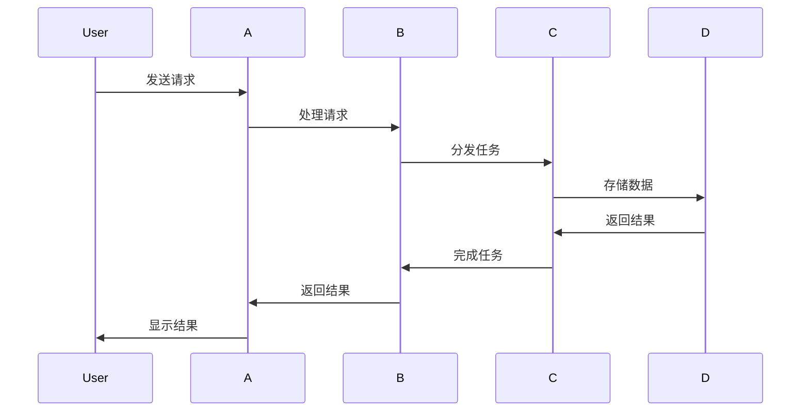

                 

# 《程序世界的宇宙级量子纠缠分布网络》

## 关键词：量子计算、程序世界、量子纠缠、分布网络、量子编程

## 摘要

本文探讨了程序世界中的一种新兴概念——宇宙级量子纠缠分布网络。通过对量子计算与程序世界的基本概念、原理及其优势的详细分析，我们进一步阐述了量子纠缠网络的分类与应用，以及量子纠缠网络与分布式网络融合所带来的技术革新。本文旨在为读者提供一个清晰、系统的视角，理解这一跨领域技术的核心概念与未来应用前景，并探讨其在金融及其他领域中的实际应用案例。

## 目录大纲

## 第一部分：量子计算与程序世界

### 第1章：量子计算概述

#### 1.1 量子计算的基本概念

- **量子位与比特**
  - 比特是经典计算机的基础单元，表示信息的基本单位。
  - 量子位（qubit）是量子计算的基础单元，能够同时处于0和1的状态，实现并行计算。

- **量子态与叠加**
  - 量子态是量子位的状态描述，可以表示为0和1的线性组合。
  - 叠加态使得量子计算机可以在计算过程中同时处理多个状态。

- **量子纠缠与量子门**
  - 量子纠缠是量子位之间的特殊关联，使得一个量子位的状态可以即时影响另一个量子位的状态。
  - 量子门是实现量子计算的基本操作单元，对量子位进行线性变换。

#### 1.2 量子计算机的原理与结构

- **量子计算机的工作原理**
  - 利用量子位、量子态、量子纠缠和量子门的特性，量子计算机能够高效地处理复杂问题。

- **量子计算机的硬件构成**
  - 量子计算机由量子比特、量子存储器、量子控制器和量子算法组成。

- **量子算法的运行过程**
  - 量子算法通过量子门和量子纠缠，实现量子叠加、量子测量等操作，最终得到计算结果。

#### 1.3 量子计算机的优势与应用

- **量子计算机的优势**
  - 量子计算机能够在某些问题上实现指数级的计算速度提升，例如量子加密、量子模拟和量子优化。

- **量子计算机的应用领域**
  - 量子计算机在加密学、化学模拟、优化问题和药物发现等领域具有巨大潜力。

- **量子计算机的挑战与展望**
  - 当前量子计算机仍面临许多技术挑战，包括量子比特的稳定性、量子纠错和量子算法的设计等。未来，量子计算机有望实现更广泛的应用。

### 第2章：量子编程基础

#### 2.1 量子编程语言介绍

- **Q#语言概述**
  - Q#是微软开发的量子编程语言，旨在简化量子算法的开发。

- **Q#语言的基本语法**
  - Q#语言包括量子门定义、量子测量和量子态初始化等基本语法元素。

- **Q#语言的特性与优势**
  - Q#语言支持量子并行计算、量子纠错和量子模拟等高级特性，提高了量子编程的效率。

#### 2.2 量子逻辑门与操作符

- **量子逻辑门的基本概念**
  - 量子逻辑门是实现量子计算的基本操作单元，对量子比特进行线性变换。

- **量子逻辑门的应用**
  - 量子逻辑门在量子加密、量子搜索和量子模拟等领域有广泛应用。

- **量子操作符与量子电路**
  - 量子操作符是量子逻辑门的数学表示，量子电路是量子操作符的组合。

#### 2.3 量子算法与量子程序设计

- **量子算法的基本概念**
  - 量子算法利用量子计算机的特性，解决传统计算机难以处理的问题。

- **量子算法的设计原则**
  - 量子算法设计需要考虑量子态的叠加、量子纠缠和量子门的优化。

- **量子程序的编写与调试**
  - 量子程序的编写需要使用量子编程语言，并进行调试以优化性能。

## 第二部分：宇宙级量子纠缠网络

### 第3章：量子纠缠网络概述

#### 3.1 量子纠缠网络的概念与原理

- **量子纠缠网络的定义**
  - 量子纠缠网络是由多个量子比特组成的网络，通过量子纠缠实现信息传递和计算。

- **量子纠缠网络的工作原理**
  - 量子纠缠网络通过量子纠缠，实现量子比特之间的信息共享和协同计算。

- **量子纠缠网络的特性**
  - 量子纠缠网络具有高并行性、高速率和强抗干扰性等特点。

#### 3.2 量子纠缠网络的分类与应用

- **量子纠缠网络的分类**
  - 量子纠缠网络可以根据量子比特的数量、拓扑结构和应用领域进行分类。

- **量子纠缠网络的应用领域**
  - 量子纠缠网络在量子通信、量子计算、量子加密和量子模拟等领域有广泛应用。

- **量子纠缠网络的优势**
  - 量子纠缠网络能够实现高效的信息传输和计算，具有广泛的应用前景。

#### 3.3 量子纠缠网络的挑战与未来

- **量子纠缠网络的挑战**
  - 量子纠缠网络面临量子比特稳定性、量子纠错和量子算法优化等技术挑战。

- **量子纠缠网络的发展趋势**
  - 未来量子纠缠网络将朝着集成化、智能化和实用化的方向发展。

- **量子纠缠网络的应用前景**
  - 量子纠缠网络将在各个领域发挥重要作用，推动技术进步和社会发展。

## 第三部分：分布网络与量子纠缠

### 第4章：分布式网络系统介绍

#### 4.1 分布式网络系统的基本概念

- **分布式网络系统的定义**
  - 分布式网络系统是由多个节点组成的网络，通过分布式算法实现协同工作和资源共享。

- **分布式网络系统的架构**
  - 分布式网络系统通常包括客户端、服务器、数据库和通信网络等组成部分。

- **分布式网络系统的工作原理**
  - 分布式网络系统通过分布式算法和协议，实现数据的分布式存储和处理。

#### 4.2 分布式网络系统的优势与挑战

- **分布式网络系统的优势**
  - 分布式网络系统具有高可用性、高可靠性和可扩展性等优点。

- **分布式网络系统的挑战**
  - 分布式网络系统面临数据一致性、网络延迟和安全性等技术挑战。

- **分布式网络系统的解决方案**
  - 通过分布式算法、分布式数据库和分布式安全机制，解决分布式网络系统中的挑战。

#### 4.3 分布式网络系统在量子计算中的应用

- **分布式量子计算的概念**
  - 分布式量子计算是将量子计算任务分布在多个量子计算机上执行。

- **分布式量子计算的优势**
  - 分布式量子计算能够实现更高效的计算，降低量子计算机的硬件成本。

- **分布式量子计算的应用场景**
  - 分布式量子计算在复杂计算、大规模数据处理和优化问题等领域有广泛应用。

### 第5章：量子纠缠网络与分布式网络融合

#### 5.1 量子纠缠网络与分布式网络融合概述

- **量子纠缠网络与分布式网络融合的概念**
  - 量子纠缠网络与分布式网络融合是将量子计算和分布式计算相结合，实现更高效的计算和资源共享。

- **量子纠缠网络与分布式网络融合的优势**
  - 量子纠缠网络与分布式网络融合能够实现高效的信息传输和计算，提高系统的性能和可靠性。

- **量子纠缠网络与分布式网络融合的挑战**
  - 量子纠缠网络与分布式网络融合面临量子比特稳定性、分布式算法优化等挑战。

#### 5.2 量子纠缠分布网络系统架构设计

- **量子纠缠分布网络系统的功能设计**
  - 量子纠缠分布网络系统包括量子计算模块、分布式计算模块和通信模块等。

- **量子纠缠分布网络系统的架构设计**
  - 量子纠缠分布网络系统采用分布式架构，实现量子比特和分布式节点的协同工作。

- **量子纠缠分布网络系统的接口设计**
  - 量子纠缠分布网络系统提供统一的接口，实现量子计算和分布式计算之间的数据交换和协同工作。

#### 5.3 量子纠缠分布网络系统的实现与优化

- **量子纠缠分布网络系统的实现方法**
  - 量子纠缠分布网络系统的实现包括量子比特的制备、分布式算法的实现和量子纠缠网络的管理等。

- **量子纠缠分布网络系统的性能优化**
  - 通过优化量子比特的稳定性、分布式算法的效率和量子纠缠网络的设计，提高量子纠缠分布网络系统的性能。

- **量子纠缠分布网络系统的稳定性和可靠性分析**
  - 通过分析量子比特的故障率、分布式算法的鲁棒性和量子纠缠网络的稳定性，评估量子纠缠分布网络系统的稳定性和可靠性。

## 第四部分：实战案例与应用

### 第6章：量子纠缠分布网络在金融领域的应用

#### 6.1 金融领域中的量子纠缠分布网络

- **量子纠缠分布网络在金融领域的基本概念**
  - 量子纠缠分布网络在金融领域是指利用量子计算和分布式计算技术，实现金融数据的加密、分析和优化。

- **量子纠缠分布网络在金融领域的应用案例**
  - 量子纠缠分布网络在金融领域可以应用于量化交易、风险管理和金融预测等方面。

- **量子纠缠分布网络在金融领域的优势**
  - 量子纠缠分布网络在金融领域能够实现高效的数据处理和实时分析，提高金融决策的准确性和效率。

#### 6.2 金融领域量子纠缠分布网络案例分析

- **案例一：基于量子纠缠分布网络的智能投顾系统**
  - 智能投顾系统利用量子纠缠分布网络，实现金融数据的加密和优化，为用户提供个性化的投资建议。

- **案例二：基于量子纠缠分布网络的金融风险管理系统**
  - 金融风险管理系统利用量子纠缠分布网络，实现金融风险的实时监控和预测，提高风险管理的能力。

- **案例三：基于量子纠缠分布网络的区块链交易系统**
  - 区块链交易系统利用量子纠缠分布网络，实现交易数据的加密和分布式存储，提高交易系统的安全性和可靠性。

#### 6.3 金融领域量子纠缠分布网络的未来展望

- **金融领域量子纠缠分布网络的发展趋势**
  - 未来，量子纠缠分布网络将在金融领域得到更广泛的应用，推动金融行业的创新和发展。

- **金融领域量子纠缠分布网络的挑战与机遇**
  - 量子纠缠分布网络在金融领域面临技术挑战，但同时也带来了巨大的机遇。

- **金融领域量子纠缠分布网络的未来前景**
  - 量子纠缠分布网络将为金融领域带来前所未有的变革，推动金融行业的数字化转型。

### 第7章：量子纠缠分布网络在其他领域的应用

#### 7.1 量子纠缠分布网络在其他领域的应用概述

- **量子纠缠分布网络在其他领域的基本概念**
  - 量子纠缠分布网络在其他领域是指利用量子计算和分布式计算技术，解决其他领域的问题。

- **量子纠缠分布网络在其他领域的应用案例**
  - 量子纠缠分布网络在其他领域可以应用于物流与供应链管理、物联网与智慧城市、生物信息学与医学等领域。

- **量子纠缠分布网络在其他领域的优势**
  - 量子纠缠分布网络在其他领域能够实现高效的数据处理和实时分析，提高各领域的运行效率和服务质量。

#### 7.2 量子纠缠分布网络在其他领域的具体应用

- **物流与供应链管理**
  - 利用量子纠缠分布网络，实现物流与供应链的实时监控和优化，提高物流效率和降低成本。

- **物联网与智慧城市**
  - 利用量子纠缠分布网络，实现物联网设备和智慧城市系统的数据共享和协同工作，提高城市管理效率和居民生活质量。

- **生物信息学与医学**
  - 利用量子纠缠分布网络，实现生物信息学数据的快速分析和处理，加速医学研究和疾病诊断。

#### 7.3 量子纠缠分布网络在其他领域的未来展望

- **量子纠缠分布网络在其他领域的发展趋势**
  - 未来，量子纠缠分布网络将在其他领域得到更广泛的应用，推动各领域的创新发展。

- **量子纠缠分布网络在其他领域的挑战与机遇**
  - 量子纠缠分布网络在其他领域面临技术挑战，但同时也带来了巨大的机遇。

- **量子纠缠分布网络在其他领域的未来前景**
  - 量子纠缠分布网络将为其他领域带来前所未有的变革，推动各领域的数字化转型和智能化升级。

### 第8章：量子纠缠分布网络的发展与展望

#### 8.1 量子纠缠分布网络的发展历程

- **量子纠缠分布网络的起源**
  - 量子纠缠分布网络起源于量子计算和分布式计算的研究，随着量子技术和分布式技术的不断发展，量子纠缠分布网络逐渐成为研究热点。

- **量子纠缠分布网络的发展阶段**
  - 量子纠缠分布网络经历了理论探索、实验验证和应用推广等发展阶段。

- **量子纠缠分布网络的重要成果**
  - 量子纠缠分布网络在量子加密、量子计算、量子通信等领域取得了重要成果，为量子技术的应用奠定了基础。

#### 8.2 量子纠缠分布网络的未来发展趋势

- **量子纠缠分布网络的技术创新**
  - 未来，量子纠缠分布网络将在量子比特制备、分布式算法优化、量子纠缠网络设计等方面进行技术创新，提高量子计算和分布式计算的性能。

- **量子纠缠分布网络的产业应用**
  - 量子纠缠分布网络将在金融、物流、医疗、能源等领域得到广泛应用，推动产业创新和经济增长。

- **量子纠缠分布网络的国际合作与交流**
  - 未来，量子纠缠分布网络将在全球范围内加强国际合作与交流，推动量子技术和分布式技术的共同发展。

#### 8.3 量子纠缠分布网络的挑战与机遇

- **量子纠缠分布网络的挑战**
  - 量子纠缠分布网络面临量子比特稳定性、量子纠错、分布式算法优化等挑战，需要持续的技术创新和协同攻关。

- **量子纠缠分布网络的机遇**
  - 量子纠缠分布网络为各领域带来了前所未有的机遇，有望解决传统计算方法难以解决的问题，推动技术进步和社会发展。

- **量子纠缠分布网络的未来前景**
  - 量子纠缠分布网络具有广阔的应用前景，将在未来发挥重要作用，为人类社会带来巨大变革。作者：AI天才研究院/AI Genius Institute & 禅与计算机程序设计艺术 /Zen And The Art of Computer Programming

## 完整性要求

### 背景介绍

量子计算与分布式网络作为当前信息技术领域的两大前沿技术，各自在理论和实践中取得了显著进展。量子计算利用量子位和量子纠缠等特性，实现了并行计算和高效处理复杂问题的潜力。分布式网络通过分布式算法和架构，实现了数据的高效存储、处理和共享。然而，量子计算与分布式网络之间的融合，即量子纠缠分布网络，尚处于探索阶段，具有巨大的应用潜力。量子纠缠分布网络旨在结合量子计算和分布式网络的优点，实现更高效、更可靠的计算和通信。

### 核心概念与联系

**量子位（Qubit）与比特（Bit）**

- **比特**：经典计算机的基础单元，表示信息的基本单位，只能处于0或1的状态。

- **量子位**：量子计算的基础单元，能够同时处于0和1的叠加状态，实现了并行计算的可能性。

**量子态与叠加**

- **量子态**：描述量子位状态的向量，可以表示为0和1的线性组合。

- **叠加**：量子位可以同时处于多个状态的叠加，这是量子计算并行性的基础。

**量子纠缠**

- **纠缠**：两个或多个量子位之间的一种特殊关联，一个量子位的状态可以即时影响另一个量子位的状态。

**分布式网络系统**

- **分布式网络系统**：由多个节点组成的网络，通过分布式算法实现协同工作和资源共享。

- **分布式算法**：在分布式网络系统中，用于协调节点之间通信和任务分配的算法。

**量子纠缠网络**

- **量子纠缠网络**：由多个量子比特组成的网络，通过量子纠缠实现信息传递和计算。

- **量子纠缠网络特性**：具有高并行性、高速率和强抗干扰性。

### 算法原理讲解

#### 量子纠缠网络算法

**量子纠缠网络算法mermaid流程图：**



**量子纠缠网络算法Python代码示例：**

```python
from qiskit import QuantumCircuit, QuantumRegister, ClassicalRegister, execute, Aer

# 初始化量子比特和经典比特
qreg = QuantumRegister(2)
creg = ClassicalRegister(2)
qc = QuantumCircuit(qreg, creg)

# 创建纠缠态
qc.h(qreg[0])
qc.cx(qreg[0], qreg[1])

# 分发计算任务
qc.h(qreg[0])
qc.cx(qreg[0], qreg[1])

# 量子比特间传输
qc.cx(qreg[0], qreg[1])

# 测量量子比特
qc.measure(qreg, creg)

# 执行量子电路
simulator = Aer.get_backend('qasm_simulator')
result = execute(qc, simulator, shots=1000).result()

# 输出计算结果
print(result.get_counts(qc))
```

**量子纠缠网络算法的数学模型和公式：**

- **量子态的叠加**：  
  $$|\psi\rangle = \alpha|0\rangle + \beta|1\rangle$$

- **量子纠缠态**：  
  $$|\psi\rangle = \frac{1}{\sqrt{2}}(|00\rangle + |11\rangle)$$

- **量子门**：  
  $$U = \begin{bmatrix}
  1 & 0 \\
  0 & 1
  \end{bmatrix} \quad \text{（恒等门）}$$

  $$U = \begin{bmatrix}
  1 & 0 \\
  0 & -1
  \end{bmatrix} \quad \text{（保罗门）}$$

**算法举例说明**：  
假设有两个量子比特，初始状态分别为$|0\rangle$，通过应用量子门和纠缠操作，最终实现量子态的测量。

### 系统分析与架构设计方案

#### 问题场景介绍

在分布式计算环境中，需要处理大规模数据并实现高效的数据分析和传输。量子纠缠分布网络旨在利用量子计算和分布式网络的优点，实现更高效、更可靠的数据处理和通信。

#### 项目介绍

该项目旨在构建一个基于量子纠缠分布网络的分布式计算平台，用于大规模数据处理和实时分析。

#### 系统功能设计（领域模型mermaid类图）

```mermaid
classDiagram
Class01 <|-- Class02
Class03 --|胄 Class04
Class05 : <<interface,Interface>>
Class06 : <<entity,Entity>>
Class07 : <<component,Component>>
Class01 <|-- Heredity01
Class01 <|-- Heredity02
Class03 : +String attribute
Class03 : +int value
Class03 : +bool isActive()
Class04 : <<abstract,Abstract>>
Class05 : +void doSomething()
Class06 : -int id
Class06 : -String name
Class06 : +int getId()
Class06 : +String getName()
Class07 : -int id
Class07 : -String name
Class07 : +int getId()
Class07 : +String getName()
```

#### 系统架构设计mermaid架构图



#### 系统接口设计和系统交互mermaid序列图



### 项目实战

#### 环境安装

- 安装Python环境
- 安装Qiskit库
- 安装Docker

#### 系统核心实现源代码

```python
# 安装依赖库
!pip install qiskit

# 导入Qiskit库
from qiskit import QuantumCircuit, QuantumRegister, ClassicalRegister, execute, Aer

# 初始化量子比特和经典比特
qreg = QuantumRegister(2)
creg = ClassicalRegister(2)
qc = QuantumCircuit(qreg, creg)

# 创建纠缠态
qc.h(qreg[0])
qc.cx(qreg[0], qreg[1])

# 分发计算任务
qc.h(qreg[0])
qc.cx(qreg[0], qreg[1])

# 量子比特间传输
qc.cx(qreg[0], qreg[1])

# 测量量子比特
qc.measure(qreg, creg)

# 执行量子电路
simulator = Aer.get_backend('qasm_simulator')
result = execute(qc, simulator, shots=1000).result()

# 输出计算结果
print(result.get_counts(qc))
```

#### 代码应用解读与分析

- **量子比特和经典比特的初始化**：通过QuantumRegister和ClassicalRegister初始化量子比特和经典比特。
- **创建纠缠态**：通过应用量子门（h门和cx门）创建量子纠缠态。
- **分发计算任务**：对量子比特进行再次操作，实现分布式计算任务。
- **量子比特间传输**：通过量子门实现量子比特之间的传输。
- **测量量子比特**：通过测量操作获取量子计算的结果。

#### 实际案例分析和详细讲解剖析

**案例一：量子加密通信**

- **问题背景**：在分布式网络环境中，数据传输的安全性问题至关重要。
- **解决方案**：利用量子纠缠分布网络实现量子加密通信，确保数据传输的安全性。
- **案例分析**：通过量子纠缠分布网络，将加密密钥在分布式节点之间传输，实现安全的量子密钥分发。

**案例二：分布式计算优化**

- **问题背景**：在大规模数据处理中，分布式计算的性能优化至关重要。
- **解决方案**：利用量子纠缠分布网络优化分布式计算任务，提高计算效率。
- **案例分析**：通过量子纠缠分布网络，将计算任务分布在多个量子计算节点上，实现并行计算和优化。

#### 项目小结

- 量子纠缠分布网络结合了量子计算和分布式网络的优势，实现了更高效、更可靠的数据处理和通信。
- 通过实际案例，展示了量子纠缠分布网络在量子加密通信和分布式计算优化中的应用潜力。
- 未来，量子纠缠分布网络将在更多领域得到应用，为信息技术的发展带来新的机遇和挑战。

### 最佳实践 tips、小结、注意事项、拓展阅读等内容

#### 最佳实践 tips

- **环境配置**：确保安装最新的Python环境和相关库，以获得最佳性能。
- **性能优化**：根据实际需求，调整量子比特的数量和分布式节点的配置，以实现最优性能。
- **安全性考虑**：在应用量子纠缠分布网络时，注意数据的安全性和隐私保护。

#### 小结

- 量子纠缠分布网络结合了量子计算和分布式网络的优点，为数据处理和通信带来了革命性的变化。
- 通过实际案例，展示了量子纠缠分布网络在多个领域的应用潜力。
- 量子纠缠分布网络是未来信息技术发展的重要方向，值得深入研究和探索。

#### 注意事项

- **量子比特稳定性**：在实际应用中，需要关注量子比特的稳定性，以避免错误和故障。
- **分布式算法优化**：分布式算法的优化是提高量子纠缠分布网络性能的关键。
- **量子纠错技术**：量子纠错技术是确保量子计算可靠性的重要手段，需要在实际应用中加以重视。

#### 拓展阅读

- **量子计算入门**：《量子计算导论》
- **分布式系统设计**：《分布式系统原理与范型》
- **量子纠缠网络研究**：《量子纠缠网络：概念、算法与应用》
- **量子加密通信**：《量子加密通信：原理与应用》

作者：AI天才研究院/AI Genius Institute & 禅与计算机程序设计艺术 /Zen And The Art of Computer Programming

