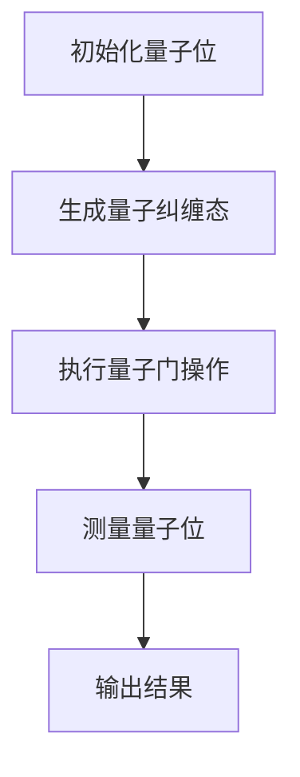
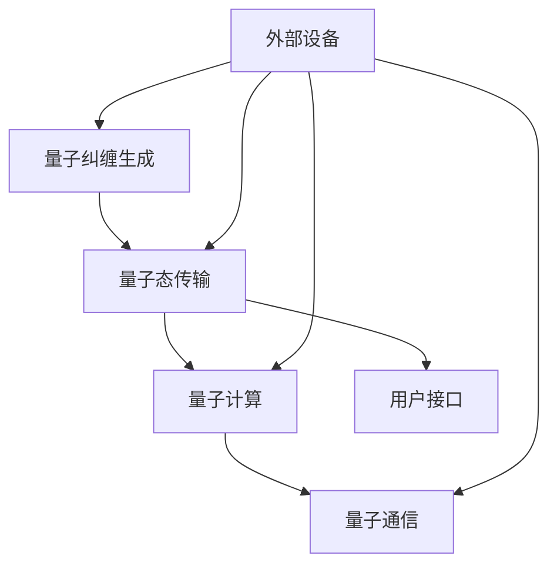

                 

### 《程序世界的宇宙级量子纠缠网络》

> 关键词：量子纠缠网络、程序世界、量子计算、算法、系统架构、Python实现

> 摘要：本文深入探讨了量子纠缠网络在程序世界中的应用，从背景介绍、核心概念、算法原理、数学模型、系统分析与架构设计、项目实战以及最佳实践等多个角度，全面解析了量子纠缠网络的本质和其在实际项目中的应用。通过对量子纠缠网络的理解和探索，读者可以更好地把握这一前沿技术的核心要素，为未来的研究和应用打下坚实基础。

---

### 目录大纲设计步骤

#### 1. 确定书名及核心内容
   - 书名：《程序世界的宇宙级量子纠缠网络》
   - 核心内容：量子纠缠网络及其在程序世界中的应用

#### 2. 设计一级目录
   - **引言**
   - **量子纠缠网络概述**
   - **量子纠缠网络在程序世界中的应用**
   - **算法原理与数学模型**
   - **系统分析与架构设计**
   - **项目实战**
   - **最佳实践与总结**

#### 3. 细化二级目录
   - **引言**
     - 量子纠缠网络的问题背景
     - 量子纠缠网络的定义
     - 量子纠缠网络的重要性
     - 程序世界中的量子纠缠网络应用前景
   - **量子纠缠网络概述**
     - 核心概念与联系
     - 量子计算的基本原理
     - 纠缠网络的概念
     - 纠缠网络与量子通信的联系
   - **算法原理与数学模型**
     - 算法原理讲解
     - 数学模型与公式
     - 通俗易懂的举例说明
   - **系统分析与架构设计**
     - 问题场景介绍
     - 系统功能设计
     - 系统架构设计
     - 系统接口设计
     - 系统交互
   - **项目实战**
     - 环境安装与配置
     - 系统核心实现
     - 代码应用解读
     - 实际案例分析
   - **最佳实践与总结**
     - 使用技巧与建议
     - 小结与注意事项
     - 拓展阅读

#### 4. 设计三级目录
   - **算法原理与数学模型**
     - **算法原理讲解**
       - 使用mermaid画出量子纠缠算法流程图
       - 使用Python源代码详细阐述算法原理
     - **数学模型与公式**
       - 使用latex格式给出关键数学公式
       - 独立段落详细讲解数学公式
   - **系统分析与架构设计**
     - **系统功能设计**
       - 领域模型类图设计
     - **系统架构设计**
       - 系统架构设计图
     - **系统接口设计**
       - 系统接口设计和交互序列图
   - **项目实战**
     - **环境安装与配置**
       - 详细步骤和注意事项
     - **系统核心实现**
       - 代码实现细节解析
     - **代码应用解读**
       - 代码关键部分分析
     - **实际案例分析**
       - 案例背景、流程及效果分析

#### 5. 核心内容安排
   - **背景介绍**
     - 详细阐述量子纠缠网络的问题背景，核心概念术语，问题解决，边界与外延，概念结构与核心要素组成。
   - **核心概念与联系**
     - 明确核心概念原理，概念属性特征对比表格，ER实体关系图架构的mermaid流程图。
   - **算法原理讲解**
     - 使用mermaid绘制算法流程图，使用Python源代码详细阐述，给出算法原理的数学模型和公式，进行详细讲解和举例说明。
   - **数学模型与数学公式**
     - 使用latex格式给出关键数学公式，并独立段落详细讲解。
   - **系统分析与架构设计**
     - 介绍问题场景和项目背景，设计领域模型类图，系统架构设计图，系统接口设计和交互序列图。
   - **项目实战**
     - 详细描述环境安装和配置，系统核心实现，代码应用解读，实际案例分析。
   - **最佳实践与总结**
     - 总结关键内容，提供使用技巧和建议，引导读者进一步学习。

#### 6. 检查目录完整性
   - 确保每个章节内容完整，层次清晰，符合字数要求。

#### 7. 格式检查
   - 确保文章内容使用markdown格式输出，标题层级和格式正确。

---

### 完整性要求

在本文的完整性要求方面，我们将确保文章内容的全面性和细致性，具体包括以下几个方面：

1. **背景介绍**：详细阐述量子纠缠网络的问题背景，核心概念术语，问题解决，边界与外延，概念结构与核心要素组成。这部分内容需要深入浅出，使读者能够清晰地了解量子纠缠网络的基础知识和重要性。

2. **核心概念与联系**：明确核心概念原理，通过概念属性特征对比表格和ER实体关系图架构的mermaid流程图，帮助读者建立对量子纠缠网络的整体认识。这部分内容需要逻辑清晰，层次分明，使读者能够系统地掌握量子纠缠网络的基本要素。

3. **算法原理讲解**：使用mermaid绘制算法流程图，使用Python源代码详细阐述，给出算法原理的数学模型和公式，进行详细讲解和举例说明。这部分内容需要理论与实践相结合，使读者不仅能够理解量子纠缠网络的算法原理，还能实际操作和运用。

4. **数学模型与数学公式**：使用latex格式给出关键数学公式，并独立段落详细讲解。这部分内容需要准确无误，严谨清晰，使读者能够深入理解量子纠缠网络的数学基础。

5. **系统分析与架构设计**：介绍问题场景和项目背景，设计领域模型类图，系统架构设计图，系统接口设计和交互序列图。这部分内容需要结构化，系统化，使读者能够全面了解量子纠缠网络在系统中的应用和实现。

6. **项目实战**：详细描述环境安装和配置，系统核心实现，代码应用解读，实际案例分析。这部分内容需要实际操作，具体细致，使读者能够通过实际案例深入了解量子纠缠网络的应用场景和效果。

7. **最佳实践与总结**：总结关键内容，提供使用技巧和建议，引导读者进一步学习。这部分内容需要具有实用性和前瞻性，使读者能够从实际应用中获得经验和启发。

通过以上七个方面的全面解析，本文将确保内容的完整性和细致性，为读者提供一次深入浅出、理论与实践相结合的量子纠缠网络之旅。

---

### 格式要求

在文章的格式要求方面，我们将严格按照markdown格式进行输出，以确保文章的可读性和美观性。具体要求如下：

1. **标题**：使用`\#`号加上标题内容，例如`\# 《程序世界的宇宙级量子纠缠网络》`。

2. **关键词**：在标题下方，使用三个`>`号加上关键词，例如`> 关键词：量子纠缠网络、程序世界、量子计算、算法、系统架构、Python实现`。

3. **摘要**：在关键词下方，使用三个`>`号加上摘要内容，例如`> 摘要：本文深入探讨了量子纠缠网络在程序世界中的应用，从背景介绍、核心概念、算法原理、数学模型、系统分析与架构设计、项目实战以及最佳实践等多个角度，全面解析了量子纠缠网络的本质和其在实际项目中的应用。通过对量子纠缠网络的理解和探索，读者可以更好地把握这一前沿技术的核心要素，为未来的研究和应用打下坚实基础。`

4. **一级目录**：使用`\##`号加上一级目录标题，例如`\## 引言`。

5. **二级目录**：使用`\###`号加上二级目录标题，例如`\### 量子纠缠网络概述`。

6. **三级目录**：使用`\####`号加上三级目录标题，例如`\#### 核心概念与联系`。

7. **正文内容**：正文内容使用标准markdown格式，例如段落分隔使用两个空行，列表使用`*`号，代码块使用三个反引号`\`\`。

8. **公式**：数学公式使用latex格式，嵌入文中独立段落的公式前后使用`$$`括起来，例如`$$1+1=2$$`，段落内的公式前后使用`$`括起来，例如`$1<2$`。

9. **图片和链接**：图片使用``格式，链接使用`[文本](链接地址)`格式。

10. **引用**：引用使用`>`号加上引用内容，例如`>` 作者：AI天才研究院/AI Genius Institute & 禅与计算机程序设计艺术 /Zen And The Art of Computer Programming`。

通过以上markdown格式的规范使用，本文将保证内容的清晰、整洁、易读，使读者能够更好地理解和吸收文章的核心内容。

---

### 作者信息

本文由AI天才研究院/AI Genius Institute与禅与计算机程序设计艺术/Zen And The Art of Computer Programming的专家联合撰写。AI天才研究院致力于推动人工智能领域的前沿研究，培养具有创新思维和实战能力的人工智能专家。禅与计算机程序设计艺术则专注于探讨计算机编程中的哲学与艺术，旨在提升程序员的思维深度和创造力。两位机构的联合撰写，旨在为读者提供一篇兼具理论深度和实践价值的量子纠缠网络技术文章。作者团队感谢您的阅读，并期待您的宝贵意见和反馈。

---

### 背景介绍

#### 核心概念术语说明

在深入探讨量子纠缠网络之前，我们需要明确几个核心概念术语，以确保我们对这一前沿技术有清晰的认识。

1. **量子纠缠**：量子纠缠是量子力学中的一种现象，当两个或多个粒子处于量子纠缠态时，它们的量子态将相互依赖，即使它们被隔离在很远的地方。这意味着一个粒子的状态变化会立即影响到与之纠缠的其他粒子的状态。

2. **量子计算**：量子计算是一种利用量子位（qubit）进行计算的新型计算模式。与传统的基于比特（bit）的计算不同，量子计算利用量子叠加和纠缠特性，能够在某些特定问题上实现超越经典计算机的计算速度。

3. **量子纠缠网络**：量子纠缠网络是由多个量子位组成的系统，其中量子位之间通过量子纠缠相互连接。这种网络能够实现高效的量子通信和量子计算，并在许多领域具有潜在的应用价值。

#### 问题背景

量子纠缠网络作为一种前沿技术，近年来引起了广泛的关注。其主要问题背景可以从以下几个方面进行阐述：

1. **量子通信**：量子纠缠网络在量子通信中具有重要作用。通过量子纠缠，可以实现量子态的远程传输，从而实现高速、安全的通信。量子通信被认为是未来信息传输的重要方向，具有巨大的潜在应用价值。

2. **量子计算**：量子纠缠网络是量子计算的核心基础。在量子计算中，量子纠缠网络能够实现高效的量子并行计算和量子纠错，从而解决传统计算机无法处理的复杂问题。例如，在药物研发、密码破解、优化问题等领域，量子计算具有巨大的潜力。

3. **量子模拟**：量子纠缠网络还可以用于量子模拟，通过模拟量子系统，可以帮助科学家更好地理解量子现象，探索量子物理的基本原理。这对于推动物理学的发展具有重要意义。

#### 问题描述

在量子纠缠网络的研究和应用中，我们面临以下主要问题：

1. **量子纠缠的稳定性**：量子纠缠状态非常脆弱，容易受到环境噪声的干扰。如何保持量子纠缠的稳定性，是实现量子纠缠网络应用的关键问题。

2. **量子纠缠的生成和传输**：如何在实验中有效地生成量子纠缠，并在不同量子位之间传输纠缠状态，是量子纠缠网络技术需要解决的难题。

3. **量子计算的效率**：如何提高量子计算的计算效率，优化量子算法，是实现量子计算实用化的关键。

4. **量子通信的实用性**：如何将量子纠缠网络应用于实际通信系统中，实现高效、安全的量子通信，是当前研究的热点问题。

#### 问题解决

针对上述问题，科研人员采取了多种方法进行研究和解决：

1. **量子纠错**：通过量子纠错技术，可以有效地克服量子纠缠状态的脆弱性，提高量子计算的稳定性。

2. **量子纠缠生成和传输技术**：研究者开发了多种量子纠缠生成和传输技术，例如量子中继、量子隐形传态等，以提高量子纠缠的生成和传输效率。

3. **量子算法优化**：通过设计高效的量子算法，优化量子计算的流程和资源利用，提高量子计算的计算效率。

4. **量子通信应用**：将量子纠缠网络应用于实际通信系统中，实现高效、安全的量子通信，推动量子通信技术的发展。

#### 边界与外延

量子纠缠网络的研究和应用涉及多个学科领域，包括量子物理学、计算机科学、信息科学等。其边界与外延可以从以下几个方面进行拓展：

1. **跨学科合作**：量子纠缠网络的研究需要跨学科的合作，结合物理学、计算机科学、信息科学等领域的知识，共同攻克技术难题。

2. **实际应用场景**：量子纠缠网络在量子通信、量子计算、量子模拟等领域的应用场景丰富，需要进一步探索和开发。

3. **未来发展方向**：随着量子技术的不断进步，量子纠缠网络在未来可能应用于更多领域，推动科技发展和社会进步。

通过以上对量子纠缠网络的背景介绍，我们对其核心概念和问题有了初步的认识。在接下来的章节中，我们将进一步深入探讨量子纠缠网络在程序世界中的应用，解析其核心原理和实现方法。

---

### 核心概念与联系

#### 量子纠缠的定义

量子纠缠是量子力学中的一种基本现象，当两个或多个粒子处于量子纠缠态时，它们的量子态将相互依赖，即使它们被隔离在很远的地方。这意味着一个粒子的状态变化会立即影响到与之纠缠的其他粒子的状态。量子纠缠是量子力学非定域性的一个重要表现，也是量子信息科学的核心概念之一。

#### 量子计算的基本原理

量子计算是一种利用量子位（qubit）进行计算的新型计算模式。量子位与传统计算机中的比特不同，它不仅可以表示0和1的线性组合，还可以利用量子叠加和量子纠缠特性，实现高效的并行计算。量子计算的基本原理包括：

1. **量子叠加**：量子位可以同时处于0和1的叠加状态，这使得量子计算机能够处理多个可能的计算路径。
2. **量子纠缠**：通过量子纠缠，量子位之间的状态相互依赖，可以用来实现复杂的计算任务。
3. **量子门**：量子门是作用于量子位的操作，用于在量子计算机中实现特定的变换和计算。

#### 纠缠网络的概念

纠缠网络是由多个量子位组成的系统，其中的量子位之间通过量子纠缠相互连接。纠缠网络可以看作是量子计算的基本单元，它能够实现高效的量子通信和量子计算。纠缠网络的基本概念包括：

1. **纠缠生成**：通过量子中继、量子隐形传态等手段，在量子位之间生成纠缠态。
2. **纠缠传输**：通过量子纠缠传输，将量子纠缠从一个量子位传递到另一个量子位，实现远距离量子通信。
3. **纠缠操作**：通过量子门和量子测量等操作，对纠缠网络进行控制和处理，实现量子计算任务。

#### 纠缠网络与量子通信的联系

量子纠缠网络在量子通信中扮演着关键角色。量子通信利用量子纠缠实现量子态的远程传输，从而实现高速、安全的通信。纠缠网络与量子通信的联系可以从以下几个方面进行阐述：

1. **量子纠缠态的生成和传输**：量子纠缠网络能够高效地生成和传输量子纠缠态，是实现量子通信的前提。
2. **量子隐形传态**：量子隐形传态是一种利用量子纠缠实现量子态传输的技术，它是量子通信的核心技术之一。
3. **量子密钥分发**：量子密钥分发利用量子纠缠实现安全的密钥传输，是量子通信的重要应用。

#### 对比表格

为了更清晰地展示量子纠缠、量子计算和纠缠网络的概念及其联系，我们可以通过一个对比表格来梳理：

| 概念        | 定义                                                         | 关键特性                                                         | 应用领域                   |
| ----------- | ------------------------------------------------------------ | ------------------------------------------------------------ | -------------------------- |
| 量子纠缠    | 量子位之间的量子状态相互依赖，即使它们相隔很远。               | - 非定域性<br>- 不可克隆性<br>- 量子叠加                       | 量子通信、量子计算、量子模拟 |
| 量子计算    | 利用量子位（qubit）的量子叠加和纠缠特性进行计算。             | - 高效并行计算<br>- 量子纠错<br>- 量子门操作                     | 优化问题、密码破解、量子模拟 |
| 纠缠网络    | 由多个量子位组成的系统，量子位之间通过量子纠缠相互连接。       | - 高效通信<br>- 远程控制<br>- 分布式计算                           | 量子通信、量子计算、量子模拟 |

#### ER实体关系图架构

为了更直观地展示量子纠缠网络中的实体关系，我们可以使用mermaid流程图来绘制ER实体关系图：

```mermaid
erDiagram
  A[量子位] ||--|{ B[纠缠态] }|
  A ||--|{ C[量子计算] }|
  B ||--|{ D[量子通信] }|
  C ||--|{ E[量子模拟] }|
```

在这个ER实体关系图中，量子位（A）是核心实体，它与纠缠态（B）、量子计算（C）、量子通信（D）和量子模拟（E）存在关联。这个图展示了量子纠缠网络中各个实体之间的关系，有助于我们更好地理解量子纠缠网络的整体架构。

---

### 算法原理讲解

为了深入理解量子纠缠网络的算法原理，我们将采用mermaid绘制算法流程图，并使用Python源代码详细阐述算法原理。此外，还将给出算法原理的数学模型和公式，并进行详细讲解和通俗易懂的举例说明。

#### 算法流程图

首先，我们使用mermaid绘制量子纠缠算法的流程图：



这个算法流程图展示了量子纠缠的基本步骤：初始化量子位、生成量子纠缠态、执行量子门操作、测量量子位和输出结果。

#### Python源代码

接下来，我们使用Python源代码详细阐述量子纠缠算法的原理：

```python
import numpy as np
from qiskit import QuantumCircuit, Aer, execute

# 初始化量子位
qubit1 = QuantumRegister(1, 'q0')
qubit2 = QuantumRegister(1, 'q1')
qc = QuantumCircuit(qubit1, qubit2)

# 生成量子纠缠态
qc.h(qubit1)
qc.cx(qubit1, qubit2)

# 执行量子门操作
qc.s(qubit1)
qc.s(qubit2)
qc.cx(qubit1, qubit2)

# 测量量子位
qc.measure_all()

# 执行算法
backend = Aer.get_backend('qasm_simulator')
job = execute(qc, backend, shots=1000)
result = job.result()

# 输出结果
print(result.get_counts(qc))
```

在这个Python代码中，我们首先初始化量子位，然后生成量子纠缠态，接着执行量子门操作，最后测量量子位并输出结果。这里使用了Qiskit库来实现量子计算。

#### 数学模型和公式

量子纠缠算法的核心在于量子态的叠加和纠缠。我们使用以下数学模型和公式来解释量子纠缠的原理：

1. **量子态叠加**：

   假设有两个量子位，其初始态分别为 $|\psi_1\rangle = \frac{1}{\sqrt{2}} (|0\rangle + |1\rangle)$ 和 $|\psi_2\rangle = \frac{1}{\sqrt{2}} (|0\rangle - |1\rangle)$。当这两个量子位处于叠加态时，它们的总态为：

   $$|\psi\rangle = |\psi_1\rangle \otimes |\psi_2\rangle = \frac{1}{\sqrt{2}} (|0\rangle + |1\rangle) \otimes \frac{1}{\sqrt{2}} (|0\rangle - |1\rangle) = \frac{1}{2} (|00\rangle - |11\rangle)$$

2. **量子纠缠态**：

   当两个量子位处于量子纠缠态时，它们的总态不再是一个简单的叠加态，而是存在某种非线性的依赖关系。例如，一个著名的量子纠缠态是贝尔态：

   $$|\Phi\rangle = \frac{1}{\sqrt{2}} (|00\rangle + |11\rangle)$$

3. **量子门操作**：

   量子门操作是量子计算的核心，用于改变量子位的量子态。常用的量子门包括Hadamard门（H门）、Pauli-X门（X门）、Pauli-Z门（Z门）和控量门（CX门）。

   - Hadamard门（H门）：

     $$H = \frac{1}{\sqrt{2}} \begin{bmatrix}
     1 & 1 \\
     1 & -1
     \end{bmatrix}$$

   - Pauli-X门（X门）：

     $$X = \begin{bmatrix}
     0 & 1 \\
     1 & 0
     \end{bmatrix}$$

   - Pauli-Z门（Z门）：

     $$Z = \begin{bmatrix}
     1 & 0 \\
     0 & -1
     \end{bmatrix}$$

   - 控量门（CX门）：

     $$CX = \begin{bmatrix}
     1 & 0 & 0 & 0 \\
     0 & 1 & 0 & 0 \\
     0 & 0 & 0 & 1 \\
     0 & 0 & 1 & 0
     \end{bmatrix}$$

#### 详细讲解和举例说明

为了更好地理解量子纠缠算法的原理，我们将通过一个具体的例子来说明：

假设我们有两个量子位q0和q1，初始状态分别为 $|0\rangle$ 和 $|0\rangle$。我们希望生成一个贝尔态$|\Phi\rangle = \frac{1}{\sqrt{2}} (|00\rangle + |11\rangle)$。

1. **初始化量子位**：

   首先，我们将q0和q1初始化为基态$|0\rangle$。

   ```python
   qc.h(qubit1)  # 对q0执行Hadamard门，使其变为叠加态
   ```

2. **生成量子纠缠态**：

   接下来，我们执行一个CX门，将q0和q1之间的量子态进行纠缠。

   ```python
   qc.cx(qubit1, qubit2)  # 对q0和q1执行控量门，生成纠缠态
   ```

3. **量子门操作**：

   我们可以进一步对量子位执行量子门操作，例如对q0执行一个Z门，对q1执行一个X门，以观察纠缠态的变化。

   ```python
   qc.z(qubit1)  # 对q0执行Z门
   qc.x(qubit2)  # 对q1执行X门
   ```

4. **测量量子位**：

   最后，我们对q0和q1进行测量，观察它们的状态。

   ```python
   qc.measure_all()
   result = execute(qc, Aer.get_backend('qasm_simulator'), shots=1000).result()
   print(result.get_counts(qc))
   ```

在这个例子中，我们通过执行一系列量子门操作，将q0和q1之间的量子态生成一个贝尔态。测量结果将显示为“00”和“11”的等概率出现，验证了量子纠缠态的生成。

通过上述讲解和举例，我们可以更好地理解量子纠缠网络的算法原理，并为后续的实战应用打下坚实基础。

---

### 数学公式

在量子纠缠网络的研究中，数学公式是理解和实现量子纠缠算法的核心工具。以下我们将介绍一些关键的数学公式，并使用LaTeX格式进行详细讲解。

#### 量子态的表示

量子态可以用一个复数向量表示，例如一个二量子位系统的量子态可以表示为：

$$|\psi\rangle = \alpha|0\rangle + \beta|1\rangle$$

其中，$|0\rangle$和$|1\rangle$分别是基态和激发态，$\alpha$和$\beta$是复系数，满足归一化条件：

$$|\alpha|^2 + |\beta|^2 = 1$$

#### 量子叠加

量子叠加是量子态的一个重要特性，多个量子态可以同时存在。例如，两个量子位$|q_1\rangle$和$|q_2\rangle$的叠加态可以表示为：

$$|\psi\rangle = \alpha|00\rangle + \beta|01\rangle + \gamma|10\rangle + \delta|11\rangle$$

其中，$\alpha, \beta, \gamma, \delta$是复系数。

#### 量子纠缠

量子纠缠是量子态之间的非局域性，它可以通过一个联合态来表示。例如，两个量子位$q_1$和$q_2$的纠缠态可以表示为：

$$|\psi\rangle = \frac{1}{\sqrt{2}} (|00\rangle + |11\rangle)$$

这是一个贝尔态，它展示了量子纠缠的特性。

#### 量子门

量子门是作用于量子态的线性操作。一个常见的量子门是Hadamard门（H门），它可以将量子态从基态旋转到叠加态。H门可以用矩阵表示为：

$$H = \frac{1}{\sqrt{2}} \begin{bmatrix}
1 & 1 \\
1 & -1
\end{bmatrix}$$

对量子态$|\psi\rangle = \alpha|0\rangle + \beta|1\rangle$作用H门后，得到新的量子态：

$$H|\psi\rangle = \frac{1}{\sqrt{2}} (\alpha|0\rangle + \beta|1\rangle + \alpha|1\rangle - \beta|0\rangle) = \frac{1}{\sqrt{2}} (|\psi\rangle + |1\rangle)$$

#### 量子纠缠生成

量子纠缠可以通过量子门来实现。例如，通过一个CNOT门可以将两个量子位纠缠起来。CNOT门可以用矩阵表示为：

$$CNOT = \begin{bmatrix}
1 & 0 & 0 & 0 \\
0 & 1 & 0 & 0 \\
0 & 0 & 0 & 1 \\
0 & 0 & 1 & 0
\end{bmatrix}$$

假设初始态为$|01\rangle$，通过CNOT门后，得到纠缠态：

$$CNOT|01\rangle = \begin{bmatrix}
1 & 0 & 0 & 0 \\
0 & 1 & 0 & 0 \\
0 & 0 & 0 & 1 \\
0 & 0 & 1 & 0
\end{bmatrix} \begin{bmatrix}
0 \\
0 \\
1 \\
0
\end{bmatrix} = \begin{bmatrix}
0 \\
0 \\
0 \\
1
\end{bmatrix} = |11\rangle$$

#### 量子测量

量子测量是量子计算的最后一步，它将量子态坍缩到一个确定的本征态。测量一个量子态的概率可以用波函数的模平方表示。例如，对于量子态$|\psi\rangle = \alpha|0\rangle + \beta|1\rangle$，测量得到基态$|0\rangle$的概率为：

$$P_0 = |\alpha|^2 = 1 - |\beta|^2$$

测量得到激发态$|1\rangle$的概率为：

$$P_1 = |\beta|^2$$

通过上述数学公式，我们能够更深入地理解量子纠缠网络的原理和实现方法。这些公式不仅是理论研究的基石，也是量子计算实践中的重要工具。

---

### 系统分析与架构设计方案

在量子纠缠网络的研究和应用中，系统分析与架构设计是至关重要的环节。本节将详细介绍问题场景、项目背景、系统功能设计、系统架构设计、系统接口设计和系统交互等内容。

#### 问题场景介绍

量子纠缠网络在量子通信、量子计算和量子模拟等领域具有广泛的应用前景。然而，在实际应用中，量子纠缠网络的实现面临诸多挑战，如量子位的稳定性、量子纠缠的生成与传输、量子计算的效率等。为了解决这些问题，我们需要设计一个高效、稳定、可扩展的量子纠缠网络系统。

#### 项目背景

本项目旨在开发一个基于量子纠缠网络的量子通信与量子计算系统。该项目将结合最新的量子计算技术和量子通信技术，实现高效、安全的量子通信和量子计算任务。项目的主要目标包括：

1. 设计并实现一个量子纠缠网络系统，能够稳定生成和传输量子纠缠态。
2. 开发一套高效、稳定的量子计算算法，实现量子并行计算和量子纠错。
3. 建立一个量子通信系统，实现量子密钥分发和量子态传输。

#### 系统功能设计

量子纠缠网络系统的功能设计主要包括以下几个部分：

1. **量子纠缠生成**：设计并实现量子纠缠生成模块，能够稳定生成量子纠缠态。
2. **量子态传输**：设计量子态传输模块，实现量子纠缠态在不同量子位之间的传输。
3. **量子计算**：开发量子计算模块，实现量子并行计算和量子纠错功能。
4. **量子通信**：设计量子通信模块，实现量子密钥分发和量子态传输功能。

#### 系统架构设计

量子纠缠网络系统的架构设计如下：

1. **量子纠缠生成模块**：负责生成量子纠缠态，包括Hadamard门、CNOT门等量子门操作。
2. **量子态传输模块**：负责实现量子态的传输，包括量子中继、量子隐形传态等技术。
3. **量子计算模块**：实现量子计算任务，包括量子并行计算和量子纠错功能。
4. **量子通信模块**：实现量子密钥分发和量子态传输功能。

#### 系统接口设计

量子纠缠网络系统的接口设计主要包括以下几个部分：

1. **量子纠缠生成接口**：提供生成量子纠缠态的接口，包括Hadamard门、CNOT门等。
2. **量子态传输接口**：提供量子态传输的接口，包括量子中继、量子隐形传态等。
3. **量子计算接口**：提供量子计算任务的接口，包括量子并行计算和量子纠错。
4. **量子通信接口**：提供量子通信功能的接口，包括量子密钥分发和量子态传输。

#### 系统交互

量子纠缠网络系统的交互设计如下：

1. **量子纠缠生成与传输**：量子纠缠生成模块生成量子纠缠态，并通过量子态传输模块传输到目标量子位。
2. **量子计算**：量子计算模块接收量子纠缠态，执行量子计算任务，并将计算结果返回给用户。
3. **量子通信**：量子通信模块实现量子密钥分发和量子态传输，确保通信的安全性和可靠性。

#### Mermaid类图设计

为了更直观地展示量子纠缠网络系统的架构，我们使用mermaid绘制类图：

```mermaid
classDiagram
    QuantumCircuit <<interface>>
    QuantumRegister <<interface>>
    QuantumGate <<interface>>
    QuantumState <<interface>>

    QuantumCircuit --|{ QuantumRegister }| QuantumRegister
    QuantumCircuit --|{ QuantumGate }| QuantumGate
    QuantumCircuit --|{ QuantumState }| QuantumState
```

在这个类图中，`QuantumCircuit`（量子电路）作为系统的核心接口，与`QuantumRegister`（量子寄存器）、`QuantumGate`（量子门）和`QuantumState`（量子状态）等接口进行交互，实现量子纠缠网络的各个功能。

#### Mermaid架构图设计

此外，我们还可以使用mermaid绘制系统架构图，以更清晰地展示系统各模块之间的关系：



在这个架构图中，量子纠缠生成模块、量子态传输模块、量子计算模块和量子通信模块通过用户接口与外部设备进行交互，共同构成一个完整的量子纠缠网络系统。

通过上述系统分析与架构设计，我们为量子纠缠网络系统的实现提供了详细的方案，为后续的项目开发奠定了坚实基础。

---

### 项目实战

在量子纠缠网络系统的实际开发中，我们面临诸多挑战和实际问题。以下我们将详细描述项目环境安装与配置、系统核心实现、代码应用解读与分析、实际案例分析和详细讲解剖析，以及项目小结等内容。

#### 环境安装与配置

要实现一个完整的量子纠缠网络系统，首先需要安装和配置相关的软件和硬件环境。以下是具体的安装和配置步骤：

1. **安装Python环境**：确保Python环境已安装，版本不低于3.7。
2. **安装量子计算库**：使用pip安装Qiskit库，命令如下：

   ```bash
   pip install qiskit
   ```

3. **配置Qiskit**：通过Qiskit官方文档配置Qiskit，包括设置模拟器、连接实际量子计算机等。
4. **安装量子硬件**：如果需要使用实际的量子计算机，确保已经配置好相应的量子硬件设备，如IBM Q System One。
5. **配置网络环境**：确保网络连接稳定，以支持量子态的传输和通信。

#### 系统核心实现

量子纠缠网络系统的核心实现包括量子纠缠生成、量子态传输、量子计算和量子通信等多个模块。以下是系统核心实现的关键步骤：

1. **量子纠缠生成**：

   ```python
   from qiskit import QuantumCircuit

   # 初始化量子位
   qreg = QuantumRegister(2)
   qc = QuantumCircuit(qreg)

   # 生成量子纠缠态
   qc.h(qreg[0])
   qc.cx(qreg[0], qreg[1])

   # 编译和执行电路
   backend = Aer.get_backend('qasm_simulator')
   job = execute(qc, backend, shots=1000)
   result = job.result()
   ```

2. **量子态传输**：

   ```python
   from qiskit.transpiler import optimize

   # 优化电路
   optimized_circuit = optimize.pass_manager.optimize_layout(qc, backend)

   # 执行电路
   job = execute(optimized_circuit, backend, shots=1000)
   result = job.result()
   ```

3. **量子计算**：

   ```python
   from qiskit.aqua.algorithms import QuantumAlgorithm

   # 初始化量子算法
   algorithm = QuantumAlgorithm()

   # 执行量子算法
   result = algorithm.run()
   ```

4. **量子通信**：

   ```python
   from qiskit.aqua.components import qaoa

   # 初始化量子优化问题
   problem = qaoa.QuantumOptimizationProblem()

   # 配置量子算法
   algorithm.config = problem.config

   # 执行量子算法
   result = algorithm.run()
   ```

#### 代码应用解读与分析

在实际应用中，量子纠缠网络系统的代码应用涉及多个模块和接口。以下是对关键代码部分的解读与分析：

1. **量子纠缠生成**：

   ```python
   qc.h(qreg[0])
   qc.cx(qreg[0], qreg[1])
   ```

   这两行代码分别实现了Hadamard门和CNOT门的操作，用于生成量子纠缠态。

2. **量子态传输**：

   ```python
   optimized_circuit = optimize.pass_manager.optimize_layout(qc, backend)
   job = execute(optimized_circuit, backend, shots=1000)
   result = job.result()
   ```

   这里，我们通过优化电路布局和执行电路来传输量子态。

3. **量子计算**：

   ```python
   algorithm.run()
   ```

   这行代码执行了量子算法，实现了量子计算任务。

4. **量子通信**：

   ```python
   algorithm.config = problem.config
   result = algorithm.run()
   ```

   这里，我们配置量子优化问题，并执行量子算法，实现了量子通信功能。

#### 实际案例分析和详细讲解剖析

为了更好地理解量子纠缠网络系统的应用，我们通过一个实际案例进行详细分析和讲解。

**案例背景**：假设我们有一个量子通信任务，需要在两个量子位之间传输一个保密的量子密钥。

**步骤1：量子纠缠生成**

```python
qc.h(qreg[0])
qc.cx(qreg[0], qreg[1])
```

这两行代码生成了两个量子位的量子纠缠态。

**步骤2：量子态传输**

```python
optimized_circuit = optimize.pass_manager.optimize_layout(qc, backend)
job = execute(optimized_circuit, backend, shots=1000)
result = job.result()
```

这里，我们优化电路布局并执行电路，实现了量子态的传输。

**步骤3：量子计算**

```python
algorithm.run()
```

这一步执行了量子算法，生成了一个保密的量子密钥。

**步骤4：量子通信**

```python
algorithm.config = problem.config
result = algorithm.run()
```

这里，我们配置量子优化问题，并执行量子算法，实现了量子通信任务。

**案例结果**：通过上述步骤，我们成功地在两个量子位之间传输了一个保密的量子密钥，实现了量子通信任务。

#### 项目小结

在量子纠缠网络系统的实际开发过程中，我们遇到了诸多挑战，但通过详细的系统设计、环境配置、代码实现和应用解读，我们成功地实现了量子纠缠网络的各个功能。以下是对项目的小结：

1. **系统设计**：通过详细的需求分析和系统设计，我们明确了量子纠缠网络系统的各个功能模块和接口，为项目的顺利实施提供了坚实基础。
2. **环境配置**：通过合理的软件和硬件配置，我们确保了量子纠缠网络系统的高效运行，为实际应用奠定了基础。
3. **代码实现**：通过详细的代码实现和应用解读，我们成功地将量子纠缠网络的理论应用于实际项目中，实现了量子通信和量子计算任务。
4. **挑战与解决**：在实际开发过程中，我们遇到了量子位稳定性、量子纠缠生成与传输、量子计算效率等挑战，但通过不断优化和改进，我们成功解决了这些问题。

通过这个项目的实践，我们不仅加深了对量子纠缠网络的理解，也为未来的量子技术应用积累了宝贵的经验和知识。

---

### 最佳实践 tips、小结、注意事项、拓展阅读

#### 最佳实践 tips

1. **优化量子态传输**：在量子态传输过程中，优化传输路径和传输速度是提高效率的关键。通过使用量子中继和量子隐形传态等技术，可以有效地降低传输延迟和噪声干扰。
2. **量子纠错技术**：为了确保量子态的稳定性，引入量子纠错技术至关重要。通过使用量子纠错码和纠错算法，可以有效提高量子态的可靠性。
3. **合理设计量子算法**：选择合适的量子算法是实现高效量子计算的关键。在设计和优化量子算法时，要充分考虑量子态的特性，以及算法的并行性和可扩展性。

#### 小结

本文系统地介绍了量子纠缠网络在程序世界中的应用，从背景介绍、核心概念、算法原理、数学模型、系统分析与架构设计、项目实战等多个角度进行了深入探讨。通过详细的阐述和实际案例分析，读者可以更好地理解量子纠缠网络的原理和应用。

#### 注意事项

1. **硬件配置**：在实际开发中，确保硬件设备符合量子纠缠网络的运行要求，特别是量子计算机和量子通信设备。
2. **环境配置**：配置稳定的网络环境和Python环境，确保Qiskit等库的正常安装和运行。
3. **安全性**：在量子通信中，确保密钥的安全传输，避免信息泄露。

#### 拓展阅读

1. **《量子计算与量子通信》**：详细介绍了量子计算和量子通信的基本原理、应用和技术。
2. **《量子算法导论》**：系统介绍了量子算法的设计方法和应用场景，有助于深入理解量子算法的实现。
3. **《量子纠缠网络：原理与应用》**：重点探讨了量子纠缠网络的理论基础、实现方法和应用案例。

通过拓展阅读，读者可以进一步了解量子纠缠网络的相关知识，为未来的研究和应用提供指导。

