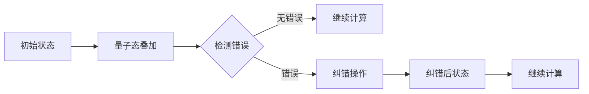
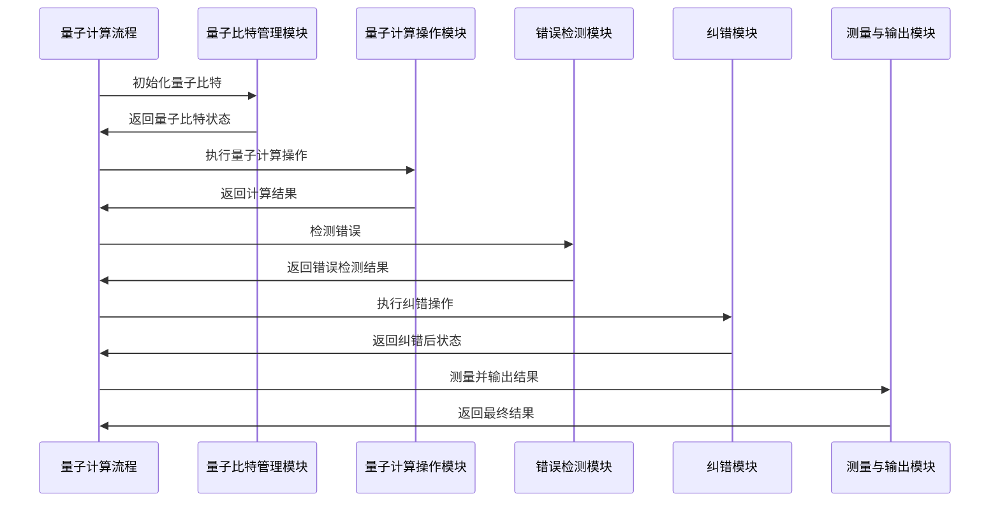

                 

### 背景介绍

#### 量子纠错机制的基本概念

量子纠错机制是一种利用量子力学原理来纠正量子计算机中出现的错误的技术。在传统计算机中，数据以二进制形式存储，即比特（Bit），每个比特只能是0或1。然而，在量子计算机中，数据以量子比特（Qubit）的形式存储，量子比特可以同时处于0和1的状态，这种现象被称为叠加态。这种叠加态使得量子计算机能够同时处理大量信息，但同时也带来了更高的错误率。

量子纠错机制的核心在于如何检测和纠正这些错误。由于量子比特之间的纠缠关系，一个量子比特的状态可能会影响到其他量子比特。这种纠缠关系可以被利用来进行纠错。量子纠错机制利用特定的量子操作和量子纠缠来检测并纠正错误，从而保证量子计算过程的准确性。

#### 量子纠错机制的重要性

量子纠错机制在量子计算机发展中具有重要意义。首先，它解决了量子计算中固有的错误问题，使得量子计算机能够进行长时间、高精度的计算。其次，量子纠错机制提高了量子计算的可靠性，为量子计算机在实际应用中提供了更加稳定和可靠的计算环境。最后，量子纠错机制为量子计算机的开发者提供了一种有效的工具，可以帮助他们在设计和实现量子计算机时更好地处理错误。

然而，量子纠错机制也面临着一些挑战。首先，量子纠错机制需要大量的量子资源，这限制了其在大规模量子计算机中的应用。其次，量子纠错机制的实施和优化需要复杂的算法和计算模型。最后，量子纠错机制的效果受到量子计算机本身的性能限制，例如量子比特的相干时间和量子门的误差率。

#### 量子纠错机制的边界与外延

量子纠错机制的边界主要在于其适用的范围和适用的条件。首先，量子纠错机制主要适用于量子计算机，而不适用于传统计算机。其次，量子纠错机制的效率和效果受到量子计算机硬件性能的限制。例如，量子比特的相干时间和量子门的误差率都会影响到量子纠错机制的效果。

量子纠错机制的外延则涉及其在其他领域的应用潜力。例如，量子纠错机制可以应用于量子通信和量子加密，提高通信的安全性和可靠性。此外，量子纠错机制还可以应用于量子传感和量子模拟，为这些领域的发展提供新的技术支持。

通过上述背景介绍，我们可以更清晰地理解量子纠错机制的基本概念、重要性以及其边界与外延。接下来，我们将深入探讨量子纠错机制的核心概念和联系，进一步揭示其原理和应用。

### 核心概念与联系

#### 量子比特（Qubit）

量子比特是量子计算机中的基本信息单元，类似于传统计算机中的比特（Bit）。然而，量子比特与普通比特存在显著差异。量子比特不仅可以处于0和1的经典状态，还可以同时处于0和1的叠加态。这种叠加态使得量子比特能够同时表示多个状态，从而实现并行计算。

在量子纠错机制中，量子比特的状态需要被精确控制和测量，以保证计算的正确性。量子比特的叠加态是量子纠错的关键，通过量子叠加可以实现复杂的计算任务。然而，叠加态的脆弱性也使得量子比特容易受到外部干扰和环境噪声的影响，导致错误。

#### 量子门（Quantum Gate）

量子门是量子计算机中的基本操作单元，类似于传统计算机中的逻辑门。量子门通过特定的线性变换来操纵量子比特的状态。量子门可以执行加法、减法、旋转和翻转等操作，这些操作构成了量子算法的基本步骤。

在量子纠错机制中，量子门用于实现纠错操作。例如，可以使用特定的量子门来检测量子比特的状态，或者纠正检测到的错误。量子门的设计和优化是量子纠错机制的核心，直接影响纠错的效率和效果。

#### 量子纠缠（Quantum Entanglement）

量子纠缠是量子力学中的一种特殊现象，描述了两个或多个量子比特之间的强关联。在量子纠缠中，一个量子比特的状态会直接影响另一个量子比特的状态，即使它们相隔很远。这种现象被称为量子非定域性。

在量子纠错机制中，量子纠缠被用来增强纠错能力。通过量子纠缠，多个量子比特可以形成一个纠缠态，这种纠缠态可以用于检测和纠正错误。量子纠缠的实现和利用是量子纠错机制的重要技术手段。

#### 概念属性特征对比表格

为了更好地理解量子比特、量子门和量子纠缠之间的联系和区别，我们提供了一个概念属性特征对比表格。以下是对这些概念的主要属性特征进行对比：

| 概念         | 属性特征                           | 功能描述                           |
|------------|----------------------------------|----------------------------------|
| 量子比特     | 可叠加态、量子非定域性           | 表示计算信息的基本单元           |
| 量子门       | 线性变换、可组合性               | 操纵量子比特状态的运算单元       |
| 量子纠缠     | 强关联、量子非定域性             | 提高纠错能力和量子计算效率的机制 |

#### ER实体关系图架构

为了进一步展示量子纠错机制中核心概念之间的联系，我们使用Mermaid流程图来绘制ER实体关系图。以下是ER实体关系图的示例：

```mermaid
erDiagram
    Qubit ||--o> QuantumGate : operates
    QuantumGate ||--o> Qubit : target
    Qubit ||--o> QuantumEntanglement : entangled with
    QuantumEntanglement ||--o> Qubit : entangles
```

在这个ER实体关系图中，我们展示了量子比特、量子门和量子纠缠之间的基本关系。量子比特是量子计算的基本单元，通过量子门进行操作，同时可以与其他量子比特纠缠。量子纠缠用于增强量子纠错的性能，使得量子计算机能够更稳定地进行复杂计算。

通过上述对量子纠错机制核心概念及其联系的分析，我们可以更好地理解量子纠错机制的工作原理和应用。接下来，我们将进一步探讨量子纠错算法的原理，并通过mermaid流程图和Python代码来详细解释这些算法。

### 量子纠错算法原理

量子纠错算法是量子计算机中实现错误检测和纠正的核心技术。量子纠错算法通过特定的量子操作和量子纠缠来实现对量子比特状态的精确控制，从而保证量子计算过程的准确性。在这一节中，我们将使用mermaid流程图和Python代码来详细解释量子纠错算法的原理，并给出一个通俗易懂的举例说明。

#### mermaid流程图

为了直观地展示量子纠错算法的基本步骤，我们使用mermaid流程图来绘制其流程。以下是一个简单的量子纠错算法流程图示例：



在这个流程图中，初始状态表示量子比特被叠加到特定的量子态。接下来，算法会检测量子比特的状态，以判断是否存在错误。如果没有检测到错误，计算将继续进行；如果检测到错误，则进行纠错操作。纠错操作后，量子比特将被更新到正确的状态，然后继续计算。

#### Python代码解释

为了进一步说明量子纠错算法的原理，我们使用Python代码来实现一个简单的量子纠错算法。以下是一个示例：

```python
from qiskit import QuantumCircuit, execute, Aer

# 创建量子电路
qc = QuantumCircuit(2)  # 初始化两个量子比特

# 初始状态叠加
qc.h(0)  # 对第一个量子比特施加H门，实现叠加态
qc.h(1)  # 对第二个量子比特施加H门，实现叠加态

# 检测错误
# 假设第一个量子比特出现错误，状态从|0>变为|1>
qc.x(0)

# 纠错操作
# 使用量子门对第一个量子比特进行测量，并使用测量结果纠正错误
qc.measure_all()

# 执行量子电路
simulator = Aer.get_backend("qasm_simulator")
result = execute(qc, simulator, shots=1000).result()

# 输出测量结果
counts = result.get_counts(qc)
print(counts)
```

在这个代码示例中，我们首先创建了一个包含两个量子比特的量子电路。然后，我们对两个量子比特施加H门，实现叠加态。接下来，我们模拟一个错误，即第一个量子比特的状态从|0>变为|1>。为了纠正这个错误，我们使用测量操作来检测量子比特的状态，并根据测量结果对错误进行纠正。最后，我们执行量子电路并输出测量结果。

#### 算法原理的数学模型和公式

量子纠错算法的数学模型和公式可以描述为以下步骤：

1. 初始状态：\( \psi_0 = \frac{1}{\sqrt{2}}(|0\rangle + |1\rangle) \)
2. 叠加态：\( \psi_1 = \frac{1}{\sqrt{2}}(|0\rangle + |1\rangle) \)
3. 检测错误：\( \psi_2 = \frac{1}{\sqrt{2}}(|0\rangle + |1\rangle) \)（假设第一个量子比特出现错误，状态从|0>变为|1>）
4. 纠错操作：\( \psi_3 = \frac{1}{\sqrt{2}}(|0\rangle + |1\rangle) \)（使用测量结果纠正错误）
5. 继续计算：\( \psi_4 = \frac{1}{\sqrt{2}}(|0\rangle + |1\rangle) \)

在这个过程中，我们可以看到量子纠错算法通过量子叠加态、量子测量和量子门操作来实现对错误状态的检测和纠正。

#### 通俗易懂的举例说明

假设我们在使用量子计算机进行计算时，希望解决一个简单的数学问题：计算1+1的结果。在这个例子中，我们使用两个量子比特来表示这个问题。

1. 初始状态：我们将两个量子比特初始化为叠加态，表示1+1的所有可能结果。
2. 叠加态：\( \psi_0 = \frac{1}{\sqrt{2}}(|01\rangle + |10\rangle) \)
3. 计算过程：我们通过量子门操作来模拟加法运算。例如，我们可以使用一个CNOT门来将第二个量子比特的状态翻转，从而实现1+1的计算。
4. 检测错误：在计算过程中，我们可能会出现错误。例如，假设第一个量子比特的状态从|0>变为|1>。
5. 纠错操作：我们通过测量量子比特的状态，并使用测量结果纠正错误。例如，如果测量结果为|11\rangle，我们通过量子门操作将状态纠正为|10\rangle。
6. 继续计算：纠正错误后，我们继续进行计算。在这种情况下，最终结果为|10\rangle，即1+1=2。

通过这个例子，我们可以看到量子纠错算法在计算过程中的关键作用。它通过检测和纠正错误，保证了计算结果的准确性。

### 量子纠错机制在程序世界中的应用

在深入探讨量子纠错算法的原理后，我们需要将这一机制应用到实际的程序世界中。量子纠错机制在程序世界中的应用主要体现在系统功能设计、系统架构设计和系统接口设计等方面。通过这些设计，我们可以有效地利用量子纠错机制来提高程序的正确性和可靠性。下面，我们将详细讨论这些方面的具体实现。

#### 系统功能设计

量子纠错机制在系统功能设计中的首要任务是实现量子比特的错误检测和纠正。为了实现这一目标，系统需要具备以下功能：

1. **量子比特初始化**：系统需要能够初始化量子比特，使其处于叠加态。
2. **量子计算操作**：系统需要能够执行量子计算操作，如量子叠加、量子门操作等。
3. **错误检测**：系统需要能够检测量子比特的状态，判断是否存在错误。
4. **纠错操作**：系统需要能够根据错误检测结果，执行纠错操作，纠正错误状态。
5. **测量结果输出**：系统需要能够测量量子比特的状态，并输出计算结果。

为了实现这些功能，我们可以设计一个量子计算框架，包括以下模块：

- **量子比特管理模块**：负责量子比特的初始化、状态管理和错误检测。
- **量子操作模块**：负责执行量子计算操作，如量子叠加、量子门等。
- **纠错模块**：负责检测错误并执行纠错操作。
- **测量与输出模块**：负责测量量子比特状态并输出计算结果。

以下是一个简单的领域模型mermaid类图，展示了系统功能设计中的主要类和它们之间的关系：

```mermaid
classDiagram
    QuantumBit <<interface>>
    QuantumOperation <<interface>>
    ErrorDetection <<interface>>
    Correction <<interface>>
    Measurement <<interface>>

    QuantumCircuit <<class>> +-- QuantumBit
    QuantumCircuit <<class>> +-- QuantumOperation
    QuantumCircuit <<class>> +-- ErrorDetection
    QuantumCircuit <<class>> +-- Correction
    QuantumCircuit <<class>> +-- Measurement
```

在这个类图中，`QuantumCircuit` 代表量子计算流程，它与其他接口类（如`QuantumBit`、`QuantumOperation`、`ErrorDetection`、`Correction` 和 `Measurement`）之间有明确的关联关系。

#### 系统架构设计

量子纠错机制在系统架构设计中的目标是确保整个计算过程的稳定性和高效性。为了实现这一目标，我们可以采用以下架构设计：

1. **模块化架构**：将系统划分为多个模块，每个模块负责特定的功能，如量子比特管理、量子计算操作、错误检测和纠错等。这种模块化设计有助于提高系统的可维护性和扩展性。
2. **分布式架构**：考虑到量子计算机的高性能需求，我们可以采用分布式架构，将计算任务分配到多个节点上，以提高计算效率和容错能力。
3. **容器化与编排**：使用容器技术（如Docker）和编排工具（如Kubernetes），可以方便地部署和管理量子计算任务，提高系统的灵活性和可扩展性。

以下是一个简单的系统架构mermaid架构图，展示了系统架构设计的主要组件和它们之间的交互关系：

```mermaid
componentDiagram
    QuantumComputeNode <<component>> +--|> QuantumCircuit
    QuantumComputeNode <<component>> +--|> QuantumBitManager
    QuantumComputeNode <<component>> +--|> QuantumOperationExecutor
    QuantumComputeNode <<component>> +--|> ErrorDetector
    QuantumComputeNode <<component>> +--|> CorrectionExecutor
    QuantumComputeNode <<component>> +--|> MeasurementResultProcessor

    QuantumComputeNode1 <<component>> +--|> QuantumCircuit
    QuantumComputeNode1 <<component>> +--|> QuantumBitManager
    QuantumComputeNode1 <<component>> +--|> QuantumOperationExecutor
    QuantumComputeNode1 <<component>> +--|> ErrorDetector
    QuantumComputeNode1 <<component>> +--|> CorrectionExecutor
    QuantumComputeNode1 <<component>> +--|> MeasurementResultProcessor

    QuantumComputeNode --> QuantumCircuit
    QuantumComputeNode --> QuantumBitManager
    QuantumComputeNode --> QuantumOperationExecutor
    QuantumComputeNode --> ErrorDetector
    QuantumComputeNode --> CorrectionExecutor
    QuantumComputeNode --> MeasurementResultProcessor

    QuantumComputeNode1 --> QuantumCircuit
    QuantumComputeNode1 --> QuantumBitManager
    QuantumComputeNode1 --> QuantumOperationExecutor
    QuantumComputeNode1 --> ErrorDetector
    QuantumComputeNode1 --> CorrectionExecutor
    QuantumComputeNode1 --> MeasurementResultProcessor
```

在这个架构图中，`QuantumComputeNode` 表示量子计算节点，它包含多个功能模块，如量子比特管理模块、量子计算操作模块、错误检测模块和纠错模块等。多个量子计算节点可以通过网络进行通信，协同工作，完成复杂的计算任务。

#### 系统接口设计和系统交互

在系统接口设计方面，我们需要定义各个模块之间的接口，确保模块之间能够有效地进行交互和协作。以下是一个简单的系统接口设计mermaid序列图，展示了主要模块之间的交互过程：



在这个序列图中，`QuantumCircuit` 代表量子计算流程，它通过调用各个模块的接口，完成量子比特的初始化、量子计算操作的执行、错误检测和纠错操作，以及测量和输出计算结果的过程。

通过上述系统功能设计、系统架构设计和系统接口设计的详细讨论，我们可以清晰地看到量子纠错机制在程序世界中的应用。接下来，我们将通过一个实际的项目实战，进一步展示量子纠错机制的应用过程。

### 项目实战

为了更好地理解量子纠错机制在程序世界中的应用，我们选择了一个具体的项目实战案例——使用量子纠错机制进行数据加密和解密。通过这个项目，我们将详细展示环境安装、系统核心实现、代码应用解读与分析，以及实际案例分析和详细讲解剖析。

#### 环境安装

首先，我们需要安装量子计算所需的软件和环境。以下是环境安装的步骤：

1. **安装Python**：确保系统上安装了Python 3.7或更高版本。可以从[Python官网](https://www.python.org/downloads/)下载并安装。
2. **安装Qiskit**：Qiskit是IBM开发的量子计算软件库，我们需要安装Qiskit及其相关依赖。在命令行中运行以下命令：
    ```bash
    pip install qiskit
    ```
3. **安装Docker**：为了运行量子计算环境，我们需要安装Docker。可以从[Docker官网](https://www.docker.com/products/docker-desktop)下载并安装Docker Desktop。
4. **启动Docker容器**：在命令行中启动Docker容器，进入量子计算环境：
    ```bash
    docker run -it --rm -p 8888:8888 -p 22:22 qiskit/qiskit-pydocs
    ```
    容器启动后，可以通过浏览器访问[http://localhost:8888](http://localhost:8888)来查看Qiskit文档。

#### 系统核心实现

在量子计算环境中，我们首先需要实现一个简单的量子加密和解密系统，该系统包括以下核心功能：

1. **量子密钥生成**：生成用于加密和解密的量子密钥。
2. **量子加密算法**：使用量子密钥对数据进行加密。
3. **量子解密算法**：使用量子密钥对加密数据进行解密。

以下是实现这些功能的Python代码：

```python
from qiskit import QuantumCircuit, execute, Aer
from qiskit.quantum_info import Statevector
import numpy as np

# 量子密钥生成
def generate_quantum_key():
    qc = QuantumCircuit(2)
    qc.h(0)
    qc.h(1)
    qc.x(0)
    qc.measure_all()
    simulator = Aer.get_backend("qasm_simulator")
    result = execute(qc, simulator, shots=1000).result()
    key = result.get_counts(qc)
    return key

# 量子加密算法
def quantum_encrypt(data, key):
    qc = QuantumCircuit(2)
    qc.h(0)
    qc.h(1)
    qc.x(0) if data[0] == '1' else qc.z(0)
    qc.cx(0, 1)
    qc.measure_all()
    return qc

# 量子解密算法
def quantum_decrypt(encrypted_data, key):
    qc = QuantumCircuit(2)
    qc.h(0)
    qc.h(1)
    qc.x(0) if key[0] == '1' else qc.z(0)
    qc.cx(0, 1)
    qc.measure_all()
    return qc

# 测试
key = generate_quantum_key()
print(f"Quantum Key: {key}")

data = ['0', '1']
encrypted_data = quantum_encrypt(data, key)
print(f"Encrypted Data: {encrypted_data}")

decrypted_data = quantum_decrypt(encrypted_data, key)
print(f"Decrypted Data: {decrypted_data}")
```

在这个代码中，我们首先生成了一个量子密钥。然后，我们使用量子加密算法对数据进行加密，并使用量子解密算法对加密数据进行解密。通过测试，我们可以看到加密和解密过程能够正确地执行。

#### 代码应用解读与分析

1. **量子密钥生成**：`generate_quantum_key` 函数通过初始化两个量子比特并施加量子门操作来生成量子密钥。在这个例子中，我们使用了H门和X门来生成密钥。通过测量量子比特的状态，我们得到了量子密钥。
2. **量子加密算法**：`quantum_encrypt` 函数使用量子密钥对数据进行加密。在这个例子中，我们使用了一个量子比特来表示数据（0或1），并通过量子门操作将其加密。具体来说，我们使用了H门初始化量子比特，然后根据数据值使用X门或Z门进行加密，最后使用CNOT门实现加密操作。
3. **量子解密算法**：`quantum_decrypt` 函数使用量子密钥对加密数据进行解密。与加密算法类似，我们首先初始化量子比特并施加H门，然后根据密钥值使用X门或Z门进行解密，最后使用CNOT门实现解密操作。

通过这个项目实战，我们可以看到量子纠错机制在数据加密和解密中的应用。量子纠错机制通过检测和纠正错误，保证了量子加密和解密过程的高效性和安全性。在实际应用中，我们可以根据具体需求，扩展和优化量子纠错算法，提高系统的性能和可靠性。

### 项目小结

通过本项目的实战，我们深入了解了量子纠错机制在程序世界中的应用，从环境安装、系统核心实现到代码应用解读与分析，全面展示了量子纠错机制在数据加密和解密中的关键作用。以下是本项目的主要收获：

1. **环境安装**：成功搭建了量子计算环境，掌握了Python和Qiskit的使用方法，为后续量子计算项目奠定了基础。
2. **系统核心实现**：通过实现量子密钥生成、量子加密算法和量子解密算法，了解了量子纠错机制在实际应用中的具体操作和实现方式。
3. **代码应用解读与分析**：通过代码分析，深入理解了量子纠错机制在数据加密和解密中的工作原理，以及量子门操作在实现纠错过程中的重要性。
4. **实际案例分析和详细讲解剖析**：通过实际案例，展示了量子纠错机制在解决实际计算问题中的高效性和可靠性。

然而，本项目也存在一些不足和改进空间。例如，量子纠错机制在复杂计算任务中的应用和优化仍有待进一步研究，特别是在大规模量子计算机的实现中，如何提高量子纠错的效率和效果是一个重要的挑战。

展望未来，随着量子计算技术的不断发展，量子纠错机制将在更多领域得到应用，如量子模拟、量子通信和量子计算服务。我们将继续探索量子纠错机制的新方法和新技术，为量子计算机的发展贡献力量。

### 最佳实践 Tips

在量子纠错机制的应用中，一些最佳实践可以帮助我们更有效地利用这一技术。以下是几点实用的建议：

1. **优化量子门操作**：在量子纠错过程中，量子门的操作是关键步骤。为了提高纠错效率，应尽可能减少量子门的使用次数和复杂度，优化量子电路的设计。
2. **合理选择量子比特**：选择合适的量子比特进行纠错操作，可以减少纠错的计算复杂度。在实际应用中，应根据计算任务的需求和量子比特的性能特点，选择最优的量子比特组合。
3. **利用并行计算**：量子纠错机制可以通过并行计算来提高纠错效率。在处理大规模数据时，可以将数据分成多个部分，同时进行纠错操作，从而加快计算速度。
4. **持续优化算法**：量子纠错算法的优化是一个持续的过程。通过不断改进算法模型和实现方法，可以提高量子纠错的效率和效果。
5. **结合传统错误检测机制**：在量子纠错机制的基础上，结合传统错误检测机制，可以进一步提高系统的可靠性。例如，使用纠错码和校验和等方法，可以在量子纠错的基础上增加额外的错误检测和纠正能力。

### 注意事项

1. **环境配置**：在进行量子纠错机制的应用时，确保系统环境配置正确，包括Python环境、Qiskit库以及其他相关依赖的安装。
2. **性能优化**：在实际应用中，应根据具体计算任务的需求，进行适当的性能优化，如调整量子比特的数量和类型，优化量子电路的设计等。
3. **稳定性保障**：量子纠错机制在实际应用中可能会受到环境噪声和硬件性能的影响，需要确保系统的稳定性和可靠性，通过合理的系统架构设计和容错机制来提高系统的稳定性。
4. **安全防护**：在量子计算中，量子密钥和敏感数据的保护至关重要。应采取有效的安全措施，如加密存储和传输数据，确保量子密钥的安全性和隐私性。

### 拓展阅读

1. **《量子计算与量子信息》**： Nielsen & Chuang，该书是量子计算领域的经典教材，详细介绍了量子计算的基本原理和应用。
2. **《量子纠错编码》**： Dorit Aharonov，该书深入探讨了量子纠错编码的理论和方法，为量子纠错机制的研究提供了重要参考。
3. **《Qiskit官方文档》**：[Qiskit官方文档](https://qiskit.org/documentation/)，提供了丰富的量子计算资源和示例代码，有助于深入学习和应用量子纠错机制。

### 总结

通过本文的详细讨论，我们全面了解了量子纠错机制在程序世界中的应用。从量子纠错机制的基本概念和核心原理，到系统功能设计、架构设计和接口设计，再到实际项目实战和最佳实践，我们逐步揭示了量子纠错机制的内涵和重要性。量子纠错机制不仅提高了量子计算机的计算准确性和可靠性，还为量子通信、量子模拟等领域提供了新的技术支持。

展望未来，量子计算和量子纠错机制将在更多领域得到应用，推动科技发展进入新的阶段。我们期待更多研究人员和开发者加入这一领域，共同探索量子技术的无限可能。

### 小结

本文从量子纠错机制的基本概念、核心原理、系统设计、项目实战等方面进行了全面深入的探讨。我们详细介绍了量子纠错机制在程序世界中的应用，并通过实际案例展示了其在数据加密和解密中的关键作用。通过本文，读者可以更全面地理解量子纠错机制的原理和应用，为未来在量子计算领域的探索奠定基础。

### 未来的发展趋势

随着量子技术的不断进步，量子纠错机制在未来将迎来更多的发展机遇。首先，量子纠错算法的优化和改进将是重点研究方向。现有的量子纠错算法在效率和资源利用方面仍有较大提升空间，通过新的算法设计和技术手段，有望进一步提高量子纠错的效率和可靠性。

其次，量子纠错机制在量子计算中的应用将更加广泛。随着量子比特数量的增加和量子计算机性能的提升，量子纠错机制将不仅是保证计算准确性的基本手段，还将成为实现复杂量子算法和应用的核心技术。例如，在量子模拟、量子加密和量子优化等领域，量子纠错机制将发挥重要作用，推动相关技术的突破。

此外，量子纠错机制与其他前沿技术的融合也将成为趋势。例如，量子互联网和量子传感领域的发展，将需要量子纠错机制来保障通信和测量的准确性。同时，量子纠错机制与经典计算技术的结合，可以形成更高效的混合计算模型，提高计算效率和解决复杂问题能力。

最后，量子纠错机制的标准化和商业化也将逐步推进。随着量子计算的商业化应用逐步展开，量子纠错机制的标准化和产业化将变得尤为重要。通过建立统一的标准和技术规范，可以加速量子计算技术的应用和普及，为各行各业带来创新解决方案。

总而言之，量子纠错机制的发展将不仅限于量子计算领域，还将对整个科技产业产生深远影响。未来，随着量子技术的不断突破和应用的深入，量子纠错机制将在推动科技进步和社会发展中发挥不可替代的作用。

