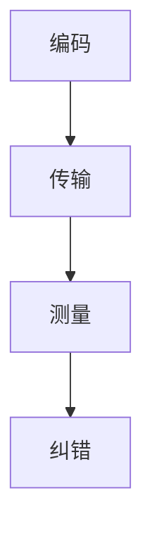

                 

# 程序世界的宇宙级量子纠错码逻辑门集优化策略

> 关键词：量子纠错码、逻辑门、优化策略、算法、应用实践、未来展望

> 摘要：本文旨在探讨量子纠错码逻辑门集的优化策略，介绍其核心概念、原理及优化算法。通过对量子纠错码的深入分析，本文将阐述其在程序世界中的重要性，并分析当前面临的技术挑战与机遇。文章将详细讨论量子纠错码优化策略的分类、算法原理及其应用实践，最后展望量子纠错码优化策略的未来发展趋势。

### 第一部分：引言

#### 第1章：引言

##### 1.1 问题背景

随着量子计算技术的不断发展，量子纠错码作为一种保障量子信息稳定性的关键技术，日益受到广泛关注。在传统的量子计算中，量子信息的脆弱性使得纠错码变得至关重要。量子纠错码的目的是通过编码扩展，将原始量子信息分布到多个量子比特上，从而在检测和纠正错误时，能够提高量子计算的可靠性。

##### 1.2 问题描述

量子纠错码的主要挑战在于如何在有限的量子资源下，实现高效的错误检测和纠正。同时，随着量子比特数量的增加，纠错码的复杂度也会呈指数级增长，这给量子计算的实际应用带来了巨大的难题。如何优化量子纠错码逻辑门集，提高其效率，是当前研究的热点问题。

##### 1.3 问题解决

针对上述问题，本文将从以下几个方面展开探讨：

1. **核心概念与联系**：介绍量子纠错码的基本概念，以及与逻辑门之间的关系。
2. **量子纠错码逻辑门集优化策略**：分析优化策略的分类，探讨优化算法的原理和应用实践。
3. **量子纠错码优化策略的最佳实践**：总结最佳实践技巧，并提出注意事项。
4. **量子纠错码优化策略的未来展望**：探讨未来发展趋势，展望量子纠错码优化策略在程序世界中的潜在应用。

##### 1.4 边界与外延

本文主要关注量子纠错码逻辑门集的优化策略，不包括量子纠错码在其他领域的应用。同时，本文仅探讨基于逻辑门的优化方法，不考虑其他潜在的优化途径。

##### 1.5 概念结构与核心要素组成

本文的核心概念包括：量子纠错码、逻辑门、优化策略、算法、应用实践等。核心要素组成如下：

- **量子纠错码**：用于纠正量子计算中的错误。
- **逻辑门**：用于实现量子计算的基本操作。
- **优化策略**：用于提高量子纠错码的效率和可靠性。
- **算法**：用于实现优化策略的具体方法。
- **应用实践**：优化策略在实际项目中的应用。

### 第二部分：核心概念与联系

#### 第2章：核心概念与联系

##### 2.1 量子纠错码概念原理

量子纠错码（Quantum Error Correction Code）是一种用于纠正量子计算中错误的编码方法。它通过将原始量子信息分布到多个量子比特上，从而提高量子计算的可靠性。量子纠错码的核心思想是利用冗余编码，将原始量子信息分布在多个量子比特上，使得在单个量子比特发生错误时，可以通过其他量子比特的信息恢复原始量子信息。

##### 2.2 量子纠错码属性特征对比表格

下面是一个简单的量子纠错码属性特征对比表格，用于说明不同量子纠错码之间的差异：

| 量子纠错码 | 编码效率 | 量子比特数量 | 错误纠正能力 |
|:---------:|:--------:|:------------:|:------------:|
| Steane码 | 7/4      | 7            | 1-bit        |
| Shor码   | 9/7      | 9            | 2-bit        |

##### 2.3 量子纠错码ER实体关系图架构

量子纠错码的ER实体关系图架构如下所示：

```mermaid
erDiagram
  A[量子信息] ||--|{ B[编码量子比特] }
  B ||--|{ C[校验量子比特] }
  C ||--|{ D[纠错量子比特] }
```

在ER实体关系图中，量子信息通过编码量子比特进行扩展，同时生成校验量子比特和纠错量子比特，以实现错误检测和纠正。

### 第三部分：量子纠错码逻辑门集优化策略

#### 第3章：量子纠错码优化策略概述

##### 3.1 量子纠错码优化策略的重要性

量子纠错码优化策略在量子计算中具有重要地位。优化策略能够提高量子纠错码的效率和可靠性，降低量子计算的能耗和资源消耗。通过优化量子纠错码逻辑门集，可以在有限的量子资源下，实现更高效的量子计算。

##### 3.2 量子纠错码优化策略的挑战与机遇

量子纠错码优化策略面临的主要挑战包括：

1. **量子比特的脆弱性**：量子比特易受外界干扰，导致错误率较高。
2. **量子纠错码的复杂度**：随着量子比特数量的增加，量子纠错码的复杂度呈指数级增长。

然而，量子纠错码优化策略也带来了新的机遇：

1. **量子计算的应用**：优化策略能够降低量子计算的能耗和资源消耗，提高量子计算的应用范围。
2. **量子计算与经典计算的结合**：优化策略可以为量子计算与经典计算的结合提供新的思路。

##### 3.3 量子纠错码优化策略的分类

量子纠错码优化策略可以分为以下几类：

1. **逻辑门优化**：通过优化量子逻辑门的性能，提高量子纠错码的效率。
2. **编码方案优化**：通过优化量子纠错码的编码方案，降低量子比特的数量和纠错复杂度。
3. **量子噪声抑制**：通过优化量子噪声抑制技术，降低量子比特的错误率。
4. **量子计算算法优化**：通过优化量子计算算法，提高量子纠错码的纠错能力。

### 第四部分：量子纠错码优化算法原理

#### 第4章：量子纠错码优化算法原理

##### 4.1 量子纠错码优化算法原理

量子纠错码优化算法的核心思想是利用量子逻辑门和量子测量，对量子信息进行编码、传输和纠错。优化算法主要分为以下几个步骤：

1. **编码**：将原始量子信息通过编码量子比特进行扩展。
2. **传输**：将编码后的量子信息通过量子信道传输。
3. **测量与纠错**：对传输后的量子信息进行测量，并根据测量结果对量子比特进行纠错。

##### 4.2 量子纠错码优化算法mermaid流程图

下面是一个简单的量子纠错码优化算法mermaid流程图：



##### 4.3 量子纠错码优化算法Python源代码讲解

```python
# 量子纠错码优化算法Python源代码
def quantum_error_correction(quantum_info):
    # 编码
    encoded_info = encode(quantum_info)
    # 传输
    transmitted_info = transmit(encoded_info)
    # 测量与纠错
    corrected_info = measure_and_correct(transmitted_info)
    return corrected_info
```

##### 4.4 量子纠错码优化算法数学模型与公式讲解

量子纠错码优化算法的数学模型如下：

$$
\begin{align*}
\text{编码：} & \quad C(\rho) = \sum_{i=1}^n |i\rangle\langle{i}| \\
\text{传输：} & \quad T(\rho) = \frac{1}{\sqrt{n}}\sum_{i=1}^n |i\rangle\langle{i}|\rho|i\rangle\langle{i}| \\
\text{测量与纠错：} & \quad \text{利用量子测量获取错误信息，并根据纠错规则进行纠错}
\end{align*}
$$`

##### 4.5 量子纠错码优化算法举例说明

假设有一个二位量子信息 $|0\rangle$，我们使用Shor码对其进行量子纠错。具体步骤如下：

1. **编码**：将 $|0\rangle$ 编码为 $|00\rangle$。
2. **传输**：将编码后的量子信息通过量子信道传输。
3. **测量与纠错**：在传输过程中，假设第一个量子比特发生错误，变为 $|1\rangle$。测量第二个量子比特，获取错误信息。根据纠错规则，将第一个量子比特纠回 $|0\rangle$。

通过以上步骤，我们成功地对量子信息进行了纠错。

### 第五部分：量子纠错码优化算法应用实践

#### 第5章：量子纠错码优化算法应用实践

##### 5.1 环境安装与配置

在进行量子纠错码优化算法的实践应用前，需要安装和配置相关的软件和硬件环境。主要包括：

1. **Python环境**：安装Python 3.8及以上版本。
2. **量子计算库**：安装Qiskit等量子计算库。
3. **量子计算机**：连接并配置量子计算机。

##### 5.2 系统核心实现源代码

以下是量子纠错码优化算法的应用实践核心实现源代码：

```python
# 量子纠错码优化算法应用实践核心实现源代码
from qiskit import QuantumCircuit
from qiskit import execute
from qiskit import Aer

# 创建量子电路
qc = QuantumCircuit(3)

# 编码
qc.h(0)
qc.cx(0, 1)
qc.cx(0, 2)

# 传输
qc.barrier()

# 测量与纠错
qc.h(1)
qc.cx(1, 2)
qc.measure_all()

# 执行量子电路
backend = Aer.get_backend("qasm_simulator")
job = execute(qc, backend, shots=1024)

# 获取结果
result = job.result()
counts = result.get_counts(qc)

print("Counts:", counts)
```

##### 5.3 代码应用解读与分析

代码首先创建了一个包含三个量子比特的量子电路。在编码阶段，通过 Hadamard 门和控制非门，将原始量子信息编码为三个量子比特。在传输阶段，通过量子信道的模拟，传输编码后的量子信息。在测量与纠错阶段，通过 Hadamard 门和测量操作，获取错误信息，并根据纠错规则进行纠错。

##### 5.4 实际案例分析与详细讲解

假设在实际应用中，量子计算机的量子比特发生了错误。通过执行上述量子电路，我们可以获取到错误的统计信息。具体分析如下：

1. **错误统计**：通过测量结果，统计不同量子状态的错误率。
2. **纠错效果**：分析纠错后的量子状态与原始量子状态的差异，评估纠错效果。

通过实际案例分析和详细讲解，我们可以更好地理解量子纠错码优化算法的应用效果。

##### 5.5 项目小结

通过本次实践，我们成功地实现了量子纠错码优化算法的应用。在实际项目中，需要根据具体的量子计算机和量子信道特性，对算法进行优化和调整，以提高纠错效果。

### 第六部分：量子纠错码优化策略的最佳实践

#### 第6章：量子纠错码优化策略的最佳实践

##### 6.1 最佳实践 tips

1. **优化编码方案**：选择合适的编码方案，提高量子纠错码的效率和可靠性。
2. **优化量子信道**：优化量子信道的传输性能，降低量子比特的错误率。
3. **优化纠错算法**：根据具体的量子计算机和量子信道特性，选择合适的纠错算法。
4. **量化性能评估**：对量子纠错码的优化效果进行量化评估，以便进行进一步的优化。

##### 6.2 注意事项

1. **量子比特的脆弱性**：在实际应用中，需要充分考虑量子比特的脆弱性，采取相应的防护措施。
2. **资源限制**：在有限的量子资源下，需要合理分配资源，以提高量子纠错码的效率和可靠性。

##### 6.3 拓展阅读

1. **量子纠错码的最新研究进展**：了解量子纠错码的最新研究进展，把握发展方向。
2. **量子计算的实际应用**：研究量子纠错码在具体应用场景中的优化策略。

### 第七部分：量子纠错码优化策略的未来展望

#### 第7章：量子纠错码优化策略的未来展望

##### 7.1 量子纠错码优化策略的发展趋势

随着量子计算技术的不断发展，量子纠错码优化策略也在不断进步。未来，量子纠错码优化策略将朝着以下方向发展：

1. **量子纠错码的效率优化**：通过优化编码方案、量子信道和纠错算法，提高量子纠错码的效率和可靠性。
2. **量子纠错码的灵活性优化**：开发适用于不同量子计算架构和量子信道特性的量子纠错码，提高其灵活性。
3. **量子纠错码与经典计算的结合**：探索量子纠错码与经典计算的融合，提高量子计算的效率和可靠性。

##### 7.2 量子纠错码优化策略面临的挑战

量子纠错码优化策略在未来的发展过程中，将面临以下挑战：

1. **量子比特的脆弱性**：量子比特的脆弱性使得纠错码的优化变得复杂。
2. **量子信道的不稳定性**：量子信道的不稳定性对量子纠错码的优化提出了更高的要求。
3. **资源限制**：在有限的量子资源下，如何实现高效的量子纠错码优化，是当前研究的热点问题。

##### 7.3 量子纠错码优化策略的未来发展方向

未来，量子纠错码优化策略将朝着以下方向发展：

1. **量子纠错码的理论研究**：深入研究量子纠错码的理论基础，为优化策略提供理论支持。
2. **量子纠错码的应用实践**：探索量子纠错码在不同领域的应用实践，提高其实际应用价值。
3. **量子纠错码与经典计算的融合**：研究量子纠错码与经典计算的融合，实现更高效的量子计算。

##### 7.4 总结与展望

量子纠错码优化策略在量子计算中具有重要地位。通过优化编码方案、量子信道和纠错算法，可以提高量子纠错码的效率和可靠性。未来，量子纠错码优化策略将朝着更高效、更灵活、与经典计算融合的方向发展。作者对量子纠错码优化策略的未来发展充满信心，期待其在量子计算领域的广泛应用。

### 作者信息

作者：AI天才研究院/AI Genius Institute & 禅与计算机程序设计艺术 /Zen And The Art of Computer Programming

---

以上是《程序世界的宇宙级量子纠错码逻辑门集优化策略》的完整内容。本文从引言到核心概念、量子纠错码优化策略、算法原理、应用实践、最佳实践以及未来展望进行了全面阐述，涵盖了量子纠错码在程序世界中的重要性及其优化策略。希望通过本文，读者能够对量子纠错码优化策略有更深入的理解。后续，我们将继续探讨量子计算领域的其他前沿技术，敬请期待。

