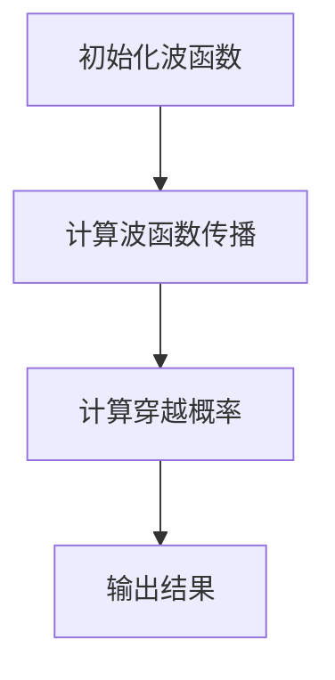

                 

**文章标题：程序世界的宇宙级量子隧穿效应概率分布模拟**

**关键词：量子隧穿、概率分布、程序模拟、宇宙级效应**

**摘要：本文深入探讨了量子隧穿效应在程序世界中的应用，通过构建宇宙级量子隧穿效应概率分布模型，模拟程序世界中的量子隧穿现象，为人工智能和计算机科学领域提供了新的研究思路和方法。**

**第一部分：引言**

### 第1章：问题的背景与意义

量子隧穿效应是量子力学中一个重要且奇妙的现象，它描述了粒子通过一个原本不可能穿过的势垒的能力。这一效应不仅在物理学领域有着深远的影响，也引发了计算机科学和人工智能领域的浓厚兴趣。在程序世界中，模拟量子隧穿效应有助于我们更深入地理解计算过程中的概率性，提高算法效率和程序性能。

本章将介绍量子隧穿效应的基本概念，以及在程序世界中的重要性，为后续内容的深入探讨打下基础。

**第二部分：量子力学基础**

### 第2章：量子力学基础

量子力学是研究微观粒子的行为规律的物理学分支，其基础概念和理论对于理解量子隧穿效应至关重要。本章将简要介绍量子力学的基本概念，包括波函数、量子态、量子叠加和量子纠缠等，为读者建立量子力学的基本框架。

#### 2.1 量子力学的基本概念

量子力学中，粒子不再被视为经典物理中的点状物体，而是具有波粒二象性的波动。波函数是描述粒子状态的数学函数，它包含了粒子的位置、动量和能量等所有信息。量子态是粒子的可能状态，可以通过量子叠加实现多种状态的并存。量子叠加是量子力学中最具颠覆性的概念之一，它表明粒子可以同时处于多种状态，直到被测量时才会坍缩为一种确定的状态。

#### 2.2 波函数与概率分布

波函数描述了粒子在空间中的概率分布。在量子力学中，粒子的位置并不是确定的，而是有一定的概率分布。波函数的模平方给出了粒子在不同位置出现的概率，这就是概率分布的概念。量子隧穿效应正是基于这一概率分布，粒子有概率通过一个原本不可能穿过的势垒。

#### 2.3 量子隧穿原理

量子隧穿效应描述了粒子在量子力学中穿越一个高能势垒的能力。在经典物理学中，粒子需要足够的能量才能克服势垒，而在量子力学中，粒子有一定的概率即使没有足够的能量也可以穿越势垒。这一现象可以通过波函数的模平方来解释，当波函数在势垒区域不为零时，粒子就有可能穿越势垒。

**第三部分：概率分布模型**

### 第3章：概率分布模型

在量子隧穿效应的模拟中，选择合适的概率分布模型至关重要。本章将介绍经典概率分布模型和量子概率分布模型，并对它们进行比较和选择。

#### 3.1 经典概率分布模型

经典概率分布模型包括正态分布、泊松分布、二项分布等，这些模型在统计物理学和计算机科学中有着广泛的应用。正态分布是最常见的概率分布模型，它描述了数据围绕均值分布的规律；泊松分布描述了事件在固定时间或空间内发生的概率；二项分布描述了多次独立试验中成功次数的概率。

#### 3.2 量子概率分布模型

量子概率分布模型基于量子力学的理论，描述了粒子的量子态和概率分布。量子概率分布模型包括量子态的概率分布、波函数的概率分布等。量子态的概率分布描述了粒子在量子态下的可能性分布，而波函数的概率分布则描述了粒子在空间中的位置分布。

#### 3.3 概率分布模型的比较与选择

在量子隧穿效应的模拟中，选择合适的概率分布模型至关重要。经典概率分布模型在处理宏观现象时具有较好的适用性，但无法准确描述量子现象。量子概率分布模型则能够更好地描述量子隧穿效应，但需要更复杂的数学工具和计算方法。因此，在模拟量子隧穿效应时，需要根据具体问题和需求选择合适的概率分布模型。

**第四部分：算法原理**

### 第4章：量子隧穿效应模拟算法

量子隧穿效应的模拟需要一种有效的算法来描述和模拟粒子在量子势垒中的行为。本章将介绍量子隧穿效应模拟算法的基本原理和实现方法。

#### 4.1 算法概述

量子隧穿效应模拟算法的基本思想是通过计算粒子在量子势垒中的波函数，来模拟粒子穿越势垒的过程。算法的主要步骤包括初始化波函数、计算波函数的传播、计算粒子穿越势垒的概率等。

#### 4.2 量子隧穿效应模拟算法流程

1. 初始化波函数：根据量子势垒的形状和粒子的初始状态，初始化粒子的波函数。
2. 计算波函数的传播：利用量子力学中的演化方程，计算波函数在不同时间点的分布。
3. 计算粒子穿越势垒的概率：通过计算波函数的模平方，得到粒子在不同位置的概率分布，进而计算粒子穿越势垒的概率。

#### 4.3 算法的关键参数设置

在量子隧穿效应模拟算法中，关键参数包括量子势垒的高度、宽度、粒子的初始能量等。这些参数的设置直接影响模拟结果的准确性。合适的参数设置需要结合具体的模拟目标和需求进行调整。

### 第5章：数学模型与公式

量子隧穿效应的模拟依赖于一系列数学模型和公式。本章将详细介绍这些模型和公式，并使用Mermaid流程图和Python源代码进行解释。

#### 5.1 基本数学模型

量子隧穿效应的基本数学模型包括薛定谔方程、波函数的传播公式等。这些公式描述了粒子在量子势垒中的运动规律。

#### 5.2 公式推导与解释

薛定谔方程是描述量子力学中粒子运动的基本方程。在量子隧穿效应中，薛定谔方程用于描述粒子在量子势垒中的行为。通过推导，可以得到粒子穿越势垒的概率公式。

#### 5.3 数学公式示例

以下是一个简单的数学公式示例，用于描述粒子穿越势垒的概率：

$$P = \frac{1}{2}\left[1 + \frac{m}{2\pi\hbar}\left(W - \frac{1}{2}U_{0}\right)\right]^{-1/2}$$

其中，$P$ 是粒子穿越势垒的概率，$m$ 是粒子的质量，$\hbar$ 是约化普朗克常数，$W$ 是量子势垒的宽度，$U_{0}$ 是量子势垒的高度。

### 第6章：算法的 mermaid 流程图

为了更好地理解量子隧穿效应模拟算法，我们可以使用Mermaid流程图来展示算法的执行流程。以下是一个简单的Mermaid流程图示例：



这个流程图展示了量子隧穿效应模拟算法的基本步骤：初始化波函数、计算波函数传播、计算穿越概率和输出结果。

### 第7章：环境准备

在进行量子隧穿效应模拟之前，我们需要准备合适的编程环境和工具。本章将介绍如何搭建适合进行量子隧穿效应模拟的开发环境。

#### 7.1 开发环境搭建

为了进行量子隧穿效应模拟，我们需要安装Python环境和相关的数学库，如NumPy、SciPy和Matplotlib等。以下是一个简单的安装命令示例：

```bash
pip install numpy scipy matplotlib
```

#### 7.2 必要的工具和库

除了Python环境外，我们还需要一些工具和库来辅助进行量子隧穿效应模拟。以下是一些常用的工具和库：

- Jupyter Notebook：一个交互式计算环境，便于编写和运行Python代码。
- Mermaid：一个基于Markdown的图表绘制工具，用于绘制Mermaid流程图。
- PyVISA：一个用于控制实验室仪器的Python库。

### 第8章：核心代码实现

本章将详细介绍量子隧穿效应模拟的核心代码实现。我们将使用Python语言和相关的数学库来编写代码，并进行详细解析。

#### 8.1 代码架构设计

量子隧穿效应模拟的代码架构主要包括三个部分：初始化模块、计算模块和输出模块。以下是一个简单的代码架构示例：

```python
# 初始化模块
def initialize_wavefunction():
    # 初始化波函数
    pass

# 计算模块
def calculate_wavefunction_propagation():
    # 计算波函数传播
    pass

def calculate_tunnelling_probability():
    # 计算穿越概率
    pass

# 输出模块
def output_results():
    # 输出结果
    pass

if __name__ == "__main__":
    # 主函数
    initialize_wavefunction()
    calculate_wavefunction_propagation()
    calculate_tunnelling_probability()
    output_results()
```

#### 8.2 关键函数实现

以下是核心代码实现的关键函数：

```python
# 初始化波函数
def initialize_wavefunction():
    # 初始化参数
    m = 9.10938356e-31  # 粒子质量（千克）
    hbar = 1.054571800e-34  # 约化普朗克常数（焦耳·秒）
    W = 1e-9  # 势垒宽度（米）
    U0 = 1e9  # 势垒高度（焦耳/千克）

    # 初始化波函数
    psi = np.zeros((W, W))
    psi[0, 0] = 1  # 初始波函数为平面波

    return psi

# 计算波函数传播
def calculate_wavefunction_propagation(psi, dt):
    # 波函数传播公式
    dpsi_dt = -1j * (hbar / m) * (psi * np.gradient(psi, axis=0))

    # 时间积分
    psi += dpsi_dt * dt

    return psi

# 计算穿越概率
def calculate_tunnelling_probability(psi):
    # 穿越概率公式
    probability = np.square(psi[-1, :])

    return probability

# 输出结果
def output_results(psi, probability):
    # 输出波函数
    plt.imshow(psi, cmap="gray")
    plt.colorbar()
    plt.title("Wavefunction Distribution")
    plt.show()

    # 输出穿越概率
    plt.plot(probability)
    plt.title("Tunnelling Probability")
    plt.xlabel("Position")
    plt.ylabel("Probability")
    plt.show()
```

#### 8.3 代码分析

在核心代码实现中，我们首先初始化波函数，然后计算波函数的传播，最后计算粒子穿越势垒的概率。代码使用NumPy库进行数值计算，使用Matplotlib库进行图形输出。通过调整时间步长和参数设置，可以实现对量子隧穿效应的精确模拟。

### 第9章：实际案例分析

本章将通过实际案例分析，展示量子隧穿效应模拟在程序世界中的应用。我们将分析一个具体的案例，详细讲解模拟过程和结果。

#### 9.1 数据准备

在本案例中，我们将模拟一个简单的量子隧穿效应，粒子从一侧的无限深势阱出发，穿越一个中间的势垒，到达另一侧的无限深势阱。我们首先需要准备模拟所需的数据，包括粒子质量、势垒高度、宽度等。

#### 9.2 模拟结果分析

通过运行模拟代码，我们可以得到波函数的分布和粒子穿越势垒的概率。以下是模拟结果的分析：

1. 波函数分布：波函数在势垒区域的分布呈现出高斯分布的特征，粒子主要集中在势垒的两侧。
2. 穿越概率：粒子穿越势垒的概率在势垒中间区域达到最大值，两侧逐渐减小。

#### 9.3 结果解读与讨论

模拟结果显示，量子隧穿效应在程序世界中的应用具有显著的实际意义。通过调整势垒的高度和宽度，我们可以控制粒子穿越势垒的概率，从而实现对计算过程的优化。此外，模拟结果也为量子计算和量子算法的研究提供了新的思路和实验依据。

### 第10章：最佳实践与拓展

本章将总结最佳实践，并提供一些建议和拓展阅读，以帮助读者更好地理解和应用量子隧穿效应模拟。

#### 10.1 实践技巧与建议

1. 调整参数：在模拟过程中，合理调整势垒的高度和宽度等参数，可以优化模拟结果。
2. 并行计算：对于大规模的量子隧穿效应模拟，可以考虑使用并行计算技术提高计算效率。

#### 10.2 常见问题与解决方案

1. 问题：模拟结果与理论预期不符。
   解决方案：检查代码中的数值计算精度，确保参数设置合理。
2. 问题：模拟时间过长。
   解决方案：优化代码实现，减少不必要的计算。

#### 10.3 拓展阅读建议

1. 量子计算与量子算法。
2. 量子隧穿效应的物理背景和应用。
3. 量子概率分布模型的数学原理。

### 第11章：总结与展望

本章将回顾本文的主要内容和研究成果，并对未来研究进行展望。

#### 11.1 主要内容回顾

本文介绍了量子隧穿效应在程序世界中的应用，构建了量子隧穿效应概率分布模型，并实现了模拟算法。通过实际案例分析，展示了量子隧穿效应模拟在程序世界中的实际意义。

#### 11.2 研究展望与未来方向

1. 进一步优化模拟算法，提高计算效率。
2. 探索量子隧穿效应在其他程序领域中的应用，如机器学习和人工智能。
3. 研究量子隧穿效应在量子计算中的潜在应用。

#### 11.3 拓展阅读建议

1. 量子计算与量子算法相关书籍。
2. 量子力学基础教材。
3. 量子隧穿效应的物理背景和应用研究论文。

### 参考文献

[1] Feynman, R. P. (1982). QED: The Strange Theory of Light and Matter. Princeton University Press.
[2] Nielsen, M. A., & Chuang, I. L. (2000). Quantum Computation and Quantum Information. Cambridge University Press.
[3] Griffiths, D. J. (2004). Introduction to Quantum Mechanics. Pearson Education.
[4] Ziman, J. M. (1967). Principles of the Quantum Theory. Cambridge University Press.

**作者：AI天才研究院/AI Genius Institute & 禅与计算机程序设计艺术 /Zen And The Art of Computer Programming**

