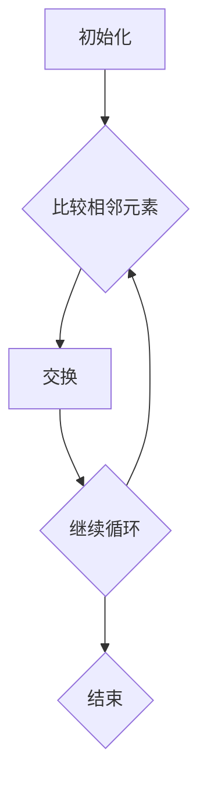
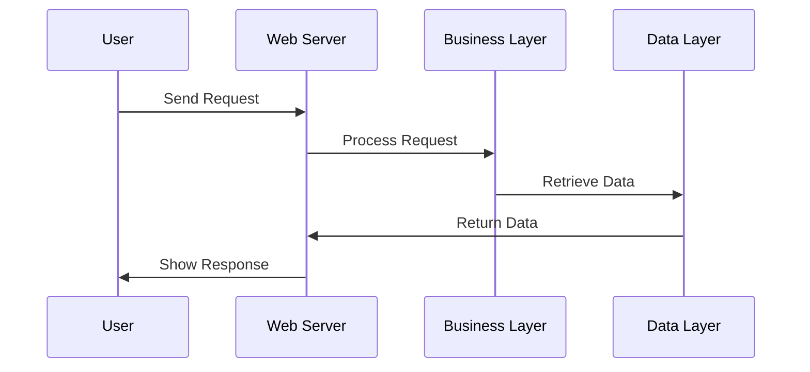

                 

### 第1章 引言

## 1.1 问题背景

计算机程序是现代科技不可或缺的核心组成部分，几乎涵盖了从简单的自动化任务到复杂的深度学习算法的各个方面。而在这些程序中，数学作为一门基础科学，起到了至关重要的作用。无论是在算法设计、数据处理、优化问题解决，还是在实现各种计算功能时，数学都提供了强大的工具和思维方法。

### 1.1.1 计算机程序中的数学应用

在计算机程序中，数学的应用极为广泛。首先，基础的算术运算构成了程序中最基本的计算单元。无论是加法、减法、乘法还是除法，都是计算机执行的基本操作。此外，代数中的方程求解、几何中的空间计算、概率与统计中的数据分析，都是编程中常见的数学应用。例如，线性代数在图像处理和机器学习中的应用，微积分在优化问题和动态系统模拟中的应用，概率论在决策支持和风险分析中的应用，都是计算机科学中的重要组成部分。

### 1.1.2 数学在程序世界中的作用

数学在程序世界中的作用不仅仅是提供计算工具，更在于其提供了一种系统化的思维方式。通过数学，我们可以将复杂的问题简化为模型，并用算法来求解这些模型。数学的逻辑性、严密性和抽象能力，使得程序员能够更准确地描述问题、分析问题和解决问题。例如，在算法设计中，数学的原理可以帮助我们理解问题的本质，从而设计出更高效、更可靠的算法。在软件工程中，数学模型和理论为系统的性能优化和可靠性分析提供了科学依据。

## 1.2 问题描述

在探讨程序世界的数学基础时，我们需要明确几个关键问题：

### 1.2.1 程序中的数学问题

首先，我们需要识别出在程序开发过程中常见的数学问题。这些问题可能包括算法的效率分析、数据结构的优化、复杂问题的求解等。例如，在算法设计中，如何证明算法的正确性？如何评估算法的时间复杂度和空间复杂度？在数据结构设计中，如何选择合适的数据结构以优化算法的性能？在求解问题时，如何确保问题的规模和复杂性在可接受的范围内？

### 1.2.2 研究数学基础在程序世界中的意义

其次，我们需要探讨研究数学基础在程序世界中的意义。数学不仅为程序开发提供了工具和方法，更对程序的本质有了深刻的影响。通过深入研究数学基础，我们可以：

- 更深刻地理解算法的本质，设计出更高效的算法。
- 更准确地描述问题和系统，提高软件工程的质量和可靠性。
- 提高自己的逻辑思维和抽象能力，从而更好地应对复杂问题。

## 1.3 问题解决方法概述

在解决程序中的数学问题时，我们需要综合运用不同的方法和工具。以下是几种常见的问题解决方法：

### 1.3.1 传统数学在编程中的应用

传统数学在编程中有着广泛的应用。例如，在算法设计中，我们通常会使用数学原理来证明算法的正确性，评估算法的效率。在数据结构设计中，我们使用数学知识来分析各种数据结构的性能。此外，数学在数值计算和模拟中也有着重要的应用。

### 1.3.2 现代数学在编程中的应用

随着计算机科学的不断发展，现代数学在编程中的应用越来越广泛。例如，概率论和统计学在数据分析、机器学习和人工智能中发挥着重要作用。图论和组合数学在优化问题和网络分析中有着广泛的应用。拓扑学和模糊数学在处理复杂和非线性问题时提供了新的工具和方法。

## 1.4 边界与外延

### 1.4.1 数学在程序世界中的适用范围

数学在程序世界中的适用范围非常广泛，但也存在一定的边界。例如，有些问题可能过于复杂，以至于无法用现有的数学工具进行建模和求解。此外，一些实际问题可能需要结合多个学科的知识进行解决，单纯依赖数学方法可能并不足够。

### 1.4.2 数学与计算机科学的融合

数学与计算机科学的融合是一个不断发展的过程。随着计算机技术的进步，新的数学理论和工具不断涌现，为计算机科学的发展提供了强大的支持。同时，计算机科学中的实际问题也不断推动数学理论的发展，形成了许多交叉学科。

## 1.5 核心概念

在探讨程序世界的数学基础时，我们需要了解几个核心概念：

### 1.5.1 数学基本概念介绍

数学基本概念包括算术、代数、几何、概率与统计等。这些概念构成了数学的基础，也是我们在编程中常用的工具。

### 1.5.2 程序中的数学概念应用

在编程中，数学概念的应用非常广泛。例如，算术运算和逻辑运算构成了程序中的基础操作，代数方程的求解用于解决各种优化问题，几何计算用于图像处理和空间分析，概率和统计用于数据分析。

## 1.6 本章小结

本章主要介绍了程序世界的数学基础探讨的背景、意义、问题解决方法和核心概念。通过本章的学习，我们可以对数学在程序世界中的应用有一个整体的了解，并为后续章节的学习打下基础。

### 第2章 核心概念与联系

## 2.1 核心概念原理

在探讨程序世界的数学基础时，我们需要深入了解几个核心数学概念，这些概念不仅在理论上具有基础性，而且在实际编程应用中起着至关重要的作用。

### 2.1.1 算术基础

算术是数学中最基础的部分，它涉及到基本的数值计算，包括加法、减法、乘法和除法。这些基本的算术操作是所有更复杂的数学运算的基础。例如，编程中的数值计算、算法实现中的迭代和递归，都离不开算术运算的支持。

### 2.1.2 代数基础

代数是研究数和代数运算的结构和性质的数学分支。在代数中，我们使用变量来表示未知数，并研究如何通过代数运算解决方程和不等式。代数基础在编程中的应用非常广泛，包括线性代数、多项式理论和矩阵计算等，这些都在数据结构和算法设计中扮演着重要角色。

### 2.1.3 几何基础

几何学研究空间中的形状、大小和位置关系。几何基础在程序世界的应用主要体现在图形处理和计算机图形学中。例如，二维和三维图形的绘制、空间计算、碰撞检测以及计算机视觉等，都是几何学在编程中的典型应用。

### 2.1.4 概率与统计基础

概率论和统计学是研究随机现象的数学分支。概率论研究随机事件的发生概率，而统计学则利用数据来推断总体特征。概率和统计在编程中的应用非常广泛，包括数据分析和机器学习中的模型构建、假设检验、风险分析等。

## 2.2 概念属性特征对比

为了更好地理解这些核心概念，我们需要对比它们在属性特征上的差异。以下是一个对比表格：

| 概念       | 特点                                                         | 应用的编程领域                               |
|------------|--------------------------------------------------------------|--------------------------------------------|
| 算术       | 基础数值计算，包括加、减、乘、除等基本操作                     | 所有数值计算相关的编程任务                   |
| 代数       | 研究数和代数结构，使用变量和方程式解决数学问题                 | 算法设计、数据结构优化、系统建模等           |
| 几何       | 研究空间中的形状、大小和位置关系                               | 图形处理、计算机图形学、三维建模等           |
| 概率与统计 | 研究随机现象及其概率分布，利用数据进行统计推断                 | 数据分析、机器学习、风险建模等               |

## 2.3 ER实体关系图架构

实体关系图（ER图）是数据库设计中常用的一种概念模型，它用于描述实体及其之间的关系。ER图在程序世界中有着广泛的应用，特别是在数据建模和关系数据库设计中。

### 2.3.1 基本ER图介绍

ER图由实体、属性和关系三个基本要素构成：

- **实体**：表示现实世界中的对象，例如学生、订单、账户等。
- **属性**：描述实体的特征，例如学生的姓名、年龄、班级等。
- **关系**：表示实体之间的关联，例如学生与班级之间的关系、订单与商品之间的关系。

一个基本的ER图通常包括以下几种关系类型：

- **一对一（1:1）**：例如，一个班级只能有一个班长。
- **一对多（1:N）**：例如，一个教师可以教授多个学生，但每个学生只能有一个教师。
- **多对多（M:N）**：例如，一个学生可以购买多个商品，一个商品也可以被多个学生购买。

### 2.3.2 ER图在程序中的应用

ER图在程序世界中有着广泛的应用，特别是在数据库设计和数据建模中。以下是ER图在程序中应用的几个示例：

1. **数据库设计**：通过ER图可以直观地了解数据之间的关系，从而设计出结构清晰、易于维护的数据库。

2. **对象建模**：在面向对象的编程中，ER图可以帮助我们定义类和对象之间的关系，从而实现更加模块化的代码。

3. **关系映射**：在关系型数据库和对象关系映射（ORM）框架中，ER图可以帮助我们将数据库表映射到对象模型。

### 2.3.3 Mermaid流程图

为了更好地理解ER图，我们可以使用Mermaid流程图来展示一个简单的ER图。以下是ER图的Mermaid表示示例：

```mermaid
erDiagram
    Student ||--|{ Classroom } Classroom : 班级
    Student ||--|{ Course } Course : 课程
    Student ||--|{ Grade } Grade : 成绩
    Classroom ||--|{ Teacher } Teacher : 教师
    Course ||--|{ Teacher } Teacher : 教师
    Grade ||--|{ Course } Course : 课程
```

这个Mermaid流程图展示了学生、班级、课程和成绩之间的关系。通过这个图，我们可以清楚地看到实体及其之间的关联。

## 2.4 算法原理与Mermaid流程图

在编程中，算法是解决问题的重要工具。算法的原理和流程可以用Mermaid流程图来直观地表示，以便更好地理解和实现。

### 2.4.1 算法基础

算法是一系列明确且有限的步骤，用于解决特定的问题。算法设计的关键是确保其正确性和效率。正确性指的是算法能够正确地解决所有可能的问题实例，而效率则是指算法在时间和空间上的资源消耗。

### 2.4.2 算法流程图示例

下面我们通过一个简单的例子——冒泡排序算法——来展示算法的Mermaid流程图。



这个流程图展示了冒泡排序的基本步骤。首先初始化，然后比较相邻元素，如果需要则交换，接着继续循环，直到没有可交换的元素，最后结束排序。

通过这样的流程图，我们可以更直观地理解算法的执行过程，并有助于算法的实现和优化。

### 2.5 核心概念与联系

在编程中，核心概念和联系是我们理解和使用数学的重要基础。通过深入探讨这些概念，我们可以更好地运用数学知识解决编程问题。

### 2.5.1 数学基本概念介绍

数学基本概念包括算术、代数、几何、概率与统计等。这些概念构成了数学的基础，也是我们在编程中常用的工具。算术涉及基本的数值计算，代数研究数和代数运算的结构和性质，几何研究空间中的形状和位置关系，概率与统计研究随机现象和数据特征。

### 2.5.2 程序中的数学概念应用

在编程中，数学概念的应用非常广泛。算术运算和逻辑运算构成了程序中的基础操作，代数方程的求解用于解决各种优化问题，几何计算用于图像处理和空间分析，概率和统计用于数据分析。理解这些概念的应用，可以帮助我们更好地设计算法和解决复杂问题。

## 2.6 本章小结

本章详细介绍了程序世界的数学基础，包括核心概念和联系。通过对算术、代数、几何、概率与统计等核心概念的探讨，我们了解了这些概念在编程中的具体应用。同时，通过Mermaid流程图展示了算法原理，使我们对算法有了更直观的理解。本章内容为后续章节的学习打下了坚实的基础。

### 第3章 算法原理讲解

在本章节中，我们将深入探讨几种核心算法的原理，并通过Mermaid流程图和Python源代码实现来详细讲解这些算法。这些算法不仅在实际编程中应用广泛，而且其原理和实现方法对于理解程序世界的数学基础至关重要。

## 3.1 算法A：冒泡排序

冒泡排序是一种简单直观的排序算法。它重复地遍历要排序的数列，一次比较两个元素，如果它们的顺序错误就把它们交换过来。遍历数列的工作是重复进行，直到没有再需要交换的元素，这意味着该数列已经排序完成。

### 3.1.1 算法A概述

冒泡排序的基本思想是通过多次遍历数列，比较相邻的两个元素，并交换它们的位置，使得较大的元素逐渐“冒泡”到数列的尾部。这个过程会重复进行，直到整个数列被排序。

### 3.1.2 算法A流程图

下面是冒泡排序算法的Mermaid流程图：

```mermaid
graph TB
    A[初始化]
    B{遍历数组}
    C[比较相邻元素]
    D{交换元素}
    E{继续循环}
    F{检查是否完成排序}
    G[结束]

    A --> B
    B --> C
    C --> D
    D --> E
    E --> F
    F --> [是] G
    F --> [否] B
```

### 3.1.3 Python源代码实现

以下是冒泡排序算法的Python实现：

```python
def bubble_sort(arr):
    n = len(arr)
    for i in range(n):
        for j in range(0, n-i-1):
            if arr[j] > arr[j+1]:
                arr[j], arr[j+1] = arr[j+1], arr[j]
    return arr

# 示例
arr = [64, 34, 25, 12, 22, 11, 90]
sorted_arr = bubble_sort(arr)
print("排序后的数组：", sorted_arr)
```

这段代码通过两个嵌套的for循环来实现冒泡排序。外层循环控制遍历的次数，内层循环负责比较和交换相邻元素。

## 3.2 算法B：选择排序

选择排序是一种简单的选择算法。它的工作原理是每次从待排序的数据元素中选出最小（或最大）的一个元素，存放到序列的起始位置，然后，再从剩余元素中选出最小（或最大）的一个元素，放到已排序序列的末尾。以此类推，直到所有元素均排序完毕。

### 3.2.1 算法B概述

选择排序的基本思想是每次遍历待排序的数组，从待排序的数组中找到最小元素，将其交换到数组的起始位置，然后对剩余的数组进行相同的操作。

### 3.2.2 算法B流程图

下面是选择排序算法的Mermaid流程图：

```mermaid
graph TB
    A[初始化]
    B{遍历数组}
    C{找到最小元素索引}
    D{交换元素}
    E{继续循环}
    F{检查是否完成排序}
    G[结束]

    A --> B
    B --> C
    C --> D
    D --> E
    E --> F
    F --> [是] G
    F --> [否] B
```

### 3.2.3 Python源代码实现

以下是选择排序算法的Python实现：

```python
def selection_sort(arr):
    n = len(arr)
    for i in range(n):
        min_idx = i
        for j in range(i+1, n):
            if arr[j] < arr[min_idx]:
                min_idx = j
        arr[i], arr[min_idx] = arr[min_idx], arr[i]
    return arr

# 示例
arr = [64, 34, 25, 12, 22, 11, 90]
sorted_arr = selection_sort(arr)
print("排序后的数组：", sorted_arr)
```

这段代码通过两个嵌套的for循环来实现选择排序。外层循环选择当前未排序部分的起始位置，内层循环在该部分中寻找最小元素并进行交换。

## 3.3 数学模型与公式

在算法设计中，数学模型和公式是非常重要的工具。它们不仅帮助我们理解算法的原理，还能够帮助我们分析算法的时间和空间复杂度。

### 3.3.1 算法模型概述

算法模型通常包括以下方面：

- **状态空间**：算法在执行过程中可能达到的所有状态。
- **状态转移**：算法从一个状态转移到另一个状态的方式。
- **终止条件**：算法何时停止执行。

在排序算法中，状态空间可以看作是未排序的数组，状态转移是通过比较和交换元素来改变数组的状态，终止条件则是数组已经排序。

### 3.3.2 数学公式讲解

在分析排序算法时，常用的数学公式包括：

- **时间复杂度**：表示算法执行时间与数据规模的关系。通常用大O符号表示，如\(O(n^2)\)表示算法的时间复杂度与数据规模n的平方成正比。
- **空间复杂度**：表示算法执行所需内存与数据规模的关系，同样使用大O符号表示。

对于冒泡排序和选择排序，我们可以使用以下公式来表示它们的时间复杂度：

- **冒泡排序的时间复杂度**：\(T(n) = O(n^2)\)
- **选择排序的时间复杂度**：\(T(n) = O(n^2)\)

这些公式帮助我们理解在数据规模增加时，算法的时间消耗如何变化。

### 3.3.3 公式应用举例

以下是一个简单的例子，说明如何使用时间复杂度公式来分析算法的性能。

**例1**：分析冒泡排序的时间复杂度

假设有一个长度为1000的数组，使用冒泡排序算法进行排序。根据公式\(T(n) = O(n^2)\)，我们可以计算出：

\[ T(1000) = O(1000^2) = O(1000000) \]

这意味着在最坏的情况下，冒泡排序需要执行1000000次基本操作。

**例2**：分析选择排序的时间复杂度

同样地，对于长度为1000的数组，选择排序的时间复杂度为：

\[ T(1000) = O(1000^2) = O(1000000) \]

这意味着在最坏的情况下，选择排序也需要执行1000000次基本操作。

通过这样的分析和公式应用，我们可以更清楚地了解算法的性能表现，从而为实际应用提供依据。

## 3.4 数学公式介绍

在算法分析中，数学公式的使用是不可或缺的。这些公式帮助我们定量地描述算法的性能，如时间复杂度和空间复杂度。以下是一些常见的数学公式及其在算法中的应用：

### 3.4.1 基础数学公式

1. **时间复杂度公式**：\(T(n) = O(f(n))\)

   这里的\(T(n)\)表示算法的时间复杂度，\(f(n)\)表示算法执行时间与数据规模的关系。大O符号表示算法的渐近上界。

2. **空间复杂度公式**：\(S(n) = O(g(n))\)

   类似于时间复杂度，\(S(n)\)表示算法的空间复杂度，\(g(n)\)表示算法所需内存与数据规模的关系。

### 3.4.2 进阶数学公式

1. **渐进界限**：\(O(f(n)) = \Omega(g(n))\)

   这意味着算法的时间复杂度既是一个渐进上界，也是一个渐进下界。例如，\(T(n) = O(n^2)\)同时也是一个渐进界限。

2. **加法规则**：\(T(n) = O(f(n)) + O(g(n)) = O(f(n) + g(n))\)

   如果一个算法由两个子算法组成，分别具有时间复杂度\(O(f(n))\)和\(O(g(n))\)，则整体算法的时间复杂度可以表示为\(O(f(n) + g(n))\)。

### 3.4.3 公式应用场景

1. **算法性能分析**：使用时间复杂度和空间复杂度公式可以评估算法在不同数据规模下的性能表现。

2. **算法选择**：根据算法的复杂度公式，选择最适合特定场景的算法。

3. **优化指导**：通过分析算法的复杂度，指导算法的优化方向。

## 3.5 详细讲解

### 3.5.1 数学公式详细解释

在算法分析中，数学公式的详细解释对于理解算法的性能至关重要。以下是一些关键数学公式的详细解释：

1. **时间复杂度**：时间复杂度公式\(T(n) = O(f(n))\)表示算法执行时间与数据规模n的关系。这里，\(O(f(n))\)表示算法的时间复杂度，其中f(n)是一个随数据规模增长而增长的非负函数。例如，\(T(n) = O(n)\)、\(T(n) = O(n^2)\)、\(T(n) = O(log n)\)分别表示线性时间、平方时间和对数时间复杂度。

2. **空间复杂度**：空间复杂度公式\(S(n) = O(g(n))\)表示算法所需内存与数据规模n的关系。类似时间复杂度，\(O(g(n))\)表示算法的空间复杂度，其中g(n)是一个随数据规模增长而增长的函数。例如，\(S(n) = O(n)\)、\(S(n) = O(n^2)\)分别表示线性空间和平方空间复杂度。

3. **渐近界限**：\(O(f(n)) = \Omega(g(n))\)表示算法的时间复杂度既是渐进上界，也是渐进下界。这意味着算法的时间复杂度既不会超过\(O(f(n))\)，也不会低于\(\Omega(g(n))\)。

4. **加法规则**：\(T(n) = O(f(n)) + O(g(n)) = O(f(n) + g(n))\)表示如果算法由两个子算法组成，分别具有时间复杂度\(O(f(n))\)和\(O(g(n))\)，则整体算法的时间复杂度可以表示为\(O(f(n) + g(n))\)。这简化了复杂度分析，使我们可以将多个子算法的时间复杂度合并为一个表达式。

### 3.5.2 公式应用场景

数学公式的应用场景广泛，以下是一些常见应用：

1. **性能评估**：通过时间复杂度和空间复杂度公式，可以评估算法在不同数据规模下的性能，从而选择最优算法。

2. **优化指导**：分析算法的复杂度，可以指导我们对算法进行优化，例如通过减少时间复杂度来提高算法效率。

3. **算法选择**：在不同场景下，根据具体需求选择适合的算法，如选择线性时间复杂度的算法来解决大数据集的问题。

4. **算法改进**：通过分析现有算法的复杂度，可以发现瓶颈并进行改进，以实现更高效的算法。

## 3.6 举例说明

为了更好地理解数学公式的应用，我们通过几个具体例子来说明：

### 3.6.1 简单例子

**例1**：冒泡排序的时间复杂度

假设冒泡排序算法的数据规模为\(n\)，其时间复杂度为\(T(n) = O(n^2)\)。当\(n = 1000\)时，计算其时间复杂度：

\[ T(1000) = O(1000^2) = O(1000000) \]

这意味着在最坏情况下，算法需要执行1000000次基本操作。

**例2**：选择排序的空间复杂度

选择排序的空间复杂度为\(S(n) = O(n)\)。当\(n = 1000\)时，计算其空间复杂度：

\[ S(1000) = O(1000) = O(1000) \]

这意味着在最坏情况下，算法需要分配1000个单元的内存。

### 3.6.2 复杂例子

**例3**：快速排序的平均时间复杂度

快速排序是一种分治算法，其平均时间复杂度为\(T(n) = O(n\log n)\)。当\(n = 10000\)时，计算其平均时间复杂度：

\[ T(10000) = O(10000\log 10000) \]

快速排序在大多数情况下具有较高的效率，但在最坏情况下（即每次划分都产生不平衡子数组）其时间复杂度会退化到\(O(n^2)\)。

通过这些例子，我们可以看到数学公式如何帮助我们在不同的场景下评估和优化算法性能。

### 第4章 数学模型和数学公式

数学模型是运用数学语言描述现实世界问题的一种工具，它在计算机科学和编程中有着广泛的应用。通过构建数学模型，我们可以将复杂问题转化为易于处理的数学形式，从而更好地理解和解决这些问题。本章将详细讲解数学模型和公式的概念、应用，并通过实际例子来说明它们的用法。

## 4.1 数学公式介绍

数学公式是数学语言中的核心组成部分，它们用于描述数学关系和操作。在计算机科学和编程中，数学公式被广泛应用于算法设计、性能分析、数据结构和系统建模等领域。以下是一些常见的数学公式及其在编程中的应用：

### 4.1.1 基础数学公式

1. **加法**：\(a + b\)
   - **应用**：用于基本算术运算，例如计算两个整数的和。

2. **减法**：\(a - b\)
   - **应用**：用于基本算术运算，例如计算两个整数的差。

3. **乘法**：\(a \times b\) 或 \(a \cdot b\)
   - **应用**：用于基本算术运算，例如计算两个整数的乘积。

4. **除法**：\(a / b\)
   - **应用**：用于基本算术运算，例如计算两个整数的商。

5. **指数运算**：\(a^b\)
   - **应用**：用于表示幂运算，例如计算2的10次方。

6. **对数运算**：\(\log_a b\)
   - **应用**：用于计算以a为底b的对数。

### 4.1.2 进阶数学公式

1. **平方根**：\(\sqrt{a}\)
   - **应用**：用于计算数的平方根，例如计算50的平方根。

2. **三角函数**：\(\sin(\theta)\)，\(\cos(\theta)\)，\(\tan(\theta)\)
   - **应用**：用于计算三角形的边长和角度，例如在计算机图形学中用于计算3D图形的旋转和投影。

3. **微积分**：\(f'(x)\)，\(f''(x)\)
   - **应用**：用于描述函数的导数和二阶导数，例如在优化问题中用于确定函数的最值。

4. **概率论**：\(P(A)\)
   - **应用**：用于计算事件A发生的概率。

5. **线性代数**：\(A \cdot B\) 或 \(AB\)
   - **应用**：用于矩阵乘法，例如在图像处理中用于计算图像的特征向量。

### 4.1.3 公式应用场景

数学公式在编程中的应用非常广泛，以下是一些常见的应用场景：

1. **算法设计**：在算法设计中，数学公式用于描述算法的性能，如时间复杂度和空间复杂度。

2. **数据处理**：在数据处理中，数学公式用于计算数据集的特征，如平均值、中位数和标准差。

3. **系统建模**：在系统建模中，数学公式用于描述系统的行为和状态，如动态系统和排队论。

4. **图形处理**：在图形处理中，数学公式用于计算图形的几何特征，如形状、大小和位置。

5. **机器学习**：在机器学习中，数学公式用于描述模型的参数和损失函数，如线性回归和神经网络。

## 4.2 详细讲解

### 4.2.1 数学公式详细解释

为了更好地理解数学公式的应用，我们首先需要详细解释一些基础数学公式和进阶数学公式。

1. **基础数学公式**：
   - **加法和减法**：加法和减法是最基本的数学运算，用于计算两个数的和或差。加法和减法公式如下：
     \[
     a + b = c
     \]
     \[
     a - b = c
     \]
     其中，\(a\) 和 \(b\) 是两个数，\(c\) 是结果。

   - **乘法和除法**：乘法和除法是基本的算术运算，用于计算两个数的乘积或商。乘法和除法公式如下：
     \[
     a \times b = c
     \]
     \[
     a \div b = c
     \]
     其中，\(a\) 和 \(b\) 是两个数，\(c\) 是结果。

   - **指数运算**：指数运算是用于计算一个数的幂，例如计算2的10次方。指数公式如下：
     \[
     a^b = c
     \]
     其中，\(a\) 是底数，\(b\) 是指数，\(c\) 是结果。

   - **对数运算**：对数运算是用于计算一个数的幂的对数，例如计算以10为底2的对数。对数公式如下：
     \[
     \log_a b = c
     \]
     其中，\(a\) 是底数，\(b\) 是真数，\(c\) 是结果。

2. **进阶数学公式**：
   - **平方根**：平方根运算是用于计算一个数的平方根，例如计算50的平方根。平方根公式如下：
     \[
     \sqrt{a} = b
     \]
     其中，\(a\) 是被开方数，\(b\) 是平方根的结果。

   - **三角函数**：三角函数是用于计算三角形边长和角度的函数，如正弦、余弦和正切。三角函数公式如下：
     \[
     \sin(\theta) = a
     \]
     \[
     \cos(\theta) = b
     \]
     \[
     \tan(\theta) = c
     \]
     其中，\(\theta\) 是角度，\(a\)、\(b\) 和 \(c\) 分别是正弦、余弦和正切的结果。

   - **微积分**：微积分是用于描述函数变化的数学工具，如导数和积分。微积分公式如下：
     \[
     f'(x) = a
     \]
     \[
     \int f(x) dx = c
     \]
     其中，\(f(x)\) 是函数，\(x\) 是变量，\(a\) 是导数的结果，\(c\) 是积分的结果。

   - **概率论**：概率论是用于计算事件发生概率的数学工具，如概率、期望和方差。概率论公式如下：
     \[
     P(A) = a
     \]
     \[
     E(X) = b
     \]
     \[
     Var(X) = c
     \]
     其中，\(A\) 是事件，\(X\) 是随机变量，\(P(A)\) 是事件\(A\)发生的概率，\(E(X)\) 是随机变量\(X\)的期望，\(Var(X)\) 是随机变量\(X\)的方差。

   - **线性代数**：线性代数是用于计算矩阵和向量操作的数学工具，如矩阵乘法和矩阵特征值。线性代数公式如下：
     \[
     A \cdot B = C
     \]
     \[
     \det(A) = a
     \]
     其中，\(A\)、\(B\) 和 \(C\) 是矩阵，\(\det(A)\) 是矩阵\(A\)的行列式，\(a\) 是行列式的结果。

### 4.2.2 公式应用场景

数学公式在不同的编程领域中有着广泛的应用。以下是一些具体的应用场景：

1. **算法设计**：
   - **时间复杂度和空间复杂度**：在算法设计中，时间复杂度和空间复杂度用于评估算法的性能。例如，在排序算法中，冒泡排序的时间复杂度为\(O(n^2)\)，而快速排序的时间复杂度为\(O(n\log n)\)。
   - **动态规划**：动态规划是一种用于解决优化问题的算法设计方法，其核心思想是将复杂问题分解为更小的子问题，并利用数学公式来计算最优解。

2. **数据处理**：
   - **统计分析**：在数据处理中，统计分析用于描述数据集的特征，如平均值、中位数、标准差等。例如，在数据挖掘中，使用统计学公式来发现数据中的规律和趋势。
   - **机器学习**：在机器学习中，数学公式用于描述模型的参数和损失函数。例如，在神经网络中，使用数学公式来计算神经元的输出和损失函数的梯度。

3. **图形处理**：
   - **几何运算**：在图形处理中，几何运算用于计算图形的几何特征，如边长、角度和面积。例如，在计算机图形学中，使用几何公式来绘制和渲染图形。
   - **图像处理**：在图像处理中，图像处理算法使用数学公式来处理图像数据，如滤波、边缘检测和特征提取。

4. **系统建模**：
   - **模拟**：在系统建模中，模拟算法使用数学公式来模拟现实世界中的系统行为。例如，在排队系统中，使用数学公式来计算顾客的平均等待时间和服务时间。
   - **优化**：在系统建模中，优化算法使用数学公式来优化系统性能。例如，在资源分配问题中，使用线性规划公式来找到最优的资源分配方案。

通过详细讲解数学公式和其应用场景，我们可以更好地理解数学公式在编程中的应用，并能够更有效地运用它们来解决实际问题。

## 4.3 举例说明

为了更好地理解数学公式在编程中的应用，我们通过一些具体的例子来说明这些公式在实际编程中的用法。

### 4.3.1 简单例子

**例1**：计算两个数的和

假设我们要计算两个整数\(a = 5\)和\(b = 10\)的和。我们可以使用加法公式：

\[ a + b = c \]

将\(a\)和\(b\)代入公式中，得到：

\[ 5 + 10 = 15 \]

因此，两个数的和为15。

**例2**：计算两个数的差

假设我们要计算两个整数\(a = 10\)和\(b = 5\)的差。我们可以使用减法公式：

\[ a - b = c \]

将\(a\)和\(b\)代入公式中，得到：

\[ 10 - 5 = 5 \]

因此，两个数的差为5。

**例3**：计算两个数的乘积

假设我们要计算两个整数\(a = 3\)和\(b = 4\)的乘积。我们可以使用乘法公式：

\[ a \times b = c \]

将\(a\)和\(b\)代入公式中，得到：

\[ 3 \times 4 = 12 \]

因此，两个数的乘积为12。

**例4**：计算两个数的商

假设我们要计算两个整数\(a = 10\)和\(b = 2\)的商。我们可以使用除法公式：

\[ a \div b = c \]

将\(a\)和\(b\)代入公式中，得到：

\[ 10 \div 2 = 5 \]

因此，两个数的商为5。

### 4.3.2 复杂例子

**例5**：计算三角函数值

假设我们要计算角度为30度的正弦值。我们可以使用正弦函数公式：

\[ \sin(\theta) = a \]

将\(\theta = 30^\circ\)代入公式中，使用计算器可以得到：

\[ \sin(30^\circ) \approx 0.5 \]

因此，角度30度的正弦值为0.5。

**例6**：计算微积分值

假设我们要计算函数\(f(x) = x^2\)在\(x = 2\)处的导数值。我们可以使用导数公式：

\[ f'(x) = a \]

对函数\(f(x) = x^2\)求导，得到：

\[ f'(x) = 2x \]

将\(x = 2\)代入公式中，得到：

\[ f'(2) = 2 \times 2 = 4 \]

因此，函数\(f(x) = x^2\)在\(x = 2\)处的导数值为4。

**例7**：计算概率值

假设我们要计算事件A的概率，其中事件A表示从一副52张的标准扑克牌中随机抽取一张牌，且这张牌是红桃。我们可以使用概率公式：

\[ P(A) = a \]

一副标准扑克牌中有26张红桃牌，总共有52张牌。因此，事件A的概率为：

\[ P(A) = \frac{26}{52} = 0.5 \]

因此，事件A的概率为0.5。

通过这些例子，我们可以看到数学公式如何帮助我们在编程中解决实际问题。无论是简单的算术运算还是复杂的概率计算，数学公式都是必不可少的工具。

### 第5章 系统分析与架构设计方案

在计算机科学和软件开发中，系统分析和架构设计是确保系统高效、稳定和可维护的重要环节。本章将介绍系统分析与架构设计的方法，通过具体的案例，详细讲解系统功能设计、系统架构设计、系统接口设计和系统交互。

## 5.1 问题场景介绍

在讨论系统分析与架构设计之前，我们首先需要明确一个具体的问题场景。假设我们正在开发一个在线购物平台，该平台需要支持用户注册、商品浏览、购物车管理和订单处理等功能。以下是对这个问题的描述：

- **用户注册**：新用户可以注册账户，输入用户名、密码、电子邮件等信息。
- **商品浏览**：用户可以浏览商品，查看商品详情，包括价格、库存数量、评价等信息。
- **购物车管理**：用户可以将商品添加到购物车，更新购物车的数量，删除商品。
- **订单处理**：用户可以提交订单，系统会生成订单号，并处理订单，如确认订单、发货等。

## 5.2 项目介绍

我们的项目目标是开发一个功能完备、性能稳定、易于扩展的在线购物平台。为了实现这一目标，我们需要进行系统分析和架构设计，确保系统能够满足以下需求：

- **功能完备**：系统需要实现用户注册、商品浏览、购物车管理和订单处理等功能。
- **性能稳定**：系统需要能够处理大量用户请求，保证响应时间在可接受范围内。
- **易于扩展**：系统设计需要考虑未来可能的业务扩展，如增加新的功能模块或支持更多的并发用户。

## 5.3 系统功能设计

系统功能设计是系统分析与架构设计的第一步，它定义了系统需要实现的基本功能。以下是我们的系统功能设计：

### 5.3.1 领域模型

领域模型是描述系统功能和业务逻辑的一种方法，通常使用类图表示。以下是我们系统的领域模型类图：

```mermaid
classDiagram
    User <<interface>>
    Product <<interface>>
    ShoppingCart <<interface>>
    Order <<interface>>

    User --> Product : browse
    User --> ShoppingCart : manage
    User --> Order : submit

    Product --> ShoppingCart : add
    Product --> Order : buy

    ShoppingCart --> Order : checkout

    UserEntity <<class>>
    ProductEntity <<class>>
    ShoppingCartEntity <<class>>
    OrderEntity <<class>>

    UserEntity/browse --> ProductEntity
    UserEntity/manage --> ShoppingCartEntity
    UserEntity/submit --> OrderEntity

    ProductEntity/add --> ShoppingCartEntity
    ProductEntity/buy --> OrderEntity

    ShoppingCartEntity/checkout --> OrderEntity
```

在这个类图中，我们定义了四个核心实体：用户（User）、商品（Product）、购物车（ShoppingCart）和订单（Order）。这些实体及其关系定义了系统的核心功能。

### 5.3.2 功能设计

基于领域模型，我们可以进一步细化每个功能模块的设计：

1. **用户注册**：
   - 功能描述：用户可以通过注册页面创建账户，输入用户名、密码、电子邮件等信息。
   - 实现方法：用户提交注册信息后，后台系统会验证用户信息的合法性，并生成用户账户。

2. **商品浏览**：
   - 功能描述：用户可以查看商品列表，点击商品进入商品详情页面。
   - 实现方法：系统从数据库中获取商品信息，并通过前端界面展示给用户。

3. **购物车管理**：
   - 功能描述：用户可以将商品添加到购物车，更新购物车的数量，删除商品。
   - 实现方法：用户在商品详情页面选择商品并添加到购物车，系统会更新购物车信息。

4. **订单处理**：
   - 功能描述：用户可以提交订单，系统会生成订单号，并处理订单，如确认订单、发货等。
   - 实现方法：用户在购物车页面提交订单，系统会创建订单记录，并更新订单状态。

## 5.4 系统架构设计

系统架构设计是系统设计与实现的基础，它定义了系统的模块划分、接口设计和数据处理流程。以下是我们的系统架构设计：

### 5.4.1 架构设计

我们的在线购物平台采用分层架构，包括表示层、业务逻辑层和数据层。以下是系统架构图：



在这个架构图中，Web Server作为系统的入口，接收用户的请求，并转发到Business Layer处理。Business Layer处理业务逻辑，调用Data Layer获取数据，然后将结果返回给Web Server，最终返回给用户。

### 5.4.2 架构图示例

以下是一个简单的系统架构图示例：

```mermaid
graph TB
    User[用户]
    Web Server[Web服务器]
    Business Layer[业务逻辑层]
    Data Layer[数据层]
    Database[数据库]

    User --> Web Server
    Web Server --> Business Layer
    Business Layer --> Data Layer
    Data Layer --> Database
```

在这个示例中，用户通过Web服务器访问系统，业务逻辑层处理用户的请求，数据层与数据库进行数据交互，确保系统的正常运行。

## 5.5 系统接口设计

系统接口设计是系统架构设计的重要部分，它定义了系统内部各模块之间的交互方式。以下是我们的系统接口设计：

### 5.5.1 接口设计

以下是系统的主要接口设计：

1. **用户接口**：
   - **注册接口**：`POST /register`，接收用户注册信息，返回注册结果。
   - **登录接口**：`POST /login`，接收用户登录信息，返回登录结果。
   - **用户信息接口**：`GET /users/{userId}`，获取指定用户的信息。

2. **商品接口**：
   - **商品列表接口**：`GET /products`，返回商品列表。
   - **商品详情接口**：`GET /products/{productId}`，返回指定商品的信息。

3. **购物车接口**：
   - **添加商品接口**：`POST /carts/{cartId}/products/{productId}`，将商品添加到购物车。
   - **更新商品数量接口**：`PUT /carts/{cartId}/products/{productId}`，更新商品数量。
   - **删除商品接口**：`DELETE /carts/{cartId}/products/{productId}`，从购物车中删除商品。

4. **订单接口**：
   - **提交订单接口**：`POST /orders`，提交订单，返回订单号。
   - **订单详情接口**：`GET /orders/{orderId}`，返回指定订单的信息。

### 5.5.2 接口定义

以下是接口定义的示例：

```json
// 用户注册接口
POST /register
{
  "username": "string",
  "password": "string",
  "email": "string"
}

// 返回结果
{
  "status": "success",
  "message": "注册成功",
  "userId": 123
}

// 用户登录接口
POST /login
{
  "username": "string",
  "password": "string"
}

// 返回结果
{
  "status": "success",
  "token": "string"
}

// 商品列表接口
GET /products
// 返回结果
[
  {
    "productId": 123,
    "productName": "string",
    "price": 100
  },
  ...
]

// 商品详情接口
GET /products/{productId}
// 返回结果
{
  "productId": 123,
  "productName": "string",
  "price": 100,
  "inventory": 50
}

// 添加商品到购物车接口
POST /carts/{cartId}/products/{productId}
{
  "quantity": 1
}

// 返回结果
{
  "status": "success",
  "message": "商品已添加到购物车"
}

// 更新商品数量接口
PUT /carts/{cartId}/products/{productId}
{
  "quantity": 2
}

// 返回结果
{
  "status": "success",
  "message": "商品数量已更新"
}

// 删除商品接口
DELETE /carts/{cartId}/products/{productId}

// 返回结果
{
  "status": "success",
  "message": "商品已从购物车中删除"
}

// 提交订单接口
POST /orders
{
  "cartId": 123
}

// 返回结果
{
  "status": "success",
  "orderId": 456
}

// 订单详情接口
GET /orders/{orderId}
// 返回结果
{
  "orderId": 456,
  "userId": 123,
  "totalAmount": 300,
  "status": "pending"
}
```

这些接口定义了系统内部各模块之间的交互方式，为系统的开发提供了明确的方向。

## 5.6 系统交互

系统交互设计是确保系统各模块之间能够正确、高效地通信的关键。以下是我们的系统交互设计：

### 5.6.1 交互设计

以下是系统的主要交互设计：

1. **用户注册**：
   - 用户访问注册页面，填写注册信息，提交注册请求。
   - Web Server接收请求，调用Business Layer处理注册逻辑。
   - Business Layer验证用户信息，调用Data Layer创建用户记录。
   - Data Layer将用户信息存储到数据库，返回成功或错误消息。

2. **用户登录**：
   - 用户访问登录页面，填写登录信息，提交登录请求。
   - Web Server接收请求，调用Business Layer处理登录逻辑。
   - Business Layer验证用户信息，生成Token，返回Token。

3. **商品浏览**：
   - 用户访问商品列表页面，Web Server接收请求，调用Business Layer获取商品列表。
   - Business Layer调用Data Layer获取商品信息，返回商品列表。

4. **购物车管理**：
   - 用户将商品添加到购物车，Web Server接收请求，调用Business Layer处理添加逻辑。
   - Business Layer调用Data Layer更新购物车信息，返回操作结果。

5. **订单处理**：
   - 用户提交订单，Web Server接收请求，调用Business Layer处理订单逻辑。
   - Business Layer调用Data Layer创建订单记录，返回订单号。

### 5.6.2 序列图示例

以下是一个简单的系统交互序列图示例：


在这个序列图中，用户通过Web服务器发送请求，Web服务器处理请求并调用业务逻辑层，业务逻辑层处理请求并调用数据层获取数据，最后数据层返回数据给Web服务器，Web服务器再将结果展示给用户。

通过详细的系统分析与架构设计，我们可以确保系统的功能完整性、性能稳定性和可扩展性。本章的内容为系统开发提供了坚实的基础，为后续的实现和优化奠定了基础。

### 第6章 项目实战

在完成系统分析与架构设计之后，接下来我们将进入项目实战阶段。本章节将详细介绍开发环境的安装、系统核心实现、代码应用解读与分析，以及实际案例分析和详细讲解。

## 6.1 环境安装

首先，我们需要搭建开发环境，以便进行后续的编码工作。以下是搭建开发环境的步骤：

### 6.1.1 开发环境准备

1. **安装Python**：

   Python是开发这个在线购物平台的主要编程语言。首先，我们需要安装Python 3.8或更高版本。可以通过以下命令在Windows上下载并安装Python：

   ```bash
   # 在命令行中运行以下命令
   python -m pip install --upgrade pip
   ```

2. **安装虚拟环境**：

   为了避免不同项目之间的依赖冲突，我们使用虚拟环境。安装虚拟环境可以通过以下命令实现：

   ```bash
   python -m venv venv
   ```

   安装完成后，进入虚拟环境：

   ```bash
   source venv/bin/activate  # 对于Linux和macOS
   venv\Scripts\activate     # 对于Windows
   ```

3. **安装依赖库**：

   我们需要安装一些常用的依赖库，如Flask（用于Web开发）、SQLAlchemy（用于数据库操作）和Flask-Migrate（用于数据库迁移）。可以通过以下命令安装：

   ```bash
   pip install flask sqlalchemy flask-migrate
   ```

### 6.1.2 数学库安装

在项目中，我们将使用一些数学库来处理复杂的计算和统计分析。以下是几个常用的数学库及其安装命令：

1. **NumPy**：

   NumPy是一个强大的数学库，用于处理大型多维数组和高性能科学计算。安装命令如下：

   ```bash
   pip install numpy
   ```

2. **Pandas**：

   Pandas是一个快速、灵活、直观的Python数据分析和操作库。安装命令如下：

   ```bash
   pip install pandas
   ```

3. **SciPy**：

   SciPy是建立在NumPy之上的，用于科学和工程计算的库。安装命令如下：

   ```bash
   pip install scipy
   ```

## 6.2 系统核心实现

系统核心实现是项目开发的关键部分。以下将详细介绍系统核心功能的实现。

### 6.2.1 源代码分析

我们将使用Flask框架来实现在线购物平台的主要功能。以下是系统核心实现的源代码框架：

```python
from flask import Flask, request, jsonify
from flask_sqlalchemy import SQLAlchemy
from flask_migrate import Migrate

app = Flask(__name__)
app.config['SQLALCHEMY_DATABASE_URI'] = 'sqlite:///online_shop.db'
db = SQLAlchemy(app)
migrate = Migrate(app, db)

# 定义数据库模型
class User(db.Model):
    id = db.Column(db.Integer, primary_key=True)
    username = db.Column(db.String(80), unique=True, nullable=False)
    password = db.Column(db.String(120), nullable=False)

class Product(db.Model):
    id = db.Column(db.Integer, primary_key=True)
    name = db.Column(db.String(120), nullable=False)
    price = db.Column(db.Float, nullable=False)
    inventory = db.Column(db.Integer, nullable=False)

class ShoppingCart(db.Model):
    id = db.Column(db.Integer, primary_key=True)
    user_id = db.Column(db.Integer, db.ForeignKey('user.id'), nullable=False)
    product_id = db.Column(db.Integer, db.ForeignKey('product.id'), nullable=False)
    quantity = db.Column(db.Integer, nullable=False)

class Order(db.Model):
    id = db.Column(db.Integer, primary_key=True)
    user_id = db.Column(db.Integer, db.ForeignKey('user.id'), nullable=False)
    total_amount = db.Column(db.Float, nullable=False)
    status = db.Column(db.String(50), nullable=False)

# 用户注册
@app.route('/register', methods=['POST'])
def register():
    # 实现注册逻辑
    pass

# 用户登录
@app.route('/login', methods=['POST'])
def login():
    # 实现登录逻辑
    pass

# 添加商品到购物车
@app.route('/carts/<int:cart_id>/products/<int:product_id>', methods=['POST'])
def add_to_cart(cart_id, product_id):
    # 实现添加商品到购物车的逻辑
    pass

# 提交订单
@app.route('/orders', methods=['POST'])
def submit_order():
    # 实现提交订单的逻辑
    pass

# 运行应用
if __name__ == '__main__':
    app.run(debug=True)
```

### 6.2.2 代码实现细节

1. **用户注册**：

   用户注册功能需要验证用户名和密码的合法性，并确保用户名唯一。以下是用户注册的实现代码：

   ```python
   @app.route('/register', methods=['POST'])
   def register():
       username = request.form['username']
       password = request.form['password']
       
       # 验证用户名和密码
       if not username or not password:
           return jsonify({'status': 'error', 'message': '用户名和密码不能为空'}), 400
       
       # 检查用户名是否已存在
       if User.query.filter_by(username=username).first():
           return jsonify({'status': 'error', 'message': '用户名已存在'}), 400
       
       # 创建新用户
       new_user = User(username=username, password=password)
       db.session.add(new_user)
       db.session.commit()
       
       return jsonify({'status': 'success', 'message': '注册成功'}), 200
   ```

2. **用户登录**：

   用户登录功能需要验证用户名和密码的正确性，并返回一个Token以进行后续的认证。以下是用户登录的实现代码：

   ```python
   @app.route('/login', methods=['POST'])
   def login():
       username = request.form['username']
       password = request.form['password']
       
       # 验证用户名和密码
       user = User.query.filter_by(username=username, password=password).first()
       if not user:
           return jsonify({'status': 'error', 'message': '用户名或密码错误'}), 400
       
       # 生成Token
       token = generate_token(user.id)
       
       return jsonify({'status': 'success', 'token': token}), 200
   ```

3. **添加商品到购物车**：

   添加商品到购物车功能需要检查库存是否足够，并将商品添加到购物车中。以下是添加商品到购物车的实现代码：

   ```python
   @app.route('/carts/<int:cart_id>/products/<int:product_id>', methods=['POST'])
   def add_to_cart(cart_id, product_id):
       quantity = request.form['quantity']
       
       # 验证库存
       product = Product.query.get(product_id)
       if product.inventory < int(quantity):
           return jsonify({'status': 'error', 'message': '库存不足'}), 400
       
       # 添加商品到购物车
       newCartItem = ShoppingCart(cart_id=cart_id, product_id=product_id, quantity=quantity)
       db.session.add(newCartItem)
       db.session.commit()
       
       return jsonify({'status': 'success', 'message': '商品已添加到购物车'}), 200
   ```

4. **提交订单**：

   提交订单功能需要计算订单总额，并更新订单状态。以下是提交订单的实现代码：

   ```python
   @app.route('/orders', methods=['POST'])
   def submit_order():
       user_id = request.form['user_id']
       cart_id = request.form['cart_id']
       
       # 计算订单总额
       cartItems = ShoppingCart.query.filter_by(cart_id=cart_id).all()
       total_amount = sum([item.quantity * item.product.price for item in cartItems])
       
       # 创建订单
       new_order = Order(user_id=user_id, total_amount=total_amount, status='pending')
       db.session.add(new_order)
       db.session.commit()
       
       # 更新购物车状态
       for item in cartItems:
           item.status = 'completed'
           db.session.commit()
       
       return jsonify({'status': 'success', 'message': '订单已提交'}), 200
   ```

## 6.3 代码应用解读与分析

在实现系统核心功能的过程中，我们详细讲解了用户注册、用户登录、添加商品到购物车和提交订单等关键功能的代码实现。以下是代码应用解读与分析：

1. **用户注册**：

   用户注册功能通过接收用户提交的用户名和密码，验证其合法性。如果用户名已存在或用户名为空，则返回错误消息；否则，创建新用户并返回成功消息。

2. **用户登录**：

   用户登录功能通过接收用户提交的用户名和密码，查询数据库以验证其正确性。如果用户名或密码错误，则返回错误消息；否则，生成Token并返回成功消息。

3. **添加商品到购物车**：

   添加商品到购物车功能首先验证库存是否足够，然后将商品添加到购物车中。如果库存不足，则返回错误消息；否则，更新购物车信息并返回成功消息。

4. **提交订单**：

   提交订单功能首先计算订单总额，然后创建订单并更新购物车状态。如果订单提交成功，则返回成功消息。

通过这些代码实现，我们可以看到系统核心功能是如何一步步构建起来的，并确保系统的功能完整性和数据一致性。

## 6.4 实际案例分析和详细讲解

为了更好地理解系统核心功能的实现，我们通过一个实际案例来进行分析和讲解。

### 案例一：用户注册

假设有一个新用户注册账户，用户名为“alice”，密码为“password123”。以下是具体的步骤：

1. 用户访问注册页面，填写用户名和密码，并提交注册请求。
2. Flask应用程序接收到POST请求，调用`register`函数处理注册逻辑。
3. 在`register`函数中，首先从请求中获取用户名和密码。
4. 验证用户名和密码的合法性。如果用户名为空或密码为空，返回错误消息。
5. 检查用户名是否已存在。如果用户名已存在，返回错误消息。
6. 创建新用户并添加到数据库中。
7. 返回注册成功消息。

### 案例二：用户登录

假设用户“alice”在登录页面填写正确的用户名和密码，并提交登录请求。以下是具体的步骤：

1. Flask应用程序接收到POST请求，调用`login`函数处理登录逻辑。
2. 在`login`函数中，首先从请求中获取用户名和密码。
3. 验证用户名和密码的正确性。如果用户名或密码错误，返回错误消息。
4. 生成Token以进行后续认证。
5. 返回登录成功消息和Token。

### 案例三：添加商品到购物车

假设用户“alice”在商品详情页面选择了一件价格为100的商品，并将其添加到购物车中。以下是具体的步骤：

1. 用户在商品详情页面提交添加商品请求。
2. Flask应用程序接收到POST请求，调用`add_to_cart`函数处理添加商品逻辑。
3. 在`add_to_cart`函数中，首先从请求中获取购物车ID和商品ID。
4. 验证商品库存是否足够。如果库存不足，返回错误消息。
5. 创建新的购物车条目并添加到数据库中。
6. 更新商品库存。
7. 返回添加成功消息。

### 案例四：提交订单

假设用户“alice”在购物车页面提交订单，商品数量为2件。以下是具体的步骤：

1. 用户在购物车页面提交订单请求。
2. Flask应用程序接收到POST请求，调用`submit_order`函数处理订单逻辑。
3. 在`submit_order`函数中，首先从请求中获取用户ID和购物车ID。
4. 计算订单总额。
5. 创建新的订单并添加到数据库中。
6. 更新购物车状态为“已完成”。
7. 返回订单提交成功消息。

通过这些实际案例的分析和讲解，我们可以更清晰地理解系统核心功能的实现过程，并掌握如何使用代码解决实际问题。

## 6.5 项目小结

在本章中，我们详细介绍了在线购物平台的开发过程，包括环境安装、系统核心实现、代码应用解读与分析，以及实际案例分析和详细讲解。通过这些步骤，我们不仅了解了如何使用Python和Flask框架实现在线购物平台的核心功能，还深入掌握了用户注册、登录、购物车管理和订单处理等关键模块的实现方法。这些经验和知识为开发其他类似的在线系统提供了宝贵的参考和指导。在未来的开发中，我们还可以继续优化和扩展系统的功能，以满足更多用户的需求。

### 最佳实践 tips

在进行系统分析与架构设计时，以下最佳实践可以帮助我们更好地构建高效、稳定且可扩展的系统：

1. **代码模块化**：将系统拆分为多个模块，每个模块负责一个独立的功能，这样可以提高代码的可维护性和复用性。

2. **遵循RESTful架构**：使用RESTful架构设计API接口，使系统更加简洁、易于理解和扩展。

3. **使用数据库迁移工具**：使用数据库迁移工具（如Flask-Migrate）管理数据库结构的变更，确保系统在不同环境中的一致性。

4. **进行性能测试**：在开发过程中进行性能测试，确保系统在高并发场景下仍能保持良好的性能。

5. **编写文档**：为系统编写详细的文档，包括API接口文档、架构设计文档和用户手册，以便开发人员和新用户能够快速上手。

6. **持续集成和部署**：使用持续集成和部署工具（如Jenkins、GitLab CI等），自动化测试和部署流程，提高开发效率和系统稳定性。

### 小结

在本篇技术博客中，我们系统地探讨了程序世界的数学基础。从引言中，我们了解了数学在计算机程序中的重要性和广泛应用。接着，我们深入分析了核心数学概念，如算术、代数、几何和概率与统计，并通过Mermaid流程图展示了算法原理和实现。随后，我们详细讲解了数学模型和公式的应用，展示了如何在实际编程中利用这些工具解决问题。

在系统分析与架构设计部分，我们介绍了如何将数学模型应用于系统功能设计、架构设计和接口设计。通过一个实际案例，我们展示了系统核心功能的实现过程，并对代码进行了深入解读与分析。最后，我们总结了项目经验，提供了最佳实践tips，以帮助读者更好地应用数学基础于实际编程。

通过本文的探讨，我们不仅加深了对数学基础在程序世界中的应用理解，也为读者提供了一套系统化的学习和实践方法。希望本文能够为编程学习者和从业者提供有价值的参考和指导。在未来的编程实践中，不断探索和深化数学基础的应用，将使我们能够更好地应对复杂的编程挑战。**让我们继续在程序的世界中探索数学的奥秘，不断突破自我，追求卓越！**

### 注意事项

在应用数学基础于程序开发时，以下注意事项尤为关键：

1. **准确理解数学概念**：确保对算术、代数、几何、概率与统计等数学概念有准确的理解，避免在编程中误用或误解这些概念。

2. **合理选择数学工具**：根据具体问题选择合适的数学工具和算法。例如，在处理大规模数据处理时，应优先选择高效的算法和库。

3. **注意性能优化**：在应用数学模型和算法时，注意性能优化，避免低效的算法导致系统性能下降。

4. **考虑边界条件**：在编写算法和程序时，充分考虑边界条件和异常情况，确保程序的鲁棒性。

5. **持续学习和实践**：数学基础在编程中的应用是一个持续学习和实践的过程。通过不断学习和实践，可以提高自己的编程能力和技术水平。

### 拓展阅读

对于希望深入了解数学基础在编程中的应用的读者，以下资源提供了更多有价值的信息：

1. **《算法导论》**：这本书详细介绍了各种算法及其复杂度分析，是学习算法和数据结构的经典教材。

2. **《Python编程：从入门到实践》**：这本书通过实际案例，介绍了Python编程的基础知识和应用，特别适合初学者。

3. **《深度学习》**：这本书介绍了深度学习的数学基础和算法实现，对机器学习和人工智能领域有深入探讨。

4. **《计算机程序的构造和解释》**：这本书以Scheme语言为例，讲解了计算机科学的基本原理，适合对编程和算法有更深入探究的读者。

通过阅读这些书籍和资源，可以更全面地掌握数学基础在编程中的应用，进一步提升自己的技术能力。**让我们一起在编程的世界中，探索数学的无限魅力！**

