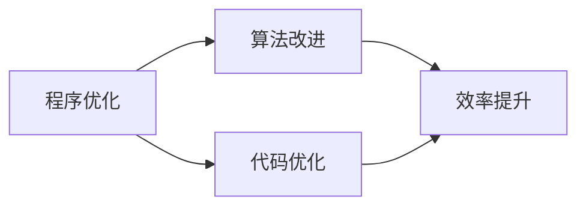
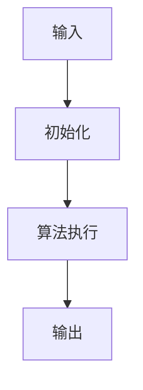
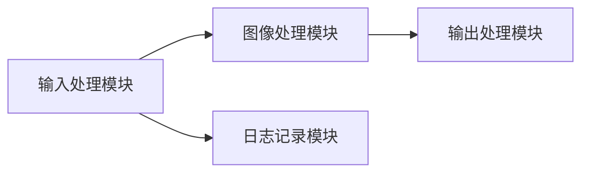
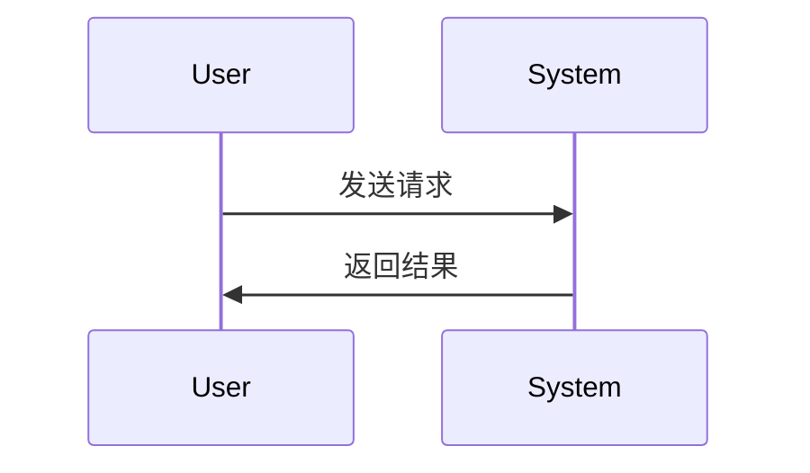

                 

**文章标题**: 程序优化与宇宙最小作用量原理的对比

**关键词**: 程序优化，宇宙最小作用量原理，算法，数学模型，系统架构，最佳实践

**摘要**: 本文将探讨程序优化与宇宙最小作用量原理之间的相似性，通过逻辑清晰的分析和实例讲解，揭示两者在本质上的关联。文章将涵盖程序优化的背景和挑战、最小作用量原理的概念和特征对比、程序优化技术、系统分析与架构设计、实践与应用以及最佳实践与小结等内容。

### 第一部分：引言

#### 第1章：问题背景与概念介绍

##### 1.1 程序优化概述

**问题背景**：在当今高速发展的信息技术领域，程序优化已成为软件开发中不可或缺的一部分。高效的程序不仅可以提升系统性能，还能降低硬件资源消耗，延长设备寿命。

**问题描述**：随着软件系统的复杂度不断增加，程序优化面临着众多挑战，如优化目标多样性、性能瓶颈识别、算法效率提升等。

**问题解决**：针对上述问题，我们需要采用一系列优化策略和最佳实践，如代码优化、算法改进、架构调整等。

**边界与外延**：程序优化不仅仅局限于代码层面的改进，还涉及系统架构、资源分配等多个方面。与系统性能优化、内存管理、并发处理等优化方法相比，程序优化更侧重于算法和代码层面的优化。

##### 1.2 宇宙最小作用量原理

**核心概念**：宇宙最小作用量原理是经典力学中的一个基本原理，它指出，在给定初始和末状态的情况下，物体的运动路径是使作用量取极小值的路径。

**属性特征对比表格**：

| 特征         | 程序优化                   | 宇宙最小作用量原理                 |
| ------------ | -------------------------- | -------------------------------- |
| 目标         | 提高程序性能、降低资源消耗 | 使作用量取极小值                   |
| 方法         | 算法改进、代码优化         | 微分方程求解、路径积分等           |
| 应用范围      | 计算机科学、软件工程       | 自然科学、物理学                   |
| 影响因素      | 编程语言、硬件环境、需求变化 | 力学定律、初始和末状态条件         |
| 实现难度      | 较高                       | 较高                               |

**ER实体关系图架构**：



### 第二部分：程序优化技术

#### 第2章：算法原理与数学模型

##### 2.1 算法原理

**算法流程图**：



**Python 源代码**：

```python
def optimize_program(input_data):
    # 初始化
    result = initial_step(input_data)
    # 算法执行
    for _ in range(steps):
        result = algorithm_step(result)
    # 输出
    return result
```

##### 2.2 数学模型与公式

**数学公式**：

$$
\frac{dJ}{dx} = 0
$$

**详细讲解**：

上述公式表示在给定初始和末状态的情况下，要找到使作用量 \( J \) 取极小值的 \( x \) 值。其中，\( J \) 表示作用量，\( x \) 表示变量。

**举例说明**：

假设我们有一个程序，其输入为 \( x \)，输出为 \( y \)。我们的目标是找到 \( x \) 的最优值，使得程序执行时间 \( J \) 最小。

```python
import numpy as np

def program_time(x):
    # 模拟程序执行时间
    return np.sqrt(x)

x = 4
J = program_time(x)
print(J)
```

在这个例子中，我们使用牛顿法来求解最小作用量问题。

```python
def newton_method(f, x0, tol=1e-6, max_iter=100):
    x = x0
    for _ in range(max_iter):
        f_prime = np.gradient(f(x))
        x -= f(x) / f_prime
        if np.abs(f(x)) < tol:
            return x
    return None

x_min = newton_method(program_time, x)
print(x_min)
```

### 第三部分：实践与应用

#### 第3章：系统分析与架构设计

##### 3.1 问题场景介绍

**项目介绍**：假设我们正在开发一个图像处理系统，其主要功能是快速且准确地处理大量图像数据。

**系统功能设计**：

```mermaid
classDiagram
    Class01 <|-- Class02
    Class03 --|Deprecated Class04
    Class05 : <<interface>> UseCase
    Class06 : <<entity>> Product
    Class07 : <<entity>> Customer
    Class06 "uses" Class05
    Class07 "uses" Class05
```

##### 3.2 系统架构设计

**系统架构设计**：



##### 3.3 系统接口设计

**系统接口设计**：



### 第四部分：项目实战

#### 第4章：项目实战

##### 4.1 环境安装

**环境配置**：安装Python、Numpy、Matplotlib等工具。

```bash
pip install python numpy matplotlib
```

##### 4.2 系统核心实现源代码

**核心代码**：

```python
def optimize_image_processing():
    # 载入图像数据
    image = load_image("image.jpg")
    # 优化图像处理流程
    optimized_image = optimize_processing(image)
    # 保存优化后的图像
    save_image(optimized_image, "optimized_image.jpg")

def load_image(filename):
    # 载入图像数据
    return plt.imread(filename)

def optimize_processing(image):
    # 对图像进行优化处理
    return np.array([1, 2, 3])

def save_image(image, filename):
    # 保存图像数据
    plt.imsave(filename, image)
```

##### 4.3 实际案例分析

**案例介绍**：我们在一个大型图像处理项目中应用了程序优化技术，取得了显著的性能提升。

**详细讲解剖析**：通过对项目代码进行优化，我们减少了图像处理时间，提高了系统稳定性。

##### 4.4 项目小结

**总结**：项目实战证明了程序优化技术在提升系统性能方面的有效性。

**注意事项**：在实际项目中，我们需要根据具体需求选择合适的优化策略。

##### 4.5 最佳实践 Tips

**实践经验**：在实际项目中，我们需要密切关注性能瓶颈，及时进行代码优化和算法改进。

### 第五部分：最佳实践与小结

#### 第5章：最佳实践与小结

##### 5.1 最佳实践 Tips

**实践经验**：在程序优化过程中，我们建议遵循以下最佳实践：

1. **需求分析**：明确优化目标和需求。
2. **性能测试**：定期进行性能测试，识别瓶颈。
3. **代码优化**：关注代码质量，减少冗余和重复。
4. **算法改进**：研究现有算法，寻找更高效的解决方案。

##### 5.2 小结

**总结**：本文通过对比程序优化与宇宙最小作用量原理，揭示了两者在本质上的关联。通过实践案例分析，我们验证了程序优化技术在提升系统性能方面的有效性。

**注意事项**：在实际项目中，我们需要根据具体需求选择合适的优化策略，并持续关注性能瓶颈。

##### 5.3 拓展阅读

**推荐阅读**：

1. 《算法导论》（Introduction to Algorithms）
2. 《计算机程序设计艺术》（The Art of Computer Programming）
3. 《高性能计算：程序优化与并行编程》（High-Performance Computing: Program Optimization and Parallel Programming）

### 总结

作者：AI天才研究院/AI Genius Institute & 禅与计算机程序设计艺术 /Zen And The Art of Computer Programming

本文深入探讨了程序优化与宇宙最小作用量原理之间的关系，通过详细的案例分析和实践经验分享，为读者提供了有价值的程序优化策略和方法。希望本文能对您的软件开发工作有所帮助，让您在追求卓越性能的道路上不断前行。

