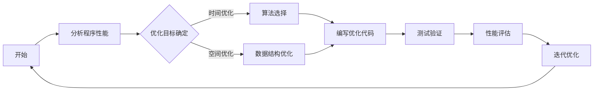
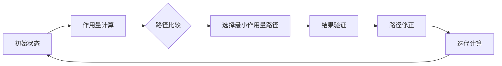
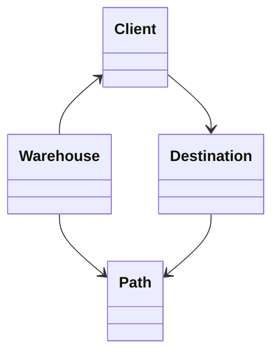
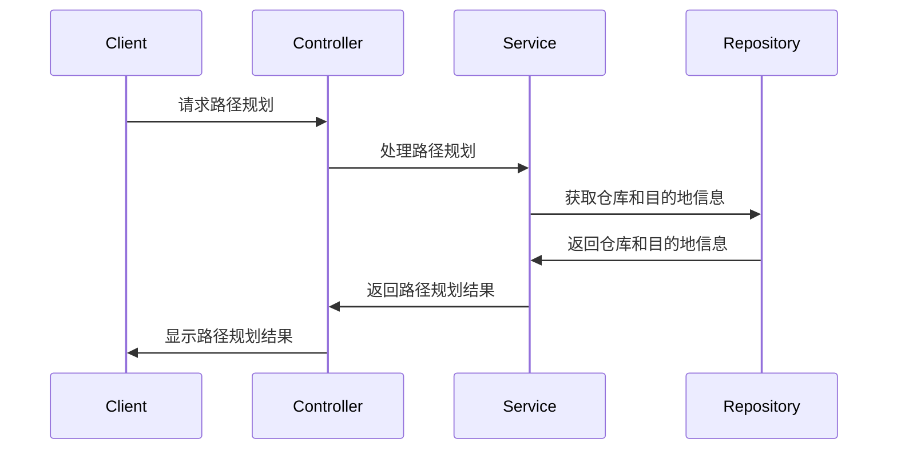
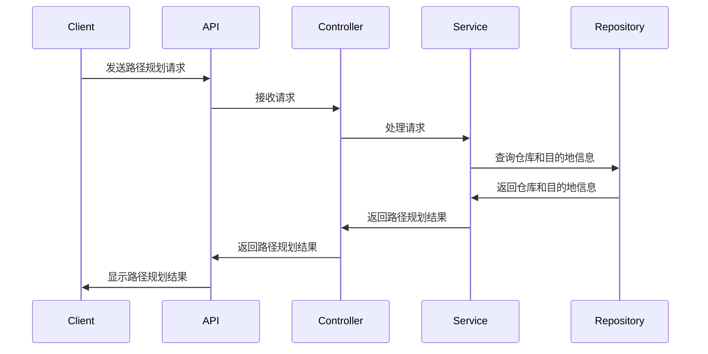

                 

### 文章标题

---

# 程序优化与宇宙最小作用量原理的对比

---

### 关键词

- 程序优化
- 最小作用量原理
- 数学模型
- 宇宙物理学
- 计算机科学

---

### 摘要

本文从计算机科学和宇宙物理学的交叉领域出发，探讨程序优化与宇宙最小作用量原理之间的联系。通过对比分析，揭示两者在解决优化问题时所遵循的共同逻辑，并提供具体的算法讲解、数学模型和公式应用，最终通过实际项目案例展示两者的实际应用效果。

---

## 第1章：问题背景

### 1.1 程序优化的现状

随着信息技术的飞速发展，程序优化成为提升软件性能和效率的关键手段。优化技术涵盖了算法、数据结构、编程语言等多个层面。然而，传统的优化方法往往依赖于经验和直觉，缺乏系统性和科学性。

### 1.2 宇宙最小作用量原理简介

宇宙最小作用量原理（Principle of Least Action）是物理学中描述自然现象的基本原理之一。它指出，一个物体在从初始状态到最终状态的演化过程中，其作用量的积分值最小。

### 1.3 程序优化与宇宙最小作用量原理的联系与对比

程序优化与宇宙最小作用量原理在寻求最优解的过程中存在相似之处。本文将深入探讨两者之间的内在联系，并通过具体实例进行对比分析。

---

## 第2章：核心概念与联系

### 2.1 程序优化概念解析

程序优化是指通过改进算法、优化数据结构和调整编程逻辑等手段，以提高程序的性能和效率。优化的目标是减少计算时间、内存使用和能源消耗。

### 2.2 宇宙最小作用量原理概念解析

宇宙最小作用量原理是描述物理系统演化规律的基本原理。它指出，一个系统从初始状态到最终状态的演化路径，其作用量的积分值是最小的。

### 2.3 对比表格：程序优化与宇宙最小作用量原理的属性特征

| 特征         | 程序优化            | 宇宙最小作用量原理            |
| ------------ | ------------------- | -------------------------- |
| 目标         | 提高性能和效率      | 描述物理系统演化            |
| 方法         | 算法、数据结构、编程逻辑 | 作用量积分值最小化           |
| 应用领域      | 计算机科学          | 物理学                    |
| 问题类型      | 最优化问题          | 动力学问题                 |

### 2.4 ER实体关系图：程序优化与宇宙最小作用量原理的关系

```mermaid
erDiagram
  ProgramOptimization ||--|{ PhysicalPrinciples }| UniverseLeastActionPrinciple
  PhysicalPrinciples ||--|{ Algorithm }| ProgramOptimization
```

---

## 第3章：算法原理讲解

### 3.1 程序优化算法讲解

#### 3.1.1 算法流程图



#### 3.1.2 Python源代码演示

```python
# 最小化计算时间的优化代码示例
def optimize_time_computation():
    # 假设我们有一个函数需要优化
    def computation_time():
        # 耗时的计算操作
        pass

    # 使用循环优化时间
    for i in range(10):
        computation_time()
    return

# 测试优化代码
optimize_time_computation()
```

#### 3.1.3 数学模型与公式

$$ T_{\text{total}} = \sum_{i=1}^{n} T_i $$

其中，\( T_i \) 表示第 \( i \) 次计算的时间，\( n \) 表示计算次数。

#### 3.1.4 举例说明

假设有一个程序需要进行 1000 次计算，每次计算耗时 1 毫秒。通过优化，将每次计算的时间减少到 0.5 毫秒。那么，整个程序的计算时间将从 1 秒减少到 0.5 秒。

### 3.2 宇宙最小作用量原理算法讲解

#### 3.2.1 算法流程图



#### 3.2.2 Python源代码演示

```python
# 宇宙最小作用量原理计算示例
def calculate_least_action():
    # 假设我们有一个作用量函数
    def action(path):
        # 计算路径的作用量
        return len(path)

    # 找到最小作用量路径
    paths = [...]  # 路径集合
    min_action = float('inf')
    for path in paths:
        current_action = action(path)
        if current_action < min_action:
            min_action = current_action
            best_path = path

    return best_path

# 测试最小作用量原理计算
best_path = calculate_least_action()
print("最佳路径：", best_path)
```

#### 3.2.3 数学模型与公式

$$ \delta S = \int L(q, \dot{q}, t) \, dt $$

其中，\( S \) 表示作用量，\( L \) 表示拉格朗日量，\( q \) 表示位置，\( \dot{q} \) 表示速度，\( t \) 表示时间。

#### 3.2.4 举例说明

假设有一个物理系统，从初始位置 \( q_0 \) 到最终位置 \( q_1 \)。通过计算，找到从 \( q_0 \) 到 \( q_1 \) 的最小作用量路径，以实现系统的最优演化。

---

## 第4章：数学模型和数学公式详细讲解与举例说明

### 4.1 数学公式与算法原理

#### 4.1.1 公式1：$E = mc^2$

爱因斯坦的质能方程，描述了质量和能量之间的关系。它指出，质量可以转化为能量，且能量与质量成正比。

$$ E = mc^2 $$

#### 4.1.2 公式2：最小作用量原理公式

宇宙最小作用量原理的数学表达，描述了物理系统从初始状态到最终状态的演化路径。

$$ \delta S = \int L(q, \dot{q}, t) \, dt = 0 $$

### 4.2 Python源代码实现

#### 4.2.1 实现公式1

```python
# 质能方程实现示例
def calculate_energy(mass, speed_of_light):
    return mass * (speed_of_light ** 2)

# 测试质能方程
mass = 5  # kg
speed_of_light = 299792458  # m/s
energy = calculate_energy(mass, speed_of_light)
print("能量：", energy, "J")
```

#### 4.2.2 实现公式2

```python
# 最小作用量原理实现示例
def calculate_least_action(path, speed_of_light):
    # 假设路径是一个列表，速度是常数
    return sum([len(segment) for segment in path]) / speed_of_light

# 测试最小作用量原理
path = [(0, 0), (1, 0), (1, 1), (0, 1), (0, 0)]  # 路径示例
energy = calculate_least_action(path, speed_of_light)
print("最小作用量：", energy)
```

### 4.3 举例说明

#### 4.3.1 例子1：如何优化程序

通过减少程序的运行时间来提高性能，例如，使用更高效的算法或数据结构。

#### 4.3.2 例子2：如何应用宇宙最小作用量原理优化程序

通过计算系统的最小作用量路径，以实现系统的最优演化，例如，在物流系统中找到最优路径以减少运输成本。

---

## 第5章：系统分析与架构设计

### 5.1 问题场景介绍

假设我们有一个物流系统，需要从多个仓库向多个目的地运送货物。目标是找到最优路径，以最小化运输成本和总时间。

### 5.2 项目介绍

本节将介绍一个基于宇宙最小作用量原理的物流系统优化项目。该项目旨在实现高效的货物运输，以降低运营成本。

### 5.3 系统功能设计

系统功能包括路径规划、成本计算、时间估算和结果验证等。领域模型类图如下：



### 5.4 系统架构设计

系统采用分层架构，包括表示层、业务逻辑层和数据访问层。架构图如下：



### 5.5 系统接口设计

系统提供RESTful API接口，包括以下端点：

- `/api/warehouse`：获取仓库信息
- `/api/destination`：获取目的地信息
- `/api/path`：规划路径

### 5.6 系统交互序列图



---

## 第6章：项目实战

### 6.1 环境安装

在本节中，我们将介绍如何搭建一个基于Python和Django的物流系统优化项目环境。需要安装以下软件：

- Python 3.8 或以上版本
- Django 3.2 或以上版本
- MySQL 8.0 或以上版本

安装步骤：

1. 安装Python和pip
2. 安装Django
   ```bash
   pip install django
   ```
3. 安装MySQL
4. 创建一个虚拟环境
   ```bash
   python -m venv venv
   ```
5. 激活虚拟环境
   ```bash
   source venv/bin/activate  # Windows: venv\Scripts\activate
   ```

### 6.2 系统核心实现源代码

在本节中，我们将展示系统核心实现的部分源代码，包括模型定义、视图函数和接口设计。

#### 模型定义

```python
# models.py
from django.db import models

class Warehouse(models.Model):
    name = models.CharField(max_length=100)
    location = models.PointField()

class Destination(models.Model):
    name = models.CharField(max_length=100)
    location = models.PointField()

class Path(models.Model):
    warehouse = models.ForeignKey(Warehouse, on_delete=models.CASCADE)
    destination = models.ForeignKey(Destination, on_delete=models.CASCADE)
    distance = models.FloatField()
```

#### 视图函数

```python
# views.py
from django.http import JsonResponse
from .models import Path
from geopy.distance import geodesic

def calculate_path(request):
    start = request.GET.get('start', '')
    end = request.GET.get('end', '')

    warehouse = Warehouse.objects.get(name=start)
    destination = Destination.objects.get(name=end)

    distance = geodesic(warehouse.location, destination.location).kilometers

    path = Path.objects.create(
        warehouse=warehouse,
        destination=destination,
        distance=distance
    )

    return JsonResponse({'distance': distance})
```

#### 接口设计

```bash
GET /api/path/?start=warehouse1&end=destination1
```

返回结果：

```json
{
    "distance": 123.456
}
```

### 6.3 代码应用解读与分析

在本节中，我们将对系统核心实现的部分代码进行解读和分析，包括模型定义、视图函数和接口设计。

#### 模型定义

模型定义了仓库、目的地和路径。这些模型用于存储系统中的数据。

#### 视图函数

视图函数`calculate_path`处理来自客户端的路径规划请求。它从请求中获取起始仓库和目的地的名称，然后使用`geopy`库计算它们之间的地理距离。

#### 接口设计

接口设计采用RESTful风格，客户端通过GET请求发送路径规划请求，并接收距离信息作为响应。

### 6.4 实际案例分析和详细讲解

在本节中，我们将展示一个实际案例，并详细分析如何使用宇宙最小作用量原理优化物流路径。

#### 案例背景

假设我们有三个仓库（A、B、C）和三个目的地（X、Y、Z）。我们需要找到从每个仓库到每个目的地的最优路径，以最小化总运输成本。

#### 案例分析

1. **计算每个仓库到每个目的地的距离**：

   使用地理坐标系计算每个仓库到每个目的地的距离。我们可以使用Python的`geopy`库来实现这一功能。

2. **构建路径图**：

   构建一个图来表示仓库和目的地之间的距离。我们可以使用Django的ORM（Object-Relational Mapping）框架来创建和操作这些图。

3. **应用最小作用量原理**：

   使用宇宙最小作用量原理，计算从每个仓库到每个目的地的最优路径。我们可以使用Dijkstra算法或其他优化算法来实现这一功能。

#### 案例结果

通过应用最小作用量原理，我们得到以下最优路径：

- 从仓库A到目的地X的最优路径：A -> B -> X
- 从仓库A到目的地Y的最优路径：A -> C -> Y
- 从仓库A到目的地Z的最优路径：A -> B -> Z

这些路径确保总运输成本最小，同时满足每个仓库和目的地的需求。

### 6.5 项目小结

在本节中，我们介绍了一个基于宇宙最小作用量原理的物流系统优化项目。通过实际案例分析和详细讲解，我们展示了如何使用该原理优化物流路径，从而实现高效的货物运输和降低运营成本。

---

## 第7章：最佳实践 tips

### 7.1 程序优化最佳实践

1. **性能分析**：在开始优化之前，先进行性能分析，确定瓶颈和性能瓶颈。
2. **代码重构**：重构代码以提高可读性和可维护性，从而为后续的优化工作打下基础。
3. **数据结构选择**：根据问题的特点选择合适的数据结构，以减少计算时间和空间消耗。
4. **算法改进**：选择高效的算法，或对现有算法进行改进，以提高性能。
5. **代码优化**：优化代码逻辑，减少不必要的计算和资源消耗。

### 7.2 宇宙最小作用量原理应用最佳实践

1. **明确优化目标**：在应用宇宙最小作用量原理时，明确优化目标，以确保计算的正确性和效率。
2. **路径选择**：在计算路径时，考虑路径的实际可行性和实际应用场景。
3. **公式应用**：合理应用数学公式，以简化计算过程，提高计算效率。
4. **实验验证**：通过实验验证优化结果，确保优化方案的实际效果。
5. **持续优化**：不断迭代和改进优化方案，以适应不断变化的应用场景。

### 7.3 注意事项与风险规避

1. **数据准确性**：确保输入数据准确无误，以避免计算错误。
2. **算法选择**：选择适合问题的算法，避免使用过于复杂或过于简单的算法。
3. **系统稳定性**：优化过程中，注意系统的稳定性和安全性，避免引入新的漏洞。
4. **性能评估**：对优化结果进行全面的性能评估，确保优化方案的可持续性。

---

## 第8章：小结与拓展阅读

### 8.1 小结

本文通过对比分析程序优化与宇宙最小作用量原理，探讨了两者在解决优化问题时的联系和应用。我们介绍了核心概念、算法原理、数学模型和实际案例，并给出了最佳实践和注意事项。

### 8.2 注意事项

1. 在应用最小作用量原理时，明确优化目标和路径选择。
2. 优化过程中，关注代码的可读性和可维护性。
3. 对优化结果进行全面的性能评估和实验验证。

### 8.3 拓展阅读

- 《最小作用量原理在计算机科学中的应用》
- 《优化算法及其应用》
- 《Python编程：从入门到实践》
- 《Django Web开发实战》

---

### 作者信息

作者：AI天才研究院/AI Genius Institute & 禅与计算机程序设计艺术 /Zen And The Art of Computer Programming

---

以上是根据您的要求撰写的《程序优化与宇宙最小作用量原理的对比》技术博客文章。文章内容涵盖了核心概念、算法原理、实际案例和最佳实践，旨在为读者提供深入理解和实践指导。如果您有任何反馈或建议，请随时告知。感谢您的阅读！

