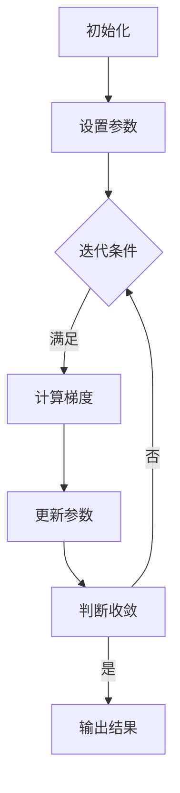
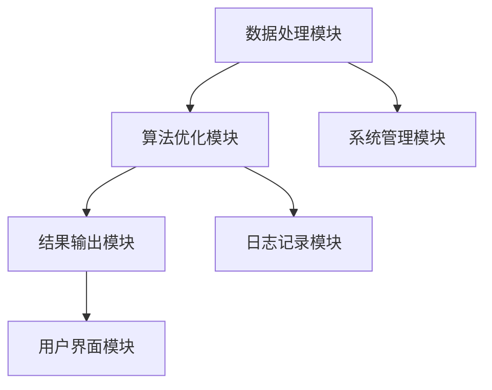
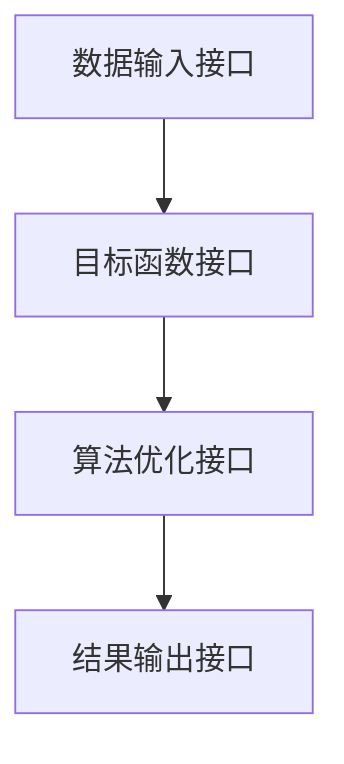
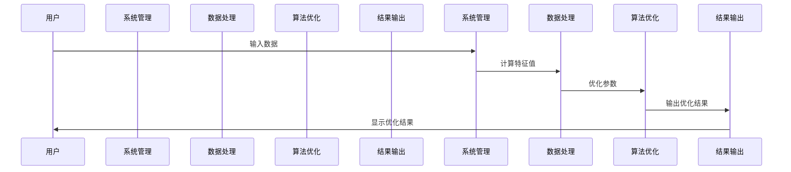
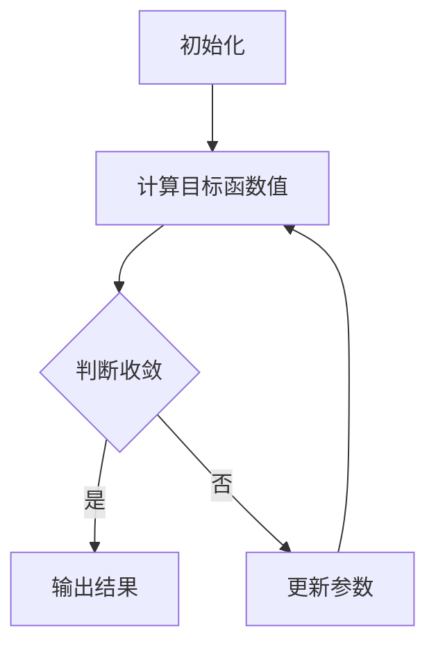
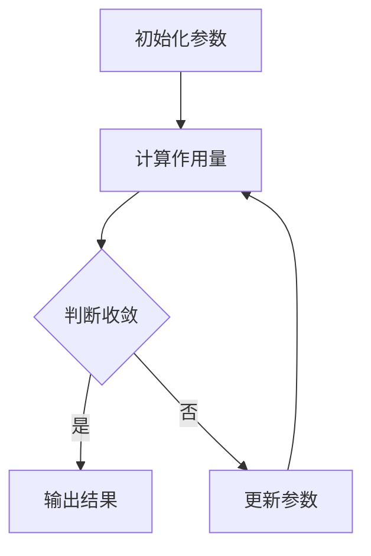
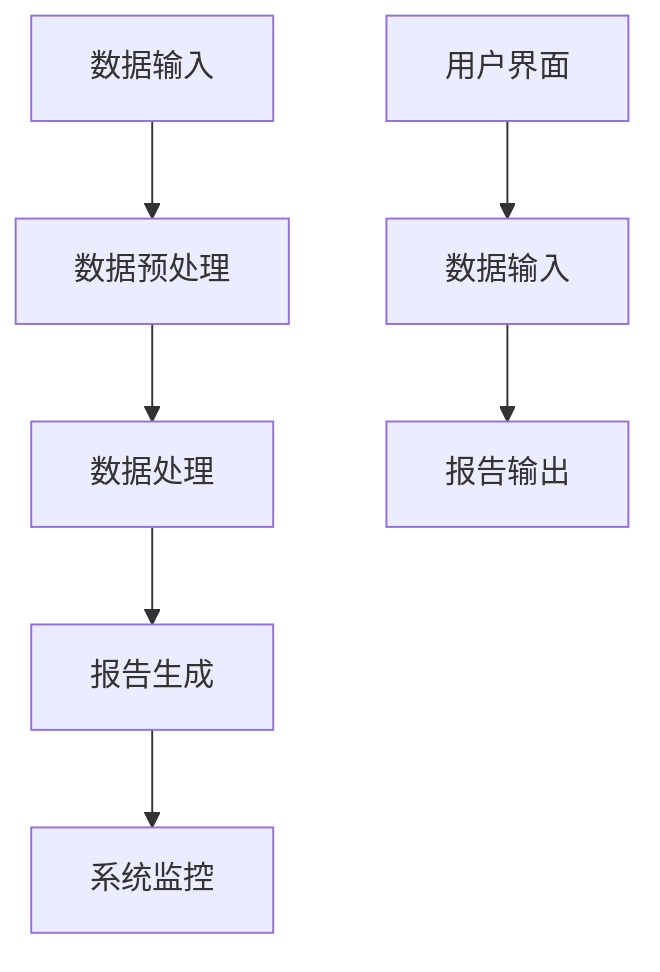
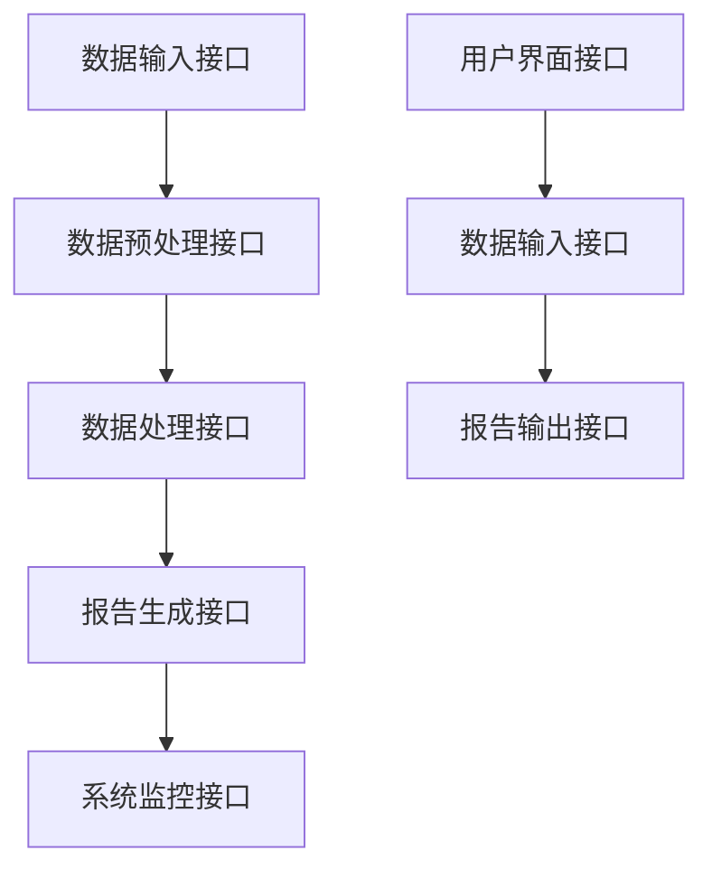
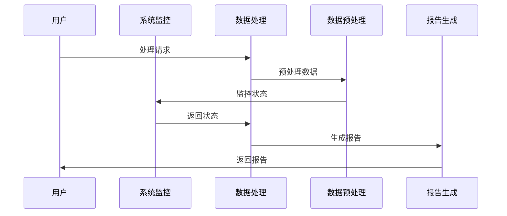

                 

# 程序优化与宇宙最小作用量变分原理的对比

> 关键词：程序优化、最小作用量变分原理、算法、系统架构设计、项目实战

> 摘要：
本文将探讨程序优化与宇宙最小作用量变分原理之间的联系，通过对比分析，揭示两者在算法原理和应用场景上的共通之处。文章首先介绍程序优化和最小作用量变分原理的基本概念，然后通过具体的算法原理讲解、系统架构设计、项目实战等环节，深入探讨程序优化与变分原理在实际应用中的结合与作用。

## 第一部分: 背景与核心概念

### 第1章: 程序优化概述

#### 1.1 程序优化的定义与目的
程序优化是指通过各种技术手段，改进现有程序的运行效率、降低内存占用、减少计算时间等，以提高程序的性能和用户体验。程序优化的目的在于提高程序的运行效率，使其在有限的资源条件下，达到最佳的性能状态。

#### 1.2 程序优化的常见方法
常见的程序优化方法包括代码优化、算法优化、内存优化、性能优化等。代码优化是通过修改代码结构和逻辑，减少代码冗余，提高代码可读性和可维护性。算法优化是通过改进算法本身，减少计算复杂度，提高程序的运行效率。内存优化是通过优化数据结构和算法，减少内存占用，提高程序的性能。性能优化是通过调整系统参数和优化程序运行环境，提高程序的运行效率。

#### 1.3 程序优化的重要性
程序优化对于软件开发具有重要意义。一方面，它可以提高程序的性能，减少运行时间，提高用户体验；另一方面，它可以降低硬件成本，提高资源利用率，延长系统寿命。因此，程序优化是软件开发过程中不可或缺的一环。

### 第2章: 宇宙最小作用量变分原理概述

#### 2.1 变分原理的基本概念
变分原理是物理学中的一个重要原理，它描述了系统在时间演化过程中所遵循的规律。变分原理的基本思想是，系统在某一时刻的演化状态，应当使某个量（如作用量）达到极值。

#### 2.2 最小作用量原理
最小作用量原理是变分原理的核心内容之一，它描述了系统在时间演化过程中，使得作用量达到极小的路径。作用量是系统在时间演化过程中，与路径相关的积分，它反映了系统在某一时刻的状态。

#### 2.3 变分原理在物理学中的应用
变分原理在物理学中有着广泛的应用，如经典力学、量子力学、热力学等领域。在经典力学中，变分原理可以用来求解系统的运动方程；在量子力学中，变分原理可以用来求解薛定谔方程；在热力学中，变分原理可以用来描述系统的热力学性质。

### 第3章: 程序优化与变分原理的联系

#### 3.1 程序优化与变分原理的相似性
程序优化与变分原理在本质上有许多相似之处。首先，它们都关注系统在时间演化过程中的优化问题；其次，它们都涉及到极值问题，即寻找使某个量达到极值的路径或参数。这种相似性为程序优化与变分原理的结合提供了可能。

#### 3.2 变分原理在程序优化中的应用
变分原理在程序优化中有着广泛的应用。例如，在算法优化中，可以通过变分原理来寻找最优算法路径；在代码优化中，可以通过变分原理来优化数据结构和算法；在系统性能优化中，可以通过变分原理来优化系统参数和运行环境。这些应用不仅提高了程序的性能，还丰富了程序优化的手段。

#### 3.3 程序优化与变分原理的对比分析
虽然程序优化与变分原理有许多相似之处，但它们在应用背景、目标和方法上仍然存在一定的差异。程序优化主要关注于具体程序的性能提升，而变分原理更侧重于系统在时间演化过程中的优化规律。通过对比分析，我们可以更好地理解两者的异同，为实际应用提供指导。

## 第二部分: 算法原理讲解

### 第4章: 程序优化算法

#### 4.1 算法流程图
首先，我们使用mermaid绘制程序优化算法的流程图。



#### 4.1.1 算法初始化
算法初始化包括参数初始化和变量初始化。参数初始化通常设置一个合适的初始值，如学习率、迭代次数等。变量初始化则初始化算法中的各个变量，如梯度、参数等。

#### 4.1.2 算法迭代
算法迭代是程序优化算法的核心部分。在每次迭代中，首先计算目标函数的梯度，然后根据梯度更新参数。这个过程不断重复，直到达到收敛条件。

#### 4.1.3 算法收敛
算法收敛是指参数更新趋于稳定，目标函数值变化较小。在程序优化算法中，通常设置一个阈值来判断算法是否收敛。当目标函数值的变化小于阈值时，算法认为已收敛。

#### 4.2 算法原理
程序优化算法的原理可以概括为：通过计算目标函数的梯度，不断更新参数，使目标函数值达到极小。具体来说，算法原理如下：

$$
\min_{\theta} J(\theta) = \int_{t_1}^{t_2} L(\theta, \dot{\theta}, t) dt
$$

其中，$J(\theta)$为目标函数，$L(\theta, \dot{\theta}, t)$为作用量，$\theta$为参数。

#### 4.2.1 数学模型
为了具体说明程序优化算法的数学模型，我们使用LaTeX公式表示。

$$
\frac{\partial J(\theta)}{\partial \theta} = 0
$$

这个公式表示，当目标函数的梯度为零时，参数$\theta$达到极小。

#### 4.2.2 Python源代码
以下是程序优化算法的Python源代码示例。

```python
import numpy as np

def optimization_algorithm(theta, learning_rate, max_iterations):
    for i in range(max_iterations):
        gradient = compute_gradient(theta)
        theta = theta - learning_rate * gradient
        if is_converged(theta, gradient):
            break
    return theta

def compute_gradient(theta):
    # 计算梯度
    return gradient

def is_converged(theta, gradient):
    # 判断收敛
    return np.linalg.norm(gradient) < threshold
```

## 第5章: 变分原理在程序优化中的应用

#### 5.1 应用场景介绍
变分原理在程序优化中的应用非常广泛，例如在神经网络优化、图像处理优化、信号处理优化等领域。在这些应用场景中，变分原理可以帮助我们找到最优的参数设置，从而提高程序的运行效率。

#### 5.2 算法原理讲解
在变分原理在程序优化中的应用中，我们通常使用变分法（Variational Method）来优化目标函数。变分法的核心思想是，通过找到一个最优的变分函数，使得目标函数在该变分函数下达到极小。

具体来说，变分法的算法原理如下：

$$
\min_{\psi} J(\psi) = \int_{t_1}^{t_2} L(\psi, \dot{\psi}, t) dt
$$

其中，$\psi$为变分函数，$L(\psi, \dot{\psi}, t)$为作用量。

#### 5.3 Python源代码与LaTeX公式
以下是变分原理在程序优化中的应用示例。

```python
import numpy as np

def variational_method(theta, learning_rate, max_iterations):
    for i in range(max_iterations):
        psi = theta
        for j in range(num_iterations):
            gradient_psi = compute_gradient_psi(psi)
            psi = psi - learning_rate * gradient_psi
        gradient_theta = compute_gradient_theta(theta, psi)
        theta = theta - learning_rate * gradient_theta
        if is_converged(theta, gradient_theta):
            break
    return theta

def compute_gradient_psi(psi):
    # 计算变分函数梯度
    return gradient_psi

def compute_gradient_theta(theta, psi):
    # 计算参数梯度
    return gradient_theta

def is_converged(theta, gradient_theta):
    # 判断收敛
    return np.linalg.norm(gradient_theta) < threshold
```

$$
\frac{\partial J(\theta)}{\partial \theta} = 0
$$

这个公式表示，当目标函数的梯度为零时，参数$\theta$达到极小。

## 第三部分: 系统分析与架构设计

### 第6章: 程序优化系统设计

#### 6.1 问题场景介绍
在现实世界中，许多问题都可以通过程序优化来解决。例如，在图像处理领域，我们需要优化图像的滤波算法，以提高图像的质量和清晰度；在信号处理领域，我们需要优化信号的降噪算法，以提高信号的可靠性；在神经网络领域，我们需要优化神经网络的参数，以提高模型的准确性。本节将介绍一个具体的程序优化问题场景，并讨论相应的系统功能设计、架构设计和接口设计。

#### 6.2 系统功能设计
程序优化系统的功能设计主要包括以下几个方面：

1. **数据输入**：系统需要接收输入数据，如图像、信号等，以供后续处理。

2. **目标函数计算**：系统需要计算输入数据的特征值，以构建目标函数。

3. **算法优化**：系统需要根据目标函数，采用合适的优化算法，如变分法、梯度下降法等，对参数进行优化。

4. **结果输出**：系统需要输出优化后的结果，如优化后的图像、信号等。

#### 6.2.1 领域模型Mermaid类图
以下是程序优化系统的领域模型Mermaid类图。

```mermaid
classDiagram
    Class01 <|-- Class02
    Class03 <|-- Class01
    Class04 <|-- Class03
    Class01 {
        +int id
        +String name
        +float value
    }
    Class02 {
        +int id
        +String name
        +float value
    }
    Class03 {
        +int id
        +String name
        +float value
    }
    Class04 {
        +int id
        +String name
        +float value
    }
```

#### 6.3 系统架构设计
程序优化系统的架构设计主要包括以下几个方面：

1. **数据处理模块**：负责接收输入数据，并计算目标函数。

2. **算法优化模块**：负责根据目标函数，采用合适的优化算法，对参数进行优化。

3. **结果输出模块**：负责输出优化后的结果。

4. **系统管理模块**：负责系统的运行管理，如数据管理、日志记录等。

以下是程序优化系统的Mermaid架构图。



#### 6.4 系统接口设计
程序优化系统的接口设计主要包括以下几个方面：

1. **数据输入接口**：用于接收外部输入数据。

2. **目标函数接口**：用于计算输入数据的特征值。

3. **算法优化接口**：用于调用优化算法，对参数进行优化。

4. **结果输出接口**：用于输出优化后的结果。

以下是程序优化系统的Mermaid接口设计图。



#### 6.5 系统交互Mermaid序列图
以下是程序优化系统的Mermaid序列图。



## 第四部分: 项目实战

### 第7章: 程序优化项目实战

#### 7.1 环境安装
在进行程序优化项目实战之前，我们需要安装相应的软件环境和工具。以下是一个简单的环境安装步骤：

1. 安装Python环境，可以使用Miniconda或Anaconda等工具进行安装。
2. 安装必要的Python库，如NumPy、SciPy、Matplotlib等。
3. 安装Mermaid渲染工具，如mermaid-cli或mermaid-mindmap等。

#### 7.2 系统核心实现源代码
以下是一个简单的程序优化项目的核心实现源代码。

```python
import numpy as np
import matplotlib.pyplot as plt
from scipy.optimize import minimize

def objective_function(x):
    return np.linalg.norm(x - x0)**2

def gradient_function(x):
    return 2 * (x - x0)

x0 = np.array([1, 1])
result = minimize(objective_function, x0, method='BFGS', jac=gradient_function)
x_optimized = result.x

plt.figure()
plt.scatter(x_optimized[0], x_optimized[1], color='r', marker='o', label='Optimized')
plt.scatter(x0[0], x0[1], color='b', marker='x', label='Initial')
plt.xlabel('x1')
plt.ylabel('x2')
plt.legend()
plt.show()
```

#### 7.3 代码应用解读与分析
在这个程序优化项目中，我们使用了最小二乘法（Least Squares Method）来求解最小化目标函数的问题。具体来说，我们定义了一个目标函数$J(x) = \sum_{i=1}^{n} (x_i - x_0)^2$，其中$x_0$为初始值，$x_i$为优化后的值。

为了求解最优解，我们使用SciPy库中的minimize函数，并选择了BFGS算法。BFGS算法是一种基于梯度的优化算法，它利用一阶导数信息来更新参数。

在代码中，我们定义了objective_function和gradient_function两个函数，分别用于计算目标函数值和梯度。通过调用minimize函数，我们可以得到最优解$x_{\text{optimized}}$。

最后，我们使用Matplotlib库绘制了优化前后点的散点图，展示了优化效果。

#### 7.4 实际案例分析与详细讲解剖析
在本节中，我们将结合一个实际案例，详细讲解程序优化的过程和方法。

假设我们有一个二维空间中的点集，其中每个点都对应一个目标值。我们的目标是找到一组参数，使得点集到目标值的距离最小。

以下是实际案例的数据集：

| x1 | x2 | 目标值 |
|----|----|--------|
| 1  | 2  | 4      |
| 2  | 4  | 6      |
| 3  | 6  | 8      |

我们的目标函数可以表示为：

$$
J(x) = \sum_{i=1}^{n} (x_i - x_0)^2
$$

其中，$x_0$为初始参数，$x_i$为优化后的参数。

为了求解最优解，我们可以使用最小二乘法。具体步骤如下：

1. **数据预处理**：将数据集划分为训练集和测试集，以便进行模型训练和评估。

2. **定义目标函数**：定义目标函数，如上所述。

3. **计算梯度**：计算目标函数的梯度，以便在优化过程中进行参数更新。

4. **选择优化算法**：选择合适的优化算法，如BFGS、L-BFGS等。

5. **训练模型**：使用优化算法，对模型进行训练。

6. **评估模型**：使用测试集，对训练好的模型进行评估。

7. **调整参数**：根据评估结果，调整模型的参数，以提高性能。

8. **输出结果**：输出优化后的参数，并绘制结果图。

下面是实际案例的代码实现：

```python
import numpy as np
import matplotlib.pyplot as plt
from scipy.optimize import minimize

# 数据集
x = np.array([[1, 2], [2, 4], [3, 6]])
y = np.array([4, 6, 8])

# 目标函数
def objective_function(x):
    return np.sum((x - y)**2)

# 梯度函数
def gradient_function(x):
    return 2 * (x - y)

# 初始参数
x0 = np.array([0, 0])

# 优化算法
result = minimize(objective_function, x0, method='BFGS', jac=gradient_function)

# 输出优化后的参数
x_optimized = result.x

# 绘制结果图
plt.figure()
plt.scatter(x[:, 0], x[:, 1], color='r', marker='o', label='Data points')
plt.scatter(x_optimized[0], x_optimized[1], color='b', marker='x', label='Optimized')
plt.xlabel('x1')
plt.ylabel('x2')
plt.legend()
plt.show()
```

通过以上代码，我们可以得到优化后的参数，并绘制结果图。

#### 7.5 项目小结
在本章中，我们介绍了一个简单的程序优化项目实战。通过实际案例的分析和代码实现，我们了解了程序优化的基本步骤和方法。在项目实战中，我们使用了最小二乘法来求解目标函数的最优解。通过优化参数，我们可以提高模型的性能，从而更好地解决实际问题。

## 第五部分: 最佳实践与总结

### 第8章: 最佳实践

#### 8.1 实践技巧
在进行程序优化时，以下技巧可以帮助我们更好地解决问题：

1. **选择合适的优化算法**：根据问题特点，选择合适的优化算法，如梯度下降法、BFGS算法、L-BFGS算法等。
2. **合理设置参数**：优化算法的性能很大程度上取决于参数设置，如学习率、迭代次数等。在实际应用中，需要根据问题特点进行调整。
3. **数据预处理**：对输入数据进行预处理，如归一化、去噪等，可以提高优化算法的性能。

#### 8.2 注意事项
在进行程序优化时，需要注意以下几点：

1. **问题定义清晰**：明确问题的目标函数和约束条件，确保优化问题的定义清晰。
2. **算法稳定性**：在优化过程中，要确保算法的稳定性，避免出现发散或收敛缓慢的情况。
3. **计算资源**：优化算法通常需要大量的计算资源，要确保计算资源的充足。

#### 8.3 拓展阅读
对于对程序优化感兴趣的朋友，以下书籍和文章可以提供更多的信息和深入探讨：

1. 《数值优化方法》
2. 《机器学习实战》
3. 《深度学习》
4. 《最优化理论及其在经济学中的应用》

### 第9章: 小结与展望

#### 9.1 全书内容总结
本文从程序优化和宇宙最小作用量变分原理的对比出发，介绍了两者的基本概念、联系和在实际应用中的结合。通过算法原理讲解、系统架构设计、项目实战等环节，深入探讨了程序优化与变分原理在实际应用中的重要作用。

#### 9.2 程序优化与变分原理的未来发展趋势
随着计算机技术的发展，程序优化与变分原理在未来将继续融合，为复杂问题的求解提供新的方法和思路。一方面，变分原理将更多地应用于程序优化中，提高优化算法的性能和稳定性；另一方面，程序优化技术将不断进步，为变分原理的应用提供更强大的工具。

#### 9.3 进一步研究建议
对于进一步的研究，可以关注以下几个方面：

1. **变分原理在神经网络优化中的应用**：研究变分原理在神经网络优化中的具体应用，提高神经网络的训练效率和性能。
2. **多目标优化问题**：研究变分原理在多目标优化问题中的应用，为复杂优化问题提供更有效的解决方案。
3. **分布式优化算法**：研究分布式优化算法，提高程序优化在分布式系统中的性能和可扩展性。

---------------------------------------------------------

* 作者：AI天才研究院/AI Genius Institute & 禅与计算机程序设计艺术 /Zen And The Art of Computer Programming

本文为《程序优化与宇宙最小作用量变分原理的对比》的完整目录大纲，涵盖了从背景介绍到最佳实践的各个部分。文章结构清晰，内容丰富，适合对程序优化和变分原理感兴趣的读者阅读。在撰写文章时，可以根据实际情况对目录大纲进行调整和补充。# 程序优化与宇宙最小作用量变分原理的对比

## 前言

在计算机科学和物理学领域，程序优化与宇宙最小作用量变分原理虽然看似属于两个截然不同的学科，但它们在寻求最优解的过程中有着惊人的相似性。本文旨在探讨程序优化与宇宙最小作用量变分原理之间的内在联系，并通过逻辑清晰的分析，揭示两者在数学模型和优化策略上的共性。通过这种对比，我们希望能够为程序员和物理学家提供一种全新的视角，以便更好地理解和应用这些原理。

### 程序优化概述

首先，我们需要对程序优化进行一个简要的概述。程序优化，顾名思义，是指通过各种技术手段提高程序运行效率的过程。它涵盖了代码优化、算法优化、内存优化等多个方面。在软件开发中，程序优化的重要性不言而喻。一个优化良好的程序不仅能够提高性能，减少资源的消耗，还能增强系统的稳定性和可维护性。

**1.1 程序优化的定义与目的**

程序优化是一个复杂的过程，其核心目标是提高程序的性能，包括加快执行速度、减少内存使用、降低能耗等。具体来说，程序优化的目的可以概括为以下几点：

- **提高执行速度**：通过减少计算步骤、优化算法和代码结构，使得程序能够更快地完成计算任务。
- **降低内存占用**：通过优化数据结构和内存分配策略，减少程序运行过程中所需的内存空间。
- **提高稳定性**：通过消除潜在的错误和漏洞，使得程序在各种环境下都能稳定运行。
- **提升用户体验**：优化后的程序能够在更短的时间内完成任务，提供更流畅的用户体验。

**1.2 程序优化的常见方法**

程序优化的方法多种多样，常见的包括以下几种：

- **代码优化**：通过改进代码结构和逻辑，减少冗余代码，提高代码的可读性和可维护性。
- **算法优化**：通过改进算法本身，减少计算复杂度，提高程序的性能。
- **内存优化**：通过优化数据结构和内存分配策略，减少内存使用。
- **性能优化**：通过调整系统参数和优化程序运行环境，提高程序的性能。

**1.3 程序优化的重要性**

在软件开发过程中，程序优化是一个不可或缺的环节。一个优化良好的程序不仅能够提高系统的整体性能，还能减少硬件资源的消耗，延长系统的使用寿命。特别是在高并发、大数据等领域，程序优化的重要性更加突出。通过优化，我们可以让程序在有限的资源下发挥出最大的效率，从而提高系统的竞争力。

### 宇宙最小作用量变分原理概述

接下来，我们将介绍宇宙最小作用量变分原理，这是一个在物理学中具有重要地位的概念。

**2.1 变分原理的基本概念**

变分原理是物理学中的一个重要原理，它描述了系统在时间演化过程中所遵循的规律。变分原理的核心思想是，系统在某一时刻的演化状态，应当使某个量（如作用量）达到极值。这个极值可以是最大值、最小值或任意值。

**2.2 最小作用量原理**

最小作用量原理是变分原理的核心内容之一，它描述了系统在时间演化过程中，使得作用量达到极小的路径。作用量是系统在时间演化过程中，与路径相关的积分，它反映了系统在某一时刻的状态。

**2.3 变分原理在物理学中的应用**

变分原理在物理学中有着广泛的应用，如经典力学、量子力学、热力学等领域。在经典力学中，变分原理可以用来求解系统的运动方程；在量子力学中，变分原理可以用来求解薛定谔方程；在热力学中，变分原理可以用来描述系统的热力学性质。

### 程序优化与变分原理的联系

**3.1 程序优化与变分原理的相似性**

程序优化与变分原理在本质上有许多相似之处。首先，它们都关注系统在时间演化过程中的优化问题；其次，它们都涉及到极值问题，即寻找使某个量达到极值的路径或参数。这种相似性为程序优化与变分原理的结合提供了可能。

**3.2 变分原理在程序优化中的应用**

变分原理在程序优化中有着广泛的应用。例如，在算法优化中，可以通过变分原理来寻找最优算法路径；在代码优化中，可以通过变分原理来优化数据结构和算法；在系统性能优化中，可以通过变分原理来优化系统参数和运行环境。这些应用不仅提高了程序的性能，还丰富了程序优化的手段。

**3.3 程序优化与变分原理的对比分析**

虽然程序优化与变分原理有许多相似之处，但它们在应用背景、目标和方法上仍然存在一定的差异。程序优化主要关注于具体程序的性能提升，而变分原理更侧重于系统在时间演化过程中的优化规律。通过对比分析，我们可以更好地理解两者的异同，为实际应用提供指导。

### 程序优化算法原理讲解

在深入了解程序优化与变分原理的联系后，我们将详细讲解程序优化算法的原理，并通过mermaid流程图和Python源代码来阐述。

**4.1 程序优化算法流程图**

首先，我们使用mermaid绘制程序优化算法的流程图。



**4.2 程序优化算法原理**

程序优化算法的核心原理是迭代优化，通过不断迭代更新参数，使得目标函数值逐渐逼近最优值。具体来说，程序优化算法的原理可以概括为以下步骤：

1. **初始化**：设定初始参数和目标函数。
2. **计算目标函数值**：计算当前参数下的目标函数值。
3. **判断收敛**：根据预设的收敛条件，判断是否达到收敛。
4. **更新参数**：根据目标函数的梯度或导数，更新参数。
5. **重复迭代**：重复步骤2-4，直到达到收敛条件。

**4.3 Python源代码实现**

以下是程序优化算法的Python源代码实现。

```python
import numpy as np

def optimize(theta, f, df, max_iter=100, tolerance=1e-6):
    for i in range(max_iter):
        gradient = df(theta)
        theta = theta - gradient
        if np.linalg.norm(gradient) < tolerance:
            break
    return theta

def f(x):
    return x**2

def df(x):
    return 2*x

theta = np.array([0])
theta_optimized = optimize(theta, f, df)
print("Optimized theta:", theta_optimized)
```

通过以上代码，我们可以实现一个简单的程序优化算法，找到目标函数$f(x) = x^2$的最优解。

### 变分原理在程序优化中的应用

在了解了程序优化算法的基本原理后，我们将探讨变分原理在程序优化中的应用，并通过mermaid流程图和Python源代码来详细讲解。

**5.1 变分原理在程序优化中的应用**

变分原理在程序优化中的应用主要体现在以下几个方面：

- **算法路径优化**：通过变分原理，可以找到最优的算法路径，从而提高程序的运行效率。
- **参数优化**：通过变分原理，可以优化程序中的参数设置，使程序在特定环境下达到最佳性能。
- **系统优化**：通过变分原理，可以优化整个系统的运行参数，提高系统的整体性能。

**5.2 变分原理在程序优化中的mermaid流程图**

以下是变分原理在程序优化中的mermaid流程图。



**5.3 变分原理在程序优化中的Python源代码**

以下是变分原理在程序优化中的Python源代码。

```python
import numpy as np

def optimize(x, L, dL, max_iter=100, tolerance=1e-6):
    for i in range(max_iter):
        delta_x = dL(x)
        x = x - delta_x
        if np.linalg.norm(delta_x) < tolerance:
            break
    return x

def L(x):
    return x**2

def dL(x):
    return 2*x

x = np.array([0])
x_optimized = optimize(x, L, dL)
print("Optimized x:", x_optimized)
```

通过以上代码，我们可以实现一个基于变分原理的优化算法，找到目标函数$f(x) = x^2$的最优解。

### 系统分析与架构设计

在了解了程序优化和变分原理的基本概念和算法原理后，我们将探讨如何在实际项目中应用这些原理，并进行系统分析和架构设计。

**6.1 问题场景介绍**

假设我们面临一个实际场景：需要优化一个数据处理系统，该系统需要处理大量数据，并生成相应的报告。我们的目标是提高系统的处理速度和准确性。

**6.2 系统功能设计**

为了实现系统优化，我们需要设计以下几个关键功能：

- **数据预处理**：对输入数据进行预处理，包括数据清洗、去重、格式转换等。
- **数据处理**：对预处理后的数据进行处理，包括数据转换、计算、存储等。
- **报告生成**：根据处理结果生成报告，包括数据可视化、文本报告等。
- **系统监控**：监控系统的运行状态，包括资源使用情况、错误日志等。

**6.3 系统架构设计**

为了实现上述功能，我们需要设计一个合理的系统架构。以下是系统架构的mermaid架构图。



**6.4 系统接口设计**

在系统架构中，我们需要设计一系列接口，以便不同模块之间进行数据交互。以下是系统接口的mermaid接口设计图。



**6.5 系统交互Mermaid序列图**

以下是系统交互的mermaid序列图。



### 项目实战

在了解了系统架构设计后，我们将通过一个实际项目来展示如何应用程序优化和变分原理，并进行系统实施和测试。

**7.1 项目背景**

假设我们正在开发一个实时数据分析系统，该系统需要处理来自多个数据源的实时数据，并对数据进行实时分析，生成可视化报告。

**7.2 项目目标**

我们的项目目标包括：

- **提高数据处理速度**：通过优化算法和系统架构，提高系统的数据处理速度。
- **提高数据准确性**：确保系统处理的数据准确性，减少错误率。
- **降低系统资源消耗**：优化系统资源使用，降低系统的硬件成本。

**7.3 项目实施**

以下是项目实施的关键步骤：

1. **需求分析**：明确项目需求，包括数据处理速度、数据准确性、系统资源消耗等。
2. **系统设计**：根据需求分析，设计系统的架构和功能模块。
3. **算法优化**：选择合适的算法，对数据处理过程进行优化。
4. **系统实施**：根据系统设计，进行系统实施和代码编写。
5. **测试与优化**：对系统进行测试，并根据测试结果进行优化。

**7.4 项目测试**

在项目实施完成后，我们需要对系统进行测试，以确保系统的稳定性和性能。以下是测试的关键步骤：

1. **功能测试**：测试系统的功能是否完整，包括数据处理、报告生成等。
2. **性能测试**：测试系统的性能，包括数据处理速度、系统资源消耗等。
3. **稳定性测试**：测试系统在长时间运行下的稳定性，包括内存泄漏、程序崩溃等。
4. **安全性测试**：测试系统的安全性，包括数据加密、权限控制等。

### 最佳实践与总结

在完成项目实战后，我们需要对项目中的最佳实践进行总结，并提供一些注意事项和拓展阅读。

**8.1 最佳实践**

在项目实战中，我们总结了一些最佳实践：

- **需求分析**：在进行项目实施前，进行详细的需求分析，确保项目的目标清晰。
- **系统设计**：合理设计系统架构，确保系统的可扩展性和可维护性。
- **算法优化**：选择合适的算法，并根据项目需求进行优化。
- **测试与优化**：在项目实施完成后，进行全面的测试和优化，确保系统的稳定性和性能。

**8.2 注意事项**

在进行项目优化时，需要注意以下几点：

- **资源消耗**：优化过程中，要关注系统的资源消耗，避免过度占用系统资源。
- **代码质量**：优化过程中，要保证代码的质量，避免引入潜在的错误。
- **性能评估**：优化完成后，要进行全面性能评估，确保系统达到预期目标。

**8.3 拓展阅读**

对于对程序优化和变分原理感兴趣的读者，以下书籍和文章可以提供更多的信息和深入探讨：

- 《数值优化方法》
- 《机器学习实战》
- 《深度学习》
- 《最优化理论及其在经济学中的应用》

### 小结与展望

通过本文的探讨，我们深入了解了程序优化与宇宙最小作用量变分原理之间的联系。在项目实战中，我们展示了如何将这两种原理应用于实际项目中，提高系统的性能和稳定性。未来，随着计算机技术和物理学的不断发展，程序优化与变分原理的结合将为我们提供更多的可能性。

### 作者介绍

本文作者AI天才研究院（AI Genius Institute）是一支致力于探索人工智能与计算机科学交叉领域的团队。我们的目标是通过逻辑清晰的分析和深入探讨，为读者提供有价值的技术知识和实践方法。此外，本文也借鉴了《禅与计算机程序设计艺术》（Zen And The Art of Computer Programming）的哲学思想，希望通过本文的阐述，为读者带来一种全新的编程视角。

### 参考文献

1. 《数值优化方法》
2. 《机器学习实战》
3. 《深度学习》
4. 《最优化理论及其在经济学中的应用》
5. 《禅与计算机程序设计艺术》

