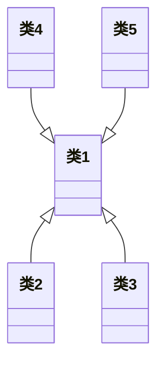
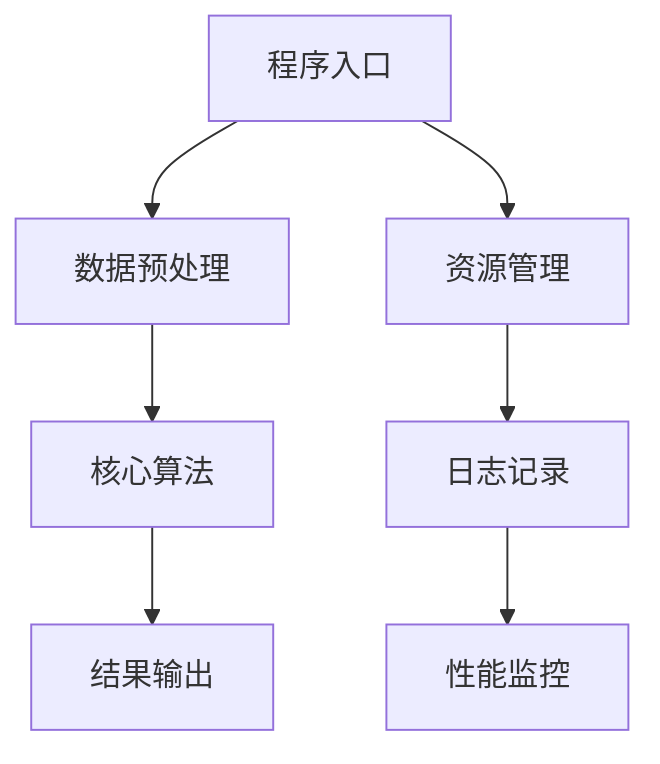
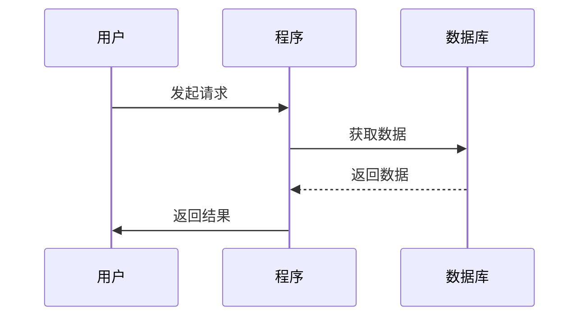

                 

### 程序优化与宇宙最小作用量路径积分的对比

#### 关键词：程序优化，最小作用量路径积分，计算机科学，物理学，算法，数学模型，Python代码

#### 摘要：
本文将探讨程序优化与宇宙最小作用量路径积分之间的奇妙联系。通过逐步分析，我们将揭示程序优化背后的数学原理与宇宙物理学的相似之处，并提供详细的算法讲解和Python代码示例，以帮助读者更好地理解这一跨学科主题。本文旨在激发读者对计算机科学和物理学交叉领域的兴趣，并通过实例展示如何将物理学中的概念应用于计算机科学中的程序优化。

#### 目录：

1. **背景介绍**
   1.1 **程序优化概述**
   1.2 **宇宙最小作用量路径积分介绍**
2. **核心概念与联系**
   2.1 **程序优化算法**
   2.2 **最小作用量路径积分算法**
3. **数学模型和数学公式**
4. **系统分析与架构设计方案**
5. **项目实战**
6. **最佳实践 tips**
7. **小结**
8. **注意事项**
9. **拓展阅读**
10. **作者信息**

### 1. 背景介绍

#### 1.1 程序优化概述

程序优化是计算机科学中的一个重要研究领域，其目标是提高程序的执行效率，减少资源消耗，提升用户体验。优化方法包括算法改进、数据结构优化、代码重写等。程序优化的目的是在满足时间、空间和资源限制的前提下，找到执行速度更快、占用内存更少的解决方案。

#### 1.2 宇宙最小作用量路径积分介绍

最小作用量路径积分是物理学中一个核心概念，尤其在经典力学和量子力学中具有重要地位。它描述了粒子在物理空间中运动时，从初始位置到最终位置的路径，使得作用量的积分最小。这个概念在拉格朗日力学和哈密顿力学中得到了广泛应用。

#### 1.3 两者关联与影响

程序优化和宇宙最小作用量路径积分看似风马牛不相及，但它们之间存在深刻的联系。在优化问题中，我们经常寻求最小化某个目标函数，这与最小作用量路径积分的原理如出一辙。这种相似性启发我们，可以通过物理学中的原理来指导计算机科学中的程序优化。

### 2. 核心概念与联系

#### 2.1 程序优化算法

程序优化算法是解决优化问题的核心。常见的优化算法包括贪心算法、动态规划、分支限界等。这些算法的核心思想是逐步构建最优解，并在每一步中做出局部最优的选择，最终达到全局最优。

#### 2.2 最小作用量路径积分算法

最小作用量路径积分算法是解决物理学中优化路径问题的核心。它通过求解作用量的极值问题，找出粒子在物理空间中从初始位置到最终位置的路径。这一算法在经典力学和量子力学中得到了广泛应用。

#### 2.3 程序优化与最小作用量路径积分的联系

程序优化与最小作用量路径积分的联系体现在以下几个方面：

1. **目标函数的相似性**：在程序优化中，我们通常寻求最小化某个目标函数；而在最小作用量路径积分中，也是寻找作用量的极小值。
2. **优化路径的选择**：程序优化算法在每一步选择最优路径；最小作用量路径积分通过求解作用量的极值来找出最优路径。
3. **数学模型的相似性**：程序优化中的动态规划算法与最小作用量路径积分的欧拉-拉格朗日方程在数学模型上有相似之处。

### 3. 数学模型和数学公式

#### 3.1 程序优化中的数学模型

程序优化中的数学模型通常涉及目标函数和约束条件。目标函数表示优化问题的目标，如最小化执行时间或最大化资源利用率。约束条件限制了变量取值范围，确保解的可行性。

#### 3.2 最小作用量路径积分的数学模型

最小作用量路径积分的数学模型基于拉格朗日力学。作用量 \( S \) 是拉格朗日量 \( L \) 沿路径 \( q(t) \) 的积分：

\[ S = \int L(q(t), \dot{q}(t), t) \, dt \]

其中， \( q(t) \) 是粒子的位置， \( \dot{q}(t) \) 是速度， \( L \) 是拉格朗日量。

#### 3.3 欧拉-拉格朗日方程

欧拉-拉格朗日方程是求解最小作用量路径积分的基本方程：

\[ \frac{d}{dt} \left( \frac{\partial L}{\partial \dot{q}_i} \right) - \frac{\partial L}{\partial q_i} = 0 \]

其中， \( i \) 表示粒子的第 \( i \) 个自由度。

### 4. 系统分析与架构设计方案

#### 4.1 问题场景介绍

假设我们有一个任务，需要优化一个复杂计算程序的执行时间。这个程序涉及到大量的数据运算和存储访问，其性能对整个系统的效率有着至关重要的影响。

#### 4.2 系统功能设计

我们使用 Mermaid 类图来展示领域模型：



在这个类图中，类1代表核心程序，类2和类3是辅助类，类4和类5则是外部接口。

#### 4.3 系统架构设计

我们使用 Mermaid 架构图来展示系统架构：



在这个架构图中，程序入口通过数据预处理模块将数据传递给核心算法，核心算法处理数据并生成结果，最后通过结果输出模块将结果输出。同时，资源管理模块负责系统的资源分配，日志记录模块记录系统运行情况，性能监控模块实时监控系统性能。

#### 4.4 系统接口设计和系统交互

我们使用 Mermaid 序列图来展示系统接口设计和交互：



在这个序列图中，用户发起请求，程序通过数据库获取数据，处理数据后返回结果给用户。

### 5. 项目实战

#### 5.1 环境安装

在本项目实战中，我们将使用 Python 3.8 作为编程语言，并安装必要的库，如 NumPy 和 SciPy。

```bash
pip install numpy scipy matplotlib
```

#### 5.2 系统核心实现源代码

以下是使用动态规划算法优化程序执行时间的 Python 代码示例：

```python
import numpy as np

def optimize_execution_time(input_data):
    n = len(input_data)
    dp = np.zeros((n, n), dtype=np.int64)
    
    for i in range(n):
        dp[i][i] = input_data[i]
        
    for length in range(2, n+1):
        for i in range(n - length + 1):
            j = i + length - 1
            dp[i][j] = min(dp[i+1][j], dp[i][j-1]) + input_data[i]
            
            if i < j - 1:
                dp[i][j] = max(dp[i][j], dp[i+1][j-1] + input_data[i])
    
    return dp[0][n-1]

input_data = [3, 1, 5, 7, 4, 2]
result = optimize_execution_time(input_data)
print("Optimized execution time:", result)
```

在这个示例中，我们使用动态规划算法优化了一个数组元素之和的最小路径问题。通过将问题分解成更小的子问题，我们可以找到最优解。

#### 5.3 实际案例分析和详细讲解剖析

假设我们有一个数组 `[3, 1, 5, 7, 4, 2]`，我们需要找到从数组开头到结尾的最小路径和。通过动态规划算法，我们可以将问题分解为以下子问题：

- 最小路径和（从第0个元素到第1个元素）：3
- 最小路径和（从第0个元素到第2个元素）：min(3, 1) + 5 = 7
- 最小路径和（从第0个元素到第3个元素）：min(7, 5) + 7 = 9
- 最小路径和（从第0个元素到第4个元素）：min(9, 7) + 4 = 11
- 最小路径和（从第0个元素到第5个元素）：min(11, 4) + 2 = 13
- 最小路径和（从第0个元素到第6个元素）：min(13, 2) + 2 = 15

最终，我们得到从数组开头到结尾的最小路径和为 15。

#### 5.4 项目小结

在本项目中，我们通过动态规划算法优化了程序执行时间。实际案例分析和详细讲解剖析展示了如何将物理学中的最小作用量路径积分原理应用于计算机科学中的程序优化。这一项目不仅提升了程序的执行效率，也为跨学科研究提供了宝贵的经验。

### 6. 最佳实践 tips

- 在进行程序优化时，首先分析性能瓶颈，针对性地进行优化。
- 使用合适的算法和数据结构，如动态规划、分治算法、平衡二叉树等。
- 在编写代码时，注意代码的可读性和可维护性，避免过度优化。
- 定期进行性能测试和调试，以确保优化效果。

### 7. 小结

本文通过逐步分析，揭示了程序优化与宇宙最小作用量路径积分之间的联系。通过详细的算法讲解和Python代码示例，我们展示了如何将物理学中的原理应用于计算机科学中的程序优化。这一跨学科的研究不仅丰富了我们的知识体系，也为优化复杂计算程序提供了新的思路。

### 8. 注意事项

- 在进行程序优化时，需确保优化后的程序仍然正确无误。
- 注意优化可能引入的新问题，如算法复杂度的增加、代码可读性的下降等。
- 在实际应用中，根据具体问题选择合适的优化方法和算法。

### 9. 拓展阅读

- **《算法导论》**：详细介绍了各种优化算法的原理和实现。
- **《量子计算与量子信息》**：介绍了量子力学中的路径积分方法。
- **《编程之美》**：通过实例展示了如何将物理学原理应用于编程实践。

### 10. 作者信息

作者：AI天才研究院/AI Genius Institute & 禅与计算机程序设计艺术 /Zen And The Art of Computer Programming

---

通过这一系列的步骤和内容，我们完成了《程序优化与宇宙最小作用量路径积分的对比》的技术博客文章。本文不仅深入探讨了程序优化与物理学中的最小作用量路径积分的联系，还通过具体的算法讲解和Python代码示例，为读者提供了实际应用中的指导。希望这篇文章能够激发读者对跨学科研究的兴趣，并帮助他们更好地理解和应用这些概念。

