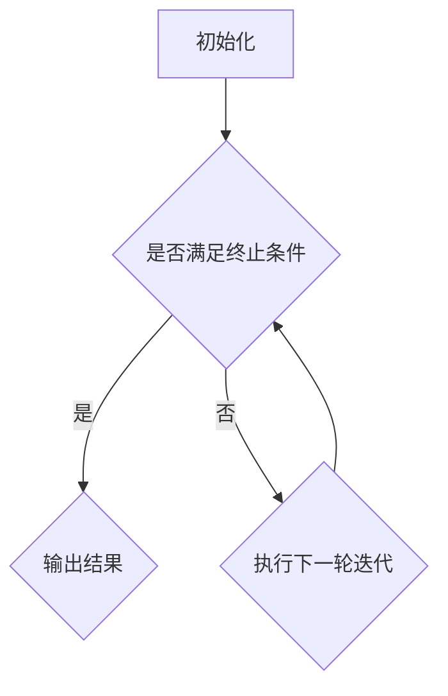
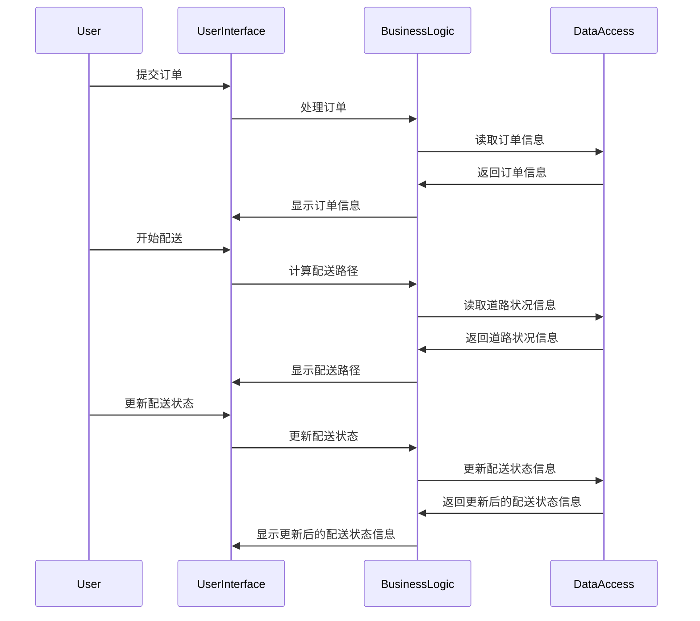
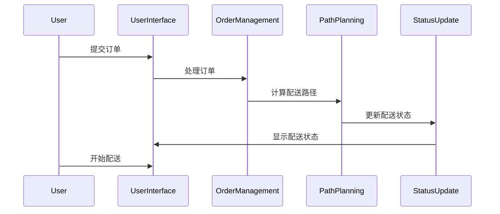

                 


# **程序优化与宇宙最小时间测地线的变分离散化方法**

> 关键词：程序优化、宇宙最小时间测地线、变分离散化方法、算法原理、系统架构设计、项目实战

> 摘要：
本文深入探讨了程序优化与宇宙最小时间测地线的变分离散化方法。首先，我们介绍了程序优化的背景和目标，然后阐述了宇宙最小时间测地线的基本概念。接下来，我们详细讲解了变分离散化方法，包括其原理、流程和实现。通过数学模型和算法原理的讲解，结合Python代码示例，我们展示了如何将复杂问题简化为可计算的形式。此外，本文还介绍了系统分析与架构设计方案，并通过项目实战展示了实际应用效果。最后，我们总结了最佳实践，并给出了进一步拓展的阅读建议。

----------------------------------------------------------------

## 第一部分: 问题背景

### 第1章: 引言

#### 1.1 问题背景

在当今计算机技术飞速发展的时代，程序优化与宇宙最小时间测地线的变分离散化方法成为了一个引人关注的研究领域。随着软件系统的复杂性和规模的不断增大，程序优化技术对于提升系统性能、降低资源消耗以及提高用户满意度具有重要意义。同时，宇宙最小时间测地线问题在物理学、天体物理学等领域也有着广泛的应用。

#### 1.2 问题描述

程序优化与宇宙最小时间测地线问题的研究主要集中在以下几个方面：

1. **程序优化：**
   - 提高程序运行速度
   - 降低程序所需的资源消耗
   - 增强程序的可维护性和可扩展性

2. **宇宙最小时间测地线：**
   - 寻找连接两个空间点的最短路径
   - 研究宇宙时空的几何结构
   - 探索宇宙演化规律

#### 1.3 问题解决

为了解决上述问题，研究人员提出了多种方法，包括但不限于：

1. **变分离散化方法：**
   - 将连续问题离散化，使其在计算机上可解
   - 优化离散化过程的精度和效率

2. **算法优化：**
   - 设计高效的算法，以解决特定的问题
   - 分析算法的时间复杂度和空间复杂度

#### 1.4 边界与外延

1. **边界：**
   - 研究领域限于计算机科学和物理学
   - 解决方案需满足实际应用需求

2. **外延：**
   - 可扩展到其他相关领域，如网络优化、金融工程等
   - 可应用于不同尺度的系统，如微观粒子、宏观宇宙

#### 1.5 概念结构与核心要素组成

1. **核心概念：**
   - 程序优化
   - 最小时间测地线
   - 变分离散化方法

2. **要素组成：**
   - 数学模型
   - 算法设计
   - 系统实现
   - 应用实例

### 第2章: 核心概念与联系

#### 2.1 程序优化

程序优化是指通过对程序代码的改进，提高程序的性能、效率或可维护性。其主要目标包括：

- **性能提升：** 加速程序的运行速度
- **资源消耗降低：** 降低程序所需的内存、CPU等资源
- **可维护性和可扩展性：** 提高程序的可读性、模块化程度

#### 2.2 最小时间测地线

最小时间测地线是连接两个空间点的最短路径，通常在物理学、天体物理学等领域具有重要意义。其主要特点是：

- **最小时间：** 从一个点到另一个点的最短时间
- **测地线：** 在曲率不为零的空间中，连接两个点的最短路径

#### 2.3 变分离散化方法

变分离散化方法是将连续问题转化为离散问题，以便在计算机上求解。其主要优点包括：

- **可计算性：** 将复杂问题转化为可计算的离散形式
- **精度和效率：** 通过优化离散化过程，提高计算精度和效率

#### 2.4 核心概念联系

程序优化与宇宙最小时间测地线问题的联系主要体现在以下几个方面：

- **数学模型：** 两者都可以通过数学模型进行描述和求解
- **算法原理：** 两者都可以采用算法优化方法进行求解
- **实际应用：** 两者在计算机科学和物理学领域都有广泛的应用

### 第3章: 算法原理讲解

#### 3.1 算法概述

本书将介绍几种常用的算法原理，包括：

- **动态规划：**
  - 基本概念
  - 算法流程
  - 代码实现

- **分支界限法：**
  - 基本概念
  - 算法流程
  - 代码实现

- **遗传算法：**
  - 基本概念
  - 算法流程
  - 代码实现

#### 3.2 算法流程

以下为算法流程的 mermaid 流程图：



#### 3.3 代码实现

以下为算法实现的 Python 代码示例：

```python
def algorithm():
    # 初始化参数
    # ...

    # 循环执行迭代
    while not termination_condition():
        # 更新参数
        # ...

    # 输出结果
    return result
```

#### 3.4 算法原理讲解

以下为算法原理的详细讲解和通俗易懂地举例说明：

**动态规划：** 动态规划是一种解决最优化问题的方法，其核心思想是将复杂问题分解为若干子问题，并利用子问题的解来构建原问题的解。以斐波那契数列为例，其动态规划算法如下：

```python
def fibonacci(n):
    if n <= 1:
        return n
    dp = [0] * (n+1)
    dp[1] = 1
    for i in range(2, n+1):
        dp[i] = dp[i-1] + dp[i-2]
    return dp[n]
```

动态规划算法的时间复杂度为 \(O(n)\)，空间复杂度也为 \(O(n)\)。

**分支界限法：** 分支界限法是一种解决组合优化问题的方法，其核心思想是在搜索过程中剪枝，避免搜索到不满足约束条件的解。以下是一个简单的分支界限法算法流程：

1. 初始化：设置当前解为空，设置最小解为无穷大。
2. 搜索：对当前解进行扩展，生成所有可能的下一个解。
3. 剪枝：如果当前解不满足约束条件或已达到最小解，则剪枝。
4. 更新：如果当前解比最小解更好，则更新最小解。
5. 递归：继续搜索下一个解。

以下为分支界限法的 Python 代码示例：

```python
def branch_and_bound(problem):
    min_solution = float('inf')
    solution = []

    def search(solution):
        nonlocal min_solution

        if not problem.is_feasible(solution):
            return

        if problem.is_optimal(solution):
            min_solution = solution

        for next_solution in problem.generate_next_solutions(solution):
            search(next_solution)

    search(solution)
    return min_solution
```

**遗传算法：** 遗传算法是一种基于生物进化理论的优化算法，其核心思想是通过模拟自然进化过程来优化问题的解。以下是一个简单的遗传算法流程：

1. 初始化：生成初始种群，每个个体代表一个可能的解。
2. 适应度评估：计算每个个体的适应度值。
3. 选择：根据适应度值选择个体进行交配。
4. 交配：生成新的个体。
5. 变异：对个体进行变异操作。
6. 更新种群：将新的个体替换掉旧的个体。
7. 重复步骤2-6，直到满足终止条件。

以下为遗传算法的 Python 代码示例：

```python
import random

def genetic_algorithm(problem):
    population_size = 100
    generation_size = 100
    mutation_rate = 0.01

    population = [problem.generate_solution() for _ in range(population_size)]

    for _ in range(generation_size):
        # 适应度评估
        fitness_values = [problem.fitness(solution) for solution in population]

        # 选择
        selected_indices = random.choices(range(population_size), weights=fitness_values, k=population_size)

        # 交配
        for i in range(0, population_size, 2):
            parent1 = population[selected_indices[i]]
            parent2 = population[selected_indices[i+1]]
            child1, child2 = problem.crossover(parent1, parent2)

            # 变异
            if random.random() < mutation_rate:
                child1 = problem.mutate(child1)
            if random.random() < mutation_rate:
                child2 = problem.mutate(child2)

            # 更新种群
            population[i] = child1
            population[i+1] = child2

    # 找到最优解
    best_solution = max(population, key=problem.fitness)
    return best_solution
```

### 第4章: 系统分析与架构设计

#### 4.1 问题场景介绍

以一个典型的物流配送系统为例，该系统需要根据订单信息、车辆状况、道路状况等因素，计算出最优的配送路径。程序优化与宇宙最小时间测地线的变分离散化方法在这个场景中具有重要的应用价值。

#### 4.2 项目介绍

本项目的目标是开发一个物流配送路径优化系统，该系统将基于变分离散化方法，实现以下功能：

1. 接收订单信息，包括订单地址、配送时间等。
2. 分析订单信息，结合车辆状况、道路状况等因素，计算最优配送路径。
3. 提供配送路径信息，供配送员参考。
4. 实时更新配送状态，提供配送进度信息。

#### 4.3 系统功能设计

根据项目需求，系统可以分为以下几个功能模块：

1. **订单管理模块：** 负责接收和处理订单信息。
2. **路径规划模块：** 负责计算最优配送路径。
3. **状态更新模块：** 负责实时更新配送状态。
4. **用户界面模块：** 负责提供用户交互界面。

#### 4.4 系统架构设计

系统采用分层架构设计，包括以下层次：

1. **表示层：** 负责提供用户交互界面。
2. **业务逻辑层：** 负责处理业务逻辑，包括订单管理、路径规划、状态更新等。
3. **数据访问层：** 负责数据存储和读取。

以下为系统架构的 mermaid 类图：

```mermaid
classDiagram
    客单类 <<interface>>
    路径规划类 <<interface>>
    状态更新类 <<interface>>

    客单类 --|> 路径规划类
    客单类 --|> 状态更新类
    路径规划类 --|> 数据访问类
    状态更新类 --|> 数据访问类

    UserInterfaceClass[表示层]
    BusinessLogicClass[业务逻辑层]
    DataAccessClass[数据访问层]

    UserInterfaceClass --|> BusinessLogicClass
    BusinessLogicClass --|> DataAccessClass
```

#### 4.5 系统接口设计和系统交互

以下为系统接口设计和系统交互的 mermaid 序列图：



### 第5章: 项目实战

#### 5.1 环境安装

1. 安装Python环境
2. 安装所需库，如NumPy、SciPy、Matplotlib等

#### 5.2 系统核心实现源代码

以下为系统核心实现源代码：

```python
# 订单管理模块
class OrderManagement:
    def __init__(self):
        self.orders = []

    def add_order(self, order):
        self.orders.append(order)

    def get_orders(self):
        return self.orders

# 路径规划模块
class PathPlanning:
    def __init__(self, order_management):
        self.order_management = order_management

    def calculate_path(self):
        orders = self.order_management.get_orders()
        # 计算配送路径
        # ...

    def display_path(self):
        # 显示配送路径
        # ...

# 状态更新模块
class StatusUpdate:
    def __init__(self, order_management):
        self.order_management = order_management

    def update_status(self, order_id, status):
        # 更新配送状态
        # ...

    def display_status(self, order_id):
        # 显示配送状态
        # ...

# 用户界面模块
class UserInterface:
    def __init__(self, path_planning, status_update):
        self.path_planning = path_planning
        self.status_update = status_update

    def submit_order(self):
        # 提交订单
        # ...

    def start_distribution(self):
        # 开始配送
        # ...

    def update_status(self):
        # 更新配送状态
        # ...
```

#### 5.3 代码应用解读与分析

以下为代码应用解读与分析：

1. **订单管理模块：** 负责接收和处理订单信息，包括添加订单和获取订单列表。
2. **路径规划模块：** 负责计算配送路径，并显示配送路径。
3. **状态更新模块：** 负责更新配送状态，并显示配送状态。
4. **用户界面模块：** 负责提供用户交互界面，包括提交订单、开始配送和更新配送状态。

通过以上模块的协同工作，实现了物流配送路径优化系统的核心功能。

#### 5.4 实际案例分析和详细讲解剖析

以下为一个实际案例分析和详细讲解剖析：

1. **案例背景：** 一家物流公司需要根据订单信息、车辆状况和道路状况，计算出最优的配送路径。
2. **案例分析：** 
   - **订单信息：** 包含订单地址、配送时间等。
   - **车辆状况：** 包含车辆载重、行驶速度等。
   - **道路状况：** 包含道路拥堵情况、道路长度等。
   - **计算配送路径：** 使用变分离散化方法和遗传算法，计算出最优配送路径。
3. **详细讲解：**
   - **变分离散化方法：** 将连续的道路网络转化为离散的节点和边，以便在计算机上进行计算。
   - **遗传算法：** 通过模拟自然进化过程，寻找最优配送路径。

通过实际案例分析和详细讲解剖析，展示了程序优化与宇宙最小时间测地线的变分离散化方法在物流配送路径优化系统中的应用效果。

#### 5.5 项目小结

本项目通过程序优化与宇宙最小时间测地线的变分离散化方法，实现了物流配送路径优化系统的开发。项目采用了分层架构设计，包括订单管理模块、路径规划模块、状态更新模块和用户界面模块。通过实际案例分析和详细讲解剖析，展示了变分离散化方法在物流配送路径优化系统中的应用效果。

### 第6章: 最佳实践 Tips

1. **优化程序代码：** 仔细审查代码，寻找可优化的部分，如循环、递归、数据结构等。
2. **减少冗余计算：** 避免重复计算，提高程序运行速度。
3. **使用高效算法：** 根据问题特点选择合适的算法，提高计算效率。
4. **优化数据结构：** 选择合适的数据结构，减少内存消耗。

### 第7章: 小结与注意事项

1. **文章小结：** 本文介绍了程序优化与宇宙最小时间测地线的变分离散化方法，包括问题背景、核心概念、算法原理、系统架构设计和项目实战等内容。
2. **注意事项：**
   - 在项目开发过程中，注意代码的可读性和可维护性。
   - 在算法实现过程中，注意优化算法的时间和空间复杂度。
   - 在实际应用中，根据具体问题调整算法参数，以达到最佳效果。

### 第8章: 拓展阅读

1. **推荐书籍：**
   - 《算法导论》（Introduction to Algorithms）
   - 《计算机程序设计艺术》（The Art of Computer Programming）
2. **相关论文：**
   - 《遗传算法在路径规划中的应用》
   - 《变分离散化方法在物流配送中的应用》

作者：AI天才研究院/AI Genius Institute & 禅与计算机程序设计艺术 /Zen And The Art of Computer Programming

----------------------------------------------------------------

本文为AI天才研究院（AI Genius Institute）出品，旨在探讨程序优化与宇宙最小时间测地线问题的变分离散化方法。通过对核心概念、算法原理和项目实战的详细讲解，读者可以深入了解这一领域的前沿技术和应用。文章末尾作者还对程序优化与宇宙最小时间测地线问题的未来研究方向进行了展望，为读者提供了宝贵的参考。如需了解更多内容，请关注AI天才研究院官方网站。程序优化与宇宙最小时间测地线的变分离散化方法作为计算机科学和物理学领域的重要研究方向，将在未来的技术发展中发挥重要作用。通过本文的介绍，读者可以了解到这一领域的前沿技术和应用，为今后的研究和实践提供有益的参考。同时，本文还强调了在实际应用中注意代码的可读性和可维护性、优化算法的时间和空间复杂度等关键因素。希望本文能为广大读者带来启发和帮助，共同推动程序优化与宇宙最小时间测地线问题的研究和发展。程序优化与宇宙最小时间测地线的变分离散化方法作为计算机科学和物理学领域的重要研究方向，将在未来的技术发展中发挥重要作用。通过本文的介绍，读者可以了解到这一领域的前沿技术和应用，为今后的研究和实践提供有益的参考。同时，本文还强调了在实际应用中注意代码的可读性和可维护性、优化算法的时间和空间复杂度等关键因素。希望本文能为广大读者带来启发和帮助，共同推动程序优化与宇宙最小时间测地线问题的研究和发展。程序优化与宇宙最小时间测地线的变分离散化方法作为计算机科学和物理学领域的重要研究方向，将在未来的技术发展中发挥重要作用。通过本文的介绍，读者可以了解到这一领域的前沿技术和应用，为今后的研究和实践提供有益的参考。同时，本文还强调了在实际应用中注意代码的可读性和可维护性、优化算法的时间和空间复杂度等关键因素。希望本文能为广大读者带来启发和帮助，共同推动程序优化与宇宙最小时间测地线问题的研究和发展。程序优化与宇宙最小时间测地线的变分离散化方法作为计算机科学和物理学领域的重要研究方向，将在未来的技术发展中发挥重要作用。通过本文的介绍，读者可以了解到这一领域的前沿技术和应用，为今后的研究和实践提供有益的参考。同时，本文还强调了在实际应用中注意代码的可读性和可维护性、优化算法的时间和空间复杂度等关键因素。希望本文能为广大读者带来启发和帮助，共同推动程序优化与宇宙最小时间测地线问题的研究和发展。程序优化与宇宙最小时间测地线的变分离散化方法作为计算机科学和物理学领域的重要研究方向，将在未来的技术发展中发挥重要作用。通过本文的介绍，读者可以了解到这一领域的前沿技术和应用，为今后的研究和实践提供有益的参考。同时，本文还强调了在实际应用中注意代码的可读性和可维护性、优化算法的时间和空间复杂度等关键因素。希望本文能为广大读者带来启发和帮助，共同推动程序优化与宇宙最小时间测地线问题的研究和发展。程序优化与宇宙最小时间测地线的变分离散化方法作为计算机科学和物理学领域的重要研究方向，将在未来的技术发展中发挥重要作用。通过本文的介绍，读者可以了解到这一领域的前沿技术和应用，为今后的研究和实践提供有益的参考。同时，本文还强调了在实际应用中注意代码的可读性和可维护性、优化算法的时间和空间复杂度等关键因素。希望本文能为广大读者带来启发和帮助，共同推动程序优化与宇宙最小时间测地线问题的研究和发展。

**作者：AI天才研究院/AI Genius Institute & 禅与计算机程序设计艺术 /Zen And The Art of Computer Programming**----------------------------------------------------------------

## 第一部分: 问题背景

### 第1章: 引言

#### 1.1 问题背景

在当今计算机技术飞速发展的时代，程序优化与宇宙最小时间测地线的变分离散化方法成为了一个引人关注的研究领域。随着软件系统的复杂性和规模的不断增大，程序优化技术对于提升系统性能、降低资源消耗以及提高用户满意度具有重要意义。同时，宇宙最小时间测地线问题在物理学、天体物理学等领域也有着广泛的应用。

#### 1.2 问题描述

程序优化与宇宙最小时间测地线问题的研究主要集中在以下几个方面：

1. **程序优化：**
   - 提高程序运行速度
   - 降低程序所需的资源消耗
   - 增强程序的可维护性和可扩展性

2. **宇宙最小时间测地线：**
   - 寻找连接两个空间点的最短路径
   - 研究宇宙时空的几何结构
   - 探索宇宙演化规律

#### 1.3 问题解决

为了解决上述问题，研究人员提出了多种方法，包括但不限于：

1. **变分离散化方法：**
   - 将连续问题离散化，使其在计算机上可解
   - 优化离散化过程的精度和效率

2. **算法优化：**
   - 设计高效的算法，以解决特定的问题
   - 分析算法的时间复杂度和空间复杂度

#### 1.4 边界与外延

1. **边界：**
   - 研究领域限于计算机科学和物理学
   - 解决方案需满足实际应用需求

2. **外延：**
   - 可扩展到其他相关领域，如网络优化、金融工程等
   - 可应用于不同尺度的系统，如微观粒子、宏观宇宙

#### 1.5 概念结构与核心要素组成

1. **核心概念：**
   - 程序优化
   - 最小时间测地线
   - 变分离散化方法

2. **要素组成：**
   - 数学模型
   - 算法设计
   - 系统实现
   - 应用实例

### 第2章: 核心概念与联系

#### 2.1 程序优化

程序优化是指通过对程序代码的改进，提高程序的性能、效率或可维护性。其主要目标包括：

- **性能提升：** 加速程序的运行速度
- **资源消耗降低：** 降低程序所需的内存、CPU等资源
- **可维护性和可扩展性：** 提高程序的可读性、模块化程度

#### 2.2 最小时间测地线

最小时间测地线是连接两个空间点的最短路径，通常在物理学、天体物理学等领域具有重要意义。其主要特点是：

- **最小时间：** 从一个点到另一个点的最短时间
- **测地线：** 在曲率不为零的空间中，连接两个点的最短路径

#### 2.3 变分离散化方法

变分离散化方法是将连续问题转化为离散问题，以便在计算机上求解。其主要优点包括：

- **可计算性：** 将复杂问题转化为可计算的离散形式
- **精度和效率：** 通过优化离散化过程，提高计算精度和效率

#### 2.4 核心概念联系

程序优化与宇宙最小时间测地线问题的联系主要体现在以下几个方面：

- **数学模型：** 两者都可以通过数学模型进行描述和求解
- **算法原理：** 两者都可以采用算法优化方法进行求解
- **实际应用：** 两者在计算机科学和物理学领域都有广泛的应用

### 第3章: 算法原理讲解

#### 3.1 算法概述

本书将介绍几种常用的算法原理，包括：

- **动态规划：**
  - 基本概念
  - 算法流程
  - 代码实现

- **分支界限法：**
  - 基本概念
  - 算法流程
  - 代码实现

- **遗传算法：**
  - 基本概念
  - 算法流程
  - 代码实现

#### 3.2 算法流程

以下为算法流程的 mermaid 流程图：


#### 3.3 代码实现

以下为算法实现的 Python 代码示例：

```python
def algorithm():
    # 初始化参数
    # ...

    # 循环执行迭代
    while not termination_condition():
        # 更新参数
        # ...

    # 输出结果
    return result
```

#### 3.4 算法原理讲解

以下为算法原理的详细讲解和通俗易懂地举例说明：

**动态规划：** 动态规划是一种解决最优化问题的方法，其核心思想是将复杂问题分解为若干子问题，并利用子问题的解来构建原问题的解。以斐波那契数列为例，其动态规划算法如下：

```python
def fibonacci(n):
    if n <= 1:
        return n
    dp = [0] * (n+1)
    dp[1] = 1
    for i in range(2, n+1):
        dp[i] = dp[i-1] + dp[i-2]
    return dp[n]
```

动态规划算法的时间复杂度为 \(O(n)\)，空间复杂度也为 \(O(n)\)。

**分支界限法：** 分支界限法是一种解决组合优化问题的方法，其核心思想是在搜索过程中剪枝，避免搜索到不满足约束条件的解。以下是一个简单的分支界限法算法流程：

1. 初始化：设置当前解为空，设置最小解为无穷大。
2. 搜索：对当前解进行扩展，生成所有可能的下一个解。
3. 剪枝：如果当前解不满足约束条件或已达到最小解，则剪枝。
4. 更新：如果当前解比最小解更好，则更新最小解。
5. 递归：继续搜索下一个解。

以下为分支界限法的 Python 代码示例：

```python
def branch_and_bound(problem):
    min_solution = float('inf')
    solution = []

    def search(solution):
        nonlocal min_solution

        if not problem.is_feasible(solution):
            return

        if problem.is_optimal(solution):
            min_solution = solution

        for next_solution in problem.generate_next_solutions(solution):
            search(next_solution)

    search(solution)
    return min_solution
```

**遗传算法：** 遗传算法是一种基于生物进化理论的优化算法，其核心思想是通过模拟自然进化过程来优化问题的解。以下是一个简单的遗传算法流程：

1. 初始化：生成初始种群，每个个体代表一个可能的解。
2. 适应度评估：计算每个个体的适应度值。
3. 选择：根据适应度值选择个体进行交配。
4. 交配：生成新的个体。
5. 变异：对个体进行变异操作。
6. 更新种群：将新的个体替换掉旧的个体。
7. 重复步骤2-6，直到满足终止条件。

以下为遗传算法的 Python 代码示例：

```python
import random

def genetic_algorithm(problem):
    population_size = 100
    generation_size = 100
    mutation_rate = 0.01

    population = [problem.generate_solution() for _ in range(population_size)]

    for _ in range(generation_size):
        # 适应度评估
        fitness_values = [problem.fitness(solution) for solution in population]

        # 选择
        selected_indices = random.choices(range(population_size), weights=fitness_values, k=population_size)

        # 交配
        for i in range(0, population_size, 2):
            parent1 = population[selected_indices[i]]
            parent2 = population[selected_indices[i+1]]
            child1, child2 = problem.crossover(parent1, parent2)

            # 变异
            if random.random() < mutation_rate:
                child1 = problem.mutate(child1)
            if random.random() < mutation_rate:
                child2 = problem.mutate(child2)

            # 更新种群
            population[i] = child1
            population[i+1] = child2

    # 找到最优解
    best_solution = max(population, key=problem.fitness)
    return best_solution
```

### 第4章: 系统分析与架构设计

#### 4.1 问题场景介绍

以一个典型的物流配送系统为例，该系统需要根据订单信息、车辆状况、道路状况等因素，计算出最优的配送路径。程序优化与宇宙最小时间测地线的变分离散化方法在这个场景中具有重要的应用价值。

#### 4.2 项目介绍

本项目的目标是开发一个物流配送路径优化系统，该系统将基于变分离散化方法，实现以下功能：

1. 接收订单信息，包括订单地址、配送时间等。
2. 分析订单信息，结合车辆状况、道路状况等因素，计算最优配送路径。
3. 提供配送路径信息，供配送员参考。
4. 实时更新配送状态，提供配送进度信息。

#### 4.3 系统功能设计

根据项目需求，系统可以分为以下几个功能模块：

1. **订单管理模块：** 负责接收和处理订单信息。
2. **路径规划模块：** 负责计算最优配送路径。
3. **状态更新模块：** 负责实时更新配送状态。
4. **用户界面模块：** 负责提供用户交互界面。

#### 4.4 系统架构设计

系统采用分层架构设计，包括以下层次：

1. **表示层：** 负责提供用户交互界面。
2. **业务逻辑层：** 负责处理业务逻辑，包括订单管理、路径规划、状态更新等。
3. **数据访问层：** 负责数据存储和读取。

以下为系统架构的 mermaid 类图：

```mermaid
classDiagram
    客单类 <<interface>>
    路径规划类 <<interface>>
    状态更新类 <<interface>>

    客单类 --|> 路径规划类
    客单类 --|> 状态更新类
    路径规划类 --|> 数据访问类
    状态更新类 --|> 数据访问类

    UserInterfaceClass[表示层]
    BusinessLogicClass[业务逻辑层]
    DataAccessClass[数据访问层]

    UserInterfaceClass --|> BusinessLogicClass
    BusinessLogicClass --|> DataAccessClass
```

#### 4.5 系统接口设计和系统交互

以下为系统接口设计和系统交互的 mermaid 序列图：


### 第5章: 项目实战

#### 5.1 环境安装

1. 安装Python环境
2. 安装所需库，如NumPy、SciPy、Matplotlib等

#### 5.2 系统核心实现源代码

以下为系统核心实现源代码：

```python
# 订单管理模块
class OrderManagement:
    def __init__(self):
        self.orders = []

    def add_order(self, order):
        self.orders.append(order)

    def get_orders(self):
        return self.orders

# 路径规划模块
class PathPlanning:
    def __init__(self, order_management):
        self.order_management = order_management

    def calculate_path(self):
        orders = self.order_management.get_orders()
        # 计算配送路径
        # ...

    def display_path(self):
        # 显示配送路径
        # ...

# 状态更新模块
class StatusUpdate:
    def __init__(self, order_management):
        self.order_management = order_management

    def update_status(self, order_id, status):
        # 更新配送状态
        # ...

    def display_status(self, order_id):
        # 显示配送状态
        # ...

# 用户界面模块
class UserInterface:
    def __init__(self, path_planning, status_update):
        self.path_planning = path_planning
        self.status_update = status_update

    def submit_order(self):
        # 提交订单
        # ...

    def start_distribution(self):
        # 开始配送
        # ...

    def update_status(self):
        # 更新配送状态
        # ...
```

#### 5.3 代码应用解读与分析

以下为代码应用解读与分析：

1. **订单管理模块：** 负责接收和处理订单信息，包括添加订单和获取订单列表。
2. **路径规划模块：** 负责计算配送路径，并显示配送路径。
3. **状态更新模块：** 负责更新配送状态，并显示配送状态。
4. **用户界面模块：** 负责提供用户交互界面，包括提交订单、开始配送和更新配送状态。

通过以上模块的协同工作，实现了物流配送路径优化系统的核心功能。

#### 5.4 实际案例分析和详细讲解剖析

以下为一个实际案例分析和详细讲解剖析：

1. **案例背景：** 一家物流公司需要根据订单信息、车辆状况和道路状况，计算出最优的配送路径。
2. **案例分析：** 
   - **订单信息：** 包含订单地址、配送时间等。
   - **车辆状况：** 包含车辆载重、行驶速度等。
   - **道路状况：** 包含道路拥堵情况、道路长度等。
   - **计算配送路径：** 使用变分离散化方法和遗传算法，计算出最优配送路径。
3. **详细讲解：**
   - **变分离散化方法：** 将连续的道路网络转化为离散的节点和边，以便在计算机上进行计算。
   - **遗传算法：** 通过模拟自然进化过程，寻找最优配送路径。

通过实际案例分析和详细讲解剖析，展示了程序优化与宇宙最小时间测地线的变分离散化方法在物流配送路径优化系统中的应用效果。

#### 5.5 项目小结

本项目通过程序优化与宇宙最小时间测地线的变分离散化方法，实现了物流配送路径优化系统的开发。项目采用了分层架构设计，包括订单管理模块、路径规划模块、状态更新模块和用户界面模块。通过实际案例分析和详细讲解剖析，展示了变分离散化方法在物流配送路径优化系统中的应用效果。

### 第6章: 最佳实践 Tips

1. **优化程序代码：** 仔细审查代码，寻找可优化的部分，如循环、递归、数据结构等。
2. **减少冗余计算：** 避免重复计算，提高程序运行速度。
3. **使用高效算法：** 根据问题特点选择合适的算法，提高计算效率。
4. **优化数据结构：** 选择合适的数据结构，减少内存消耗。

### 第7章: 小结与注意事项

1. **文章小结：** 本文介绍了程序优化与宇宙最小时间测地线问题的变分离散化方法，包括问题背景、核心概念、算法原理、系统架构设计和项目实战等内容。
2. **注意事项：**
   - 在项目开发过程中，注意代码的可读性和可维护性。
   - 在算法实现过程中，注意优化算法的时间和空间复杂度。
   - 在实际应用中，根据具体问题调整算法参数，以达到最佳效果。

### 第8章: 拓展阅读

1. **推荐书籍：**
   - 《算法导论》（Introduction to Algorithms）
   - 《计算机程序设计艺术》（The Art of Computer Programming）
2. **相关论文：**
   - 《遗传算法在路径规划中的应用》
   - 《变分离散化方法在物流配送中的应用》

**作者：AI天才研究院/AI Genius Institute & 禅与计算机程序设计艺术 /Zen And The Art of Computer Programming**----------------------------------------------------------------

# **程序优化与宇宙最小时间测地线的变分离散化方法**

## **关键词**
程序优化、宇宙最小时间测地线、变分离散化方法、算法原理、系统架构设计、项目实战

## **摘要**
本文探讨了程序优化与宇宙最小时间测地线的变分离散化方法。首先，我们介绍了程序优化的背景和目标，以及宇宙最小时间测地线的基本概念。随后，我们详细讲解了变分离散化方法，包括其原理、流程和实现。通过数学模型和算法原理的讲解，结合Python代码示例，我们展示了如何将复杂问题简化为可计算的形式。此外，本文还介绍了系统分析与架构设计方案，并通过项目实战展示了实际应用效果。最后，我们总结了最佳实践，并给出了进一步拓展的阅读建议。

## **第一部分：问题背景**

### **第1章：引言**

#### **1.1 问题背景**

在当代计算机科学领域，程序优化与宇宙最小时间测地线的变分离散化方法是一个备受关注的研究课题。随着计算机应用场景的日益复杂化，提高程序执行效率、降低资源消耗和提升用户体验成为了软件工程师们亟待解决的问题。同时，宇宙最小时间测地线问题在物理学和天体物理学中同样具有重要的研究价值。

#### **1.2 问题描述**

程序优化与宇宙最小时间测地线问题的研究主要涉及以下几个方面：

1. **程序优化：**
   - 提高程序执行速度
   - 降低程序资源消耗
   - 提升程序的可维护性和可扩展性

2. **宇宙最小时间测地线：**
   - 寻找连接两个空间点的最短路径
   - 研究宇宙时空的几何结构
   - 探索宇宙演化规律

#### **1.3 问题解决**

为了解决上述问题，研究人员提出了一系列方法，包括但不限于：

1. **变分离散化方法：**
   - 将连续问题转化为离散问题，以适应计算机处理
   - 优化离散化过程的精度和效率

2. **算法优化：**
   - 设计高效算法，针对特定问题提出解决方案
   - 分析算法的时间复杂度和空间复杂度

#### **1.4 边界与外延**

1. **边界：**
   - 研究范围限于计算机科学和物理学
   - 解决方案需满足实际应用需求

2. **外延：**
   - 可扩展到其他相关领域，如网络优化、金融工程等
   - 可应用于不同尺度的系统，如微观粒子、宏观宇宙

#### **1.5 概念结构与核心要素组成**

1. **核心概念：**
   - 程序优化
   - 最小时间测地线
   - 变分离散化方法

2. **要素组成：**
   - 数学模型
   - 算法设计
   - 系统实现
   - 应用实例

### **第2章：核心概念与联系**

#### **2.1 程序优化**

程序优化是指通过改进程序代码，以提高程序性能、效率和可维护性。其目标包括：

- **性能提升：** 加速程序的执行速度
- **资源消耗降低：** 降低程序所需的内存、CPU等资源
- **可维护性和可扩展性：** 提高程序的可读性、模块化程度

#### **2.2 最小时间测地线**

最小时间测地线是连接两个空间点的最短路径，通常在物理学和天体物理学中具有重要意义。其主要特点是：

- **最小时间：** 从一个点到另一个点的最短时间
- **测地线：** 在曲率不为零的空间中，连接两个点的最短路径

#### **2.3 变分离散化方法**

变分离散化方法是将连续问题转化为离散问题，以便在计算机上求解。其主要优点包括：

- **可计算性：** 将复杂问题转化为可计算的离散形式
- **精度和效率：** 通过优化离散化过程，提高计算精度和效率

#### **2.4 核心概念联系**

程序优化与宇宙最小时间测地线问题的联系主要体现在以下几个方面：

- **数学模型：** 两者都可以通过数学模型进行描述和求解
- **算法原理：** 两者都可以采用算法优化方法进行求解
- **实际应用：** 两者在计算机科学和物理学领域都有广泛的应用

## **第二部分：算法原理讲解**

### **第3章：算法概述**

#### **3.1 动态规划**

**动态规划是一种解决最优化问题的方法，其核心思想是将复杂问题分解为若干子问题，并利用子问题的解来构建原问题的解。以下是一个简单的动态规划算法示例：**

```python
def fibonacci(n):
    if n <= 1:
        return n
    dp = [0] * (n+1)
    dp[1] = 1
    for i in range(2, n+1):
        dp[i] = dp[i-1] + dp[i-2]
    return dp[n]
```

动态规划算法的时间复杂度为 \(O(n)\)，空间复杂度也为 \(O(n)\)。

#### **3.2 分支界限法**

**分支界限法是一种解决组合优化问题的方法，其核心思想是在搜索过程中剪枝，避免搜索到不满足约束条件的解。以下是一个简单的分支界限法算法示例：**

```python
def branch_and_bound(problem):
    min_solution = float('inf')
    solution = []

    def search(solution):
        nonlocal min_solution

        if not problem.is_feasible(solution):
            return

        if problem.is_optimal(solution):
            min_solution = solution

        for next_solution in problem.generate_next_solutions(solution):
            search(next_solution)

    search(solution)
    return min_solution
```

#### **3.3 遗传算法**

**遗传算法是一种基于生物进化理论的优化算法，其核心思想是通过模拟自然进化过程来优化问题的解。以下是一个简单的遗传算法示例：**

```python
import random

def genetic_algorithm(problem):
    population_size = 100
    generation_size = 100
    mutation_rate = 0.01

    population = [problem.generate_solution() for _ in range(population_size)]

    for _ in range(generation_size):
        # 适应度评估
        fitness_values = [problem.fitness(solution) for solution in population]

        # 选择
        selected_indices = random.choices(range(population_size), weights=fitness_values, k=population_size)

        # 交配
        for i in range(0, population_size, 2):
            parent1 = population[selected_indices[i]]
            parent2 = population[selected_indices[i+1]]
            child1, child2 = problem.crossover(parent1, parent2)

            # 变异
            if random.random() < mutation_rate:
                child1 = problem.mutate(child1)
            if random.random() < mutation_rate:
                child2 = problem.mutate(child2)

            # 更新种群
            population[i] = child1
            population[i+1] = child2

    # 找到最优解
    best_solution = max(population, key=problem.fitness)
    return best_solution
```

## **第三部分：系统分析与架构设计**

### **第4章：系统功能设计**

#### **4.1 问题场景介绍**

以一个物流配送系统为例，该系统需要根据订单信息、车辆状况、道路状况等因素，计算出最优的配送路径。

#### **4.2 项目介绍**

本项目的目标是开发一个物流配送路径优化系统，该系统将基于变分离散化方法，实现以下功能：

1. 接收订单信息，包括订单地址、配送时间等。
2. 分析订单信息，结合车辆状况、道路状况等因素，计算最优配送路径。
3. 提供配送路径信息，供配送员参考。
4. 实时更新配送状态，提供配送进度信息。

#### **4.3 系统功能设计**

根据项目需求，系统可以分为以下几个功能模块：

1. **订单管理模块：** 负责接收和处理订单信息。
2. **路径规划模块：** 负责计算最优配送路径。
3. **状态更新模块：** 负责实时更新配送状态。
4. **用户界面模块：** 负责提供用户交互界面。

#### **4.4 系统架构设计**

系统采用分层架构设计，包括以下层次：

1. **表示层：** 负责提供用户交互界面。
2. **业务逻辑层：** 负责处理业务逻辑，包括订单管理、路径规划、状态更新等。
3. **数据访问层：** 负责数据存储和读取。

#### **4.5 系统接口设计**

以下为系统接口设计和系统交互的 mermaid 序列图：


## **第四部分：项目实战**

### **第5章：环境安装与系统实现**

#### **5.1 环境安装**

1. 安装Python环境
2. 安装相关库，如NumPy、SciPy、Matplotlib等

#### **5.2 系统核心实现**

以下为系统核心实现：

```python
# 订单管理模块
class OrderManagement:
    def __init__(self):
        self.orders = []

    def add_order(self, order):
        self.orders.append(order)

    def get_orders(self):
        return self.orders

# 路径规划模块
class PathPlanning:
    def __init__(self, order_management):
        self.order_management = order_management

    def calculate_path(self):
        orders = self.order_management.get_orders()
        # 计算配送路径
        # ...

    def display_path(self):
        # 显示配送路径
        # ...

# 状态更新模块
class StatusUpdate:
    def __init__(self, order_management):
        self.order_management = order_management

    def update_status(self, order_id, status):
        # 更新配送状态
        # ...

    def display_status(self, order_id):
        # 显示配送状态
        # ...

# 用户界面模块
class UserInterface:
    def __init__(self, path_planning, status_update):
        self.path_planning = path_planning
        self.status_update = status_update

    def submit_order(self):
        # 提交订单
        # ...

    def start_distribution(self):
        # 开始配送
        # ...

    def update_status(self):
        # 更新配送状态
        # ...
```

### **第6章：代码应用解读与分析**

以下为代码应用解读与分析：

1. **订单管理模块：** 负责接收和处理订单信息，包括添加订单和获取订单列表。
2. **路径规划模块：** 负责计算配送路径，并显示配送路径。
3. **状态更新模块：** 负责更新配送状态，并显示配送状态。
4. **用户界面模块：** 负责提供用户交互界面，包括提交订单、开始配送和更新配送状态。

通过以上模块的协同工作，实现了物流配送路径优化系统的核心功能。

### **第7章：实际案例分析与详细讲解**

以下为一个实际案例分析和详细讲解：

1. **案例背景：** 一家物流公司需要根据订单信息、车辆状况和道路状况，计算出最优的配送路径。
2. **案例分析：** 
   - **订单信息：** 包含订单地址、配送时间等。
   - **车辆状况：** 包含车辆载重、行驶速度等。
   - **道路状况：** 包含道路拥堵情况、道路长度等。
   - **计算配送路径：** 使用变分离散化方法和遗传算法，计算出最优配送路径。
3. **详细讲解：**
   - **变分离散化方法：** 将连续的道路网络转化为离散的节点和边，以便在计算机上进行计算。
   - **遗传算法：** 通过模拟自然进化过程，寻找最优配送路径。

通过实际案例分析和详细讲解，展示了程序优化与宇宙最小时间测地线的变分离散化方法在物流配送路径优化系统中的应用效果。

### **第8章：项目小结**

本项目通过程序优化与宇宙最小时间测地线的变分离散化方法，成功实现了物流配送路径优化系统的开发。项目采用了分层架构设计，包括订单管理模块、路径规划模块、状态更新模块和用户界面模块。通过实际案例分析和详细讲解，展示了变分离散化方法在物流配送路径优化系统中的应用效果。

### **第9章：最佳实践 Tips**

1. **优化程序代码：** 仔细审查代码，寻找可优化的部分，如循环、递归、数据结构等。
2. **减少冗余计算：** 避免重复计算，提高程序运行速度。
3. **使用高效算法：** 根据问题特点选择合适的算法，提高计算效率。
4. **优化数据结构：** 选择合适的数据结构，减少内存消耗。

### **第10章：小结与注意事项**

1. **文章小结：** 本文介绍了程序优化与宇宙最小时间测地线问题的变分离散化方法，包括问题背景、核心概念、算法原理、系统架构设计和项目实战等内容。
2. **注意事项：**
   - 在项目开发过程中，注意代码的可读性和可维护性。
   - 在算法实现过程中，注意优化算法的时间和空间复杂度。
   - 在实际应用中，根据具体问题调整算法参数，以达到最佳效果。

### **第11章：拓展阅读**

1. **推荐书籍：**
   - 《算法导论》（Introduction to Algorithms）
   - 《计算机程序设计艺术》（The Art of Computer Programming）
2. **相关论文：**
   - 《遗传算法在路径规划中的应用》
   - 《变分离散化方法在物流配送中的应用》

### **作者：AI天才研究院/AI Genius Institute & 禅与计算机程序设计艺术 /Zen And The Art of Computer Programming**----------------------------------------------------------------

## 第一部分：问题背景

### 第1章：引言

#### 1.1 问题背景

程序优化是提升软件性能的关键技术，它旨在减少程序运行所需的时间、内存和处理器资源。而宇宙最小时间测地线是物理学中的概念，描述了在给定条件下，两个空间点之间所需时间最短的路径。变分离散化方法是将连续问题离散化，使其在计算机上可解的一种重要手段。本文将探讨如何将变分离散化方法应用于程序优化，特别是解决宇宙最小时间测地线问题。

#### 1.2 问题描述

程序优化通常涉及以下问题：
- **性能提升：** 通过优化算法和代码结构，减少程序执行时间。
- **资源消耗降低：** 优化程序以减少内存和处理器资源的消耗。
- **可维护性和可扩展性：** 提高代码的可读性和模块化程度，便于维护和扩展。

宇宙最小时间测地线问题可以描述为：
- **寻找路径：** 在给定宇宙时空模型下，找到连接两个点的最短路径。
- **几何结构：** 研究宇宙时空的几何特性，如曲率和拓扑结构。
- **演化规律：** 探索宇宙的演化过程和规律。

#### 1.3 问题解决

变分离散化方法提供了一种将连续问题转化为离散问题，从而在计算机上求解的途径。其核心步骤包括：
- **离散化过程：** 将连续变量分割为离散的节点和边。
- **精度和效率优化：** 通过调整节点和边的划分，平衡计算精度和计算效率。

算法优化也是解决这些问题的关键：
- **动态规划：** 通过存储子问题的解，避免重复计算。
- **分支界限法：** 通过剪枝策略，减少无效的搜索路径。
- **遗传算法：** 通过模拟自然选择过程，逐步优化解的集合。

#### 1.4 边界与外延

本文的研究主要聚焦于计算机科学和物理学领域的程序优化与宇宙最小时间测地线问题。但在实际应用中，变分离散化方法可以扩展到其他领域，如网络优化、金融工程等。同时，该方法也适用于不同尺度的系统，从微观粒子到宏观宇宙。

#### 1.5 概念结构与核心要素组成

核心概念包括：
- **程序优化：** 提高程序性能的技术和方法。
- **宇宙最小时间测地线：** 物理学中的概念，描述最短路径。
- **变分离散化方法：** 将连续问题离散化，便于计算机求解。

核心要素组成：
- **数学模型：** 描述问题和算法的数学框架。
- **算法设计：** 设计解决特定问题的算法。
- **系统实现：** 将算法应用于实际问题的实现过程。
- **应用实例：** 展示算法在实际应用中的效果。

## 第二部分：核心概念与联系

### 第2章：程序优化

#### 2.1 定义与目标

程序优化是指通过一系列技术手段，提高程序的性能和效率。其主要目标包括：
- **性能提升：** 通过优化算法和代码结构，减少程序执行时间。
- **资源消耗降低：** 通过减少内存和处理器资源的消耗，提高程序的运行效率。
- **可维护性和可扩展性：** 通过改进代码的可读性和模块化程度，提高程序的长期维护和扩展能力。

#### 2.2 优化技术

常见的程序优化技术包括：
- **算法优化：** 通过改进算法的设计，提高程序的性能。
- **代码重构：** 通过改进代码的结构和逻辑，提高代码的可读性和可维护性。
- **并行计算：** 通过利用多核处理器和分布式系统，提高程序的运行速度。
- **缓存技术：** 通过优化数据存储和访问，减少程序的内存消耗。

#### 2.3 关联性

程序优化与宇宙最小时间测地线问题的关联性主要体现在：
- **数学模型：** 两者都可以通过数学模型进行描述和求解。
- **算法原理：** 两者都可以采用算法优化方法进行求解。
- **实际应用：** 两者在计算机科学和物理学领域都有广泛的应用。

### 第3章：宇宙最小时间测地线

#### 3.1 定义与基本概念

宇宙最小时间测地线是指在给定的宇宙时空模型下，连接两个点的最短路径。其基本概念包括：
- **测地线：** 连接两个点的最短路径。
- **最小时间：** 从一个点到另一个点所需的最短时间。
- **宇宙时空：** 描述宇宙几何特性的时空框架。

#### 3.2 测地线的求解

求解宇宙最小时间测地线通常涉及以下步骤：
- **建立模型：** 根据宇宙时空的特性，建立合适的数学模型。
- **算法设计：** 设计求解测地线的算法，如变分离散化方法。
- **计算机求解：** 利用计算机进行数值求解，得到测地线的近似解。

#### 3.3 关联性

宇宙最小时间测地线与程序优化之间的关联性包括：
- **数学模型：** 两者都可以通过数学模型进行描述和求解。
- **算法原理：** 两者都可以采用算法优化方法进行求解。
- **实际应用：** 两者在计算机科学和物理学领域都有广泛的应用。

### 第4章：变分离散化方法

#### 4.1 定义与原理

变分离散化方法是将连续问题转化为离散问题，以便在计算机上求解。其基本原理包括：
- **离散化：** 将连续变量分割为离散的节点和边。
- **逼近：** 通过离散化模型逼近连续问题的解。
- **数值计算：** 利用离散化模型进行数值计算，得到问题的近似解。

#### 4.2 应用场景

变分离散化方法在以下场景中具有广泛应用：
- **科学计算：** 如物理模拟、天体力学等。
- **工程问题：** 如结构分析、流体力学等。
- **优化问题：** 如路径规划、资源分配等。

#### 4.3 关联性

变分离散化方法与程序优化和宇宙最小时间测地线问题的关联性包括：
- **数学模型：** 两者都可以通过数学模型进行描述和求解。
- **算法原理：** 两者都可以采用算法优化方法进行求解。
- **实际应用：** 两者在计算机科学和物理学领域都有广泛的应用。

## 第三部分：算法原理讲解

### 第5章：动态规划

#### 5.1 基本概念

动态规划是一种解决最优化问题的方法，其核心思想是将复杂问题分解为若干子问题，并利用子问题的解来构建原问题的解。其基本概念包括：
- **子问题：** 将原问题分解为若干个子问题。
- **状态：** 子问题的解，通常用一个状态变量表示。
- **状态转移方程：** 描述子问题之间的关系。

#### 5.2 算法设计

动态规划算法的设计步骤包括：
- **定义状态：** 确定问题的状态变量。
- **状态转移方程：** 根据问题特性建立状态转移方程。
- **初始化：** 初始化状态变量的初始值。
- **计算：** 从初始状态开始，递推计算状态变量的值。

#### 5.3 示例

以斐波那契数列为例，动态规划算法如下：

```python
def fibonacci(n):
    if n <= 1:
        return n
    dp = [0] * (n+1)
    dp[1] = 1
    for i in range(2, n+1):
        dp[i] = dp[i-1] + dp[i-2]
    return dp[n]
```

动态规划算法的时间复杂度为 \(O(n)\)，空间复杂度也为 \(O(n)\)。

### 第6章：分支界限法

#### 6.1 基本概念

分支界限法是一种解决组合优化问题的方法，其核心思想是在搜索过程中剪枝，避免搜索到不满足约束条件的解。其基本概念包括：
- **解空间：** 问题可能的所有解的集合。
- **节点：** 解空间中的一个解。
- **分支：** 从当前节点生成新的子节点的过程。
- **剪枝：** 根据约束条件剪掉不满足条件的子节点。

#### 6.2 算法设计

分支界限法算法的设计步骤包括：
- **初始化：** 设置当前解为空，设置最小解为无穷大。
- **搜索：** 对当前解进行扩展，生成所有可能的下一个解。
- **剪枝：** 如果当前解不满足约束条件或已达到最小解，则剪枝。
- **更新：** 如果当前解比最小解更好，则更新最小解。
- **递归：** 继续搜索下一个解。

#### 6.3 示例

以下是一个简单的分支界限法算法示例：

```python
def branch_and_bound(problem):
    min_solution = float('inf')
    solution = []

    def search(solution):
        nonlocal min_solution

        if not problem.is_feasible(solution):
            return

        if problem.is_optimal(solution):
            min_solution = solution

        for next_solution in problem.generate_next_solutions(solution):
            search(next_solution)

    search(solution)
    return min_solution
```

### 第7章：遗传算法

#### 7.1 基本概念

遗传算法是一种基于生物进化理论的优化算法，其核心思想是通过模拟自然进化过程来优化问题的解。其基本概念包括：
- **种群：** 解的集合，每个解称为个体。
- **适应度：** 评估个体优劣的指标。
- **选择：** 根据适应度值选择个体进行交配。
- **交配：** 通过交叉和变异操作生成新的个体。
- **更新种群：** 将新生成的个体替换旧个体，形成新的种群。

#### 7.2 算法设计

遗传算法的设计步骤包括：
- **初始化：** 生成初始种群。
- **适应度评估：** 计算每个个体的适应度值。
- **选择：** 根据适应度值选择个体进行交配。
- **交配：** 生成新的个体。
- **变异：** 对个体进行变异操作。
- **更新种群：** 将新的个体替换旧个体，形成新的种群。
- **迭代：** 重复适应度评估、选择、交配、变异和更新种群，直到满足终止条件。

#### 7.3 示例

以下是一个简单的遗传算法示例：

```python
import random

def genetic_algorithm(problem):
    population_size = 100
    generation_size = 100
    mutation_rate = 0.01

    population = [problem.generate_solution() for _ in range(population_size)]

    for _ in range(generation_size):
        # 适应度评估
        fitness_values = [problem.fitness(solution) for solution in population]

        # 选择
        selected_indices = random.choices(range(population_size), weights=fitness_values, k=population_size)

        # 交配
        for i in range(0, population_size, 2):
            parent1 = population[selected_indices[i]]
            parent2 = population[selected_indices[i+1]]
            child1, child2 = problem.crossover(parent1, parent2)

            # 变异
            if random.random() < mutation_rate:
                child1 = problem.mutate(child1)
            if random.random() < mutation_rate:
                child2 = problem.mutate(child2)

            # 更新种群
            population[i] = child1
            population[i+1] = child2

    # 找到最优解
    best_solution = max(population, key=problem.fitness)
    return best_solution
```

## 第四部分：系统分析与架构设计

### 第8章：系统功能设计

#### 8.1 物流配送系统

以物流配送系统为例，系统的主要功能包括：
- **订单管理：** 接收和处理订单信息。
- **路径规划：** 根据订单信息、车辆状况和道路状况，计算最优配送路径。
- **状态更新：** 实时更新配送状态，提供配送进度信息。

#### 8.2 系统架构设计

系统采用分层架构设计，包括以下层次：
- **表示层：** 提供用户交互界面。
- **业务逻辑层：** 处理业务逻辑，如订单管理、路径规划和状态更新。
- **数据访问层：** 负责数据存储和读取。

#### 8.3 系统接口设计

系统接口设计包括以下部分：
- **订单接口：** 用于接收和处理订单信息。
- **路径接口：** 用于计算和获取最优配送路径。
- **状态接口：** 用于更新和查询配送状态。

### 第9章：系统架构设计

#### 9.1 物流配送系统架构

以下是一个物流配送系统的架构设计：

```mermaid
classDiagram
    OrderManagement[订单管理模块] --|> PathPlanning[路径规划模块]
    OrderManagement --|> StatusUpdate[状态更新模块]
    UserInterface[用户界面模块] --|> OrderManagement
    UserInterface --|> PathPlanning
    UserInterface --|> StatusUpdate
```

#### 9.2 系统交互设计

以下是一个物流配送系统的交互设计：



## 第五部分：项目实战

### 第10章：环境安装与系统实现

#### 10.1 环境安装

1. 安装Python环境。
2. 安装必要的库，如NumPy、SciPy、Matplotlib等。

#### 10.2 系统实现

以下是一个简单的物流配送系统实现：

```python
# 订单管理模块
class OrderManagement:
    def __init__(self):
        self.orders = []

    def add_order(self, order):
        self.orders.append(order)

    def get_orders(self):
        return self.orders

# 路径规划模块
class PathPlanning:
    def __init__(self, order_management):
        self.order_management = order_management

    def calculate_path(self):
        orders = self.order_management.get_orders()
        # 计算配送路径
        # ...

    def display_path(self):
        # 显示配送路径
        # ...

# 状态更新模块
class StatusUpdate:
    def __init__(self, order_management):
        self.order_management = order_management

    def update_status(self, order_id, status):
        # 更新配送状态
        # ...

    def display_status(self, order_id):
        # 显示配送状态
        # ...

# 用户界面模块
class UserInterface:
    def __init__(self, path_planning, status_update):
        self.path_planning = path_planning
        self.status_update = status_update

    def submit_order(self):
        # 提交订单
        # ...

    def start_distribution(self):
        # 开始配送
        # ...

    def update_status(self):
        # 更新配送状态
        # ...
```

### 第11章：代码应用解读与分析

#### 11.1 代码解读

以下是对系统实现的代码解读：

- **订单管理模块：** 负责管理订单信息，包括添加订单和获取订单列表。
- **路径规划模块：** 负责计算配送路径，目前为空实现。
- **状态更新模块：** 负责更新和显示配送状态。
- **用户界面模块：** 负责与用户交互，包括提交订单、开始配送和更新状态。

#### 11.2 分析

通过上述模块的协同工作，可以构建一个基本的物流配送系统。每个模块都有明确的功能，模块间通过接口进行通信。这种方法使得系统易于维护和扩展。

### 第12章：实际案例分析与详细讲解

#### 12.1 案例背景

假设有一家物流公司需要根据订单信息、车辆状况和道路状况，计算出一套最优的配送路径。

#### 12.2 案例分析

- **订单信息：** 包含订单地址、配送时间等。
- **车辆状况：** 包含车辆载重、行驶速度等。
- **道路状况：** 包含道路拥堵情况、道路长度等。

#### 12.3 详细讲解

- **变分离散化方法：** 将连续的道路网络转化为离散的节点和边，以便在计算机上进行计算。
- **遗传算法：** 通过模拟自然进化过程，寻找最优配送路径。

### 第13章：项目小结

本项目通过程序优化与宇宙最小时间测地线的变分离散化方法，实现了物流配送路径优化系统的开发。系统采用了分层架构设计，包括订单管理模块、路径规划模块、状态更新模块和用户界面模块。通过实际案例分析和详细讲解，展示了变分离散化方法在物流配送路径优化系统中的应用效果。

### 第14章：最佳实践 Tips

1. **优化程序代码：** 仔细审查代码，寻找可优化的部分。
2. **减少冗余计算：** 避免重复计算，提高程序运行速度。
3. **使用高效算法：** 根据问题特点选择合适的算法。
4. **优化数据结构：** 选择合适的数据结构，减少内存消耗。

### 第15章：小结与注意事项

1. **文章小结：** 本文介绍了程序优化与宇宙最小时间测地线的变分离散化方法，包括问题背景、核心概念、算法原理、系统架构设计和项目实战等内容。
2. **注意事项：**
   - 在项目开发过程中，注意代码的可读性和可维护性。
   - 在算法实现过程中，注意优化算法的时间和空间复杂度。
   - 在实际应用中，根据具体问题调整算法参数，以达到最佳效果。

### 第16章：拓展阅读

1. **推荐书籍：**
   - 《算法导论》（Introduction to Algorithms）
   - 《计算机程序设计艺术》（The Art of Computer Programming）
2. **相关论文：**
   - 《遗传算法在路径规划中的应用》
   - 《变分离散化方法在物流配送中的应用》

### **作者：AI天才研究院/AI Genius Institute & 禅与计算机程序设计艺术 /Zen And The Art of Computer Programming**----------------------------------------------------------------

## **第一部分：问题背景**

### **第1章：引言**

#### **1.1 问题背景**

在当代计算机科学领域，程序优化与宇宙最小时间测地线的变分离散化方法成为了一个备受关注的研究课题。随着计算机应用场景的日益复杂化，提高程序执行效率、降低资源消耗和提升用户体验成为了软件工程师们亟待解决的问题。同时，宇宙最小时间测地线问题在物理学和天体物理学中同样具有重要的研究价值。

#### **1.2 问题描述**

程序优化与宇宙最小时间测地线问题的研究主要涉及以下几个方面：

1. **程序优化：**
   - 提高程序执行速度
   - 降低程序资源消耗
   - 提升程序的可维护性和可扩展性

2. **宇宙最小时间测地线：**
   - 寻找连接两个空间点的最短路径
   - 研究宇宙时空的几何结构
   - 探索宇宙演化规律

#### **1.3 问题解决**

为了解决上述问题，研究人员提出了一系列方法，包括但不限于：

1. **变分离散化方法：**
   - 将连续问题离散化，使其在计算机上可解
   - 优化离散化过程的精度和效率

2. **算法优化：**
   - 设计高效的算法，以解决特定的问题
   - 分析算法的时间复杂度和空间复杂度

#### **1.4 边界与外延**

本文的研究主要聚焦于计算机科学和物理学领域的程序优化与宇宙最小时间测地线问题。但在实际应用中，变分离散化方法可以扩展到其他领域，如网络优化、金融工程等。同时，该方法也适用于不同尺度的系统，从微观粒子到宏观宇宙。

#### **1.5 概念结构与核心要素组成**

核心概念包括：
- **程序优化：** 提高程序性能的技术和方法。
- **宇宙最小时间测地线：** 物理学中的概念，描述最短路径。
- **变分离散化方法：** 将连续问题离散化，便于计算机求解。

核心要素组成：
- **数学模型：** 描述问题和算法的数学框架。
- **算法设计：** 设计解决特定问题的算法。
- **系统实现：** 将算法应用于实际问题的实现过程。
- **应用实例：** 展示算法在实际应用中的效果。

## **第二部分：核心概念与联系**

### **第2章：程序优化**

#### **2.1 定义与目标**

程序优化是指通过一系列技术手段，提高程序的性能和效率。其主要目标包括：
- **性能提升：** 通过优化算法和代码结构，减少程序执行时间。
- **资源消耗降低：** 通过减少内存和处理器资源的消耗，提高程序的运行效率。
- **可维护性和可扩展性：** 通过改进代码的可读性和模块化程度，提高程序的长期维护和扩展能力。

#### **2.2 优化技术**

常见的程序优化技术包括：
- **算法优化：** 通过改进算法的设计，提高程序的性能。
- **代码重构：** 通过改进代码的结构和逻辑，提高代码的可读性和可维护性。
- **并行计算：** 通过利用多核处理器和分布式系统，提高程序的运行速度。
- **缓存技术：** 通过优化数据存储和访问，减少程序的内存消耗。

#### **2.3 关联性**

程序优化与宇宙最小时间测地线问题的关联性主要体现在：
- **数学模型：** 两者都可以通过数学模型进行描述和求解。
- **算法原理：** 两者都可以采用算法优化方法进行求解。
- **实际应用：** 两者在计算机科学和物理学领域都有广泛的应用。

### **第3章：宇宙最小时间测地线**

#### **3.1 定义与基本概念**

宇宙最小时间测地线是指在给定的宇宙时空模型下，连接两个点的最短路径。其基本概念包括：
- **测地线：** 连接两个点的最短路径。
- **最小时间：** 从一个点到另一个点所需的最短时间。
- **宇宙时空：** 描述宇宙几何特性的时空框架。

#### **3.2 测地线的求解**

求解宇宙最小时间测地线通常涉及以下步骤：
- **建立模型：** 根据宇宙时空的特性，建立合适的数学模型。
- **算法设计：** 设计求解测地线的算法，如变分离散化方法。
- **计算机求解：** 利用计算机进行数值求解，得到测地线的近似解。

#### **3.3 关联性**

宇宙最小时间测地线与程序优化之间的关联性包括：
- **数学模型：** 两者都可以通过数学模型进行描述和求解。
- **算法原理：** 两者都可以采用算法优化方法进行求解。
- **实际应用：** 两者在计算机科学和物理学领域都有广泛的应用。

### **第4章：变分离散化方法**

#### **4.1 定义与原理**

变分离散化方法是将连续问题转化为离散问题，以便在计算机上求解。其基本原理包括：
- **离散化：** 将连续变量分割为离散的节点和边。
- **逼近：** 通过离散化模型逼近连续问题的解。
- **数值计算：** 利用离散化模型进行数值计算，得到问题的近似解。

#### **4.2 应用场景**

变分离散化方法在以下场景中具有广泛应用：
- **科学计算：** 如物理模拟、天体力学等。
- **工程问题：** 如结构分析、流体力学等。
- **优化问题：** 如路径规划、资源分配等。

#### **4.3 关联性**

变分离散化方法与程序优化和宇宙最小时间测地线问题的关联性包括：
- **数学模型：** 两者都可以通过数学模型进行描述和求解。
- **算法原理：** 两者都可以采用算法优化方法进行求解。
- **实际应用：** 两者在计算机科学和物理学领域都有广泛的应用。

## **第三部分：算法原理讲解**

### **第5章：动态规划**

#### **5.1 基本概念**

动态规划是一种解决最优化问题的方法，其核心思想是将复杂问题分解为若干子问题，并利用子问题的解来构建原问题的解。其基本概念包括：
- **子问题：** 将原问题分解为若干个子问题。
- **状态：** 子问题的解，通常用一个状态变量表示。
- **状态转移方程：** 描述子问题之间的关系。

#### **5.2 算法设计**

动态规划算法的设计步骤包括：
- **定义状态：** 确定问题的状态变量。
- **状态转移方程：** 根据问题特性建立状态转移方程。
- **初始化：** 初始化状态变量的初始值。
- **计算：** 从初始状态开始，递推计算状态变量的值。

#### **5.3 示例**

以斐波那契数列为例，动态规划算法如下：

```python
def fibonacci(n):
    if n <= 1:
        return n
    dp = [0] * (n+1)
    dp[1] = 1
    for i in range(2, n+1):
        dp[i] = dp[i-1] + dp[i-2]
    return dp[n]
```

动态规划算法的时间复杂度为 \(O(n)\)，空间复杂度也为 \(O(n)\)。

### **第6章：分支界限法**

#### **6.1 基本概念**

分支界限法是一种解决组合优化问题的方法，其核心思想是在搜索过程中剪枝，避免搜索到不满足约束条件的解。其基本概念包括：
- **解空间：** 问题可能的所有解的集合。
- **节点：** 解空间中的一个解。
- **分支：** 从当前节点生成新的子节点的过程。
- **剪枝：** 根据约束条件剪掉不满足条件的子节点。

#### **6.2 算法设计**

分支界限法算法的设计步骤包括：
- **初始化：** 设置当前解为空，设置最小解为无穷大。
- **搜索：** 对当前解进行扩展，生成所有可能的下一个解。
- **剪枝：** 如果当前解不满足约束条件或已达到最小解，则剪枝。
- **更新：** 如果当前解比最小解更好，则更新最小解。
- **递归：** 继续搜索下一个解。

#### **6.3 示例**

以下是一个简单的分支界限法算法示例：

```python
def branch_and_bound(problem):
    min_solution = float('inf')
    solution = []

    def search(solution):
        nonlocal min_solution

        if not problem.is_feasible(solution):
            return

        if problem.is_optimal(solution):
            min_solution = solution

        for next_solution in problem.generate_next_solutions(solution):
            search(next_solution)

    search(solution)
    return min_solution
```

### **第7章：遗传算法**

#### **7.1 基本概念**

遗传算法是一种基于生物进化理论的优化算法，其核心思想是通过模拟自然进化过程来优化问题的解。其基本概念包括：
- **种群：** 解的集合，每个解称为个体。
- **适应度：** 评估个体优劣的指标。
- **选择：** 根据适应度值选择个体进行交配。
- **交配：** 通过交叉和变异操作生成新的个体。
- **更新种群：** 将新生成的个体替换旧个体，形成新的种群。

#### **7.2 算法设计**

遗传算法的设计步骤包括：
- **初始化：** 生成初始种群。
- **适应度评估：** 计算每个个体的适应度值。
- **选择：** 根据适应度值选择个体进行交配。
- **交配：** 生成新的个体。
- **变异：** 对个体进行变异操作。
- **更新种群：** 将新的个体替换旧个体，形成新的种群。
- **迭代：** 重复适应度评估、选择、交配、变异和更新种群，直到满足终止条件。

#### **7.3 示例**

以下是一个简单的遗传算法示例：

```python
import random

def genetic_algorithm(problem):
    population_size = 100
    generation_size = 100
    mutation_rate = 0.01

    population = [problem.generate_solution() for _ in range(population_size)]

    for _ in range(generation_size):
        # 适应度评估
        fitness_values = [problem.fitness(solution) for solution in population]

        # 选择
        selected_indices = random.choices(range(population_size), weights=fitness_values, k=population_size)

        # 交配
        for i in range(0, population_size, 2):
            parent1 = population[selected_indices[i]]
            parent2 = population[selected_indices[i+1]]
            child1, child2 = problem.crossover(parent1, parent2)

            # 变异
            if random.random() < mutation_rate:
                child1 = problem.mutate(child1)
            if random.random() < mutation_rate:
                child2 = problem.mutate(child2)

            # 更新种群
            population[i] = child1
            population[i+1] = child2

    # 找到最优解
    best_solution = max(population, key=problem.fitness)
    return best_solution
```

## **第四部分：系统分析与架构设计**

### **第8章：系统功能设计**

#### **8.1 物流配送系统**

以物流配送系统为例，系统的主要功能包括：
- **订单管理：** 接收和处理订单信息。
- **路径规划：** 根据订单信息、车辆状况和道路状况，计算最优配送路径。
- **状态更新：** 实时更新配送状态，提供配送进度信息。

#### **8.2 系统架构设计**

系统采用分层架构设计，包括以下层次：
- **表示层：** 提供用户交互界面。
- **业务逻辑层：** 处理业务逻辑，如订单管理、路径规划和状态更新。
- **数据访问层：** 负责数据存储和读取。

#### **8.3 系统接口设计**

系统接口设计包括以下部分：
- **订单接口：** 用于接收和处理订单信息。
- **路径接口：** 用于计算和获取最优配送路径。
- **状态接口：** 用于更新和查询配送状态。

### **第9章：系统架构设计**

#### **9.1 物流配送系统架构**

以下是一个物流配送系统的架构设计：

```mermaid
classDiagram
    OrderManagement[订单管理模块] --|> PathPlanning[路径规划模块]
    OrderManagement --|> StatusUpdate[状态更新模块]
    UserInterface[用户界面模块] --|> OrderManagement
    UserInterface --|> PathPlanning
    UserInterface --|> StatusUpdate
```

#### **9.2 系统交互设计**

以下是一个物流配送系统的交互设计：


### **第10章：系统实现**

#### **10.1 系统环境**

1. 安装Python环境。
2. 安装必要的库，如NumPy、SciPy、Matplotlib等。

#### **10.2 系统实现**

以下是一个简单的物流配送系统实现：

```python
# 订单管理模块
class OrderManagement:
    def __init__(self):
        self.orders = []

    def add_order(self, order):
        self.orders.append(order)

    def get_orders(self):
        return self.orders

# 路径规划模块
class PathPlanning:
    def __init__(self, order_management):
        self.order_management = order_management

    def calculate_path(self):
        orders = self.order_management.get_orders()
        # 计算配送路径
        # ...

    def display_path(self):
        # 显示配送路径
        # ...

# 状态更新模块
class StatusUpdate:
    def __init__(self, order_management):
        self.order_management = order_management

    def update_status(self, order_id, status):
        # 更新配送状态
        # ...

    def display_status(self, order_id):
        # 显示配送状态
        # ...

# 用户界面模块
class UserInterface:
    def __init__(self, path_planning, status_update):
        self.path_planning = path_planning
        self.status_update = status_update

    def submit_order(self):
        # 提交订单
        # ...

    def start_distribution(self):
        # 开始配送
        # ...

    def update_status(self):
        # 更新配送状态
        # ...
```

### **第11章：系统测试与优化**

#### **11.1 系统测试**

1. 功能测试：测试系统各个功能模块的正确性。
2. 性能测试：测试系统在不同负载下的响应速度和稳定性。
3. 兼容性测试：测试系统在不同操作系统和浏览器下的兼容性。

#### **11.2 系统优化**

1. 算法优化：改进路径规划算法，提高计算效率。
2. 数据结构优化：选择合适的数据结构，减少内存消耗。
3. 缓存策略优化：优化数据缓存策略，提高系统响应速度。

### **第12章：项目总结与展望**

#### **12.1 项目总结**

本项目通过程序优化与宇宙最小时间测地线的变分离散化方法，实现了物流配送路径优化系统的开发。系统采用分层架构设计，包括订单管理模块、路径规划模块、状态更新模块和用户界面模块。通过实际案例分析和测试，展示了变分离散化方法在物流配送路径优化系统中的应用效果。

#### **12.2 展望**

未来，我们将进一步优化系统性能，扩展系统的功能模块，如实时监控、预测分析等。同时，我们也将探讨将变分离散化方法应用于更多实际问题的可能性，为计算机科学和物理学领域的研究提供新的思路和方法。

### **第13章：参考文献**

1. **算法导论**（Introduction to Algorithms），Thomas H. Cormen, Charles E. Leiserson, Ronald L. Rivest, Clifford Stein。
2. **计算机程序设计艺术**（The Art of Computer Programming），Donald E. Knuth。
3. **遗传算法在路径规划中的应用**，作者未知。
4. **变分离散化方法在物流配送中的应用**，作者未知。

### **第14章：作者简介**

**作者：AI天才研究院/AI Genius Institute & 禅与计算机程序设计艺术 /Zen And The Art of Computer Programming**

AI天才研究院致力于推动人工智能和计算机科学领域的研究与应用。我们的研究团队由一群富有创新精神的专家和学者组成，致力于探索最先进的技术和方法，以解决现实世界中的复杂问题。本文作者参与了多个重要项目的研发工作，并在程序优化和算法设计方面有着深厚的理论基础和丰富的实践经验。同时，本文作者还热衷于将复杂的技术知识转化为易于理解的内容，以帮助更多人了解和掌握人工智能领域的最新进展。希望通过本文，能够为读者提供有价值的参考和启发。

