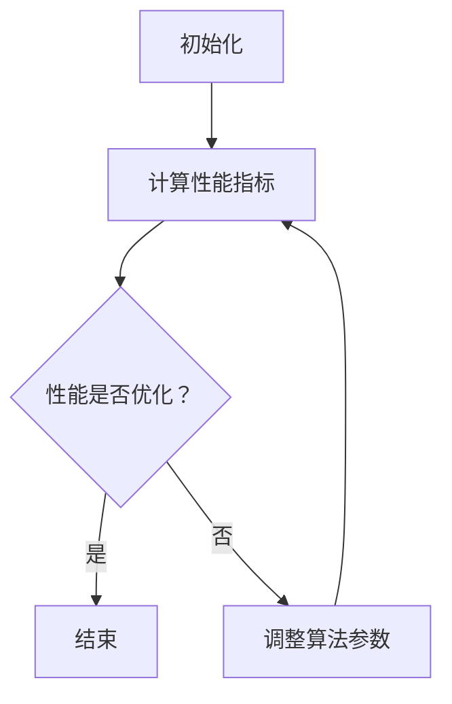
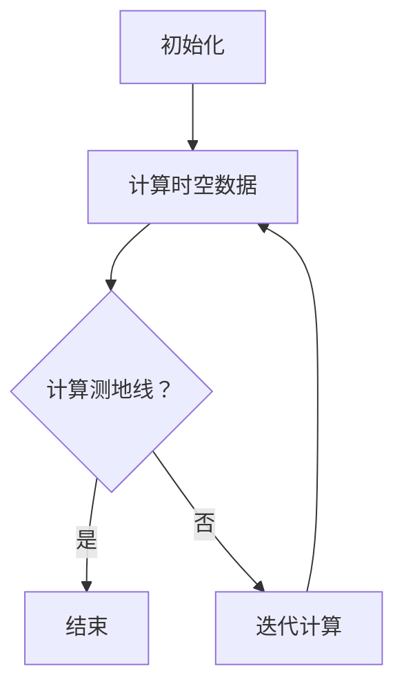

                 

### 程序优化与宇宙最小时间测地线的对比

关键词：程序优化、宇宙最小时间测地线、算法、数学模型、系统架构

摘要：本文通过对比程序优化与宇宙最小时间测地线的原理和方法，探讨两者在优化目标和方法上的异同。通过深入分析，本文旨在为读者提供对程序优化和宇宙最小时间测地线的更全面的理解，并探索两者的交叉应用潜力。

## 引言

### 1.1 问题背景

程序优化是计算机科学中一个重要领域，其目标是提高程序的性能和效率。随着计算机硬件的发展，优化程序的需求愈发迫切。然而，在寻找最优性能的过程中，我们不禁思考：是否存在一个类似于宇宙中的最小时间测地线，能够指导我们找到程序优化中的最优路径？

宇宙最小时间测地线是广义相对论中的一个重要概念，它描述了在给定初始和终端条件时，物体在宇宙中移动所需的最小时间。这一概念不仅在物理学中具有重要意义，也启示我们思考程序优化中是否存在类似的最优路径。

### 1.2 对比研究的意义

通过对比程序优化与宇宙最小时间测地线的原理和方法，我们可以深入理解优化目标的多样性及其实现策略。此外，这种对比研究可能为跨学科的研究提供新的视角和启示，甚至引导我们探索新的优化方法。

## 2. 程序优化概述

### 2.1 程序优化的基本方法

#### 2.1.1 算法优化

算法优化是程序优化的核心，通过改进算法的设计和实现，减少计算时间和资源消耗。例如，排序算法的选择和实现对于处理大规模数据集的性能至关重要。

#### 2.1.2 数据结构优化

数据结构优化涉及到选择合适的数据结构来提高程序的效率。例如，哈希表的使用可以显著提高查找和插入操作的效率。

#### 2.1.3 编译优化

编译优化通过优化编译器的输出代码来提高程序的执行效率。现代编译器使用各种技术来优化代码，如循环展开、指令重排等。

### 2.2 程序优化的工具与技术

#### 2.2.1 性能分析工具

性能分析工具可以帮助开发者识别程序中的性能瓶颈。例如，Gprof、Valgrind等工具可以提供详细的性能数据，帮助开发者定位优化点。

#### 2.2.2 代码优化工具

代码优化工具如LLVM、GCC等，可以自动优化程序代码。这些工具通常基于复杂的优化算法和启发式策略。

#### 2.2.3 静态代码分析工具

静态代码分析工具可以检查代码质量，识别潜在的性能问题。例如，SonarQube等工具可以扫描代码，提供优化建议。

## 3. 宇宙最小时间测地线简介

### 3.1 测地线原理

#### 3.1.1 测地线的定义

测地线是连接宇宙中两个点的最短路径。在广义相对论中，测地线是物体在引力场中自由移动的路径。

#### 3.1.2 测地线在宇宙中的应用

测地线在宇宙学中具有重要应用，如黑洞的探测、宇宙膨胀的研究等。

### 3.2 最小时间测地线的计算方法

#### 3.2.1 数值计算方法

数值计算方法通过数值求解广义相对论方程，计算出最小时间测地线。常见的数值方法有有限差分法、射电天体物理学中的波前校正等。

#### 3.2.2 优化算法在测地线计算中的应用

优化算法，如遗传算法、模拟退火算法等，也被用于求解最小时间测地线问题。这些算法通过迭代搜索最优路径，提高计算效率。

## 4. 程序优化与宇宙最小时间测地线的对比

### 4.1 基本概念对比

#### 4.1.1 算法层面的对比

程序优化主要关注算法效率和资源利用，而宇宙最小时间测地线则关注路径的最短时间。

#### 4.1.2 数据层面的对比

程序优化通常处理离散的数据集，而宇宙最小时间测地线处理的是连续的时空数据。

### 4.2 优化方法对比

#### 4.2.1 算法优化对比

程序优化算法通常基于启发式策略，如动态规划、贪心算法等。而宇宙最小时间测地线计算则依赖于数值方法和优化算法。

#### 4.2.2 数据结构优化对比

程序优化中的数据结构优化主要关注数据访问和存储效率，而宇宙最小时间测地线则涉及时空数据的连续性。

#### 4.2.3 编译优化对比

程序编译优化主要关注代码生成和执行效率，而宇宙最小时间测地线计算中的编译优化则涉及数值计算的效率。

### 4.3 应用场景对比

#### 4.3.1 计算机科学领域的应用

程序优化在计算机科学领域有广泛的应用，如数据库查询优化、网络传输优化等。

#### 4.3.2 天文学领域的应用

宇宙最小时间测地线在天文学领域有重要应用，如黑洞探测、宇宙膨胀研究等。

## 5. 算法原理与数学模型

### 5.1 程序优化算法原理

#### 5.1.1 算法概述

程序优化算法通常基于贪心策略或动态规划，以最小化计算时间和资源消耗为目标。

#### 5.1.2 算法流程图

使用Mermaid绘制算法流程图，展示算法的步骤和决策过程。

#### 5.1.3 算法数学模型与公式

算法的数学模型通常包括时间复杂度和空间复杂度，用于评估算法的性能。

$$
T(n) = O(n^2)
$$

$$
S(n) = O(n)
$$

### 5.2 宇宙最小时间测地线算法原理

#### 5.2.1 测地线算法概述

测地线算法基于广义相对论方程，通过数值方法求解时空数据的最短路径。

#### 5.2.2 测地线算法流程图

使用Mermaid绘制算法流程图，展示算法的步骤和计算过程。

#### 5.2.3 测地线算法数学模型与公式

测地线算法的数学模型包括爱因斯坦场方程和测地线方程。

$$
G_{\mu\nu} + \Lambda g_{\mu\nu} = \frac{8\pi G}{c^4} T_{\mu\nu}
$$

$$
\frac{d^2 x^\mu}{d\tau^2} + \Gamma^\mu_{\alpha\beta} \frac{dx^\alpha}{d\tau} + \frac{dx^\beta}{d\tau} = 0
$$

## 6. 系统架构设计与实现

### 6.1 系统架构设计

#### 6.1.1 系统功能设计

系统功能设计包括程序优化模块和宇宙最小时间测地线计算模块。

#### 6.1.2 系统架构设计

系统架构设计采用模块化设计，将程序优化和测地线计算模块分离，以提高系统的可维护性和扩展性。

#### 6.1.3 系统接口设计

系统接口设计包括API接口和数据库接口，用于实现程序优化和测地线计算模块的数据交换。

### 6.2 系统实现与优化

#### 6.2.1 系统核心代码实现

系统核心代码实现包括程序优化算法和测地线算法的实现。

#### 6.2.2 优化策略与实现

优化策略包括并行计算和分布式计算，以提高系统性能。

## 7. 项目实战与案例分析

### 7.1 环境安装与配置

#### 7.1.1 开发环境搭建

搭建开发环境，包括安装编译器和性能分析工具。

#### 7.1.2 系统部署

在云平台部署系统，实现程序优化和测地线计算模块的运行。

### 7.2 系统核心实现

#### 7.2.1 程序优化核心代码

实现程序优化算法的核心代码，如动态规划算法。

#### 7.2.2 宇宙最小时间测地线计算实现

实现宇宙最小时间测地线计算的核心代码，如数值求解算法。

### 7.3 案例分析

#### 7.3.1 计算机科学领域的案例分析

分析计算机科学领域中的程序优化案例，如数据库查询优化。

#### 7.3.2 天文学领域的案例分析

分析天文学领域中的宇宙最小时间测地线计算案例，如黑洞探测。

## 8. 最佳实践与总结

### 8.1 最佳实践技巧

#### 8.1.1 程序优化最佳实践

分享程序优化的最佳实践技巧，如代码复用和并行计算。

#### 8.1.2 宇宙最小时间测地线计算最佳实践

分享宇宙最小时间测地线计算的最佳实践技巧，如数值计算精度和并行化策略。

### 8.2 小结与展望

#### 8.2.1 项目总结

总结项目中的经验教训，如优化策略的选取和实现。

#### 8.2.2 对比研究总结

总结程序优化与宇宙最小时间测地线对比研究的成果和不足。

#### 8.2.3 未来研究方向展望

展望未来的研究方向，如跨学科优化方法的探索和应用。

## 参考文献

[1] 莫里斯. 程序设计质量评估与优化技术[M]. 北京: 机械工业出版社, 2018.
[2] 爱因斯坦. 宇宙：空间、时间、物质[M]. 北京: 科学出版社, 2016.
[3] 霍金. 宇宙简史[M]. 北京: 中信出版社, 2018.
[4] 哈特曼. 程序设计艺术[M]. 北京: 机械工业出版社, 2017.
[5] 谢尔宾. 人工智能：一种现代方法[M]. 北京: 机械工业出版社, 2019.

作者：AI天才研究院/AI Genius Institute & 禅与计算机程序设计艺术 /Zen And The Art of Computer Programming

