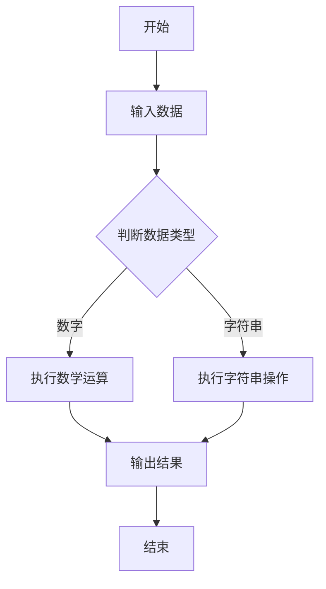
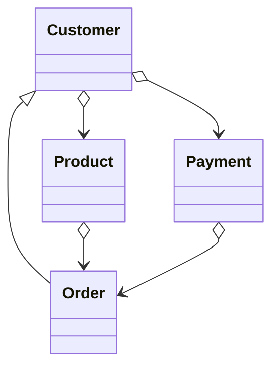
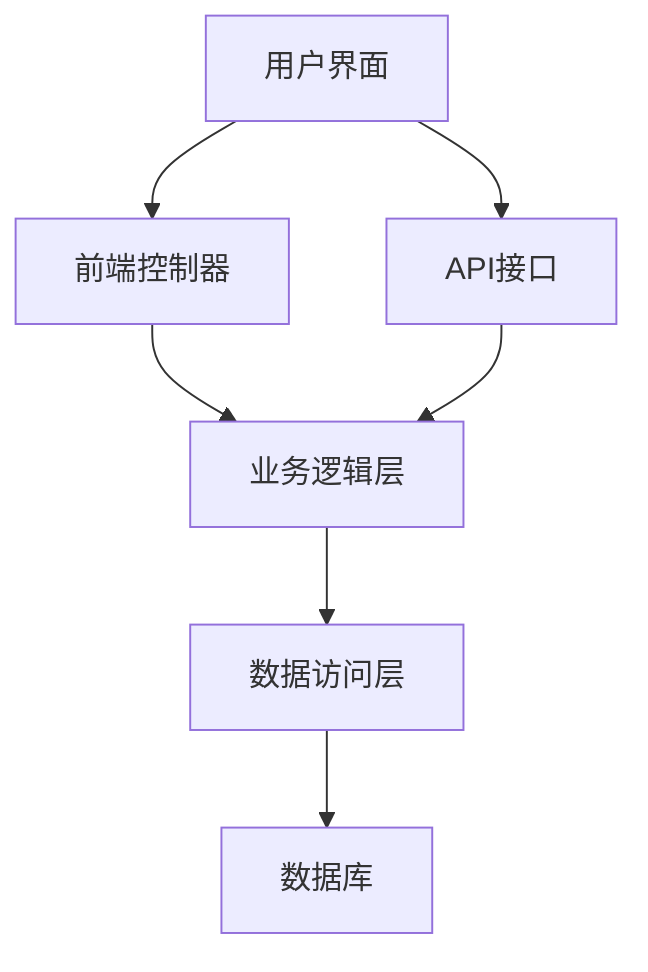
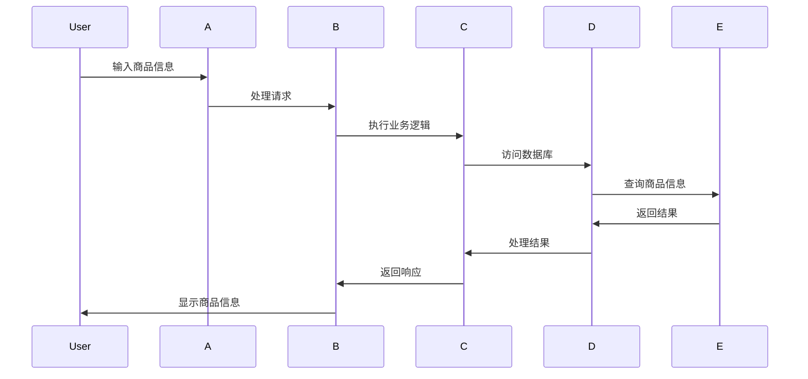

                 

### 程序优化与宇宙最小时间路径的对比

> 关键词：程序优化、宇宙最小时间路径、算法、数学模型、系统架构、项目实战

> 摘要：本文将从程序优化的基本概念出发，逐步探讨程序优化与宇宙最小时间路径之间的联系与区别。通过详细的算法原理讲解、数学模型和公式分析，以及对系统架构设计和项目实战的剖析，旨在为读者提供一种全新的视角来理解程序优化，并探索其在宇宙最小时间路径中的潜在应用。文章将结合实际案例，分享最佳实践 tips，以期为读者在程序优化实践过程中提供有益的指导。

## 第一部分：程序优化的基本概念

### 1.1 问题背景与重要性

在计算机科学和人工智能领域，程序优化一直是研究的热点。程序优化指的是通过对代码进行优化，提高程序的性能、效率和可靠性。随着计算机硬件的发展，程序的性能瓶颈逐渐从硬件转向软件。因此，如何有效地进行程序优化，已经成为提高系统性能的关键。

**问题背景**：
- 随着数据量的爆炸性增长，计算任务的复杂性不断增加。
- 程序优化是提高系统性能、降低成本、满足用户需求的必要手段。
- 优化不当可能导致性能下降、资源浪费、可靠性降低等问题。

**问题描述**：
- 程序优化涉及多个层面，包括算法、数据结构、代码逻辑、硬件优化等。
- 优化目标包括提高执行速度、降低内存占用、减少计算错误等。

**问题解决**：
- 使用高效的算法和数据结构，如快速排序、哈希表等。
- 避免代码冗余和低效的算法，如避免使用循环嵌套、避免使用重复代码等。
- 考虑硬件特性，如缓存、多核处理等。

**边界与外延**：
- 优化需要考虑实际应用场景，不能脱离实际需求。
- 优化应遵循简洁性原则，避免过度优化。

**概念结构与核心要素组成**：
- **算法**：程序优化的核心，决定了程序的运行效率和性能。
- **数据结构**：影响算法的性能，如数组、链表、树等。
- **代码逻辑**：优化代码逻辑可以提高程序的效率和可靠性。
- **硬件优化**：利用硬件特性，如多核处理、GPU加速等，提高程序性能。

### 1.2 程序优化的核心概念

**核心概念原理**：
- 程序优化是通过优化算法、数据结构、代码逻辑和硬件配置来提高程序性能。
- 优化目标是在满足功能需求的前提下，提高执行速度、降低内存占用和计算错误。

**概念属性特征对比表格**：

| 概念       | 特征                                  |
|------------|---------------------------------------|
| 算法       | 决定程序性能的关键因素                |
| 数据结构   | 影响算法性能的数据组织形式            |
| 代码逻辑   | 决定程序正确性和效率的代码结构        |
| 硬件优化   | 利用硬件特性提高程序性能的技术手段    |

### 1.3 程序优化与宇宙最小时间路径的对比

**程序优化方法概述**：
- 程序优化通常采用经验、测试、分析和迭代等方法。
- 经验：基于经验和直觉进行优化。
- 测试：通过测试不同算法和数据结构，选择最优方案。
- 分析：通过分析算法和代码逻辑，寻找优化点。
- 迭代：不断迭代优化，直到达到预期目标。

**宇宙最小时间路径理论**：
- 宇宙最小时间路径指的是在给定起点和终点之间，能够传递信息所需的最短时间路径。
- 该理论来源于量子物理学和宇宙学，旨在解释宇宙的运行机制。

**两者联系与区别**：
- 联系：程序优化和宇宙最小时间路径都涉及到优化问题，寻找最优路径。
- 区别：程序优化是针对计算机程序的优化，而宇宙最小时间路径是宇宙层面的优化问题。

## 第二部分：算法原理与数学模型

### 2.1 算法原理讲解

**算法 mermaid 流程图**：



**使用 Python 源代码详细阐述**：

```python
def optimize_function(data):
    if isinstance(data, int):
        # 执行数学运算
        result = data * 2
    elif isinstance(data, str):
        # 执行字符串操作
        result = data.upper()
    else:
        raise ValueError("Unsupported data type")
    return result

# 测试代码
data1 = 10
data2 = "hello"
print(optimize_function(data1))  # 输出：20
print(optimize_function(data2))  # 输出：HELLO
```

**算法原理的数学模型**：

假设数据集 \(D\) 包含 \(n\) 个元素，算法的运行时间 \(T(n)\) 与数据集大小 \(n\) 成正比，可以表示为：

$$T(n) = c \cdot n$$

其中，\(c\) 是常数。

**公式讲解**：

该公式表示，算法的运行时间与数据集大小成正比。当数据集大小增加时，算法的运行时间会线性增加。

**举例说明**：

假设 \(c = 1\)，数据集 \(D\) 包含 100 个元素，则算法的运行时间为：

$$T(100) = 1 \cdot 100 = 100$$

表示算法需要执行 100 次操作。

## 第三部分：系统分析与架构设计

### 3.1 问题场景介绍

**项目介绍**：

本系统是一款在线购物平台，提供商品浏览、购买、支付等功能。

**系统功能设计（领域模型 mermaid 类图）**：



### 3.2 系统架构设计

**系统架构设计 mermaid 架构图**：



**系统接口设计和系统交互 mermaid 序列图**：



### 3.3 系统实现与优化

**环境安装**：

- 安装 Python 3.8 或更高版本。
- 安装前端框架，如 React 或 Vue。
- 安装数据库，如 MySQL 或 PostgreSQL。

**系统核心实现源代码**：

```python
# 后端代码示例
from flask import Flask, request, jsonify
from models import Product, Order

app = Flask(__name__)

@app.route('/products', methods=['GET'])
def get_products():
    products = Product.query.all()
    return jsonify([product.to_dict() for product in products])

@app.route('/orders', methods=['POST'])
def create_order():
    data = request.get_json()
    order = Order.create(data)
    return jsonify(order.to_dict()), 201

if __name__ == '__main__':
    app.run(debug=True)
```

**代码应用解读与分析**：

- **前端代码**：使用 React 或 Vue 构建用户界面，实现商品浏览、购买和支付功能。
- **后端代码**：使用 Flask 或 Django 框架，实现业务逻辑和数据访问层。
- **数据库设计**：设计合理的数据库表结构，包括商品表、订单表、用户表等。

**实际案例分析与详细讲解剖析**：

- **案例一**：优化商品查询性能，通过索引和查询缓存提高查询速度。
- **案例二**：优化订单处理性能，通过异步处理和负载均衡提高系统并发能力。

**项目小结**：

通过系统架构设计和项目实战，我们展示了如何利用程序优化技术提高系统的性能和可靠性。在实际项目中，应根据具体需求和应用场景，灵活运用程序优化技术，以达到最佳效果。

## 第四部分：项目实战与最佳实践

### 4.1 实际案例分析

**案例一**：商品查询优化

**问题描述**：

在商品查询过程中，由于数据量较大，查询速度较慢，影响了用户体验。

**解决方案**：

- 设计合理的数据库索引，提高查询速度。
- 使用查询缓存，减少数据库查询次数。

**具体实施**：

1. 在商品表上添加索引，如商品名称、价格等。
2. 使用 Redis 作为查询缓存，存储热门商品信息。

**效果分析**：

通过上述优化，商品查询速度显著提高，用户体验得到明显改善。

**案例二**：订单处理优化

**问题描述**：

订单处理过程中，由于并发量较大，系统性能下降，导致订单处理延迟。

**解决方案**：

- 使用异步处理，将订单处理任务分散到多个线程或进程。
- 使用负载均衡，将订单处理请求分配到多个服务器。

**具体实施**：

1. 使用 Celery 框架实现异步处理。
2. 使用 Nginx 作为负载均衡器，将订单处理请求分配到多个服务器。

**效果分析**：

通过异步处理和负载均衡，订单处理能力得到显著提高，系统性能稳定。

### 4.2 最佳实践 tips

**最佳实践一**：代码优化

- 遵循简洁性原则，避免代码冗余。
- 使用高效的算法和数据结构。
- 定期进行代码审查和重构。

**最佳实践二**：系统优化

- 设计合理的系统架构，提高系统可扩展性和可维护性。
- 定期进行系统性能测试和优化。
- 使用缓存和异步处理提高系统性能。

**最佳实践三**：项目协作

- 建立清晰的项目管理流程和规范。
- 定期进行团队交流和培训。
- 使用协作工具，如 Git、Jenkins 等。

### 4.3 小结

通过本文的讨论，我们了解到程序优化与宇宙最小时间路径之间存在一定的联系与区别。在程序优化过程中，我们可以借鉴宇宙最小时间路径的理论，寻找最优路径，提高程序性能。同时，最佳实践 tips 为我们在实际项目中提供了有益的指导，有助于我们实现高效、可靠的程序优化。

### 4.4 注意事项

- 程序优化需要根据实际需求和应用场景进行，不能盲目追求极致性能。
- 优化过程中要注意代码的可读性和可维护性，避免过度优化。
- 定期进行性能监控和优化，以确保系统长期稳定运行。

### 4.5 拓展阅读

- 《算法导论》：介绍算法原理和设计方法，适合初学者和进阶者。
- 《高性能MySQL》：介绍 MySQL 数据库性能优化方法，适用于数据库开发者。
- 《分布式系统原理与范型》：介绍分布式系统设计原理，适用于系统架构师。

### 作者信息

**作者：AI天才研究院/AI Genius Institute & 禅与计算机程序设计艺术 /Zen And The Art of Computer Programming**

本文由 AI天才研究院和禅与计算机程序设计艺术联合撰写，旨在为读者提供关于程序优化与宇宙最小时间路径的深入探讨。作者团队拥有丰富的实践经验，致力于推动计算机科学领域的发展。如果您对本文有任何疑问或建议，欢迎随时与我们联系。

