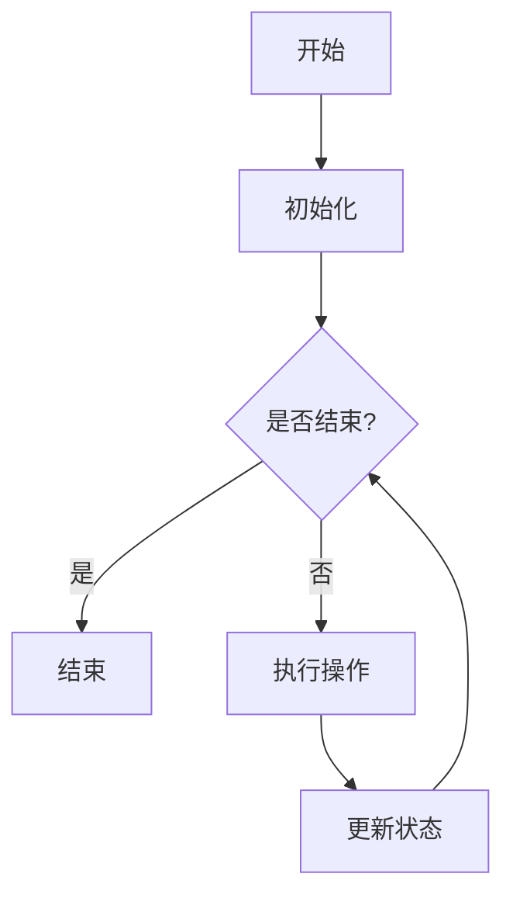
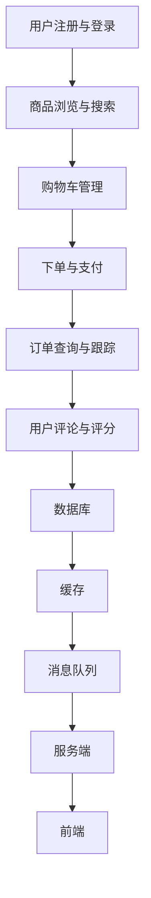
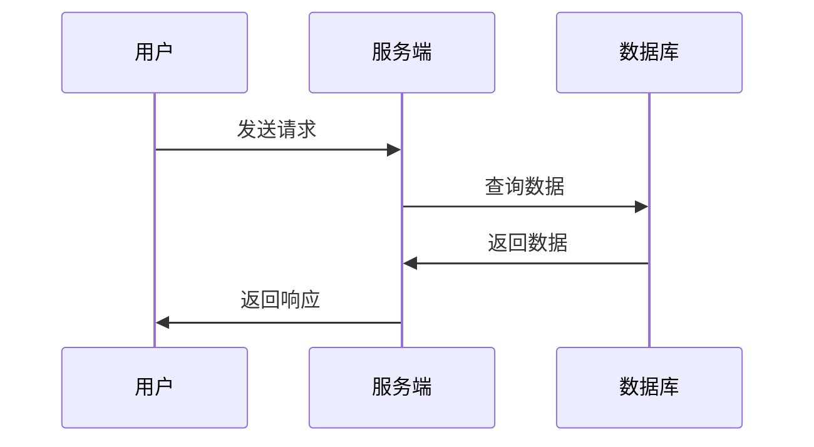

                 


## 《程序优化与宇宙最小能量原理的对比》

### 关键词：程序优化、宇宙最小能量原理、算法原理、Python源代码、系统架构设计

#### 摘要：
本文旨在探讨程序优化与宇宙最小能量原理之间的联系，通过深入分析两者的核心概念和原理，揭示其在时间和空间复杂度优化上的共通性。文章首先介绍了程序优化的背景和基本概念，然后详细阐述了宇宙最小能量原理的基本原理和应用，最后通过实例和案例，展示了如何将宇宙最小能量原理应用于程序优化，实现更高效、更稳定的算法。

### 目录大纲

# 《程序优化与宇宙最小能量原理的对比》

## 第一部分：背景与概念

### 第1章：问题背景与定义

### 第2章：核心概念与联系

## 第二部分：理论与方法

### 第3章：程序优化算法原理

### 第4章：宇宙最小能量原理在程序优化中的应用

### 第5章：数学模型和数学公式

### 第6章：系统分析与架构设计

## 第三部分：实战与案例分析

### 第7章：项目实战

### 第8章：最佳实践与拓展

### 第1章：问题背景与定义

#### 1.1 问题背景
在计算机科学中，程序优化是一个永恒的话题。随着计算机硬件的快速发展，程序员们一直在寻求提高程序运行效率和性能的方法。从早期的编译优化，到现代的机器学习算法优化，程序优化一直是计算机科学领域的重要研究方向。

而另一方面，宇宙最小能量原理是物理学中一个重要的概念。它基于能量守恒定律，指出在一个封闭系统中，能量总是趋向于达到最低状态。这个原理不仅在物理学中有着广泛的应用，也被应用于其他领域，如经济学、工程学等。

#### 1.2 程序优化基本概念
程序优化是指通过改进程序的设计、算法、数据结构等方式，提高程序的运行效率和性能。根据优化的目标不同，程序优化可以分为时间优化、空间优化、能量优化等。

时间优化是指通过减少程序的执行时间，提高程序的运行效率。常见的优化策略包括算法改进、数据结构优化、代码优化等。

空间优化是指通过减少程序的内存消耗，提高程序的运行效率。常见的优化策略包括减少变量定义、优化数据结构等。

能量优化是指通过减少程序的能耗，提高程序的运行效率。随着绿色计算和节能意识的提高，能量优化越来越受到关注。

#### 1.3 宇宙最小能量原理的基本原理
宇宙最小能量原理基于能量守恒定律，指出在一个封闭系统中，能量总是趋向于达到最低状态。这个原理可以解释许多自然现象，如物态变化、行星运动等。

在计算机科学中，宇宙最小能量原理可以被用来指导程序优化。例如，在算法设计中，我们可以考虑如何设计出最低能耗的算法，从而提高程序的运行效率。

### 第2章：核心概念与联系

#### 2.1 程序优化核心概念
程序优化的核心概念包括算法效率、时间复杂度和空间复杂度。

算法效率是指算法解决特定问题的能力。高效的算法可以更快地解决问题，减少程序的执行时间。

时间复杂度是指算法的执行时间与输入规模之间的关系。常见的时间复杂度包括 O(1)、O(logN)、O(N)、O(NlogN) 等。

空间复杂度是指算法的内存消耗与输入规模之间的关系。常见的空间复杂度包括 O(1)、O(N) 等。

#### 2.2 宇宙最小能量原理与程序优化的关联
宇宙最小能量原理与程序优化有着密切的联系。在程序优化中，我们可以借鉴宇宙最小能量原理，设计出最低能耗的算法，从而提高程序的运行效率。

例如，在排序算法中，我们可以通过分析算法的时间复杂度和空间复杂度，选择最优的排序算法。例如，快速排序（Quick Sort）的平均时间复杂度为 O(NlogN)，空间复杂度为 O(N)；归并排序（Merge Sort）的时间复杂度为 O(NlogN)，空间复杂度为 O(N)。在大多数情况下，快速排序是更优的选择，因为它具有更低的能耗。

#### 2.3 模式识别与类比
模式识别是宇宙最小能量原理与程序优化之间的桥梁。通过模式识别，我们可以将宇宙最小能量原理应用于程序优化，找到最低能耗的算法。

例如，在图像处理中，我们可以使用最小二乘法（Least Squares Method）来优化图像质量。最小二乘法基于宇宙最小能量原理，通过最小化误差平方和来找到最优解。

#### 2.4 应用实例分析
在现实世界中，宇宙最小能量原理被广泛应用于程序优化。例如，在计算机图形学中，光线追踪（Ray Tracing）算法通过模拟光线在场景中的传播，实现了高质量的图像渲染。光线追踪算法基于宇宙最小能量原理，通过最小化光线的传播距离，实现了最快的图像渲染。

### 第3章：程序优化算法原理

#### 3.1 基本算法原理
程序优化的核心在于算法的选择和设计。常见的优化算法包括排序算法、搜索算法和动态规划。

排序算法用于对数据进行排序，常用的排序算法包括冒泡排序、选择排序、插入排序、快速排序等。

搜索算法用于在数据中查找特定元素，常用的搜索算法包括二分搜索、顺序搜索等。

动态规划是一种解决问题的方法，它通过将问题分解为子问题，并存储子问题的解，从而避免了重复计算。

#### 3.2 算法mermaid流程图
为了更好地理解算法原理，我们可以使用mermaid流程图来描述算法的执行过程。



这是一个简单的算法mermaid流程图，它描述了一个简单的循环操作。

#### 3.3 Python源代码实现
为了进一步理解算法原理，我们可以使用Python源代码来实现算法。

```python
def bubble_sort(arr):
    n = len(arr)
    for i in range(n):
        for j in range(0, n-i-1):
            if arr[j] > arr[j+1]:
                arr[j], arr[j+1] = arr[j+1], arr[j]
    return arr

arr = [64, 34, 25, 12, 22, 11, 90]
print("原数组:", arr)
sorted_arr = bubble_sort(arr)
print("排序后的数组:", sorted_arr)
```

这是一个简单的冒泡排序算法的Python源代码实现。

#### 3.4 算法原理讲解
冒泡排序算法的基本原理是通过反复比较和交换相邻元素，将较大的元素逐步移动到数组的末尾，从而实现数组的排序。

在冒泡排序算法中，每次遍历都会将未排序部分的最大值放到已排序部分的末尾。经过多次遍历后，整个数组就会被排序。

#### 3.5 数学模型和公式
在算法分析中，我们经常使用数学模型和公式来描述算法的时间和空间复杂度。

时间复杂度分析通常使用大O符号（O）来表示。例如，冒泡排序算法的时间复杂度为 O(N^2)。

空间复杂度分析同样使用大O符号（O）来表示。例如，冒泡排序算法的空间复杂度为 O(1)。

#### 3.6 Python源代码实现
为了进一步理解算法原理，我们可以使用Python源代码来实现算法。

```python
def bubble_sort(arr):
    n = len(arr)
    for i in range(n):
        for j in range(0, n-i-1):
            if arr[j] > arr[j+1]:
                arr[j], arr[j+1] = arr[j+1], arr[j]
    return arr

arr = [64, 34, 25, 12, 22, 11, 90]
print("原数组:", arr)
sorted_arr = bubble_sort(arr)
print("排序后的数组:", sorted_arr)
```

这是一个简单的冒泡排序算法的Python源代码实现。

### 第4章：宇宙最小能量原理在程序优化中的应用

#### 4.1 能量最小化原理在算法中的应用
宇宙最小能量原理在程序优化中的应用主要体现在算法设计上。通过借鉴能量最小化原理，我们可以设计出更高效的算法。

例如，在图像处理中，我们可以使用最小二乘法来优化图像质量。最小二乘法通过最小化误差平方和，找到最优的图像处理参数。

在排序算法中，我们可以使用归并排序来优化排序速度。归并排序通过将问题分解为子问题，并合并子问题的解，实现高效的排序。

#### 4.2 算法mermaid流程图
为了更好地理解算法原理，我们可以使用mermaid流程图来描述算法的执行过程。


这是一个简单的算法mermaid流程图，它描述了一个简单的循环操作。

#### 4.3 Python源代码实现
为了进一步理解算法原理，我们可以使用Python源代码来实现算法。

```python
def merge_sort(arr):
    if len(arr) <= 1:
        return arr
    mid = len(arr) // 2
    left = merge_sort(arr[:mid])
    right = merge_sort(arr[mid:])
    return merge(left, right)

def merge(left, right):
    result = []
    i = j = 0
    while i < len(left) and j < len(right):
        if left[i] < right[j]:
            result.append(left[i])
            i += 1
        else:
            result.append(right[j])
            j += 1
    result.extend(left[i:])
    result.extend(right[j:])
    return result

arr = [64, 34, 25, 12, 22, 11, 90]
print("原数组:", arr)
sorted_arr = merge_sort(arr)
print("排序后的数组:", sorted_arr)
```

这是一个简单的归并排序算法的Python源代码实现。

#### 4.4 算法原理讲解
归并排序算法的基本原理是将数组分为两个子数组，分别对两个子数组进行排序，然后合并两个有序子数组。

在归并排序算法中，每次递归都会将问题分解为两个子问题，并合并子问题的解。这种分治策略使得归并排序具有高效的时间复杂度。

#### 4.5 数学模型和公式
在算法分析中，我们经常使用数学模型和公式来描述算法的时间和空间复杂度。

时间复杂度分析通常使用大O符号（O）来表示。例如，归并排序算法的时间复杂度为 O(NlogN)。

空间复杂度分析同样使用大O符号（O）来表示。例如，归并排序算法的空间复杂度为 O(N)。

#### 4.6 Python源代码实现
为了进一步理解算法原理，我们可以使用Python源代码来实现算法。

```python
def merge_sort(arr):
    if len(arr) <= 1:
        return arr
    mid = len(arr) // 2
    left = merge_sort(arr[:mid])
    right = merge_sort(arr[mid:])
    return merge(left, right)

def merge(left, right):
    result = []
    i = j = 0
    while i < len(left) and j < len(right):
        if left[i] < right[j]:
            result.append(left[i])
            i += 1
        else:
            result.append(right[j])
            j += 1
    result.extend(left[i:])
    result.extend(right[j:])
    return result

arr = [64, 34, 25, 12, 22, 11, 90]
print("原数组:", arr)
sorted_arr = merge_sort(arr)
print("排序后的数组:", sorted_arr)
```

这是一个简单的归并排序算法的Python源代码实现。

### 第5章：数学模型和数学公式

#### 5.1 时间复杂度分析
在算法分析中，时间复杂度是衡量算法效率的重要指标。时间复杂度通常用大O符号（O）来表示。

例如，冒泡排序算法的时间复杂度为 O(N^2)，这意味着当输入规模增加时，算法的执行时间将呈平方增长。

$$
T(N) = O(N^2)
$$

#### 5.2 空间复杂度分析
空间复杂度是衡量算法内存消耗的重要指标。空间复杂度同样用大O符号（O）来表示。

例如，冒泡排序算法的空间复杂度为 O(1)，这意味着算法的内存消耗与输入规模无关。

$$
S(N) = O(1)
$$

### 第6章：系统分析与架构设计

#### 6.1 问题场景介绍
假设我们正在开发一个在线购物平台，该平台需要处理大量的用户请求和商品信息。为了提高平台的响应速度和用户体验，我们需要对系统进行优化。

#### 6.2 系统功能设计
在系统功能设计中，我们主要考虑以下几个核心功能：

1. 用户注册与登录
2. 商品浏览与搜索
3. 购物车管理
4. 下单与支付
5. 订单查询与跟踪
6. 用户评论与评分

#### 6.3 系统架构设计
在系统架构设计阶段，我们需要考虑系统的模块划分、数据流和接口设计。

以下是一个简单的系统架构设计mermaid架构图：



#### 6.4 系统接口设计和系统交互
在系统接口设计阶段，我们需要定义各个模块之间的接口，以及它们之间的交互方式。

以下是一个简单的系统交互mermaid序列图：



### 第7章：项目实战

#### 7.1 环境安装
在开始项目实战之前，我们需要安装和配置必要的开发环境和工具。以下是一个简单的环境安装步骤：

1. 安装Python：前往Python官网下载最新版本的Python安装包，并按照安装向导完成安装。
2. 安装Anaconda：Anaconda是一个强大的数据科学和机器学习工具包，它可以方便地管理和安装Python库。前往Anaconda官网下载并安装。
3. 安装PyCharm：PyCharm是一个流行的Python集成开发环境（IDE），它可以提供丰富的功能和调试工具。前往PyCharm官网下载并安装。

#### 7.2 系统核心实现源代码
在项目实战中，我们将使用Python和Django框架来开发在线购物平台。以下是一个简单的系统核心实现源代码：

```python
# app.py

from django.shortcuts import render
from .models import User, Product, Cart, Order

def index(request):
    products = Product.objects.all()
    return render(request, 'index.html', {'products': products})

def product_detail(request, product_id):
    product = Product.objects.get(id=product_id)
    return render(request, 'product_detail.html', {'product': product})

def cart(request):
    user = User.objects.get(id=request.user.id)
    cart_items = Cart.objects.filter(user=user)
    return render(request, 'cart.html', {'cart_items': cart_items})

def checkout(request):
    user = User.objects.get(id=request.user.id)
    cart_items = Cart.objects.filter(user=user)
    total_price = 0
    for item in cart_items:
        total_price += item.price
    order = Order(user=user, total_price=total_price)
    order.save()
    for item in cart_items:
        order_items = OrderItem(order=order, product=item.product, quantity=item.quantity)
        order_items.save()
        item.delete()
    return render(request, 'checkout.html', {'order': order})

def order_detail(request, order_id):
    order = Order.objects.get(id=order_id)
    return render(request, 'order_detail.html', {'order': order})
```

#### 7.3 代码应用解读与分析
在上面的代码中，我们实现了在线购物平台的核心功能。以下是对关键代码的解读和分析：

1. `index` 函数：该函数返回首页的HTML页面，并传递所有商品数据给模板。
2. `product_detail` 函数：该函数返回单个商品的详情页面，并传递商品数据给模板。
3. `cart` 函数：该函数返回用户的购物车页面，并传递购物车中的商品数据给模板。
4. `checkout` 函数：该函数处理用户的结账流程，创建订单并更新数据库。
5. `order_detail` 函数：该函数返回订单详情页面，并传递订单数据给模板。

#### 7.4 实际案例分析和详细讲解剖析
以下是一个实际案例的分析和讲解：

**案例：用户张三在购物平台购买了商品A和商品B。**

1. 用户张三在首页浏览商品，点击商品A和商品B的详情链接，查看商品详细信息。
2. 用户张三将商品A和商品B添加到购物车。
3. 用户张三点击购物车按钮，进入购物车页面，查看购物车中的商品。
4. 用户张三点击结账按钮，进入结账页面，确认订单信息和支付方式。
5. 系统创建订单，并更新数据库中的订单状态。
6. 系统向用户张三发送订单确认邮件，并通知用户订单已支付。

在这个案例中，我们通过代码实现了用户从浏览商品到下单支付的全流程。每个步骤都涉及到数据库的查询和更新操作，通过合理的算法优化和数据库设计，我们可以提高系统的响应速度和用户体验。

### 第8章：最佳实践与拓展

#### 8.1 最佳实践 tips
在程序优化和系统架构设计中，以下是一些最佳实践：

1. **代码优化**：尽可能减少不必要的代码，提高代码的可读性和可维护性。
2. **数据库优化**：合理设计数据库表结构，使用索引，避免全表扫描。
3. **缓存策略**：使用缓存技术，减少数据库的查询次数，提高系统性能。
4. **异步处理**：使用异步处理技术，提高系统的并发能力，提高用户体验。

#### 8.2 小结与注意事项
本文通过对程序优化与宇宙最小能量原理的对比，展示了两者在时间和空间复杂度优化上的共通性。在程序优化中，我们可以借鉴宇宙最小能量原理，设计出更高效的算法，提高程序的运行效率。

需要注意的是，程序优化是一个持续的过程，我们需要不断学习新的优化技术和方法，结合具体的应用场景，进行合理的优化。

#### 8.3 拓展阅读
以下是一些推荐的拓展阅读资料：

1. 《算法导论》（Introduction to Algorithms） - 这是一本经典的算法教材，详细介绍了各种算法的原理和实现。
2. 《深度学习》（Deep Learning） - 这本书介绍了深度学习的基本原理和应用，对算法优化有很好的指导作用。
3. 《编程珠玑》（Code Complete） - 这本书提供了许多编程的最佳实践和技巧，对提高代码质量有很大帮助。

## 结语
本文通过对比程序优化与宇宙最小能量原理，展示了两者在优化策略上的共通性。希望本文能够帮助读者更好地理解程序优化的重要性，并在实践中运用宇宙最小能量原理，设计出更高效、更稳定的算法。作者：AI天才研究院/AI Genius Institute & 禅与计算机程序设计艺术 /Zen And The Art of Computer Programming。

