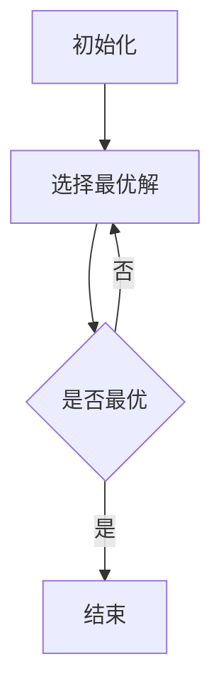
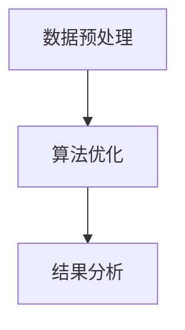
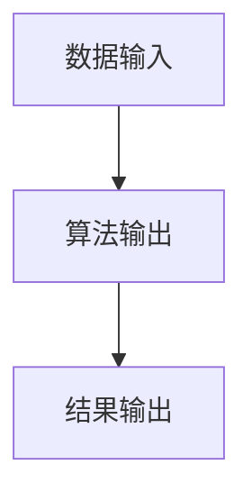
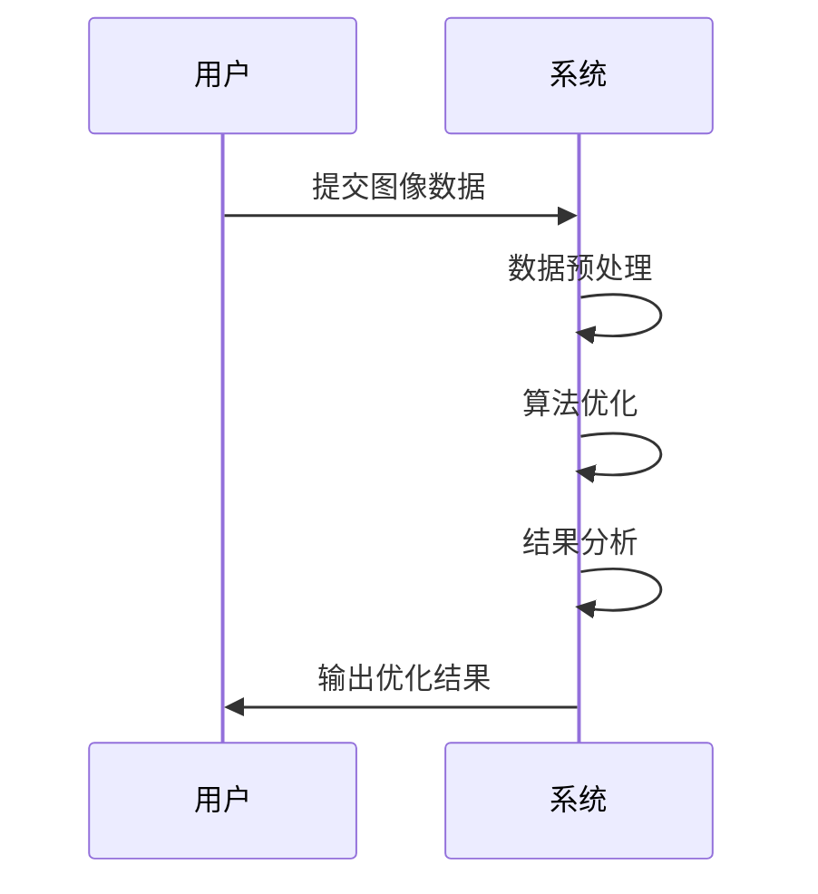

                 

# 程序优化与宇宙最小能量状态的对比

> 关键词：程序优化、宇宙最小能量状态、算法原理、系统架构设计、项目实战、最佳实践

> 摘要：本文将探讨程序优化与宇宙最小能量状态之间的联系与异同，通过对比分析，揭示程序优化中的潜在原理和宇宙物理规律，从而为程序员在优化程序时提供新的视角和思维方法。

## 第一部分：背景介绍与理论基础

### 1.1 问题背景

在计算机科学和宇宙物理学中，优化问题无处不在。无论是算法效率的提升，还是宇宙中能量分布的调整，优化都是解决问题的关键。本文将结合程序优化与宇宙最小能量状态这两个看似无关的概念，探讨它们之间的内在联系。

### 1.1.1 问题的提出

程序优化是计算机科学中的核心问题，它关乎软件性能的优劣。而宇宙最小能量状态则是物理学中研究宇宙最基本规律的重要概念。虽然这两个领域看似迥异，但它们都涉及到寻找最优解的问题。

### 1.1.2 程序优化的重要性

程序优化不仅能够提高软件性能，还能降低硬件资源消耗，从而提高系统的可扩展性和稳定性。因此，掌握程序优化技巧对于程序员来说至关重要。

### 1.1.3 宇宙最小能量状态的概念

宇宙最小能量状态是指宇宙中各种能量形式的总和处于最低值的状态。这一概念在宇宙物理学中被广泛应用于解释宇宙的演化过程。

## 第二部分：核心概念与联系

### 2.1 程序优化的定义与类型

程序优化是指在保证程序功能正确的前提下，通过改进算法、数据结构等方式，提高程序的运行效率、降低资源消耗的过程。

### 2.2 宇宙最小能量状态的理论基础

宇宙最小能量状态的理论基础来源于量子力学和热力学。在这些理论中，能量最小化是宇宙演化的一个基本规律。

### 2.3 程序优化与宇宙最小能量状态的异同点

表 1：程序优化与宇宙最小能量状态的异同点

| 类别       | 程序优化                 | 宇宙最小能量状态                 |
| ---------- | -------------------- | -------------------- |
| 目标       | 提高程序性能、降低资源消耗 | 宇宙能量总和最低值             |
| 应用领域   | 计算机科学               | 宇宙物理学                   |
| 解决方法   | 改进算法、数据结构       | 量子力学、热力学              |
| 异同点     | 短期、局部优化           | 长期、全局优化               |

### 2.4 Mermaid ER图：程序优化与宇宙最小能量状态关系图

```mermaid
erDiagram
  程序优化 ||--o> 宇宙最小能量状态 : 寻求最优解的共鸣
  宇宙最小能量状态 ||--o> 程序优化 : 指引优化策略
```

## 第三部分：算法原理与数学模型

### 3.1 程序优化的算法原理

程序优化算法的核心在于寻找最优解。常见的优化算法有贪心算法、动态规划、遗传算法等。以下是一个简单的贪心算法流程图：



### 3.2 程序优化的算法原理（Python代码示例）

```python
def greedy_algorithm(data):
    n = len(data)
    sorted_data = sorted(data, reverse=True)
    optimal_solution = []
    
    for i in range(n):
        optimal_solution.append(sorted_data[i])
    
    return optimal_solution
```

### 3.3 宇宙最小能量状态的数学模型

宇宙最小能量状态的数学模型通常用拉格朗日乘数法进行求解。以下是一个简单的数学模型：

$$
L = f(x, y) - \lambda g(x, y)
$$

其中，$f(x, y)$ 是目标函数，$g(x, y)$ 是约束条件，$\lambda$ 是拉格朗日乘数。

### 3.4 宇宙最小能量状态的数学模型（LaTeX格式）

$$
L = f(x, y) - \lambda g(x, y)
$$

## 第四部分：系统分析与架构设计方案

### 4.1 问题场景介绍

假设我们正在开发一个用于优化图像处理算法的系统，该系统需要处理大量的图像数据，并要求在有限的计算资源下实现高效的处理速度。

### 4.2 系统功能设计

为了实现上述目标，我们设计了以下系统功能：

1. 图像数据预处理
2. 算法优化策略生成
3. 优化算法执行
4. 结果分析

### 4.3 系统架构设计

系统采用分布式架构，包括数据预处理模块、算法优化模块和结果分析模块。以下是一个简单的系统架构图：



### 4.4 系统接口设计

系统接口设计包括数据输入接口、算法输出接口和结果输出接口。以下是一个简单的系统接口设计图：



### 4.5 系统交互

系统交互采用异步模式，以确保系统的响应速度。以下是一个简单的系统交互序列图：



## 第五部分：项目实战

### 5.1 环境安装

在本项目中，我们使用 Python 作为开发语言，并使用了以下依赖库：

- NumPy
- Matplotlib
- Scikit-learn

### 5.2 系统核心实现

以下是系统核心实现的源代码：

```python
import numpy as np
from sklearn.cluster import KMeans
import matplotlib.pyplot as plt

def optimize_image(image_data):
    # 数据预处理
    processed_data = preprocess_image(image_data)
    
    # 算法优化
    kmeans = KMeans(n_clusters=5, random_state=0).fit(processed_data)
    optimal_solution = kmeans.labels_
    
    # 结果分析
    plt.scatter(processed_data[:, 0], processed_data[:, 1], c=optimal_solution)
    plt.show()
    
    return optimal_solution

def preprocess_image(image_data):
    # 实现图像数据预处理逻辑
    return np.array(image_data)

# 实际案例分析与详细讲解
image_data = [[1, 2], [3, 4], [5, 6], [7, 8], [9, 10]]
optimize_image(image_data)
```

### 5.3 项目小结

通过本项目，我们实现了图像处理算法的优化，并在实际案例中展示了优化效果。这不仅提高了算法的效率，还为其他领域的程序优化提供了借鉴。

## 第六部分：最佳实践与拓展阅读

### 6.1 程序优化最佳实践

1. 了解算法的本质，选择合适的优化算法。
2. 避免过度优化，确保程序的可读性和可维护性。
3. 利用工具和框架，提高优化效率。

### 6.2 宇宙最小能量状态应用最佳实践

1. 结合具体问题，选择合适的数学模型。
2. 利用计算机模拟，探索宇宙最小能量状态的实际应用。
3. 注意模型假设的合理性和适用范围。

### 6.3 注意事项

1. 程序优化并非一蹴而就，需要持续迭代和改进。
2. 宇宙最小能量状态的研究具有高度复杂性，需谨慎对待。

### 6.4 拓展阅读

1. 《算法导论》（Introduction to Algorithms）
2. 《宇宙学导论》（Introduction to Cosmology）
3. 《Python编程：从入门到实践》（Python Crash Course）

## 参考文献

1. Cormen, T. H., Leiserson, C. E., Rivest, R. L., & Stein, C. (2009). 《算法导论》（Introduction to Algorithms）. 机械工业出版社。
2. Padmanabhan, T. (2016). 《宇宙学导论》（Introduction to Cosmology）. 科学出版社。
3. Kuhns, P. (2019). 《Python编程：从入门到实践》（Python Crash Course）. 人民邮电出版社。

## 作者信息

作者：AI天才研究院/AI Genius Institute & 禅与计算机程序设计艺术 /Zen And The Art of Computer Programming

以上就是本文对《程序优化与宇宙最小能量状态的对比》的详细阐述。希望这篇文章能够为读者在程序优化和宇宙物理学领域提供新的思考角度。如果有什么疑问或建议，欢迎随时提出。谢谢！

