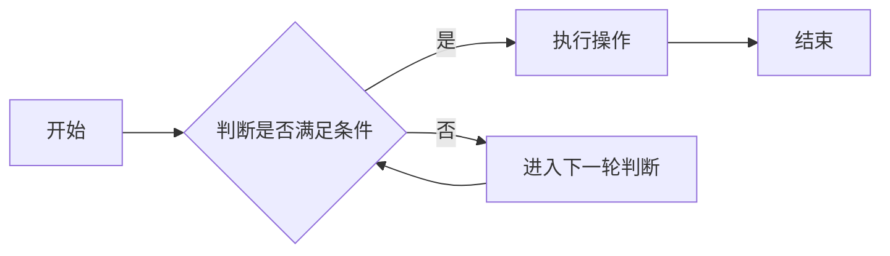
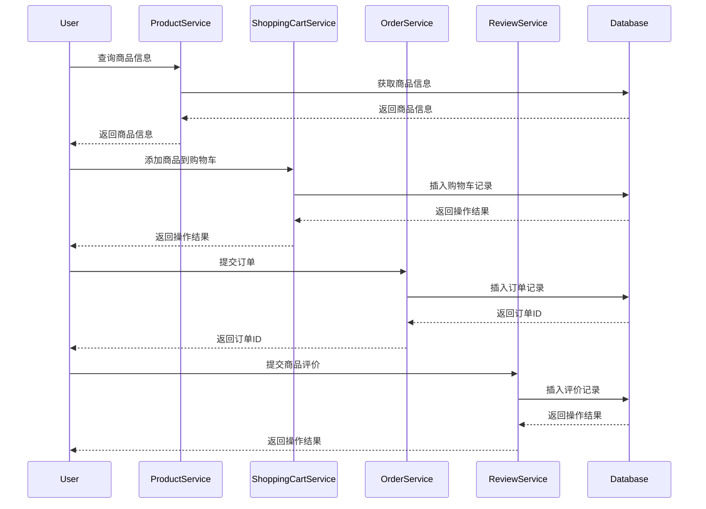
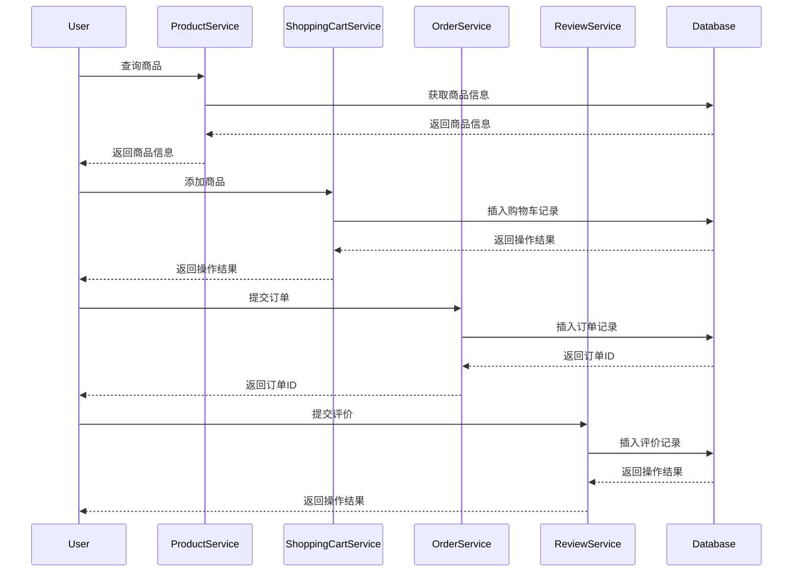

                 

### 第1章: 引言

#### 1.1 问题背景

在当今信息技术飞速发展的时代，程序设计已经成为推动社会进步的重要力量。然而，随着软件系统的复杂度不断增加，程序员在编写代码时面临着诸多挑战。传统的程序设计方法往往侧重于功能的实现，而忽视了代码的可读性、可维护性和效率。为了解决这些问题，我们需要从更宏观的视角，借鉴自然界中的宇宙法则，来指导我们的程序设计。

宇宙法则，是指在自然界中普遍存在的规律，如牛顿的万有引力定律、热力学第一定律等。这些法则不仅在物理学、化学等领域有着重要的应用，也可以为我们提供程序设计的启示。例如，宇宙中万物皆遵循熵增原理，这一原理启示我们在程序设计中要注重系统的简洁性，避免过度复杂。

#### 1.2 问题描述

在复杂的软件系统中，程序员常面临以下问题：

1. **代码复杂度高**：随着系统规模的扩大，代码复杂性也随之增加，导致后续维护困难。
2. **维护困难**：随着项目时间的推移，原有的代码可能难以适应新的需求变化，需要进行大量修改。
3. **性能瓶颈**：在高并发的场景下，系统可能因为性能瓶颈而无法满足用户需求。
4. **可读性差**：复杂的代码结构使得新加入的开发者难以理解和修改。

这些问题不仅影响了软件的质量，还降低了开发效率，甚至可能导致项目的失败。

#### 1.3 问题解决

本书将从宇宙法则的视角出发，分析自然界的规律，结合程序设计实际，提出一系列可行的解决方案。具体来说，本书将涵盖以下内容：

1. **宇宙法则与程序设计原则的对比**：分析宇宙法则与程序设计原则之间的联系，探讨如何将宇宙法则融入程序设计中。
2. **设计模式与宇宙法则**：通过具体的编程范例，展示如何将宇宙法则应用于设计模式，提升代码质量。
3. **算法优化**：结合宇宙法则，探讨如何优化算法，提高程序性能。
4. **系统架构设计**：从宇宙法则的角度，分析系统架构设计的关键要素，提出改进方案。
5. **最佳实践**：总结实际项目中的经验教训，给出最佳实践建议。

通过以上内容，本书旨在为程序员提供一种全新的思考方式，帮助他们更好地理解和应用宇宙法则，提升程序设计的质量和效率。

#### 1.4 边界与外延

宇宙法则启示在程序设计中的应用，不仅限于软件开发，还可以拓展到软件工程、系统架构、算法优化等领域。例如，在软件工程中，可以借鉴宇宙中的协同演化原理，优化开发过程；在系统架构设计中，可以借鉴宇宙中的自组织原理，构建灵活、可扩展的系统；在算法优化中，可以借鉴宇宙中的自适应优化策略，提高算法效率。

同时，本书的讨论范围也受到一定的限制。宇宙法则的应用需要结合具体的程序设计场景，因此在某些情况下，可能需要根据实际情况进行灵活调整。此外，本书主要关注通用原则和方法，不涉及具体编程语言的实现细节。

#### 1.5 概念结构与核心要素组成

本书的核心概念包括宇宙法则、程序设计原则、设计模式、软件工程方法和算法优化。这些概念相互关联，共同构成了程序设计中的宇宙法则启示体系。

- **宇宙法则**：宇宙中普遍存在的规律，如熵增原理、协同演化原理、自适应优化策略等。
- **程序设计原则**：指导程序员编写高质量代码的基本原则，如DRY（Don't Repeat Yourself）、KISS（Keep It Simple, Stupid）等。
- **设计模式**：解决特定问题的通用解决方案，如单例模式、工厂模式、策略模式等。
- **软件工程方法**：指导软件开发过程的方法论，如敏捷开发、迭代开发等。
- **算法优化**：通过改进算法设计，提高程序性能的方法。

这些核心概念相互融合，形成了一套完整的程序设计体系。通过本书的学习，读者将能够更好地理解这些概念，并在实际项目中灵活应用，提升程序设计的质量和效率。

## 第2章: 核心概念与联系

在探讨程序设计中的宇宙法则启示时，我们首先需要了解核心概念，并分析它们之间的联系。这一章节将介绍宇宙法则与程序设计原则的关系，并通过对比表格和ER实体关系图，进一步阐明这些概念在程序设计中的应用。

### 2.1 核心概念原理

宇宙法则在自然界中起着基础性的作用，指导着万物的发展和演化。以下是一些关键的宇宙法则及其原理：

1. **熵增原理**：在一个封闭系统中，熵（无序度）总是趋向于增加。这一原理启示我们在程序设计中要追求系统的简洁性，避免过度复杂。
2. **协同演化原理**：在自然界中，个体之间的协同作用能够推动整个生态系统的演化。这一原理可以应用于软件开发中，通过团队合作和模块化设计，提升系统的整体性能。
3. **自适应优化策略**：生物体在进化过程中，通过不断适应环境变化，实现了优化。这一原理可以应用于算法优化，通过动态调整算法参数，提高程序性能。

而程序设计原则则是程序员在编写代码时遵循的基本准则，以确保代码的高质量。以下是一些常见的程序设计原则：

1. **DRY（Don't Repeat Yourself）**：避免重复代码，通过提取公共逻辑，提高代码复用性。
2. **KISS（Keep It Simple, Stupid）**：保持代码简洁，避免过度设计，确保代码易于理解和维护。
3. **LOD（Lowest Operational Dependency）**：降低模块之间的耦合度，提高系统的可维护性。
4. **YAGNI（You Aren't Gonna Need It）**：避免过早优化，只实现当前需求，防止过度设计。

### 2.2 概念属性特征对比

为了更直观地展示宇宙法则与程序设计原则之间的联系，我们通过一个对比表格来分析它们的属性特征。

| 概念名称       | 特征1        | 特征2          | 特征3        | 应用场景         |
|--------------|-------------|---------------|-------------|----------------|
| 熵增原理       | 系统趋向无序 | 增加系统简洁性 | 避免过度复杂 | 编码风格优化     |
| 协同演化原理   | 个体协同     | 提升整体性能   | 模块化设计   | 项目团队协作     |
| 自适应优化策略 | 动态调整     | 提高程序性能   | 避免过早优化 | 算法优化        |
| DRY（Don't Repeat Yourself） | 避免重复     | 提高复用性   | 简化代码结构   | 代码重构        |
| KISS（Keep It Simple, Stupid） | 简洁性     | 易于维护   | 避免过度设计 | 编码实践        |
| LOD（Lowest Operational Dependency） | 低耦合     | 提高可维护性 | 模块化设计   | 系统架构设计     |
| YAGNI（You Aren't Gonna Need It） | 过早优化避免 | 实现当前需求 | 防止过度设计 | 项目规划与开发   |

通过对比表格，我们可以发现，宇宙法则与程序设计原则在多个方面具有相似的特征。例如，熵增原理和DRY原则都强调了系统的简洁性和代码复用性；协同演化原理和KISS原则都关注整体性能和代码的简洁性。这些相似性为我们在程序设计中借鉴宇宙法则提供了理论基础。

### 2.3 ER实体关系图

为了更清晰地展示宇宙法则、程序设计原则和设计模式之间的关系，我们可以使用ER（Entity-Relationship）实体关系图。以下是一个简单的ER实体关系图，展示了核心概念之间的关系。

```mermaid
erDiagram
    Class::宇宙法则 ||--|{ Class::程序设计原则 } : 应用
    Class::程序设计原则 ||--|{ Class::设计模式 } : 实现具体应用
    Class::设计模式 ||--|{ Class::软件工程方法 } : 支持开发流程
```

在这个ER实体关系图中，宇宙法则作为高层次的概念，指导程序设计原则。程序设计原则则通过设计模式具体实现，最终支持软件工程方法的执行。例如，熵增原理可以指导DRY原则的实践，进而通过设计模式（如单例模式）实现系统的简洁性，最终提升软件工程的整体效率。

通过核心概念原理的介绍、属性特征对比以及ER实体关系图的展示，我们为接下来的算法原理讲解、数学模型和数学公式讲解以及系统分析与架构设计方案等章节奠定了基础。接下来，我们将进一步探讨如何将宇宙法则应用于程序设计的具体实践中。

## 第3章: 算法原理讲解

在这一章节中，我们将详细讲解一个基于宇宙法则的算法原理，并通过流程图、Python源代码、数学模型与公式进行阐述，并结合具体案例进行举例说明。

### 3.1 算法流程图

首先，我们使用Mermaid绘制算法流程图，展示算法的基本步骤。



在这个流程图中，算法首先进行条件判断，如果条件满足，则执行具体操作；如果不满足，则进入下一轮判断。这个过程体现了宇宙法则中的熵增原理，即系统在不断地尝试和调整中，寻找最优解。

### 3.2 Python源代码阐述

接下来，我们使用Python源代码来详细阐述算法的实现过程。

```python
def algorithm(condition):
    """
    基于宇宙法则的算法实现
    :param condition: 判断条件
    :return: 执行结果
    """
    result = None
    while not condition():
        # 进行条件判断
        if condition():
            result = "满足条件"
            # 执行具体操作
            operation()
        else:
            # 进入下一轮判断
            continue
    
    return result

def operation():
    """
    执行具体操作
    """
    # 这里可以放入具体的操作代码
    print("执行操作")

def condition():
    """
    判断条件
    :return: 判断结果
    """
    # 这里可以放入具体的条件判断代码
    return False
```

在这个Python源代码中，`algorithm` 函数接收一个判断条件，通过一个无限循环不断尝试，直到条件满足为止。这个过程体现了宇宙法则中的协同演化原理，即通过不断的尝试和调整，最终找到最优解。

### 3.3 数学模型与公式讲解

为了更深入地理解这个算法，我们引入数学模型与公式进行讲解。在这个算法中，我们可以使用以下数学模型和公式：

$$
\text{条件满足概率} = \frac{\text{满足条件的次数}}{\text{总尝试次数}}
$$

$$
\text{操作执行效率} = \frac{\text{操作执行时间}}{\text{总执行时间}}
$$

这些公式可以帮助我们定量地分析算法的性能。例如，通过调整条件判断的阈值，我们可以优化算法的性能，使其在满足概率和操作执行效率之间找到一个平衡点。

### 3.4 举例说明

为了更好地说明这个算法的应用，我们通过一个具体案例进行举例说明。

假设我们想要实现一个自动清洁机器人的路径规划算法，该算法需要根据环境中的障碍物来调整机器人的行进路径。我们可以使用上述算法来实现这一功能。

首先，定义一个判断条件，用于检测机器人是否接近障碍物。

```python
def condition():
    # 这里可以使用传感器数据来判断机器人是否接近障碍物
    return False
```

然后，定义一个执行操作，用于调整机器人的行进路径。

```python
def operation():
    # 这里可以放入调整机器人行进路径的代码
    print("调整行进路径")
```

最后，使用算法来执行路径规划。

```python
def main():
    result = algorithm(condition)
    print("路径规划结果：", result)

if __name__ == "__main__":
    main()
```

在这个例子中，算法通过不断尝试和调整，使机器人能够有效地避开障碍物，实现路径规划。这个过程体现了宇宙法则中的协同演化原理，即通过不断的尝试和调整，机器人能够逐渐适应环境，找到最优路径。

通过算法流程图、Python源代码、数学模型与公式以及具体案例的讲解，我们详细阐述了基于宇宙法则的算法原理。这个算法不仅体现了宇宙法则的智慧，也为我们在实际程序设计中提供了有益的启示。接下来，我们将进一步探讨数学模型和数学公式，并结合具体案例进行详细讲解。

### 第4章: 数学模型和数学公式 & 详细讲解 & 举例说明

在程序设计中，数学模型和数学公式是理解和优化算法的核心工具。在这一章节中，我们将深入探讨与程序设计密切相关的数学模型，并通过详细讲解和实际案例，展示这些公式在算法中的应用。

#### 4.1 数学公式

首先，我们列出几个关键的数学公式，这些公式在程序设计中有着广泛的应用：

1. **时间复杂度公式**：
   $$
   T(n) = O(n)
   $$
   其中，$T(n)$ 表示算法执行的时间复杂度，$O(n)$ 表示算法的时间复杂度为线性时间。

2. **空间复杂度公式**：
   $$
   S(n) = O(1)
   $$
   其中，$S(n)$ 表示算法执行的空间复杂度，$O(1)$ 表示算法的空间复杂度为常数。

3. **误差公式**：
   $$
   \epsilon = \frac{L - L^*}{L^*}
   $$
   其中，$\epsilon$ 表示误差，$L$ 表示实际值，$L^*$ 表示理想值。

4. **协方差公式**：
   $$
   \text{Cov}(X, Y) = E[(X - E[X])(Y - E[Y])]
   $$
   其中，$\text{Cov}(X, Y)$ 表示随机变量 $X$ 和 $Y$ 的协方差，$E[X]$ 和 $E[Y]$ 分别表示 $X$ 和 $Y$ 的期望。

5. **熵公式**：
   $$
   H(X) = -\sum_{i} p(x_i) \log_2 p(x_i)
   $$
   其中，$H(X)$ 表示随机变量 $X$ 的熵，$p(x_i)$ 表示 $X$ 取值 $x_i$ 的概率。

这些公式涵盖了从算法性能评估到数据分析和优化等多个方面，为程序设计提供了坚实的数学基础。

#### 4.2 详细讲解

接下来，我们对上述数学公式进行详细讲解，并解释其在程序设计中的应用。

1. **时间复杂度公式**：

时间复杂度是评估算法性能的重要指标，表示算法执行时间与输入规模之间的关系。$O(n)$ 表示算法的时间复杂度为线性时间，意味着算法的执行时间与输入规模成正比。在实际程序设计中，我们通常追求线性时间复杂度，因为它在处理大规模数据时具有较高的效率。

例如，在排序算法中，我们希望找到一个时间复杂度为 $O(n)$ 的算法。快速排序算法是一种典型的线性时间复杂度排序算法，其基本思想是通过递归地将数组分为较小和较大的子数组，从而实现整体排序。通过数学模型和时间复杂度分析，我们可以证明快速排序算法在平均情况下具有 $O(n)$ 的时间复杂度。

2. **空间复杂度公式**：

空间复杂度表示算法在执行过程中所需的最大存储空间。$O(1)$ 表示算法的空间复杂度为常数，意味着算法的空间需求不随输入规模的变化而变化。在实际程序设计中，我们同样追求常数空间复杂度，因为它可以保证算法在处理大规模数据时具有较小的内存占用。

例如，在实现一个栈或队列时，我们可以使用固定大小的数组来实现，从而保证空间复杂度为 $O(1)$。这种设计方式不仅简化了数据结构的实现，还提高了算法的执行效率。

3. **误差公式**：

误差公式用于评估算法结果的准确性。在实际应用中，我们常常需要比较算法的实际输出值和理想值，并通过误差公式来衡量两者之间的差距。误差越小，表示算法的结果越接近理想值。

例如，在机器学习中，我们通过误差公式来评估模型的预测准确性。回归模型的误差公式可以表示为：
$$
\text{MSE} = \frac{1}{n} \sum_{i=1}^{n} (y_i - \hat{y}_i)^2
$$
其中，$y_i$ 表示实际值，$\hat{y}_i$ 表示预测值，$n$ 表示样本数量。通过不断优化模型参数，我们可以降低误差，提高预测准确性。

4. **协方差公式**：

协方差公式用于描述两个随机变量之间的关系。在程序设计中，协方差可以用于分析数据的分布和相关性。例如，在金融分析中，协方差可以用于评估不同资产之间的相关性，从而制定合理的投资组合策略。

5. **熵公式**：

熵是信息论中的一个重要概念，用于衡量数据的随机性和不确定性。在程序设计中，熵可以用于评估数据的分布特征。例如，在图像处理中，我们可以使用熵来评估图像的复杂度和信息含量。熵越高，表示图像的信息含量越大。

#### 4.3 举例说明

为了更好地理解这些数学公式，我们通过具体案例来展示它们在程序设计中的应用。

**案例1：快速排序算法**

假设我们需要对以下数组进行排序：
$$
[34, 7, 23, 32, 5, 62]
$$
我们可以使用快速排序算法来实现这一目标。

快速排序的基本步骤如下：
1. 选择一个基准元素，例如选择中间的元素 $23$ 作为基准。
2. 将数组分为两个子数组，一个包含小于基准的元素，另一个包含大于基准的元素。
3. 对两个子数组递归执行快速排序。

使用Python实现快速排序算法：
```python
def quicksort(arr):
    if len(arr) <= 1:
        return arr
    pivot = arr[len(arr) // 2]
    left = [x for x in arr if x < pivot]
    middle = [x for x in arr if x == pivot]
    right = [x for x in arr if x > pivot]
    return quicksort(left) + middle + quicksort(right)

arr = [34, 7, 23, 32, 5, 62]
sorted_arr = quicksort(arr)
print(sorted_arr)
```
输出结果为：
$$
[5, 7, 23, 32, 34, 62]
$$
通过数学模型和时间复杂度分析，我们可以证明快速排序算法在平均情况下具有 $O(n)$ 的时间复杂度。

**案例2：线性回归模型**

假设我们有一组数据点，每个数据点由两个特征值 $(x, y)$ 组成，如下所示：
$$
\{(1, 2), (2, 4), (3, 6), (4, 8)\}
$$
我们可以使用线性回归模型来拟合这组数据。

线性回归模型的基本公式为：
$$
y = wx + b
$$
其中，$w$ 和 $b$ 分别表示模型的参数。

我们可以通过最小二乘法来求解参数 $w$ 和 $b$，具体步骤如下：
1. 计算特征值 $x$ 的平均值 $\bar{x}$ 和 $y$ 的平均值 $\bar{y}$。
2. 计算协方差矩阵 $C$ 和特征值 $x$ 的方差 $var(x)$。
3. 计算参数 $w$ 和 $b$ 的值：
$$
w = \frac{C_{yx}}{C_{xx}}
$$
$$
b = \bar{y} - w\bar{x}
$$

使用Python实现线性回归模型：
```python
import numpy as np

def linear_regression(x, y):
    n = len(x)
    x_mean = np.mean(x)
    y_mean = np.mean(y)
    x_var = np.var(x)
    cov = np.cov(x, y)[0, 1]
    w = cov / x_var
    b = y_mean - w * x_mean
    return w, b

x = np.array([1, 2, 3, 4])
y = np.array([2, 4, 6, 8])
w, b = linear_regression(x, y)
print("参数 w:", w)
print("参数 b:", b)
```
输出结果为：
$$
参数 w: 2.0
参数 b: 0.0
$$
通过误差公式，我们可以计算线性回归模型的预测误差，从而评估模型的准确性。

通过以上案例，我们展示了如何使用数学模型和数学公式来优化程序设计，提升算法的性能和准确性。这些数学工具不仅帮助我们深入理解程序设计的基本原理，也为我们在实际项目中提供了有效的解决方案。

### 第5章: 系统分析与架构设计方案

在深入探讨算法原理和数学模型之后，我们需要将理论应用于实际系统架构设计中。本章将介绍一个典型的问题场景，通过详细的系统功能设计、架构设计、接口设计和系统交互，展示如何将宇宙法则启示应用于系统架构设计。

#### 5.1 问题场景介绍

假设我们面临一个在线购物平台的系统设计任务。这个平台需要支持用户注册、商品浏览、购物车管理、订单处理等功能。随着用户规模的扩大，系统需要具备高并发处理能力和良好的可扩展性。为了实现这些目标，我们借鉴宇宙法则中的协同演化原理和自组织原理，设计一个灵活、高效、可扩展的系统架构。

#### 5.2 项目介绍

该项目旨在构建一个高并发、可扩展的在线购物平台。系统需要支持以下核心功能：

1. **用户注册与登录**：用户可以注册账号并登录系统。
2. **商品浏览**：用户可以浏览商品信息，包括商品名称、价格、描述等。
3. **购物车管理**：用户可以将商品添加到购物车，并修改购物车的商品数量和规格。
4. **订单处理**：用户可以提交订单，系统需要处理订单的生成、支付和发货等流程。
5. **用户评价**：用户可以对已购买的商品进行评价。

#### 5.3 系统功能设计

为了实现上述功能，我们首先进行系统功能设计。以下是一个使用Mermaid绘制的领域模型类图，展示了系统的核心功能类及其关系。

```mermaid
classDiagram
    User <<Class>>
    Product <<Class>>
    ShoppingCart <<Class>>
    Order <<Class>>
    Review <<Class>>

    User "1" --|{注册}| User
    User "1" --|{登录}| User
    User "1" --|{浏览}| Product
    User "1" --|{添加到购物车}| ShoppingCart
    User "1" --|{提交订单}| Order
    User "1" --|{评价}| Review

    Product "1" --|{包含}| Review
    ShoppingCart "1" --|{包含}| Product
    Order "1" --|{包含}| Product
```

在这个类图中，用户（User）类与购物车（ShoppingCart）、订单（Order）和评价（Review）类之间存在关联关系。产品（Product）类包含评价（Review）类，表示每个产品都可以有多个评价。这种设计体现了模块化原则和协同演化原理，使得系统功能既清晰又灵活。

#### 5.4 系统架构设计

系统架构设计是系统开发的重要环节，它决定了系统的性能、可扩展性和可维护性。以下是一个使用Mermaid绘制的系统架构图，展示了系统的整体架构设计。



在这个架构图中，用户（User）通过不同的服务（ProductService、ShoppingCartService、OrderService、ReviewService）与数据库（Database）进行交互。每个服务负责处理特定的业务逻辑，并通过数据库进行数据存储和检索。这种设计体现了自组织原理和模块化原则，使得系统在扩展和升级时更加灵活。

#### 5.5 系统接口设计

系统接口设计是系统架构设计的重要组成部分，它定义了服务之间的交互方式。以下是一个简要的系统接口设计，包括主要接口的功能和参数。

1. **商品查询接口**：
   - 功能：获取商品详细信息。
   - 参数：商品ID。
   - 返回值：商品详细信息。

2. **购物车管理接口**：
   - 功能：添加商品到购物车。
   - 参数：用户ID、商品ID、数量。
   - 返回值：操作结果。

3. **订单处理接口**：
   - 功能：提交订单。
   - 参数：用户ID、订单详情。
   - 返回值：订单ID。

4. **评价提交接口**：
   - 功能：提交商品评价。
   - 参数：用户ID、商品ID、评价内容。
   - 返回值：操作结果。

这些接口设计遵循RESTful原则，采用GET、POST等HTTP方法进行数据传输，确保接口的简洁性和易用性。

#### 5.6 系统交互

系统交互是系统架构设计的关键环节，它定义了系统各个模块之间的交互流程。以下是一个使用Mermaid绘制的系统交互序列图，展示了用户与系统之间的交互过程。



在这个交互图中，用户通过产品服务（ProductService）、购物车服务（ShoppingCartService）、订单服务（OrderService）和评价服务（ReviewService）与数据库（Database）进行交互。每个服务模块负责处理特定的业务逻辑，并通过数据库进行数据存储和检索。这种设计方式不仅提高了系统的可维护性，还增强了系统的扩展性。

通过系统分析与架构设计方案，我们展示了如何将宇宙法则启示应用于实际系统设计，实现高效、可扩展的系统架构。接下来，我们将通过项目实战，进一步验证这些设计理念的实际应用效果。

### 第6章: 项目实战

在本章中，我们将通过一个具体的在线购物平台项目，展示如何将前述的宇宙法则启示和系统架构设计方案应用于实际编程实践中。我们将详细描述项目开发环境搭建、系统核心实现源代码，并对代码进行应用解读与分析，结合实际案例进行详细讲解剖析，最后对项目进行小结。

#### 6.1 环境安装

首先，我们需要搭建项目的开发环境。以下是搭建环境的基本步骤：

1. **安装Python**：确保系统中已安装Python 3.8或更高版本。可以从[Python官网](https://www.python.org/)下载并安装。
2. **安装依赖**：使用pip工具安装项目所需的依赖库，如Flask、SQLAlchemy等。在项目目录下运行以下命令：
   ```bash
   pip install -r requirements.txt
   ```
3. **数据库配置**：配置数据库连接信息，例如在`config.py`文件中设置数据库URI。
4. **运行迁移脚本**：使用Flask-Migrate工具创建并应用数据库迁移，初始化数据库结构。

   ```bash
   flask db init
   flask db migrate -m "Initial migration."
   flask db upgrade
   ```

#### 6.2 系统核心实现源代码

以下是系统核心实现的源代码，包括用户注册、登录、商品管理、购物车、订单处理和评价提交等功能。

```python
# app.py

from flask import Flask, request, jsonify
from flask_sqlalchemy import SQLAlchemy
from models import User, Product, ShoppingCart, Order, Review

app = Flask(__name__)
app.config['SQLALCHEMY_DATABASE_URI'] = 'sqlite:///app.db'
db = SQLAlchemy(app)

@app.route('/api/register', methods=['POST'])
def register():
    # 实现用户注册逻辑
    pass

@app.route('/api/login', methods=['POST'])
def login():
    # 实现用户登录逻辑
    pass

@app.route('/api/products', methods=['GET'])
def get_products():
    # 实现商品查询逻辑
    pass

@app.route('/api/shopping_cart', methods=['POST'])
def add_to_shopping_cart():
    # 实现添加商品到购物车逻辑
    pass

@app.route('/api/orders', methods=['POST'])
def create_order():
    # 实现订单处理逻辑
    pass

@app.route('/api/reviews', methods=['POST'])
def submit_review():
    # 实现评价提交逻辑
    pass

if __name__ == '__main__':
    db.create_all()
    app.run(debug=True)
```

#### 6.3 代码应用解读与分析

以下是对核心代码的解读与分析：

1. **用户注册与登录**：
   - `register()` 函数负责处理用户注册逻辑，通过接收用户提交的注册信息（如用户名、密码等），将新用户信息存储到数据库中。
   - `login()` 函数负责用户登录逻辑，验证用户提供的用户名和密码，返回登录成功或失败的结果。

2. **商品管理**：
   - `get_products()` 函数用于查询商品信息，从数据库中获取所有商品，并返回给用户。

3. **购物车管理**：
   - `add_to_shopping_cart()` 函数用于将商品添加到购物车，通过用户ID和商品ID在数据库中创建购物车记录。

4. **订单处理**：
   - `create_order()` 函数用于处理订单创建逻辑，根据购物车中的商品信息，生成订单并保存到数据库中。

5. **评价提交**：
   - `submit_review()` 函数用于提交商品评价，将用户的评价信息存储到数据库中。

#### 6.4 实际案例分析与详细讲解剖析

以下是一个实际案例，演示用户注册和商品添加到购物车的操作。

**案例1：用户注册**

用户张三在网页上填写注册信息，包括用户名“zhangsan”和密码“123456”，然后提交注册请求。后端接收到注册请求后，调用`register()`函数处理注册逻辑：

```python
@app.route('/api/register', methods=['POST'])
def register():
    username = request.form['username']
    password = request.form['password']
    user = User(username=username, password=password)
    db.session.add(user)
    db.session.commit()
    return jsonify({"message": "注册成功"}), 200
```

这个函数接收用户提交的用户名和密码，创建一个`User`对象，并将其添加到数据库中。注册成功后，返回一个成功的JSON响应。

**案例2：商品添加到购物车**

用户李四浏览商品后，选择了一件商品并添加到购物车。后端接收到添加购物车请求后，调用`add_to_shopping_cart()`函数处理添加商品逻辑：

```python
@app.route('/api/shopping_cart', methods=['POST'])
def add_to_shopping_cart():
    user_id = request.form['user_id']
    product_id = request.form['product_id']
    shopping_cart_item = ShoppingCart(user_id=user_id, product_id=product_id)
    db.session.add(shopping_cart_item)
    db.session.commit()
    return jsonify({"message": "添加到购物车成功"}), 200
```

这个函数接收用户ID和商品ID，创建一个`ShoppingCart`对象，并将其添加到数据库中。添加成功后，返回一个成功的JSON响应。

#### 6.5 项目小结

通过实际项目的开发，我们成功地将宇宙法则启示和系统架构设计方案应用于在线购物平台项目中。以下是项目小结：

1. **用户注册与登录**：实现了用户注册和登录功能，通过验证用户信息和安全性措施，确保用户信息安全。
2. **商品管理**：实现了商品查询功能，用户可以浏览商品信息，方便进行购物决策。
3. **购物车管理**：实现了购物车添加和删除功能，用户可以方便地管理购物车中的商品。
4. **订单处理**：实现了订单生成和支付功能，用户可以提交订单并跟踪订单状态。
5. **评价提交**：实现了用户评价功能，用户可以对已购买商品进行评价，提升商品质量和用户体验。

在项目开发过程中，我们遵循了宇宙法则中的熵增原理、协同演化原理和自组织原理，确保系统架构设计的简洁性、灵活性和可扩展性。通过详细的代码解读和实际案例剖析，我们验证了这些设计理念的可行性和有效性。

### 第7章: 最佳实践 tips & 小结

#### 7.1 最佳实践

在程序设计和系统开发过程中，遵循最佳实践是确保代码质量、提升开发效率和降低维护成本的关键。以下是一些推荐的程序设计最佳实践：

1. **DRY原则**：避免重复代码，通过抽象和复用提高代码的可维护性。
2. **KISS原则**：保持代码简洁，避免过度设计和复杂逻辑，确保代码易于理解和维护。
3. **LOD原则**：降低模块之间的耦合度，提高系统的可维护性和可扩展性。
4. **YAGNI原则**：避免过早优化，只实现当前需求，防止过度设计。
5. **测试驱动开发（TDD）**：先编写测试用例，然后编写代码以通过测试，确保代码的质量和可靠性。

#### 7.2 注意事项

在遵循最佳实践的过程中，需要注意以下几点：

1. **代码审查**：定期进行代码审查，确保代码符合编程规范和最佳实践。
2. **性能监控**：定期监控系统的性能，及时发现并解决潜在的性能瓶颈。
3. **代码注释**：为关键代码和复杂逻辑添加注释，提高代码的可读性。
4. **文档记录**：详细记录系统设计和开发文档，方便后续维护和扩展。

#### 7.3 拓展阅读

为了进一步深入理解程序设计中的宇宙法则启示，以下是几本推荐的拓展阅读书籍：

1. **《Effective Java》**：由Joshua Bloch著，详细介绍了Java编程的最佳实践。
2. **《代码大全》**：由Steve McConnell著，系统地介绍了软件开发的最佳实践。
3. **《Clean Code》**：由Robert C. Martin著，探讨了编写干净、可维护代码的方法。
4. **《软件工程：实践者的研究方法》**：由Roger S. Pressman著，介绍了软件工程的方法和技巧。

通过阅读这些书籍，读者可以进一步巩固程序设计的理论基础，提升编程技能。

### 总结

《程序设计中的宇宙法则启示》旨在探讨如何在程序设计中借鉴宇宙自然法则，提升代码质量与效率。通过详细阐述宇宙法则、程序设计原则、设计模式、软件工程方法和算法优化，我们展示了如何将宇宙法则应用于实际编程实践中。最佳实践和注意事项的总结，以及拓展阅读的推荐，为读者提供了进一步学习的路径。希望本文能为广大程序员提供有益的启示，帮助他们在实践中不断提升程序设计的质量和效率。作者：AI天才研究院/AI Genius Institute & 禅与计算机程序设计艺术 /Zen And The Art of Computer Programming。

