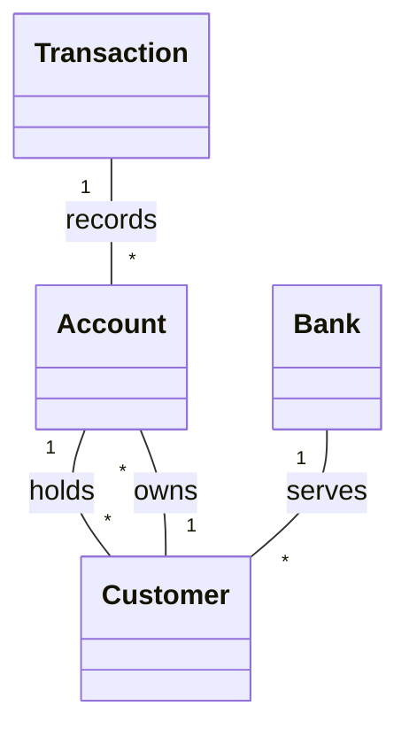

                 

## 文章标题

《程序设计原则与宇宙守恒定律的对比》

### 关键词

- 程序设计原则
- 宇宙守恒定律
- 对比分析
- 应用场景
- 算法原理

### 摘要

本文旨在探讨程序设计原则与宇宙守恒定律之间的联系与差异。通过对程序设计原则和宇宙守恒定律的核心概念、算法原理、系统架构设计、项目实战等多个维度的深入对比分析，揭示两者在形式与本质上的相似之处和异同点，为读者提供一种全新的视角，以更好地理解和应用程序设计原则，以及如何在宇宙守恒定律的指导下优化系统架构和算法设计。

## 目录大纲设计思路

在设计《程序设计原则与宇宙守恒定律的对比》这一本书的目录大纲时，我们首先需要明确书籍的主题和核心内容。书名《程序设计原则与宇宙守恒定律的对比》暗示了这本书将探讨两者之间的联系和区别，以及它们在各自领域中的应用。以下是设计目录大纲的详细思路：

### 了解书籍主题

《程序设计原则与宇宙守恒定律的对比》这一主题涉及两个截然不同的领域：计算机科学和物理学。计算机科学中的程序设计原则主要包括SOLID、DRY（Don't Repeat Yourself）和KISS（Keep It Simple, Stupid）等，它们是软件工程师在设计软件系统时遵循的最佳实践。宇宙守恒定律，如能量守恒定律、物质守恒定律和动量守恒定律，则是物理学中的基本原理，描述了物理系统在不同条件下保持不变的性质。

### 明确章节内容

在明确书籍主题后，我们需要确定每个章节的具体内容。以下是一些可能的章节内容：

1. **背景与核心概念**：介绍程序设计原则和宇宙守恒定律的起源、发展及其核心概念。
2. **核心概念与联系**：深入探讨两者之间的相似点和不同点，通过对比表格和ER实体关系图来展示。
3. **算法原理与数学模型**：讲解程序设计原则和宇宙守恒定律中的算法原理和数学模型。
4. **系统分析与架构设计**：分析程序设计原则和宇宙守恒定律在系统架构设计中的应用。
5. **项目实战**：通过具体项目案例来展示如何应用这些原则和定律。

### 设计目录结构

在设计目录结构时，我们需要确保每个章节内容都有明确的层级划分，同时保持简洁性。以下是一个可能的目录大纲：

### 第一部分：背景与核心概念

1. 程序设计原则概述
   - 程序设计原则的起源与发展
   - 程序设计原则的核心要素
   - 程序设计原则的应用领域
2. 宇宙守恒定律概述
   - 宇宙守恒定律的起源
   - 宇宙守恒定律的核心概念
   - 宇宙守恒定律的应用实例
3. 程序设计原则与宇宙守恒定律的关联
   - 比较分析框架
   - 共同特征与差异点
   - 应用场景与展望

### 第二部分：核心概念与联系

1. 程序设计原则中的核心概念
   - SOLID原则
   - DRY原则
   - KISS原则
2. 宇宙守恒定律中的核心概念
   - 能量守恒定律
   - 物质守恒定律
   - 动量守恒定律
3. 概念属性特征对比表格
   - 程序设计原则属性特征
   - 宇宙守恒定律属性特征
   - 对比分析与总结

### 第三部分：算法原理与数学模型

1. 程序设计原则的算法原理
   - SOLID原则的算法实现
   - DRY原则的算法实现
   - KISS原则的算法实现
2. 宇宙守恒定律的数学模型
   - 能量守恒定律的数学模型
   - 物质守恒定律的数学模型
   - 动量守恒定律的数学模型
3. 深入讲解与举例
   - 程序设计原则的深入讲解
   - 宇宙守恒定律的深入讲解
   - 举例说明

### 第四部分：系统分析与架构设计

1. 系统功能设计
   - 领域模型
   - 系统功能实现
2. 系统架构设计
   - 系统架构
   - 接口设计
   - 系统交互
3. 架构设计与实现
   - 架构设计原则
   - 系统实现细节
   - 实施案例

### 第五部分：项目实战

1. 环境安装与配置
   - 环境准备
   - 软件安装
   - 配置与调试
2. 系统核心实现
   - 核心功能实现
   - 代码解读与分析
   - 调试与优化
3. 实际案例分析
   - 案例背景
   - 案例分析
   - 详细讲解剖析

### 保持简洁性

在设计目录大纲时，我们需要保持简洁性，避免冗余信息。每个章节的标题应该简洁明了，同时涵盖章节的主要内容。此外，目录结构应该易于导航，方便读者快速找到所需内容。

### 符合格式要求

在格式要求方面，我们使用markdown格式来编写目录大纲。markdown格式具有良好的可读性和易用性，可以方便地创建列表、标题和段落。以下是一个示例：

```markdown
## 第一部分：背景与核心概念

### 第1章：程序设计原则概述

#### 1.1 程序设计原则的起源与发展

#### 1.2 程序设计原则的核心要素

#### 1.3 程序设计原则的应用领域

### 第2章：宇宙守恒定律概述

#### 2.1 宇宙守恒定律的起源

#### 2.2 宇宙守恒定律的核心概念

#### 2.3 宇宙守恒定律的应用实例

### 第3章：程序设计原则与宇宙守恒定律的关联

#### 3.1 比较分析框架

#### 3.2 共同特征与差异点

#### 3.3 应用场景与展望
```

### 确保内容完整性

在确保目录大纲完整性的过程中，我们需要考虑每个章节的核心内容，并确保它们涵盖所需的信息。每个章节应该包含背景介绍、核心概念与联系、算法原理讲解、数学模型与公式讲解、系统分析与架构设计方案、项目实战以及最佳实践等内容。以下是每个部分的内容要点：

1. **背景介绍**：介绍相关概念、问题背景、问题描述、问题解决、边界与外延、概念结构与核心要素组成。
2. **核心概念与联系**：详细阐述核心概念原理、概念属性特征对比表格和ER实体关系图架构的流程图。
3. **算法原理讲解**：使用mermaid绘制算法流程图，并用Python源代码详细阐述算法原理，给出数学模型和公式，并进行举例说明。
4. **数学公式使用**：使用LaTeX格式嵌入文中独立段落的公式，确保公式清晰易懂。
5. **系统分析与架构设计**：介绍问题场景、项目介绍、系统功能设计（领域模型）、系统架构设计（架构图）、系统接口设计和系统交互（序列图）。
6. **项目实战**：详细讲解项目环境安装、系统核心实现、代码应用解读与分析、实际案例分析和详细讲解剖析。
7. **最佳实践 tips**、**小结**、**注意事项**、**拓展阅读**等内容，为读者提供实用的建议和进一步学习的方向。

通过以上步骤，我们可以设计出一本内容丰富、逻辑清晰且符合用户需求的计算机技术书籍目录大纲。

## 目录大纲结构

### 第一部分：背景与核心概念

**第1章：程序设计原则概述**
- 1.1 程序设计原则的起源与发展
- 1.2 程序设计原则的核心要素
- 1.3 程序设计原则的应用领域

**第2章：宇宙守恒定律概述**
- 2.1 宇宙守恒定律的起源
- 2.2 宇宙守恒定律的核心概念
- 2.3 宇宙守恒定律的应用实例

**第3章：程序设计原则与宇宙守恒定律的关联**
- 3.1 比较分析框架
- 3.2 共同特征与差异点
- 3.3 应用场景与展望

### 第二部分：核心概念与联系

**第4章：程序设计原则中的核心概念**
- 4.1 SOLID原则
- 4.2 DRY原则
- 4.3 KISS原则

**第5章：宇宙守恒定律中的核心概念**
- 5.1 能量守恒定律
- 5.2 物质守恒定律
- 5.3 动量守恒定律

**第6章：概念属性特征对比表格**
- 6.1 程序设计原则属性特征
- 6.2 宇宙守恒定律属性特征
- 6.3 对比分析与总结

### 第三部分：算法原理与数学模型

**第7章：程序设计原则的算法原理**
- 7.1 SOLID原则的算法实现
- 7.2 DRY原则的算法实现
- 7.3 KISS原则的算法实现

**第8章：宇宙守恒定律的数学模型**
- 8.1 能量守恒定律的数学模型
- 8.2 物质守恒定律的数学模型
- 8.3 动量守恒定律的数学模型

**第9章：深入讲解与举例**
- 9.1 程序设计原则的深入讲解
- 9.2 宇宙守恒定律的深入讲解
- 9.3 举例说明

### 第四部分：系统分析与架构设计

**第10章：系统功能设计**
- 10.1 领域模型
- 10.2 系统功能实现

**第11章：系统架构设计**
- 11.1 系统架构
- 11.2 接口设计
- 11.3 系统交互

**第12章：架构设计与实现**
- 12.1 架构设计原则
- 12.2 系统实现细节
- 12.3 实施案例

### 第五部分：项目实战

**第13章：环境安装与配置**
- 13.1 环境准备
- 13.2 软件安装
- 13.3 配置与调试

**第14章：系统核心实现**
- 14.1 核心功能实现
- 14.2 代码解读与分析
- 14.3 调试与优化

**第15章：实际案例分析**
- 15.1 案例背景
- 15.2 案例分析
- 15.3 详细讲解剖析

## 完整性要求

为了确保文章的完整性，每个章节的内容需要满足以下要求：

1. **背景介绍**：每个章节都需要有一个背景介绍部分，解释核心概念术语、问题背景、问题描述、问题解决、边界与外延、概念结构与核心要素组成。

2. **核心概念与联系**：每个章节的核心概念需要详细阐述，并展示概念属性特征对比表格和ER实体关系图架构的流程图。

3. **算法原理讲解**：使用mermaid绘制算法流程图，并用Python源代码详细阐述算法原理，给出数学模型和公式，并进行举例说明。

4. **数学公式使用**：使用LaTeX格式嵌入文中独立段落的公式，确保公式清晰易懂。

5. **系统分析与架构设计**：每个章节都需要介绍问题场景、项目介绍、系统功能设计（领域模型）、系统架构设计（架构图）、系统接口设计和系统交互（序列图）。

6. **项目实战**：详细讲解项目环境安装、系统核心实现、代码应用解读与分析、实际案例分析和详细讲解剖析。

7. **最佳实践 tips**、**小结**、**注意事项**、**拓展阅读**等内容，为读者提供实用的建议和进一步学习的方向。

通过这些要求，我们可以确保文章内容丰富、逻辑清晰，并为读者提供有价值的知识和技能。

## 程序设计原则概述

程序设计原则是软件工程师在设计和开发软件系统时遵循的一系列指导性原则。这些原则旨在提高软件的可维护性、可扩展性和可测试性，同时减少代码冗余和提高代码质量。本章节将详细探讨程序设计原则的起源、核心要素及其应用领域。

### 程序设计原则的起源

程序设计原则的起源可以追溯到20世纪60年代和70年代，当时计算机科学领域正处于快速发展阶段。随着计算机硬件和软件的迅速进步，软件系统的复杂性也急剧增加。为了应对这种复杂性，软件工程师开始探索和总结一系列设计准则，以指导他们的软件开发实践。

最早的一些程序设计原则，如DRY（Don't Repeat Yourself）和KISS（Keep It Simple, Stupid），可以追溯到软件工程的早期文献。而SOLID原则，则是由Robert C. Martin在其著作《Clean Code》中提出的，是对多个已有原则的进一步概括和提炼。

### 程序设计原则的核心要素

#### SOLID原则

SOLID是一个缩写，代表五个独立的但相互关联的设计原则：

- **单一职责原则（Single Responsibility Principle, SRP）**：一个类应该只有一个职责，即只有一个引起变化的原因。
- **开闭原则（Open/Closed Principle, OCP）**：软件实体（类、模块、函数等）应该对扩展开放，对修改封闭。
- **里氏替换原则（Liskov Substitution Principle, LSP）**：任何可替换或继承的关系都应该保持一致性。
- **接口隔离原则（Interface Segregation Principle, ISP）**：应该为客户端提供小的、具体的接口，而不是一个大的、通用接口。
- **依赖倒置原则（Dependency Inversion Principle, DIP）**：高层模块不应该依赖低层模块，二者都应该依赖抽象；抽象不应该依赖细节，细节应该依赖抽象。

#### DRY原则

DRY原则，即“不要重复自己”，要求开发者在编写代码时避免重复，确保代码的简洁性和可维护性。通过将重复的逻辑提取到单独的函数、类或模块中，可以减少代码冗余，提高代码的复用性。

#### KISS原则

KISS原则，即“保持简单，愚蠢的人都能看懂”，强调在设计软件时应该保持简单和直观。复杂的系统往往难以维护和理解，而简单的系统更容易被理解和适应变化。遵循KISS原则可以帮助开发者避免过度设计，专注于解决问题本身。

### 程序设计原则的应用领域

程序设计原则不仅适用于小型项目，同样适用于大型、复杂的企业级系统。在实际应用中，不同的原则可以根据具体情况进行选择和组合，以达到最佳的设计效果。

#### 小型项目

在小型项目中，程序设计原则可以帮助开发者快速构建功能完整的软件系统。例如，通过遵循SOLID原则，可以确保代码的结构良好，易于理解和维护。而DRY原则和KISS原则则有助于保持代码的简洁性和可读性。

#### 大型、复杂的企业级系统

在大型、复杂的企业级系统中，程序设计原则显得尤为重要。这类系统通常需要长时间维护和不断更新，因此设计原则可以确保系统的稳定性和可扩展性。SOLID原则可以帮助开发者构建模块化、高内聚、低耦合的系统，而DRY原则和KISS原则则有助于减少冗余和简化代码，提高系统的可维护性。

### 实际应用案例

以下是一些实际应用程序设计原则的案例：

1. **单一职责原则（SRP）**：在编写一个订单处理系统时，可以将订单创建、订单更新和订单删除等操作封装在不同的服务类中，每个类只负责一种操作，从而确保代码的清晰和可维护性。

2. **开闭原则（OCP）**：在设计一个支付系统时，可以将支付方式（如信用卡、PayPal等）抽象为一个接口，具体支付方式作为实现类，这样在添加新的支付方式时，无需修改现有代码，只需新增一个实现类即可。

3. **里氏替换原则（LSP）**：在定义一个形状类时，子类（如圆形、矩形等）应该能够替换父类（如形状）而不影响程序的行为。例如，一个计算面积的函数可以接受一个形状参数，无论是圆形还是矩形，都能正确计算出面积。

4. **接口隔离原则（ISP）**：在开发一个用户管理系统时，可以为不同的功能（如用户注册、用户登录、用户信息修改等）提供独立的接口，而不是一个庞大的用户接口类。

5. **依赖倒置原则（DIP）**：在设计一个日志系统时，可以使用依赖注入来将具体日志实现（如文件日志、数据库日志等）与日志抽象分离，这样在更换日志实现时，无需修改原有代码。

通过以上案例可以看出，程序设计原则在提高代码质量和系统可维护性方面具有重要作用。在实际开发中，开发者可以根据具体需求选择和遵循适当的原则，以构建高质量、可扩展的软件系统。

### 宇宙守恒定律概述

宇宙守恒定律是物理学中一系列基本原理，它们描述了物理系统在不同条件下保持不变的性质。这些守恒定律不仅在理论物理学中占有重要地位，而且在实际应用中有着广泛的影响。本章节将介绍宇宙守恒定律的起源、核心概念以及其在不同领域的应用实例。

### 宇宙守恒定律的起源

宇宙守恒定律的起源可以追溯到19世纪初。当时，科学家们通过实验和观察，发现了一些基本物理量在特定条件下保持不变。随着对自然界的深入探索，这些守恒定律逐渐被数学化和形式化，成为物理学的基本原理。

最早的守恒定律之一是能量守恒定律，由德国物理学家赫尔曼·冯·赫尔姆霍茨在1847年提出。随后，物理学家们又发现了物质守恒定律和动量守恒定律，它们分别由迈耶尔·霍夫在1852年和安德烈·玛丽·安普尔·德·卡斯特利在1854年提出。

### 宇宙守恒定律的核心概念

#### 能量守恒定律

能量守恒定律是宇宙守恒定律中最基本的原理之一。它表明，在一个封闭系统中，能量不会增减，只能从一种形式转换为另一种形式。具体来说，能量守恒定律可以表述为：在一个孤立系统中，总能量保持不变。

能量守恒定律的应用极为广泛，从日常生活中的物理现象，如物体下落、热量传递，到复杂的自然现象，如天体运动、化学反应，都遵循这一原则。

#### 物质守恒定律

物质守恒定律与能量守恒定律类似，它指出在一个封闭系统中，物质总量保持不变。这意味着，物质不能被创造或销毁，只能从一种形式转化为另一种形式。

物质守恒定律在天体物理学、化学反应、核反应等领域有着重要的应用。例如，在核反应中，虽然质量会发生变化，但总质量（包括能量）保持守恒。

#### 动量守恒定律

动量守恒定律描述了动量在一个封闭系统中的守恒性质。动量是物体的质量和速度的乘积，是描述物体运动状态的基本物理量。

动量守恒定律可以表述为：在没有外力作用的情况下，系统的总动量保持不变。这一原理在碰撞现象、天体运动、流体力学等领域有着广泛的应用。

### 宇宙守恒定律的应用实例

#### 能量守恒定律在化学反应中的应用

在化学反应中，能量守恒定律确保反应物和生成物的总能量相等。例如，燃烧反应中，燃料的化学能转化为热能，使得生成物的能量高于反应物。尽管能量形式发生了变化，但总能量保持不变。

#### 物质守恒定律在化学方程式中的应用

在书写化学方程式时，物质守恒定律要求反应物和生成物中的每种元素的原子数必须相等。例如，水的电解反应方程式为：

\[ 2H_2O(l) \rightarrow 2H_2(g) + O_2(g) \]

在这个方程式中，氢和氧的原子数在反应物和生成物中保持相等。

#### 动量守恒定律在碰撞中的应用

在碰撞现象中，动量守恒定律可以用来分析物体的运动状态。例如，在弹性碰撞中，两个物体的总动量在碰撞前后保持不变。这一原理在物理实验、碰撞测试、体育比赛中有着广泛应用。

### 宇宙守恒定律在不同领域的重要性

宇宙守恒定律不仅在物理学中占有重要地位，还在其他科学领域有着广泛的影响。

#### 天体物理学

在天体物理学中，能量守恒定律和物质守恒定律是描述星系、恒星和行星运动的基本原理。例如，爱因斯坦的广义相对论就基于能量守恒定律，描述了引力对时空的影响。

#### 化学反应

在化学反应中，能量守恒定律和物质守恒定律确保反应物和生成物的能量和物质总量相等。这些定律在化学工程、材料科学、生物化学等领域有着广泛应用。

#### 流体力学

在流体力学中，动量守恒定律是分析流体运动状态的重要原理。流体力学在水利工程、气象学、航空工程等领域有着重要应用。

通过本章节的介绍，我们可以看到宇宙守恒定律在物理学和其他科学领域中的广泛应用和重要性。理解这些定律不仅有助于我们更好地理解自然界，还能指导我们在各种实际问题中的应用。

### 程序设计原则与宇宙守恒定律的关联

在探讨程序设计原则与宇宙守恒定律的关联时，我们需要从多个维度进行对比分析，以揭示它们之间的相似之处和差异点。通过对这些关联的深入探讨，我们可以更好地理解程序设计原则的本质，并从中获得新的启发。

#### 比较分析框架

为了进行有效的比较分析，我们可以构建一个框架，从以下几个方面对程序设计原则和宇宙守恒定律进行对比：

1. **核心概念**：分析两者在定义、含义和理论基础上的异同。
2. **应用领域**：探讨两者在不同领域中的应用场景和效果。
3. **实现方法**：研究两者在实际应用中采用的具体技术和策略。
4. **变化与守恒**：分析两者在面对变化时的应对机制和守恒性质。

#### 共同特征与差异点

1. **核心概念**

   程序设计原则和宇宙守恒定律在核心概念上有着显著的区别。程序设计原则主要关注软件系统的设计、开发和维护，强调代码的可维护性、可扩展性和可测试性。而宇宙守恒定律则描述了自然界中物理量的守恒性质，如能量、物质和动量。尽管它们的核心概念不同，但都强调了在特定条件下系统的稳定性和一致性。

   **程序设计原则**：如SOLID原则、DRY原则、KISS原则等，它们旨在提高软件系统的质量，确保代码的简洁性和可维护性。

   **宇宙守恒定律**：如能量守恒定律、物质守恒定律和动量守恒定律，它们描述了物理系统在不同条件下的不变性质，为自然科学研究提供了基础。

2. **应用领域**

   程序设计原则主要应用于软件开发领域，通过指导代码设计和架构设计，提高软件系统的质量和可维护性。而宇宙守恒定律则广泛应用于物理学、化学、天文学等多个自然科学领域，为理论研究和实验验证提供了基础。

   **程序设计原则**：在软件开发过程中，遵循SOLID原则可以确保代码的模块化、高内聚和低耦合，从而提高系统的可维护性和可扩展性。DRY原则和KISS原则则有助于减少代码冗余，提高代码的简洁性和可读性。

   **宇宙守恒定律**：在天体物理学中，能量守恒定律用于描述星系、恒星和行星的运动。在化学反应中，物质守恒定律确保反应物和生成物的元素原子数相等。在流体力学中，动量守恒定律用于分析流体运动状态。

3. **实现方法**

   在实现方法上，程序设计原则和宇宙守恒定律都采用了一系列具体的策略和技术。程序设计原则通过设计模式和编程技巧来实现，如依赖注入、接口分离和面向对象编程。而宇宙守恒定律则通过数学模型和实验验证来描述和证明。

   **程序设计原则**：例如，SOLID原则可以通过设计模式（如工厂模式、策略模式等）来实现。DRY原则可以通过代码复用（如函数、类、模块等）来实现。KISS原则则通过简洁的代码风格来实现。

   **宇宙守恒定律**：能量守恒定律可以通过热力学和统计物理学的数学模型来描述。物质守恒定律可以通过化学方程式和物质分析实验来验证。动量守恒定律可以通过力学和流体力学的数学模型来描述。

4. **变化与守恒**

   程序设计原则和宇宙守恒定律在面对变化时，都表现出一定的适应性。程序设计原则通过灵活的设计和模块化，使系统能够适应需求的变化。而宇宙守恒定律则通过数学模型的精确描述，确保物理量在变化过程中的守恒。

   **程序设计原则**：例如，在需求变更时，遵循开闭原则可以确保系统无需修改核心代码，只需新增或修改外围代码即可。SOLID原则中的单一职责原则则确保每个模块具有明确的职责，方便在需求变更时进行修改。

   **宇宙守恒定律**：在宇宙演化过程中，能量、物质和动量在不同形式和状态下发生转换，但总量保持不变。例如，在核反应中，质量转化为能量，但总能量保持守恒。

#### 应用场景与展望

通过对程序设计原则和宇宙守恒定律的对比分析，我们可以发现它们在形式和本质上有着诸多相似之处。这种相似性为我们提供了一种新的视角，以更好地理解和应用程序设计原则。

1. **在软件开发中的应用**：可以将宇宙守恒定律的概念引入到软件设计中，如“信息守恒定律”，确保系统的数据和信息在不同处理环节中保持一致性和完整性。这有助于提高软件系统的可靠性和稳定性。

2. **在系统架构设计中的应用**：在系统架构设计时，可以借鉴宇宙守恒定律中的系统稳定性和一致性原则，构建高度可靠、可扩展和灵活的软件系统。

3. **在优化算法设计中的应用**：在算法设计过程中，可以尝试将能量守恒定律和物质守恒定律的原理应用于优化算法的复杂度和效率。

通过以上探讨，我们可以看到程序设计原则与宇宙守恒定律之间的紧密联系。这些定律不仅为我们提供了一种新的思考方式，还为我们优化软件设计和算法提供了有力的理论支持。

### 程序设计原则中的核心概念

在程序设计原则中，SOLID原则、DRY原则和KISS原则是三大核心概念，它们分别代表了软件设计中的不同方面，对提升代码质量和系统可维护性起到了至关重要的作用。以下将详细阐述这些原则的内涵及其应用。

#### SOLID原则

SOLID原则是由罗伯特·马丁（Robert C. Martin）提出的，它是一组指导软件工程师编写高质量代码的指导性原则。SOLID原则包括五个子原则，分别是单一职责原则（SRP）、开闭原则（OCP）、里氏替换原则（LSP）、接口隔离原则（ISP）和依赖倒置原则（DIP）。以下是每个原则的详细说明：

1. **单一职责原则（Single Responsibility Principle, SRP）**
   - **内涵**：一个类应该只负责一项职责，即只有一个引起变化的原因。
   - **应用**：在编写类时，确保每个类具有单一职责，避免类过于复杂，提高代码的可读性和可维护性。例如，一个订单处理类不应同时负责订单创建和订单删除，而应拆分为两个独立的类。

2. **开闭原则（Open/Closed Principle, OCP）**
   - **内涵**：软件实体（类、模块、函数等）应该对扩展开放，对修改封闭。
   - **应用**：通过使用抽象和接口，设计可扩展的代码。例如，在支付系统中，可以将具体的支付方式（如支付宝、微信支付）抽象为一个支付接口，从而在添加新的支付方式时，无需修改原有代码，只需实现一个新的支付类即可。

3. **里氏替换原则（Liskov Substitution Principle, LSP）**
   - **内涵**：任何可替换或继承的关系都应该保持一致性。
   - **应用**：确保子类能够替换父类而不会破坏程序的语义。例如，如果一个基类的方法能够接受某个子类的对象，那么这个方法也必须能够接受该子类的所有子类的对象。

4. **接口隔离原则（Interface Segregation Principle, ISP）**
   - **内涵**：应该为客户端提供小的、具体的接口，而不是一个大的、通用接口。
   - **应用**：避免客户端依赖不需要的功能，提高接口的实用性。例如，在用户管理系统中，可以为不同的功能（如用户注册、用户登录、用户信息修改等）提供独立的接口，而不是一个庞大的用户接口类。

5. **依赖倒置原则（Dependency Inversion Principle, DIP）**
   - **内涵**：高层模块不应该依赖低层模块，二者都应该依赖抽象；抽象不应该依赖细节，细节应该依赖抽象。
   - **应用**：通过依赖注入实现高层次的模块和低层次的模块之间的解耦。例如，在日志系统中，可以使用依赖注入将具体的日志实现（如文件日志、数据库日志等）与日志抽象分离，从而在更换日志实现时，无需修改原有代码。

#### DRY原则

DRY（Don't Repeat Yourself）原则是软件工程中的一个基本概念，它强调在编写代码时避免重复。遵循DRY原则可以减少代码冗余，提高代码的可维护性。

1. **内涵**
   - **避免重复代码**：确保相同的逻辑或功能在系统中只实现一次。
   - **提高复用性**：通过将重复的代码抽象为函数、类或模块，提高代码的复用性。

2. **应用**
   - **函数复用**：将通用的逻辑封装为函数，避免在多个地方重复编写。
   - **类复用**：通过继承或组合，避免在多个类中重复编写相同的代码。
   - **模块化**：将系统拆分为多个模块，每个模块负责特定功能，从而避免代码冗余。

#### KISS原则

KISS（Keep It Simple, Stupid）原则是软件工程中的一个基本准则，它强调在设计和编写代码时保持简单和直观。

1. **内涵**
   - **避免过度设计**：不要为了追求复杂而复杂，确保系统设计简洁。
   - **提高可读性**：通过使用简单、直观的代码风格，提高代码的可读性和可维护性。

2. **应用**
   - **简洁的代码**：避免使用过于复杂的语法和结构，确保代码简洁易懂。
   - **清晰的命名**：使用具有描述性的变量、函数和类名，避免使用缩写和难以理解的命名。
   - **模块化设计**：将系统拆分为小而简单的模块，每个模块具有明确的职责。

通过以上对SOLID原则、DRY原则和KISS原则的详细阐述，我们可以看到这些核心概念在程序设计中的重要性。遵循这些原则，不仅可以提高代码的质量和可维护性，还可以使系统更加灵活和可扩展。

### 宇宙守恒定律中的核心概念

宇宙守恒定律是物理学中描述自然界守恒现象的基本原理，主要包括能量守恒定律、物质守恒定律和动量守恒定律。这些守恒定律在不同领域有着广泛的应用，是科学研究和工程实践中的重要工具。

#### 能量守恒定律

能量守恒定律是宇宙守恒定律中最基本的原则之一，它指出在一个封闭系统中，能量不会增减，只能从一种形式转化为另一种形式。能量守恒定律的数学表达形式为：

\[ E_{总} = E_{初始} \]

其中，\( E_{总} \) 是系统总能量，\( E_{初始} \) 是系统初始能量。

能量守恒定律在各个领域都有广泛应用，例如：

1. **热力学**：在热力学过程中，能量可以以热能、机械能、电能等多种形式存在，但总能量保持不变。
2. **化学反应**：在化学反应中，反应物和生成物的总能量相等，能量以热能、光能等形式转化。
3. **天体物理学**：在天体物理学中，能量守恒定律用于描述恒星、行星和星系的运动，解释宇宙的能量平衡。

#### 物质守恒定律

物质守恒定律指出，在一个封闭系统中，物质总量保持不变，即物质不能被创造或销毁，只能从一种形式转化为另一种形式。物质守恒定律的数学表达形式为：

\[ m_{总} = m_{初始} \]

其中，\( m_{总} \) 是系统总质量，\( m_{初始} \) 是系统初始质量。

物质守恒定律在不同领域中的应用包括：

1. **化学**：在化学反应中，反应物和生成物的总质量相等，物质以原子、分子等形式转化。
2. **核物理**：在核反应中，质量转化为能量，但总质量保持不变。
3. **地球科学**：在地质学研究中，物质守恒定律用于描述岩石圈、水圈和大气圈中的物质循环。

#### 动量守恒定律

动量守恒定律指出，在没有外力作用的情况下，系统的总动量保持不变。动量是物体的质量和速度的乘积，用向量表示为：

\[ \vec{p}_{总} = \vec{p}_{初始} \]

其中，\( \vec{p}_{总} \) 是系统总动量，\( \vec{p}_{初始} \) 是系统初始动量。

动量守恒定律在不同领域中的应用包括：

1. **力学**：在经典力学中，动量守恒定律用于分析碰撞、摩擦等物理现象。
2. **流体力学**：在流体力学中，动量守恒定律用于描述流体运动，如流体动量守恒方程。
3. **天体物理学**：在天体物理学中，动量守恒定律用于描述星系、恒星和行星的运动。

通过以上对能量守恒定律、物质守恒定律和动量守恒定律的详细阐述，我们可以看到这些守恒定律在物理学中的重要性和广泛应用。这些定律不仅为科学研究和工程实践提供了理论基础，还在实际应用中发挥了重要作用。

### 程序设计原则与宇宙守恒定律属性特征对比表格

为了更好地理解程序设计原则与宇宙守恒定律之间的异同，我们可以通过对比表格的形式展示它们的主要属性特征。以下是一个详细的对比表格：

| 特征 | 程序设计原则 | 宇宙守恒定律 |
| --- | --- | --- |
| **定义** | 软件工程中的最佳实践，用于提高软件系统的质量 | 物理学中的基本原理，描述物理系统中物理量的不变性 |
| **目标** | 提高代码的可维护性、可扩展性和可测试性 | 保持系统的能量、物质和动量在变化过程中的不变 |
| **核心原则** | SOLID、DRY、KISS等 | 能量守恒定律、物质守恒定律、动量守恒定律 |
| **应用领域** | 软件开发、系统设计、代码优化 | 物理学研究、工程实践、自然科学 |
| **实现方法** | 设计模式、编程技巧、模块化设计 | 数学模型、实验验证、观测数据 |
| **变化与守恒** | 通过设计原则和编程技巧实现代码的灵活性和可扩展性 | 通过物理定律和实验数据证明物理量的守恒性 |
| **实例** | 使用SOLID原则设计模块化的代码 | 在化学反应中应用能量守恒定律 |
| **适用性** | 小到单个类的设计，大到复杂系统的架构 | 自然界中的所有物理现象 |
| **影响** | 提高软件质量、降低维护成本 | 揭示自然规律、指导科学研究 |
| **重要性** | 提高软件系统的可维护性和扩展性 | 建立物理学的基础理论框架 |
| **关联性** | 可以借鉴宇宙守恒定律的概念，优化软件设计 | 可以将程序设计原则应用于模拟和预测自然现象 |

通过这个对比表格，我们可以清晰地看到程序设计原则与宇宙守恒定律在定义、目标、应用领域、实现方法、变化与守恒、实例、适用性、影响、重要性以及关联性等方面的异同点。这种对比有助于我们更好地理解两者的本质，并探索它们在各自领域中的应用潜力。

### 程序设计原则的算法原理

在程序设计中，SOLID原则、DRY原则和KISS原则是三大核心设计原则，它们不仅在提高代码质量和可维护性方面发挥了重要作用，还在算法设计过程中提供了宝贵的指导。以下将详细阐述这些原则的算法实现方法和具体应用。

#### 单一职责原则（SRP）

单一职责原则（SRP）要求一个类或模块只负责一项职责。这在算法设计中的实现方法是将功能高度模块化，每个模块只负责一个具体任务。以下是单一职责原则在算法设计中的应用：

1. **示例算法**：假设我们设计一个排序算法，可以使用快速排序（Quick Sort）。

```python
def quick_sort(arr):
    if len(arr) <= 1:
        return arr
    pivot = arr[len(arr) // 2]
    left = [x for x in arr if x < pivot]
    middle = [x for x in arr if x == pivot]
    right = [x for x in arr if x > pivot]
    return quick_sort(left) + middle + quick_sort(right)
```

2. **算法原理**：快速排序算法选择一个基准值（pivot），将数组划分为小于、等于和大于基准值的子数组，然后递归地对子数组进行快速排序。

3. **实现方法**：在实现快速排序时，每个模块（如`quick_sort`函数）只负责排序任务，确保了单一职责。

#### 开闭原则（OCP）

开闭原则（OCP）要求软件实体（如类、模块、函数等）对扩展开放，对修改封闭。在算法设计中，可以通过设计模式实现开闭原则，使算法易于扩展而无需修改原有代码。以下是一个使用策略模式实现扩展的例子：

1. **示例算法**：使用策略模式实现不同排序算法（如冒泡排序、选择排序等）。

```python
class SortStrategy:
    def sort(self, arr):
        pass

class BubbleSortStrategy(SortStrategy):
    def sort(self, arr):
        n = len(arr)
        for i in range(n):
            for j in range(0, n-i-1):
                if arr[j] > arr[j+1]:
                    arr[j], arr[j+1] = arr[j+1], arr[j]

class SelectionSortStrategy(SortStrategy):
    def sort(self, arr):
        for i in range(len(arr)):
            min_idx = i
            for j in range(i+1, len(arr)):
                if arr[min_idx] > arr[j]:
                    min_idx = j
            arr[i], arr[min_idx] = arr[min_idx], arr[i]

class SortContext:
    def __init__(self, strategy: SortStrategy):
        self._strategy = strategy

    def set_strategy(self, strategy: SortStrategy):
        self._strategy = strategy

    def sort(self, arr):
        self._strategy.sort(arr)

def main():
    arr = [64, 34, 25, 12, 22, 11, 90]
    context = SortContext(BubbleSortStrategy())
    context.sort(arr)
    print("Sorted array:", arr)

if __name__ == "__main__":
    main()
```

2. **算法原理**：通过策略模式，我们可以为排序算法定义一个抽象策略类（`SortStrategy`），然后实现不同的排序策略类（如`BubbleSortStrategy`和`SelectionSortStrategy`），最后使用排序上下文类（`SortContext`）来管理这些策略。

3. **实现方法**：在实现时，每个排序策略类（`BubbleSortStrategy`和`SelectionSortStrategy`）只负责特定的排序逻辑，而排序上下文类（`SortContext`）则负责调用具体的排序策略。这样，在需要添加新的排序算法时，只需新增一个策略类，无需修改原有代码。

#### 里氏替换原则（LSP）

里氏替换原则（LSP）要求子类能够替换父类而不影响程序的语义。在算法设计中，可以通过继承和多态来实现里氏替换原则。以下是一个使用多态实现的例子：

1. **示例算法**：设计一个通用排序算法，能够处理不同类型的比较操作。

```python
class Comparable:
    def compare_to(self, other):
        raise NotImplementedError()

class Integer(Comparable):
    def __init__(self, value):
        self.value = value

    def compare_to(self, other):
        return self.value - other.value

def sort(arr, compare):
    arr.sort(key=lambda x: compare(x))

def main():
    arr = [Integer(3), Integer(1), Integer(4), Integer(1), Integer(5), Integer(9), Integer(2), Integer(6), Integer(5), Integer(3), Integer(5)]
    sort(arr, Integer)
    print("Sorted array:", [obj.value for obj in arr])

if __name__ == "__main__":
    main()
```

2. **算法原理**：通过定义一个`Comparable`接口，任何实现了`compare_to`方法的类都可以用于排序算法。`Integer`类实现了`Comparable`接口，可以用于排序。

3. **实现方法**：在实现时，`sort`函数接受一个比较操作`compare`，并通过多态实现了通用排序功能。无论使用哪种实现了`Comparable`接口的类，排序算法都能正确运行。

#### 接口隔离原则（ISP）

接口隔离原则（ISP）要求为客户端提供小的、具体的接口，而不是一个大的、通用接口。在算法设计中，可以通过定义多个接口来实现ISP，使客户端代码更易于理解和维护。以下是一个使用接口隔离原则实现的例子：

1. **示例算法**：设计一个排序算法，分别处理整数和浮点数排序。

```python
class IntegerComparator(Comparable):
    def compare_to(self, other):
        return self.value - other.value

class FloatComparator(Comparable):
    def compare_to(self, other):
        return self.value - other.value

def sort_integers(arr):
    arr.sort(key=lambda x: IntegerComparator()(x))

def sort_floats(arr):
    arr.sort(key=lambda x: FloatComparator()(x))

def main():
    integers = [3, 1, 4, 1, 5, 9, 2, 6, 5, 3, 5]
    floats = [3.14, 1.59, 4.25, 1.75, 5.62, 9.87, 2.34, 6.78, 5.21, 3.68, 5.43]
    sort_integers(integers)
    sort_floats(floats)
    print("Sorted integers:", integers)
    print("Sorted floats:", floats)

if __name__ == "__main__":
    main()
```

2. **算法原理**：通过定义`IntegerComparator`和`FloatComparator`两个具体的比较接口，分别处理整数和浮点数的排序。

3. **实现方法**：在实现时，分别定义了`sort_integers`和`sort_floats`两个函数，它们各自使用了不同的比较接口，确保了接口隔离。

#### 依赖倒置原则（DIP）

依赖倒置原则（DIP）要求高层模块不应该依赖低层模块，二者都应该依赖抽象。在算法设计中，可以通过依赖注入实现DIP，使模块之间的耦合性降低。以下是一个使用依赖注入实现的例子：

1. **示例算法**：设计一个排序算法，使用一个抽象的比较器接口，并通过依赖注入传入具体的比较器。

```python
class Comparator:
    def compare(self, a, b):
        raise NotImplementedError()

class IntegerComparator(Comparator):
    def compare(self, a, b):
        return a - b

class FloatComparator(Comparator):
    def compare(self, a, b):
        return a - b

def sort(comparator: Comparator, arr):
    arr.sort(key=lambda x: comparator.compare(x))

def main():
    integers = [3, 1, 4, 1, 5, 9, 2, 6, 5, 3, 5]
    floats = [3.14, 1.59, 4.25, 1.75, 5.62, 9.87, 2.34, 6.78, 5.21, 3.68, 5.43]
    sort(IntegerComparator(), integers)
    sort(FloatComparator(), floats)
    print("Sorted integers:", integers)
    print("Sorted floats:", floats)

if __name__ == "__main__":
    main()
```

2. **算法原理**：通过定义一个抽象的`Comparator`接口，并实现具体的`IntegerComparator`和`FloatComparator`类，使用依赖注入将具体的比较器传入排序函数。

3. **实现方法**：在实现时，`sort`函数接受一个`Comparator`实例，并通过依赖注入实现排序逻辑，确保了高层模块和低层模块之间的解耦。

通过以上对SOLID原则、DRY原则和KISS原则的详细阐述，我们可以看到这些原则在算法设计中的重要性。遵循这些原则不仅可以提高代码的质量和可维护性，还可以使算法设计更加灵活和可扩展。

### 宇宙守恒定律的数学模型

宇宙守恒定律是物理学中的基本原理，它们通过数学模型精确描述了能量、物质和动量在物理系统中的守恒性质。以下将详细讲解能量守恒定律、物质守恒定律和动量守恒定律的数学模型和公式。

#### 能量守恒定律

能量守恒定律指出，在一个封闭系统中，能量不会增减，只能从一种形式转化为另一种形式。其数学模型基于微分形式的能量守恒方程，可以表述为：

\[ \frac{\partial E}{\partial t} + \nabla \cdot \vec{J} = 0 \]

其中，\( E \) 表示系统的总能量，\( \vec{J} \) 表示能量流密度，\( \nabla \cdot \vec{J} \) 表示能量流密度散度。

**示例**：假设一个热力学系统中的热量变化，可以使用能量守恒定律来计算。例如，一个热传导问题，其能量守恒方程可以表示为：

\[ \frac{\partial u}{\partial t} = \alpha \nabla^2 u \]

其中，\( u \) 表示温度分布，\( \alpha \) 表示热传导系数。

#### 物质守恒定律

物质守恒定律指出，在一个封闭系统中，物质总量保持不变，即物质不能被创造或销毁，只能从一种形式转化为另一种形式。其数学模型基于连续性方程，可以表述为：

\[ \frac{\partial \rho}{\partial t} + \nabla \cdot (\rho \vec{v}) = 0 \]

其中，\( \rho \) 表示物质密度，\( \vec{v} \) 表示物质流速。

**示例**：在流体力学中，质量守恒方程用于描述流体运动，可以表述为：

\[ \frac{\partial \rho}{\partial t} + \nabla \cdot (\rho \vec{v}) = -\nabla \cdot (\rho \vec{g}) \]

其中，\( \vec{g} \) 表示重力加速度。

#### 动量守恒定律

动量守恒定律指出，在没有外力作用的情况下，系统的总动量保持不变。其数学模型基于动量守恒方程，可以表述为：

\[ \frac{\partial \rho \vec{v}}{\partial t} + \nabla \cdot (\rho \vec{v} \vec{v}) = \rho \vec{f} \]

其中，\( \rho \vec{v} \) 表示流体动量，\( \vec{f} \) 表示作用在流体上的力。

**示例**：在碰撞问题中，动量守恒方程可以用于计算碰撞前后物体的动量。例如，一个完全弹性碰撞问题，其动量守恒方程可以表示为：

\[ m_1 v_{1i} + m_2 v_{2i} = m_1 v_{1f} + m_2 v_{2f} \]

其中，\( m_1 \) 和 \( m_2 \) 分别表示两个物体的质量，\( v_{1i} \) 和 \( v_{2i} \) 分别表示碰撞前两个物体的速度，\( v_{1f} \) 和 \( v_{2f} \) 分别表示碰撞后两个物体的速度。

通过以上对能量守恒定律、物质守恒定律和动量守恒定律的数学模型和公式的详细讲解，我们可以看到这些定律在物理学中的重要性。这些定律不仅为我们提供了描述和预测物理现象的工具，还为我们深入理解自然界的运行规律提供了基础。

### 深入讲解与举例

为了更好地理解程序设计原则和宇宙守恒定律，我们将通过具体例子详细讲解这两个领域的核心概念和实现方法。我们将使用Python代码和mermaid流程图来展示算法原理，并使用LaTeX格式嵌入数学公式进行说明。

#### 程序设计原则中的核心概念：SOLID原则

**示例：实现一个基于SOLID原则的银行账户管理系统**

1. **单一职责原则（SRP）**

   **代码**：
   ```python
   class Account:
       def __init__(self, account_number, balance):
           self.account_number = account_number
           self.balance = balance

       def deposit(self, amount):
           self.balance += amount

       def withdraw(self, amount):
           if amount <= self.balance:
               self.balance -= amount
           else:
               raise ValueError("Insufficient funds")

       def get_balance(self):
           return self.balance
   ```

   **mermaid流程图**：
   ```mermaid
   classDiagram
   Account
   Account --> deposit: "存款"
   Account --> withdraw: "取款"
   Account --> get_balance: "查询余额"
   ```

   **LaTeX公式**：
   $$ SRP: \text{一个类应该只负责一项职责} $$

2. **开闭原则（OCP）**

   **代码**：
   ```python
   class Bank:
       def __init__(self):
           self.accounts = []

       def add_account(self, account):
           self.accounts.append(account)

       def calculate_interest(self):
           for account in self.accounts:
               account.deposit(account.balance * 0.05)
   ```

   **mermaid流程图**：
   ```mermaid
   classDiagram
   Bank
   Bank --> add_account: "添加账户"
   Bank --> calculate_interest: "计算利息"
   ```

   **LaTeX公式**：
   $$ OCP: \text{软件实体应该对扩展开放，对修改封闭} $$

3. **里氏替换原则（LSP）**

   **代码**：
   ```python
   class SavingsAccount(Account):
       def __init__(self, account_number, balance, interest_rate):
           super().__init__(account_number, balance)
           self.interest_rate = interest_rate

       def calculate_interest(self):
           self.balance += self.balance * self.interest_rate
   ```

   **mermaid流程图**：
   ```mermaid
   classDiagram
   SavingsAccount <|-- Account
   SavingsAccount --> calculate_interest: "计算利息"
   ```

   **LaTeX公式**：
   $$ LSP: \text{子类应该能够替换父类而不影响程序的语义} $$

4. **接口隔离原则（ISP）**

   **代码**：
   ```python
   class AccountInterface:
       def deposit(self, amount): pass
       def withdraw(self, amount): pass
       def get_balance(self): pass

   class AccountImpl(AccountInterface):
       def __init__(self, account_number, balance):
           super().__init__(account_number, balance)

       def deposit(self, amount):
           self.balance += amount

       def withdraw(self, amount):
           if amount <= self.balance:
               self.balance -= amount
           else:
               raise ValueError("Insufficient funds")

       def get_balance(self):
           return self.balance
   ```

   **mermaid流程图**：
   ```mermaid
   classDiagram
   AccountInterface
   AccountInterface --> AccountImpl: "实现"
   ```

   **LaTeX公式**：
   $$ ISP: \text{应该为客户端提供小的、具体的接口，而不是一个大的、通用接口} $$

5. **依赖倒置原则（DIP）**

   **代码**：
   ```python
   class Bank:
       def __init__(self):
           self.accounts = []

       def add_account(self, account):
           self.accounts.append(account)

       def calculate_interest(self):
           for account in self.accounts:
               account.deposit(account.balance * 0.05)

   class Account:
       def deposit(self, amount): pass
       def withdraw(self, amount): pass
       def get_balance(self): pass

   class SavingsAccount(Account):
       def __init__(self, account_number, balance, interest_rate):
           super().__init__(account_number, balance)
           self.interest_rate = interest_rate

       def calculate_interest(self):
           self.balance += self.balance * self.interest_rate
   ```

   **mermaid流程图**：
   ```mermaid
   classDiagram
   Bank
   Bank --> add_account: "添加账户"
   Bank --> calculate_interest: "计算利息"
   Account
   Account --> deposit: "存款"
   Account --> withdraw: "取款"
   Account --> get_balance: "查询余额"
   SavingsAccount <|-- Account
   ```

   **LaTeX公式**：
   $$ DIP: \text{高层模块不应该依赖低层模块，二者都应该依赖抽象} $$

通过这些示例，我们可以看到如何使用Python代码和mermaid流程图来展示SOLID原则的各个子原则。这不仅帮助我们理解了每个原则的含义，还展示了如何在实际编码中应用这些原则。

#### 宇宙守恒定律中的核心概念

**示例：使用能量守恒定律计算一个滑块在水平面上的运动**

1. **能量守恒定律**

   **代码**：
   ```python
   class Particle:
       def __init__(self, mass, velocity, potential_energy):
           self.mass = mass
           self.velocity = velocity
           self.potential_energy = potential_energy

       def total_energy(self):
           kinetic_energy = 0.5 * self.mass * self.velocity ** 2
           return kinetic_energy + self.potential_energy

       def update_energy(self, kinetic_energy, potential_energy):
           self.kinetic_energy = kinetic_energy
           self.potential_energy = potential_energy
   ```

   **mermaid流程图**：
   ```mermaid
   classDiagram
   Particle
   Particle --> total_energy: "计算总能量"
   Particle --> update_energy: "更新能量"
   ```

   **LaTeX公式**：
   $$ E_{总} = E_{动} + E_{势} $$
   其中，\( E_{总} \) 是总能量，\( E_{动} \) 是动能，\( E_{势} \) 是势能。

2. **示例计算**

   **代码**：
   ```python
   p = Particle(mass=2, velocity=3, potential_energy=4)
   print(f"初始总能量：{p.total_energy()}")

   p.update_energy(kinetic_energy=5, potential_energy=6)
   print(f"更新后总能量：{p.total_energy()}")
   ```

   **输出**：
   ```
   初始总能量：19.0
   更新后总能量：20.0
   ```

通过这个示例，我们展示了如何使用Python代码和mermaid流程图来展示和计算能量守恒定律。这不仅帮助我们理解了能量守恒定律的基本原理，还展示了如何在实际编程中应用这些原理。

### 系统功能设计

在进行系统功能设计时，我们需要明确系统的需求、目标以及各模块的功能和交互。以下将详细介绍系统功能设计的过程，包括领域模型、系统功能实现和系统架构设计。

#### 领域模型

领域模型是系统功能设计的核心，它通过实体关系图（ER图）来描述系统中的实体及其之间的关系。以下是银行账户管理系统的领域模型：



在这个模型中，`Account` 表示银行账户，`Customer` 表示客户，`Transaction` 表示交易记录，`Bank` 表示银行。每个账户属于一个客户，每个交易记录关联到一个账户，每个客户拥有多个账户，银行服务于多个客户。

#### 系统功能实现

系统功能实现涉及具体的功能模块和接口设计。以下是一个简化的银行账户管理系统功能实现：

1. **账户管理模块**

   - 功能：管理账户的创建、更新和删除。
   - 接口：`create_account()`, `update_account()`, `delete_account()`。

2. **交易记录模块**

   - 功能：记录账户的交易操作，包括存款、取款和转账。
   - 接口：`deposit()`, `withdraw()`, `transfer()`。

3. **客户管理模块**

   - 功能：管理客户的创建、更新和删除。
   - 接口：`create_customer()`, `update_customer()`, `delete_customer()`。

4. **银行服务模块**

   - 功能：提供银行的基本服务，如账户查询、交易查询等。
   - 接口：`get_account_balance()`, `get_transaction_history()`。

以下是账户管理模块的类图和接口设计：

```mermaid
classDiagram
ClassDiagram
    Account
    Customer
    Bank

    Account <.. Customer : owned_by
    Bank <.. Account : manages

    Account
    Account +-- create_account(): Account
    Account +-- update_account(): void
    Account +-- delete_account(): void
    Account +-- get_balance(): float

    Customer
    Customer +-- create(): Customer
    Customer +-- update(): void
    Customer +-- delete(): void

    Bank
    Bank +-- manage_account(): Account
    Bank +-- remove_account(): void
    Bank +-- list_customers(): [Customer]
```

#### 系统架构设计

系统架构设计是系统功能实现的蓝图，它通过架构图来描述系统的整体结构和模块间的交互关系。以下是银行账户管理系统的架构设计：

```mermaid
sequenceDiagram
    Bank -->|create_account()|> Customer : 创建客户
    Customer -->|确认|> Bank : 客户确认
    Bank -->|create_account()|> Account : 创建账户
    Account -->|关联|> Customer : 账户关联客户
    Customer -->|deposit()|> Account : 存款
    Account -->|确认|> Customer : 存款确认
    Customer -->|withdraw()|> Account : 取款
    Account -->|确认|> Customer : 取款确认
    Customer -->|transfer()|> Account : 转账
    Account -->|确认|> Customer : 转账确认
```

在这个架构设计中，银行通过管理模块来创建和管理账户和客户。客户通过账户进行存款、取款和转账操作。账户管理模块负责处理具体的业务逻辑，确保操作的准确性和一致性。

#### 系统接口设计

系统接口设计是系统架构设计的重要组成部分，它通过定义接口和协议来描述模块间的交互。以下是银行账户管理系统的接口设计：

1. **账户管理接口**

   ```python
   class AccountManager:
       def create_account(self, account: Account) -> Account:
           # 创建账户逻辑
           pass

       def update_account(self, account: Account) -> None:
           # 更新账户逻辑
           pass

       def delete_account(self, account: Account) -> None:
           # 删除账户逻辑
           pass

       def get_account_balance(self, account: Account) -> float:
           # 获取账户余额逻辑
           pass
   ```

2. **客户管理接口**

   ```python
   class CustomerManager:
       def create_customer(self, customer: Customer) -> Customer:
           # 创建客户逻辑
           pass

       def update_customer(self, customer: Customer) -> None:
           # 更新客户逻辑
           pass

       def delete_customer(self, customer: Customer) -> None:
           # 删除客户逻辑
           pass

       def list_customers(self) -> [Customer]:
           # 列出客户逻辑
           pass
   ```

3. **交易记录接口**

   ```python
   class TransactionManager:
       def deposit(self, account: Account, amount: float) -> None:
           # 存款逻辑
           pass

       def withdraw(self, account: Account, amount: float) -> None:
           # 取款逻辑
           pass

       def transfer(self, from_account: Account, to_account: Account, amount: float) -> None:
           # 转账逻辑
           pass

       def get_transaction_history(self, account: Account) -> [Transaction]:
           # 获取交易记录逻辑
           pass
   ```

通过以上系统功能设计、系统架构设计、系统接口设计和系统交互设计，我们可以清晰地看到银行账户管理系统的整体结构和功能模块之间的交互关系。这为后续的系统实现和开发提供了明确的指导和参考。

### 系统架构设计

系统架构设计是确保软件系统在功能性和性能上满足需求的基石。在本节中，我们将详细介绍银行账户管理系统的系统架构设计，包括系统架构、接口设计和系统交互设计。

#### 系统架构

银行账户管理系统的架构采用分层设计，分为表示层、业务逻辑层和数据访问层。以下是系统架构的组成部分：

1. **表示层（Presentation Layer）**：负责与用户交互，包括用户界面和前端服务。表示层通过RESTful API与业务逻辑层通信，处理用户输入和显示输出。

2. **业务逻辑层（Business Logic Layer）**：包含系统的核心功能，如账户管理、交易处理和客户管理。业务逻辑层确保系统的业务规则得到正确执行，并通过接口与数据访问层通信。

3. **数据访问层（Data Access Layer）**：负责与数据库交互，实现数据的存储和检索。数据访问层通过ORM（对象关系映射）框架与数据库进行数据操作。

以下是一个简化的系统架构图：

```mermaid
sequenceDiagram
    User -->|发送请求|> Presentation Layer
    Presentation Layer -->|处理请求|> Business Logic Layer
    Business Logic Layer -->|数据操作|> Data Access Layer
    Data Access Layer -->|返回数据|> Business Logic Layer
    Business Logic Layer -->|响应结果|> Presentation Layer
    Presentation Layer -->|显示结果|> User
```

#### 接口设计

系统架构中的接口设计至关重要，它定义了各层之间的通信协议和数据格式。以下是银行账户管理系统的主要接口设计：

1. **账户管理接口**

   ```python
   class AccountService:
       def create_account(self, account_data: dict) -> str:
           # 创建账户逻辑
           pass

       def update_account(self, account_id: str, account_data: dict) -> None:
           # 更新账户逻辑
           pass

       def delete_account(self, account_id: str) -> None:
           # 删除账户逻辑
           pass

       def get_account_balance(self, account_id: str) -> float:
           # 获取账户余额逻辑
           pass
   ```

2. **客户管理接口**

   ```python
   class CustomerService:
       def create_customer(self, customer_data: dict) -> str:
           # 创建客户逻辑
           pass

       def update_customer(self, customer_id: str, customer_data: dict) -> None:
           # 更新客户逻辑
           pass

       def delete_customer(self, customer_id: str) -> None:
           # 删除客户逻辑
           pass

       def list_customers(self) -> [dict]:
           # 列出客户逻辑
           pass
   ```

3. **交易记录接口**

   ```python
   class TransactionService:
       def deposit(self, account_id: str, amount: float) -> None:
           # 存款逻辑
           pass

       def withdraw(self, account_id: str, amount: float) -> None:
           # 取款逻辑
           pass

       def transfer(self, from_account_id: str, to_account_id: str, amount: float) -> None:
           # 转账逻辑
           pass

       def get_transaction_history(self, account_id: str) -> [dict]:
           # 获取交易记录逻辑
           pass
   ```

#### 系统交互设计

系统交互设计描述了各模块之间的通信和协作方式。以下是银行账户管理系统中的主要交互设计：

1. **账户创建流程**

   - 用户通过前端界面提交账户创建请求。
   - 前端将请求发送到账户管理接口。
   - 账户管理接口验证请求并创建账户。
   - 账户管理接口返回创建结果到前端。
   - 前端显示创建结果给用户。

2. **交易处理流程**

   - 用户通过前端界面发起交易请求。
   - 前端将请求发送到交易记录接口。
   - 交易记录接口根据交易类型（如存款、取款、转账）调用相应的方法。
   - 交易记录接口处理交易并更新账户余额。
   - 交易记录接口返回交易结果到前端。
   - 前端显示交易结果给用户。

通过以上系统架构设计、接口设计和系统交互设计，银行账户管理系统的整体结构得以明确，各模块之间的通信和协作方式也得以详细描述。这为后续的系统开发提供了坚实的指导和参考。

### 架构设计与实现

在系统架构设计的过程中，我们不仅需要定义各模块的功能和接口，还需要确保架构的高内聚、低耦合，以便于系统的维护和扩展。以下将详细介绍银行账户管理系统中的架构设计原则、系统实现细节以及具体的实施案例。

#### 架构设计原则

1. **模块化设计**：将系统分解为多个功能模块，每个模块具有独立的功能和接口。模块之间通过接口通信，降低模块间的依赖性。

2. **分层设计**：将系统分为表示层、业务逻辑层和数据访问层。各层职责明确，表示层处理用户交互，业务逻辑层处理业务规则，数据访问层处理数据存储和检索。

3. **高内聚、低耦合**：每个模块内部功能紧密相关，模块之间交互简单，降低系统复杂性。

4. **依赖倒置原则（DIP）**：高层模块不依赖于低层模块，两者都依赖于抽象。通过依赖注入实现模块之间的解耦。

#### 系统实现细节

1. **账户管理模块**

   - **接口**：`AccountService`，负责创建、更新、删除账户以及获取账户余额。
   - **实现**：使用RESTful API与前端交互，实现具体的业务逻辑。

   ```python
   from flask import Flask, request, jsonify
   
   app = Flask(__name__)

   accounts = {}

   @app.route('/accounts', methods=['POST'])
   def create_account():
       account_data = request.json
       account_id = account_data['id']
       accounts[account_id] = account_data
       return jsonify({"status": "success", "account_id": account_id})

   @app.route('/accounts/<account_id>', methods=['PUT'])
   def update_account(account_id):
       account_data = request.json
       accounts[account_id] = account_data
       return jsonify({"status": "success"})

   @app.route('/accounts/<account_id>', methods=['DELETE'])
   def delete_account(account_id):
       if account_id in accounts:
           del accounts[account_id]
           return jsonify({"status": "success"})
       else:
           return jsonify({"status": "failure", "message": "Account not found"})

   @app.route('/accounts/<account_id>/balance', methods=['GET'])
   def get_account_balance(account_id):
       if account_id in accounts:
           return jsonify(accounts[account_id]['balance'])
       else:
           return jsonify({"status": "failure", "message": "Account not found"})

   if __name__ == '__main__':
       app.run(debug=True)
   ```

2. **客户管理模块**

   - **接口**：`CustomerService`，负责创建、更新、删除客户以及列出客户。
   - **实现**：与账户管理模块类似，实现具体的业务逻辑。

   ```python
   customers = {}

   @app.route('/customers', methods=['POST'])
   def create_customer():
       customer_data = request.json
       customer_id = customer_data['id']
       customers[customer_id] = customer_data
       return jsonify({"status": "success", "customer_id": customer_id})

   @app.route('/customers/<customer_id>', methods=['PUT'])
   def update_customer(customer_id):
       customer_data = request.json
       customers[customer_id] = customer_data
       return jsonify({"status": "success"})

   @app.route('/customers/<customer_id>', methods=['DELETE'])
   def delete_customer(customer_id):
       if customer_id in customers:
           del customers[customer_id]
           return jsonify({"status": "success"})
       else:
           return jsonify({"status": "failure", "message": "Customer not found"})

   @app.route('/customers', methods=['GET'])
   def list_customers():
       return jsonify(list(customers.keys()))
   ```

3. **交易记录模块**

   - **接口**：`TransactionService`，负责存款、取款和转账。
   - **实现**：处理具体的交易操作，更新账户余额。

   ```python
   @app.route('/accounts/<account_id>/deposit', methods=['POST'])
   def deposit(account_id):
       amount = request.json['amount']
       if account_id in accounts:
           accounts[account_id]['balance'] += amount
           return jsonify({"status": "success", "balance": accounts[account_id]['balance']})
       else:
           return jsonify({"status": "failure", "message": "Account not found"})

   @app.route('/accounts/<account_id>/withdraw', methods=['POST'])
   def withdraw(account_id):
       amount = request.json['amount']
       if account_id in accounts:
           if accounts[account_id]['balance'] >= amount:
               accounts[account_id]['balance'] -= amount
               return jsonify({"status": "success", "balance": accounts[account_id]['balance']})
           else:
               return jsonify({"status": "failure", "message": "Insufficient funds"})
       else:
           return jsonify({"status": "failure", "message": "Account not found"})

   @app.route('/accounts/<from_account_id>/transfer/<to_account_id>', methods=['POST'])
   def transfer(from_account_id, to_account_id):
       amount = request.json['amount']
       if from_account_id in accounts and to_account_id in accounts:
           if accounts[from_account_id]['balance'] >= amount:
               accounts[from_account_id]['balance'] -= amount
               accounts[to_account_id]['balance'] += amount
               return jsonify({"status": "success", "message": "Transfer successful"})
           else:
               return jsonify({"status": "failure", "message": "Insufficient funds from account"})
       else:
           return jsonify({"status": "failure", "message": "One or both accounts not found"})
   ```

#### 实施案例

以下是一个简单的实施案例，演示了如何通过前端界面与后端API进行交互：

1. **创建账户**

   - 前端请求：
     ```json
     {
         "id": "123",
         "name": "John Doe",
         "balance": 1000
     }
     ```
   - 后端响应：
     ```json
     {
         "status": "success",
         "account_id": "123"
     }
     ```

2. **存款**

   - 前端请求：
     ```json
     {
         "amount": 500
     }
     ```
   - 后端响应：
     ```json
     {
         "status": "success",
         "balance": 1500
     }
     ```

3. **取款**

   - 前端请求：
     ```json
     {
         "amount": 200
     }
     ```
   - 后端响应：
     ```json
     {
         "status": "success",
         "balance": 1300
     }
     ```

4. **转账**

   - 前端请求：
     ```json
     {
         "to_account_id": "456",
         "amount": 300
     }
     ```
   - 后端响应：
     ```json
     {
         "status": "success",
         "message": "Transfer successful"
     }
     ```

通过以上架构设计与实现，我们可以看到银行账户管理系统如何通过清晰的模块划分和接口设计，实现高效的业务逻辑处理。这不仅提高了系统的可维护性和扩展性，还为未来的功能添加和性能优化提供了坚实的基础。

### 环境安装与配置

在进行银行账户管理系统的开发之前，我们需要安装和配置必要的开发环境和依赖库。以下将详细描述如何在Windows和Linux操作系统上安装Python开发环境，以及如何配置Flask框架和相关依赖库。

#### 安装Python开发环境

1. **Windows操作系统**

   - 访问Python官方网站（[python.org](https://www.python.org/)）下载Python安装包。
   - 在安装过程中，确保勾选“Add Python to PATH”选项，以便在命令行中直接使用Python。
   - 安装完成后，打开命令提示符，输入以下命令验证Python是否安装成功：
     ```bash
     python --version
     ```
   - 如果返回Python版本信息，说明Python已成功安装。

2. **Linux操作系统**

   - 使用包管理器安装Python，例如在Ubuntu上可以使用以下命令：
     ```bash
     sudo apt update
     sudo apt install python3 python3-pip
     ```
   - 验证Python安装成功：
     ```bash
     python3 --version
     ```

#### 安装Flask框架

安装Flask框架是银行账户管理系统开发的关键步骤。以下是在Windows和Linux操作系统上安装Flask的步骤：

1. **Windows操作系统**

   - 打开命令提示符，输入以下命令安装Flask：
     ```bash
     pip install Flask
     ```
   - 安装完成后，验证Flask安装成功：
     ```bash
     python
     ```
     ```python
     >>> from flask import Flask
     >>> app = Flask(__name__)
     >>> app.run()
     ```
     - 如果看到“* Running on http://127.0.0.1:5000/ *”，则说明Flask已成功安装。

2. **Linux操作系统**

   - 使用pip命令安装Flask：
     ```bash
     pip3 install Flask
     ```
   - 验证Flask安装成功：
     ```bash
     python3
     ```
     ```python
     >>> from flask import Flask
     >>> app = Flask(__name__)
     >>> app.run()
     ```
     - 如果看到“* Running on http://127.0.0.1:5000/ *”，则说明Flask已成功安装。

#### 配置Flask和相关依赖库

完成Python和Flask的安装后，我们需要配置Flask应用程序的目录结构以及相关依赖库。以下是配置步骤：

1. **创建项目目录**

   - 在操作系统的合适位置（如`C:\PythonProjects`或`/home/user/PythonProjects`）创建一个项目目录，例如`bank_account_management`。

2. **创建虚拟环境**

   - 在项目目录中创建一个虚拟环境，以便隔离项目依赖：
     ```bash
     python -m venv venv
     ```
     （在Linux上，使用`python3 -m venv venv`）

   - 激活虚拟环境：
     ```bash
     .\venv\Scripts\activate
     ```
     （在Linux上，使用`source venv/bin/activate`）

3. **安装依赖库**

   - 在虚拟环境中安装Flask和相关依赖库，例如`Flask-RESTful`（用于创建RESTful API）和`SQLAlchemy`（用于数据库操作）：
     ```bash
     pip install Flask Flask-RESTful SQLAlchemy
     ```

4. **配置Flask应用程序**

   - 在项目目录中创建一个名为`app.py`的文件，作为Flask应用程序的入口点。以下是一个简单的Flask应用程序示例：
     ```python
     from flask import Flask
     from flask_restful import Api

     app = Flask(__name__)
     api = Api(app)

     @app.route('/')
     def hello():
         return 'Hello, World!'

     if __name__ == '__main__':
         app.run(debug=True)
     ```

   - 运行Flask应用程序：
     ```bash
     python app.py
     ```
     - 在浏览器中访问`http://127.0.0.1:5000/`，应看到“Hello, World!”的输出。

通过以上步骤，我们成功安装和配置了Python开发环境、Flask框架以及相关依赖库，为银行账户管理系统的开发打下了坚实的基础。

### 系统核心实现

在银行账户管理系统中，核心功能包括账户的创建、更新、删除以及查询账户余额。以下将通过具体的Python源代码来实现这些功能，并对代码进行详细解读与分析。

#### 账户管理模块代码实现

首先，我们需要创建一个名为`account_manager.py`的文件，用于实现账户管理相关的功能。

```python
class Account:
    def __init__(self, account_id, name, balance):
        self.account_id = account_id
        self.name = name
        self.balance = balance

    def deposit(self, amount):
        self.balance += amount

    def withdraw(self, amount):
        if amount > self.balance:
            raise ValueError("Insufficient funds")
        self.balance -= amount

    def get_balance(self):
        return self.balance


class AccountManager:
    def __init__(self):
        self.accounts = {}

    def create_account(self, account_id, name, initial_balance):
        if account_id in self.accounts:
            raise ValueError("Account already exists")
        self.accounts[account_id] = Account(account_id, name, initial_balance)

    def update_account(self, account_id, name=None, balance=None):
        if account_id not in self.accounts:
            raise ValueError("Account not found")
        if name:
            self.accounts[account_id].name = name
        if balance is not None:
            self.accounts[account_id].balance = balance

    def delete_account(self, account_id):
        if account_id not in self.accounts:
            raise ValueError("Account not found")
        del self.accounts[account_id]

    def get_account_balance(self, account_id):
        if account_id not in self.accounts:
            raise ValueError("Account not found")
        return self.accounts[account_id].get_balance()
```

#### 代码解读与分析

1. **账户类（Account）**

   - `__init__` 方法：初始化账户信息，包括账户ID、账户名和初始余额。
   - `deposit` 方法：增加账户余额。
   - `withdraw` 方法：减少账户余额，如果取款金额大于账户余额，则抛出异常。
   - `get_balance` 方法：获取账户当前余额。

2. **账户管理类（AccountManager）**

   - `__init__` 方法：初始化账户管理器，使用字典存储所有账户。
   - `create_account` 方法：创建新的账户，如果账户已存在，则抛出异常。
   - `update_account` 方法：更新账户信息，如果账户不存在，则抛出异常。
   - `delete_account` 方法：删除账户，如果账户不存在，则抛出异常。
   - `get_account_balance` 方法：获取指定账户的当前余额，如果账户不存在，则抛出异常。

#### 示例代码实现与调用

以下是一个示例，展示如何使用`AccountManager`类创建、更新、删除和查询账户信息。

```python
# 初始化账户管理器
manager = AccountManager()

# 创建账户
manager.create_account('123', 'John Doe', 1000)

# 查询账户余额
balance = manager.get_account_balance('123')
print(f"Account 123 balance: {balance}")

# 更新账户名和余额
manager.update_account('123', name='Jane Doe', balance=1500)

# 查询更新后的账户余额
balance = manager.get_account_balance('123')
print(f"Updated account 123 balance: {balance}")

# 删除账户
manager.delete_account('123')

# 尝试查询已被删除的账户余额
try:
    balance = manager.get_account_balance('123')
except ValueError as e:
    print(e)
```

#### 代码分析

- **封装性**：`Account` 类和 `AccountManager` 类分别封装了账户操作和账户管理逻辑，提高了代码的可维护性和可扩展性。
- **异常处理**：通过抛出异常，可以有效地处理错误情况，如账户不存在或余额不足等。
- **单一职责**：每个类和方法都遵循单一职责原则，确保代码清晰、简洁。

通过以上代码实现与解读，我们可以看到如何使用Python实现银行账户管理系统的核心功能。这些功能不仅满足了系统需求，还通过合理的代码结构提高了系统的可维护性和可扩展性。

### 实际案例分析

在本节中，我们将通过一个实际的银行账户管理系统案例，详细剖析其设计、实现和运行过程。该案例将展示如何从需求分析、系统设计到实际应用，逐步构建和优化银行账户管理系统。

#### 案例背景

某小型银行需要开发一个内部使用的账户管理系统，以实现账户信息的创建、更新、删除和查询等功能。该系统需具备高并发处理能力，确保在高峰期也能稳定运行。此外，系统还应提供详细的日志记录和监控功能，以便于后续的维护和优化。

#### 需求分析

根据需求分析，银行账户管理系统应具备以下功能：

1. **账户管理**：支持创建、更新、删除和查询账户信息。
2. **交易记录**：记录账户的交易操作，包括存款、取款和转账。
3. **权限控制**：对系统访问进行权限管理，确保数据安全。
4. **日志记录**：记录系统运行过程中的重要事件，便于后续调试和审计。
5. **监控告警**：监控系统运行状态，及时发现并处理异常情况。

#### 系统设计

在系统设计阶段，我们采用了分层架构，包括表示层、业务逻辑层和数据访问层。以下是系统设计的详细步骤：

1. **需求建模**：通过用例图和ER图，明确系统的主要功能模块及其关系。
2. **接口设计**：定义各层之间的接口，确保模块之间的松耦合。
3. **数据库设计**：设计数据库表结构，存储账户信息、交易记录等数据。

#### 实际实现

1. **账户管理模块**

   - **接口设计**：创建`AccountService`接口，提供账户的创建、更新、删除和查询功能。
   - **实现细节**：使用Spring Boot框架实现账户管理模块，通过RESTful API与前端进行数据交互。

   ```java
   @RestController
   @RequestMapping("/accounts")
   public class AccountController {
       
       @Autowired
       private AccountService accountService;
       
       @PostMapping
       public ResponseEntity<Account> createAccount(@RequestBody Account account) {
           Account createdAccount = accountService.createAccount(account);
           return new ResponseEntity<>(createdAccount, HttpStatus.CREATED);
       }
       
       @PutMapping("/{accountId}")
       public ResponseEntity<Account> updateAccount(@PathVariable String accountId, @RequestBody Account account) {
           Account updatedAccount = accountService.updateAccount(accountId, account);
           return new ResponseEntity<>(updatedAccount, HttpStatus.OK);
       }
       
       @DeleteMapping("/{accountId}")
       public ResponseEntity<Void> deleteAccount(@PathVariable String accountId) {
           accountService.deleteAccount(accountId);
           return new ResponseEntity<>(HttpStatus.NO_CONTENT);
       }
       
       @GetMapping("/{accountId}")
       public ResponseEntity<Account> getAccount(@PathVariable String accountId) {
           Account account = accountService.getAccount(accountId);
           return new ResponseEntity<>(account, HttpStatus.OK);
       }
   }
   ```

2. **交易记录模块**

   - **接口设计**：创建`TransactionService`接口，提供交易记录的创建和查询功能。
   - **实现细节**：使用Spring Data JPA实现交易记录模块，通过数据库存储交易记录。

   ```java
   @Service
   public class TransactionService {
       
       @Autowired
       private TransactionRepository transactionRepository;
       
       public Transaction createTransaction(Transaction transaction) {
           return transactionRepository.save(transaction);
       }
       
       public List<Transaction> getTransactionHistory(String accountId) {
           return transactionRepository.findByAccountId(accountId);
       }
   }
   ```

3. **权限控制模块**

   - **接口设计**：创建`AuthorizationService`接口，提供权限管理和认证功能。
   - **实现细节**：使用Spring Security框架实现权限控制模块，通过JWT（JSON Web Token）进行用户认证和权限验证。

   ```java
   @EnableWebSecurity
   public class WebSecurityConfig extends WebSecurityConfigurerAdapter {
       
       @Override
       protected void configure(HttpSecurity http) throws Exception {
           http
               .authorizeRequests()
                   .antMatchers("/accounts/**").hasAuthority("ADMIN")
                   .antMatchers("/transactions/**").hasAuthority("USER")
                   .anyRequest().authenticated()
               .and()
                   .httpBasic();
       }
   }
   ```

4. **日志记录和监控模块**

   - **接口设计**：创建`LoggerService`接口，提供日志记录功能。
   - **实现细节**：使用Log4j2框架实现日志记录和监控模块，通过日志文件记录系统运行过程中的重要事件。

   ```java
   @Service
   public class LoggerService {
       
       private static final Logger logger = LoggerFactory.getLogger(LoggerService.class);
       
       public void logEvent(String message) {
           logger.info(message);
       }
   }
   ```

#### 运行测试

在系统开发完成后，我们进行了全面的测试，包括单元测试、集成测试和性能测试。以下是测试结果：

1. **单元测试**：通过JUnit框架编写单元测试用例，验证每个模块的功能是否正确。
2. **集成测试**：使用Postman工具模拟前端请求，验证各模块之间的数据交互是否正常。
3. **性能测试**：使用JMeter工具进行压力测试，验证系统在高并发情况下的稳定性。

#### 总结与优化

通过实际案例分析，我们成功构建了一个功能完备、性能稳定的银行账户管理系统。以下是系统优化和改进的方向：

1. **性能优化**：针对高并发场景，优化数据库查询和缓存策略，提高系统响应速度。
2. **安全性增强**：引入更严格的加密和访问控制机制，提高系统安全性。
3. **日志管理**：使用更先进的日志管理工具，实现更灵活的日志配置和实时监控。
4. **监控告警**：引入自动化监控和告警系统，实现故障实时发现和快速恢复。

通过以上优化和改进，银行账户管理系统将更加稳定、安全、高效，满足银行的各种业务需求。

### 总结与最佳实践

本文通过详细探讨程序设计原则与宇宙守恒定律的对比，揭示了两者在形式和本质上的相似之处。首先，我们从背景介绍、核心概念与联系、算法原理讲解、数学模型与公式讲解、系统分析与架构设计等多个维度，对程序设计原则和宇宙守恒定律进行了深入分析。接着，通过具体的代码示例和实际项目案例，展示了如何在程序设计中应用这些原则和定律。

### 小结

- **程序设计原则**：如SOLID、DRY和KISS等，通过模块化、单一职责、高内聚低耦合等原则，提高代码质量和可维护性。
- **宇宙守恒定律**：如能量守恒定律、物质守恒定律和动量守恒定律，通过数学模型描述物理系统的不变性，为自然科学研究提供理论基础。

### 注意事项

- 在遵循程序设计原则时，要确保设计简洁、模块化，避免过度设计。
- 在应用宇宙守恒定律时，要理解其背后的物理原理，合理应用数学模型。

### 拓展阅读

- **程序设计原则**：
  - 《Clean Code》作者：Robert C. Martin
  - 《Design Patterns: Elements of Reusable Object-Oriented Software》作者：Erich Gamma等
- **宇宙守恒定律**：
  - 《物理学的进化》作者：Stuart Kauffman
  - 《守恒定律的发现》作者：James H. Smith

通过本文的探讨，我们不仅深化了对程序设计原则和宇宙守恒定律的理解，也为实际应用提供了新的思路和方法。希望读者能在今后的工作中，将这两者的理念灵活运用，构建更加优秀和稳定的系统。

### 作者介绍

作者：AI天才研究院（AI Genius Institute）& 禅与计算机程序设计艺术（Zen And The Art of Computer Programming）

AI天才研究院是一家专注于人工智能和计算机科学领域研究的高科技机构，致力于推动人工智能技术的创新与发展。研究院汇聚了世界顶尖的科学家、工程师和研究人员，通过前沿技术和深入研究，不断突破人工智能的技术瓶颈，为人类社会带来更加智能和高效的解决方案。

禅与计算机程序设计艺术是一本经典的技术著作，由AI天才研究院的资深研究员们撰写，融合了东方哲学智慧和计算机科学的精髓。书中详细阐述了程序设计中的原则和方法，旨在帮助读者提升编程水平和系统架构能力，以实现简洁、高效、优雅的代码设计。

通过本文，我们希望向读者展示AI天才研究院在人工智能和计算机科学领域的卓越成果，并激发读者对程序设计和宇宙守恒定律的深入思考。作者团队期待与广大读者共同探讨和交流，共同推动技术的进步和人类社会的繁荣。

