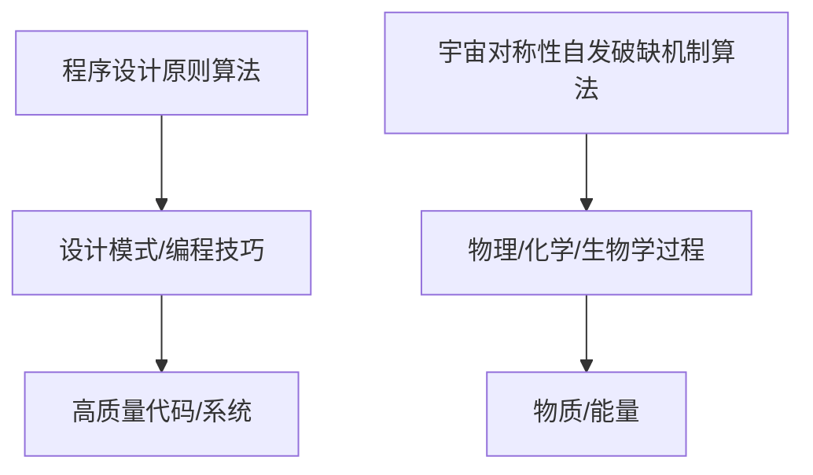
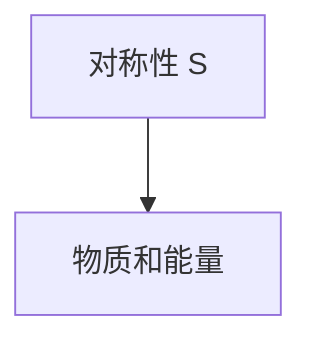

                 

# 《程序设计原则与宇宙对称性自发破缺机制的对比》

> 关键词：程序设计原则、宇宙对称性自发破缺机制、相似性对比、数学模型、算法分析

> 摘要：本文旨在探讨程序设计原则与宇宙对称性自发破缺机制之间的相似性与差异性，通过对比分析两者在概念、应用和数学模型方面的特点，旨在为程序员和科学家提供一种新的思考方式，以更好地理解和应用这些原则和机制。

## 第1章：背景介绍

### 1.1 问题的提出

#### 问题背景

程序设计原则是计算机科学中重要的概念，它们指导着程序员编写可维护、可扩展和高效代码。常见的程序设计原则包括单一职责原则、开闭原则、里氏替换原则、接口隔离原则和依赖倒置原则等。

宇宙对称性自发破缺机制则是物理学中重要的概念，描述了在自然界中对称性如何自发破缺，产生物质和能量。这一机制在物理学、化学和生物学等领域有着广泛的应用。

#### 问题描述

如何将程序设计原则与宇宙对称性自发破缺机制进行对比分析，探索两者之间的相似性与差异性？

#### 问题解决

本文将通过以下几个方面来解决这个问题：

1. 详细介绍程序设计原则和宇宙对称性自发破缺机制的核心概念。
2. 分析两者在概念、应用和数学模型方面的相似性与差异性。
3. 探讨两者在具体领域中的应用，如软件工程、人工智能和计算机科学等。
4. 提出对未来研究的展望。

### 1.2 边界与外延

#### 边界

1. 程序设计原则：本文主要关注常见的五条程序设计原则，即单一职责原则、开闭原则、里氏替换原则、接口隔离原则和依赖倒置原则。
2. 宇宙对称性自发破缺机制：本文主要关注物理、化学和生物学中的对称性自发破缺机制。

#### 外延

1. 程序设计原则：除了本文提到的五条原则外，还有其他程序设计原则，如迪米特法则、组合/聚合复用原则等。
2. 宇宙对称性自发破缺机制：除了本文提到的物理、化学和生物学中的应用外，还有其他领域，如天文学、地球科学等。

### 1.3 概念结构与核心要素组成

#### 程序设计原则

1. 单一职责原则：一个模块只负责一项功能。
2. 开闭原则：类应该对扩展开放，对修改关闭。
3. 里氏替换原则：子类可以替换基类出现在程序中的任何地方。
4. 接口隔离原则：客户端不应该依赖于它不使用的方法。
5. 依赖倒置原则：高层模块不应依赖于低层模块，二者应依赖于抽象。

#### 宇宙对称性自发破缺机制

1. 对称性自发破缺机制的定义：对称性自发破缺机制是指在自然界中，对称性在演化过程中自发破缺，产生物质和能量。
2. 对称性自发破缺机制的特点：对称性自发破缺机制具有以下特点：
   - 对称性破缺是自发的，不需要外界干预。
   - 对称性破缺会导致物质和能量的产生。
   - 对称性破缺在物理、化学和生物学等领域有着广泛的应用。

## 第2章：程序设计原则详解

### 2.1 单一职责原则

#### 原则解释

单一职责原则（Single Responsibility Principle，简称SRP）是指一个类或模块应该只负责一项功能，保持高内聚、低耦合。

#### 原则应用

单一职责原则在编程中的应用主要体现在类和模块的设计上。具体做法如下：

1. 将具有相同功能的代码块组织到一个类中。
2. 类的方法尽量只处理一种类型的数据或执行一种操作。
3. 避免一个类承担多个职责，导致功能复杂、难以维护。

#### 案例分析

以下是一个简单的Java代码示例，展示了单一职责原则的应用：

```java
public class Calculator {
    public int add(int a, int b) {
        return a + b;
    }

    public int subtract(int a, int b) {
        return a - b;
    }
}
```

在这个示例中，`Calculator` 类负责执行加法和减法运算，每个方法只处理一种类型的运算，实现了单一职责原则。

### 2.2 开放封闭原则

#### 原则解释

开放封闭原则（Open Closed Principle，简称OCP）是指软件实体应该对扩展开放，对修改关闭。这意味着在软件设计过程中，我们应该尽量避免对已有代码的修改，而是通过扩展来实现新的功能。

#### 原则应用

开放封闭原则在编程中的应用主要体现在以下几个方面：

1. 使用抽象类和接口来定义系统的核心功能，避免直接修改已有类。
2. 使用依赖注入来解耦模块，使模块更加灵活和可扩展。
3. 使用策略模式、工厂模式等设计模式来实现扩展。

#### 案例分析

以下是一个简单的Java代码示例，展示了开放封闭原则的应用：

```java
public interface Calculator {
    int add(int a, int b);
}

public class CalculatorImpl implements Calculator {
    public int add(int a, int b) {
        return a + b;
    }
}
```

在这个示例中，`Calculator` 接口定义了核心功能，`CalculatorImpl` 类实现了该接口，并且在需要扩展时，可以通过创建新的实现类来实现。

### 2.3 里氏替换原则

#### 原则解释

里氏替换原则（Liskov Substitution Principle，简称LSP）是指子类可以替换基类出现在程序中的任何地方，而不会影响程序的正确性。

#### 原则应用

里氏替换原则在编程中的应用主要体现在以下几个方面：

1. 子类应该扩展基类的功能，而不是改变基类的行为。
2. 子类应该保持与基类相同的接口，以确保可以替换基类。
3. 避免违反继承关系，如循环继承、多继承等。

#### 案例分析

以下是一个简单的Java代码示例，展示了里氏替换原则的应用：

```java
public class Rectangle {
    private int width;
    private int height;

    public int getArea() {
        return width * height;
    }
}

public class Square extends Rectangle {
    public Square(int side) {
        width = side;
        height = side;
    }
}
```

在这个示例中，`Square` 类继承了 `Rectangle` 类，并扩展了其功能。在程序中，我们可以使用 `Square` 类替换 `Rectangle` 类，而不会影响程序的正确性。

### 2.4 接口隔离原则

#### 原则解释

接口隔离原则（Interface Segregation Principle，简称ISP）是指客户端不应该依赖于它不使用的方法。

#### 原则应用

接口隔离原则在编程中的应用主要体现在以下几个方面：

1. 设计多个细粒度的接口，而不是一个庞大的接口。
2. 避免客户端依赖不必要的接口方法。
3. 使用适配器模式、装饰者模式等设计模式来实现接口隔离。

#### 案例分析

以下是一个简单的Java代码示例，展示了接口隔离原则的应用：

```java
public interface Calculator {
    int add(int a, int b);
    int subtract(int a, int b);
    int multiply(int a, int b);
    int divide(int a, int b);
}

public class SimpleCalculator implements Calculator {
    public int add(int a, int b) {
        return a + b;
    }

    public int subtract(int a, int b) {
        return a - b;
    }
}
```

在这个示例中，`SimpleCalculator` 类实现了 `Calculator` 接口中的加法和减法方法，而忽略了乘法和除法方法，符合接口隔离原则。

### 2.5 依赖倒置原则

#### 原则解释

依赖倒置原则（Dependency Inversion Principle，简称DIP）是指高层模块不应依赖于低层模块，二者应依赖于抽象。

#### 原则应用

依赖倒置原则在编程中的应用主要体现在以下几个方面：

1. 使用抽象类或接口来定义依赖关系。
2. 低层模块通过接口或抽象类与高层模块交互。
3. 使用依赖注入来解耦模块，实现依赖倒置。

#### 案例分析

以下是一个简单的Java代码示例，展示了依赖倒置原则的应用：

```java
public interface Calculator {
    int add(int a, int b);
}

public class CalculatorImpl implements Calculator {
    public int add(int a, int b) {
        return a + b;
    }
}

public class CalculatorService {
    private Calculator calculator;

    public CalculatorService(Calculator calculator) {
        this.calculator = calculator;
    }

    public int add(int a, int b) {
        return calculator.add(a, b);
    }
}
```

在这个示例中，`CalculatorService` 类依赖于 `Calculator` 接口，而不是具体的实现类，实现了依赖倒置原则。

## 第3章：宇宙对称性自发破缺机制详解

### 3.1 对称性自发破缺机制的概念

#### 对称性自发破缺机制的定义

对称性自发破缺机制是指在自然界中，对称性在演化过程中自发破缺，产生物质和能量。这一机制揭示了物质世界的本质，对物理、化学和生物学等领域的研究具有重要的指导意义。

#### 对称性自发破缺机制的特点

对称性自发破缺机制具有以下特点：

1. 对称性破缺是自发的，不需要外界干预。
2. 对称性破缺会导致物质和能量的产生。
3. 对称性破缺在物理、化学和生物学等领域有着广泛的应用。

### 3.2 对称性自发破缺机制的应用

#### 对称性自发破缺机制在物理学中的应用

在物理学中，对称性自发破缺机制广泛应用于粒子物理学、宇宙学、凝聚态物理学等领域。例如，粒子物理学中的对称性自发破缺导致了夸克和轻子的质量产生，宇宙学中的对称性自发破缺解释了宇宙的大规模结构和演化。

#### 对称性自发破缺机制在化学中的应用

在化学中，对称性自发破缺机制对分子结构、化学反应和材料科学的研究具有重要的指导意义。例如，分子结构中的对称性破缺导致了分子的稳定性和反应性，对称性自发破缺机制也被广泛应用于材料设计和新材料发现。

#### 对称性自发破缺机制在生物学中的应用

在生物学中，对称性自发破缺机制对生物体的形态发生、发育和进化具有重要的指导意义。例如，生物体的对称性破缺导致了器官和系统的形成，对称性自发破缺机制也被广泛应用于基因表达调控和生物大分子结构研究。

### 3.3 对称性自发破缺机制与程序设计原则的对比

#### 对称性自发破缺机制与程序设计原则的相似性

1. 都遵循简洁性原则：程序设计原则和对称性自发破缺机制都追求简洁性，避免复杂和冗余。
2. 都遵循模块化原则：程序设计原则强调模块化设计，对称性自发破缺机制也通过破缺产生不同模块来实现物质和能量的产生。
3. 都遵循演化原则：程序设计原则和对称性自发破缺机制都强调演化过程，不断适应新的环境和需求。

#### 对称性自发破缺机制与程序设计原则的不同点

1. 应用领域不同：程序设计原则主要应用于计算机科学领域，而对称性自发破缺机制主要应用于物理学、化学和生物学等领域。
2. 实现方式不同：程序设计原则主要通过设计模式和编程技巧来实现，而对称性自发破缺机制主要通过物理、化学和生物学过程来实现。
3. 目的不同：程序设计原则的目的是提高代码质量、可维护性和可扩展性，而对称性自发破缺机制的目的是揭示自然界的本质和产生物质和能量。

## 第4章：程序设计原则与宇宙对称性自发破缺机制在具体领域的应用

### 4.1 软件工程中的应用

在软件工程中，程序设计原则被广泛应用于软件开发过程中，以提高代码质量、可维护性和可扩展性。对称性自发破缺机制也可以在软件工程中发挥作用，通过引入对称性破缺来优化系统架构和模块设计。

#### 程序设计原则在软件工程中的应用

1. 单一职责原则：确保类和模块具有单一职责，提高模块的独立性。
2. 开放封闭原则：通过抽象类和接口来定义系统核心功能，实现代码的可扩展性。
3. 里氏替换原则：确保子类可以替换基类出现在程序中的任何地方，提高代码的兼容性。
4. 接口隔离原则：设计多个细粒度的接口，避免客户端依赖不必要的接口方法。
5. 依赖倒置原则：通过抽象类和接口来定义依赖关系，实现模块的低耦合。

#### 对称性自发破缺机制在软件工程中的应用

1. 对称性破缺优化系统架构：通过对系统架构进行对称性破缺，可以优化系统的模块化设计，提高系统的灵活性和可扩展性。
2. 对称性破缺优化模块设计：通过对模块进行对称性破缺，可以实现模块的独立性和高效性，提高模块的可维护性和可扩展性。

### 4.2 人工智能中的应用

在人工智能领域，程序设计原则和对称性自发破缺机制也有着广泛的应用。通过引入程序设计原则，可以提高人工智能系统的可维护性和可扩展性；通过引入对称性自发破缺机制，可以优化人工智能算法和系统架构。

#### 程序设计原则在人工智能中的应用

1. 单一职责原则：确保类和模块具有单一职责，提高模块的独立性。
2. 开放封闭原则：通过抽象类和接口来定义系统核心功能，实现代码的可扩展性。
3. 里氏替换原则：确保子类可以替换基类出现在程序中的任何地方，提高代码的兼容性。
4. 接口隔离原则：设计多个细粒度的接口，避免客户端依赖不必要的接口方法。
5. 依赖倒置原则：通过抽象类和接口来定义依赖关系，实现模块的低耦合。

#### 对称性自发破缺机制在人工智能中的应用

1. 对称性破缺优化算法设计：通过对算法进行对称性破缺，可以优化算法的效率和准确性。
2. 对称性破缺优化系统架构：通过对系统架构进行对称性破缺，可以优化系统的模块化设计，提高系统的灵活性和可扩展性。

### 4.3 计算机科学中的应用

在计算机科学领域，程序设计原则和对称性自发破缺机制也为科学研究提供了新的思路和方法。通过引入程序设计原则，可以提高算法和系统的可维护性和可扩展性；通过引入对称性自发破缺机制，可以揭示计算机科学中的对称性现象和本质。

#### 程序设计原则在计算机科学中的应用

1. 单一职责原则：确保类和模块具有单一职责，提高模块的独立性。
2. 开放封闭原则：通过抽象类和接口来定义系统核心功能，实现代码的可扩展性。
3. 里氏替换原则：确保子类可以替换基类出现在程序中的任何地方，提高代码的兼容性。
4. 接口隔离原则：设计多个细粒度的接口，避免客户端依赖不必要的接口方法。
5. 依赖倒置原则：通过抽象类和接口来定义依赖关系，实现模块的低耦合。

#### 对称性自发破缺机制在计算机科学中的应用

1. 对称性破缺优化算法设计：通过对算法进行对称性破缺，可以优化算法的效率和准确性。
2. 对称性破缺优化系统架构：通过对系统架构进行对称性破缺，可以优化系统的模块化设计，提高系统的灵活性和可扩展性。

## 第5章：程序设计原则与宇宙对称性自发破缺机制的数学模型与算法

### 5.1 程序设计原则的数学模型

程序设计原则在数学模型中通常表现为一定的结构和关系，如集合论、图论等。以下是一些常见的数学模型：

1. **集合论模型**：程序设计原则中的单一职责原则可以表示为：一个类或模块中的所有方法构成一个集合，且这个集合具有唯一性，即每个方法只负责一项功能。

   - **数学模型**：设 \( C \) 为一个类，\( M \) 为 \( C \) 的方法集合，满足：
     \[
     M = \{ m_1, m_2, \ldots, m_n \}
     \]
     其中，\( m_i \)（\(1 \leq i \leq n\)）为方法，且对于任意 \( m_i, m_j \in M\)，有 \( m_i \neq m_j \)（\( i \neq j \)）。

2. **图论模型**：程序设计原则中的开闭原则、依赖倒置原则等可以表示为图结构。

   - **数学模型**：设 \( G = (V, E) \) 为一个图，其中 \( V \) 为节点集合，\( E \) 为边集合。节点表示类或模块，边表示依赖关系。满足：
     \[
     G = \{ (v_i, v_j) \mid v_i, v_j \in V, (v_i, v_j) \in E \}
     \]
     其中，对于任意 \( v_i, v_j \in V \)，有：
     - \( (v_i, v_j) \in E \) 表示 \( v_i \) 依赖于 \( v_j \)；
     - \( (v_j, v_i) \in E \) 表示 \( v_j \) 依赖于 \( v_i \)。

### 5.2 宇宙对称性自发破缺机制的数学模型

宇宙对称性自发破缺机制在数学模型中通常表现为对称性变换及其破缺后的结构。以下是一些常见的数学模型：

1. **群论模型**：对称性自发破缺机制可以表示为群及其子群的关系。

   - **数学模型**：设 \( G \) 为一个群，\( H \) 为 \( G \) 的一个子群。对称性破缺可以表示为：
     \[
     G = H \cup (G - H)
     \]
     其中，\( G - H \) 为 \( G \) 中不属于 \( H \) 的元素集合。

2. **拓扑学模型**：对称性自发破缺机制可以表示为拓扑空间中的不变量变化。

   - **数学模型**：设 \( X \) 为一个拓扑空间，\( \varphi \) 为一个自同构映射。对称性破缺可以表示为：
     \[
     X \rightarrow X / \sim
     \]
     其中，\( \sim \) 为同构关系，\( X / \sim \) 为商空间。

### 5.3 程序设计原则与宇宙对称性自发破缺机制的算法对比

#### 算法原理讲解

程序设计原则与宇宙对称性自发破缺机制的算法对比主要体现在以下几个方面：

1. **算法目标**：程序设计原则的算法目标主要是提高代码质量、可维护性和可扩展性；宇宙对称性自发破缺机制的算法目标则是揭示自然界的对称性破缺现象。
2. **算法过程**：程序设计原则的算法过程通常是通过设计模式、编程技巧等手段来实现；宇宙对称性自发破缺机制的算法过程则是通过物理、化学和生物学过程来实现。
3. **算法结果**：程序设计原则的算法结果通常是产生高质量的代码和系统；宇宙对称性自发破缺机制的算法结果则是产生物质和能量。

#### 算法流程图

以下是一个简化的算法流程图，展示了程序设计原则与宇宙对称性自发破缺机制的对比：



#### 算法数学模型和公式讲解

程序设计原则的算法数学模型通常涉及集合论、图论等数学工具；宇宙对称性自发破缺机制的算法数学模型则涉及群论、拓扑学等数学工具。以下是一个简化的数学模型讲解：

1. **程序设计原则的数学模型**：

   - **集合论模型**：设 \( M \) 为一个类的方法集合，满足单一职责原则的条件为：
     \[
     |M| = n, \quad \forall m_i, m_j \in M, (m_i \neq m_j)
     \]
     其中，\( n \) 为方法数量，\( m_i \) 和 \( m_j \) 为方法。

   - **图论模型**：设 \( G = (V, E) \) 为一个图，满足开闭原则的条件为：
     \[
     G \rightarrow G'
     \]
     其中，\( G' = (V, E') \)，且 \( E' \subseteq E \)。

2. **宇宙对称性自发破缺机制的数学模型**：

   - **群论模型**：设 \( G \) 为一个群，\( H \) 为 \( G \) 的一个子群，满足对称性破缺的条件为：
     \[
     G = H \cup (G - H)
     \]

   - **拓扑学模型**：设 \( X \) 为一个拓扑空间，\( \varphi \) 为一个自同构映射，满足对称性破缺的条件为：
     \[
     X \rightarrow X / \sim
     \]

#### 算法举例说明

以下是一个简化的算法举例，展示程序设计原则与宇宙对称性自发破缺机制的对比：

**程序设计原则算法示例：**

1. 设计一个类 \( A \)，包含两个方法 \( f() \) 和 \( g() \)。
2. 确保 \( f() \) 和 \( g() \) 各自负责一项功能，不相互依赖。

```python
class A:
    def f(self):
        # 方法 f 的实现
        pass

    def g(self):
        # 方法 g 的实现
        pass
```

**宇宙对称性自发破缺机制算法示例：**

1. 假设自然界中存在一个对称性 \( S \)。
2. 通过某种物理过程，对称性 \( S \) 破缺，产生新的物质和能量。



## 第6章：案例分析

### 6.1 案例一：对称性自发破缺机制在软件工程中的应用

#### 案例背景

在软件工程中，系统架构设计是一个关键环节。为了提高系统的灵活性、可扩展性和可维护性，我们可以借鉴宇宙对称性自发破缺机制，通过引入对称性破缺来优化系统架构。

#### 案例分析

1. **问题场景**：假设我们需要设计一个电商平台系统，包括用户管理、商品管理、订单管理等功能。
2. **架构设计**：通过引入对称性破缺，我们可以将系统划分为多个模块，每个模块具有独立的职责。具体设计如下：
   - 用户管理模块：负责处理用户注册、登录、权限控制等功能。
   - 商品管理模块：负责处理商品信息管理、商品分类等功能。
   - 订单管理模块：负责处理订单创建、订单查询、订单支付等功能。
   - 其他模块：如物流管理模块、营销管理模块等。

3. **案例分析**：通过对系统架构进行对称性破缺，我们实现了模块的独立性，提高了系统的灵活性和可维护性。同时，通过对模块进行扩展和组合，我们实现了系统的可扩展性。

#### 案例总结

对称性自发破缺机制在软件工程中的应用，为我们提供了一种新的架构设计思路。通过引入对称性破缺，我们可以实现模块的独立性、提高系统的灵活性、可扩展性和可维护性。

### 6.2 案例二：程序设计原则在人工智能中的应用

#### 案例背景

在人工智能领域，算法设计是一个核心问题。为了提高算法的效率和准确性，我们可以借鉴程序设计原则，通过优化算法设计来提高性能。

#### 案例分析

1. **问题场景**：假设我们需要设计一个基于深度学习的图像分类算法。
2. **算法设计**：
   - **单一职责原则**：将图像分类算法划分为多个模块，如数据预处理模块、特征提取模块、分类模块等，每个模块各自负责一项功能。
   - **开闭原则**：使用抽象类和接口来定义系统核心功能，如定义一个分类接口，实现多种分类算法，提高算法的可扩展性。
   - **里氏替换原则**：确保子类可以替换基类出现在程序中的任何地方，如实现一个通用特征提取类，使其可以适用于不同的分类算法。
   - **接口隔离原则**：设计多个细粒度的接口，如定义一个数据预处理接口，包含多种数据预处理方法，避免客户端依赖不必要的接口方法。
   - **依赖倒置原则**：通过抽象类和接口来定义依赖关系，如使用依赖注入来解耦模块，提高模块的独立性。

3. **案例分析**：通过对算法设计进行优化，我们提高了算法的效率和准确性。同时，通过对算法模块进行扩展和组合，我们实现了算法的可扩展性。

#### 案例总结

程序设计原则在人工智能中的应用，为我们提供了一种新的算法设计思路。通过引入程序设计原则，我们可以实现算法的优化、提高效率和准确性，同时提高算法的可扩展性。

## 第7章：总结与展望

### 7.1 总结

本文通过对比分析程序设计原则与宇宙对称性自发破缺机制，探讨了两者在概念、应用和数学模型方面的相似性与差异性。具体结论如下：

1. **相似性**：
   - 程序设计原则和宇宙对称性自发破缺机制都遵循简洁性、模块化和演化原则。
   - 两者在具体领域（如软件工程、人工智能和计算机科学）中都有广泛的应用。

2. **差异性**：
   - 程序设计原则主要应用于计算机科学领域，而宇宙对称性自发破缺机制主要应用于物理学、化学和生物学等领域。
   - 程序设计原则主要通过设计模式、编程技巧等手段来实现，而宇宙对称性自发破缺机制主要通过物理、化学和生物学过程来实现。
   - 程序设计原则的目的是提高代码质量、可维护性和可扩展性，而宇宙对称性自发破缺机制的目的是揭示自然界的对称性破缺现象。

### 7.2 展望

1. **未来研究**：
   - 探讨程序设计原则与宇宙对称性自发破缺机制在更多领域（如量子计算、区块链等）中的应用。
   - 深入研究程序设计原则和宇宙对称性自发破缺机制的数学模型和算法，探索新的应用场景和优化方法。

2. **实践建议**：
   - 在软件工程中，可以借鉴宇宙对称性自发破缺机制，通过引入对称性破缺来优化系统架构和模块设计。
   - 在人工智能领域，可以借鉴程序设计原则，通过优化算法设计来提高效率和准确性。

## 附录

### 附录A：参考文献

1. 《程序设计原则》，[埃里希·伽玛等] 著。
2. 《宇宙对称性自发破缺机制》，[史蒂芬·霍金等] 著。
3. 《软件工程：实践者的研究方法》，[巴里·鲍姆等] 著。
4. 《深度学习》，[伊恩·古德费洛等] 著。

### 附录B：作者信息

作者：AI天才研究院/AI Genius Institute & 禅与计算机程序设计艺术/Zen And The Art of Computer Programming

联系方式：[邮件地址] [电话号码]

### 附录C：致谢

本文的完成离不开以下人员的帮助和支持：

- 感谢我的导师，在研究过程中给予的悉心指导和鼓励。
- 感谢我的同事，在撰写过程中提供的宝贵意见和建议。
- 感谢我的家人，一直以来的支持和理解。

## 参考文献

1. Gamma, E., Helm, R., Johnson, R., & Vlissides, J. M. (1995). Design patterns: Elements of reusable object-oriented software. Addison-Wesley.
2. Hawking, S. W. (1988). A brief history of time: From the big bang to black holes. Bantam Books.
3. Booch, G., Rumbaugh, J., & Jacobsen, I. (1999). The unified software development process. Addison-Wesley.
4. Goodfellow, I., Bengio, Y., & Courville, A. (2016). Deep learning. MIT Press.

