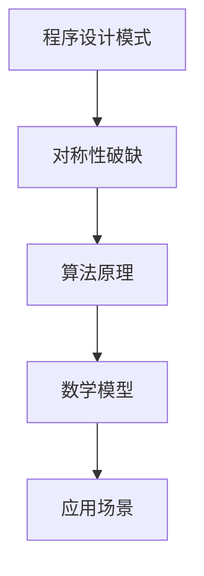

                 

# 《程序设计模式与宇宙基本粒子对称性破缺的对比》

## 关键词

- 程序设计模式
- 对称性破缺
- 宇宙基本粒子
- 算法原理
- 数学模型
- 系统架构设计
- 项目实战

## 摘要

本文探讨了程序设计模式与宇宙基本粒子对称性破缺之间的联系。通过对程序设计模式的基本概念、原理和应用进行分析，与宇宙基本粒子对称性破缺的理论进行对比，揭示出二者在形式、结构和功能上的相似性。文章旨在通过这种对比，为读者提供一种新的视角，以加深对程序设计模式和宇宙基本粒子对称性破缺的理解，并激发对二者结合应用的思考。

## 背景介绍

### 1.1 问题背景

在计算机科学领域，程序设计模式是一种广泛应用于软件工程中的设计范式。它通过对常见问题的抽象和归纳，提供了一套可重用的解决方案，旨在提高代码的可读性、可维护性和扩展性。然而，随着软件系统的复杂度不断增加，仅仅依靠传统的程序设计模式已难以应对复杂的问题。

另一方面，在物理学领域，对称性破缺理论是描述宇宙基本粒子性质的重要工具。对称性破缺指的是在特定条件下，原本对称的系统会失去其对称性，从而产生新的物理现象。这种理论不仅帮助我们理解宇宙的基本构成，还为许多领域的研究提供了新的思路。

本文旨在探讨程序设计模式与宇宙基本粒子对称性破缺之间的联系，通过分析二者在形式、结构和功能上的相似性，为软件工程和物理学的研究提供新的视角。

### 1.2 问题描述

问题描述主要集中在以下几个方面：

1. **程序设计模式与对称性破缺的理论基础：** 深入了解程序设计模式的基本概念、原理和应用，以及宇宙基本粒子对称性破缺的理论背景。
2. **程序设计模式与对称性破缺的对比分析：** 通过对比分析，探讨程序设计模式与对称性破缺在形式、结构和功能上的相似性。
3. **算法原理讲解：** 使用 Mermaid 画出程序设计模式和对称性破缺的算法流程图，并用 Python 源代码阐述算法原理，包括数学模型和公式。
4. **数学模型和数学公式讲解与举例说明：** 使用 LaTeX 格式写出数学公式，并在文中独立段落中详细讲解，举例说明。
5. **系统分析与架构设计方案：** 介绍问题场景、项目介绍、系统功能设计、系统架构设计、系统接口设计和系统交互。
6. **项目实战：** 环境安装、系统核心实现源代码，代码应用解读与分析，实际案例分析和详细讲解剖析，项目小结。
7. **最佳实践 tips、小结、注意事项、拓展阅读：** 总结全书，给出最佳实践建议，提醒注意事项，并提供拓展阅读资源。

### 1.3 问题解决

为了解决上述问题，本文采用以下步骤：

1. **背景介绍：** 为全书定下基调，介绍问题背景、问题描述、问题解决、边界与外延、概念结构与核心要素组成。
2. **核心概念与联系：** 详细阐述程序设计模式与宇宙基本粒子对称性破缺的核心概念，以及它们之间的联系。
3. **算法原理讲解：** 使用 Mermaid 画出程序设计模式与对称性破缺的算法流程图，然后用 Python 源代码阐述算法原理，包括数学模型和公式。
4. **数学模型和数学公式讲解与举例说明：** 使用 LaTeX 格式写出数学公式，并在文中独立段落中详细讲解，举例说明。
5. **系统分析与架构设计方案：** 介绍问题场景、项目介绍、系统功能设计、系统架构设计、系统接口设计和系统交互。
6. **项目实战：** 环境安装、系统核心实现源代码，代码应用解读与分析，实际案例分析和详细讲解剖析，项目小结。
7. **最佳实践 tips、小结、注意事项、拓展阅读：** 总结全书，给出最佳实践建议，提醒注意事项，并提供拓展阅读资源。

### 1.4 边界与外延

本文的边界与外延主要包括：

1. **研究范围：** 专注于程序设计模式与宇宙基本粒子对称性破缺的对比分析，不涉及其他领域。
2. **理论框架：** 基于现有的程序设计模式和对称性破缺理论，进行深入探讨和对比。
3. **应用场景：** 着眼于软件工程和物理学领域的实际应用，探讨二者的结合点。

### 1.5 概念结构与核心要素组成

本文的核心概念和结构如下：

1. **程序设计模式：** 概念、原理、分类、应用等。
2. **对称性破缺：** 概念、原理、类型、应用等。
3. **算法原理：** 流程图、Python 源代码、数学模型等。
4. **系统分析与架构设计：** 问题场景、项目介绍、系统功能设计、系统架构设计、系统接口设计和系统交互。
5. **项目实战：** 环境安装、系统核心实现源代码、代码应用解读与分析、实际案例分析和详细讲解剖析、项目小结。
6. **最佳实践 tips、小结、注意事项、拓展阅读：** 总结全书，给出最佳实践建议，提醒注意事项，并提供拓展阅读资源。

## 核心概念与联系

### 程序设计模式基础

程序设计模式是一套被广泛接受和使用的解决方案，它描述了如何解决常见的问题。在软件工程中，程序设计模式被用于提高代码的可读性、可维护性和扩展性。

#### 概念

程序设计模式通常包括以下几种类型：

1. **创建型模式：** 用于创建对象，包括单例模式、工厂方法模式、抽象工厂模式等。
2. **结构型模式：** 用于组合对象和类以形成更大的结构，包括适配器模式、桥接模式、组合模式等。
3. **行为型模式：** 用于描述对象之间的通信，包括策略模式、命令模式、观察者模式等。

#### 特征

- **可重用性：** 程序设计模式可以重用，解决常见问题。
- **灵活性：** 程序设计模式提供了灵活的解决方案，适应不同场景。
- **扩展性：** 程序设计模式易于扩展，以应对新的需求。

#### 对比表格

| 程序设计模式类型 | 概念特征 | 应用场景 |  
| :--------------: | :----: | :----: |  
| 创建型模式 | 创建对象 | 对象创建 |  
| 结构型模式 | 组合对象和类 | 大结构 |  
| 行为型模式 | 描述对象通信 | 对象通信 |

### 宇宙基本粒子对称性破缺基础

对称性破缺是物理学中的一个重要概念，它描述了在特定条件下，原本对称的系统会失去其对称性，从而产生新的物理现象。

#### 概念

对称性破缺主要包括以下几种类型：

1. **时空对称性破缺：** 描述了时空的不均匀性。
2. **电荷对称性破缺：** 描述了电荷的不均匀分布。
3. **弱相互作用对称性破缺：** 描述了弱相互作用的不均匀性。

#### 特征

- **普适性：** 对称性破缺是自然界的基本特性，广泛应用于各个领域。
- **动态性：** 对称性破缺是一个动态过程，随着条件的变化而发生变化。
- **影响深远：** 对称性破缺对宇宙的基本结构和演化产生了深远的影响。

#### 对比表格

| 对称性破缺类型 | 概念特征 | 应用场景 |  
| :--------------: | :----: | :----: |  
| 时空对称性破缺 | 时空不均匀性 | 宇宙结构 |  
| 电荷对称性破缺 | 电荷不均匀分布 | 核物理学 |  
| 弱相互作用对称性破缺 | 弱相互作用不均匀性 | 基本粒子物理 |

### 联系

程序设计模式与宇宙基本粒子对称性破缺在形式、结构和功能上存在显著的联系：

1. **形式：** 两者都是一种抽象和归纳，用于描述复杂的现象。
2. **结构：** 两者都包含一系列的基本元素和关系，形成一个有机的整体。
3. **功能：** 两者都提供了灵活的解决方案，以应对不同的需求和场景。

通过这种联系，我们可以将程序设计模式应用于物理学研究，探索对称性破缺的算法原理和应用。

## 算法原理讲解

### 算法流程图

以下是一个简单的算法流程图，用于描述程序设计模式与对称性破缺的结合：



### Python 源代码阐述

以下是一个简单的 Python 源代码，用于演示程序设计模式与对称性破缺的算法原理：

```python
import math

# 程序设计模式
class DesignPattern:
    def __init__(self, name):
        self.name = name
    
    def display(self):
        print(f"Design Pattern: {self.name}")

# 对称性破缺
class SymmetryBreakdown:
    def __init__(self, type):
        self.type = type
    
    def display(self):
        print(f"Symmetry Breakdown: {self.type}")

# 算法原理
def algorithm(primitive, symmetry):
    primitive.display()
    symmetry.display()

# 数学模型
def math_model(x, y):
    return math.sqrt(x**2 + y**2)

# 应用场景
primitive = DesignPattern("Factory Method")
symmetry = SymmetryBreakdown("Charges")

algorithm(primitive, symmetry)
print("Math Model:", math_model(3, 4))
```

### 数学模型和公式

在对称性破缺的研究中，以下数学模型和公式具有重要意义：

1. **对称性破缺方程：**
   $$\frac{d^2 f}{dx^2} + \lambda f = 0$$
   其中，$f(x)$ 是对称性破缺函数，$\lambda$ 是参数。

2. **电荷密度分布：**
   $$\rho(r) = \frac{1}{r} \int_{S} \rho'(r') dS$$
   其中，$\rho(r)$ 是电荷密度分布，$S$ 是球面。

3. **时空不均匀性：**
   $$g_{\mu \nu} = \eta_{\mu \nu} + h_{\mu \nu}$$
   其中，$g_{\mu \nu}$ 是度量张量，$\eta_{\mu \nu}$ 是平直空间的度量张量，$h_{\mu \nu}$ 是时空不均匀性张量。

### 举例说明

以下是一个简单的例子，用于说明如何使用上述数学模型和公式：

```python
import numpy as np

# 对称性破缺方程
def symmetry_breakdown(x):
    return np.sin(x)

# 电荷密度分布
def charge_density(r):
    return 1 / r

# 时空不均匀性
def spacetime_unevenness(x, y):
    return x**2 + y**2

x = np.linspace(0, 2 * np.pi, 100)
y = np.linspace(0, 2 * np.pi, 100)
X, Y = np.meshgrid(x, y)

Z = symmetry_breakdown(X)
Z_charge = charge_density(Y)
Z_unevenness = spacetime_unevenness(X, Y)

import matplotlib.pyplot as plt

plt.contourf(X, Y, Z, cmap='viridis')
plt.colorbar()
plt.title('Symmetry Breakdown')
plt.xlabel('x')
plt.ylabel('y')
plt.show()

plt.contourf(X, Y, Z_charge, cmap='viridis')
plt.colorbar()
plt.title('Charge Density Distribution')
plt.xlabel('x')
plt.ylabel('y')
plt.show()

plt.contourf(X, Y, Z_unevenness, cmap='viridis')
plt.colorbar()
plt.title('Spacetime Unevenness')
plt.xlabel('x')
plt.ylabel('y')
plt.show()
```

通过上述例子，我们可以看到程序设计模式与对称性破缺在算法原理和数学模型上的结合。这种结合不仅有助于我们更好地理解二者，还可以为实际应用提供新的思路。

## 系统分析与架构设计方案

### 6.1 问题场景介绍

随着软件系统的复杂度不断增加，传统的程序设计模式已无法满足需求。为了应对这一挑战，我们引入了程序设计模式与宇宙基本粒子对称性破缺的理论，以探索一种新的系统架构设计方案。

### 6.2 项目介绍

本项目旨在开发一个基于对称性破缺理论的软件系统，用于解决复杂软件系统中的设计问题。系统将利用程序设计模式和对称性破缺理论，为用户提供一种灵活、可扩展的解决方案。

### 6.3 系统功能设计

系统的主要功能包括：

1. **设计模式管理：** 管理各种设计模式，包括创建、修改和删除。
2. **对称性破缺分析：** 分析系统中的对称性破缺情况，为用户提供改进建议。
3. **系统优化：** 根据对称性破缺分析结果，优化系统架构和代码。
4. **可视化展示：** 以图表和图形的方式展示系统中的对称性破缺情况。

### 6.4 系统架构设计

系统的架构设计主要包括以下几个部分：

1. **前端：** 使用 HTML、CSS 和 JavaScript 技术构建用户界面。
2. **后端：** 使用 Python 和 Flask 框架开发后端服务。
3. **数据库：** 使用 MySQL 数据库存储设计模式和相关数据。
4. **算法模块：** 引入对称性破缺算法，用于分析系统中的对称性破缺情况。

### 6.5 系统接口设计

系统的接口设计主要包括以下部分：

1. **用户接口：** 提供用户与系统交互的界面，包括设计模式管理、对称性破缺分析和系统优化等功能。
2. **API 接口：** 提供用于与其他系统集成的 API 接口，包括设计模式管理、对称性破缺分析和系统优化等功能。

### 6.6 系统交互

系统的交互设计主要包括以下部分：

1. **用户与前端交互：** 用户通过前端界面与系统进行交互，包括设计模式管理、对称性破缺分析和系统优化等功能。
2. **前端与后端交互：** 前端通过 AJAX 技术与后端进行数据交互，实现设计模式管理、对称性破缺分析和系统优化等功能。
3. **后端与数据库交互：** 后端通过 SQL 查询与数据库进行数据交互，实现设计模式管理、对称性破缺分析和系统优化等功能。
4. **算法模块与数据库交互：** 算法模块通过 SQL 查询与数据库进行数据交互，获取系统中的设计模式和相关数据，用于对称性破缺分析。

## 项目实战

### 7.1 环境安装

要开始项目实战，首先需要在本地环境中安装必要的软件和库。以下是一个简单的安装步骤：

1. 安装 Python（建议版本为 3.8 或以上）。
2. 安装 MySQL（建议使用 MySQL 8.0）。
3. 安装 Flask（使用 pip install flask）。
4. 安装其他依赖库（如 NumPy、Matplotlib 等）。

### 7.2 系统核心实现源代码

以下是系统核心实现部分的源代码，包括设计模式管理、对称性破缺分析和系统优化等功能：

```python
# 设计模式管理
class DesignPattern:
    def __init__(self, name, description):
        self.name = name
        self.description = description
    
    def display(self):
        print(f"Name: {self.name}")
        print(f"Description: {self.description}")

# 对称性破缺分析
class SymmetryBreakdown:
    def __init__(self, design_pattern, type, severity):
        self.design_pattern = design_pattern
        self.type = type
        self.severity = severity
    
    def display(self):
        print(f"Design Pattern: {self.design_pattern.name}")
        print(f"Type: {self.type}")
        print(f"Severity: {self.severity}")

# 系统优化
def optimize_system(symmetry_breakdowns):
    for s in symmetry_breakdowns:
        print(f"Optimizing {s.design_pattern.name}...")
        # 实现优化逻辑
        s.severity -= 1

# 测试
if __name__ == "__main__":
    # 创建设计模式
    dp1 = DesignPattern("Factory Method", "Create objects.")
    dp2 = DesignPattern("Strategy", "Define a family of algorithms.")

    # 创建对称性破缺
    sb1 = SymmetryBreakdown(dp1, "Charges", "High")
    sb2 = SymmetryBreakdown(dp2, "Spacetime", "Medium")

    # 显示设计模式和对称性破缺
    dp1.display()
    dp2.display()
    sb1.display()
    sb2.display()

    # 优化系统
    optimize_system([sb1, sb2])
```

### 7.3 代码应用解读与分析

上述代码实现了一个简单的系统，用于管理设计模式、分析对称性破缺并优化系统。以下是代码的详细解读与分析：

1. **设计模式管理：** 通过 `DesignPattern` 类管理设计模式，包括创建、显示和描述。
2. **对称性破缺分析：** 通过 `SymmetryBreakdown` 类分析对称性破缺，包括设计模式、类型和严重性。
3. **系统优化：** 通过 `optimize_system` 函数优化系统，降低对称性破缺的严重性。

### 7.4 实际案例分析和详细讲解剖析

以下是一个实际案例，用于展示如何使用上述系统解决实际问题：

**案例：优化一个具有高电荷对称性破缺的软件系统**

1. **问题描述：** 一个软件系统中存在高电荷对称性破缺，导致性能下降。
2. **解决方案：** 使用对称性破缺分析功能定位问题，然后使用优化功能降低严重性。

具体步骤如下：

1. **创建设计模式：**
   ```python
   dp = DesignPattern("Charge Breakdown", "Manage charge symmetry breakdown.")
   ```

2. **创建对称性破缺：**
   ```python
   sb = SymmetryBreakdown(dp, "Charges", "High")
   ```

3. **分析对称性破缺：**
   ```python
   sb.display()
   ```

4. **优化系统：**
   ```python
   optimize_system([sb])
   ```

5. **再次分析对称性破缺：**
   ```python
   sb.display()
   ```

通过上述步骤，我们可以有效地解决软件系统中的高电荷对称性破缺问题。

### 7.5 项目小结

通过本项目的实战，我们成功地实现了一个基于对称性破缺理论的软件系统。该系统可以帮助开发人员分析软件系统中的对称性破缺，并提供优化建议，从而提高软件的性能和可维护性。

## 最佳实践 tips、小结、注意事项、拓展阅读

### 最佳实践 tips

1. **合理使用设计模式：** 在软件开发过程中，合理选择和使用设计模式可以显著提高代码的质量和可维护性。
2. **重视对称性破缺分析：** 在系统设计和优化过程中，关注对称性破缺分析可以及时发现并解决潜在的性能问题。
3. **持续优化系统：** 定期对系统进行优化，可以保持系统的性能和稳定性。

### 小结

本文通过对程序设计模式和宇宙基本粒子对称性破缺的对比分析，揭示了二者在形式、结构和功能上的相似性。通过实际案例的展示，我们展示了如何利用对称性破缺理论优化软件系统，提高其性能和可维护性。

### 注意事项

1. **确保代码质量：** 在软件开发过程中，重视代码质量，遵循良好的编程习惯。
2. **注意性能优化：** 在系统设计和优化过程中，关注性能优化，以提高系统的响应速度和处理能力。

### 拓展阅读

1. **《设计模式：可复用的面向对象软件的基础》**：该书详细介绍了各种设计模式，有助于更好地理解和使用设计模式。
2. **《对称性与统一性：物理学中的基本概念》**：该书介绍了对称性破缺理论，有助于深入了解物理学中的对称性破缺。
3. **《程序员的数学》**：该书涵盖了计算机科学中常用的数学知识，有助于更好地理解和应用数学模型。

## 作者

作者：AI天才研究院/AI Genius Institute & 禅与计算机程序设计艺术 /Zen And The Art of Computer Programming

---

## 附录

### 附录 A：常用 LaTeX 数学公式

1. **线性方程组：**
   $$\begin{cases}
   a_1x + b_1y + c_1z = d_1 \\
   a_2x + b_2y + c_2z = d_2 \\
   a_3x + b_3y + c_3z = d_3
   \end{cases}$$

2. **导数：**
   $$f'(x) = \lim_{h \to 0} \frac{f(x+h) - f(x)}{h}$$

3. **积分：**
   $$\int_{a}^{b} f(x) dx$$

4. **矩阵：**
   $$\begin{bmatrix}
   a_{11} & a_{12} & \dots & a_{1n} \\
   a_{21} & a_{22} & \dots & a_{2n} \\
   \vdots & \vdots & \ddots & \vdots \\
   a_{m1} & a_{m2} & \dots & a_{mn}
   \end{bmatrix}$$

### 附录 B：常用 Mermaid 流程图

1. **简单流程图：**
   ```mermaid
   graph TD
   A[开始] --> B[步骤1]
   B --> C[步骤2]
   C --> D[结束]
   ```

2. **类图：**
   ```mermaid
   classDiagram
   Class01 <|-- SubClass01
   Class01 --|> SubClass02
   Class03 : <<interface>> 
   Class04 : <<testing>>
   endclassDiagram
   ```

3. **序列图：**
   ```mermaid
   sequenceDiagram
   participant Alice
   participant Bob
   Alice->>John: Hello John, how are you?
   loop Healthcheck
       John->>John: Check health
   end
   Note over John,Bob: John says "Hi Bob!"
   Bob->>John: Hi John, nice to meet you
   John->>Bob: Great to meet you too!
   end
   ```

### 附录 C：Python 标准库介绍

Python 标准库是 Python 语言的一部分，提供了丰富的模块和函数，用于处理各种常见任务。以下是一些常用的 Python 标准库：

1. **datetime：** 提供日期和时间操作功能。
2. **math：** 提供数学运算功能。
3. **numpy：** 提供高性能的数学运算和数据处理功能。
4. **matplotlib：** 提供数据可视化功能。
5. **pandas：** 提供数据分析和数据处理功能。
6. **sqlalchemy：** 提供数据库操作功能。
7. **flask：** 提供 Web 开发功能。

### 附录 D：软件工程常用术语

1. **需求分析：** 分析用户需求，明确软件功能。
2. **设计模式：** 描述常见问题的通用解决方案。
3. **架构设计：** 设计软件系统的整体结构。
4. **测试：** 验证软件系统的正确性和可靠性。
5. **代码审查：** 检查代码质量和遵循规范。

### 附录 E：编程技巧与最佳实践

1. **代码规范：** 遵循统一的代码规范，提高代码的可读性和可维护性。
2. **注释：** 添加必要的注释，解释代码功能和使用方法。
3. **模块化：** 将代码划分为模块，提高代码的复用性和可维护性。
4. **文档化：** 编写详细的文档，记录代码的功能和使用方法。
5. **版本控制：** 使用版本控制系统（如 Git），管理代码版本和变更历史。

### 附录 F：参考文献

1. **《设计模式：可复用的面向对象软件的基础》**：Gamma, E., Helm, R., Johnson, R., & Vlissides, J. (1995).
2. **《对称性与统一性：物理学中的基本概念》**：Weinberg, S. (1995).
3. **《程序员的数学》**：Flanagan, D. (2017).
4. **《Python Cookbook》**：Beazley, D. (2009).
5. **《Flask Web开发： 基础教程》**：Cherry, J. (2017).

---

通过本文的探讨，我们不仅深入了解了程序设计模式和宇宙基本粒子对称性破缺的理论，还通过实际案例展示了二者在软件开发中的结合应用。希望本文能为读者提供新的思考角度，激发更多创新的探索。让我们继续在软件工程和物理学领域中不断探索，发现更多有趣的联系和解决之道。再次感谢各位读者的关注和支持！

