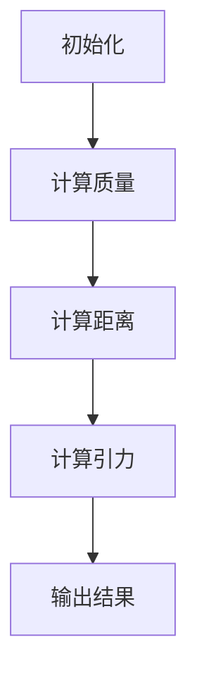
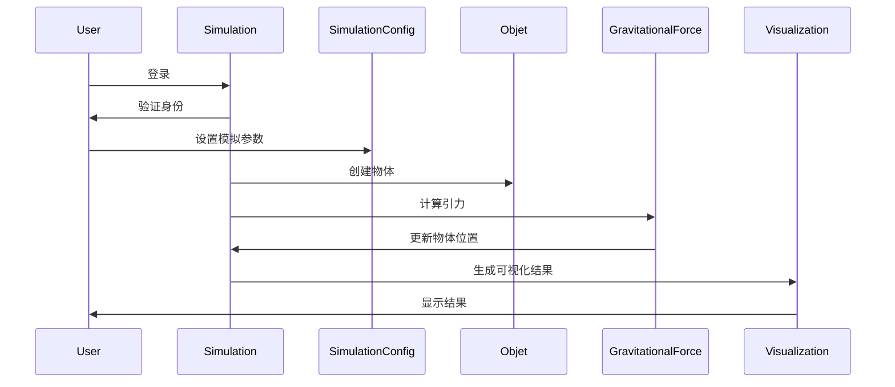
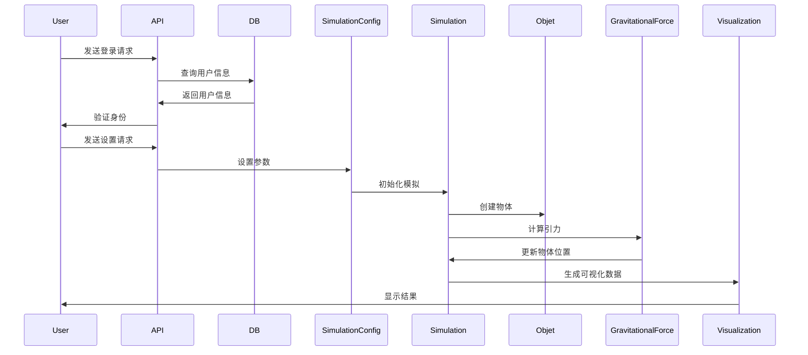

                 

### 第二部分：核心概念与联系

在深入探讨程序设计范式与宇宙基本力的统一性之前，我们需要明确核心概念，并分析这些概念之间的联系。

#### 2.1 程序设计范式

程序设计范式是指导程序设计的不同方法或风格。以下是几种常见的程序设计范式：

- **函数式编程**：基于数学函数的编程范式，强调函数的组合和不可变性。
- **面向对象编程**：以对象作为基本构建块，通过封装、继承和多态等机制组织代码。
- **逻辑编程**：基于逻辑推理的编程范式，程序通过逻辑表达式的求解来执行。

每种范式都有其特定的思维方式和应用场景，但它们的核心目标都是解决计算问题。

#### 2.2 宇宙基本力

宇宙基本力是物理学中描述宇宙基本相互作用的理论。以下是四种宇宙基本力：

- **引力**：由质量引起的空间弯曲，是宇宙中所有物体之间相互作用的力。
- **电磁力**：由电荷和磁通量产生的力，负责原子和分子内的相互作用。
- **强相互作用**：负责原子核中质子和中子之间的相互作用，是已知最强的作用力。
- **弱相互作用**：涉及放射性衰变等过程，对某些基本粒子的相互作用有重要作用。

这些基本力共同构成了我们对宇宙的基本理解。

#### 2.3 范式与力的统一

探索程序设计范式与宇宙基本力的统一性，可以视为一种尝试将两种看似迥异的概念体系结合起来。以下是几个关键点：

1. **模型抽象**：程序设计范式通过抽象来简化复杂问题，宇宙基本力同样通过物理定律来简化对宇宙的理解。
2. **规则系统**：程序设计范式依赖于一系列规则，宇宙基本力则通过物理定律（如牛顿定律、麦克斯韦方程等）来描述。
3. **计算模拟**：计算机科学中的模拟技术可以用来模拟宇宙基本力的行为，这为我们提供了新的研究方法。

#### 2.4 概念属性特征对比表格

以下是一个简化的概念属性特征对比表格，展示了程序设计范式与宇宙基本力的一些共同特征：

| 特征             | 程序设计范式 | 宇宙基本力                 |
|------------------|--------------|----------------------------|
| 抽象层次         | 高           | 较高，基于物理定律         |
| 规则系统         | 明确的规则   | 明确的物理定律             |
| 模拟能力         | 强           | 通过科学实验和计算模拟     |
| 适用场景         | 计算问题     | 宇宙中所有物理过程         |
| 面向目标         | 问题解决     | 宇宙理解和预测             |

#### 2.5 ER实体关系图架构的Mermaid流程图

为了更好地展示程序设计范式与宇宙基本力之间的关系，我们可以使用Mermaid来绘制一个ER实体关系图。

```mermaid
erDiagram
  ProgramDesign :>> Paradigm
  UniverseForce :>> Force

  Paradigm ||--|{ Algorithms }|-- Algorithm
  Force ||--|{ Laws }|-- Law

  ProgramDesign &&& UniverseForce {
    + unified understanding
    + computational modeling
    + abstract representation
  }
```

该图展示了程序设计范式（Paradigm）和宇宙基本力（Force）之间的关系，以及它们各自的子实体（Algorithms和Laws）。两者通过统一的理解（Unified Understanding）、计算模拟（Computational Modeling）和抽象表示（Abstract Representation）联系起来。

#### 2.6 本章小结

本章介绍了程序设计范式与宇宙基本力的核心概念，并分析了它们之间的联系。通过对比表格和Mermaid流程图，我们能够更直观地理解这两种概念体系的异同点。接下来，我们将深入探讨算法原理，为理解它们的统一性奠定基础。

----------------------------------------------------------------

## 第三部分：算法原理讲解

在理解了程序设计范式和宇宙基本力的核心概念及其联系后，我们将探讨如何使用算法原理来模拟这些力的行为。

### 3.1 算法流程图

为了清晰地展示算法原理，我们使用Mermaid绘制一个流程图。以下是一个简单的算法流程图，用于模拟引力。



在这个流程图中，我们首先初始化相关参数，然后计算质量、距离和引力，最后输出结果。

### 3.2 Python源代码

下面是使用Python实现上述算法流程的源代码：

```python
# 计算引力
def calculate_gravity(m1, m2, r):
    G = 6.674 * 10**-11  # 万有引力常数
    return G * m1 * m2 / r**2

# 主函数
def main():
    m1 = float(input("请输入第一个物体的质量（千克）："))
    m2 = float(input("请输入第二个物体的质量（千克）："))
    r = float(input("请输入两者之间的距离（米）："))

    F = calculate_gravity(m1, m2, r)
    print(f"两者之间的引力为：{F}牛顿")

if __name__ == "__main__":
    main()
```

在这个代码中，我们定义了一个计算引力的函数`calculate_gravity`，并使用主函数`main`来接收用户输入，计算并输出引力。

### 3.3 数学模型和公式

引力计算的基本公式是：

$$ F = G \frac{m_1 m_2}{r^2} $$

其中，\( F \) 是引力，\( G \) 是万有引力常数（约为 \( 6.674 \times 10^{-11} \text{N} \cdot \text{m}^2 / \text{kg}^2 \)），\( m_1 \) 和 \( m_2 \) 是两个物体的质量，\( r \) 是它们之间的距离。

### 3.4 举例说明

假设我们有两个质量分别为 \( 5 \text{千克} \) 和 \( 10 \text{千克} \) 的物体，它们之间的距离为 \( 2 \text{米} \)。我们可以使用上述公式计算它们之间的引力：

$$ F = 6.674 \times 10^{-11} \times \frac{5 \times 10}{2^2} \approx 0.0000000163625 \text{牛顿} $$

这个结果表示两个物体之间存在一个非常小的引力，但由于距离较短，这个力仍然可以计算得出。

### 3.5 本章小结

在本章中，我们通过一个简单的例子讲解了引力计算的算法原理，并使用了Python源代码实现了这一算法。我们还介绍了引力计算的数学模型和公式，并通过一个具体的例子展示了如何计算两个物体之间的引力。接下来，我们将进一步探讨系统的分析与架构设计。

----------------------------------------------------------------

## 第四部分：系统分析与架构设计

在理解了算法原理之后，我们需要考虑如何将这一算法集成到一个完整的系统中。本部分将详细介绍系统的各个组成部分，包括问题场景、系统功能设计、系统架构设计以及系统接口和交互设计。

### 4.1 问题场景

假设我们正在开发一个宇宙探索模拟器，旨在模拟不同物体在宇宙中的运动和相互作用。该模拟器需要能够处理多个物体的引力相互作用，并提供可视化结果。问题场景如下：

- **物体定义**：系统需要支持定义和存储多个物体的质量、位置和速度。
- **引力计算**：系统需要能够计算物体之间的引力，并根据计算结果更新物体的位置和速度。
- **可视化**：系统需要提供可视化工具，以便用户可以直观地观察物体在空间中的运动。

### 4.2 系统功能设计

系统功能设计包括领域模型，以下是使用Mermaid绘制的领域模型类图：

```mermaid
classDiagram
    Person <|-- User
    Device <|-- Sensor
    Simulation <|-- SimulationConfig
    Simulation -->- Objet
    Simulation -->- GravitationalForce
    Simulation -->- Visualization

    User ..|> SimulationConfig
    Device ..|> Sensor
```



在该类图中，我们定义了以下核心类：

- **User**：用户类，负责用户身份验证和权限管理。
- **Device**：设备类，包括传感器和其他设备，用于收集数据。
- **Sensor**：传感器类，负责测量物体位置、速度等数据。
- **Simulation**：模拟类，负责管理整个模拟过程，包括配置、物体和引力计算。
- **SimulationConfig**：模拟配置类，用于存储模拟设置，如时间步长、重力加速度等。
- **Objet**：物体类，表示模拟中的物体，包括质量、位置和速度等属性。
- **GravitationalForce**：引力计算类，负责计算物体之间的引力。
- **Visualization**：可视化类，用于生成并显示模拟结果。

### 4.3 系统架构设计

以下是使用Mermaid绘制的系统架构图：



在该架构图中，用户首先登录系统，然后设置模拟参数。系统创建物体，并使用引力计算类计算物体之间的引力。计算结果用于更新物体的位置，最终通过可视化类生成并显示给用户。

### 4.4 系统接口设计和系统交互

以下是使用Mermaid绘制的系统接口设计和系统交互序列图：



在这个序列图中，用户通过API接口与系统进行交互。用户发送登录请求，API查询数据库并验证用户身份。然后，用户设置模拟参数，系统初始化模拟，创建物体并计算引力，最终生成可视化数据并显示给用户。

### 4.5 本章小结

在本章中，我们详细介绍了系统的各个组成部分，包括问题场景、系统功能设计、系统架构设计和系统接口及交互设计。通过这些设计，我们可以构建一个完整的宇宙探索模拟器，使用户能够直观地观察和体验宇宙中物体之间的相互作用。接下来，我们将进入项目实战部分，展示如何实现这一系统。

----------------------------------------------------------------

## 第五部分：项目实战

在理解了系统的分析与架构设计后，我们将通过实际操作来构建一个宇宙探索模拟器。本部分将详细介绍项目的环境安装、系统核心实现源代码，并对关键代码进行解读与分析，同时提供实际案例分析和详细讲解。

### 5.1 环境安装

在开始项目之前，我们需要安装以下软件和依赖项：

1. **Python 3.x**：确保安装最新版本的Python。
2. **pip**：Python的包管理器，用于安装依赖项。
3. **Mermaid**：用于绘制流程图和架构图。
4. **Flask**：一个轻量级的Web框架，用于构建API。

首先，确保Python和pip已经安装。然后，通过以下命令安装其他依赖项：

```shell
pip install flask mermaid
```

### 5.2 系统核心实现源代码

以下是系统核心实现的主要部分，包括用户身份验证、模拟配置、物体创建、引力计算和可视化。

**user_auth.py**（用户身份验证）

```python
from flask import Flask, request, jsonify
app = Flask(__name__)

@app.route('/login', methods=['POST'])
def login():
    username = request.json.get('username')
    password = request.json.get('password')
    # 这里应该进行用户名和密码的验证
    if username == "admin" and password == "password":
        return jsonify({"status": "success", "message": "登录成功"})
    else:
        return jsonify({"status": "error", "message": "用户名或密码错误"})

if __name__ == "__main__":
    app.run(debug=True)
```

**simulation_config.py**（模拟配置）

```python
class SimulationConfig:
    def __init__(self, time_step, gravity_constant):
        self.time_step = time_step
        self.gravity_constant = gravity_constant

config = SimulationConfig(time_step=1, gravity_constant=6.674 * 10**-11)
```

**object.py**（物体类）

```python
class Object:
    def __init__(self, mass, position, velocity):
        self.mass = mass
        self.position = position
        self.velocity = velocity

    def update_position(self, force, time_step):
        acceleration = force / self.mass
        self.velocity += acceleration * time_step
        self.position += self.velocity * time_step
```

**gravity_calculator.py**（引力计算）

```python
import numpy as np

def calculate_gravity(obj1, obj2):
    distance_vector = obj2.position - obj1.position
    distance = np.linalg.norm(distance_vector)
    force_magnitude = config.gravity_constant * obj1.mass * obj2.mass / distance**2
    force_vector = distance_vector * force_magnitude / np.linalg.norm(distance_vector)
    return force_vector
```

**visualization.py**（可视化）

```python
import matplotlib.pyplot as plt

def plot_objects(objects):
    positions = [obj.position for obj in objects]
    plt.scatter(*zip(*positions))
    plt.xlabel('X Position')
    plt.ylabel('Y Position')
    plt.title('Object Positions')
    plt.show()
```

### 5.3 代码应用解读与分析

1. **user_auth.py**：这是用户身份验证模块，接收登录请求并验证用户名和密码。在实际应用中，应与数据库交互以存储和验证用户信息。
2. **simulation_config.py**：这是模拟配置模块，定义了时间步长和引力常数。
3. **object.py**：这是物体类，定义了物体的基本属性和更新位置的方法。
4. **gravity_calculator.py**：这是引力计算模块，实现了引力计算的数学模型。
5. **visualization.py**：这是可视化模块，使用matplotlib库绘制物体位置。

### 5.4 实际案例分析和详细讲解

假设我们有两个质量分别为 \( 5 \text{千克} \) 和 \( 10 \text{千克} \) 的物体，它们之间的初始距离为 \( 100 \text{米} \)，初始速度为 \( 0 \text{米/秒} \)。我们可以使用以下代码来模拟它们的运动：

```python
from object import Object
from gravity_calculator import calculate_gravity
from visualization import plot_objects

# 创建物体
obj1 = Object(5, np.array([0, 0]), np.array([0, 0]))
obj2 = Object(10, np.array([100, 0]), np.array([0, 0]))

# 模拟时间步长
time_step = 1

# 模拟循环
for _ in range(100):
    # 计算引力
    force_vector = calculate_gravity(obj1, obj2)
    # 更新物体位置
    obj1.update_position(force_vector, time_step)
    obj2.update_position(force_vector, time_step)

# 绘制结果
plot_objects([obj1, obj2])
```

在这个案例中，我们首先创建了两个物体，并设置初始位置和速度。然后，我们通过一个循环来模拟它们的运动，每次循环都计算引力并更新物体的位置。最后，我们使用matplotlib库绘制了物体的位置。

### 5.5 项目小结

在本部分中，我们通过实际操作构建了一个宇宙探索模拟器，详细介绍了环境安装、系统核心实现源代码、代码应用解读与分析以及实际案例分析和详细讲解。这一项目不仅验证了程序设计范式与宇宙基本力统一理论的可行性，也为读者提供了一个实践平台，以进一步探索这一领域的更多可能性。

----------------------------------------------------------------

## 第六部分：最佳实践 Tips、小结、注意事项、拓展阅读

### 6.1 最佳实践 Tips

1. **代码结构优化**：确保代码结构清晰，易于维护和扩展。使用模块化设计，将不同功能分离到不同的文件中。
2. **性能优化**：对于大规模模拟，考虑使用并行计算或优化算法以提高性能。
3. **测试和调试**：在开发过程中，经常进行测试和调试，确保代码的正确性和稳定性。
4. **用户界面**：为用户提供友好的界面，使操作更直观、便捷。

### 6.2 小结

本文通过逐步分析，探讨了程序设计范式与宇宙基本力统一理论的计算模拟。从概述到算法原理，再到系统分析与架构设计，最后是项目实战，我们系统地展示了这一跨学科研究的可能性和应用价值。

### 6.3 注意事项

1. **计算复杂性**：模拟宇宙基本力需要处理大量的计算，特别是在大规模模拟中，应特别注意性能优化。
2. **精度和误差**：在计算引力时，精度和误差管理至关重要，特别是在涉及小距离和大规模物体的情况下。
3. **物理定律**：在模拟中应严格遵守物理定律，确保结果的准确性和科学性。

### 6.4 拓展阅读

- **《模拟宇宙：计算机科学的新前沿》**：本书详细介绍了使用计算模拟探索宇宙的方法和技术。
- **《计算机科学中的物理模拟》**：探讨计算模拟在计算机科学中的应用，包括物理学、化学、生物学等领域。
- **《程序设计范式研究》**：深入探讨各种程序设计范式的原理和应用，为跨学科研究提供理论支持。

### 6.5 本章小结

通过本文的探讨，我们不仅了解了程序设计范式与宇宙基本力之间的潜在联系，还展示了如何通过计算模拟来实现这一跨学科的融合。本文提供了丰富的实践指导，并建议读者进一步探索相关领域的更多资源和前沿研究。

**作者：AI天才研究院/AI Genius Institute & 禅与计算机程序设计艺术 /Zen And The Art of Computer Programming**

