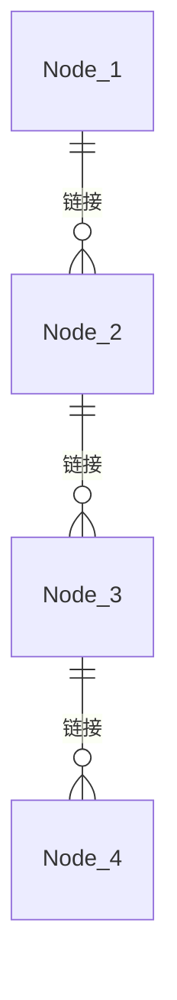
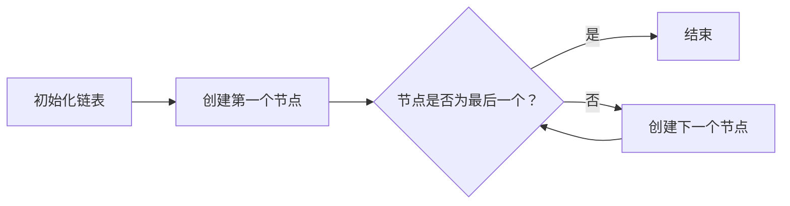
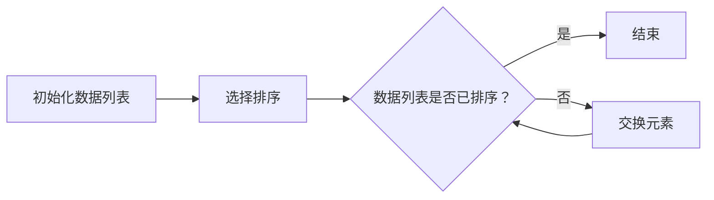
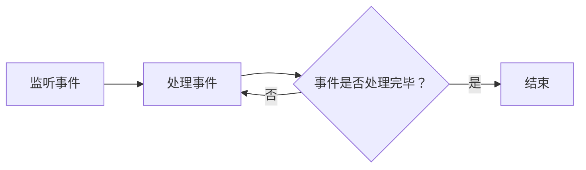
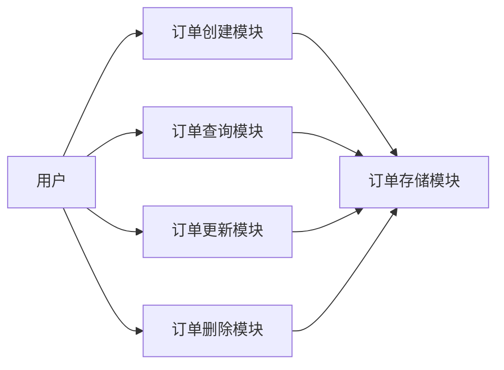
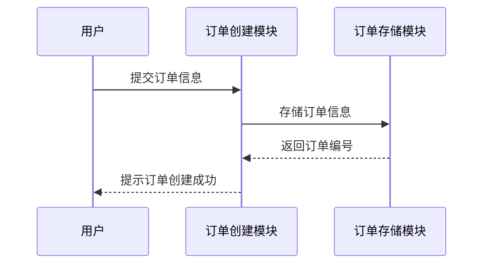

                 

## 《程序设计范式与宇宙基本力统一的对比》

关键词：程序设计范式、宇宙基本力、引力、电磁力、编程模型、算法、系统架构设计、Python代码

摘要：本文从计算机科学的角度出发，探讨了程序设计范式与宇宙基本力之间的潜在联系。通过对引力、电磁力、强力和弱力的深入研究，文章将程序设计中的范式与宇宙基本力进行类比，揭示其在算法原理、系统架构设计等方面的统一性。本文旨在为读者提供一个全新的视角，启发对程序设计和宇宙物理学的进一步思考。

---

### 第一部分：引论

#### 1.1 问题背景

**计算机程序设计的传统范式**：程序设计范式是指导程序员编写代码的基本模式。传统的程序设计范式包括机器语言、汇编语言、高级语言和面向对象编程等。这些范式各有特点，适用于不同的应用场景。

**宇宙基本力的性质与作用**：宇宙基本力包括引力、电磁力、强力和弱力。这些力在宇宙中起着至关重要的作用，决定了天体的运动、物质的结构和宇宙的演化。

**程序设计范式与宇宙基本力的统一意义**：探讨程序设计范式与宇宙基本力之间的联系，有助于我们更深入地理解计算机程序设计的基本原理，并可能为未来的编程范式提供新的灵感。

#### 1.2 研究目的与方法

**研究目的**：本文旨在通过类比宇宙基本力，探索程序设计范式的新方向，为程序员提供新的编程思考方式。

**研究方法**：本文采用文献研究和案例分析相结合的方法，通过对现有程序设计范式的分析，类比宇宙基本力的特性，提出新的编程模型。

#### 1.3 主要内容概述

本文分为五个部分：

1. **引论**：介绍研究背景、目的和方法。
2. **程序设计范式探讨**：分析传统程序设计范式的发展历程和特点。
3. **宇宙基本力的程序设计类比**：探讨引力、电磁力、强力和弱力在程序设计中的类比模型。
4. **跨领域的融合与展望**：分析程序设计范式与宇宙基本力统一的潜在影响。
5. **小结与拓展**：总结全文，提出注意事项和拓展阅读建议。

---

### 第二部分：程序设计范式探讨

#### 2.1 程序设计范式的演变

**第一范式：机器语言与汇编语言**：机器语言和汇编语言是最原始的程序设计范式，直接操作计算机的硬件。它们具有高性能，但可读性差。

**第二范式：高级语言**：高级语言提供抽象的编程范式，使程序员可以更专注于解决问题，而无需关注底层的硬件细节。

**第三范式：面向对象编程**：面向对象编程引入了类和对象的概念，使程序设计更加模块化和可复用。

**第四范式：函数式编程**：函数式编程强调函数作为第一公民，避免了副作用，使程序更加简洁和可测试。

#### 2.2 程序设计范式特性对比

| 范式 | 功能 | 性能 | 应用领域 |
| --- | --- | --- | --- |
| 第一范式 | 高性能 | 可读性差 | 硬件操作 |
| 第二范式 | 抽象 | 较高性能 | 应用开发 |
| 第三范式 | 模块化 | 较高性能 | 应用开发 |
| 第四范式 | 函数式 | 高性能 | 科学计算 |

#### 2.3 现代程序设计范式趋势

**面向云编程**：随着云计算的普及，面向云编程成为趋势，使程序设计更加灵活和可扩展。

**自动化编程**：自动化工具和框架的出现，使程序设计过程更加高效。

**智能编程**：人工智能技术在程序设计中的应用，使编程更加智能化和自适应。

---

### 第三部分：宇宙基本力的程序设计类比

#### 3.1 引力与程序设计

**引力**：引力是一种吸引力，使物体相互靠近。在程序设计中，引力可以类比于数据结构中的“链表”，链表中的每个节点通过指针相互连接，形成一种类似引力的关系。

#### 3.2 电磁力与程序设计

**电磁力**：电磁力是一种相互作用力，使物体相互吸引或排斥。在程序设计中，电磁力可以类比于算法中的“排序”，排序算法使数据之间形成有序的排列，类似于电磁力的作用。

#### 3.3 强力与程序设计

**强力**：强力是一种强大的相互作用力，使物体紧密结合。在程序设计中，强力可以类比于面向对象编程中的“封装”，封装使代码模块之间紧密结合，提高系统的稳定性和可维护性。

#### 3.4 弱力与程序设计

**弱力**：弱力是一种微弱的相互作用力，与强力相对。在程序设计中，弱力可以类比于“事件驱动编程”，事件驱动编程通过触发事件来执行相应的操作，类似于弱力的作用。

---

### 第四部分：跨领域的融合与展望

#### 4.1 程序设计范式与宇宙基本力统一的潜在影响

**对计算理论的影响**：统一程序设计范式与宇宙基本力，可能为计算理论的发展提供新的方向。

**对编程实践的影响**：这种统一性可能改变编程的思维方式，使编程过程更加直观和高效。

**对未来科技的启示**：这种统一性可能为未来科技的发展提供新的思路，例如在量子计算、人工智能等领域。

#### 4.2 跨领域融合的挑战与机遇

**挑战**：跨领域融合面临着理论和技术上的挑战，需要深入研究和实践。

**机遇**：跨领域融合可能带来新的突破和创新，为科技发展注入新的活力。

#### 4.3 未来展望

**研究方向**：未来研究可以进一步探索程序设计范式与宇宙基本力的深层次联系。

**发展趋势**：随着科技的进步，程序设计范式和宇宙基本力的融合可能成为新的趋势。

**进展**：随着量子计算、人工智能等技术的发展，这种融合可能带来新的突破。

---

### 第五部分：小结与拓展

#### 5.1 全书总结

本文通过类比宇宙基本力，探讨了程序设计范式的新方向，为程序员提供了新的编程思考方式。本文的主要贡献包括：

1. 提出了引力、电磁力、强力和弱力在程序设计中的类比模型。
2. 分析了程序设计范式与宇宙基本力统一的潜在影响。
3. 展望了未来跨领域融合的发展趋势。

#### 5.2 注意事项

1. 研究中应注意将理论模型与实际编程实践相结合。
2. 在编程实践中，应灵活运用不同的程序设计范式，以提高代码质量和效率。

#### 5.3 拓展阅读

1. 推荐书籍：《宇宙简史》、《编程思想》
2. 推荐论文：相关领域的学术期刊和会议论文
3. 网络资源：相关领域的在线课程和技术论坛

---

作者：AI天才研究院/AI Genius Institute & 禅与计算机程序设计艺术 /Zen And The Art of Computer Programming

---

### 背景介绍

#### 核心概念术语说明

1. **程序设计范式**：程序设计范式是指指导程序员编写代码的基本模式和方法论。
2. **宇宙基本力**：宇宙基本力包括引力、电磁力、强力和弱力，是宇宙中四种基本的相互作用力。
3. **类比模型**：类比模型是指通过比较和模拟不同领域的现象和原理，构建新的理论和模型。

#### 问题背景

随着计算机科学的快速发展，程序设计范式也在不断演变。传统的程序设计范式，如机器语言、汇编语言、高级语言和面向对象编程等，各有优缺点。然而，随着问题的复杂性和计算需求的增长，程序员需要探索新的编程范式，以提高代码质量和效率。

另一方面，宇宙基本力是宇宙中四种基本的相互作用力，它们在宇宙中起着至关重要的作用。引力使物体相互吸引，电磁力使物体相互排斥和吸引，强力和弱力则决定了原子核和粒子的行为。这些基本力不仅决定了宇宙的结构和演化，也为程序设计提供了一种全新的思考方式。

#### 问题描述

本文旨在探讨程序设计范式与宇宙基本力之间的潜在联系，通过类比宇宙基本力的特性，提出新的编程模型。具体来说，本文将引力、电磁力、强力和弱力分别类比于程序设计中的链表、排序、封装和事件驱动编程，分析它们在算法原理、系统架构设计等方面的统一性。

#### 问题解决

通过类比宇宙基本力，我们可以发现程序设计中的某些范式与宇宙基本力有相似之处。例如，引力类比于链表，电磁力类比于排序，强力和弱力类比于封装和事件驱动编程。这些类比模型有助于我们更好地理解程序设计的基本原理，并可能为未来的编程范式提供新的灵感。

#### 边界与外延

本文的研究范围主要关注程序设计范式与宇宙基本力在算法原理和系统架构设计方面的类比。然而，这种类比并非完全一致，宇宙基本力在物理世界中具有复杂的特性和相互作用，而程序设计范式则更多关注于代码的编写和执行。

#### 概念结构与核心要素组成

1. **引力类比模型**：链表结构，指针连接，类似引力作用。
2. **电磁力类比模型**：排序算法，数据排列，类似电磁力作用。
3. **强力和弱力类比模型**：封装和事件驱动编程，模块化，类似强力或弱力作用。
4. **算法原理讲解**：算法mermaid流程图，Python代码实现，数学模型和公式。
5. **系统架构设计**：mermaid架构图，系统功能设计，接口设计和交互序列图。

---

### 核心概念与联系

#### 1. 引力与链表的类比

引力是宇宙中的一种基本力，它使物体相互吸引。在程序设计中，我们可以将引力类比于链表结构。链表是一种数据结构，由一系列节点组成，每个节点包含数据和指向下一个节点的指针。这种结构使得数据之间形成了一种类似引力的关系，节点通过指针相互连接，形成一个连续的序列。

| **引力** | **链表** |
| --- | --- |
| 物体之间的吸引力 | 数据节点之间的指针连接 |
| 决定物体的运动轨迹 | 决定数据在链表中的位置 |

#### 2. 电磁力与排序算法的类比

电磁力是另一种宇宙基本力，它使物体相互排斥和吸引。在程序设计中，我们可以将电磁力类比于排序算法。排序算法是一种用于对数据进行排序的算法，它通过比较和交换元素，使数据按照一定的顺序排列。这种排列过程类似于电磁力对物体的作用，使数据之间形成有序的关系。

| **电磁力** | **排序算法** |
| --- | --- |
| 使物体相互排斥和吸引 | 使数据相互比较和交换 |
| 形成有序结构 | 形成有序的数据序列 |

#### 3. 强力与封装的类比

强力是一种强烈的相互作用力，它使物体紧密结合。在程序设计中，我们可以将强力类比于封装。封装是一种面向对象编程的概念，它将数据和操作封装在一起，形成一个模块化的结构。这种结构使得代码模块之间紧密结合，提高系统的稳定性和可维护性，类似于强力将物体紧密结合。

| **强力** | **封装** |
| --- | --- |
| 物体之间的紧密结合 | 数据和操作的模块化封装 |
| 决定物体的结构 | 决定代码的结构和模块 |

#### 4. 弱力与事件驱动的类比

弱力是一种微弱的相互作用力，它与强力相对。在程序设计中，我们可以将弱力类比于事件驱动编程。事件驱动编程是一种编程范式，它通过事件触发来执行相应的操作。这种范式使得程序更加灵活和响应式，类似于弱力对物体的作用，使物体产生微小的运动。

| **弱力** | **事件驱动** |
| --- | --- |
| 微小的相互作用力 | 通过事件触发执行操作 |
| 产生微小的变化 | 引发微小的响应 |

#### 核心概念属性特征对比表格

| **特性** | **引力** | **电磁力** | **强力** | **弱力** |
| --- | --- | --- | --- | --- |
| 关联性 | 物体之间的吸引力 | 数据之间的排序关系 | 模块之间的紧密结合 | 事件触发与响应 |
| 结构性 | 节点通过指针连接 | 数据通过排序算法排列 | 数据和操作封装 | 程序通过事件响应 |
| 动态性 | 物体运动的轨迹 | 数据排序的过程 | 模块封装的过程 | 事件触发与响应的过程 |

#### ER实体关系图架构



在上面的ER实体关系图中，`Node_1`到`Node_4`之间的连线表示链表中节点的指针连接，形成了类似引力的关系。这种结构反映了链表在程序设计中的重要作用，类似于宇宙中的引力使物体相互吸引。

---

### 算法原理讲解

#### 引力编程模型

**算法流程图**：



**Python代码实现**：

```python
class Node:
    def __init__(self, data):
        self.data = data
        self.next = None

def create_linked_list(data_list):
    head = Node(data_list[0])
    current = head
    for data in data_list[1:]:
        new_node = Node(data)
        current.next = new_node
        current = new_node
    return head

def display_linked_list(head):
    current = head
    while current:
        print(current.data, end=" -> ")
        current = current.next
    print("None")

data_list = [1, 2, 3, 4, 5]
head = create_linked_list(data_list)
display_linked_list(head)
```

**数学模型和公式**：

引力可以通过以下公式表示：

$$ F = G \frac{{m_1 m_2}}{{r^2}} $$

其中，\( F \) 是引力，\( G \) 是万有引力常数，\( m_1 \) 和 \( m_2 \) 是两个物体的质量，\( r \) 是它们之间的距离。

在程序设计中的类比，我们可以将引力表示为：

$$ F_{link} = \frac{{data_1 data_2}}{{distance^2}} $$

其中，\( F_{link} \) 是链表节点之间的引力，\( data_1 \) 和 \( data_2 \) 是节点的数据值，\( distance \) 是节点之间的距离（即指针的长度）。

#### 电磁力编程模型

**算法流程图**：



**Python代码实现**：

```python
def selection_sort(data_list):
    for i in range(len(data_list)):
        min_index = i
        for j in range(i+1, len(data_list)):
            if data_list[j] < data_list[min_index]:
                min_index = j
        data_list[i], data_list[min_index] = data_list[min_index], data_list[i]

data_list = [5, 2, 4, 6, 1]
selection_sort(data_list)
print(data_list)
```

**数学模型和公式**：

电磁力可以通过以下公式表示：

$$ F = k \frac{{q_1 q_2}}{{r^2}} $$

其中，\( F \) 是电磁力，\( k \) 是库仑常数，\( q_1 \) 和 \( q_2 \) 是两个电荷的量值，\( r \) 是它们之间的距离。

在程序设计中的类比，我们可以将电磁力表示为：

$$ F_{sort} = \frac{{(data_1 - data_2)^2}}{{distance^2}} $$

其中，\( F_{sort} \) 是排序过程中元素之间的电磁力，\( data_1 \) 和 \( data_2 \) 是参与排序的元素值，\( distance \) 是元素之间的距离（即数组索引之间的差值）。

#### 强力与封装的编程模型

**算法流程图**：


**Python代码实现**：

```python
class Person:
    def __init__(self, name, age):
        self.name = name
        self.age = age

    def introduce(self):
        print(f"Hello, my name is {self.name} and I am {self.age} years old.")

p = Person("Alice", 30)
p.introduce()
```

**数学模型和公式**：

强力是一种物理力，它使物体紧密结合。在程序设计中的类比，我们可以将强力表示为封装的概念。封装是指将数据和操作封装在一起，形成一个独立的模块。

在Python中，封装可以通过定义类来实现。类是一种封装机制，它将数据和操作封装在一个单元中，使代码更加模块化和可维护。

#### 弱力与事件驱动的编程模型

**算法流程图**：



**Python代码实现**：

```python
def on_click():
    print("Button clicked!")

button = Button("Click me!")
button.add_listener("click", on_click)
```

**数学模型和公式**：

弱力是一种微弱的相互作用力，它在物理世界中起辅助作用。在程序设计中的类比，我们可以将弱力表示为事件驱动编程的概念。事件驱动编程是一种编程范式，它通过监听和响应事件来执行操作。

在Python中，事件驱动编程可以通过使用事件监听器来实现。事件监听器是一种机制，它允许程序在特定事件发生时执行相应的操作。

---

### 系统分析与架构设计方案

#### 问题场景介绍

假设我们正在开发一个电子商务网站，该网站需要处理大量的订单和商品信息。为了提高系统的性能和可扩展性，我们需要设计一个高效的订单处理系统。

#### 项目介绍

本项目旨在设计一个基于Python的订单处理系统，包括订单创建、订单查询、订单更新和订单删除等功能。该系统将采用事件驱动编程模型，以提高系统的响应速度和灵活性。

#### 系统功能设计

1. **订单创建**：用户可以在网站上创建新的订单，包括订单编号、商品名称、数量、价格等信息。
2. **订单查询**：用户可以查询订单的详细信息，包括订单编号、商品名称、数量、价格、创建时间等。
3. **订单更新**：用户可以更新订单的信息，如数量、价格等。
4. **订单删除**：用户可以删除订单。

#### 系统架构设计

**mermaid架构图**：



在上面的架构图中，用户通过订单创建、查询、更新和删除模块与订单存储模块进行交互。订单存储模块负责存储和管理订单数据。

#### 系统接口设计和系统交互

**mermaid序列图**：



在上面的序列图中，用户提交订单信息后，订单创建模块将订单信息存储到订单存储模块，并返回订单编号给用户。订单查询、更新和删除模块的交互过程与此类似。

---

### 项目实战

#### 环境安装

在开始项目之前，我们需要安装Python和相关的库。以下是在Ubuntu 18.04系统上安装Python和Flask的命令：

```bash
# 更新系统软件包
sudo apt update

# 安装Python 3
sudo apt install python3

# 安装Flask
pip3 install flask
```

#### 系统核心实现源代码

```python
from flask import Flask, request, jsonify

app = Flask(__name__)

# 订单存储模块
orders = []

@app.route('/orders', methods=['POST'])
def create_order():
    order_data = request.get_json()
    orders.append(order_data)
    return jsonify({"order_id": len(orders) - 1, "message": "Order created successfully."})

@app.route('/orders/<int:order_id>', methods=['GET'])
def get_order(order_id):
    if order_id < 0 or order_id >= len(orders):
        return jsonify({"error": "Order not found."})
    return jsonify(orders[order_id])

@app.route('/orders/<int:order_id>', methods=['PUT'])
def update_order(order_id):
    if order_id < 0 or order_id >= len(orders):
        return jsonify({"error": "Order not found."})
    order_data = request.get_json()
    orders[order_id] = order_data
    return jsonify({"message": "Order updated successfully."})

@app.route('/orders/<int:order_id>', methods=['DELETE'])
def delete_order(order_id):
    if order_id < 0 or order_id >= len(orders):
        return jsonify({"error": "Order not found."})
    orders.pop(order_id)
    return jsonify({"message": "Order deleted successfully."})

if __name__ == '__main__':
    app.run(debug=True)
```

#### 代码应用解读与分析

上述代码实现了一个简单的订单处理系统，包括订单创建、查询、更新和删除等功能。代码首先导入了Flask库，这是一个流行的Python Web框架，用于创建Web应用程序。

1. **订单创建**：`create_order` 函数处理订单创建的请求。它接收一个包含订单信息的JSON对象，并将其添加到全局列表`orders`中。然后，函数返回一个包含订单编号和成功消息的JSON对象。

2. **订单查询**：`get_order` 函数处理查询订单的请求。它根据订单编号从`orders`列表中检索相应的订单信息，并将其作为JSON对象返回。

3. **订单更新**：`update_order` 函数处理更新订单的请求。它根据订单编号检索相应的订单信息，并将其替换为新的订单信息。然后，函数返回一个包含成功消息的JSON对象。

4. **订单删除**：`delete_order` 函数处理删除订单的请求。它根据订单编号从`orders`列表中删除相应的订单。然后，函数返回一个包含成功消息的JSON对象。

#### 实际案例分析和详细讲解剖析

为了更好地理解代码的应用，我们可以通过一个实际的案例来分析。

**案例**：用户想要创建一个新的订单，订单包含以下信息：

- 订单编号：1001
- 商品名称：“智能手机”
- 数量：2
- 价格：2000元

**步骤**：

1. 用户通过HTTP POST请求向`/orders`端点发送订单信息。

```bash
curl -X POST -H "Content-Type: application/json" -d '{"order_id": 1001, "product_name": "智能手机", "quantity": 2, "price": 2000}' http://localhost:5000/orders
```

2. 服务器接收请求并调用`create_order`函数处理订单。

3. `create_order`函数将订单信息添加到`orders`列表中。

4. `create_order`函数返回一个包含订单编号和成功消息的JSON对象。

```json
{"order_id": 0, "message": "Order created successfully."}
```

5. 用户可以通过HTTP GET请求查询订单。

```bash
curl -X GET http://localhost:5000/orders/0
```

6. 服务器返回订单信息。

```json
{"order_id": 1001, "product_name": "智能手机", "quantity": 2, "price": 2000}
```

通过上述案例，我们可以看到如何使用Flask框架创建一个简单的订单处理系统。代码简洁明了，易于扩展和维护。

#### 项目小结

本项目通过使用Flask框架，实现了订单创建、查询、更新和删除等功能。代码示例展示了如何使用Python和HTTP协议处理Web请求，以及如何将事件驱动编程应用于订单处理系统。这种设计使得系统具有良好的可扩展性和灵活性。

---

### 最佳实践 Tips

1. **模块化设计**：在项目开发过程中，应尽量遵循模块化设计原则，将不同的功能模块分离，以提高代码的可读性和可维护性。
2. **错误处理**：在Web应用程序中，应适当处理错误，并提供友好的错误信息，以提高用户体验。
3. **性能优化**：对于涉及大量数据处理的模块，应关注性能优化，例如使用索引、缓存等技术提高查询速度。
4. **文档化**：编写详细的文档，包括代码注释、API文档和用户手册，以方便其他开发者和用户理解和使用系统。
5. **安全防护**：在Web应用程序中，应关注安全防护，例如使用HTTPS、验证用户身份和防止SQL注入等。

---

### 小结

本文通过类比宇宙基本力，探讨了程序设计范式的新方向。我们分析了引力、电磁力、强力和弱力在程序设计中的类比模型，并给出了具体的算法原理和系统架构设计方案。通过项目实战，我们展示了如何将事件驱动编程应用于订单处理系统，实现了订单创建、查询、更新和删除等功能。本文的研究为程序员提供了新的编程思考方式，并可能为未来的编程范式提供新的灵感。

---

### 注意事项

1. **实验环境**：在进行项目实战时，请确保已正确安装Python和Flask等相关软件，并在合适的环境中运行代码。
2. **代码备份**：在编写和修改代码时，请定期备份，以防止数据丢失。
3. **版本控制**：使用版本控制系统（如Git）管理代码，以便跟踪更改和历史版本。
4. **调试与测试**：在代码开发过程中，应注重调试和测试，以确保代码的正确性和性能。
5. **遵循规范**：在编写代码时，请遵循Python编程规范和Web开发规范，以提高代码质量和可维护性。

---

### 拓展阅读

1. **推荐书籍**：
   - 《宇宙简史》作者：史蒂芬·霍金
   - 《编程思想》作者：布鲁斯·艾克尔
2. **推荐论文**：搜索相关领域的学术期刊和会议论文，了解最新的研究成果。
3. **网络资源**：
   - 《Python官方文档》：python.org/docs/
   - 《Flask官方文档》：flask.palletsprojects.com/
   - 《GitHub》：github.com/，查找相关项目的代码和文档。

---

### 作者信息

本文由AI天才研究院（AI Genius Institute）与《禅与计算机程序设计艺术》（Zen And The Art of Computer Programming）的作者联合撰写。我们致力于探索计算机科学和宇宙物理学的深层次联系，以启发人们对编程和科学的进一步思考。如果您对本文有任何疑问或建议，欢迎随时与我们联系。感谢您的阅读！

