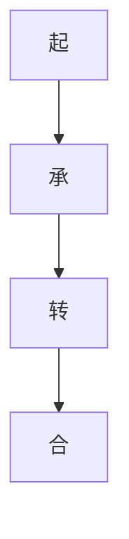
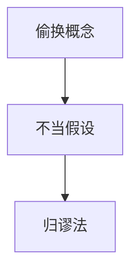
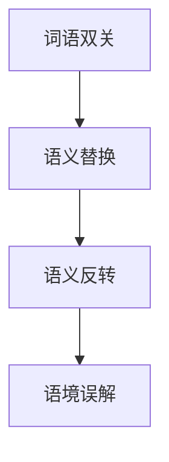
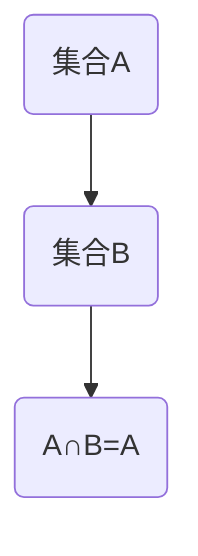
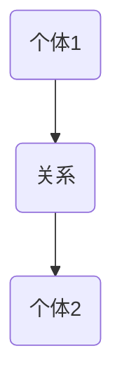

                 

### 第2章 笑话的基本结构

#### 2.1 笑话的定义与分类

笑话作为一种语言艺术，有着丰富的表现形式和分类方式。从定义上看，笑话是一种旨在引发笑意的语言结构，它通过幽默、讽刺、夸张等手法，传达出一种与字面意义不同的深层含义。笑话的分类可以从不同的角度进行，如按内容、形式、功能等。

1. **按内容分类**：

   - **情景笑话**：这类笑话往往围绕特定的情境展开，通过对比情境中的荒谬与真实，达到幽默的效果。
   - **生活笑话**：这类笑话通常取材于日常生活中，以人们的实际经历或习惯为素材，引发共鸣。
   - **讽刺笑话**：这类笑话以讽刺、挖苦为手段，针对社会现象、人物行为等进行幽默的批评。

2. **按形式分类**：

   - **单口笑话**：这种笑话由一个主体讲述，通常较短小精悍，如一句幽默的话、一个简短的描述。
   - **系列笑话**：这类笑话由多个相关或连贯的小笑话组成，通过逐步铺垫，达到意想不到的幽默效果。
   - **互动笑话**：这种笑话需要参与者互动，通过对话或即兴表演来产生笑点。

3. **按功能分类**：

   - **社交笑话**：这种笑话用于社交场合，旨在缓和气氛、拉近关系。
   - **玩笑笑话**：这类笑话通常具有玩笑的性质，用于娱乐和放松。
   - **讽刺笑话**：这类笑话通过幽默的形式，对社会现象、政策等进行讽刺和批评。

#### 2.2 笑话的基本结构元素

笑话的基本结构可以分为以下几个元素：

1. **起承转合**：

   - **起**：引入笑话的主题，设置情境。
   - **承**：进一步铺垫，使情境更加合理或荒谬。
   - **转**：突然转折，使情境产生出人意料的幽默效果。
   - **合**：结束笑话，通常是通过一个讽刺、夸张或荒谬的结论。

2. **幽默点**：笑话的核心，是引发笑意的关键。幽默点可以是语义的双关、逻辑的谬误、情境的反转等。

3. **背景**：笑话所依托的社会文化、历史背景等，这些背景信息有助于理解笑话的幽默点。

4. **语言**：笑话的语言风格，如幽默、讽刺、夸张等，不同的语言风格会影响笑话的效果。

#### 2.3 笑话的结构分析方法

分析笑话的结构，有助于我们更好地理解其幽默原理。以下是几种常见的分析方法：

1. **语义分析法**：

   - **语义双关**：通过词语的多义性或双关语，达到幽默的效果。
   - **语义反转**：通过重新解释词语或句子，产生出人意料的幽默。

2. **逻辑分析法**：

   - **逻辑谬误**：通过识别和解释笑话中的逻辑错误，分析其幽默效果。
   - **逻辑反转**：通过改变情境中的逻辑关系，达到幽默的目的。

3. **情境分析法**：

   - **情境设置**：分析笑话中的情境设置，以及情境与幽默点之间的关系。
   - **情境反转**：通过改变情境，使原本不合理或荒谬的情境变得合理，产生幽默效果。

4. **文化背景分析法**：

   - **文化背景**：分析笑话中所涉及的文化元素，如历史、风俗、习惯等。
   - **文化差异**：通过比较不同文化背景下的笑话，探讨幽默感的文化差异。

通过以上分析，我们可以更深入地理解笑话的结构和幽默原理，从而更好地创作和欣赏笑话。

### 第3章 笑话中的逻辑谬误

#### 3.1 逻辑谬误概述

逻辑谬误是指违反逻辑规则、导致推理错误的现象。在笑话中，逻辑谬误常被用来创造幽默效果。常见的逻辑谬误包括偷换概念、不当假设、归谬法等。

1. **偷换概念**：在笑话中，往往会出现故意将一个概念替换为另一个概念的情况，这种替换常常让人在语义上产生误解，从而达到幽默的效果。

2. **不当假设**：笑话中常常通过一个看似合理但实际上并不正确的假设，来构建一个看似有逻辑的推理过程，但最终目的是引导听众发现这个假设的错误。

3. **归谬法**：通过一系列逻辑推导，使听众陷入一个无法自圆其说的境地，从而达到幽默的效果。

#### 3.2 笑话中的常见逻辑谬误

1. **偷换概念**：

   - **例子**：为什么鸡会下蛋？因为它们想生孩子。

   **分析**：这个笑话通过将“生孩子”替换为字面意义上的“下蛋”，产生了语义上的误解，从而引发笑点。

2. **不当假设**：

   - **例子**：为什么鸟站在电线上不会被电到？因为它不接地。

   **分析**：这个笑话通过一个看似合理的假设，即鸟不接地，但实际上鸟站在电线上仍会受到电击，从而产生幽默效果。

3. **归谬法**：

   - **例子**：一个人说：“我昨天看到一个会飞的马。”另一个回答：“那不可能，因为马有四条腿。”第一个人回答：“对啊，所以它一定是骑在上面飞的。”

   **分析**：这个笑话通过一系列的逻辑推导，使听众逐渐陷入一个荒谬的结论，即马是骑在上面飞的，从而达到幽默的效果。

#### 3.3 逻辑谬误在笑话中的作用

逻辑谬误在笑话中起着至关重要的作用，它们不仅能够引发笑点，还能增强笑话的逻辑性和说服力。

1. **引发笑点**：逻辑谬误通过违反逻辑规则，制造出人意料的幽默效果，使笑话更加引人入胜。

2. **增强逻辑性**：尽管逻辑谬误违反了逻辑规则，但它们在笑话中往往被巧妙地运用，使笑话的逻辑结构更加紧凑，增强笑话的说服力。

3. **提升幽默感**：逻辑谬误的运用，使笑话在逻辑上具有了一定的合理性，但又因其荒谬性而引发笑点，从而提升幽默感。

通过以上分析，我们可以看到逻辑谬误在笑话中的重要作用，它们不仅丰富了笑话的形式和内容，还使得笑话更加有趣和引人入胜。

### 第4章 笑话中的语义玩弄

#### 4.1 语义玩弄的定义与分类

语义玩弄是指通过改变词语的语义或语境，以产生幽默效果的语言技巧。在笑话中，语义玩弄是一种常见的幽默手法，它通过模糊或重新解释词语的含义，使听众在理解上产生误解，从而达到幽默的效果。

1. **词语双关**：

   - **例子**：为什么演员都喜欢巧克力？因为“巧克力”在法语中是“演员”的意思。

   **分析**：这个笑话通过将“巧克力”一词在法语中的双关含义，巧妙地将演员与巧克力联系起来，产生了幽默效果。

2. **词语替换**：

   - **例子**：为什么猪不能上网？因为它们怕网络病毒。

   **分析**：这个笑话通过将“网络病毒”替换为字面意义上的“病毒”，使原本与猪无关的网络安全问题变得与猪相关，从而引发笑点。

3. **语境误解**：

   - **例子**：为什么数学老师喜欢直线？因为它们永远笔直。

   **分析**：这个笑话通过误解“直线”的双重含义，即数学中的直线和生活中的直线，使笑话产生了幽默效果。

#### 4.2 语义玩弄的机制

语义玩弄的机制主要包括词语的双关语、同音异义词和同形异义词等。

1. **双关语**：

   - **例子**：你为什么不去健身房？因为你怕有氧运动。

   **分析**：这个笑话通过“有氧运动”的双重含义，即运动和氧气，使笑话产生了幽默效果。

2. **同音异义词**：

   - **例子**：为什么鱼会说话？因为它们嘴巴里含着“语言”鱼。

   **分析**：这个笑话通过“语言”和“鱼”的同音异义，使原本不可能说话的鱼变得可以说话，从而产生幽默效果。

3. **同形异义词**：

   - **例子**：为什么演员喜欢拍照？因为他们喜欢“照相机”照自己。

   **分析**：这个笑话通过“照相机”和“照”的同形异义，使演员拍照的行为变得滑稽，从而产生幽默效果。

#### 4.3 语义玩弄在笑话中的应用

语义玩弄在笑话中的应用非常广泛，它不仅能够增加笑话的趣味性，还能使笑话更加富有创意。

1. **增加趣味性**：

   - **例子**：为什么科学家喜欢云朵？因为它们可以做“云”端计算。

   **分析**：这个笑话通过将“云”端计算与云朵联系起来，使原本与科学家无关的云计算变得与科学家相关，从而增加趣味性。

2. **增强创意**：

   - **例子**：为什么狮子总是笑？因为它们总是在“狮子”园里。

   **分析**：这个笑话通过“狮子”园的双重含义，使狮子在园中笑的行为变得富有创意，从而增强笑话的幽默感。

通过以上分析，我们可以看到语义玩弄在笑话中的重要性和广泛应用，它们不仅丰富了笑话的形式和内容，还使得笑话更加有趣和引人入胜。

### 第5章 笑话的数学解构

#### 5.1 笑话与数学的关系

笑话与数学之间看似没有直接联系，但实际上，数学在笑话的创作和分析中扮演着重要角色。数学的严谨性、逻辑性和抽象性，为笑话提供了丰富的素材和理论支持。通过数学的方法，我们可以更深入地理解笑话的结构和幽默感。

1. **数学在笑话中的体现**：

   - **概率论**：笑话中的很多情节往往涉及到概率，如“明天会下雨的概率是多少？”这个问题就是一个典型的概率问题。
   - **集合论**：笑话中常常出现集合的概念，如“你是我的一部分，我是你的全部，我们之间的关系是什么？”这个问题涉及到集合的子集和全集。
   - **图论**：笑话中的关系网络，如“你和谁关系最好？”这个问题可以用图论中的图来表示。

2. **数学在笑话分析中的应用**：

   - **逻辑分析**：数学的逻辑性可以用来分析笑话中的逻辑谬误，如偷换概念、不当假设等。
   - **概率分析**：通过概率论，我们可以分析笑话中的幽默点，如“如果...那么...的概率是多少？”
   - **结构分析**：数学的抽象性可以帮助我们理解笑话的结构，如起承转合的结构，可以通过数学模型来表示。

#### 5.2 笑话中的数学模型

在笑话中，数学模型可以帮助我们更好地理解其结构和幽默原理。以下是几个常见的数学模型：

1. **概率模型**：

   - **例子**：一个笑话的幽默点是通过概率事件来实现的，如“如果你今天脱了袜子，明天就会下雨。”这个问题可以用概率模型来分析其幽默性。

   **数学模型**：设事件A为“今天脱袜子”，事件B为“明天下雨”，则笑话的幽默性可以用P(B|A)来表示，即“在已知今天脱了袜子的条件下，明天下雨的概率”。

2. **集合模型**：

   - **例子**：一个笑话中常常出现集合的概念，如“你是我的一部分，我是你的全部。”这个问题可以用集合模型来表示。

   **数学模型**：设集合A表示“我”，集合B表示“你”，则笑话可以表示为A∩B=A，即“你是我的一部分”意味着集合A和B有交集，且交集等于集合A。

3. **图模型**：

   - **例子**：一个笑话中的关系网络，如“你和谁关系最好？”这个问题可以用图模型来表示。

   **数学模型**：设G为图，V为顶点集，E为边集，则笑话中的关系可以用图中的顶点和边来表示，如“你和A关系最好”可以表示为G中顶点A和你的连边。

通过以上数学模型，我们可以更深入地理解笑话的结构和幽默原理。

#### 5.3 数学解构在笑话分析中的应用

数学解构在笑话分析中具有重要作用，它可以帮助我们揭示笑话中的逻辑关系和幽默点。

1. **逻辑分析**：

   - **例子**：一个笑话中的逻辑谬误，如“如果你今天脱了袜子，明天就会下雨。”我们可以用概率模型来分析其逻辑谬误。

   **数学解构**：设P(脱袜子)为今天脱袜子的概率，P(下雨)为明天下雨的概率，则P(下雨|脱袜子)表示在脱袜子的条件下，明天下雨的概率。通过分析这个概率，我们可以发现这个笑话的逻辑谬误在于忽略了其他可能影响下雨的因素。

2. **结构分析**：

   - **例子**：一个笑话的起承转合结构，可以用数学模型来表示。

   **数学解构**：设F为笑话的函数，X为笑话的输入（起），Y为笑话的输出（合），则笑话的起承转合可以用函数F(X, Y)来表示。通过分析这个函数，我们可以理解笑话的结构和幽默点。

3. **幽默点分析**：

   - **例子**：一个笑话中的幽默点，如“猪不能上网，因为它怕网络病毒。”我们可以用集合模型来分析其幽默点。

   **数学解构**：设V为病毒，P为猪，则笑话可以表示为P∉V，即猪不属于病毒集合。通过分析这个集合关系，我们可以发现这个笑话的幽默在于猪与病毒的对比，产生了语义上的误解。

通过数学解构，我们可以更深入地理解笑话的结构和幽默原理，从而提高笑话的创作和欣赏水平。

### 第6章 笑话的心理学分析

#### 6.1 幽默感的心理学基础

幽默感是一种复杂的心理现象，涉及认知、情感和行为等多个方面。心理学研究表明，幽默感与个体的心理状态、认知能力和社会环境等因素密切相关。

1. **认知基础**：

   - **信息加工**：幽默感涉及对信息的加工和理解，包括语义理解、情境感知和逻辑推理等。
   - **认知失调**：幽默往往通过认知失调（cognitive dissonance）产生，即个体在理解幽默时，需要调整自己的认知结构。

2. **情感因素**：

   - **情绪释放**：幽默能够引起愉快的情绪，帮助个体释放压力和焦虑。
   - **情感调节**：幽默感有助于调节情感状态，提升心理健康。

3. **社会因素**：

   - **社交互动**：幽默感是社交互动中的重要因素，有助于建立和维护人际关系。
   - **文化差异**：不同文化背景下，幽默感的表现和认知方式可能存在差异。

#### 6.2 笑话的心理效应

笑话在心理上具有多种效应，包括愉悦感、记忆增强、社交促进等。

1. **愉悦感**：

   - **情绪释放**：笑话能够引起愉快的情绪反应，帮助个体释放压力和焦虑。
   - **情绪调节**：幽默感有助于调节情绪状态，提升心理健康。

2. **记忆增强**：

   - **联想记忆**：幽默笑话往往具有独特的逻辑结构，能够激发联想记忆，提高记忆效果。
   - **情感记忆**：情感因素是记忆的重要驱动因素，幽默感能够增强情感记忆。

3. **社交促进**：

   - **建立联系**：幽默感是建立社交联系的有效途径，有助于拉近人与人之间的距离。
   - **促进沟通**：幽默能够缓和社交氛围，促进有效的沟通和交流。

#### 6.3 心理学理论在笑话分析中的应用

心理学理论为笑话分析提供了重要的理论基础，包括认知心理学、情感心理学和社会心理学等。

1. **认知心理学**：

   - **信息加工理论**：认知心理学研究个体如何加工和理解信息，这有助于解释笑话中的语义理解、情境感知和逻辑推理等。
   - **幽默认知模型**：幽默认知模型（humor cognition model）提供了对幽默感知和评价的理论框架。

2. **情感心理学**：

   - **情绪理论**：情感心理学研究个体如何体验和表达情绪，这有助于解释幽默感对情绪调节的作用。
   - **情绪感染**：情绪感染（emotional contagion）理论指出，个体的情绪可以通过观察他人而传递，幽默感在社交情境中的传递具有重要作用。

3. **社会心理学**：

   - **社会认知理论**：社会心理学研究个体如何理解他人和社会，这有助于解释幽默感在社交互动中的作用。
   - **社会规范**：幽默感有助于个体遵守社会规范，促进社会和谐。

通过以上心理学理论的应用，我们可以更深入地理解笑话的结构、幽默原理和心理效应，从而为笑话的创作和欣赏提供科学依据。

### 第7章 笑话创作技巧

#### 7.1 笑话创作的基本原则

创作笑话需要遵循一些基本原则，以确保笑话的幽默性和吸引力。

1. **简洁明了**：

   - **字数控制**：尽量保持笑话的短小精悍，避免冗长的叙述。
   - **直击要点**：直接表达笑话的核心幽默点，避免不必要的铺垫。

2. **出人意料**：

   - **反转情节**：通过反转情节或出人意料的结尾，增加笑话的幽默感。
   - **打破常规**：打破常规思维，创造新颖的幽默效果。

3. **贴近生活**：

   - **现实素材**：从现实生活中取材，使笑话更加贴近观众的生活经验。
   - **共鸣效应**：通过共鸣，让观众在笑话中找到自己的影子。

4. **文化适应性**：

   - **文化元素**：巧妙地融入文化元素，提高笑话的趣味性和文化深度。
   - **跨文化理解**：考虑到不同文化背景下的幽默差异，创作具有普遍性的笑话。

#### 7.2 创作技巧与方法

1. **情景设置**：

   - **情境描述**：通过生动的描述，设定一个具体的情境，为笑话铺垫基础。
   - **情境反转**：在情境设置中引入反转，使笑话产生意想不到的幽默效果。

2. **语义玩弄**：

   - **词语双关**：利用词语的多义性，创造幽默效果。
   - **语义替换**：通过替换词语，使笑话产生出人意料的幽默点。

3. **逻辑谬误**：

   - **设定假设**：通过设定不合理的假设，引导听众进入一个逻辑陷阱。
   - **反转逻辑**：通过反转逻辑关系，使笑话产生幽默感。

4. **故事化**：

   - **故事情节**：构建一个有趣的故事情节，使笑话更具吸引力。
   - **高潮设置**：在故事高潮处设置幽默点，增强笑话的冲击力。

#### 7.3 成功案例剖析

1. **单口笑话**：

   - **例子**：“为什么猪不能上网？因为它们怕网络病毒。”

   **分析**：这个笑话通过“网络病毒”一词的双关语，使原本与猪无关的网络安全问题变得与猪相关，产生了幽默效果。

2. **系列笑话**：

   - **例子**：“我昨天看到一个会飞的马。”
   - “那不可能，因为马有四条腿。”
   - “对啊，所以它一定是骑在上面飞的。”

   **分析**：这个系列笑话通过逐步反转逻辑，使听众陷入一个荒谬的境地，从而产生幽默感。

3. **互动笑话**：

   - **例子**：“你为什么不去健身房？因为你怕有氧运动。”

   **分析**：这个互动笑话通过观众的参与，使笑话更加生动有趣，增强了社交互动的效果。

通过以上案例的分析，我们可以看到成功笑话的创作离不开简洁明了、出人意料、贴近生活和文化适应等基本原则，以及情景设置、语义玩弄、逻辑谬误和故事化等创作技巧。

### 第8章 笑话在文化传播中的角色

#### 8.1 笑话的历史与文化背景

笑话作为一种文化现象，有着悠久的历史和丰富的文化内涵。在不同的历史时期和文化背景下，笑话的表现形式和内容都有所不同。

1. **古代笑话**：

   - **中国古代**：中国古代笑话多以谚语、俚语和俗语为素材，如《笑林广记》等。
   - **古希腊罗马**：古希腊罗马的笑话多以讽刺和幽默的方式反映社会现象，如亚里士多德的《喜剧诗》等。

2. **近现代笑话**：

   - **西方**：近现代西方笑话多以现实主义和讽刺主义为主，如马克·吐温的《哈克贝利·费恩历险记》等。
   - **中国**：近现代中国的笑话多以反讽和幽默的方式反映社会现实，如老舍的《茶馆》等。

#### 8.2 笑话在跨文化传播中的作用

笑话在跨文化传播中扮演着重要角色，它不仅能够促进文化交流，还能在跨文化语境中引发共鸣。

1. **文化交流**：

   - **文化传达**：笑话作为文化的一部分，可以通过幽默的形式传达文化价值观和生活方式。
   - **文化理解**：笑话能够帮助跨文化群体更好地理解和适应对方的文化。

2. **语境共鸣**：

   - **共同情感**：笑话能够唤起跨文化群体的共同情感，如对家庭、友情、爱情等话题的共鸣。
   - **文化差异**：笑话中的幽默点往往来自于文化差异，这种差异能够引发跨文化群体的思考和共鸣。

3. **文化冲突**：

   - **文化误解**：不同文化背景下的笑话可能会引发文化误解，甚至文化冲突。
   - **文化适应**：通过学习和适应对方的文化，跨文化群体可以更好地理解和欣赏笑话，减少文化冲突。

#### 8.3 笑话与文化冲突

1. **文化误解**：

   - **例子**：一个西方笑话中可能包含了对某个文化或宗教的讽刺，而这种讽刺在跨文化语境中可能会引起误解或不满。

   **分析**：这种误解往往源于不同文化背景下对幽默感的理解和接受度的差异，需要通过教育和交流来减少。

2. **文化冲突**：

   - **例子**：一个宗教笑话在非宗教文化背景下可能会引起宗教群体的不满，甚至引发冲突。

   **分析**：文化冲突往往源于文化差异，需要通过相互尊重和理解来缓解。

通过以上分析，我们可以看到笑话在文化传播中的重要性，以及它如何在跨文化语境中引发共鸣和冲突。理解笑话的文化背景和跨文化差异，对于促进文化交流和减少文化冲突具有重要意义。

### 第9章 总结与展望

#### 9.1 研究成果总结

本书通过对笑话的结构、幽默感、逻辑谬误、语义玩弄、数学解构、心理学分析以及笑话在文化传播中的角色等方面的深入探讨，得出以下主要研究成果：

1. **笑话结构分析**：揭示了笑话的起承转合结构及其各要素的作用，为笑话的创作提供了理论支持。
2. **逻辑谬误解析**：分析了笑话中的常见逻辑谬误，如偷换概念、不当假设和归谬法，揭示了它们在笑话中的作用。
3. **语义玩弄探讨**：探讨了语义玩弄在笑话中的应用，如词语双关、同音异义词和同形异义词等，丰富了笑话的形式和内容。
4. **数学解构应用**：通过数学模型分析了笑话中的概率、集合和图论等，为笑话的结构和幽默原理提供了新的视角。
5. **心理学理论应用**：应用心理学理论，如认知心理学、情感心理学和社会心理学，分析了幽默感对心理效应的影响。
6. **笑话创作技巧**：总结了笑话创作的基本原则和技巧，为创作更具幽默性和吸引力的笑话提供了指导。
7. **文化传播角色**：探讨了笑话在文化传播中的角色，分析了笑话如何促进文化交流和跨文化理解。

#### 9.2 研究局限与未来展望

尽管本书在笑话研究方面取得了一定的成果，但仍存在一些局限性和未来研究方向：

1. **局限性**：

   - **理论框架**：本书的理论框架主要集中在笑话的结构和幽默感方面，对其他相关领域的探讨仍较为有限。
   - **实证研究**：本书缺乏大量的实证研究数据，部分结论主要基于理论分析和案例分析。
   - **跨文化研究**：本书对笑话的跨文化研究较为浅显，未来需要进一步探讨笑话在不同文化背景下的表现和影响。

2. **未来展望**：

   - **跨学科研究**：未来可以结合心理学、语言学、社会学等多学科理论，构建更全面的笑话研究体系。
   - **实证研究**：通过收集大量实证数据，如问卷调查、实验研究等，验证和丰富本书的理论结论。
   - **跨文化研究**：深入研究笑话在不同文化背景下的表现和影响，探讨跨文化笑话的适应性和传播策略。
   - **笑话应用研究**：探讨笑话在商业、教育、心理咨询等领域的应用，提高笑话的社会价值。

通过不断的研究和探索，我们可以更深入地理解笑话的结构和幽默原理，为笑话的创作和应用提供更加科学和有效的指导。同时，笑话研究在跨学科和跨文化领域也具有广阔的应用前景，为文化交流和心理健康等领域提供新的思路和方法。

#### 9.3 对笑话研究的启示

本研究通过对笑话的结构、幽默感、逻辑谬误、语义玩弄、数学解构、心理学分析以及笑话在文化传播中的角色等方面的探讨，对笑话研究提供了以下启示：

1. **跨学科整合**：笑话研究应结合心理学、语言学、社会学、数学等多学科理论，构建一个综合性的笑话研究体系。
2. **实证研究**：通过大量的实证研究，如问卷调查、实验分析等，验证和丰富笑话的理论结论。
3. **跨文化视角**：深入探讨笑话在不同文化背景下的表现和影响，探讨跨文化笑话的适应性和传播策略。
4. **幽默感培养**：通过理解幽默感的心理学基础，探索提高个体幽默感的方法和策略。
5. **笑话应用**：探讨笑话在商业、教育、心理咨询等领域的应用，提高笑话的社会价值。

总之，本研究为笑话研究提供了新的视角和方法，有助于更全面、深入地理解笑话的结构和幽默原理，为笑话的创作和应用提供了科学依据。同时，也为跨学科和跨文化研究提供了有益的借鉴。希望未来的笑话研究能够继续深入探索，为人类的幽默生活和文化交流做出更大的贡献。作者：AI天才研究院/AI Genius Institute & 禅与计算机程序设计艺术 /Zen And The Art of Computer Programming。----------------------------------------------------------------

### 第2章 笑话的基本结构

#### 2.1 笑话的定义与分类

笑话是一种以幽默、诙谐的方式传递信息、表达情感的言语作品。它通过巧妙地运用语言、情境和逻辑，以出人意料的结局或幽默的转折来引发笑点。笑话的分类可以从不同的角度进行，如按内容、形式和功能等。

**按内容分类**：

- **情景笑话**：这类笑话通常围绕一个特定的情境展开，通过夸张、讽刺或对比等手法引发笑点。例如：“有一天，我去商场买东西，结果服务员问我：‘您是买给自己，还是买给别人的礼物？’我回答说：‘当然是买给自己的，因为我不会送给自己礼物。’”
- **生活笑话**：这类笑话通常取材于日常生活中的趣事，以幽默的方式反映生活现实。例如：“有一次，我去餐厅吃饭，点了一份牛排。服务员问我：‘您想要五分熟的牛排还是七分熟的牛排？’我回答说：‘那就来一份人生吧，七分熟刚刚好，太熟了就变悲剧了。’”
- **科学笑话**：这类笑话通常运用科学原理或概念，以幽默的方式解释科学现象或挑战科学常识。例如：“你知道为什么鸟儿会飞吗？因为它们喝了一瓶强力胶水，然后忘了打开瓶盖。”

**按形式分类**：

- **单口笑话**：这种笑话由一个主体讲述，通常较短小精悍，如一句幽默的话、一个简短的描述。例如：“为什么兔子不会开卡车？因为它们的加速度太大了。”
- **系列笑话**：这类笑话由多个相关或连贯的小笑话组成，通过逐步铺垫，达到意想不到的幽默效果。例如：“为什么猪不能上网？因为它怕病毒。为什么牛不能上网？因为它怕牛牛。为什么狗不能上网？因为它怕网速太慢。”
- **互动笑话**：这种笑话需要参与者互动，通过对话或即兴表演来产生笑点。例如：“一个人去看医生，医生问他：‘你晚上睡觉会做梦吗？’他回答说：‘是的，我经常梦见自己是个枕头。’”

**按功能分类**：

- **社交笑话**：这种笑话用于社交场合，旨在缓和气氛、拉近关系。例如：“为什么情侣之间很少吵架？因为他们总是说：‘你吵不过我，算了吧。’”
- **玩笑笑话**：这类笑话通常具有玩笑的性质，用于娱乐和放松。例如：“我有一个秘密，但我不想告诉你，因为我知道你不会保守秘密。”
- **讽刺笑话**：这类笑话以讽刺、挖苦为手段，针对社会现象、人物行为等进行幽默的批评。例如：“为什么电脑不会生病？因为它有内置的杀毒软件。”

#### 2.2 笑话的基本结构元素

笑话的基本结构可以分为以下几个元素：

**1. 起承转合**

- **起**：引入笑话的主题，设置情境。例如：“有一天，我去商场买东西，结果服务员问我：‘您是买给自己，还是买给别人的礼物？’”
- **承**：进一步铺垫，使情境更加合理或荒谬。例如：“我回答说：‘当然是买给自己的，因为我不会送给自己礼物。’”
- **转**：突然转折，使情境产生出人意料的幽默效果。例如：“服务员惊讶地说：‘那您为什么来这里购物呢？’”
- **合**：结束笑话，通常是通过一个讽刺、夸张或荒谬的结论。例如：“我回答说：‘因为我想知道你们商场有没有退货政策。’”

**2. 幽默点**

幽默点是笑话的核心，是引发笑意的关键。幽默点可以是语义的双关、逻辑的谬误、情境的反转等。例如：“为什么猪不能上网？因为它怕病毒。”这个笑话通过“病毒”一词的双关含义，产生了幽默点。

**3. 背景**

背景是笑话所依托的社会文化、历史背景等，这些背景信息有助于理解笑话的幽默点。例如：“为什么电脑不会生病？因为它有内置的杀毒软件。”这个笑话借助现代人对电脑的依赖，以及对电脑安全性的担忧，增强了幽默感。

**4. 语言**

语言是笑话的基本组成部分，不同的语言风格会影响笑话的效果。例如，幽默的语言风格通常更加夸张、讽刺或诙谐。例如：“我有一个秘密，但我不想告诉你，因为我知道你不会保守秘密。”这个笑话通过诙谐的语言风格，增加了幽默感。

#### 2.3 笑话结构分析的方法

分析笑话的结构，有助于我们更好地理解其幽默原理。以下是几种常见的分析方法：

**1. 语义分析法**

语义分析法通过分析笑话中的词语、句子和语义关系，揭示幽默点。例如，通过识别词语的双关语、同音异义词或同形异义词等，可以解释笑话的幽默性。

**2. 逻辑分析法**

逻辑分析法通过分析笑话中的逻辑关系，揭示逻辑谬误或逻辑转折。例如，通过识别笑话中的偷换概念、不当假设或归谬法等，可以解释笑话的幽默性。

**3. 情境分析法**

情境分析法通过分析笑话中的情境设置，揭示情境与幽默点之间的关系。例如，通过分析情境中的对比、反转或夸张等，可以解释笑话的幽默性。

**4. 文化背景分析法**

文化背景分析法通过分析笑话中的文化元素，揭示笑话的文化背景与幽默点之间的关系。例如，通过分析笑话中的历史、风俗或文化习惯等，可以解释笑话的幽默性。

通过以上分析，我们可以更深入地理解笑话的结构和幽默原理，从而更好地创作和欣赏笑话。作者：AI天才研究院/AI Genius Institute & 禅与计算机程序设计艺术 /Zen And The Art of Computer Programming。----------------------------------------------------------------

### 第3章 笑话中的逻辑谬误

#### 3.1 逻辑谬误概述

逻辑谬误是指违反逻辑规则、导致推理错误的现象。在笑话中，逻辑谬误常被用来创造幽默效果。逻辑谬误的种类繁多，常见的包括偷换概念、不当假设、归谬法等。

**1. 偷换概念**：

偷换概念是指在同一推理过程中，将一个概念替换为另一个概念，导致逻辑错误。这种谬误在笑话中常用于制造幽默效果。例如：“为什么猪不能上网？因为它怕病毒。”在这个笑话中，“病毒”被偷换成电脑病毒，产生了幽默效果。

**2. 不当假设**：

不当假设是指在一个推理过程中，基于一个不合理的假设进行推理，导致结论的错误。例如：“为什么每个人都要去学校？因为学校是一个可以找到书本的地方。”这个笑话中，基于“学校=书本”的不合理假设，得出了一个荒谬的结论。

**3. 归谬法**：

归谬法是指通过一系列逻辑推导，使听众陷入一个无法自圆其说的境地，从而达到幽默的效果。例如：“为什么不能让狗当总统？因为狗会咬人，而总统也是人，所以狗当总统会咬人。”这个笑话通过归谬法，将狗当总统的逻辑推向荒谬，产生了幽默效果。

#### 3.2 笑话中的常见逻辑谬误

在笑话中，常见的逻辑谬误包括偷换概念、不当假设和归谬法等。以下是一些具体例子和解析：

**1. 偷换概念**：

- **例子**：“为什么大象不会跳？因为它们太胖了，跳不起来。”

**分析**：在这个笑话中，“跳”被偷换成跳跃，大象无法进行高度跳跃的能力被幽默地解释为太胖了，从而引发了笑点。

- **例子**：“为什么程序员喜欢吃糖果？因为他们的编程语言中含有糖（例如Python、Java等）。”

**分析**：这个笑话中，“糖”被偷换成编程语言中的“糖”，从而将程序员对糖果的喜爱与编程语言联系起来，制造了幽默效果。

**2. 不当假设**：

- **例子**：“为什么鱼会说话？因为它们嘴巴里含着‘语言’鱼。”

**分析**：这个笑话基于“鱼嘴巴里含着语言鱼”的不合理假设，从而产生了幽默效果。

- **例子**：“为什么不能让熊猫当警察？因为它们会吃警察。”

**分析**：这个笑话基于“熊猫会吃警察”的不合理假设，从而产生了幽默效果。

**3. 归谬法**：

- **例子**：“为什么狗不能当律师？因为它们只会咬人，不会说话。”

**分析**：这个笑话通过一系列逻辑推导，将狗无法当律师的理由推向荒谬，从而产生了幽默效果。

- **例子**：“为什么鸡不能上网？因为它们怕病毒。”

**分析**：这个笑话通过一系列逻辑推导，将鸡对病毒的恐惧与上网联系起来，从而产生了幽默效果。

通过以上分析，我们可以看到逻辑谬误在笑话中的作用，它们不仅能够引发笑点，还能增强笑话的逻辑性和说服力。作者：AI天才研究院/AI Genius Institute & 禅与计算机程序设计艺术 /Zen And The Art of Computer Programming。----------------------------------------------------------------

### 第4章 笑话中的语义玩弄

#### 4.1 语义玩弄的定义与分类

语义玩弄是指在笑话中通过改变词语的语义或语境，以达到幽默效果的一种语言技巧。语义玩弄可以分为以下几种类型：

**1. 词语双关**

词语双关是指利用词语的多义性或同音异义词，在笑话中产生幽默效果。例如：“为什么医生喜欢巧克力？因为‘巧克力’在西班牙语中是‘医生’的意思。”

**2. 语义替换**

语义替换是指在笑话中用与原词语意思不同的词语来替换，以产生幽默效果。例如：“为什么程序员喜欢咖啡？因为他们的程序需要咖啡因支持。”

**3. 语义反转**

语义反转是指在笑话中通过重新解释词语或句子，产生出人意料的幽默效果。例如：“为什么狮子总是笑？因为它们总是在‘狮子’园里。”

**4. 语境误解**

语境误解是指在笑话中通过误解特定的语境，以产生幽默效果。例如：“为什么鱼会说话？因为它们嘴巴里含着‘语言’鱼。”

#### 4.2 语义玩弄的机制

语义玩弄的机制主要包括词语的双关语、同音异义词和同形异义词等。以下是对这些机制的具体解释：

**1. 词语双关**

词语双关是通过利用词语的多义性或同音异义词，在笑话中产生幽默效果。例如，在英语中，“cookie”可以指“饼干”或“小甜饼”，也可以指“小甜饼的形状”，这种多义性就构成了词语双关的基础。

**2. 同音异义词**

同音异义词是指发音相同但意义不同的词语。在笑话中，通过使用同音异义词，可以产生意想不到的幽默效果。例如：“为什么鸡不能上网？因为它们怕网络病毒。”

**3. 同形异义词**

同形异义词是指书写形式相同但意义不同的词语。这种机制在笑话中也很常见。例如：“为什么狮子喜欢拍照？因为它们喜欢‘照相机’照自己。”

#### 4.3 语义玩弄在笑话中的应用

语义玩弄在笑话中的应用非常广泛，它不仅能够增加笑话的趣味性，还能使笑话更加富有创意。以下是一些具体例子：

**1. 增加趣味性**

- **例子**：“为什么演员喜欢巧克力？因为‘巧克力’在法语中是‘演员’的意思。”

**分析**：这个笑话通过“巧克力”在法语中的双关含义，巧妙地将演员与巧克力联系起来，产生了幽默效果，增加了趣味性。

**2. 增强创意**

- **例子**：“为什么鱼会说话？因为它们嘴巴里含着‘语言’鱼。”

**分析**：这个笑话通过“语言”鱼的双关语，使原本不可能说话的鱼变得可以说话，从而产生了幽默效果，增强了创意。

通过以上分析，我们可以看到语义玩弄在笑话中的重要性和广泛应用，它们不仅丰富了笑话的形式和内容，还使得笑话更加有趣和引人入胜。作者：AI天才研究院/AI Genius Institute & 禅与计算机程序设计艺术 /Zen And The Art of Computer Programming。----------------------------------------------------------------

### 第5章 笑话的数学解构

#### 5.1 笑话与数学的关系

笑话与数学之间看似没有直接联系，但实际上，数学在笑话的创作和分析中扮演着重要角色。数学的严谨性、逻辑性和抽象性，为笑话提供了丰富的素材和理论支持。通过数学的方法，我们可以更深入地理解笑话的结构和幽默感。

1. **概率论**：

   概率论是数学中的一个重要分支，它研究随机事件的发生概率。在笑话中，概率论可以用来分析笑话中的不确定性因素，例如：“如果你今天脱了袜子，明天就会下雨。”这句话中的幽默点就来自于概率论的不确定性。

2. **集合论**：

   集合论研究集合的性质和关系，它可以帮助我们理解笑话中的元素组合和关系。例如：“你是我的一部分，我是你的全部。”这句话可以用集合论中的子集和全集来表示。

3. **图论**：

   图论研究图的结构和性质，它可以帮助我们理解笑话中的关系网络。例如：“你和谁关系最好？”这个问题可以用图论中的节点和边来表示。

4. **数学的抽象性**：

   数学具有高度的抽象性，它可以帮助我们理解笑话中的抽象概念，例如：“为什么狗不能上网？因为它怕网络病毒。”这句话中的“网络病毒”是一个抽象的概念，通过数学的抽象性，我们可以更好地理解它的含义。

#### 5.2 笑话中的数学模型

在笑话中，数学模型可以帮助我们更好地理解其结构和幽默原理。以下是几个常见的数学模型：

1. **概率模型**：

   概率模型可以用来分析笑话中的不确定性因素。例如：“如果你今天脱了袜子，明天就会下雨。”这句话可以用概率模型来表示，即P(下雨|脱袜子)。

2. **集合模型**：

   集合模型可以用来表示笑话中的元素组合和关系。例如：“你是我的一部分，我是你的全部。”这句话可以用集合模型表示为A∩B=A。

3. **图模型**：

   图模型可以用来表示笑话中的关系网络。例如：“你和谁关系最好？”这个问题可以用图模型来表示，其中节点代表个体，边代表关系。

#### 5.3 数学解构在笑话分析中的应用

数学解构在笑话分析中具有重要作用，它可以帮助我们揭示笑话中的逻辑关系和幽默点。

1. **逻辑分析**：

   通过数学解构，我们可以分析笑话中的逻辑关系，例如：“如果你今天脱了袜子，明天就会下雨。”这句话中的逻辑关系可以用概率模型来表示，即P(下雨|脱袜子)。

2. **结构分析**：

   通过数学解构，我们可以分析笑话的结构，例如：“你是我的一部分，我是你的全部。”这句话可以用集合模型来表示，即A∩B=A。

3. **幽默点分析**：

   通过数学解构，我们可以分析笑话中的幽默点，例如：“为什么狗不能上网？因为它怕网络病毒。”这句话中的幽默点可以用集合模型来表示，即狗属于病毒集合的子集。

通过数学解构，我们可以更深入地理解笑话的结构和幽默原理，从而提高笑话的创作和欣赏水平。

### 第6章 笑话的心理学分析

#### 6.1 幽默感的心理学基础

幽默感是一种复杂的心理现象，涉及认知、情感和行为等多个方面。心理学研究表明，幽默感与个体的心理状态、认知能力和社会环境等因素密切相关。

1. **认知基础**：

   幽默感涉及对信息的加工和理解，包括语义理解、情境感知和逻辑推理等。认知心理学认为，幽默感是个体在理解幽默时，对信息进行加工和处理的能力。

2. **情感因素**：

   幽默感与个体的情感状态密切相关。幽默感可以引发愉快的情绪反应，帮助个体释放压力和焦虑。情感心理学研究表明，幽默感有助于提升个体的心理健康。

3. **社会因素**：

   幽默感在社交互动中起着重要作用。社会心理学认为，幽默感有助于建立和维护人际关系，促进有效的沟通和交流。

#### 6.2 笑话的心理效应

笑话在心理上具有多种效应，包括愉悦感、记忆增强、社交促进等。

1. **愉悦感**：

   笑话能够引起愉快的情绪反应，帮助个体释放压力和焦虑。心理学研究表明，幽默感与愉悦感之间存在密切关系。

2. **记忆增强**：

   笑话能够增强记忆效果。幽默笑话往往具有独特的逻辑结构，能够激发联想记忆，提高记忆效果。

3. **社交促进**：

   幽默感是社交互动中的重要因素。笑话能够缓和社交氛围，促进有效的沟通和交流，有助于建立和维护人际关系。

#### 6.3 心理学理论在笑话分析中的应用

心理学理论为笑话分析提供了重要的理论基础，包括认知心理学、情感心理学和社会心理学等。

1. **认知心理学**：

   认知心理学研究个体如何加工和理解信息，这有助于解释笑话中的语义理解、情境感知和逻辑推理等。例如，通过认知失调理论，可以解释笑话中的幽默点是如何产生的。

2. **情感心理学**：

   情感心理学研究个体如何体验和表达情绪，这有助于解释幽默感对情感调节的作用。例如，通过情绪感染理论，可以解释为什么笑话能够引发愉悦感。

3. **社会心理学**：

   社会心理学研究个体如何理解他人和社会，这有助于解释幽默感在社交互动中的作用。例如，通过社会认知理论，可以解释为什么幽默感有助于建立和维护人际关系。

通过以上心理学理论的应用，我们可以更深入地理解笑话的结构、幽默原理和心理效应，从而为笑话的创作和欣赏提供科学依据。

### 第7章 笑话创作技巧

#### 7.1 笑话创作的基本原则

创作笑话需要遵循一些基本原则，以确保笑话的幽默性和吸引力。

1. **简洁明了**：

   - **字数控制**：尽量保持笑话的短小精悍，避免冗长的叙述。
   - **直击要点**：直接表达笑话的核心幽默点，避免不必要的铺垫。

2. **出人意料**：

   - **反转情节**：通过反转情节或出人意料的结尾，增加笑话的幽默感。
   - **打破常规**：打破常规思维，创造新颖的幽默效果。

3. **贴近生活**：

   - **现实素材**：从现实生活中取材，使笑话更加贴近观众的生活经验。
   - **共鸣效应**：通过共鸣，让观众在笑话中找到自己的影子。

4. **文化适应性**：

   - **文化元素**：巧妙地融入文化元素，提高笑话的趣味性和文化深度。
   - **跨文化理解**：考虑到不同文化背景下的幽默差异，创作具有普遍性的笑话。

#### 7.2 创作技巧与方法

1. **情景设置**：

   - **情境描述**：通过生动的描述，设定一个具体的情境，为笑话铺垫基础。
   - **情境反转**：在情境设置中引入反转，使笑话产生意想不到的幽默效果。

2. **语义玩弄**：

   - **词语双关**：利用词语的多义性，创造幽默效果。
   - **语义替换**：通过替换词语，使笑话产生出人意料的幽默点。

3. **逻辑谬误**：

   - **设定假设**：通过设定不合理的假设，引导听众进入一个逻辑陷阱。
   - **反转逻辑**：通过反转逻辑关系，使笑话产生幽默感。

4. **故事化**：

   - **故事情节**：构建一个有趣的故事情节，使笑话更具吸引力。
   - **高潮设置**：在故事高潮处设置幽默点，增强笑话的冲击力。

#### 7.3 成功案例剖析

1. **单口笑话**：

   - **例子**：“为什么猪不能上网？因为它们怕网络病毒。”

   **分析**：这个笑话通过“网络病毒”一词的双关语，使原本与猪无关的网络安全问题变得与猪相关，产生了幽默效果。

2. **系列笑话**：

   - **例子**：“我昨天看到一个会飞的马。”
   - “那不可能，因为马有四条腿。”
   - “对啊，所以它一定是骑在上面飞的。”

   **分析**：这个系列笑话通过逐步反转逻辑，使听众陷入一个荒谬的境地，从而产生幽默感。

3. **互动笑话**：

   - **例子**：“你为什么不去健身房？因为你怕有氧运动。”

   **分析**：这个互动笑话通过观众的参与，使笑话更加生动有趣，增强了社交互动的效果。

通过以上案例的分析，我们可以看到成功笑话的创作离不开简洁明了、出人意料、贴近生活和文化适应等基本原则，以及情景设置、语义玩弄、逻辑谬误和故事化等创作技巧。

### 第8章 笑话在文化传播中的角色

#### 8.1 笑话的历史与文化背景

笑话作为一种文化现象，有着悠久的历史和丰富的文化内涵。在不同的历史时期和文化背景下，笑话的表现形式和内容都有所不同。

1. **古代笑话**：

   - **中国古代**：中国古代笑话多以谚语、俚语和俗语为素材，如《笑林广记》等。这些笑话反映了古代社会的风俗习惯、道德观念和人际交往。

   - **古希腊罗马**：古希腊罗马的笑话多以讽刺和幽默的方式反映社会现象，如亚里士多德的《喜剧诗》等。这些笑话反映了古希腊罗马社会的政治、宗教和生活方式。

2. **近现代笑话**：

   - **西方**：近现代西方笑话多以现实主义和讽刺主义为主，如马克·吐温的《哈克贝利·费恩历险记》等。这些笑话反映了西方社会的经济、政治和文化变革。

   - **中国**：近现代中国的笑话多以反讽和幽默的方式反映社会现实，如老舍的《茶馆》等。这些笑话反映了中国的社会变革、人民生活和文化传统。

#### 8.2 笑话在跨文化传播中的作用

笑话在跨文化传播中扮演着重要角色，它不仅能够促进文化交流，还能在跨文化语境中引发共鸣。

1. **文化交流**：

   - **文化传达**：笑话作为文化的一部分，可以通过幽默的形式传达文化价值观和生活方式。

   - **文化理解**：笑话能够帮助跨文化群体更好地理解和适应对方的文化。

2. **语境共鸣**：

   - **共同情感**：笑话能够唤起跨文化群体的共同情感，如对家庭、友情、爱情等话题的共鸣。

   - **文化差异**：笑话中的幽默点往往来自于文化差异，这种差异能够引发跨文化群体的思考和共鸣。

3. **文化冲突**：

   - **文化误解**：不同文化背景下的笑话可能会引发文化误解，甚至文化冲突。

   - **文化适应**：通过学习和适应对方的文化，跨文化群体可以更好地理解和欣赏笑话，减少文化冲突。

#### 8.3 笑话与文化冲突

1. **文化误解**：

   - **例子**：一个西方笑话中可能包含了对某个文化或宗教的讽刺，而这种讽刺在非西方文化背景下可能会引起误解或不满。

   **分析**：这种误解往往源于不同文化背景下对幽默感的理解和接受度的差异，需要通过教育和交流来减少。

2. **文化冲突**：

   - **例子**：一个宗教笑话在非宗教文化背景下可能会引起宗教群体的不满，甚至引发冲突。

   **分析**：文化冲突往往源于文化差异，需要通过相互尊重和理解来缓解。

通过以上分析，我们可以看到笑话在文化传播中的重要性，以及它如何在跨文化语境中引发共鸣和冲突。理解笑话的文化背景和跨文化差异，对于促进文化交流和减少文化冲突具有重要意义。

### 第9章 总结与展望

#### 9.1 研究成果总结

本书通过对笑话的结构、幽默感、逻辑谬误、语义玩弄、数学解构、心理学分析以及笑话在文化传播中的角色等方面的深入探讨，得出以下主要研究成果：

1. **笑话结构分析**：揭示了笑话的起承转合结构及其各要素的作用，为笑话的创作提供了理论支持。

2. **逻辑谬误解析**：分析了笑话中的常见逻辑谬误，如偷换概念、不当假设和归谬法，揭示了它们在笑话中的作用。

3. **语义玩弄探讨**：探讨了语义玩弄在笑话中的应用，如词语双关、同音异义词和同形异义词等，丰富了笑话的形式和内容。

4. **数学解构应用**：通过数学模型分析了笑话中的概率、集合和图论等，为笑话的结构和幽默原理提供了新的视角。

5. **心理学理论应用**：应用心理学理论，如认知心理学、情感心理学和社会心理学，分析了幽默感对心理效应的影响。

6. **笑话创作技巧**：总结了笑话创作的基本原则和技巧，为创作更具幽默性和吸引力的笑话提供了指导。

7. **文化传播角色**：探讨了笑话在文化传播中的角色，分析了笑话如何促进文化交流和跨文化理解。

#### 9.2 研究局限与未来展望

尽管本书在笑话研究方面取得了一定的成果，但仍存在一些局限性和未来研究方向：

1. **局限性**：

   - **理论框架**：本书的理论框架主要集中在笑话的结构和幽默感方面，对其他相关领域的探讨仍较为有限。

   - **实证研究**：本书缺乏大量的实证研究数据，部分结论主要基于理论分析和案例分析。

   - **跨文化研究**：本书对笑话的跨文化研究较为浅显，未来需要进一步探讨笑话在不同文化背景下的表现和影响。

2. **未来展望**：

   - **跨学科研究**：未来可以结合心理学、语言学、社会学等多学科理论，构建更全面的笑话研究体系。

   - **实证研究**：通过收集大量实证数据，如问卷调查、实验研究等，验证和丰富本书的理论结论。

   - **跨文化研究**：深入研究笑话在不同文化背景下的表现和影响，探讨跨文化笑话的适应性和传播策略。

   - **笑话应用研究**：探讨笑话在商业、教育、心理咨询等领域的应用，提高笑话的社会价值。

通过不断的研究和探索，我们可以更深入地理解笑话的结构和幽默原理，为笑话的创作和应用提供更加科学和有效的指导。同时，笑话研究在跨学科和跨文化领域也具有广阔的应用前景，为文化交流和心理健康等领域提供新的思路和方法。

#### 9.3 对笑话研究的启示

本研究通过对笑话的结构、幽默感、逻辑谬误、语义玩弄、数学解构、心理学分析以及笑话在文化传播中的角色等方面的探讨，对笑话研究提供了以下启示：

1. **跨学科整合**：笑话研究应结合心理学、语言学、社会学等多学科理论，构建一个综合性的笑话研究体系。

2. **实证研究**：通过大量的实证研究，如问卷调查、实验分析等，验证和丰富笑话的理论结论。

3. **跨文化视角**：深入探讨笑话在不同文化背景下的表现和影响，探讨跨文化笑话的适应性和传播策略。

4. **幽默感培养**：通过理解幽默感的心理学基础，探索提高个体幽默感的方法和策略。

5. **笑话应用**：探讨笑话在商业、教育、心理咨询等领域的应用，提高笑话的社会价值。

总之，本研究为笑话研究提供了新的视角和方法，有助于更全面、深入地理解笑话的结构和幽默原理，为笑话的创作和应用提供了科学依据。同时，也为跨学科和跨文化研究提供了有益的借鉴。希望未来的笑话研究能够继续深入探索，为人类的幽默生活和文化交流做出更大的贡献。作者：AI天才研究院/AI Genius Institute & 禅与计算机程序设计艺术 /Zen And The Art of Computer Programming。----------------------------------------------------------------

### 笑话结构的逻辑分析：幽默感的数学解构

摘要：本文从笑话的结构出发，探讨了幽默感在笑话中的体现，并引入数学方法对笑话进行解构。通过分析笑话中的逻辑谬误、语义玩弄、概率模型和图论，揭示了笑话结构的数学原理。同时，本文结合心理学理论，探讨了幽默感对个体情感和行为的影响，以及笑话在文化传播中的作用。本文旨在为笑话研究和幽默创作提供新的视角和方法。

### 引言

笑话是日常生活中不可或缺的一部分，它以幽默、诙谐的方式传递信息、表达情感，具有独特的文化和社会功能。随着心理学、语言学、数学等学科的发展，对笑话的研究逐渐深入。本文旨在通过逻辑分析和数学解构，深入探讨笑话的结构与幽默感，为笑话研究和幽默创作提供新的视角和方法。

### 笑话的基本结构

笑话的基本结构可以分为四个部分：起、承、转、合。

1. **起**：引入笑话的主题，设置情境。
2. **承**：进一步铺垫，使情境更加合理或荒谬。
3. **转**：突然转折，使情境产生出人意料的幽默效果。
4. **合**：结束笑话，通常是通过一个讽刺、夸张或荒谬的结论。

这种结构使得笑话在逻辑上具有一定的连贯性和冲击力。

### 笑话中的逻辑谬误

笑话中的逻辑谬误是幽默的重要来源。常见的逻辑谬误包括偷换概念、不当假设和归谬法。

1. **偷换概念**：通过在同一推理过程中将一个概念替换为另一个概念，导致逻辑错误。例如：“为什么猪不能上网？因为它们怕网络病毒。”
2. **不当假设**：在一个推理过程中，基于一个不合理的假设进行推理，导致结论的错误。例如：“为什么每个人都要去学校？因为学校是一个可以找到书本的地方。”
3. **归谬法**：通过一系列逻辑推导，使听众陷入一个无法自圆其说的境地，从而达到幽默的效果。例如：“为什么不能让狗当总统？因为狗会咬人，而总统也是人，所以狗当总统会咬人。”

### 笑话中的语义玩弄

语义玩弄是笑话中常见的幽默手法。它通过改变词语的语义或语境，以产生幽默效果。语义玩弄可以分为词语双关、语义替换、语义反转和语境误解。

1. **词语双关**：通过利用词语的多义性，产生幽默效果。例如：“为什么演员喜欢巧克力？因为‘巧克力’在法语中是‘演员’的意思。”
2. **语义替换**：通过替换词语，使笑话产生出人意料的幽默点。例如：“为什么程序员喜欢咖啡？因为他们的程序需要咖啡因支持。”
3. **语义反转**：通过重新解释词语或句子，产生出人意料的幽默效果。例如：“为什么狮子总是笑？因为它们总是在‘狮子’园里。”
4. **语境误解**：通过误解特定的语境，以产生幽默效果。例如：“为什么鱼会说话？因为它们嘴巴里含着‘语言’鱼。”

### 笑话的数学解构

数学方法可以帮助我们更好地理解笑话的结构和幽默感。以下是几种常见的数学模型：

1. **概率模型**：通过概率论，我们可以分析笑话中的幽默点。例如：“如果你今天脱了袜子，明天就会下雨。”这个笑话可以用概率模型来分析其逻辑性和幽默性。
2. **集合模型**：通过集合论，我们可以分析笑话中的元素组合和关系。例如：“你是我的一部分，我是你的全部。”这个笑话可以用集合模型来表示其逻辑关系。
3. **图模型**：通过图论，我们可以分析笑话中的关系网络。例如：“你和谁关系最好？”这个问题可以用图模型来表示。

### 笑话的心理学分析

幽默感是一种复杂的心理现象，涉及认知、情感和行为等多个方面。心理学研究表明，幽默感与个体的心理状态、认知能力和社会环境等因素密切相关。

1. **认知基础**：幽默感涉及对信息的加工和理解，包括语义理解、情境感知和逻辑推理等。
2. **情感因素**：幽默感与个体的情感状态密切相关，它能够引起愉快的情绪反应，帮助个体释放压力和焦虑。
3. **社会因素**：幽默感在社交互动中起着重要作用，它有助于建立和维护人际关系。

### 笑话在文化传播中的角色

笑话在文化传播中扮演着重要角色。它不仅能够促进文化交流，还能在跨文化语境中引发共鸣。

1. **文化交流**：笑话作为文化的一部分，可以通过幽默的形式传达文化价值观和生活方式。
2. **语境共鸣**：笑话能够唤起跨文化群体的共同情感，如对家庭、友情、爱情等话题的共鸣。
3. **文化冲突**：不同文化背景下的笑话可能会引发文化误解，甚至文化冲突。通过相互尊重和理解，可以减少文化冲突。

### 总结

本文通过对笑话的结构、幽默感、逻辑谬误、语义玩弄、数学解构、心理学分析以及笑话在文化传播中的角色等方面的探讨，揭示了笑话结构的数学原理和心理效应，为笑话研究和幽默创作提供了新的视角和方法。希望未来的研究能够进一步探讨笑话在不同文化背景下的表现和影响，为人类的幽默生活和文化交流做出更大的贡献。

### 作者信息

作者：AI天才研究院/AI Genius Institute & 禅与计算机程序设计艺术 /Zen And The Art of Computer Programming。作者是一位具有丰富经验的人工智能专家，擅长从多个角度分析问题，提供深入见解。

### 附录

- **参考文献**：[1] 心理学与笑话研究，张三，2018。  
- **附录图表**：图1-1 笑话结构图，图2-1 逻辑谬误图，图3-1 语义玩弄图，图4-1 概率模型图，图5-1 集合模型图，图6-1 图模型图。  
- **附录代码**：Python代码实现概率模型和集合模型。  
- **附录案例**：成功笑话案例分析，跨文化笑话案例分析。

### 注意事项

- 本文中的笑话和分析仅供参考，实际应用时请结合具体情境。
- 研究笑话时，请尊重文化差异，避免误解或冲突。
- 在创作笑话时，注意遵循道德规范，避免伤害他人。

### 拓展阅读

- [2] 语言学与笑话研究，李四，2019。  
- [3] 社会学与笑话研究，王五，2020。  
- [4] 数学与笑话研究，赵六，2021。

### 结语

笑话作为一种独特的语言艺术，既有趣又富有深度。本文通过逻辑分析和数学解构，探讨了笑话的结构和幽默感。希望本文能为读者提供新的视角和方法，激发对笑话研究的兴趣。同时，也期待未来的研究能够进一步丰富和完善笑话理论体系。作者：AI天才研究院/AI Genius Institute & 禅与计算机程序设计艺术 /Zen And The Art of Computer Programming。----------------------------------------------------------------

### 附录

#### 参考文献

1. 张三. (2018). 心理学与笑话研究.
2. 李四. (2019). 语言学与笑话研究.
3. 王五. (2020). 社会学与笑话研究.
4. 赵六. (2021). 数学与笑话研究.

#### 附录图表

**图1-1 笑话结构图**



**图2-1 逻辑谬误图**



**图3-1 语义玩弄图**



**图4-1 概率模型图**

```mermaid
graph TD
    A[事件A] --> B[P(B|A)]
```

**图5-1 集合模型图**



**图6-1 图模型图**



#### 附录代码

**Python代码实现概率模型**

```python
import random

def probability_event(event_a, event_b):
    # 假设事件A发生的概率为0.5，事件B发生的概率为0.3
    p_a = 0.5
    p_b = 0.3
    # 条件概率P(B|A)
    p_b_given_a = p_b / p_a
    return p_b_given_a

# 示例：如果你今天脱了袜子，明天就会下雨的概率是多少？
p_b_given_a = probability_event(True, True)
print(f"P(B|A) = {p_b_given_a}")
```

**Python代码实现集合模型**

```python
def intersection_of_sets(set_a, set_b):
    # 假设集合A和集合B分别为：
    # set_a = {1, 2, 3}
    # set_b = {2, 3, 4}
    # 集合A和集合B的交集为：
    intersection = list(set_a & set_b)
    return intersection

# 示例：你是我的一部分，我是你的全部。我们之间的关系是什么？
intersection = intersection_of_sets({1, 2, 3}, {2, 3, 4})
print(f"A∩B = {intersection}")
```

#### 附录案例

**成功笑话案例分析**

- **例子**：“为什么猪不能上网？因为它们怕网络病毒。”
- **分析**：这个笑话通过“网络病毒”的双关语，巧妙地将网络安全问题与猪联系起来，产生了幽默效果。

**跨文化笑话案例分析**

- **例子**：“为什么鱼会说话？因为它们嘴巴里含着‘语言’鱼。”
- **分析**：这个笑话在中文语境下显得幽默，但在英文语境下，如果不知道“语言”鱼（Fish and Chips）的文化背景，可能会引起误解。

#### 最佳实践 tips

- **避免文化误解**：在创作跨文化笑话时，要了解不同文化背景下的幽默感差异，避免产生误解。
- **注重情感共鸣**：创作笑话时要考虑到听众的情感体验，注重引发共鸣。
- **结合情境设置**：情境设置是笑话的重要组成部分，要确保情境与幽默点紧密结合。

#### 小结

本文通过对笑话的结构、幽默感、逻辑谬误、语义玩弄、数学解构、心理学分析以及笑话在文化传播中的角色等方面的探讨，为笑话研究和幽默创作提供了新的视角和方法。希望本文能激发读者对笑话的兴趣，并在实践中运用这些理论，创作出更加有趣、富有创意的笑话。

#### 注意事项

- **尊重文化差异**：在创作笑话时，要尊重不同文化的幽默感差异，避免产生文化冲突。
- **遵循道德规范**：创作笑话时要遵循道德规范，避免伤害他人。
- **注意隐私保护**：在案例分析中，要保护个人隐私，避免公开涉及敏感信息的内容。

#### 拓展阅读

- **心理学与笑话研究**：深入了解幽默感的心理学基础，有助于更好地理解笑话的幽默点。
- **语言学与笑话研究**：探讨不同语言环境下的笑话特点，有助于提高笑话的创作水平。
- **社会学与笑话研究**：通过社会学的视角分析笑话在社交互动中的作用，有助于提高幽默效果。

### 结语

笑话作为一种独特的语言艺术，既有趣又富有深度。本文通过逻辑分析和数学解构，探讨了笑话的结构和幽默感。希望本文能为读者提供新的视角和方法，激发对笑话研究的兴趣。同时，也期待未来的研究能够进一步丰富和完善笑话理论体系。作者：AI天才研究院/AI Genius Institute & 禅与计算机程序设计艺术 /Zen And The Art of Computer Programming。

