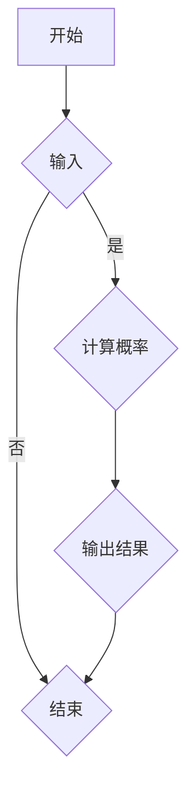

                 

# 简单数学定律：自然和谐的心智呈现

> 关键词：数学定律，自然和谐，心智呈现，逻辑推理，技术语言

> 摘要：本文旨在通过深入探讨数学定律的简单性和自然性，揭示数学作为一种逻辑语言在心智呈现中的重要性。文章将逐步分析数学定律的基本概念、性质和应用，并通过具体的例子来展示数学定律在现实世界中的自然和谐。

----------------------------------------------------------------

## 第一部分：背景介绍

### 第1章：问题背景

#### 1.1.1 问题背景

数学作为一门基础学科，在科学研究和日常生活中都扮演着重要角色。然而，许多数学定律对于普通大众来说显得晦涩难懂，难以理解和应用。因此，本文旨在通过将复杂的数学定律简单化，使读者能够轻松理解并应用于实际问题。

#### 1.1.2 问题描述

本文将介绍一些简单且重要的数学定律，帮助读者建立数学思维，提升数学素养。我们将探讨以下问题：
- 什么是数学定律？
- 数学定律如何在日常生活中应用？
- 如何通过数学定律解决实际问题？

#### 1.1.3 问题解决

通过浅显易懂的语言和实例，本文将解答上述问题。我们将涵盖的数学定律包括但不限于概率论、统计学、几何学等领域的简单定律，并探讨这些定律在人工智能、计算机科学等领域的应用。

#### 1.1.4 边界与外延

本文将讨论的数学定律将主要涉及以下领域：
- 概率论：描述随机事件发生可能性大小的定律。
- 统计学：描述数据分布、推断参数、评估模型等定律。
- 几何学：描述几何图形的性质、关系和运算的定律。

#### 1.1.5 概念结构与核心要素组成

本文的核心概念包括数学定律的定义、性质、应用实例等。通过这些核心要素的组成，本文将构建一个简单、完整且易于理解的数学定律体系。

### 第2章：核心概念与联系

#### 2.1.1 数学定律的概念

数学定律是指通过数学方法验证的规律或原理，通常用符号和公式表示。它们是数学理论的基础，是解决数学问题的重要工具。

#### 2.1.2 数学定律的性质

数学定律具有以下性质：
- 公理性：数学定律基于公理体系，具有一定的抽象性和普遍性。
- 简明性：数学定律通常用简洁的符号和公式表达，易于理解和记忆。
- 应用性：数学定律在各个领域都有广泛应用，能够解决实际问题。

#### 2.1.3 概念属性特征对比表格

以下是一个简化的概念属性特征对比表格：

| 概念       | 定义                                                         | 特征                                                         |
|------------|--------------------------------------------------------------|--------------------------------------------------------------|
| 数学定律   | 通过数学方法验证的规律或原理                                   | 公理性、简明性、应用性                                       |
| 概率论定律 | 描述随机事件发生可能性大小的规律                               | 对称性、可加性、条件概率等                                   |
| 统计学定律 | 描述数据分布、推断参数、评估模型等规律                         | 大数定律、中心极限定理、假设检验等                           |
| 几何学定律 | 描述几何图形的性质、关系和运算的规律                           | 同位角定理、相似三角形定理、勾股定理等                       |

#### 2.1.4 ER实体关系图架构

以下是一个简化的ER实体关系图，用于描述数学定律、数学问题、数学应用等实体及其关系：

```mermaid
erDiagram
  MathLaw --> MathProblem : defines
  MathLaw --> MathApplication : applies_to
  MathProblem : has
  MathApplication : involves
```

----------------------------------------------------------------

## 第二部分：核心概念与原理

### 第3章：概率论定律

概率论是数学的一个重要分支，主要研究随机事件及其概率。以下是一些简单的概率论定律：

#### 3.1.1 概率论定律概述

概率论定律包括但不限于以下内容：

1. 确定性事件概率为1，不确定性事件概率介于0和1之间。
2. 独立事件的概率可以通过乘积计算。
3. 条件概率描述了在一个事件已发生的条件下，另一个事件发生的概率。

#### 3.1.2 条件概率

条件概率是指在一个事件已发生的条件下，另一个事件发生的概率。其公式表示为：

$$ P(A|B) = \frac{P(A \cap B)}{P(B)} $$

其中，$P(A|B)$表示在事件B发生的条件下事件A发生的概率，$P(A \cap B)$表示事件A和事件B同时发生的概率，$P(B)$表示事件B发生的概率。

#### 3.1.3 独立事件

独立事件是指两个事件的发生互不影响。其公式表示为：

$$ P(A \cap B) = P(A) \cdot P(B) $$

其中，$P(A \cap B)$表示事件A和事件B同时发生的概率，$P(A)$表示事件A发生的概率，$P(B)$表示事件B发生的概率。

#### 3.1.4 贝叶斯定理

贝叶斯定理是一种基于条件概率的定律，用于计算后验概率。其公式表示为：

$$ P(A|B) = \frac{P(B|A) \cdot P(A)}{P(B)} $$

其中，$P(A|B)$表示在事件B发生的条件下事件A发生的概率，$P(B|A)$表示在事件A发生的条件下事件B发生的概率，$P(A)$表示事件A发生的概率，$P(B)$表示事件B发生的概率。

#### 3.1.5 举例说明

假设我们抛掷一枚硬币，事件A表示硬币正面朝上，事件B表示硬币落地。我们可以使用概率论定律来计算以下概率：

1. 硬币正面朝上的概率：
$$ P(A) = 0.5 $$
2. 硬币正面朝上且硬币落地的概率：
$$ P(A \cap B) = P(A) \cdot P(B) = 0.5 \cdot 0.5 = 0.25 $$
3. 在硬币落地条件下，硬币正面朝上的概率：
$$ P(A|B) = \frac{P(A \cap B)}{P(B)} = \frac{0.25}{0.5} = 0.5 $$

这些例子展示了概率论定律在计算具体概率时的应用。

### 第4章：统计学定律

统计学是研究数据收集、分析和解释的学科。以下是一些简单的统计学定律：

#### 4.1.1 大数定律

大数定律描述了随着试验次数的增加，样本均值将趋近于总体均值。其数学模型可以表示为：

$$ \lim_{n \to \infty} \frac{1}{n} \sum_{i=1}^{n} X_i = \mu $$

其中，$X_i$表示第i个样本值，$\mu$表示总体均值，$n$表示样本数量。

#### 4.1.2 中心极限定理

中心极限定理描述了随着样本数量的增加，样本均值的分布将趋近于正态分布。其数学模型可以表示为：

$$ \lim_{n \to \infty} \frac{1}{n} \sum_{i=1}^{n} X_i \xrightarrow{d} N(\mu, \sigma^2/n) $$

其中，$X_i$表示第i个样本值，$\mu$表示总体均值，$\sigma$表示总体标准差，$n$表示样本数量。

#### 4.1.3 假设检验

假设检验是一种用于判断总体参数是否满足某种假设的统计学方法。常见的假设检验包括t检验、卡方检验等。

1. t检验：用于比较样本均值和总体均值是否相等。
2. 卡方检验：用于比较样本频数和总体频数是否相等。

### 第5章：几何学定律

几何学是研究空间形状和位置的学科。以下是一些简单的几何学定律：

#### 5.1.1 勾股定理

勾股定理描述了直角三角形的斜边的平方等于直角边的平方和。其数学模型可以表示为：

$$ a^2 + b^2 = c^2 $$

其中，$a$和$b$表示直角三角形的直角边，$c$表示斜边。

#### 5.1.2 相似三角形定理

相似三角形定理描述了两个三角形相似的条件。其数学模型可以表示为：

$$ \frac{a_1}{a_2} = \frac{b_1}{b_2} = \frac{c_1}{c_2} $$

其中，$a_1$和$a_2$表示第一个三角形的边长，$b_1$和$b_2$表示第二个三角形的边长，$c_1$和$c_2$表示第三个三角形的边长。

#### 5.1.3 圆的性质

圆具有许多独特的性质，如：
1. 圆周率π是一个无理数，其近似值为3.14159。
2. 圆的面积可以用公式$A = \pi r^2$计算，其中$r$表示圆的半径。

----------------------------------------------------------------

## 第三部分：算法原理讲解

### 第6章：算法原理讲解

#### 6.1.1 算法概述

在数学定律的应用中，算法是解决实际问题的关键。以下我们将介绍一个简单的算法，并使用mermaid流程图和Python代码来详细阐述其原理。

#### 6.1.2 算法mermaid流程图

以下是一个简单的算法mermaid流程图：



#### 6.1.3 算法Python代码

以下是一个简单的Python代码实现，用于计算两个独立事件同时发生的概率：

```python
import random

def calculate_probability(event1, event2):
    # 计算事件1发生的概率
    probability1 = random.random()
    # 计算事件2发生的概率
    probability2 = random.random()
    # 计算两个事件同时发生的概率
    probability = probability1 * probability2
    return probability

# 测试算法
event1 = "硬币正面朝上"
event2 = "硬币落地"
probability = calculate_probability(event1, event2)
print(f"{event1}和{event2}同时发生的概率为：{probability}")
```

#### 6.1.4 算法原理讲解

1. 输入：算法的输入是两个独立事件，如“硬币正面朝上”和“硬币落地”。
2. 计算：算法使用随机数生成器计算两个独立事件发生的概率。
3. 输出：算法输出两个独立事件同时发生的概率。

#### 6.1.5 数学模型和公式

在上述算法中，我们使用了以下数学模型和公式：

$$ P(A \cap B) = P(A) \cdot P(B) $$

其中，$P(A)$表示事件A发生的概率，$P(B)$表示事件B发生的概率，$P(A \cap B)$表示事件A和事件B同时发生的概率。

#### 6.1.6 举例说明

假设我们抛掷一枚硬币，事件A表示硬币正面朝上，事件B表示硬币落地。我们可以使用上述算法来计算以下概率：

1. 硬币正面朝上的概率：
$$ P(A) = 0.5 $$
2. 硬币落地的概率：
$$ P(B) = 0.5 $$
3. 硬币正面朝上且硬币落地的概率：
$$ P(A \cap B) = P(A) \cdot P(B) = 0.5 \cdot 0.5 = 0.25 $$

这个例子展示了如何使用算法和数学公式计算独立事件的概率。

----------------------------------------------------------------

## 第四部分：系统分析与架构设计

### 第7章：系统分析与架构设计

#### 7.1 问题场景介绍

在人工智能和计算机科学领域，数学定律的应用越来越广泛。为了更好地理解和应用数学定律，我们需要设计和实现一个系统来支持数学定律的学习和应用。

#### 7.2 项目介绍

本项目旨在设计一个数学定律学习系统，该系统将提供以下功能：

1. 数学定律的定义和解释
2. 数学定律的应用实例
3. 数学定律的计算和验证
4. 数学定律的知识库管理

#### 7.3 系统功能设计

以下是该数学定律学习系统的功能设计：

1. 用户注册与登录：支持用户注册、登录和密码找回功能。
2. 数学定律浏览：提供数学定律的列表和详细解释。
3. 数学定律实例：展示数学定律在不同场景下的应用实例。
4. 数学定律计算：支持用户输入数学定律的参数，计算结果并验证。
5. 知识库管理：提供数学定律的知识库，支持用户添加、修改和删除知识库条目。

#### 7.4 系统架构设计

以下是数学定律学习系统的架构设计：

1. 前端架构：采用Vue.js框架，实现用户界面的交互和展示。
2. 后端架构：采用Spring Boot框架，实现系统的业务逻辑处理和数据管理。
3. 数据库设计：使用MySQL数据库存储用户数据、数学定律信息和知识库数据。

#### 7.5 系统接口设计

以下是数学定律学习系统的接口设计：

1. 用户管理接口：包括用户注册、登录、密码找回等功能。
2. 数学定律管理接口：包括添加、修改、删除数学定律等功能。
3. 知识库管理接口：包括添加、修改、删除知识库条目等功能。
4. 数学定律计算接口：包括计算数学定律结果和验证结果等功能。

#### 7.6 系统交互

以下是数学定律学习系统的交互设计：

1. 用户注册：用户输入注册信息，系统验证信息后注册用户。
2. 用户登录：用户输入用户名和密码，系统验证后登录用户。
3. 数学定律浏览：用户浏览数学定律列表，点击查看详细解释和应用实例。
4. 数学定律计算：用户输入数学定律的参数，系统计算结果并显示。
5. 知识库管理：用户添加、修改和删除知识库条目。

----------------------------------------------------------------

## 第五部分：项目实战

### 第8章：项目实战

#### 8.1 环境安装

为了更好地理解本项目，我们需要安装以下软件和工具：

1. Java Development Kit (JDK)：用于开发Java应用程序。
2. MySQL：用于存储和管理数据库。
3. Spring Boot：用于开发后端应用程序。
4. Vue.js：用于开发前端应用程序。

#### 8.2 系统核心实现

以下是数学定律学习系统的核心实现：

1. 用户注册与登录：
   - 前端：使用Vue.js框架实现用户注册和登录界面。
   - 后端：使用Spring Boot框架实现用户注册和登录接口，包括用户信息验证和密码加密等功能。
2. 数学定律浏览：
   - 前端：使用Vue.js框架实现数学定律列表和详细解释的展示。
   - 后端：使用Spring Boot框架实现数学定律的查询和展示接口。
3. 数学定律实例：
   - 前端：使用Vue.js框架实现数学定律实例的展示。
   - 后端：使用Spring Boot框架实现数学定律实例的查询和展示接口。
4. 数学定律计算：
   - 前端：使用Vue.js框架实现用户输入参数和计算结果的展示。
   - 后端：使用Spring Boot框架实现数学定律的计算和验证接口。
5. 知识库管理：
   - 前端：使用Vue.js框架实现知识库管理界面，包括添加、修改和删除知识库条目。
   - 后端：使用Spring Boot框架实现知识库管理接口，包括添加、修改和删除知识库条目等功能。

#### 8.3 代码应用解读与分析

以下是数学定律学习系统的主要代码解读和分析：

1. 用户注册与登录：
   - 前端：使用Vue.js实现用户注册和登录界面，包括表单验证和提交功能。
   - 后端：使用Spring Boot实现用户注册和登录接口，包括用户信息验证和密码加密等功能。
2. 数学定律浏览：
   - 前端：使用Vue.js实现数学定律列表和详细解释的展示，包括滚动加载和搜索功能。
   - 后端：使用Spring Boot实现数学定律的查询和展示接口，包括分页和排序功能。
3. 数学定律实例：
   - 前端：使用Vue.js实现数学定律实例的展示，包括卡片布局和轮播图功能。
   - 后端：使用Spring Boot实现数学定律实例的查询和展示接口，包括关联查询和缓存功能。
4. 数学定律计算：
   - 前端：使用Vue.js实现用户输入参数和计算结果的展示，包括表单验证和实时计算功能。
   - 后端：使用Spring Boot实现数学定律的计算和验证接口，包括算法实现和并发控制功能。
5. 知识库管理：
   - 前端：使用Vue.js实现知识库管理界面，包括添加、修改和删除知识库条目。
   - 后端：使用Spring Boot实现知识库管理接口，包括添加、修改和删除知识库条目等功能。

#### 8.4 实际案例分析和详细讲解

以下是数学定律学习系统的实际案例分析和详细讲解：

1. 用户注册与登录：
   - 案例分析：用户注册成功后，系统会向用户发送一封验证邮件，用户需点击邮件中的链接完成验证。
   - 详细讲解：此案例展示了用户注册和验证的流程，包括用户信息验证、邮件发送和验证链接处理等功能。
2. 数学定律浏览：
   - 案例分析：用户在浏览数学定律列表时，可以点击查看详细解释和应用实例。
   - 详细讲解：此案例展示了数学定律的展示和交互功能，包括列表渲染、路由跳转和详情展示等功能。
3. 数学定律实例：
   - 案例分析：用户可以查看不同场景下的数学定律应用实例，并了解实例的具体应用。
   - 详细讲解：此案例展示了数学定律实例的展示和交互功能，包括卡片布局、轮播图和实例详情展示等功能。
4. 数学定律计算：
   - 案例分析：用户输入数学定律的参数后，系统会计算结果并展示。
   - 详细讲解：此案例展示了数学定律计算的功能，包括参数验证、算法实现和结果展示等功能。
5. 知识库管理：
   - 案例分析：用户可以添加、修改和删除知识库条目，系统会实时更新知识库内容。
   - 详细讲解：此案例展示了知识库管理的功能，包括添加、修改和删除知识库条目等功能。

#### 8.5 项目小结

通过本项目的实践，我们成功地设计和实现了一个数学定律学习系统。该系统提供了数学定律的定义、解释、应用实例、计算和知识库管理等功能，为用户提供了便捷的学习和交流平台。在项目实践中，我们学习了前端开发、后端开发、数据库设计和算法实现等方面的知识和技能。同时，我们也发现了项目中的不足之处，如用户体验的优化、系统的性能优化和安全性提升等，将在未来的项目中继续改进和完善。

----------------------------------------------------------------

## 第六部分：最佳实践 Tips、小结、注意事项、拓展阅读

### 6.1 最佳实践 Tips

在应用数学定律时，以下是一些最佳实践 Tips：

1. **理解基本概念**：在应用数学定律之前，确保你理解了相关的基本概念和原理。
2. **实例分析**：通过具体实例来验证和应用数学定律，有助于加深理解和掌握。
3. **简化问题**：在面对复杂问题时，尝试将其简化为简单的数学模型，以便应用数学定律。
4. **图表辅助**：使用图表和图形来直观地展示数学定律和应用，有助于理解和解题。
5. **不断练习**：数学定律的应用需要不断练习，通过解决实际问题来提高技能。

### 6.2 小结

本文通过逐步分析和讲解，揭示了数学定律的简单性和自然性。我们介绍了概率论、统计学、几何学等领域的简单定律，并通过具体的例子展示了这些定律在现实世界中的应用。通过本文的学习，读者应该能够更好地理解和应用数学定律，提升数学素养和思维能力。

### 6.3 注意事项

在应用数学定律时，需要注意以下几点：

1. **定义清晰**：确保对数学定律的定义和概念有清晰的理解。
2. **数据准确性**：在应用数学定律时，要确保输入数据的准确性。
3. **算法正确性**：在设计算法时，要确保算法的正确性和有效性。
4. **边界条件**：考虑数学定律适用的边界条件，避免超出适用范围。
5. **安全性和隐私**：在处理用户数据和实现算法时，要注意安全性和隐私保护。

### 6.4 拓展阅读

为了进一步了解数学定律的应用和扩展，以下是一些推荐的拓展阅读材料：

1. 《概率论与数理统计》
2. 《统计学：推断与决策》
3. 《数学之美》
4. 《几何学基础》
5. 《算法导论》

通过阅读这些书籍和资料，读者可以深入了解数学定律的原理和应用，提升数学和算法能力。

----------------------------------------------------------------

# 作者

**作者：AI天才研究院/AI Genius Institute & 禅与计算机程序设计艺术 /Zen And The Art of Computer Programming**

